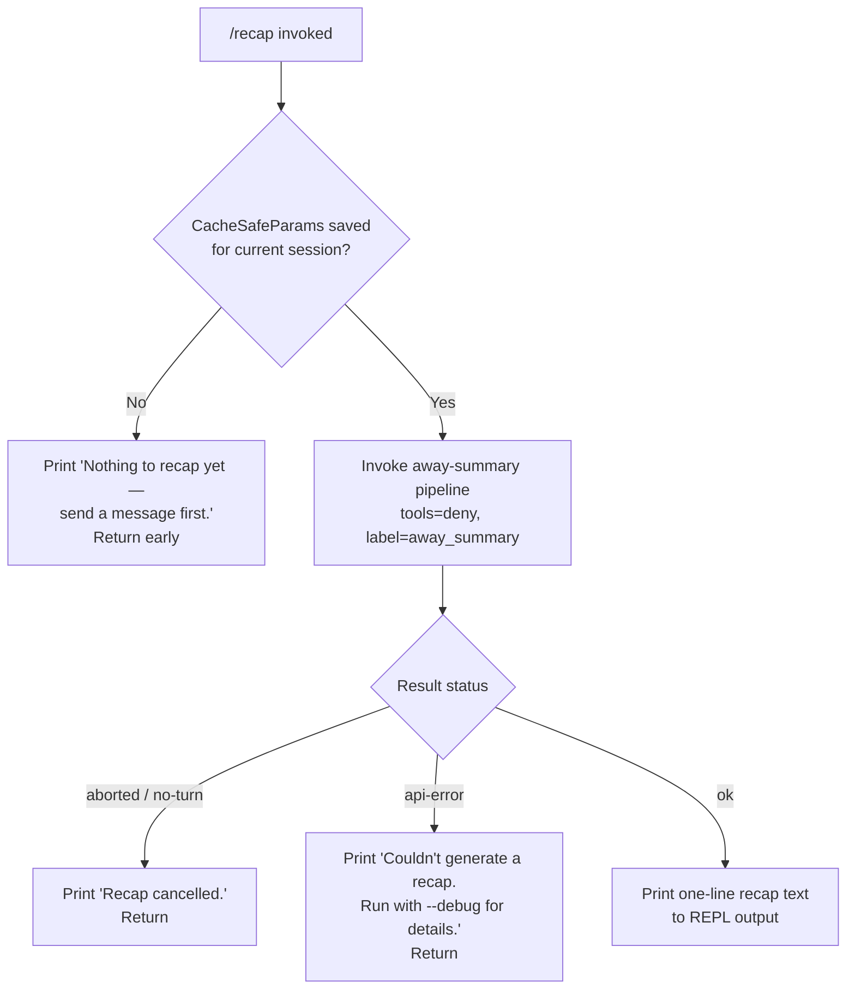

# `/recap`

> Analysis basis: CC v2.1.176 bundle.js (AST extraction + Claude interpretation)
> Minimum version: v2.1.176

---

## Overview

`/recap` triggers an on-demand, single-line summary of the current Claude Code session. It invokes the same away-summary pipeline used by the background summarization system, running a constrained model call (tools disabled, labelled `away_summary`) and displaying the resulting one-liner directly in the REPL. The command is non-interactive and does not persist any new conversation turn.

---

## Registration

| Field | Value |
|---|---|
| type | `local` |
| name | `recap` |
| description | `Generate a one-line session recap now` |
| loc_byte | `13327781` |
| loc_byte_end | `13327997` |
| loc_line | `9714` |
| supportsNonInteractive | `false` |
| thinClientDispatch | `post-text` |
| load_inline | `true` |
| load_ident | `a95` |
| arbor_handler.name | `a95` |
| arbor_handler.fqn | `claude-2.1.176::a95` |
| arbor_handler.kind | `AsyncFunction` |
| arbor_handler.resolution_path | `load_ident` |
| arbor_handler.n_hits | `0` |

Analysis basis: CC v2.1.176 bundle.js:+13327781

The handler was resolved via `load_ident`: the registration object contains an inline `load: () => Promise.resolve({ call: a95 })` shape. The Arbor symbol graph confirmed the target as `a95` (an `AsyncFunction`). Because `n_hits` is `0`, no secondary references to this symbol were found in the depth-2 traversal.

---

## Input Branching

Four distinct execution paths exist depending on session state and the outcome of the away-summary model call. A Mermaid flowchart is used.



Analysis basis: CC v2.1.176 bundle.js:+13327531 (no-session literal), +13327623 (cancelled literal), +13327681 (error literal), +6981545 (CacheSafeParams guard log), +6981603 (no-turn path), +6982063 (aborted path), +6982152 (api-error path), +6982213 (ok path)

---

## Behavioral Spec

### 1. Handler Entry (`a95`)

The top-level handler for `/recap` is the async function `a95`. It delegates immediately to the away-summary dispatcher (`Dh6`).

```
async function recapHandler(context):
    result = await awaySummaryDispatcher(context)
    // result contains { status, text }
    displayRecapResult(result)
```

Analysis basis: CC v2.1.176 bundle.js:+13327389

### 2. CacheSafeParams Guard (inside `Dh6`)

Before attempting a model call, the dispatcher checks whether a saved `CacheSafeParams` object is available for the current session. This object is required to reconstruct the conversation context without sending the full message history.

```
function awaySummaryDispatcher(context):
    params = loadCacheSafeParams(context.session)
    if params is null or undefined:
        log("[awaySummary] no CacheSafeParams saved, skipping")
        return { status: "no-turn", text: "Nothing to recap yet — send a message first." }

    abortController = new AbortController()
    context.onAbort(() => abortController.abort("abort"))
    result = await runAwaySummaryModelCall(params, abortController.signal)
    return result
```

Analysis basis: CC v2.1.176 bundle.js:+6981524 (log literal), +6981545 (log string), +6981603 (no-turn literal), +6981659 (abort literal), +6981640 (addEventListener), +6981671 (abort call)

### 3. Away-Summary Model Call (`mT` — main agent runner)

The away-summary model call is a constrained invocation of the main agent runner (`mT`). Key properties:

- The thread label is set to `"main"` (Analysis basis: CC v2.1.176 bundle.js:+10757283).
- The role of the seed message is `"assistant"` (Analysis basis: CC v2.1.176 bundle.js:+10756655).
- Tool use is explicitly denied: the tool-use policy is set to `"deny"`, and the literal `"Away summary cannot use tools"` is the policy rationale (Analysis basis: CC v2.1.176 bundle.js:+6981836, +6981851).
- The call is identified with the label `"away_summary"` to distinguish it from normal turns (Analysis basis: CC v2.1.176 bundle.js:+6981919).
- A unique request ID is generated via `randomUUID` / `randomBytes` (Analysis basis: CC v2.1.176 bundle.js:+10756366, +4248884).
- App state is read via `getAppState` and written back via `setAppState` after the call (Analysis basis: CC v2.1.176 bundle.js:+10754073, +10755237).

```
async function runAwaySummaryModelCall(params, signal):
    requestId = generateUUID()
    appState  = context.getAppState()
    sessionParams = buildSessionParams(params, { avoid_prompts: true })
    // "avoid_prompts" flag suppresses interactive prompt injection
    // Analysis basis: +10754303

    agentResult = await agentRunner({
        label:      "away_summary",
        thread:     "main",
        toolPolicy: "deny",
        signal:     signal,
        requestId:  requestId,
        params:     sessionParams
    })

    context.setAppState(updatedState)
    return agentResult
```

Analysis basis: CC v2.1.176 bundle.js:+10757350 (`RKH`), +10757094 (`xC8`), +10754303 (`avoid_prompts`)

### 4. Result Status Routing

After the model call returns, the dispatcher routes on the `status` field of the result. The three terminal status strings found at the `Dh6` callsite are `"aborted"`, `"api-error"`, and `"ok"`.

```
function displayRecapResult(result):
    match result.status:
        case "no-turn":
            print("Nothing to recap yet — send a message first.")
        case "aborted":
            print("Recap cancelled.")
        case "api-error":
            print("Couldn't generate a recap. Run with --debug for details.")
        case "ok":
            print(result.text)   // the one-line recap
```

Analysis basis: CC v2.1.176 bundle.js:+13327531, +13327623, +13327681, +6982063, +6982152, +6982213

### 5. Session Recap Persistence (`lff` — transcript writer)

During the model call the away-summary pipeline also exercises the transcript-writing subsystem (`lff`). This component:

- Resolves the transcript directory using `path.dirname` and `path.join` (Analysis basis: CC v2.1.176 bundle.js:+211129, +211159).
- Checks the byte length of the content via `Buffer.byteLength` (Analysis basis: CC v2.1.176 bundle.js:+211304).
- Rotates or renames existing `.txt` log files (Analysis basis: CC v2.1.176 bundle.js:+210525, +210514 `.endsWith`, +210577 `rename`).
- Appends the recap content via `fs.appendFile` (Analysis basis: CC v2.1.176 bundle.js:+210909).
- Manages a debounce timer via `clearTimeout` / `setTimeout` (Analysis basis: CC v2.1.176 bundle.js:+63598, +63762).
- Registers a cleanup handler via `DyA.register` (Analysis basis: CC v2.1.176 bundle.js:+65203).

The maximum log segment size tracked by the writer involves a 1024-unit boundary (Analysis basis: CC v2.1.176 bundle.js:+16884532) and a 40-character truncation limit for display names (Analysis basis: CC v2.1.176 bundle.js:+17009361).

### 6. Post-Turn Summary Hook (`g4H`)

After the model call completes, the component `g4H` is responsible for:

- Emitting the `post_turn_summary` state event (Analysis basis: CC v2.1.176 bundle.js:+10750897).
- Constructing the final output path via `path.join` and writing via `M_` / `S6` (Analysis basis: CC v2.1.176 bundle.js:+211858, +211867, +211883).

### 7. Debounced Output Writer (`AQH`)

The debounced line-writer used internally by the transcript system:

```
function debouncedWrite(lines, delay = 1000, maxBatch = 100):
    clearTimeout(pendingTimer)
    buffer.push(...lines)
    if buffer.length >= maxBatch:
        flushImmediate(buffer)
        buffer = []
    else:
        pendingTimer = setTimeout(flush, delay)
```

Constant `1000` ms debounce delay (Analysis basis: CC v2.1.176 bundle.js:+63486).  
Constant `100` max batch size (Analysis basis: CC v2.1.176 bundle.js:+63507).

### 8. Path Sanitisation (`bf`)

Internal helper that sanitises model-returned text before display:

- Replaces sensitive tokens with `"[REDACTED]"` (Analysis basis: CC v2.1.176 bundle.js:+202937).
- Normalises casing via `toUpperCase` / `toLowerCase` (Analysis basis: CC v2.1.176 bundle.js:+211710, +17009287).
- Truncates to the last occurrence of a separator using `lastIndexOf` + `slice` (Analysis basis: CC v2.1.176 bundle.js:+203021, +203047).

---

## State & Side Effects

| Item | Detail |
|---|---|
| Telemetry — query pipeline | `tengu_query_error`, `tengu_auto_compact_succeeded`, `tengu_auto_compact_rapid_refill_breaker`, `tengu_ptl_surfaced_to_user`, `tengu_refusal_fallback_triggered`, `tengu_refusal_fallback_suppressed`, `tengu_refusal_fallback_dialog_suppressed`, `tengu_refusal_fallback_prompt_shown`, `tengu_refusal_fallback_prompt_choice`, `tengu_fallback_credit_forfeited`, `tengu_model_fallback_triggered`, `tengu_model_response_keyword_detected`, `tengu_malformed_tool_use_retry_outcome`, `tengu_malformed_tool_use_response`, `tengu_orphaned_messages_tombstoned`, `tengu_convolute_arcades_retry`, `tengu_convolute_arcades_retry_outcome`, `tengu_refusal_fallback_supersedes`, `tengu_rotunda_pennant_applied`, `tengu_rotunda_pennant_tools` |
| Telemetry — agent loop | `tengu_stop_hook_block_count`, `tengu_loop_dynamic_wakeup_ends_turn`, `tengu_post_autocompact_turn`, `tengu_query_before_attachments`, `tengu_query_after_attachments`, `tengu_mcp_tools_refreshed_mid_turn`, `tengu_forked_agent_default_turns_exceeded`, `tengu_fork_agent_query` |
| Telemetry — feature flags | `tengu_feature_ok`, `tengu_feature_bad` |
| Telemetry — background daemon | `tengu_daemon_control`, `tengu_bg_proto_mismatch`, `tengu_bg_dispatch_stale_drop`, `tengu_bg_attach_legacy_autorespawn`, `tengu_bg_attach`, `tengu_bg_attach_stall_gave_up`, `tengu_bg_attach_stall_respawn`, `tengu_bg_attach_kick` |
| appState changes | `getAppState` is read before the model call; `setAppState` is called after the call completes. The `avoid_prompts` flag is set on the session params to prevent interactive prompt injection during the recap call. |
| Tool policy | Tool use is set to `"deny"` for the recap model call. Any tool-use attempt by the model is blocked with the rationale `"Away summary cannot use tools"`. |
| Abort / cancellation | An `AbortController` is created per invocation. The controller is wired to the session's abort event; if the user cancels mid-call the model stream is aborted and status `"aborted"` is returned. |
| Transcript write | The transcript-writing subsystem appends the recap output to the on-disk log file (`.txt`). File rotation is performed when the log exceeds the size threshold. |
| Hook registration | `DyA.register` is called to register a finalisation/cleanup handler for the transcript writer (Analysis basis: CC v2.1.176 bundle.js:+65203). |
| Sound | <!-- TODO: not found in depth-2 traversal; needs --depth 4 --> |
| Timer side effects | `setTimeout` / `clearTimeout` used by the debounced writer; `setImmediate` used for forced flush (Analysis basis: CC v2.1.176 bundle.js:+63762, +63598, +63855). |

---

## Version History

| Version | Change |
|---|---|
| v2.1.176 | Initial analysis |

---

## Common Mistakes

1. **Running `/recap` before sending any message.** The command guards against an empty session by checking for a saved `CacheSafeParams` object. If none exists (i.e. no conversation turn has occurred yet), it prints `"Nothing to recap yet — send a message first."` and exits immediately without making a model call.

2. **Expecting a multi-sentence summary.** The command description says "one-line" and the underlying model call is configured for a minimal away-summary. The output is a single short line, not a detailed summary.

3. **Expecting tool use inside a recap.** Tool use is explicitly denied for the recap model call. Any configuration that normally enables tools is overridden for this command.

4. **Using `/recap` in non-interactive mode.** `supportsNonInteractive` is `false`. The command will not execute correctly when invoked from a non-interactive (headless) Claude Code invocation.

5. **Interpreting a missing recap as an error.** If the model call is aborted (e.g. by pressing Ctrl+C), the command prints `"Recap cancelled."` with a `0` exit path, not an error. Only `"Couldn't generate a recap..."` indicates an actual API failure.

---

## Appendix — Identifier Mapping

> For bundle debugging only. Identifiers change across versions.

| Identifier | Role |
|---|---|
| `a95` | Top-level `/recap` command handler (AsyncFunction, resolved via `load_ident`) |
| `Dh6` | Away-summary dispatcher — guards CacheSafeParams, wires AbortController, routes result status |
| `e9H` | CacheSafeParams loader (called from away-summary dispatcher) |
| `N` | Session context / conversation state accessor |
| `gff` | Intermediate session setup helper called by `N` |
| `JyA` | Sub-helper within session setup; calls `c9f` and `l9f` |
| `H` | Generic utility / host object (context-dependent: timer, stream, or state depending on callsite) |
| `CH` | JSON serialisation utility (`JSON.stringify` wrapper) |
| `_` | Generic utility (toUpperCase at +211710; load at +5032283) |
| `bf` | Text sanitiser / truncator for model output |
| `ikA` | Internal map/transform helper used by `bf` |
| `q` | Data accessor with `.at` / `.add` / `.delete` members |
| `A` | Lowercase-normalising string container |
| `kQH` | File write coordinator (calls `mkA`) |
| `mkA` | Low-level file write wrapper (`H.write`) |
| `lff` | Transcript write manager — handles path resolution, rotation, append, and cleanup registration |
| `AQH` | Debounced line-writer (1000 ms delay, 100-item batch cap) |
| `g4H` | Post-turn summary emitter; constructs output path and writes summary |
| `Q6` | Path / directory utility called during transcript setup |
| `r$6` | Error-code classifier (maps `EISDIR` etc.) |
| `skA` | Path-join helper for transcript file path construction |
| `dH_` | File rotation helper (stat → rename/unlink for `.txt` files) |
| `cff` | Append-and-rotate writer (mkdir + appendFile + rotation) |
| `u9` | Cleanup/finaliser registration (`DyA.register`) |
| `mT` | Main agent runner — executes the constrained away-summary model call |
| `xC8` | Agent session initialiser (UUID gen, getAppState, setAppState, avoid_prompts) |
| `pI` | Protocol/provider selector (`GK`, `Cv9`) |
| `dMH` | State dump/load utility (`Nx`, `_.load`, `H.dump`) |
| `b2H` | Session parameter builder |
| `Fl9` | Model selector / fallback logic |
| `M` | Message queue manager (get/set/values, calls `N`) |
| `uu8` | Token usage tracker |
| `XR` | Request-ID generator (randomBytes hex, 8 bytes = 16 hex chars) |
| `uC8` | Agent loop configuration builder |
| `RKH` | Turn orchestrator (calls `P4` for tool registry, `fUH` for filtering) |
| `P4` | Tool registry builder |
| `fUH` | Tool filter (filters by `ant` provider, `cd8`, `Ac8`, `A45`) |
| `dU` | Turn dispatcher / message router |
| `pNL` | Core query-and-response loop (model call + tool execution + compaction) |
| `gx8` | Subagent cache cleanup (`eU.delete`, `O4A.delete`, `mx6.delete`) |
| `IH` | Feature-flag positive reporter (`tengu_feature_ok`) |
| `bH` | Feature-flag negative reporter (`tengu_feature_bad`) |
| `hE` | Session health / heartbeat check |
| `zu6` | Tool-use-summary gate (`eNL.has`) |
| `L6H` | Logging / diagnostics helper |
| `Uu8` | Usage metrics collector |
| `fnq` | Follow-up notification dispatcher (calls `zu6`) |
| `Y` | Process exit handler (`EX`, `process.exit`, `z.abort`) |
| `EX` | Exit code mapper |
| `z` | Daemon / subprocess controller (IH, bH, gS, hB) |
| `p3H` | Pending-turn filter and push helper |
| `AX` | Turn list accessor |
| `dm7` | Turn finder (`H.find`) |
| `f` | Promise tracker set (`q.add`, `L.finally`, `q.delete`) |
| `d` | Core async dispatcher / scheduler |
| `HhL` | Forked-agent query handler (`tengu_fork_agent_query`) |
| `eH` | Error formatter / emitter (`nM6`) |
| `U8` | Subagent spawner (`Zk.randomUUID`, `X`) |
| `P` | IPC pipe manager (`Buffer.concat`, `mL`, `qI5`) |
| `X` | Session multiplexer (`M`, `q.setTimeout`) |
| `j` | Process registry (`A.values`, `S.kill`) |
| `mL` | Pipe end/close helper (`H.end`, `CH`) |
| `qI5` | Full daemon IPC message handler (covers all daemon op-codes) |
| `TH` | String coercion utility |
| `Se9` | Result flattener (`H.flatMap`) |