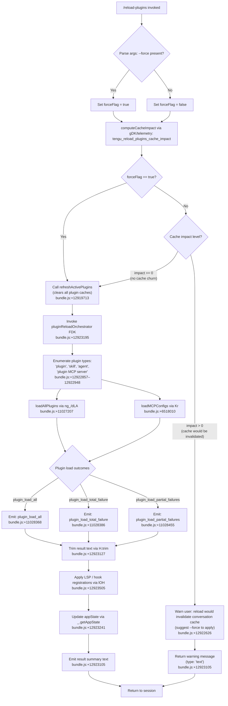

# `/reload-plugins`

> Analysis basis: CC v2.1.176 bundle.js (AST extraction + Claude interpretation)
> Minimum version: v2.1.176

---

## Overview

`/reload-plugins` activates pending plugin changes (MCP servers, hooks, LSP servers, and skill agents) in the current Claude Code session without requiring a full restart. It supports an optional `--force` flag that bypasses the cache-impact guard, forcing all plugin caches to be cleared and the entire conversation context to be rebuilt from scratch rather than using cached data.

---

## Registration

| Field | Value |
|---|---|
| type | `local` |
| name | `reload-plugins` |
| description | `Activate pending plugin changes in the current session` |
| argumentHint | `[--force]` |
| supportsNonInteractive | `false` |
| thinClientDispatch | `control-request` |
| module_id | `QDK` |
| load_inline | `true` |
| loc_byte | `12924043` |
| loc_byte_end | `12924287` |
| loc_line | `9145` |
| arbor_handler.name | `MH5` |
| arbor_handler.fqn | `claude-2.1.176::MH5` |
| arbor_handler.kind | `AsyncFunction` |
| arbor_handler.resolution_path | `module_id` |
| arbor_handler.n_hits | `0` |

Analysis basis: CC v2.1.176 bundle.js:+12924043

---

## Input Branching

The command has four distinct branches based on the presence of the `--force` flag and the cache-impact level detected at runtime.



---

## Behavioral Spec

### Handler Entry Point (`MH5`)

`MH5` is the async handler for `/reload-plugins`, resolved via `module_id` → `QDK`.

```
async function reloadPluginsHandler(context):
    args = context.args.trim()                          // bundle.js:+12923127
    forceFlag = args.includes("--force")                // bundle.js:+12923163, +12923178

    cacheImpact = computeCacheImpact(context)           // bundle.js:+12922035 (tengu_reload_plugins_cache_impact)

    if not forceFlag and cacheImpact > 0:
        return warningMessage(
            "...the whole conversation instead of using the cache. "
            "Run /reload-plugins --force to apply."        // bundle.js:+12922626
        )

    refreshActivePluginCaches()                         // bundle.js:+12919713
    results = invokePluginReloadOrchestrator(context)   // bundle.js:+12923195
    applyLSPAndHookRegistrations(context, results)      // bundle.js:+12923505
    updateAppState(context)                             // bundle.js:+12923241

    summary = buildSummaryText(results)                 // bundle.js:+12923401, +12923473, +12923505, +12923548
    return { type: "text", content: summary }           // bundle.js:+12923105
```

Analysis basis: CC v2.1.176 bundle.js:+12922741–12923548

---

### Cache Impact Assessment (`gDK`)

```
function computeCacheImpact(context):
    // Inspects the current conversation state to determine
    // how many cached context tokens would be invalidated
    // if plugin reload proceeds without --force.
    // Emits telemetry: tengu_reload_plugins_cache_impact
    impact = assessCacheChurn(context.messages)         // bundle.js:+12922035
    return impact   // 0 = safe, >0 = would cause cache miss
```

Analysis basis: CC v2.1.176 bundle.js:+12922033

---

### Active Plugin Cache Refresh (`$zH`)

```
async function refreshActivePlugins():
    log("refreshActivePlugins: clearing all plugin caches") // bundle.js:+12919713
    clearInstalledPluginsCache()                            // bundle.js:+10952673
    clearSkillIndexCache()                                  // bundle.js:+13515004
    clearPluginRootCache()                                  // bundle.js:+10886178 (xp → Tu6.clear)

    pluginDefs = await Promise.all([                        // bundle.js:+12919820
        loadKnownMarketplaceDefs(),                         // bundle.js:+12919765
        loadLocalPluginManifests(),                         // bundle.js:+12919776, +12919794
    ])

    toolSetsAdded   = computeToolDiff(pluginDefs, "added")   // bundle.js:+12920389 (fH5)
    toolSetsRemoved = computeToolDiff(pluginDefs, "removed")  // bundle.js:+12920422 (LH5)

    xW8MergeExtensionMap(pluginDefs)                         // bundle.js:+12920306
    emitPluginChangeEvent()                                  // bundle.js:+12920819 (vR.emit)

    return { toolSetsAdded, toolSetsRemoved }
```

Analysis basis: CC v2.1.176 bundle.js:+12919711–12920819

---

### Plugin Reload Orchestrator (`FDK`)

`FDK` coordinates the full reload: it checks existing plugin state, walks plugin types, and fans out to type-specific loaders.

```
async function pluginReloadOrchestrator(context):
    existingState = checkExistingPluginState()   // bundle.js:+12921809 (FDK → _.has)

    for pluginType in ["plugin", "skill", "agent", "plugin MCP server"]:
        // bundle.js:+12922857, +12922888, +12922916, +12922948
        result = await loadPluginsByType(pluginType, context)
        results.push(result)

    formattedLine = results.join(" · ")          // bundle.js:+12922975
    if any result has "error":                   // bundle.js:+12923030
        formattedLine += errorDetails

    return formattedLine
```

Analysis basis: CC v2.1.176 bundle.js:+12921759–12921919

---

### Plugin Loader — All Plugins (`dLA`)

Called by `ng_` for the "all plugins" load path. Handles parallel loading, records telemetry events for outcomes, and detects if `originalCwd` changed mid-scan.

```
async function assemblePluginLoadResult(pluginList, cwd):
    outcomes = await Promise.all(pluginList.map(loadOnePlugin))  // bundle.js:+11027788

    if originalCwd changed mid-scan:                             // bundle.js:+11028521
        log("assemblePluginLoadResult: originalCwd changed mid-scan; skipping side-effects (stale early-kick)")
        return earlyKickResult

    emit("plugin_load_all",              count=outcomes.total)   // bundle.js:+11028368
    emit("plugin_load_total_failure",    count=failures.total)   // bundle.js:+11028386
    emit("plugin_load_partial_failures", list=partial)           // bundle.js:+11028455

    return buildLoadResult(outcomes)
```

Analysis basis: CC v2.1.176 bundle.js:+11027207–11028492

---

### MCP Configuration Loader (`Kr`)

Responsible for reading and merging MCP server configurations from multiple settings layers: `projectSettings`, `userSettings`, `localSettings`, and `mcpAutoDiscovered`.

```
async function loadMCPConfigs():
    sources = [
        readProjectSettings(),    // bundle.js:+6516284 "projectSettings"
        readUserSettings(),       // bundle.js:+6516307 "userSettings"
        readLocalSettings(),      // bundle.js:+6516328 "localSettings"
        readAutoDiscovered(),     // bundle.js:+6518013 "mcpAutoDiscovered"
    ]

    allConfigs = merge(sources)

    // Walk each entry and spawn/update MCP server processes as needed
    for [serverName, serverConfig] in Object.entries(allConfigs):   // bundle.js:+6518170
        approval = checkApprovalStatus(serverName)                  // bundle.js:+6518970 "approved" / +6518997 "pending"
        if approval == "approved":
            spawnOrUpdateServer(serverConfig)                       // bundle.js:+6518939 (xX)
        else:
            queuePendingServer(serverConfig)

    return combinedMCPState
```

Analysis basis: CC v2.1.176 bundle.js:+6518010–6519994

---

### LSP and Hook Registration (`lOH`)

After plugin loading completes, `lOH` registers language-server (LSP) configurations and plugin hook callbacks into the running session.

```
async function applyLSPAndHookRegistrations(context, loadResults):
    // Resolve plugin roots and skill registrations
    pluginRoots = resolvePluginRoots(loadResults)               // bundle.js:+12062416–12062474

    for plugin in loadResults.plugins:
        if plugin has LSP config:
            registerLSPServer(plugin.lspConfig)                 // bundle.js:+12063236 (UFL)
        if plugin has hooks:
            registerHooks(plugin.hooks)                         // bundle.js:+12062601 ($RH)

    // Merge tool namespaces, detect conflicts
    for [ext, providers] in extensionMap:
        if providers.length > 1:
            recordConflict(ext, providers)                      // bundle.js:+6826291 "lsp-extension-conflict"

    // Update global plugin/hook state
    updatePluginStateStore(loadResults)                         // bundle.js:+12062956 (AB)
    return registrationSummary
```

Analysis basis: CC v2.1.176 bundle.js:+12062416–12063471

---

### Result Summary Builder (`$H5`, `g1H`)

Produces the human-readable output text shown to the user after reload completes.

```
function buildSummaryText(results):
    // $H5: splits result record into typed segments
    segments = results.fullText.split(delimiter)                // bundle.js:+12922523

    // g1H: maps segments to display lines
    lines = segments
        .map(seg => formatSegment(seg))                         // bundle.js:+4326880
        .filter(line => line.length > 0)

    return lines.join("\n")
```

Analysis basis: CC v2.1.176 bundle.js:+12922523, +12923401, +12923548, +4326880

---

## State & Side Effects

| Item | Detail |
|---|---|
| Telemetry | `tengu_reload_plugins_cache_impact` (bundle.js:+12922035); `tengu_plugin_state_file_error` (bundle.js:+10952852); `tengu_feature_ok` / `tengu_feature_bad` / `tengu_feature_sad` (bundle.js:+1018758, +1018825, +1018906) |
| Plugin cache cleared | Installed-plugins cache, skill-index cache, plugin-root cache — all cleared on every invocation (bundle.js:+12919713, +13515004, +10886178) |
| Hook registration | Plugin hooks re-registered via `lOH` after each reload (bundle.js:+12062601) |
| LSP servers | LSP server configurations re-applied; extension-conflict detection runs (bundle.js:+12063236, +6826291) |
| appState changes | `_.getAppState()` queried and updated post-reload (bundle.js:+12923241) |
| MCP server processes | MCP servers re-spawned or updated from merged settings layers (bundle.js:+6518939) |
| Conversation cache | If `--force` is omitted and cache impact > 0, no reload occurs; a warning is returned instead (bundle.js:+12922626) |
| Sound | <!-- TODO: not found in depth-2 traversal; needs --depth 4 --> |
| Event emission | `vR.emit` fires a plugin-change event after cache refresh (bundle.js:+12920819) |

---

## Version History

| Version | Change |
|---|---|
| v2.1.176 | Initial analysis |

---

## Common Mistakes

1. **Omitting `--force` when plugin changes are not being applied**: If there is an active conversation with cached context, `/reload-plugins` without `--force` will only warn the user that the reload would invalidate cache, and will not actually perform the reload. Always use `--force` when you specifically intend to clear plugin caches mid-conversation.

2. **Expecting non-interactive use**: `supportsNonInteractive` is `false`, so `/reload-plugins` cannot be driven from headless or piped sessions. Running it in non-interactive mode will not execute the handler.

3. **Assuming instant MCP reconnection**: The reload orchestrates re-connection of MCP servers from configuration, but servers with `"pending"` approval status will not be launched immediately — they remain queued until approved.

4. **Confusing scope of reload**: `/reload-plugins` reloads all registered plugin types (plugin, skill, agent, plugin MCP server) simultaneously. There is no single-type reload option in this command version.

5. **Overlooking the `thinClientDispatch: "control-request"` behavior**: In thin-client deployments, the command is forwarded as a control-request rather than being handled locally, which may have different latency and feedback characteristics than in a standard local session.

---

## Appendix — Identifier Mapping

> For bundle debugging only. Identifiers change across versions.

| Identifier | Role |
|---|---|
| `MH5` | Main async handler for `/reload-plugins` (arbor_handler) |
| `hj` | Helper called early in handler; likely argument-parsing utility |
| `L7` | Low-level utility called from handler and `hj` |
| `NvH` | Utility called from `L7` |
| `Fo` | Wrapper calling `m8`; likely output/display helper |
| `m8` | Core output primitive |
| `FDK` | Plugin reload orchestrator; fans out to type-specific loaders |
| `cg_` | MCP state coordinator; calls `ng_`, `Kr`, adds to queue |
| `UwH` | Utility called from `cg_` |
| `ng_` | Plugin load dispatcher; calls `dLA` and `QLA` |
| `dLA` | Assembles plugin load result; emits plugin_load_all / failure telemetry |
| `QLA` | Marketplace-aware plugin load path; handles cache-miss / blocked-by-policy cases |
| `Kr` | MCP configuration loader; reads and merges all settings layers |
| `Tf` | Sub-utility of `Kr`; calls `SK` and `XL` |
| `wP` | Reads `.mcp.json` config files from project/user/local paths |
| `ue` | Parses individual MCP server config entries |
| `uD` | Policy-settings checker (reads `policySettings`) |
| `HY` | Helper within `Kr` |
| `N` | General text/string normalizer (uppercase, trim, includes checks) |
| `q28` | MCP server entry processor |
| `mtH` | Metadata helper used by `Kr` and `xe` |
| `D` | Background session / process manager (spawn, kill, freemem) |
| `Y` | Process exit / abort controller |
| `EZ` | MCP update dispatcher calling `Jw` and `Fg_` |
| `jl9` | Plugin state cache map manager |
| `w` | Supervisor/daemon config update runner |
| `I` | Session record accessor |
| `q` | Unix-socket / IPC client connector |
| `u1` | CLI-error exit helper |
| `A` | Name-case normaliser (toLowerCase) |
| `L` | Connection close handler |
| `f` | Promise-tracking set helper |
| `Hh` | HIPAA / safe-mode guard; calls `pu_`, `N`, `o_`, `M7` |
| `pu_` | Prompt-style resolver (standard / tst / auto) |
| `ZkH` | A6 / HIPAA flag checker |
| `mu_` | `auto:N` concurrency-level parser |
| `hM7` | `auto` prefix detector |
| `A6` | String boolean coercer (`yes`/`on`/`no`/`off`) |
| `PK` | String boolean coercer (alternate) |
| `o_` | Provider-type detector (bedrock/foundry/vertex/etc.) |
| `M7` | Prompt renderer calling `p18` |
| `p18` | Low-level prompt helper calling `snH` |
| `Ye` | Lowercase + includes utility for provider/flag checks |
| `IM7` | Tool-search feature-flag gate |
| `$6` | Tool-search availability cache |
| `DD` | Token-usage counter (outputTokens) |
| `gDK` | Cache-impact assessor; emits `tengu_reload_plugins_cache_impact` |
| `d` | Base logging / error emit primitive |
| `$H5` | Result-text splitter (splits on delimiter into typed segments) |
| `$zH` | Active-plugin cache refresh coordinator; clears all caches, diffs tools |
| `Irq` | Normalizer helper used by `$zH` |
| `m$` | Plugin-root and skill-index cache clearing orchestrator |
| `GIL` | Plugin subsystem initialiser |
| `BW` | Plugin state broadcaster |
| `vm8` | Plugin registry helper |
| `Zm8` | Plugin registry helper (alternate) |
| `GJ8` | Plugin registry helper |
| `Sp_` | Safe-mode hook registration guard |
| `kH` | Error logging helper (Ms.logError) |
| `_28` | Plugin init helper |
| `NLA` | Plugin init helper |
| `Yrq` | Plugin init helper |
| `Av` | Skill-index cache updater |
| `YU` | Clears skill index cache; calls `l$A` and `H.clearSkillIndexCache` |
| `qrq` | Registry helper called from `Av` |
| `mpH` | Post-update hook for skill index |
| `yOH` | Zm8-dependent helper |
| `Zu_` | Plugin cache cleanup helper |
| `xp` | `Tu6.clear` cache-clear wrapper |
| `b_q` | Plugin dependency resolver helper |
| `Pe9` | Plugin state persistence helper |
| `T_` | eG-based terminal / stream wrapper |
| `K` | Padding/formatting helper (`padEnd`) |
| `xe` | MCP config file scanner (`.mcpb`, `.dxt`, directory walk) |
| `KQ` | Extension suffix checker (`endsWith .mcpb/.dxt`) |
| `w_H` | MCP config path helper |
| `Cg_` | MCP bundle reader/extractor (reads manifest.json, utf-8) |
| `Q6` | Base path resolver |
| `k8` | Error-code classifier (`E8`-based) |
| `c6` | JSON.parse wrapper |
| `sc9` | MCP server scanner; classifies by status (http/download/network/manifest) |
| `uv6` | MCPB archive extractor; reads manifest.json, computes md5 hash |
| `TH` | String coercer |
| `$bH` | LSP config file reader (`.lsp.json`) |
| `Pk7` | LSP config entry validator and expander |
| `Xk7` | Path relativiser/validator for LSP config |
| `$` | Conversation-turn accumulator |
| `kPK` | Daemon status file writer (`daemon.status.json`) |
| `Cs` | zLH-based serialisation helper |
| `l9` | AsyncLocalStorage store reader |
| `dU6` | IPK path joiner |
| `CH` | JSON.stringify wrapper |
| `O` | Background-session m8-based manager |
| `xW8` | LSP extension-conflict mapper (toLowerCase) |
| `M` | MCP update applier; calls `LbH` (connect) and `Ho8` (apply update) |
| `LbH` | MCP server connection orchestrator |
| `Ho8` | Applies an MCP server update to live connection |
| `vZA` | MCP state diff and apply helper |
| `fH5` | Added-tool-set filter/mapper |
| `BDK` | Added-tool set builder |
| `LH5` | Removed-tool-set filter/mapper |
| `rMH` | Hook registration validator; checks safe-mode flag |
| `SK` | A6/dc6-based setting accessor |
| `dc6` | Setting key lookup |
| `lOH` | LSP and hook registration orchestrator post-reload |
| `vv` | Plugin marketplace manifest loader (TM) |
| `TM` | Known-marketplaces.json reader |
| `Rm8` | t7.join path helper |
| `$RH` | Hook definition expander |
| `I8` | Tool/hook schema parser |
| `Pe6` | Plugin entry validator |
| `Tb` | Hook/tool type dispatcher |
| `sV` | Error constructor wrapper |
| `$1` | Plugin source string splitter (includes/split) |
| `DP` | Plugin dependency-resolution dispatcher |
| `Kt9` | Git URL parser (indexOf/slice on `://`) |
| `aN6` | Plugin source type router (A08 / ft9 / Lt9 / zS7) |
| `A08` | I8-based source validator |
| `ft9` | File/directory source handler (Zc_) |
| `Lt9` | Local path source handler |
| `zS7` | GitHub/npm source handler |
| `i9H` | I8-based dependency inspector |
| `$t9` | Plugin dependency tree resolver |
| `qt9` | ZD-based cycle detector |
| `AB` | Plugin marketplace.json loader |
| `Su6` | .claude-plugin path resolver |
| `yLA` | marketplace.json JSON parser with safeParse |
| `E8` | ENOTDIR/base error code handler |
| `NZ` | Settings JSON loader (kLA + TM path) |
| `kLA` | Local plugin settings reader |
| `UFL` | LSP conflict set checker (`q.has`) |
| `gu6` | Plugin subsystem state manager (large orchestrator) |
| `YG` | I8-based plugin entry loader |
| `gm8` | Plugin $1/DP dependency manager |
| `fD6` | Local-source path prefix checker (`./`) |
| `z` | App-state write/read pair (IH/bH) |
| `IH` | State writer (d/eH) |
| `bH` | State reader (d/eH) |
| `gS` | Daemon-push helper |
| `hB` | Process-exit race helper |
| `x6` | Context store reader (bs6/T_) |
| `bs6` | Cs6.getStore + pc accessor |
| `Vv` | Plugin state file loader (SLA/RLA) |
| `SLA` | Plugin JSON file reader (readFileSync) |
| `RLA` | Plugin entry expander (Object.entries / Ek) |
| `xu6` | GL/d plugin state reader |
| `J` | D-based job set |
| `G` | Key-event / input handler (large VI-mode dispatcher) |
| `T` | uN6/jM6 terminal helpers |
| `tc` | kY key-binding helper |
| `j` | Process kill helper (A.values / S.kill) |
| `lRK` | VI operator: find (AY5/qY5/KY5/fY5/LY5) |
| `hRK` | VI operator: yank (zn8/On8/NRK/recordChange) |
| `SRK` | VI operator: visualReplace |
| `bRK` | VI operator: visualCase |
| `b` | Session conversation-buffer manager |
| `uRK` | VI operator: visualPaste |
| `ZRK` | VI operator: indent (Math.min/max, setText/setOffset) |
| `VRK` | VI operator: visualIndent |
| `P` | PTY data reader (Buffer.concat, readUInt32BE) |
| `l0A` | VI text-object dispatcher (lw5/nw5/iw5/…) |
| `S` | Command executor (kH/ZI5/w.write) |
| `cN` | Plugin scope validator ($1/ST) |
| `ST` | Scope type checker |
| `xY8` | Semver validator (Zi.valid/coerce/satisfies) |
| `C29` | Plugin dependency conflict checker |
| `zN` | Flag-settings set helper |
| `m36` | Flag-settings primitive |
| `mrq` | Dependency queue manager |
| `C` | clearTimeout / O.write pair |
| `x` | Timeout / stream-end helper |
| `zA` | Settings write orchestrator (Tb/Kz/Nt6/EY6/…) |
| `n3` | JDH/Tb settings helpers |
| `_L_` | Settings-file path resolver (PaA/JDH/WF/JaA/$s) |
| `_W` | Os-based path helper |
| `z7_` | Rt6.set timestamp setter |
| `ZhH` | Je6/Tb settings entry helper |
| `EY6` | Atomic file write with symlink resolution |
| `Kz` | Cache-clear pair (Ac6.clear / ra8.clear) |
| `Nt6` | Gitignore/settings write helper |
| `Tm` | Fy.join path helper |
| `n6` | d/eH log pair |
| `GF` | Settings load orchestrator (tG/fq/AL_/Tb/qc6) |
| `Bu6` | Plugin path safety checker (startsWith) |
| `c` | Session loop manager (large) |
| `F` | clearTimeout / output writer |
| `X` | M / q.setTimeout pair |
| `jZ6` | IeH / HM7.test token matcher |
| `kj8` | IeH / hZ9 token matcher (alternate) |
| `iiK` | Boolean coercer |
| `B` | Output spinner/timer (F/clearTimeout/setTimeout/w.write) |
| `C8H` | _.has set membership checker |
| `Y9H` | C8H/bRH filter helper |
| `zH` | process.exit gated state store |
| `DH` | Main session coordinator (large; manages models, tools, conversation flow) |
| `aF8` | T_ / A.some async helper |
| `yT` | Terminal multiplexer type detector (tmux/dcs/raw/screen/none) |
| `n` | Key i.preventDefault handler |
| `z$` | Session state accessor |
| `g$H` | Live-sessions lister (A.listAllLiveSessions) |
| `TKH` | Session resume orchestrator |
| `K6` | nM6 counter |
| `x_` | Module bootstrap (_vH/Ga8/Xd6/Pd6/q8f/oVA) |
| `mH` | Tombstone/persisted-removal handler |
| `gH` | Tool-suggestion UI helper |
| `X4` | crypto.randomUUID wrapper |
| `TJ` | _yA/HyA async helper pair |
| `VY` | Session state flag |
| `Pg6` | Project-file rename helper (Iu.join/on8.rename) |
| `ho` | P4-based helper |
| `_I8` | dHA/N36 helper pair |
| `qUH` | P4-based helper (alternate) |
| `gzH` | Session start/gc helper |
| `Eg6` | Session helper |
| `XFH` | K/vY/fL/GuK session frame helper |
| `PFH` | nJ5/jD/sn8 session helper |
| `xH` | YBH/K/q session context accessor |
| `QH` | NH.slice / Promise.resolve conversation-history helper |
| `Tg6` | Session transition helper |
| `_n` | KX6/Date.now timing helper |
| `UfH` | P4-based (third instance) |
| `Zg6` | Session startup (process.chdir, WV, az, uT, Gl, $J) |
| `pfH` | P4/dM/nK.utimes/reAppendSessionMetadata helper |
| `eH` | nM6 error emitter |
| `JA` | Error/String thrower |
| `uH` | UI rendering pipeline (JGA/XGA/GGA/PGA) |
| `JGA` | bb/F1/ID UI segment builder |
| `XGA` | vbK/bH/IH UI segment builder |
| `GGA` | B56/wg6 UI segment builder |
| `PGA` | vbK UI segment builder |
| `JH` | MCP client connection tracker |
| `oY` | x_/q/uU_ session accessor |
| `a` | MCP update applier (applyMcpUpdate/fbH/n.push/o.push) |
| `MH` | Session state finaliser |
| `$E6` | Version-range validator (Zi.validRange/minVersion) |
| `SC_` | Version constraint normaliser |
| `Um8` | uLA-based plugin loader |
| `uLA` | QPH-based plugin update helper |
| `pu6` | uLA-based plugin loader (alternate) |
| `Fm8` | Plugin version/semver resolver (pm8.clean/maxSatisfying) |
| `dIL` | Plugin dependency init helper |
| `p8` | n_/x6 context helper |
| `pg` | Number/String type validator |
| `Bm8` | pu6 / _.replace plugin path normaliser |
| `Fu6` | Plugin install/uninstall filesystem orchestrator |
| `v46` | Plugin build runner (TEH/Koq/aIL/Hoq/rIL/Aoq/qoq) |
| `bm8` | RY6-based build result handler |
| `Brq` | Build helper |
| `iKH` | Plugin hash computation (sha256, brq.createHash) |
| `Ek` | lm8/uW plugin extraction helper |
| `mm8` | Plugin directory scanner (Crq.readdir, package.json, yarn.lock) |
| `Td` | A6-based type descriptor |
| `yEH` | Ek-based post-extract helper |
| `hm8` | JIL/Nm8/gZ.rm cleanup helper |
| `CLA` | Plugin cache list updater (Vv/f.findIndex/uu6) |
| `Q` | IPC socket manager (l.on/once/connect/destroy/process.kill) |
| `l` | Fm6/j_K IPC stream pair |
| `lZ` | y_K reconnect helper |
| `hv` | Buffer frame encoder (writeUInt32BE/writeUInt8) |
| `up8` | Buffer frame decoder (readUInt32BE/readUInt8/subarray) |
| `i` | o.write / LI5 / P.write output pair |
| `o` | Ol8-based output stream |
| `LI5` | H.includes / H.replace ANSI filter |
| `wH` | MCP session message handler (large; qd8/fH/YH/Q/i/t) |
| `qd8` | WebSocket-based voice/MCP transport handler |
| `fH` | MCP SDK message router (handleElicitation, JH.has) |
| `X25` | Session helper within wH |
| `YH` | MCP client state tracker (sendMcpMessage, cleanup, Ka9) |
| `t` | W.current / c.setTimeout / N / o timeout helper |
| `Vi8` | CVH.push / Date.now timing recorder |
| `NH` | PH / yL5 notification helper |
| `XH` | wH.has/add / z8 / EA.then MCP list-changed handler |
| `z8` | ycH.push / Ms.logMCPDebug MCP debug logger |
| `EA` | t.push / dH deferred executor |
| `j_` | d/K6 variant of XH handler |
| `Wm` | qf-based helper |
| `VH` | m9H/RH/d66 MCP connection pool manager |
| `m9H` | MCP HTTP/OAuth server lifecycle manager |
| `RH` | H-based MCP response handler |
| `d66` | E28.set/get/delete promise-tracking helper |
| `cIL` | Plugin install-check orchestrator (cN/$1/NZ) |
| `e` | MCP update event processor (bg/P.filter/J86/kW8/vZA) |
| `bg` | Promise.all combinator (TypeError/Number.isSafeInteger) |
| `J86` | parseInt-based MCP version parser |
| `kW8` | parseInt-based MCP version parser (alternate) |
| `qH` | e/AH/E/y MCP client handle |
| `fbH` | SWH-based MCP feedback helper |
| `dN` | ODH.has / H.toLowerCase plugin-scope validator |
| `V$` | A6-based value formatter |
| `sf` | KRH / s36 plugin settings writer |
| `KRH` | OTEL metrics / plugin settings accessor |
| `s36` | Settings entry writer |
| `cs8` | Settings change emitter |
| `ls8` | Settings post-write helper |
| `LH` | i.trim / D / M / F / B input display handler |
| `g1H` | Result-text line formatter ($1/q.join/q.slice/m8) |