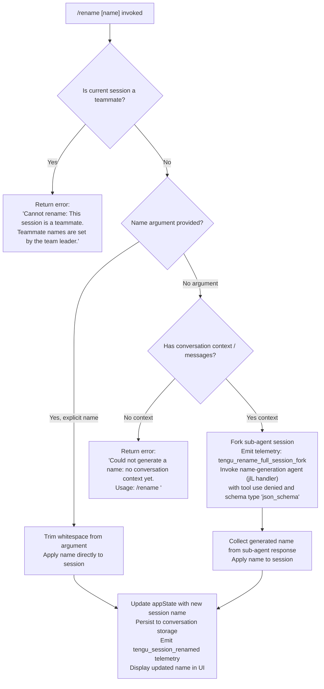

# `/rename`

> Analysis basis: CC v2.1.176 bundle.js (AST extraction + Claude interpretation)
> Minimum version: v2.1.176

---

## Overview

The `/rename` command renames the current conversation session. When invoked with an explicit name argument, it applies that name directly; when invoked without an argument, it uses a forked agent sub-session to auto-generate an appropriate name from the conversation context. The command is also aliased as `/name`.

---

## Registration

| Field | Value |
|---|---|
| type | `local-jsx` |
| name | `rename` |
| description | `Rename the current conversation` |
| argumentHint | `[name]` |
| immediate | `true` |
| aliases | `["name"]` |
| module_id | `U7K` |
| load_inline | `true` |
| loc_byte | `12353130` |
| loc_byte_end | `12353329` |
| loc_line | `8431` |
| arbor_handler.name | `JlL` |
| arbor_handler.kind | `AsyncFunction` |
| arbor_handler.fqn | `claude-2.1.176::JlL` |
| arbor_handler.resolution_path | `module_id` |
| arbor_handler.n_hits | `0` |

Analysis basis: CC v2.1.176 bundle.js:+12353130

---

## Input Branching

The command has four distinct branches based on session type and whether a name argument is provided, requiring a Mermaid flowchart.



Analysis basis: CC v2.1.176 bundle.js:+12352294 (teammate guard), +12352505 (no-context error), +12350969 (fork telemetry), +12352393 (trim), +12352619 (appState update path)

---

## Behavioral Spec

### Top-Level Handler (JlL)

The Arbor-resolved handler `JlL` (AsyncFunction, `claude-2.1.176::JlL`) is the command's main entry point. It dispatches to one of the two major sub-handlers depending on the context.

Analysis basis: CC v2.1.176 bundle.js:+12352826 (JlL → zF8), +12352884 (JlL → OF8)

```
async function renameCommandHandler(userInput, appContext):
    result = await renameWithOptionalGeneration(userInput, appContext)
    renderResult = prepareRenderHelper(appContext)
    return result
```

### Teammate Guard (zF8 path)

`zF8` is the main rename execution function. Its first action is a teammate-session check.

Analysis basis: CC v2.1.176 bundle.js:+12352274 (wM/XT appStore read), +12352294 (teammate error literal)

```
async function executeRename(nameArg, context):
    currentStore = readAsyncLocalStore()        // wM → XT → yJ_.getStore
    if currentStore.isTeammate:
        return errorMessage("Cannot rename: This session is a teammate. ...")

    trimmedArg = nameArg.trim()                 // H.trim at +12352393

    if trimmedArg is non-empty:
        applyNameDirectly(trimmedArg, context)
    else:
        await autoGenerateName(context)

    updateAppState(...)                          // _.setAppState at +12352633
    updateTitleRecord(...)                       // kPH at +12352675
    extractBasename(...)                         // nJ → nj.basename at +12352679
```

### Auto-Name Generation (u76 path)

When no explicit name is given, `u76` orchestrates name generation. It first checks for conversation context, forks a sub-session, and collects a generated name.

Analysis basis: CC v2.1.176 bundle.js:+12350966 (u76 → $6 session fork helper), +12350969 (tengu_rename_full_session_fork), +12351007 (V7A timestamp), +12351026 (jlL name-generation agent), +12351078 (MF8 message assembly), +12351119 (tR query runner), +12351587 (Yf filter), +12351616 (p7K), +12351639 (N formatter)

```
async function autoGenerateName(context):
    if no messages in conversation:
        return errorMessage("Could not generate a name: no conversation context yet. ...")

    emit telemetry("tengu_rename_full_session_fork")
    timestamp = Date.now()                      // V7A at +10752386

    // Build a forked sub-agent request
    agentMessages = buildMessagePayload(context)    // MF8 at +12351078
    agentMessages = filterMessages(agentMessages)   // Yf at +12351587

    // Construct sub-agent query with tool-use denied
    // and response schema set to "json_schema"     // literal at +12351341
    agentQuery = buildAgentQuery(
        messages: agentMessages,
        toolPolicy: "deny",                         // "deny" literal at +12350411
        systemNote: "Session name generation cannot use tools",  // literal at +12350426
        taskType: "rename_generate_name"            // literal at +12350529
    )

    // Execute sub-agent query via tR runner
    response = await runQuery(agentQuery)           // tR at +12351119

    generatedName = extractNameFromResponse(response)  // N formatter at +12351639
    return generatedName
```

### Sub-Agent Query Runner (jlL)

`jlL` (note: lowercase, distinct from the top-level `JlL`) is the internal sub-agent invocation path used by `u76`. It sets up an AbortController, subscribes to abort signals, and calls the main query-execution routine.

Analysis basis: CC v2.1.176 bundle.js:+12350165 (e9H), +12350215 (H.addEventListener for abort), +12350234 ("abort" literal), +12350246 (A.abort), +12350293 (mT main query), +12350313 (U8 streaming), +12350651 (q.flatMap), +12350816 (p7K), +12350846 (N), +12350884 (TH)

```
async function subAgentNameQuery(queryConfig, abortSignal):
    controller = createAbortController()           // e9H
    abortSignal.addEventListener("abort", () => controller.abort())

    // Execute the main query turn
    result = await runMainQueryTurn(queryConfig, controller.signal)  // mT at +10756971

    // Flatten streamed responses
    flatMessages = result.flatMap(streamChunks)    // q.flatMap

    // Extract text content from response
    nameText = extractTextContent(flatMessages, "text")  // "text" literal at +12350752

    // Format and return
    return formatName(nameText)                    // N at +12350846, TH at +12350884
```

### Session Persistence (kPH path)

After a name is determined (either user-provided or AI-generated), `kPH` handles persisting the name to the conversation file store.

Analysis basis: CC v2.1.176 bundle.js:+12352675 (kPH), +4263232 (wf), +4263246 ($q), +4263290 (lJ), +4263367 (xL), +4263457 (k8), +4263463 (k3)

```
async function persistSessionName(newName, sessionId):
    validateWritePermissions()                     // wf → zZ path
    filePath = buildSessionFilePath(sessionId)     // $q path
    await atomicWriteSessionFile(filePath, {       // xL → IO (atomic write with random temp file)
        name: newName,
        ...existingMetadata
    })
    invalidateCachedEntry(sessionId)               // lJ → st.delete
    verifyWrittenFile()                            // k3 → k8 path
```

### appState Update (zF8 → setAppState)

After persistence, the app state is updated in memory to reflect the new conversation name.

Analysis basis: CC v2.1.176 bundle.js:+12352633 (_.setAppState), +12352652 (kp8 key enumeration)

```
function updateInMemoryName(newName):
    currentKeys = Object.keys(appState)            // kp8 at +11321955
    _.setAppState({ conversationName: newName, ...currentKeys })
```

### Telemetry for Session Rename (VOH → tengu_session_renamed)

The rename completion event is emitted via `VOH` which calls `GPA.emit`.

Analysis basis: CC v2.1.176 bundle.js:+13561656 (tengu_session_renamed), +13564685 (tengu_agent_name_set), +13561564 ("custom-title" literal), +13561729 ("ai-title" literal)

```
function emitRenameCompleteEvents(nameSource):
    // nameSource is "custom-title" for user-provided, "ai-title" for generated
    emit("tengu_session_renamed", { source: nameSource })
    if nameSource == "ai-title":
        emit("tengu_agent_name_set", { ... })
    GPA.emit(renameEvent)
```

---

## State & Side Effects

| Item | Detail |
|---|---|
| Telemetry | `tengu_rename_full_session_fork` (emitted when forking a sub-agent for auto-name generation, bundle.js:+12350969); `tengu_session_renamed` (emitted on successful rename, bundle.js:+13561656); `tengu_agent_name_set` (emitted when AI-generated name is applied, bundle.js:+13564685); `tengu_fork_agent_query` (emitted by forked agent query, bundle.js:+10759000); `tengu_forked_agent_default_turns_exceeded` (safety guard in forked agent, bundle.js:+10758557) |
| appState changes | `_.setAppState` called with updated conversation name after rename (bundle.js:+12352633); `H.setAppState` also called in sub-agent context (bundle.js:+10755237) |
| Conversation file persistence | Atomic file write via `IO` (random temp file + rename pattern, bundle.js:+12352675 → kPH); title record updated with `"custom-title"` or `"ai-title"` tag (bundle.js:+13561564, +13561729) |
| Tool use in sub-agent | Explicitly denied (`"deny"` policy, bundle.js:+12350411); system note "Session name generation cannot use tools" (bundle.js:+12350426) |
| Abort handling | Sub-agent abort signal registered via `addEventListener("abort", ...)` (bundle.js:+12350215); `A.abort` called on parent signal (bundle.js:+12350246) |
| Hook registration | <!-- TODO: not found in depth-2 traversal; needs --depth 4 --> |
| Sound | <!-- TODO: not found in depth-2 traversal; needs --depth 4 --> |

---

## Version History

| Version | Change |
|---|---|
| v2.1.176 | Initial analysis |

---

## Common Mistakes

1. **Invoking `/rename` before any messages exist**: If the conversation has no context yet and no name argument is supplied, the command will return the error "Could not generate a name: no conversation context yet. Usage: /rename \<name\>" (bundle.js:+12352505). Always provide an explicit name early in a session.
2. **Attempting to rename a teammate session**: In multi-agent team setups where the current session is a teammate, the command is blocked with the message "Cannot rename: This session is a teammate. Teammate names are set by the team leader." (bundle.js:+12352294). Rename must be performed by the team leader session.
3. **Confusing `/rename` with `/name`**: Both are equivalent — `/name` is a registered alias (registration.aliases: `["name"]`). They share identical behavior.
4. **Expecting instant AI-generated names on the first message**: The auto-generation path forks a full sub-agent query, which takes additional time and API calls. Providing an explicit name argument is faster for scripted or non-interactive use.
5. **Whitespace-only argument treated as empty**: If the argument consists entirely of whitespace, `.trim()` reduces it to an empty string and the command falls through to the AI auto-generation path (bundle.js:+12352393).

---

## Appendix — Identifier Mapping

> For bundle debugging only. Identifiers change across versions.

| Identifier | Role |
|---|---|
| `JlL` | Top-level rename command async handler (Arbor-resolved, `claude-2.1.176::JlL`) |
| `jlL` | Sub-agent name-generation query executor (internal, called from u76) |
| `zF8` | Main rename execution function (teammate guard, trim, branch dispatch) |
| `OF8` | Render/result preparation helper called from JlL |
| `Hp8` | HTML entity escape utility (replaces `&`, `<`, `>`, `&#13;`, `&#10;`) |
| `f0` | Output formatter / renderer helper |
| `wM` | Async local store reader wrapper |
| `XT` | AsyncLocalStorage `.getStore()` accessor |
| `u76` | Auto-name generation orchestrator (no-arg path) |
| `$6` | Session fork / sub-session creation helper |
| `W06` | Sub-session initialization helper A |
| `G06` | Sub-session initialization helper B |
| `em` | Sub-session context setup |
| `Fm` | Session data builder |
| `eM8` | Session deduplication / cache check |
| `L2_` | Session creation with UUID and event emission |
| `wN_` | Session write/persist helper |
| `C6` | Session config and file watcher setup |
| `Q6` | Session path resolver |
| `ZN_` | Session state transition helper |
| `G5H` | Session file read/write/copy utility |
| `ug4` | File watcher setup (watchFile/unwatchFile) |
| `V7A` | Timestamp + throttle helper (uses `Date.now` and `G36`) |
| `G36` | Throttle/debounce utility |
| `e9H` | AbortController factory for sub-agent |
| `A` | AbortController instance or signal handler |
| `L` | Connection/socket close handler |
| `mT` | Main query turn executor |
| `xC8` | App state reader/writer for query context |
| `uC8` | Query context builder |
| `XR` | Token/nonce generator (uses `rhA.test`, `LY8.randomBytes`) |
| `RKH` | Retry / fallback credit handler |
| `N` | Message formatter / normalizer |
| `dU` | Sub-agent exit/completion handler |
| `hE` | Message display helper |
| `zu6` | Special message type filter (tombstone, tool_use_summary, etc.) |
| `L6H` | Logging helper |
| `Uu8` | UI update helper |
| `fnq` | Special-message filter runner |
| `Y` | Process exit / abort array or handler |
| `p3H` | Tool filter helper |
| `d` | Generic display/render primitive |
| `HhL` | Post-turn summary helper |
| `U8` | Streaming reader / buffer handler |
| `P` | Buffer concat / stream chunk processor |
| `X` | Stream timeout wrapper |
| `q` | Process/stream handler with `u1` exit logic |
| `u1` | CLI error exit handler |
| `p7K` | Response text extractor (uses `Lq`, `Wb`) |
| `Wb` | String trim wrapper |
| `TH` | String coercion utility |
| `MF8` | Message array assembler (push, join, isArray, slice) |
| `_` | Generic utility / identity / array helper |
| `tR` | Full query runner pipeline (gf, tu8, U8, JBH, hE, HT, PW, KZ) |
| `gf` | Query formatter |
| `tu8` | Session file read/write and hash computation |
| `su8` | Session path helper |
| `fG` | Tool schema builder (large, handles all tool schema variants) |
| `BhL` | Message content block normalizer |
| `x6` | Encoding/serialization helper |
| `CH` | JSON.stringify wrapper |
| `c6` | JSON.parse wrapper |
| `Bnq` | Session background-write helper |
| `E8` | Error code checker |
| `f` | Promise tracking set (add/finally/delete pattern) |
| `JBH` | API response → session message converter |
| `d7A` | Fallback request builder |
| `nVK` | Core API query executor (large; handles streaming, retries, tool calls, pennants) |
| `HT` | Event emitter wrapper |
| `eG` | React/JSX element constructor |
| `PW` | Permission/auth context resolver |
| `o_` | Auth provider resolver |
| `M7` | Model config resolver |
| `GJ_` | API key type detector (managed key / sk-ant- prefix) |
| `g1` | Auth flow initiator |
| `mjH` | OAuth callback handler |
| `KZ` | Query cleanup / finalize |
| `Yf` | Message list filter (used to remove unsuitable messages before name gen) |
| `spH` | MCP server connection pool manager |
| `S6` | JSX/render helper (uses eG) |
| `gh` | Generic getter helper |
| `dM` | HTML/text display renderer |
| `iC` | Inline code renderer |
| `T_` | Text node renderer |
| `DC` | MCP debug/connection logger |
| `lh` | Log entry formatter |
| `NzH` | Log file writer (appendFileSync, mkdirSync) |
| `Yd` | Log entry builder |
| `P4` | Log severity mapper |
| `q6H` | MCP connection event logger |
| `$J` | MCP slot state helper |
| `oHH` | MCP server capability helper |
| `M` | MCP manager (LbH + Ho8 + vZA + f.get/values) |
| `LbH` | MCP connection lifecycle orchestrator |
| `LQ` | MCP server config normalizer |
| `EZ` | MCP transport factory |
| `K` | MCP server entry list |
| `d8` | Generic data store helper |
| `uN6` | Utility: node module helper |
| `do9` | MCP health check / status update |
| `oX8` | MCP status reducer |
| `nX8` | MCP server metadata fetcher |
| `z8` | MCP debug logger |
| `k28` | MCP SSE/HTTP transport handler |
| `S28` | MCP OAuth transport handler |
| `to9` | MCP connection finalize helper |
| `_Q_` | MCP response parser |
| `j` | Process/subprocess kill handler |
| `wh` | MCP skills telemetry emitter (tengu_mcp_skills) |
| `Bg_` | MCP auth filter |
| `I` | Warning message renderer |
| `K7` | MCP error logger |
| `ro9` | MCP background-task helper |
| `J86` | Port parser (parseInt) |
| `kW8` | Port parser variant (parseInt) |
| `Ho8` | MCP apply-update handler |
| `fbH` | MCP server state updater |
| `wG` | MCP cleanup orchestrator |
| `$` | Generic promise/state tracker |
| `kPK` | Telemetry event emitter with timestamp |
| `vZA` | MCP server reconciler (diff and reconnect) |
| `j28` | MCP server filter (pv7/ig_ permission sets) |
| `n8` | Connection retry with timeout |
| `D86` | MCP disconnect helper |
| `bKH` | MCP batch helper |
| `VOH` | Session rename event emitter (GPA.emit, tengu_session_renamed, tengu_agent_name_set) |
| `_n` | Conversation state file read/write (KX6) |
| `KX6` | Async file read/write for conversation metadata |
| `L7` | Log rotation / notification helper |
| `NvH` | Notification display helper |
| `kp8` | Object.keys wrapper for appState key enumeration |
| `kPH` | Session name persistence orchestrator (wf, $q, lJ, xL, k8, k3) |
| `wf` | File path builder (nj.join, zZ) |
| `zZ` | Path join + transform helper |
| `$q` | Async session file read/write with cache (lstat, readFile, writeFile, st cache) |
| `w` | File supervisor / watcher (nZH stat, q0K, T/E start/stop) |
| `nZH` | Async file stat with validation |
| `q0K` | File content size/key analyzer |
| `T` | Spinner / progress indicator (uN6, jM6) |
| `E` | Animation frame manager (W, Math.max/min) |
| `j6f` | Heartbeat handler (cAH) |
| `V` | Background task starter |
| `z` | Daemon control orchestrator (IH, bH, gS, hB) |
| `IH` | Daemon feature-ok event handler |
| `bH` | Daemon feature-bad event handler |
| `gS` | Daemon session registration |
| `hB` | Daemon shutdown orchestrator |
| `k8` | Error code checker (E8 wrapper) |
| `GL` | E8 error guard wrapper |
| `lJ` | Cache entry delete helper (st.delete) |
| `xL` | Atomic file write orchestrator (IO + lJ) |
| `IO` | Low-level atomic write (random temp path, writeFile, rename, copyFile, chmod, unlink) |
| `k3` | Post-write verification (QvH permission check, N, TH, kH) |
| `kH` | Logger with error level (JA, A6, Aq, JUf, ycH.push, Ms.logError) |
| `JA` | Error message builder |
| `A6` | String coercer |
| `Aq` | Log entry archiver |
| `JUf` | Circular log buffer (shift/push) |
| `nJ` | Session base filename extractor (nj.basename, S6) |