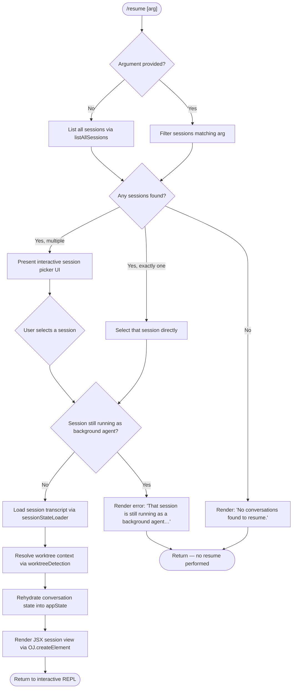

# `/resume`

> Analysis basis: CC v2.1.176 bundle.js (AST extraction + Claude interpretation)
> Minimum version: v2.1.176

---

## Overview

`/resume` (alias: `/continue`) allows the user to pick up a prior Claude Code conversation by session ID or search term. It queries the local conversation store, filters and ranks candidate sessions, presents a selection UI, then rehydrates the chosen session's state — including transcript, worktree context, and daemon attachment — before returning control to the interactive REPL.

---

## Registration

| Field | Value |
|---|---|
| type | `local-jsx` |
| name | `resume` |
| description | Resume a previous conversation |
| argumentHint | `[conversation id or search term]` |
| aliases | `["continue"]` |
| module_id | `w3K` |
| load_inline | `true` |
| loc_byte | `12528729` |
| loc_byte_end | `12528926` |
| loc_line | `8611` |
| arbor_handler.name | `joL` |
| arbor_handler.fqn | `claude-2.1.176::joL` |
| arbor_handler.kind | `AsyncFunction` |
| arbor_handler.resolution_path | `module_id` |
| arbor_handler.n_hits | `0` |

Analysis basis: CC v2.1.176 bundle.js:+12528729

---

## Input Branching

The handler has five or more distinct control-flow paths based on the argument value and session state, so a Mermaid flowchart is used.



Analysis basis: CC v2.1.176 bundle.js:+12527319 (handler entry `joL`), +12527329 (background-agent guard message), +12527764 (empty-list message), +12527615 (JSX render)

---

## Behavioral Spec

### 1. Session Discovery (`listAllSessions`)

When the command is invoked, the handler calls the session-lister function (resolved via `g$H` → `A.listAllSessions`). This call is wrapped in a `Promise.resolve` chain that enumerates all live and settled sessions stored by the daemon.

```
async function discoverSessions(arg):
    allSessions = await sessionStore.listAllSessions()
    // "interactive" sessions are the target scope
    liveSessions = allSessions.filter(s => s.mode == "interactive")
    if arg is not empty:
        candidates = liveSessions.filter(s => matchesArg(s, arg))
    else:
        candidates = liveSessions
    return candidates
```

Analysis basis: CC v2.1.176 bundle.js:+9335274 (`A.listAllSessions`), +9335222 (`Promise.resolve`), +9335365 (literal `"interactive"`)

---

### 2. Session Matching and Filtering

Matching applies a case-insensitive search over session metadata. The literal `"interactive"` scopes the query to user-facing sessions only (excluding headless/daemon-internal sessions).

```
function matchesArg(session, arg):
    needle = arg.toLowerCase()
    return session.id.includes(needle)
        OR session.title.toLowerCase().includes(needle)
        OR session.lastPrompt.toLowerCase().includes(needle)
```

A UUID-pattern test (`UN` → `Q17.test`) is used to detect whether the argument is a raw session ID rather than a search term, and applies an exact-match shortcut when true.

Analysis basis: CC v2.1.176 bundle.js:+12527865 (`UN`), +4248787 (`Q17.test`), +12527883 (`L.filter`)

---

### 3. Background-Agent Guard

Before any session is resumed, the handler checks whether the selected session is currently running as a live background agent. If so, it emits an informational error message and aborts the resume:

> Message (≤30 chars shown): `"That session is still running…"` (full string: `"That session is still running as a background agent. Open \`claude agents\` to attach to it, or stop it there first to resume here."`)

```
function guardBackgroundSession(session):
    if session.isLiveBackgroundAgent:
        renderError(BACKGROUND_AGENT_MESSAGE)
        return ABORT
    return PROCEED
```

Analysis basis: CC v2.1.176 bundle.js:+12527329 (literal message string), +12527319 (`g$H` call site)

---

### 4. Empty-List Guard

When no sessions match the argument (or no sessions exist at all), the handler renders a terminal message and returns without launching any session:

> Message: `"No conversations found to resume."` (bundle.js:+12527764)

```
function guardEmptyList(candidates):
    if candidates.length == 0:
        renderMessage("No conversations found to resume.")
        return ABORT
    return PROCEED
```

Analysis basis: CC v2.1.176 bundle.js:+12527764

---

### 5. Interactive Session Picker

When multiple sessions are found, a JSX component (`$3K` → renders with `X6.bold`) presents a scrollable picker. The picker sorts sessions by recency using `B$H` (timestamp comparison via `Date.now`) and locale-aware string comparison (`$.localeCompare`).

```
function buildSessionList(candidates):
    sorted = candidates
        .filter(isValidSession)
        .sort((a, b) => b.timestamp - a.timestamp
                     OR a.title.localeCompare(b.title))
    return renderPicker(sorted)
```

Telemetry keys `slash_command_session_id` (bundle.js:+12528026) and `slash_command_title` (bundle.js:+12528251) are recorded on selection.

Analysis basis: CC v2.1.176 bundle.js:+12527615 (`OJ.createElement`), +12527641 (`Date.now`), +9325112 (`$.localeCompare`), +12528301 (`$3K`)

---

### 6. Session State Rehydration (`sessionStateLoader` / `eq6` + `d$H`)

Once a session is selected, the full conversation state is loaded from the on-disk transcript store. This is a multi-stage process:

```
async function rehydrateSession(sessionId):
    rawState    = await sessionStateLoader.initialize(sessionId)  // eq6 / SEK / ZKH
    transcript  = loadTranscriptChain(rawState)                   // d$H, Q$H, Ff5
    worktree    = await detectWorktree(rawState)                   // B$H, git worktree list
    contextRefs = resolveContextRefs(transcript)                   // KPA, jPA, XPA
    applyToAppState(transcript, worktree, contextRefs)             // ZKH map updates
    return assembledSession
```

The transcript loader (`d$H`) reads message chains (uuid-linked parent/child) and resolves compact-boundary markers. Literal keys used during chain traversal include `"summary"`, `"last-prompt"`, `"custom-title"`, `"ai-title"`, `"tag"`, `"agent-name"`, `"compact_boundary"`.

Analysis basis: CC v2.1.176 bundle.js:+12528004 (`d$H`), +13566768 (`ZKH`), +13566901 (`Q$H`), +13566964 (`jPA`), +13566984 (`XPA`), +12528071 (`eq6`)

---

### 7. Worktree Detection (`B$H`)

Before rehydrating, the handler calls the worktree-detection helper which runs `git worktree list --porcelain` to identify the active worktree path.

```
async function detectWorktree(session):
    result = await exec(["git", "worktree", "list", "--porcelain"])
    lines  = result.split("\n")
    // find the line starting with "worktree "
    entry  = lines.find(l => l.startsWith("worktree "))
    path   = normalize(entry.slice(9))   // 9 = len("worktree ")
    return path
```

Telemetry event `tengu_worktree_detection` is fired after this step (bundle.js:+9324788).

Literals: `"worktree"` (+9324688), `"list"` (+9324699), `"--porcelain"` (+9324706), `"worktree "` (+9324907), slice offset `9` (+9324941).

Analysis basis: CC v2.1.176 bundle.js:+12527686 (`B$H`), +9324644 (`Date.now` guard), +9324788 (`tengu_worktree_detection`)

---

### 8. Daemon Attachment Path (`kH` / `sF8`)

After state is assembled, the handler calls the daemon-attachment helper (`kH`) and optionally triggers a file-context snapshot load (`sF8` → `rB6` → `REK`). These steps connect the rehydrated session to the running daemon socket and restore file-read context.

```
async function attachToDaemon(session):
    await daemonAttachHelper(session)          // kH → JA, A6, Aq, JUf
    await fileContextSnapshot(session.path)    // sF8 → rB6 → REK → LPA/FB6/eZH
```

Error logging goes through `Ms.logError` (bundle.js:+1049676).

Analysis basis: CC v2.1.176 bundle.js:+12527550 (`kH`), +12527704 (`sF8`), +1049676 (`Ms.logError`)

---

### 9. Final Render

After successful rehydration, the handler calls `OJ.createElement` to mount the session JSX component and hands control back to the interactive REPL. The `No` helper (bundle.js:+12528151) composes the final display by combining the transcript view, worktree state, and session metadata.

```
function renderResumedSession(session):
    view = No(session, worktree, transcript, fileCtx)
    return OJ.createElement(view)
```

Analysis basis: CC v2.1.176 bundle.js:+12527615 (`OJ.createElement`), +12528151 (`No`), +12528132 (`HzH`)

---

## State & Side Effects

| Item | Detail |
|---|---|
| Telemetry: `tengu_worktree_detection` | Fired after `git worktree list --porcelain` resolves (bundle.js:+9324788) |
| Telemetry: `tengu_bg_attach` | Fired when daemon PTY attachment is attempted for the resumed session (bundle.js:+16973229) |
| Telemetry: `tengu_bg_attach_stall_gave_up` | Fired if the attach attempt stalls beyond the timeout (bundle.js:+16974152) |
| Telemetry: `tengu_bg_attach_stall_respawn` | Fired if a stalled session is forcibly respawned during attach (bundle.js:+16974422) |
| Telemetry: `tengu_bg_attach_kick` | Fired when attaching kicks an existing session from another window (bundle.js:+16975414) |
| Telemetry: `tengu_daemon_control` | Fired on daemon-level control operations during attach (bundle.js:+17019560) |
| Telemetry: `tengu_transcript_phantom_parent` | Fired if a phantom parent UUID is detected during chain loading (bundle.js:+13572787) |
| Telemetry: `tengu_transcript_parent_cycle` | Fired if a cycle is detected in the transcript parent chain (bundle.js:+13576579) |
| Telemetry: `tengu_chain_parent_cycle` | Fired when a parent cycle is detected at the chain-resolution layer (bundle.js:+13554268) |
| Telemetry: `tengu_chain_timestamp_fallback` | Fired when timestamp ordering falls back to an alternative strategy (bundle.js:+13554417) |
| Telemetry: `tengu_chain_parallel_tr_recovered` | Fired when a parallel transcript branch is recovered (bundle.js:+13556283) |
| Telemetry: `tengu_relink_walk_broken` | Fired when a broken relink walk is encountered in the transcript graph (bundle.js:+13553778) |
| appState changes | Session transcript, worktree path, file-context snapshot, and daemon socket ref are all written into the application state maps via `ZKH` |
| Hook registration | `GiA` registers an `exit` event listener on the daemon process handle (bundle.js:+1123172) |
| Sound | None detected in depth-2 traversal |
| Slash-command telemetry keys | `slash_command_session_id` (bundle.js:+12528026), `slash_command_title` (bundle.js:+12528251) recorded on session selection |

---

## Version History

| Version | Change |
|---|---|
| v2.1.176 | Initial analysis |

---

## Common Mistakes

1. **Passing a partial title instead of a session ID when multiple sessions share a similar title** — the fuzzy filter may return multiple matches and drop into the interactive picker rather than resuming immediately. Use the full session UUID (`/resume <uuid>`) for deterministic selection.
2. **Trying to resume a session that is still running as a background agent** — the command will refuse with a specific message directing the user to `/claude agents`. Stop or detach the agent first.
3. **Invoking `/resume` when no prior conversations exist** — the command renders `"No conversations found to resume."` and exits silently; no error is thrown, which can appear as a no-op.
4. **Assuming `/continue` is a separate command** — it is a registered alias for `/resume` and shares identical behavior (registration aliases array: `["continue"]`).
5. **Resuming across mismatched worktrees** — if the original session's worktree path no longer exists, the worktree-detection step (`B$H`) will proceed with a normalized path that may not match the current working directory, potentially causing tool calls to resolve paths incorrectly.

---

## Appendix — Identifier Mapping

> For bundle debugging only. Identifiers change across versions.

| Identifier | Role |
|---|---|
| `joL` | Main async handler for `/resume` (arbor_handler, AsyncFunction) |
| `z3K` | Registration-level filter/dispatch shim that routes to `joL` |
| `g$H` | Session discovery helper; calls `listAllSessions` |
| `B$H` | Worktree detection and session timestamp helper; runs `git worktree list --porcelain` |
| `d$H` | Transcript / session state loader; reads on-disk conversation chains |
| `eq6` | Session state accessor / key-map reader used during rehydration |
| `ZKH` | Central session-state map writer; populates all per-session Maps |
| `Q$H` | Transcript chain resolver; builds ordered message lists |
| `kH` | Daemon-attachment helper; connects resumed session to daemon socket |
| `sF8` | File-context snapshot loader; restores file-read state |
| `rB6` | File context builder; calls `REK` and `xBH` |
| `REK` | Repository file enumeration (readdir, realpath, stat) |
| `xBH` | File-context buffer allocator and snapshot writer |
| `No` | Final session view composer; assembles JSX display from transcript + worktree |
| `HzH` | Session header/metadata renderer used inside `No` |
| `$3K` | Session picker list item renderer (uses `X6.bold`) |
| `UN` | UUID-pattern tester; detects raw session-ID arguments |
| `xHH` | Session display helper referenced by both `joL` and `d$H` |
| `n_` | Process/agent runner launcher; used during daemon attachment path |
| `zhH` | Child-process spawn orchestrator |
| `kPK` | Daemon status file reader (`daemon.status.json`) |
| `nd8` | Date-parse utility for transcript timestamp fields |
| `tq6` | Transcript message type mapper |
| `jPA` | Message content normalizer / replaceAll helper |
| `KPA` | Context-reference resolver combining `jPA`, `tq6`, `XPA` |
| `XPA` | Content-type validator (image/document filter) |
| `Ff5` | Transcript chain sorter and per-type bucketer |
| `pf5` | Transcript chain priority-queue builder |
| `hEK` | Transcript lookup-map updater |
| `id8` | Transcript index get/set helper |
| `rd8` | Transcript array-from-values helper |
| `SEK` | Session environment initializer; calls `ZKH` and `ef5` |
| `ef5` | Session working-directory stat checker |
| `KEK` | Session map-value enumerator and cache updater |
| `mf5` | Relink-walk helper for broken transcript parent chains |
| `sf5` | File-record binary parser (reads structured session log files) |
| `af5` | Alternate file-record binary parser |
| `tf5` | File-record reader using synchronous fs calls |
| `WhH` | Wire-protocol framing helpers (`bgf`, `xgf`, `mgf`, `ugf`) |
| `z$` | Shared session-ID string formatter |
| `T_` | Working-directory path resolver |
| `Mz` | Path normalizer (NFC normalization) |
| `A6` | String coercion utility |
| `JA` | Error/string factory |
| `Aq` | Telemetry batcher |
| `ycA` | Telemetry batcher helper calling `A6` |
| `JUf` | Telemetry ring-buffer manager (shift/push) |
| `TH` | String coercion helper (distinct from `JA`) |
| `vf5` | Session-file version flag checker |
| `FU` | Session-file format upgrade helper |
| `nl6` | JSON path-array flattener |
| `dl6` | JSON path segment test helper |
| `cl6` | JSON path segment replace helper |
| `AX` | Session-map entry constructor |
| `iC` | Working-directory existence checker (calls `eG`) |
| `b0` | Directory-listing helper for file context |
| `Qw` | Path-shortening formatter |
| `FB6` | File-attribution map builder |
| `eZH` | File-context slice accumulator |
| `LPA` | Recursive directory reader for file context |
| `OO` | File-ignore-pattern matcher |
| `M45` | File-context metadata builder |
| `WVA` | Daemon socket-claim helper |
| `vVA` | Daemon session lifecycle manager (claim, retire, cleanup) |
| `D` | Daemon session registry (core Map-based session table) |
| `k` | Daemon scheduler / sweep loop |
| `c` | Grace-clock manager for session retirement |
| `R` | Daemon write-stream helper |
| `S` | Daemon worker-process supervisor |
| `Q` | IPC socket connection handler |
| `qI5` | Daemon PTY message dispatcher (large switch over message types) |
| `M` | MCP server state manager |
| `LbH` | MCP connection slot loader |
| `Ho8` | MCP connection result applier |
| `vZA` | MCP server restart/retry orchestrator |
| `n8` | Async-timeout helper |
| `bH` | Feature-flag ok logger |
| `IH` | Feature-flag error logger |
| `aSH` | Daemon-state file reader (lstat/readFile/rm) |
| `Yd8` | Memory-pressure helper |
| `ZB6` | Background low-memory checker |
| `SGK` | Background memory-gate helper |
| `Dd8` | Daemon dispatch drop helper |
| `z1` | Error-code emitter |
| `M9` | Error-code `E8` wrapper |
| `eH` | Native module loader (`nM6`) |
| `E8` | Error-type classifier |
| `d8` | Shared underscore/utility shim |
| `HzH` | (see `No` row above — session header sub-component) |
| `No` | Session view composer (also listed above) |