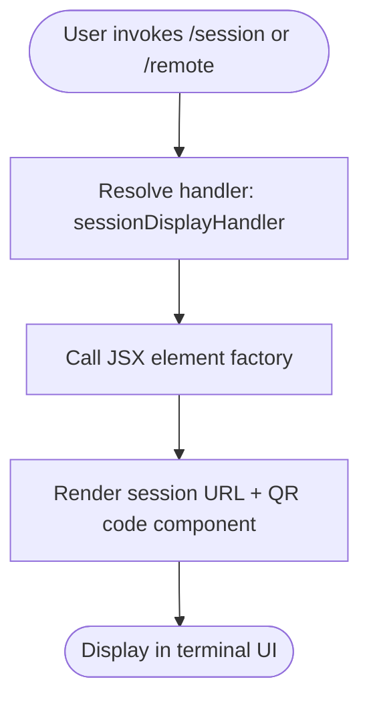

# `/session`

> Analysis basis: CC v2.1.132 bundle.js (AST extraction + Claude interpretation)
> Minimum version: v2.1.132

---

## Overview

The `/session` command (also invocable as `/remote`) displays the current remote session URL and renders a QR code representation of that URL directly in the terminal UI. It is a read-only, display-only command — it does not mutate session state but surfaces connection information for the active remote session via a JSX component tree.

---

## Registration

| Field | Value |
|---|---|
| type | `local-jsx` |
| name | `session` |
| description | `Show remote session URL and QR code` |
| aliases | `["remote"]` |
| isHidden | `null` (not hidden) |
| module_id | `P4q` |
| load_inline | `true` |
| handler | `A37` (AsyncFunction, resolved via `module_id` path) |
| `loc_byte_end` | `10961791` |
| `arbor_handler.name` | `A37` |
| `arbor_handler.kind` | `AsyncFunction` |
| `arbor_handler.resolution_path` | `module_id` |
| `arbor_handler.fqn` | `claude-2.1.132::A37` |
| `arbor_handler.n_hits` | `1` |

Analysis basis: CC v2.1.132 bundle.js:+10961573 – +10961791

---

## Input Branching

Because the depth-2 call graph reveals a single outbound edge from the handler to the JSX element factory, and no literals (strings, numbers) were captured in the implementation, the command does not branch on user-supplied arguments. The flow is linear.



Analysis basis: CC v2.1.132 bundle.js:+10961395

---

## Behavioral Spec

### Session Display Handler

The handler is an `AsyncFunction` identified by Arbor as `A37`, reached via the `module_id` resolution path from module `P4q`.

```
async function sessionDisplayHandler(context):
    // No argument parsing observed at depth ≤ 2
    element = createElement(SessionDisplayComponent, context)
    return element
```

The handler constructs a JSX element (via `m3.createElement`) that encapsulates the session URL and QR code rendering logic. Because the type is `local-jsx`, the returned element is handed directly to Claude Code's terminal rendering pipeline rather than being sent to the language model.

Analysis basis: CC v2.1.132 bundle.js:+10961395

### JSX Component Rendering

Because `type` is `local-jsx`, the command output is a React-style element rendered natively in the Ink/terminal UI layer. The component is expected to:

1. Read the active remote session URL from application state or context.
2. Render the URL as human-readable text.
3. Render a QR code encoding of that URL suitable for terminal display.

No further sub-calls were reachable within the depth-2 traversal; the internal structure of the JSX component lives deeper in the bundle.

```
component SessionDisplay(props):
    url = props.sessionUrl  // sourced from app context
    display plaintext(url)
    display qrCode(url)     // terminal-safe QR rendering
```

Analysis basis: CC v2.1.132 bundle.js:+10961395

<!-- TODO: internal QR-code rendering logic and session URL resolution not found in depth-2 traversal; needs --depth 4 -->

---

## State & Side Effects

| Item | Detail |
|---|---|
| Telemetry | None detected in depth-2 traversal |
| Hook registration | None detected |
| appState changes | None — command is read-only display |
| Sound | None detected |
| Network | None — reads existing session state, does not initiate connections |
| Aliases | `/remote` is a registered alias; behavior is identical |

---

## Version History

| Version | Change |
|---|---|
| v2.1.132 | Initial analysis |

---

## Common Mistakes

1. **Expecting model output**: `/session` is `local-jsx` — it renders a UI component directly and does not invoke the language model. No assistant turn will appear in the conversation.
2. **Using `/session` to create a remote session**: This command only *displays* an existing session URL and QR code. It does not initiate, configure, or terminate remote sessions.
3. **Expecting argument support**: No argument parsing was detected in the implementation. Passing arguments after `/session` or `/remote` has no defined effect and may be silently ignored.
4. **Treating `/remote` as a different command**: `/remote` is a registered alias for `/session` and executes the identical handler (`A37`).

---

## Appendix — Identifier Mapping

> For bundle debugging only. Identifiers change across versions.

| Identifier | Role |
|---|---|
| `A37` | Session display handler (AsyncFunction); entry point for `/session` and `/remote`; resolved from module `P4q` via `module_id` path |