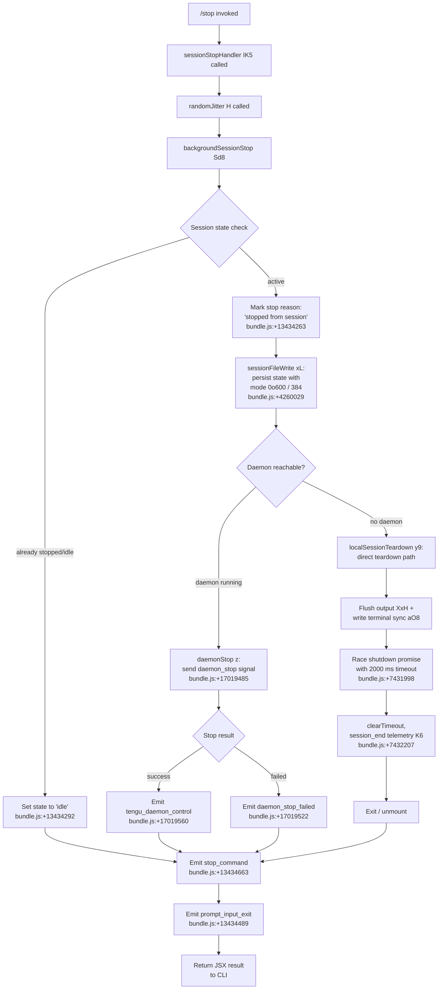

# `/stop`

> Analysis basis: CC v2.1.176 bundle.js (AST extraction + Claude interpretation)
> Minimum version: v2.1.176

---

## Overview

The `/stop` command terminates the current background session without destroying its associated transcript or worktree. It is a `local-jsx` command that executes immediately (`immediate: true`), triggering a sequence of session teardown, state persistence, and daemon notification before the CLI process exits cleanly.

---

## Registration

| Field | Value |
|---|---|
| type | `local-jsx` |
| name | `stop` |
| description | `Stop this background session; transcript and worktree are kept` |
| loc_byte | `13434930` |
| loc_byte_end | `13435114` |
| loc_line | `9801` |
| immediate | `true` |
| module_id | `TTK` |
| load_inline | `true` |
| arbor_handler.name | `IK5` |
| arbor_handler.fqn | `claude-2.1.176::IK5` |
| arbor_handler.kind | `AsyncFunction` |
| arbor_handler.resolution_path | `module_id` |
| arbor_handler.n_hits | `0` |

Analysis basis: CC v2.1.176 bundle.js:+13434930

---

## Input Branching

The `/stop` command produces 4+ distinct execution paths based on session state and daemon interaction outcomes:



---

## Behavioral Spec

### Top-Level Handler (`IK5`)

Analysis basis: CC v2.1.176 bundle.js:+13434649

```
async function stopCommandHandler():
    call randomJitter()                  // H: Math.random + setTimeout
    call backgroundSessionStop()         // Sd8: main teardown orchestrator
```

The handler is an `AsyncFunction` (Arbor kind: `AsyncFunction`, resolution path: `module_id → TTK`). It unconditionally invokes a small random jitter delay before proceeding to the session stop logic, likely to prevent thundering-herd issues when multiple background agents stop simultaneously.

---

### Random Jitter (`H`)

Analysis basis: CC v2.1.176 bundle.js:+14138791

```
function randomJitter():
    delay = Math.random() * 2 + 1      // range: [1, 3) — literals at +14138789, +14138805
    await setTimeout(delay)
```

Constants: multiplier `2` (bundle.js:+14138789), addend `1` (bundle.js:+14138805).

---

### Background Session Stop Orchestrator (`Sd8`)

Analysis basis: CC v2.1.176 bundle.js:+13434063

```
async function backgroundSessionStop():
    logAction(telemetry: "tengu_bg_agent_action")     // +13434065
    readSessionState()                                  // d
    checkSessionKind()                                  // K6 → nM6
    checkFeatureFlag()                                  // eH → nM6
    resolveSessionConfig()                              // S6 → eG
    resolveWorktreeRoot()                               // yK5
    readBgStateMap()                                    // G9 → BjH

    sessionFileResult = sessionFileAccessor($q)
    // $q handles: path join, lstat, file-type check, state cache (st.get/set/delete),
    //             readFile (utf-8), JSON.parse via c6, Number.isFinite, st.clear
    // Timeout: 1000 ms (bundle.js:+4261986)
    // Unknown state fallback: "unknown" (bundle.js:+4261292)

    stateTransitionResult = computeStateTransition(_O)
    // _O → BN → p1H
    // Known states: "done", "success", "failure", "stopped", "active"
    //   (bundle.js:+4267980, +4267993, +4268025, +4268042, +4268161)

    writeSessionFile(xL)
    // xL → IO: atomic write via randomBytes(4) hex temp file, rename
    // File mode: 0o600 (decimal 384, bundle.js:+4260029)
    // lJ: cleans up st (session state cache) on completion

    reloadDaemonConfig(kq8)
    // Persists "stopped from session" reason (bundle.js:+13434263)
    // Sets session state to "idle"   (bundle.js:+13434292)

    emitStopMessage(eKH)
    // UI message: "Session stopped."  (bundle.js:+13434436)

    emitTelemetry("job_stop_self")     // bundle.js:+13434467
    emitTelemetry("prompt_input_exit") // bundle.js:+13434489

    await localSessionTeardown(y9)     // see below

    emitTelemetry("stop_command")      // bundle.js:+13434663
```

---

### Session File Accessor (`$q`)

Analysis basis: CC v2.1.176 bundle.js:+4260426

```
async function sessionFileAccessor(sessionId):
    baseName   = nj.basename(sessionId)
    fullPath   = nj.join(...)
    statResult = await Promise.all([cJ.lstat(fullPath)])

    if not statResult.isFile():
        log("not a regular file", level="warn")    // +4260805, +4260835
        return null

    cached = st.get(sessionId)
    if cached and cached.order == stateOrder:       // literals "order", "stateOrder" +4260453/74
        return cached

    raw     = await cJ.readFile(fullPath, "utf-8")  // +4261459
    parsed  = c6(raw)                               // JSON.parse wrapper
    numVal  = Number(parsed)

    if Number.isFinite(numVal):
        st.set(sessionId, numVal)
    else:
        emitTelemetry("tengu_bg_state_read_transient")  // +4261246
        st.delete(sessionId)
        yPH.delete(sessionId)
        return "unknown"                                 // +4261292

    st.clear() if threshold exceeded                    // 1000 ms +4261986
    return numVal
```

---

### Daemon Stop Subsystem (`z` / `IH` / `bH` / `gS` / `hB`)

Analysis basis: CC v2.1.176 bundle.js:+17019482

```
async function daemonStopDispatch(sessionContext):
    featureCheckOk  = IH()    // emits tengu_feature_ok  (+1018758)
    featureCheckBad = bH()    // emits tengu_feature_bad (+1018825)

    daemonControlEvent = gS() // emits tengu_daemon_control (+17019560)
    // gS: builds firstParty flag (+2526748), pushes to daemon queue

    if daemon reachable:
        signal "daemon_stop"        // literal +17019485
        on success: log "daemon_stop"
        on failure: log "daemon_stop_failed"   // +17019522

    exitRace = hB()
    // hB: Promise.race([Promise.all([...]), timeout(500ms)])  // +17014603
    // On timeout: process.exit                                // +17014642
    // Signal: SIGKILL if unresponsive                         // +7430110
```

---

### Local Session Teardown (`y9`)

Analysis basis: CC v2.1.176 bundle.js:+7431716

```
async function localSessionTeardown():
    await Promise.resolve()                 // yield microtask

    renderFinalOutput(XxH)
    // XxH: a3H.writeSync to stdout, unmount Ink component, terminal restore (_R)
    // aO8: ESC-7 save / ESC-8 restore cursor sequences (+3868501, +3868512)

    printWorkingDirectory(Bi_)
    // Bi_: resolves git worktree root (Fy6 + x$), replaces backslash/quote escapes,
    //      writes dim-styled path via a3H.writeSync (+7429852)

    exitSignalHandler = Fi_()
    // Fi_: clearTimeout, u4.get process handle, then either process.exit
    //      or process.kill(SIGKILL) (+7430085, +7430110)

    timeout = Math.max(5000, 3500)          // literals +7431813, +7431820
    timerRef = C0H.unref()                  // unref timer to avoid blocking event loop

    await qQH()                             // drain DyA output stream (+65246)

    result = await Promise.race([
        workerShutdown(w),                  // supervisor/heartbeat teardown
        timeout(2000)                       // +7431998
    ])

    clearTimeout(timerRef)

    emitTelemetry("tengu_cache_eviction_hint")  // +7432172
    emitTelemetry("session_end")                // literal +7432210, via K6 +7432207

    // Final write to stdout
    a3H.writeSync(finalLine)                    // +7432280
```

---

### Supervisor / Worker Shutdown (`w`)

Analysis basis: CC v2.1.176 bundle.js:+16997059

```
async function supervisorShutdown(workerId):
    fileInfo = nZH(workerId)
    // nZH: A0K.stat → check ENOENT (+13284278), enforce max size 1048576 (+13284338)

    q.write(workerId, "supervisor")        // literal +16997084
    q0K(workerId)                          // computes Object.keys, Math.max offsets

    session = L.get(workerId)              // L: manages A.close + q.close + f lifecycle
    T.stop(workerId)                       // T: uN6 + jM6 heartbeat stop
    L.delete(workerId)
    E.stop(workerId)                       // E: W + Math.max + Math.min config

    E.updateConfig(workerId)
    E.start(workerId)

    heartbeatSetup = j6f(workerId)         // j6f → cAH heartbeat setup (+16996305)
    L.set(workerId, session)
    V.start(workerId)                      // V: session runner start

    emitTelemetry("tengu_daemon_config_reload")  // +16997877

    d(workerId)                            // logger/debug call
```

---

### MCP Server Refresh During Stop (`vZA`)

Analysis basis: CC v2.1.176 bundle.js:+16638845

```
async function mcpServerRefresh(context):
    entries = Object.entries(context.servers)
    active  = entries.filter(...)         // skip "disabled" entries (+6776047)

    // Transport types checked: "stdio", "sse", "http", "sse-ide", "ws-ide"
    //   (+6776149, +6776183, +6776215, +6776248, +6776284)

    for each server:
        connectionResult = LbH(server)    // full MCP connection lifecycle
        applyResult      = Ho8(result)    // apply or discard mid-flight result

        // Log on orphaned slot: "applyConnectionResult: disposing orphaned..."
        //   (+16638429, +16638514)

    // If all remote servers recovered:
    //   log "[MCP] Retry: all remote servers recovered, stopping"  (+16639041)

    return Object.fromEntries(results)
```

---

## State & Side Effects

| Item | Detail |
|---|---|
| Telemetry: `tengu_bg_agent_action` | Fired at start of `backgroundSessionStop` (bundle.js:+13434065) |
| Telemetry: `tengu_daemon_control` | Fired when daemon stop signal is dispatched (bundle.js:+17019560) |
| Telemetry: `tengu_feature_ok` | Fired when feature flag check passes in daemon path (bundle.js:+1018758) |
| Telemetry: `tengu_feature_bad` | Fired when feature flag check fails in daemon path (bundle.js:+1018825) |
| Telemetry: `tengu_daemon_config_reload` | Fired after supervisor worker is reconfigured (bundle.js:+16997877) |
| Telemetry: `tengu_bg_state_read_transient` | Fired when session state file contains a non-finite value (bundle.js:+4261246) |
| Telemetry: `tengu_startup_perf` | Fired via startup profiling path reached during teardown (bundle.js:+222612) |
| Telemetry: `tengu_scroll_summary` | Fired from scroll/render summary during final output (bundle.js:+7431229) |
| Telemetry: `tengu_pewter_brook` | Fired from local-agent init path during teardown (bundle.js:+3527544) |
| Telemetry: `tengu_cache_eviction_hint` | Fired during final session cleanup (bundle.js:+7432172) |
| Session state written | State set to `"idle"` (bundle.js:+13434292); stop reason `"stopped from session"` persisted (bundle.js:+13434263) |
| Session file permissions | Written with mode `0o600` (decimal 384) via atomic rename (bundle.js:+4260029) |
| Transcript / worktree | Explicitly preserved — not deleted by this command (registration description) |
| State cache (`st`) | Entries deleted and potentially cleared on completion (bundle.js:+4261052, +4261991) |
| Terminal state | Cursor save/restore via ESC-7/ESC-8 sequences; Ink component unmounted (bundle.js:+3868501, +3868512) |
| Daemon signal | `daemon_stop` string sent to daemon process (bundle.js:+17019485) |
| Process exit | `process.exit` or `process.kill(SIGKILL)` if teardown stalls (bundle.js:+7430060, +7430085) |
| Shutdown timeout | Race with 2000 ms timeout (bundle.js:+7431998); outer guard 5000/3500 ms (bundle.js:+7431813, +7431820) |
| Daemon stop timeout | 500 ms race in daemon exit path (bundle.js:+17014603) |
| MCP connections | Orphaned MCP connections cleaned up via `A.cleanup` during teardown (bundle.js:+16638600) |
| Hook registration | None identified in depth-2 traversal |
| Sound | None identified in depth-2 traversal |

---

## Version History

| Version | Change |
|---|---|
| v2.1.176 | Initial analysis |

---

## Common Mistakes

1. **Expecting the worktree to be deleted**: `/stop` explicitly keeps the transcript and worktree. To remove them, a separate cleanup command is needed.
2. **Invoking `/stop` in a non-background session**: The command is designed for background (`bg`) sessions. Using it in an interactive foreground session may lead to unexpected `idle` state transitions without a daemon to notify.
3. **Assuming synchronous completion**: The handler is `async` and includes a random jitter delay plus a 2000 ms shutdown race. Scripted callers must await completion rather than assuming the process exits immediately.
4. **Misinterpreting "session stopped" UI message**: The message `"Session stopped."` (bundle.js:+13434436) appears before daemon confirmation. The daemon interaction completes asynchronously; the UI message does not guarantee clean daemon teardown.
5. **Ignoring the 500 ms daemon timeout**: If the daemon does not respond within 500 ms (bundle.js:+17014603), the process forcibly exits. Slow daemon starts or high system load can cause this path to fire unexpectedly.

---

## Appendix — Identifier Mapping

> For bundle debugging only. Identifiers change across versions.

| Identifier | Role |
|---|---|
| `IK5` | Top-level stop command handler (AsyncFunction; Arbor FQN: `claude-2.1.176::IK5`) |
| `H` | Random jitter delay utility (Math.random + setTimeout) |
| `Sd8` | Background session stop orchestrator |
| `d` | Logger / debug utility |
| `K6` | Session kind checker (→ `nM6`) |
| `nM6` | Low-level session metadata accessor |
| `eH` | Feature flag checker (→ `nM6`) |
| `S6` | Session config resolver (→ `eG`) |
| `eG` | Config object accessor |
| `yK5` | Worktree root resolver |
| `G9` | Background state map reader (→ `BjH`) |
| `BjH` | Background state map implementation |
| `$q` | Session file accessor (lstat, readFile, JSON.parse, state cache) |
| `M` | MCP manager / session runner composite |
| `LbH` | MCP connection lifecycle handler |
| `Ho8` | MCP connection result applicator |
| `f` | Promise lifecycle tracker (add/delete/finally) |
| `N` | String normalizer / log-level formatter |
| `$` | Key-prefix resolver (→ `kPK`) |
| `vZA` | MCP server refresh coordinator |
| `w` | Supervisor / worker shutdown handler |
| `nZH` | File stat + size validator (ENOENT aware) |
| `q` | Data stream / write queue |
| `q0K` | Worker key offset calculator |
| `L` | Session lifecycle store (get/set/delete/close) |
| `T` | Heartbeat controller (stop) |
| `E` | Session runner (stop/updateConfig/start, Math.max/min) |
| `j6f` | Heartbeat setup factory (→ `cAH`) |
| `V` | Session runner start wrapper |
| `z` | Daemon stop dispatcher |
| `IH` | Feature-ok path (→ `tengu_feature_ok`) |
| `bH` | Feature-bad path (→ `tengu_feature_bad`) |
| `gS` | Daemon control event builder (firstParty flag) |
| `hB` | Daemon exit race (Promise.race + 500 ms + process.exit) |
| `k8` | Error code extractor (→ `E8`) |
| `E8` | Error code accessor |
| `GL` | Error guard / fallback (→ `E8`) |
| `c6` | JSON.parse wrapper |
| `_O` | State transition computer (→ `BN`) |
| `BN` | State machine (→ `p1H`) |
| `p1H` | State predicate helper |
| `xL` | Session file atomic writer (→ `IO`, mode 0o600) |
| `IO` | Atomic file write (randomBytes + writeFile + rename) |
| `CH` | JSON.stringify wrapper |
| `lJ` | Session state cache cleanup on write completion |
| `kq8` | Daemon config reload trigger |
| `eKH` | Stop UI message emitter ("Session stopped.") |
| `y9` | Local session teardown orchestrator |
| `K` | Column formatter (f.map + L.padEnd) |
| `XxH` | Final output renderer (writeSync + unmount + terminal restore) |
| `_R` | Terminal state restorer |
| `aO8` | Cursor save/restore via ESC-7/ESC-8 escape sequences |
| `Bi_` | Working directory path printer (git root, dim style) |
| `N0` | Null/undefined guard |
| `iu` | Utility — exact role not resolved at depth-2 |
| `Fy6` | Git worktree root resolver (statSync) |
| `x$` | Secondary path resolver (→ `S6`, `P4`) |
| `N1q` | Path normalizer for display |
| `Fi_` | Exit signal handler (clearTimeout + process.exit/kill SIGKILL) |
| `qQH` | Output stream drain (→ `DyA.drain`) |
| `m1q` | Parallel shutdown via Promise.allSettled + Array.from |
| `wO6` | Startup profiling writer (→ `_6_`, `wSA`) |
| `_6_` | Profiling record builder (→ `XSA`) |
| `wSA` | Profiling report serializer (JSON.stringify, dirname, mark) |
| `ET8` | Scroll/render summary emitter (→ `V1q`, `y1`) |
| `v1q` | Scroll state accessor |
| `V1q` | Duration calculator (Date.now, Math.max/round, Object.assign) |
| `y1` | Local-agent initializer (fullscreen mode detection) |
| `W36` | <!-- TODO: not found in depth-2 traversal; needs --depth 4 --> |
| `WxH` | Shutdown promise wrapper (→ `GT8`) |
| `GT8` | <!-- TODO: not found in depth-2 traversal; needs --depth 4 --> |