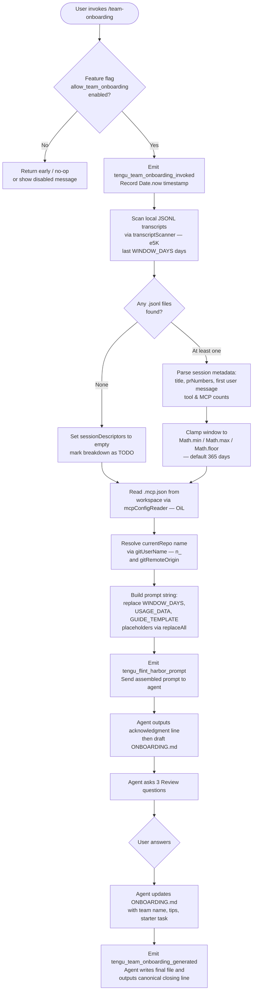

# `/team-onboarding`

> Analysis basis: CC v2.1.176 bundle.js (AST extraction + Claude interpretation)
> Minimum version: v2.1.176

---

## Overview

`/team-onboarding` scans the invoking user's local Claude Code session transcripts from the past year and co-authors a personalized `ONBOARDING.md` guide for teammates new to Claude Code. The command populates a structured prompt with real usage statistics, a work-type breakdown derived from session descriptors, and MCP server details, then engages the agent in an interactive two-turn flow to refine the draft before writing the final file.

---

## Registration

| Field | Value |
|---|---|
| type | `prompt` |
| name | `team-onboarding` |
| description | Help teammates ramp on Claude Code with a guide from your usage |
| isHidden | `false` |
| handler_method | `getPromptForCommand` |
| handler_method_start (loc_byte) | `12429338` |
| handler_method_end (loc_byte) | `12430048` |
| loc_byte | `12428975` |
| loc_byte_end | `12430049` |
| loc_line | `8581` |
| prompt_body.length | `4539` characters |
| prompt_body.trace | `identifier→$ (local→1 ext vars)` |
| arbor_handler.name | `getPromptForCommand` |
| arbor_handler.kind | `Method` |
| arbor_handler.resolution_path | `direct` |
| arbor_handler.fqn | `claude-2.1.176::getPromptForCommand` |
| arbor_handler.n_hits | `2` |
| `handler_method_start` | `12429338` |
| `handler_method_end` | `12430048` |

Analysis basis: CC v2.1.176 bundle.js:+12428975

---

## Input Branching

The handler contains 4+ distinct decision points: feature-flag check (`allow_team_onboarding`), transcript availability, window-day clamping, and MCP/repo enrichment. A Mermaid flowchart is used.



Analysis basis: CC v2.1.176 bundle.js:+12429338

---

## Behavioral Spec

### 1. Feature-Flag Guard

Before any data collection, the handler checks that the `allow_team_onboarding` policy flag is active (literal `"allow_team_onboarding"` at bundle.js:+10183170). If the flag is absent or false, execution does not proceed to data gathering.

```
function checkTeamOnboardingFlag(appState):
    policy = getPolicyFlag(appState, "allow_team_onboarding")
    if not policy.enabled:
        return DISABLED
    return ALLOWED
```

Analysis basis: CC v2.1.176 bundle.js:+10183170

---

### 2. Transcript Scanning — `transcriptScanner`

The handler delegates to the transcript-scanning subsystem (obfuscated identifier `e5K`, resolved to `transcriptScanner` here). It reads the user's Claude Code project directory (located via `Xb` / project-path resolver), lists `.jsonl` files, filters by modification time within the lookback window, and parses each file for session-level signals.

```
async function transcriptScanner(projectsDir, windowDays):
    cutoff = Date.now() - windowDays * 24 * 60 * 60 * 1000
    files = await fs.readdir(projectsDir)
    jsonlFiles = files.filter(f => extname(f) == ".jsonl")

    sessions = []
    for each file in jsonlFiles:
        stat = await fs.stat(join(projectsDir, file))
        if not stat.isFile():
            continue
        if stat.mtimeMs < cutoff:
            continue
        raw = await fs.readFile(join(projectsDir, file), "utf-8")
        lines = raw.split("\n").filter(Boolean)
        session = extractSessionDescriptor(lines, file)
        sessions.push(session)

    return sessions
```

Key parsing details:
- Looks for `"name":"mcp__` literal (bundle.js:+12418500) to count MCP tool calls per session.
- Looks for `"content":[` literal (bundle.js:+12418850) to identify assistant turns.
- Applies up to three regex patterns (`KiL`, `fiL`, `LiL`) to extract title, PR numbers, and first user message from JSONL lines.
- Sessions with zero lines or unreadable files are silently skipped.

Window constant: `24` hours × `60` minutes (bundle.js:+12417806, +12417809). Default lookback is `365` days (bundle.js:+12429587), clamped with `Math.min` / `Math.max` / `Math.floor` (bundle.js:+12429541–12429559).

Analysis basis: CC v2.1.176 bundle.js:+12417793 – +12419000

---

### 3. MCP Configuration Reader — `mcpConfigReader`

The handler reads `.mcp.json` from the workspace root (literal `".mcp.json"` at bundle.js:+12420032) and parses the `mcpServers` key (literal at bundle.js:+12420088) to enumerate configured MCP servers. Each server entry's `name` and `urlOrigin` (where present) are included in the usage data payload so the agent can explain how teammates would gain access.

```
async function mcpConfigReader(workspaceRoot):
    mcpPath = join(workspaceRoot, ".mcp.json")
    try:
        raw = await fs.readFile(mcpPath, "utf-8")
        config = JSON.parse(raw)
        return config.mcpServers ?? {}
    catch:
        return {}
```

Analysis basis: CC v2.1.176 bundle.js:+12420008 – +12420267

---

### 4. Git Identity Resolution — `gitIdentityResolver`

The handler invokes the git identity resolver (identifier `n_`) to populate `generatedBy` and `currentRepo` fields. It runs `git config user.name` (literal at bundle.js:+12420671) and `git remote get-url origin` (literals `"remote"`, `"get-url"`, `"origin"` at bundle.js:+12420727, +12420736, +12420746) via the subprocess runner. Results are fed into the usage-data payload.

```
async function gitIdentityResolver(cwd):
    userName = await runGit(cwd, ["config", "user.name"])
    remoteUrl = await runGit(cwd, ["remote", "get-url", "origin"])
    return { generatedBy: trim(userName), currentRepo: trim(remoteUrl) }
```

Analysis basis: CC v2.1.176 bundle.js:+12420652 – +12420843

---

### 5. Prompt Assembly — `getPromptForCommand`

The handler (`getPromptForCommand`, Arbor-resolved, bundle.js:+12429338) assembles the final prompt string by substituting three template placeholders into the 4539-character base prompt body using `String.prototype.replaceAll` (bundle.js:+12429785):

| Placeholder | Substituted With |
|---|---|
| `{{WINDOW_DAYS}}` | Clamped integer lookback days (bundle.js:+12429798) |
| `{{USAGE_DATA}}` | JSON-serialized session descriptors + MCP config (bundle.js:+12429873) |
| `{{GUIDE_TEMPLATE}}` | Built-in guide markdown template (bundle.js:+12429838) |

```
function assemblePrompt(basePrompt, windowDays, usageData, guideTemplate):
    s = basePrompt
    s = s.replaceAll("{{WINDOW_DAYS}}", String(windowDays))
    s = s.replaceAll("{{USAGE_DATA}}", JSON.stringify(usageData))
    s = s.replaceAll("{{GUIDE_TEMPLATE}}", guideTemplate)
    return s
```

After assembly, `tengu_flint_harbor_prompt` is emitted (bundle.js:+12429375), and the prompt is forwarded to the agent runner.

Analysis basis: CC v2.1.176 bundle.js:+12429785 – +12429894

---

### 6. Agent-Side Two-Turn Flow

The assembled prompt instructs the agent to execute a strict ordered procedure:

**Turn 1 — Immediate draft:**

1. Output a fixed acknowledgment line (beginning "Looking at how you've used Claude over the last …") as the very first visible text — no tool calls, no extended thinking beforehand.
2. Classify sessions into work-type categories from the taxonomy below, selecting the top 3–5 with rough percentages:
   - Build Feature, Debug Fix, Improve Quality, Analyze Data, Plan Design, Prototype, Write Docs
3. Gather repo names (starting from `currentRepo`, then sibling workspace directories) and MCP server access details.
4. Write `ONBOARDING.md` using the built-in guide template: real numeric values from usage data, ASCII bar charts (`█` filled / `░` empty, 20 characters wide), `generatedBy` for the author name (omit if missing).
5. Render the guide in a fenced code block, then append a horizontal rule and a **Review** section containing exactly three numbered questions about team name, starter task, and team tips.

**Turn 2 — Revision:**

After the user responds to the Review questions, the agent:
1. Updates `ONBOARDING.md` with the provided team name, team tips, and starter task.
2. Outputs the canonical closing line (verbatim, not paraphrased) confirming the save and how teammates should use the file.
3. Applies any subsequent edits the user requests.

`tengu_team_onboarding_generated` is emitted after the guide file is confirmed written (bundle.js:+12429917).

Analysis basis: CC v2.1.176 bundle.js:+12429338 – +12430048

---

### 7. Config & Lock Infrastructure (Supporting Subsystems)

The call graph reaches the config-save subsystem (`j38` / config-lock writer) and the Growthbook feature-flag layer (`$9` / feature-flag evaluator). These are shared infrastructure, not specific to this command, but their presence means:

- Writing `ONBOARDING.md` goes through the atomic file-write path (uses `EY6` / atomic-file-writer: temp file → `fchmodSync` → `fsyncSync` → `renameSync`).
- Feature-flag evaluation contacts the policy store to verify `allow_team_onboarding` before invoking the handler.

```
function atomicWrite(path, content):
    tmpPath = path + ".tmp." + randomBytes(8).toString("hex")
    writeFileSync(tmpPath, content, "utf-8")
    fchmodSync(tmpPath, originalMode)
    fsyncSync(tmpPath)
    renameSync(tmpPath, path)
```

Analysis basis: CC v2.1.176 bundle.js:+1091990 – +1092678

---

## State & Side Effects

| Item | Detail |
|---|---|
| Telemetry: `tengu_team_onboarding_invoked` | Fired at handler entry after the feature-flag check passes (bundle.js:+12429598) |
| Telemetry: `tengu_flint_harbor_prompt` | Fired immediately before the assembled prompt is sent to the agent (bundle.js:+12429375) |
| Telemetry: `tengu_team_onboarding_generated` | Fired after the agent confirms `ONBOARDING.md` has been written (bundle.js:+12429917) |
| Telemetry: `tengu_flint_harbor_share` | Fired via the `Pf6` / guide-share pathway (bundle.js:+10183232) |
| Telemetry: `tengu_config_parse_error` | Fired if `.mcp.json` or project config cannot be parsed (bundle.js:+3337357) |
| File write | `ONBOARDING.md` created/updated in the current working directory via atomic rename |
| Git subprocess | `git config user.name` and `git remote get-url origin` spawned to populate `generatedBy` / `currentRepo` |
| Feature flag | `allow_team_onboarding` must be truthy in the policy store; evaluated via Growthbook layer (`$9`) |
| Config lock | Config-write lock contention tracked via `tengu_config_lock_contention` (bundle.js:+3334782) |
| appState changes | None observed beyond telemetry emission and file write |
| Sound | None detected in depth-2 traversal |

---

## Version History

| Version | Change |
|---|---|
| v2.1.176 | Initial analysis |

---

## Common Mistakes

1. **Running the command without the feature flag enabled.** `allow_team_onboarding` must be active in the policy store. If the flag is off (e.g., on a plan that does not include team features), the command silently does nothing or returns early. Check your subscription tier or org policy.

2. **No `.jsonl` transcripts present.** If the Claude Code projects directory is empty or all sessions predate the 365-day window, `sessionDescriptors` will be empty and the guide's work-type breakdown will be marked as `TODO`. Run the command after accumulating at least a few sessions.

3. **Missing `.mcp.json`.** The MCP server section of the guide will be empty if `.mcp.json` does not exist at the workspace root. Create or populate it before invoking the command if MCP setup instructions are needed in the guide.

4. **Interrupting after Turn 1.** The guide's Team Tips and Get Started sections are intentionally left as `TODO` placeholders after Turn 1. They are only filled in after the user answers the three Review questions in Turn 2. Closing the session early leaves those sections blank in `ONBOARDING.md`.

5. **Editing `ONBOARDING.md` manually between turns.** The agent re-reads and updates the file in Turn 2. Manual edits made between turns may be overwritten unless explicitly communicated to the agent during the review conversation.

6. **Expecting the agent to ask clarifying questions before drafting.** The prompt explicitly instructs the agent to generate the draft immediately and ask questions afterward. Attempting to provide context before the first output is not the intended flow.

---

## Appendix — Identifier Mapping

> For bundle debugging only. Identifiers change across versions.

| Identifier | Role |
|---|---|
| `__handler_team-onboarding` | Synthetic BFS entry point for the handler (not a real bundle symbol); Arbor resolves to `getPromptForCommand` |
| `$6` | Usage-data collector / transcript aggregation coordinator |
| `W06` | Sub-helper called from usage-data collector (role unclear at depth-2) |
| `G06` | Sub-helper called from usage-data collector (role unclear at depth-2) |
| `em` | Session-descriptor builder, calls `Fm` |
| `Fm` | First-party event emitter / session record constructor |
| `Rb` | Record initializer; calls `zE4`, `Lz`, `eNH` |
| `eM8` | Session deduplication / cache-miss handler |
| `L2_` | New session record creator; generates UUID, emits to event bus |
| `iyH` | Session metadata enricher, calls `FS` |
| `uF` | Random-ID generator using `QK9.randomBytes` (32-byte hex) |
| `CH` | `JSON.stringify` thin wrapper |
| `LZ4` | Post-session record finalizer |
| `wN_` | Session write / flush coordinator |
| `DF1` | Session record serializer, calls `OrH` |
| `r_` | Record persistence helper, calls `GF` |
| `yK9` | Ancillary write helper (role unclear at depth-2) |
| `f_H` | Exclusion-set membership checker (`Zuf.has`) |
| `C6` | Config-read-with-watch: reads config file, sets up watcher via `ug4` |
| `Q6` | Config path resolver |
| `ZN_` | Config schema validator / transformer |
| `G5H` | Raw config file reader and backup manager |
| `q` | Node.js `fs` module reference (sync API) |
| `c6` | `JSON.parse` thin wrapper |
| `Jm` | Home-directory path normalizer (`startsWith` / `slice`) |
| `_` | Filesystem abstraction (provides `readdirStringSync`, `statSync`, etc.) |
| `E8` | Error constructor / wrapper |
| `gK9` | Sibling-repo directory scanner |
| `N` | Log/debug output helper |
| `d` | App-state accessor |
| `vN_` | Directory-join helper (`xD.join` + `M_`) |
| `D` | Daemon/background-session manager |
| `ug4` | Config file watcher registration |
| `Kg` | Config watcher callback handler |
| `u9` | Hook registration (`DyA.register`) |
| `P8` | Config-save-with-lock: acquires lock, saves, releases |
| `j38` | Low-level config file writer with backup and atomic rename |
| `f` | File-operation set tracker (add/delete/finally) |
| `L` | Connection/channel lifecycle manager |
| `dI1` | Config object merger (`Object.assign` over `oJ_`) |
| `oJ_` | Config defaults provider (`QI1`) |
| `EaH` | Auth-loss prevention guard |
| `A` | toLowerCase normalizer / connection map |
| `V` | File-version checker (startsWith on backup filenames) |
| `P` | IPC protocol buffer processor |
| `X` | IPC read-timeout scheduler |
| `j` | Process kill coordinator |
| `mL` | IPC message frame writer |
| `qI5` | Daemon IPC message dispatcher (large handler) |
| `TH` | String coercion utility |
| `E` | Slice-with-bounds helper |
| `W` | SDK connection manager |
| `EY6` | Atomic file writer (temp → fchmod → fsync → rename) |
| `O` | Stat result / symbolic-link checker |
| `k8` | Error code wrapper |
| `H` | Jitter/retry scheduler (`Math.random` + `setTimeout`) |
| `zXH` | Config-save pre-check helper |
| `FK9` | Config entry enumerator (`Object.entries`) |
| `h06` | Timestamp recorder (`Date.now`) |
| `D38` | Config write with path derivation |
| `ziL` | Top-level usage-data orchestrator: calls transcript scanner, MCP reader, git resolver, etc. |
| `T_` | Environment/feature detector, calls `eG` |
| `eG` | Environment-query primitive |
| `Xb` | Project-path builder (`Jl.join` + `Ry` + `Qw`) |
| `Ry` | Projects-subdirectory resolver |
| `Qw` | Path normalizer / slug encoder |
| `_Bf` | Absolute-value path length calculator |
| `e5K` | Transcript scanner: reads `.jsonl` files, parses session descriptors |
| `M9` | Error-wrapped file read helper |
| `K` | Column-pad formatter |
| `$` | Main usage-data builder (local variable referenced by prompt trace) |
| `kPK` | Telemetry/analytics event sender |
| `z` | Background/daemon process control hub |
| `IH` | Background feature OK reporter |
| `bH` | Background feature bad reporter |
| `gS` | Session-start notifier (push to `Dn`, calls `iyH`) |
| `hB` | Graceful-shutdown race coordinator (`Promise.race` / `process.exit`) |
| `Y` | Abort-signal / forced-shutdown handler |
| `EX` | Exit-code mapper |
| `OiL` | MCP config reader (reads `.mcp.json`, parses `mcpServers`) |
| `$iL` | Ancillary guide section builder (role unclear at depth-2) |
| `n_` | Git identity resolver (`git config user.name`, `git remote get-url origin`) |
| `zhH` | Child-process spawner with full lifecycle (stdout/stderr, timeout, kill) |
| `uiA` | Spawn-options normalizer (win32 `.exe`/`cmd` handling) |
| `W4_` | Process stdin writer |
| `G4_` | Process stdout reader, calls `BFf` |
| `E4_` | Process stderr reader, calls `QFf` |
| `dnA` | Timeout validator (`Number.isFinite`) |
| `VY6` | Spawn-result promise resolver |
| `P4_` | Reflect-based process property definer |
| `GiA` | Process exit-event binder |
| `QnA` | Promise-race timeout wrapper |
| `cnA` | Process kill helper (SIGKILL via `cnA`) |
| `FnA` | Process event forwarder |
| `gnA` | Process kill dispatcher |
| `PiA` | Parallel pipe connector |
| `yY6` | Stream finalizer (`sf_`) |
| `JiA` | Stdio pipe setup |
| `XiA` | Stream add helper (`YiA.default`) |
| `rnA` | Bound method binder (`M4_.bind`) |
| `iFf` | String coercion wrapper |
| `L5` | Ancillary helper (role unclear at depth-2) |
| `kH` | Logger: error queue manager (`JUf`, `ycH.push`, `Ms.logError`) |
| `JA` | Error string formatter |
| `A6` | String coercion / normalizer |
| `Aq` | Policy/capability checker (`ycA`) |
| `JUf` | Log ring-buffer manager (shift/push on `ys6`) |
| `jhH` | Git URL parser: extracts host from remote URL |
| `Zgf` | URL component extractor, calls `P9` |
| `P9` | String `indexOf` / `slice` utility |
| `Pf6` | Guide-share / harbor-share handler; emits `tengu_flint_harbor_share` |
| `$9` | Feature-flag evaluator (checks `allow_team_onboarding`, `allow_product_feedback`; consults Growthbook) |
| `Wg1` | Growthbook experiment dispatcher |
| `AJH` | Experiment event builder |
| `xb` | API client factory (Bedrock / Vertex / Foundry / Mantle / direct) |
| `o_` | Provider selector (`A6`) |
| `M7` | Provider config builder (`p18`) |
| `kO` | Anthropic API client constructor |
| `Fj` | OAuth / profile-implicit auth client constructor |
| `GLH` | Feature-flag result formatter (`A6`) |
| `ZT` | Guide render helper, calls `e1` |

---

*Note: index built via Arbor fallback; some signals (telemetry, literals) may be missing — see arbor-fallback.js.*