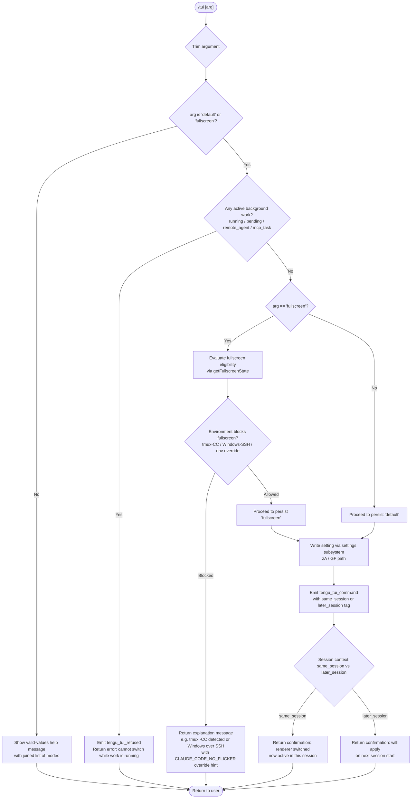

# `/tui`

> Analysis basis: CC v2.1.176 bundle.js (AST extraction + Claude interpretation)
> Minimum version: v2.1.176

---

## Overview

The `/tui` command switches the terminal UI renderer used by Claude Code between two modes: `default` and `fullscreen`. It validates the requested mode against environmental constraints (tmux, Windows-over-SSH, background session state), blocks the switch when active background work is in progress, and persists the chosen renderer via the settings subsystem. Background sessions always ignore this setting, always using the fullscreen renderer.

---

## Registration

| Field | Value |
|---|---|
| type | `local-jsx` |
| name | `tui` |
| description | `Set the terminal UI renderer (default \| fullscreen)` |
| argumentHint | `[default\|fullscreen]` |
| module_id | `GzK` |
| load_inline | `true` |
| loc_byte | `12735220` |
| loc_byte_end | `12735402` |
| loc_line | `8930` |
| arbor_handler.name | `BsL` |
| arbor_handler.fqn | `claude-2.1.176::BsL` |
| arbor_handler.kind | `AsyncFunction` |
| arbor_handler.resolution_path | `module_id` |
| arbor_handler.n_hits | `0` |

Analysis basis: CC v2.1.176 bundle.js:+12735220

---

## Input Branching

The command has more than three distinct execution paths depending on argument validity, environment constraints, background-session state, and renderer compatibility. A Mermaid flowchart is used.



Analysis basis: CC v2.1.176 bundle.js:+12732983 (handler entry `BsL`), +12733259 (eligibility check `Ig8`), +12733778 (`tengu_tui_refused`), +12734251 (`tengu_tui_command`)

---

## Behavioral Spec

### 1. Argument Parsing and Validation

```
function parseAndValidateTuiArg(rawArg):
    trimmed = rawArg.trim()
    validModes = ["fullscreen", "default"]   // joined for display as "fullscreen | default"
    if trimmed not in validModes:
        return errorResponse("Valid values: " + validModes.join(" | "))
    return trimmed
```

The handler (`BsL`) trims the argument string first, then checks membership in the valid-mode list. The valid-mode list is rendered as a joined string for user display.

Analysis basis: CC v2.1.176 bundle.js:+12732983 (`A.trim`), +12733095 (`lYA.join`), +12733141 (`lYA.includes`)

---

### 2. Background-Work Guard

```
function checkActiveBackgroundWork(appState):
    activeStatuses = ["running", "pending", "remote_agent", "mcp_task"]
    sessions = Object.values(appState.sessions)
    hasActive = sessions.some(s => activeStatuses.includes(s.status))
    if hasActive:
        emit("tengu_tui_refused")
        return errorMessage(
            "Cannot switch renderers while work is running in the background" +
            " — wait for it to finish (or stop it via /tasks), then run /tui again."
        )
    return null   // clear to proceed
```

This guard runs before any environment check. If any session has a status in the blocked set, the command refuses and fires the `tengu_tui_refused` telemetry event.

Analysis basis: CC v2.1.176 bundle.js:+12733689 (`"running"`), +12733711 (`"pending"`), +12733732 (`"remote_agent"`), +12733757 (`"mcp_task"`), +12733778 (`tengu_tui_refused`), +12733819 (error message literal)

---

### 3. Background-Session Renderer Note

The handler reads an informational literal stating that background sessions always use the fullscreen renderer so that scrolling and mouse interaction work correctly when attached. The `/tui` setting therefore applies only to sessions started directly with `claude`. This note is surfaced to the user as part of help/context output.

Analysis basis: CC v2.1.176 bundle.js:+12733293 (informational literal)

---

### 4. Fullscreen Eligibility Check

```
function getFullscreenState(env):
    // Check environment variables
    noFlicker   = env.CLAUDE_CODE_NO_FLICKER is set
    disableAlt  = env.CLAUDE_CODE_DISABLE_ALTERNATE_SCREEN is set
    forceUpsell = env.CLAUDE_CODE_FORCE_FULLSCREEN_UPSELL is set

    // tmux -CC (iTerm2 integration) detection
    if tmuxCCModeDetected() and not noFlicker:
        return blockedResult(
            "fullscreen disabled: tmux -CC (iTerm2 integration mode) detected" +
            " · set CLAUDE_CODE_NO_FLICKER=1 to override",
            reason = "tmux_cc_auto_off"
        )

    // Windows over SSH (ConPTY) detection
    if windowsOverSSHDetected() and not noFlicker:
        return blockedResult(
            "fullscreen disabled: Windows over SSH (ConPTY re-rendering) detected" +
            " · set CLAUDE_CODE_NO_FLICKER=1 to override",
            reason = "win_ssh_auto_off"
        )

    // Determine effective mode considering settings + feature flags
    // Possible reasons: bg_forced_on, env_off, env_on, tmux_cc_auto_off,
    //                   win_ssh_auto_off, settings_on, settings_off,
    //                   downsell_on, gb_on, gb_off
    return resolvedModeResult()
```

The fullscreen-eligibility function (`y1` / `hXH`) evaluates environment variables, terminal identity (tmux-CC, Windows-SSH), and feature-flag/settings layers in order. The `CLAUDE_CODE_NO_FLICKER` variable overrides both auto-off rules.

Analysis basis: CC v2.1.176 bundle.js:+12730336 (`CLAUDE_CODE_NO_FLICKER`), +12730361 (`CLAUDE_CODE_DISABLE_ALTERNATE_SCREEN`), +12730400 (`CLAUDE_CODE_FORCE_FULLSCREEN_UPSELL`), +3527119 (tmux-CC message), +3527305 (Windows-SSH message), +3527453 (`"fullscreen"`), +3527479 (`"default"`), +3527864–3528241 (reason code literals)

---

### 5. Terminal Environment Probing (`GI` / `getTerminalEnvironmentInfo`)

```
function getTerminalEnvironmentInfo():
    // Check IDE terminal integrations
    if isJetBrainsIdeTerminal():
        return terminalInfo("jetbrains", ...)

    // Probe terminal emulator identity via env vars / OSC queries
    // Checks for: cursor, vscode, ghostty, iTerm.app, xterm.js
    // Ghostty version gate: requires >= 1.2.0
    // iTerm gate: requires >= 3.6.6 (version parsed via parseFloat, Math.min cap = 20)

    platform = process.platform   // "darwin" | "win32" | other
    ...
    return terminalInfo(detectedTerminal, supportsFullscreen)
```

The terminal-probing helper checks `$TERM_PROGRAM` / OSC responses for known emulators (ghostty, iTerm.app, vscode, cursor, xterm.js). Minimum version gates are enforced: Ghostty requires `1.2.0` and iTerm requires `3.6.6`.

Analysis basis: CC v2.1.176 bundle.js:+3597164 (`GI` entry), +3594681 (`"ghostty"`), +3594711 (`"1.2.0"`), +3594750 (`"iTerm.app"`), +3594782 (`"3.6.6"`), +3597957 (`"vscode"`), +3597908 (`"cursor"`), +3598077 (`"xterm.js"`), +3598033–3598044 (version numeric constants 1092000 / 1105000)

---

### 6. Settings Persistence

```
async function persistTuiSetting(mode, settingsManager):
    // settingsManager corresponds to the zA / GF / AL_ call chain
    await settingsManager.writeUserSetting("theme.tui", mode)
    // Internally uses: userSettings -> settings.json
    //                  projectSettings -> .claude/settings.json
    //                  localSettings -> .claude/settings.local.json
    // Persistence path depends on scope selected
```

The settings write path flows through `zA` → `GF` → `AL_` → `WF` (write-setting utility), ultimately calling `FhA` (`ra8.set`) to persist. Settings layers consulted: `policySettings`, `flagSettings`, `userSettings`, `projectSettings`, `localSettings`.

Analysis basis: CC v2.1.176 bundle.js:+12734007 (`zA` call from `BsL`), +1322758 (`"policySettings"`), +1322780 (`"flagSettings"`), +1303045 (`"userSettings"`), +1303109 (`"projectSettings"`), +1303131 (`"localSettings"`), +1303381 (`"settings.json"`), +1303755 (`"settings.local.json`")

---

### 7. Telemetry Emission and Session Tag

```
function emitTuiCommandEvent(mode, sessionContext):
    // sessionContext is "same_session" or "later_session"
    emit("tengu_tui_command", {
        mode: mode,
        context: sessionContext   // same_session | later_session
    })
```

After a successful write, `tengu_tui_command` is emitted with a context tag that distinguishes whether the new renderer takes effect immediately in the current session (`same_session`) or only on the next launch (`later_session`).

Analysis basis: CC v2.1.176 bundle.js:+12734251 (`tengu_tui_command`), +12734715 (`"same_session"`), +12734730 (`"later_session"`)

---

### 8. Relaunch / Process Lifecycle (sub-call via `TU6` / `yZH`)

The handler calls into a relaunch routine (`TU6` → `yZH`) that manages process lifecycle when a renderer switch requires a process restart. The relaunch sequence:

```
async function relaunchIfRequired(args):
    // 1. Determine binary path (LC → kR8 / k3H) using ~/.local/share/claude/versions/bin
    // 2. Stop active render loop (XxH: unmount Ink, write sync escape codes)
    // 3. Flush scroll summary (ET8 → tengu_scroll_summary)
    // 4. Wait for analytics drain: Promise.race([timeout(30000), drain()])
    //    label: "flush timeout (relaunch)"
    // 5. Wait for cleanup: timeout(2000, "cleanup timeout")
    // 6. Wait for analytics flush: timeout label "analytics flush timeout"
    // 7. Remove all process listeners; re-register SIGINT / SIGHUP handlers
    // 8. spawnSync new process with --resume flag + inherited stdio
    // 9. process.exit with child exit code (offset +128 for signal exits)
```

Key constants:
- Flush timeout (relaunch): 30 000 ms (Analysis basis: CC v2.1.176 bundle.js:+12728383)
- Cleanup timeout: 2 000 ms (Analysis basis: CC v2.1.176 bundle.js:+12728440)
- Analytics flush label: `"analytics flush timeout"` (Analysis basis: CC v2.1.176 bundle.js:+12728501)
- Resume flag passed to new process: `--resume` (Analysis basis: CC v2.1.176 bundle.js:+12728316)
- Signal offset: `128` (Analysis basis: CC v2.1.176 bundle.js:+12729304)
- Error label for spawn failure: `"relaunch_spawn_error"` (Analysis basis: CC v2.1.176 bundle.js:+12729167)

The binary location is resolved through the versioned install path: `~/.local/share/claude/versions/bin` (components: `.local` at +6952706, `share` at +6952715, `claude` at +9620163, `versions` at +9620172, `bin` at +6952786).

---

## State & Side Effects

| Item | Detail |
|---|---|
| Telemetry — `tengu_tui_refused` | Fired when the switch is blocked because background work is active (bundle.js:+12733778) |
| Telemetry — `tengu_tui_command` | Fired on successful mode change; tagged `same_session` or `later_session` (bundle.js:+12734251) |
| Telemetry — `tengu_scroll_summary` | Fired during relaunch sequence when scroll state is flushed (bundle.js:+7431229) |
| Telemetry — `tengu_amber_creek` | Fullscreen feature-flag telemetry event (bundle.js:+3527636) |
| Telemetry — `tengu_pewter_brook` | Fullscreen feature-flag telemetry event (bundle.js:+3527544) |
| Settings write | Persists chosen mode to user/project settings via `zA` → `GF` → `AL_` → `WF` → `FhA` |
| Process relaunch | When renderer switch requires restart: flushes analytics, unmounts Ink renderer, spawnSync new process with `--resume`, then `process.exit` |
| Environment variables read | `CLAUDE_CODE_NO_FLICKER`, `CLAUDE_CODE_DISABLE_ALTERNATE_SCREEN`, `CLAUDE_CODE_FORCE_FULLSCREEN_UPSELL` |
| appState read | Background session statuses (`running`, `pending`, `remote_agent`, `mcp_task`) checked before allowing switch |
| Terminal probing | OSC / env-var queries to detect ghostty, iTerm.app, vscode, cursor, xterm.js, JetBrains |

---

## Version History

| Version | Change |
|---|---|
| v2.1.176 | Initial analysis |

---

## Common Mistakes

1. **Calling `/tui` while background tasks are active** — the command will refuse with an explicit message directing the user to `/tasks`. Wait for all background work to complete first.
2. **Expecting fullscreen to work inside tmux -CC (iTerm2 integration mode)** — fullscreen is automatically disabled. Set `CLAUDE_CODE_NO_FLICKER=1` to override if you understand the rendering trade-offs.
3. **Expecting `/tui` to affect background daemon sessions** — background sessions always use the fullscreen renderer regardless of this setting; the command only controls directly-launched `claude` sessions.
4. **Running `/tui fullscreen` over Windows SSH without the override** — ConPTY re-rendering causes flicker; the command auto-disables fullscreen and instructs the user to set `CLAUDE_CODE_NO_FLICKER=1` to force it.
5. **Expecting instant effect without a restart** — when the renderer switch requires a process relaunch, the current process terminates (after flushing analytics) and a new process is spawned with `--resume`; ongoing terminal state is lost during this window.

---

## Appendix — Identifier Mapping

> For bundle debugging only. Identifiers change across versions.

| Identifier | Role |
|---|---|
| `BsL` | Main `/tui` command handler (AsyncFunction, Arbor-resolved) |
| `TU6` | Relaunch dispatch caller (calls `yZH`) |
| `yZH` | Core relaunch / process-lifecycle orchestrator |
| `LC` | Binary path resolver (top-level) |
| `kR8` | Binary path builder variant A |
| `k3H` | Binary path builder variant B |
| `s9H` | Binary path builder variant C |
| `J08` | Home-directory path joiner |
| `gh` | Git/environment helper (called during relaunch) |
| `S6` | Environment helper (calls `eG`) |
| `eG` | Low-level environment getter |
| `By6` | Interval clear helper |
| `ri_` | clearInterval wrapper |
| `XxH` | Ink renderer unmount / terminal escape writer |
| `_R` | Post-unmount cleanup helper |
| `aO8` | Terminal restore / alternate-screen writer |
| `OSH` | Terminal capability detector (ghostty/iTerm version gates) |
| `_SH` | Alternate-screen state helper |
| `i0` | tmux / screen escape sequence emitter |
| `L5` | Logging utility |
| `N` | General-purpose logger / message formatter |
| `ET8` | Scroll-summary flush orchestrator |
| `N0` | Scroll state reader |
| `v1q` | Scroll metrics calculator |
| `d` | Generic debug logger |
| `V1q` | Frame timing / animation utility (Date.now, Math.round) |
| `E1q` | Animation frame scheduler |
| `y1` | Fullscreen eligibility resolver (main) |
| `f_H` | Feature-flag set checker |
| `ah_` | Feature-flag getter A |
| `Et` | Feature-flag getter B |
| `oh_` | Feature-flag getter C (windows platform check) |
| `r_` | Settings reader utility |
| `Uc4` | Fullscreen upsell / downgrade resolver |
| `$6` | Ink render-mode state manager |
| `Z4` | Promise timeout / race utility |
| `QZ` | Analytics queue coordinator |
| `P4` | Analytics flush trigger |
| `u9` | Analytics event registrar |
| `qQH` | Analytics drain caller |
| `WxH` | Ink render-mount wrapper |
| `GT8` | Ink render component getter |
| `dYA` | Post-relaunch working-directory restorer |
| `T_` | Environment variable setter |
| `Cf` | Environment helper (calls `eG`) |
| `YzK` | Native library loader (bun:ffi, libSystem / libc execve) |
| `L` | FFI library handle |
| `kX` | Relaunch-error file writer |
| `Ig8` | Valid-mode list builder / argument validator |
| `jvH` | CLI argument assembler |
| `tf8` | Config file watcher initializer |
| `C6` | Config object constructor |
| `G5H` | Config file reader (readFileSync, statSync) |
| `ug4` | Config file watcher (watchFile / unwatchFile) |
| `u_` | App-state session list reader |
| `mu8` | Session property extractor A (working_directory etc.) |
| `f1` | Session field accessor |
| `pu8` | Session property extractor B (allowed_tools etc.) |
| `Mx` | Permission-mode disabler |
| `u$` | App-state renderer-setting reader |
| `G9` | Daemon-worker identity check |
| `BjH` | Worker-type constant holder |
| `hXH` | Fullscreen-state explainer (builds reason string for UI) |
| `zA` | Settings load-and-write coordinator |
| `n3` | Settings file locator |
| `JDH` | Settings path resolver (userSettings / projectSettings) |
| `Je6` | Settings path helper A (Fy.resolve / dirname) |
| `sQf` | Settings path helper B |
| `Tm` | Settings path joiner |
| `aQf` | Managed-settings path builder |
| `Tb` | Settings layer aggregator |
| `DD6` | Local settings path builder (wsl / managed-settings.json) |
| `_L_` | Settings merge coordinator |
| `PaA` | Policy-settings merger |
| `HL_` | Project-settings merger |
| `WF` | Settings read-write gateway |
| `BhA` | Settings cache reader (`ra8.get`) |
| `HS` | Structured-clone wrapper |
| `s7_` | Settings field parser / validator |
| `FhA` | Settings cache writer (`ra8.set`) |
| `JaA` | Inline-SDK settings merger |
| `N7H` | Settings field normalizer |
| `DlH` | Settings conflict / error reporter |
| `_W` | Settings file reader (resolves real path) |
| `Os` | Settings file loader (readFileSync + encoding detection) |
| `UL` | Real-path resolver (realpathSync) |
| `xs6` | Settings file existence checker |
| `k8` | Error code inspector |
| `z7_` | Settings timestamp recorder |
| `ZhH` | Settings path + layer combiner |
| `EY6` | Atomic file writer (rename, fchmod, fsync) |
| `CH` | JSON serialiser wrapper |
| `Kz` | Settings cache invalidator (Ac6.clear / ra8.clear) |
| `Nt6` | Gitignore / file-ignore checker |
| `x6` | AsyncLocalStorage context getter |
| `bs6` | Store getter (Cs6.getStore) |
| `n4_` | Ignore-rule compiler |
| `vt6` | File-ignore checker (git check-ignore path) |
| `n_` | Git-check-ignore runner |
| `vgf` | Path normaliser for ignore checks |
| `jrA` | Git ls-files tracker |
| `JrA` | Git-tracked file query |
| `n6` | Error wrapper helper |
| `GF` | Settings write orchestrator (calls AL_ / Tb) |
| `tG` | Performance-mark emitter |
| `fq` | Memory-usage logger |
| `eu` | perf_hooks require wrapper |
| `AL_` | Settings write sequencer (Date.now, S8, PaA, WF) |
| `S8` | Append-file logger (appendFileSync, mkdirSync) |
| `Kc6` | Settings write lock |
| `YD6` | Dirty-set tracker |
| `K` | Padding / formatting utility |
| `qc6` | Settings write completion notifier |
| `GI` | Terminal environment prober |
| `ZG6` | Terminal-env base resolver |
| `NY` | Terminal-name normaliser |
| `ly_` | Cursor / VSCode IDE terminal detector |
| `sr4` | IDE terminal version reader |
| `Ww` | Fallback terminal capability resolver |
| `tr4` | Terminal version parser (parseFloat, Math.min cap=20) |
| `ny_` | Terminal version string extractor |
| `Fm` | React / Ink component factory |
| `Rb` | Ink renderer constructor |
| `zE4` | Ink stream setup |
| `A6` | String coercer |
| `nf` | Output stream selector |
| `Lz` | Ink reconciler initialiser |
| `eNH` | ANSI output helper |
| `ycA` | Terminal write-stream wrapper |
| `$9` | Feature-flag / entitlement resolver |
| `Wg1` | Entitlement evaluator |
| `AJH` | Feature-gate renderer |
| `xb` | Feature-flag record constructor |
| `HP6` | Feature-flag file reader (readFileSync) |
| `yLH` | Feature-flag list filter |
| `Aq` | Telemetry consent checker |
| `GLH` | Feature-gate string formatter |