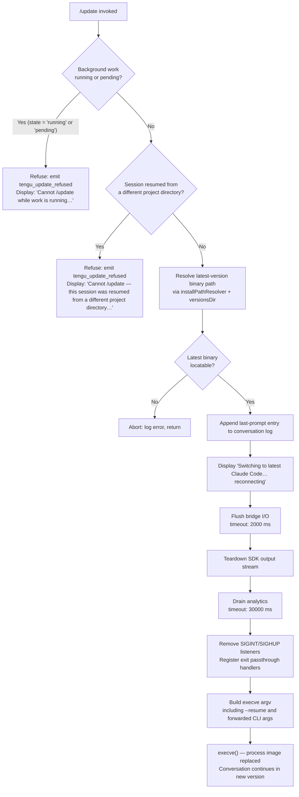

# `/update`

> Analysis basis: CC v2.1.176 bundle.js (AST extraction + Claude interpretation)
> Minimum version: v2.1.176

---

## Overview

`/update` switches the running Claude Code CLI process to the latest installed version without ending the current conversation. It performs a full graceful teardown of the active session — flushing pending I/O, draining analytics, stopping background workers — and then relaunches the CLI binary in-place via `execve`, forwarding all original arguments plus a `--resume` flag so that the conversation continues seamlessly on the new version.

---

## Registration

| Field | Value |
|---|---|
| type | `local` |
| name | `update` |
| description | `Switch to the latest version (conversation continues)` |
| isHidden | `true` |
| supportsNonInteractive | `false` |
| module_id | `CJK` |
| load_inline | `true` |
| loc_byte | `13009550` |
| loc_byte_end | `13009791` |
| loc_line | `9173` |
| arbor_handler.name | `U65` |
| arbor_handler.fqn | `claude-2.1.176::U65` |
| arbor_handler.kind | `AsyncFunction` |
| arbor_handler.resolution_path | `module_id` |
| arbor_handler.n_hits | `0` |

Analysis basis: CC v2.1.176 bundle.js:+13009550

---

## Input Branching

Five distinct decision paths exist before the relaunch proceeds, requiring a Mermaid flowchart.



Analysis basis: CC v2.1.176 bundle.js:+13007438 (refusal gate), +13008060 (directory mismatch guard), +13008572 (user-facing status message), +13008639 (flush timeout), +12728942 (spawnSync/execve call)

---

## Behavioral Spec

### 1. Pre-flight Guards

The handler (`U65`) begins by reading current application state to decide whether the update may proceed.

```
async function updateCommandHandler(context):

    # Guard 1 — background work in progress
    bgState = getBackgroundWorkState()   # checks 'running' | 'pending' statuses
    if bgState == "running" or bgState == "pending":
        emitTelemetry("tengu_update_refused")
        displayError(
            "Cannot /update while work is running in the background — " +
            "wait for it to finish, then try again."
        )
        return

    # Guard 2 — session originated in a different working directory
    if sessionDirectoryMismatch():
        emitTelemetry("tengu_update_refused")
        displayError(
            "Cannot /update — this session was resumed from a different " +
            "project directory. Restart manually with --resume to continue " +
            "on the latest version."
        )
        return
```

Analysis basis: CC v2.1.176 bundle.js:+13007713 ("running"), +13007735 ("pending"), +13007816 (background-work error string), +13008060 (directory-mismatch error string), +13007452 (telemetry event)

---

### 2. Locating the Latest Binary

`installPathResolver` (`LC`) walks the versioned install tree to find the target binary.

```
function resolveLatestBinaryPath():
    versionsRoot = joinPath(
        homeDir(),          # rt9.homedir()
        ".local", "share",  # literals at +6952706, +6952715
        "versions"          # literal at +9620172
    )
    entries = readVersionDirectories(versionsRoot)
    latest  = pickLatestVersion(entries)   # Array.isArray check + sort
    binPath = joinPath(
        homeDir(),
        ".local", "share", "versions", latest,
        "bin", "claude"     # literals at +6952786; "claude" at +13007355
    )
    return binPath
```

`binaryLocator` (`E3`) cross-checks via `Bun.which` to confirm the binary is executable.

Analysis basis: CC v2.1.176 bundle.js:+13007352 (call to `fQ8`/binaryLocator), +13007405 (call to `LC`/installPathResolver), +860802 (`Bun.which`), +6952706 (".local"), +6952715 ("share"), +9620172 ("versions"), +6952786 ("bin")

---

### 3. Pre-relaunch Conversation Bookmarking

Before tearing down, the handler appends a `last-prompt` entry to the conversation log so the resumed session can reconstruct context.

```
function bookmarkConversation(appState):
    lastAssistantMsg = findLastMessage(
        appState.messages,
        where: role starts with "assistant-"   # literal at +13008362
    )
    appendEntry(conversationLog, "last-prompt", lastAssistantMsg)
    # literal "last-prompt" at +13544373
```

Analysis basis: CC v2.1.176 bundle.js:+13008387 (getAppState call), +13008280 (call to `$jA`/bookmarkConversation), +13544353 (appendEntry call), +13544373 ("last-prompt")

---

### 4. Session Teardown Sequence

The teardown orchestrator (`yZH`) performs an ordered multi-phase shutdown.

```
async function gracefulTeardown(context):

    # Phase 1 — display status to user
    displayMessage("Switching to latest Claude Code… reconnecting")
    # literal at +13008572

    # Phase 2 — generate a fresh session UUID for the resumed session
    newSessionId = generateUUID()   # KQ8.randomUUID, +13006425

    # Phase 3 — flush the SDK output bridge with a 2000 ms deadline
    await raceWithTimeout(
        sdkOutputWriter.flush(),
        timeoutMs = 2000,            # literal at +13008652
        label     = "bridge flush"   # literal at +13008657
    )

    # Phase 4 — teardown the SDK output stream
    sdkOutputWriter.teardown()

    # Phase 5 — stop the TUI render loop (unmount, clear intervals)
    tuiRenderer.unmount()
    clearRenderInterval()

    # Phase 6 — drain analytics with a 30000 ms deadline
    await raceWithTimeout(
        analyticsQueue.drain(),      # qQH → DyA.drain
        timeoutMs = 30000,           # literal at +12728383
        label     = "analytics flush timeout"  # literal at +12728501
    )

    # Phase 7 — detach all SIGINT / SIGHUP listeners and install
    #            passthrough handlers that forward signals to the new process
    process.removeAllListeners()
    process.on("SIGINT",  forwardSignal)   # literal at +12728856
    process.on("SIGHUP",  forwardSignal)   # literal at +12728875
    process.on("beforeExit", passthrough)  # literal at +12729031
    process.on("exit",    passthrough)     # literal at +12729072
```

Analysis basis: CC v2.1.176 bundle.js:+13008568 (SJK/UUID generator), +13008639 (Z4/timeout wrapper), +13008642 (flush), +13008693 (teardown), +12728490 (WxH/TUI teardown), +12728434 (qQH/analytics drain), +12728885 (removeAllListeners), +12728915 (process.on)

---

### 5. Argv Construction and execve

`argvBuilder` (`Ig8`) assembles the complete argument vector for the replacement process.

```
function buildRelaunchArgv(originalContext):
    args = Array.from(originalContext.cliArgs)

    # Forward session identity
    args.push("--resume", sessionId)         # literal "--resume" at +12728316

    # Forward additional working directories (--add-dir)
    for dir in extraDirs:
        args.push("--add-dir", dir)          # literal at +12729840

    # Forward permission flags if set
    if bypassPermissions:
        args.push("--allow-dangerously-skip-permissions")  # literal at +12729955

    # Forward effort / model / permission-mode overrides
    if effortOverride:
        args.push("--effort", effortValue)   # literal at +12730097
    if permissionModeOverride:
        args.push("--permission-mode", mode) # literal at +12730114

    return args

function execRelaunch(binaryPath, argv, env):
    # Replaces the current process image — no return
    execve(binaryPath, argv, inheritEnv())   # M.execve, +12727819
    # stdio inheritance: "inherit"           # literal at +12728977
```

If `execve` itself fails (e.g. permission error), `relaunchErrorHandler` (`kX`) writes a diagnostic file and the process exits with code `128`.

Analysis basis: CC v2.1.176 bundle.js:+13008874 (Ig8 call), +12729665 (Array.from), +12728316 ("--resume"), +12729840 ("--add-dir"), +12729955 ("--allow-dangerously-skip-permissions"), +12730097 ("--effort"), +12730114 ("--permission-mode"), +12727819 (execve), +12728977 ("inherit"), +12729167 ("relaunch_spawn_error"), +12729304 (exit code 128)

---

### 6. Post-relaunch State Patch (resumed process)

When the new process starts with `--resume`, `sessionStateRestorer` (`u_`) re-hydrates the conversation by reading back the bookmarked entry.

```
function restoreSessionState(appState):
    lastEntry = appState.messages.findLast(
        where: type == "working_directory"   # literal at +10759788
    )
    allowedTools    = readSetting("allowed_tools")    # +10759843
    disallowedTools = readSetting("disallowed_tools") # +10759898
    avoidPrompts    = readSetting("avoid_prompts")    # +10759959
    permissionMode  = readSetting("permission_mode")  # +10760061
    bypassPerms     = readSetting("bypassPermissions")# +10760092
    effort          = readSetting("effort")           # +10760416
    model           = readSetting("model")            # +10760429
    maxThinking     = readSetting("max_thinking_tokens") # +10760441
    flagSettings    = readSetting("flag_settings")    # +10760467
    return reconstructedState
```

Analysis basis: CC v2.1.176 bundle.js:+13008878 (u_ call), +10759683 (H.getAppState), +10759763 (A.findLast), +10759788 ("working_directory")

---

## State & Side Effects

| Item | Detail |
|---|---|
| Telemetry — `tengu_update_refused` | Fired on either pre-flight guard failure (background work active or directory mismatch); loc +13007452 |
| Telemetry — `tengu_scroll_summary` | Fired inside the TUI scroll/render teardown path; loc +7431229 |
| Telemetry — `tengu_amber_creek` | Fired in the fullscreen/render context during teardown; loc +3527636 |
| Telemetry — `tengu_pewter_brook` | Fired in a related render-state branch; loc +3527544 |
| Conversation log | `last-prompt` entry appended before teardown; loc +13544373 |
| App state mutation | `_.setAppState` called during relaunch preparation; loc +13008462 |
| SDK output | `O.writeSdkMessages` → `O.flush` → `O.teardown` executed in sequence; loc +13008548, +13008642, +13008693 |
| TUI | Render loop unmounted, intervals cleared; loc +12728344 |
| Analytics | `DyA.drain` with 30 000 ms timeout; loc +12728434 |
| Process listeners | All existing listeners removed; SIGINT, SIGHUP, beforeExit, exit re-registered; loc +12728885 |
| Process image | `jzK.spawnSync` / `M.execve` replaces the process; no fork — same PID slot; loc +12728942, +12727819 |
| Error file | On `execve` failure, `kX` writes a diagnostic via `p8H.writeFileSync`; loc +197092 |
| Exit code on exec failure | `128`; loc +12729304 |

---

## Version History

| Version | Change |
|---|---|
| v2.1.176 | Initial analysis |

---

## Common Mistakes

1. **Triggering `/update` during an active background task.** The command is unconditionally refused with a human-readable error if any background work is in state `"running"` or `"pending"`. Wait for background tasks to finish before invoking the command.

2. **Expecting `/update` to work in a session that was `--resume`d from a different project directory.** The directory-mismatch guard fires in this scenario; users must restart manually with `--resume` against the correct directory.

3. **Assuming the command is visible in help output.** The registration sets `isHidden: true`, so `/update` does not appear in the standard slash-command listing.

4. **Assuming `/update` works non-interactively.** `supportsNonInteractive: false` means invoking it in a piped or non-TTY context is not supported.

5. **Expecting immediate reconnection.** The teardown sequence includes a 2 000 ms bridge-flush timeout and a 30 000 ms analytics-drain timeout; visible reconnection can be delayed by up to ~32 seconds in the worst case.

---

## Appendix — Identifier Mapping

> For bundle debugging only. Identifiers change across versions.

| Identifier | Role |
|---|---|
| `U65` | Main async handler for `/update` (arbor_handler) |
| `fQ8` | Binary locator — checks `Bun.which` for the `claude` executable |
| `E3` | `Bun.which` wrapper used by binary locator |
| `YUA` | Inner `Bun.which` call inside binary locator |
| `LC` | Install-path resolver — walks versioned install tree |
| `kR8` | Version-directory enumerator (reads `versions/` dir) |
| `G$` | Array check utility (`Array.isArray`) |
| `k3H` | Home-directory path builder (`.local/share/…`) |
| `J08` | `os.homedir()` wrapper |
| `s9H` | Secondary path builder for bin directory |
| `G9` | Process-role classifier (`bg`, `daemon`, `daemon-worker`) |
| `BjH` | Process-role enum / constants |
| `d` | Generic logger / debug emitter |
| `nJ` | Basename + script-name extractor |
| `S6` | Async-wait / delay utility |
| `eG` | Core event-emitter or promise primitive |
| `gh` | File-system stat helper |
| `dYA` | Working-directory resolver (checks and changes cwd) |
| `T_` | Directory existence tester |
| `Cf` | Path-normalisation helper |
| `IfH` | Session-identity reader |
| `F6H` | Attachment-type checker (checks `_45.has`) |
| `cd8` | Attachment registry lookup |
| `$jA` | Conversation-log bookmark writer (appends `last-prompt`) |
| `P4` | Conversation-log accessor |
| `u9` | `DyA.register` wrapper |
| `_` | App-state store (exposes `getAppState`, `setAppState`, `appendEntry`) |
| `kH` | Structured-logger / error-log sink |
| `JA` | Error-message formatter |
| `A6` | String coercion utility |
| `Aq` | Log-level filter / telemetry router |
| `ycA` | Log-level comparator |
| `JUf` | Ring-buffer log rotation (shift/push) |
| `$J` | Message-type classifier (`assistant-` prefix filter) |
| `O` | SDK output-stream manager (writeSdkMessages, flush, teardown) |
| `m8` | Underlying SDK message serialiser |
| `SJK` | Session UUID generator (`KQ8.randomUUID`) |
| `Z4` | Promise race-with-timeout utility |
| `IPH` | String coercion for display messages |
| `yZH` | Graceful-teardown orchestrator |
| `By6` | Interval-clear helper |
| `ri_` | `clearInterval` wrapper |
| `XxH` | TUI unmount coordinator |
| `H` | TUI renderer instance (unmount, replaceAll) |
| `_R` | Post-unmount cleanup hook |
| `aO8` | Terminal-output writer (writeSync to stdout) |
| `OSH` | Terminal-compatibility layer (Ghostty / iTerm version checks) |
| `_SH` | Supplementary terminal-write helper |
| `i0` | tmux / screen escape-sequence handler |
| `L5` | Line-buffered output helper |
| `N` | ANSI colour / style formatter |
| `ET8` | Scroll-summary emitter (`tengu_scroll_summary`) |
| `N0` | Scroll-position reader |
| `v1q` | Scroll measurement helper |
| `V1q` | Scroll-metrics calculator (`Date.now`, `Math.max`, `Math.round`) |
| `E1q` | Scroll-metrics sub-calculator |
| `y1` | Fullscreen-mode controller |
| `f_H` | Fullscreen capability tester |
| `ah_` | Fullscreen string builder |
| `Et` | Fullscreen enable helper |
| `oh_` | Windows-over-SSH detector |
| `r_` | Fullscreen state-machine |
| `Uc4` | Fullscreen teardown helper |
| `$6` | Render-event dispatcher |
| `QZ` | Conversation-log accessor (alternative path) |
| `qQH` | Analytics drain wrapper (`DyA.drain`) |
| `WxH` | TUI wait-for-render-complete helper |
| `GT8` | Render-completion signal |
| `YzK` | Execve relaunch core (dlopen libc, build env, call `M.execve`) |
| `L` | Native FFI library handle (dlopen) |
| `A` | Native symbol table |
| `q` | Pending-operations queue |
| `f` | FFI call wrapper |
| `$` | Push/enqueue utility |
| `kPK` | Metric/analytics event emitter |
| `D` | Daemon process manager |
| `b` | Background-session process handle |
| `n8` | Timeout-with-abort utility |
| `bH` | Feature-flag OK reporter (`tengu_feature_ok`) |
| `IH` | Feature-flag BAD reporter (`tengu_feature_bad`) |
| `Yd8` | Low-memory threshold checker (`tengu_bg_low_mem_mb`) |
| `aSH` | Stale-checkpoint file cleaner |
| `Q` | Background PTY socket manager |
| `WVA` | Spare-session claim handler (`tengu_bg_spare_claim`) |
| `vVA` | Background-session lifecycle manager |
| `Y` | Forced-shutdown handler (`process.exit`) |
| `E8` | Event-emitter helper |
| `eH` | Low-level error event emitter |
| `F` | Disposable resource handle |
| `M` | MCP / execve bridge (`M.execve`) |
| `LbH` | MCP connection initialiser |
| `Ho8` | MCP update applier (`H.applyMcpUpdate`) |
| `vZA` | MCP client registry updater |
| `z` | Daemon stop/teardown controller |
| `gS` | Daemon analytics flush |
| `hB` | Daemon shutdown race (`Promise.race`, `process.exit`) |
| `TH` | String-to-display formatter |
| `kX` | Relaunch-error diagnostic writer (`p8H.writeFileSync`) |
| `Ig8` | Argv builder for relaunched process |
| `jvH` | CLI-arg introspection helper |
| `tf8` | Config-file watcher toggle |
| `C6` | Config file loader/watcher |
| `Q6` | Config path resolver |
| `ZN_` | Config schema validator |
| `G5H` | Config file reader/copier (handles versioned backup) |
| `ug4` | Config file watch initiator |
| `u_` | Session-state restorer (reads bookmarked context on resume) |
| `mu8` | Allowed-tools state reader |
| `f1` | State field accessor |
| `pu8` | Disallowed-tools state reader |
| `Mx` | Permission-mode state reader |
| `u$` | Full app-state snapshot reader |