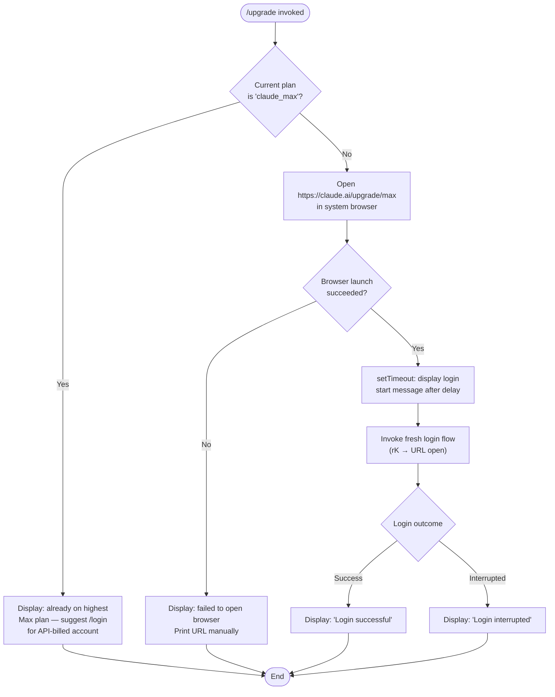

# `/upgrade`

> Analysis basis: CC v2.1.176 bundle.js (AST extraction + Claude interpretation)
> Minimum version: v2.1.176

---

## Overview

`/upgrade` guides the authenticated user through upgrading their Claude subscription to the Max tier, which provides higher API rate limits and expanded access to the Opus model. When the user is already on the highest available Max plan, the command short-circuits with an informational message; otherwise it opens the Claude Max upgrade URL in the system browser and, if that succeeds, initiates a fresh login flow to apply the new credentials.

---

## Registration

| Field | Value |
|---|---|
| type | `local-jsx` |
| name | `upgrade` |
| description | `Upgrade to Max for higher rate limits and more Opus` |
| loc_byte | `13053293` |
| loc_byte_end | `13053540` |
| loc_line | `9179` |
| module_id | `NjA` |
| load_inline | `true` |
| arbor_handler.name | `UU6` |
| arbor_handler.fqn | `claude-2.1.176::UU6` |
| arbor_handler.kind | `AsyncFunction` |
| arbor_handler.resolution_path | `module_id` |
| arbor_handler.n_hits | `0` |

Registration block spans bytes `(13053293, 13053540)`.

Analysis basis: CC v2.1.176 bundle.js:+13053293

---

## Input Branching

Three distinct paths exist based on the current subscription state and browser-launch result, so a Mermaid flowchart is used.



Analysis basis: CC v2.1.176 bundle.js:+13052182 (handler entry `UU6`), +13052268 (`"max"` literal), +13052412 (`"claude_max"` plan literal), +13052293 (`"default_claude_max_20x"` tier literal), +13052513 (already-on-max message), +13052659 (`https://claude.ai/upgrade/max` URL), +13052818 (login-start message), +13053013 (`"Login successful"`), +13053032 (`"Login interrupted"`), +13053086 (browser-failure message).

---

## Behavioral Spec

### 1. Plan Detection and Early-Exit

```
async function upgradeCommandHandler(context):
    planName = getCurrentPlan(context)          // inspects appState / auth token

    if planName == "claude_max":
        displayMessage(
            "You are already on the highest Max subscription plan. " +
            "For additional usage, run /login to switch to an API usage-billed account."
        )
        return                                  // early exit — no browser opened
```

The handler reads the current plan identifier `"claude_max"` from application state and compares it. A secondary tier literal `"default_claude_max_20x"` is also present at byte +13052293, suggesting multi-tier Max plan detection.

Analysis basis: CC v2.1.176 bundle.js:+13052412, +13052293, +13052513

---

### 2. Browser Launch

```
async function launchUpgradeBrowser():
    targetURL = "https://claude.ai/upgrade/max"

    try:
        openURLInBrowser(targetURL)             // calls rK → platform dispatcher
        return true
    catch:
        displayMessage(
            "Failed to open browser. Please visit https://claude.ai/upgrade/max to upgrade."
        )
        return false
```

`openURLInBrowser` (obfuscated: `rK`) branches by `process.platform`:
- `"darwin"` → `open <url>`
- `"win32"` → `rundll32 url,OpenURL <url>`
- other → `xdg-open <url>`

The function first validates the URL scheme; only `"http:"` and `"https:"` are accepted.

Analysis basis: CC v2.1.176 bundle.js:+13052656 (`rK` call), +13052659 (URL literal), +6294339 (`V07` scheme validator), +6294102 (`"http:"`), +6294124 (`"https:"`), +6294411 (`"darwin"`), +6294427 (`"win32"`), +6294511 (`"rundll32"`), +6294585 (`"open"`), +6294592 (`"xdg-open"`), +13053086 (browser-failure message)

---

### 3. Delayed Login Initiation

```
async function initiateFreshLogin(context):
    setTimeout(function():
        displayMessage(
            "Starting new login following /upgrade. " +
            "Exit with Ctrl-C to use existing account."
        )
    , DELAY_MS)

    result = await performLogin(context)        // calls n_ → zhH OAuth flow

    if result.success:
        displayMessage("Login successful")
    else:
        displayMessage("Login interrupted")
```

The `setTimeout` call at byte +13052498 ensures the upgrade-start notice appears after the browser opens. The login implementation (`n_` → `zhH`) mirrors the `/login` command's OAuth flow, including token storage via secure storage and fallback to plaintext.

Analysis basis: CC v2.1.176 bundle.js:+13052498 (`setTimeout`), +13052818 (start-message literal), +13052656 (`rK` login opener), +13053013 (`"Login successful"`), +13053032 (`"Login interrupted"`)

---

### 4. OAuth Profile Resolution (`VjH`)

Called during login to fetch and validate the user's OAuth profile:

```
async function resolveOAuthProfile(token):
    headers = { "Content-Type": "application/json" }
    // HTTP GET with 10 000 ms timeout
    response = await httpGet(profileEndpoint, headers, timeout=10000)

    if success:
        emit telemetry("oauth_profile_fetch")
        return profileData
    else:
        emit telemetry("oauth_profile_token_failed")
        throw error
```

Timeout value: 10 000 ms (bundle.js:+2125271). Telemetry events emitted: `"oauth_profile_fetch"` (+2125287) and `"oauth_profile_token_failed"` (+2125354).

Analysis basis: CC v2.1.176 bundle.js:+13052354 (`VjH` call), +2125228, +2125243, +2125271, +2125287, +2125354

---

### 5. Session / State Management (`RTH`, `kH`)

After login completes, the handler re-invokes `RTH` (session context component) and `kH` (settings writer) to propagate the new credentials into application state. This covers:

- Applying the updated API key or OAuth token to `appState` via `H.setAppState` (byte +9637612)
- Notifying the change via `H.onChangeAPIKey` (byte +9637153)
- Refreshing remote managed settings (`KA6` / `Wr_` flow) so that plan-based feature flags reflect the upgraded tier
- Re-enrolling the trusted device if required (`Ry6`)

Analysis basis: CC v2.1.176 bundle.js:+13052951 (`RTH`), +13053065 (`kH`), +9637153, +9637460, +9637612

---

## State & Side Effects

| Item | Detail |
|---|---|
| Telemetry — `tengu_feature_ok` | Emitted on successful feature check (bundle.js:+1018758) |
| Telemetry — `tengu_feature_sad` | Emitted on feature check soft-failure (bundle.js:+1018906) |
| Telemetry — `tengu_feature_bad` | Emitted on feature check hard-failure (bundle.js:+1018825) |
| Telemetry — `tengu_policy_limits_fetch` | Emitted when enterprise/team policy limits are refreshed post-login (bundle.js:+7418578) |
| Telemetry — `tengu_managed_settings_security_dialog_shown` | Emitted if a remote managed-settings consent dialog is required (bundle.js:+7461059) |
| Telemetry — `tengu_managed_settings_security_dialog_accepted` | Emitted when the user accepts the dialog (bundle.js:+7461440) |
| Telemetry — `tengu_managed_settings_security_dialog_rejected` | Emitted when the user rejects the dialog (bundle.js:+7461599) |
| Telemetry — `tengu_disable_bypass_permissions_mode` | Emitted if bypass-permissions mode is cleared during session reset (bundle.js:+11202372) |
| Telemetry — `tengu_auto_mode_config` | Emitted when auto-mode configuration is evaluated after credential refresh (bundle.js:+11200261) |
| Telemetry — `tengu_daemon_config_reload` | Emitted when the daemon config is reloaded following login (bundle.js:+16997877) |
| Browser side effect | Opens `https://claude.ai/upgrade/max` via native OS command |
| `appState` changes | `H.setAppState` called to persist new token and plan metadata (bundle.js:+9637612) |
| Hook registration | `u9` registers a cleanup hook via `DyA.register` (bundle.js:+65203); process `exit`/`beforeExit` listeners managed by `JaH` (bundle.js:+3314103, +3314921) |
| Secure storage | New OAuth token written via `aI1` secure-storage path; plaintext fallback emits `"plaintext_fallback_used"` (bundle.js:+2317647) |
| Remote settings refresh | `KA6` / `Wr_` pull latest managed settings after auth change; emits `"Remote settings: Refreshed after auth change"` (bundle.js:+7467990) |
| Policy limits refresh | `Ny6` / `z1q` re-fetches enterprise policy limits; emits `"Policy limits: Refreshed after auth change"` (bundle.js:+7420388) |
| `setTimeout` delay | Applied before displaying login-start notice (bundle.js:+13052498) |

---

## Version History

| Version | Change |
|---|---|
| v2.1.176 | Initial analysis |

---

## Common Mistakes

1. **Running `/upgrade` on an API-key account**: the command is designed for OAuth/Max subscription accounts. Users authenticated with `ANTHROPIC_API_KEY` should visit the Claude console directly instead.
2. **Expecting instantaneous effect**: after the browser opens, there is a deliberate `setTimeout` delay before the login sequence starts. Closing the terminal immediately after seeing the browser will abort the credential update.
3. **Already on Max**: users already subscribed to `claude_max` (including the `default_claude_max_20x` tier) will see an early-exit informational message rather than a browser window. Use `/login` instead to switch account types.
4. **Browser unavailable**: in headless or remote SSH environments the browser launch will fail. The command will print the upgrade URL (`https://claude.ai/upgrade/max`) to the terminal so the user can open it manually.
5. **Interrupted login**: pressing Ctrl-C during the OAuth flow after the browser opens leaves the session in the pre-upgrade state. The user must re-run `/upgrade` or `/login` to complete the credential exchange.

---

## Appendix — Identifier Mapping

> For bundle debugging only. Identifiers change across versions.

| Identifier | Role |
|---|---|
| `UU6` | Main async handler for `/upgrade` command (Arbor-resolved, `claude-2.1.176::UU6`) |
| `NA` | Pre-flight check / auth state resolver called at handler entry |
| `sw` | Auth provider selector / credential dispatcher |
| `XL` | CLI argument parser utility |
| `A6` | String conversion / formatting helper |
| `dc6` | `--bare` flag extractor |
| `Fj` | OAuth credential builder (assembles `profile-implicit` / `user_oauth` fields) |
| `l18` | Token type resolver |
| `LaH` | Auth profile assembler |
| `yF` | OAuth token file-descriptor reader (`CLAUDE_CODE_OAUTH_TOKEN_FILE_DESCRIPTOR`) |
| `cV` | Flag-settings mapper (`flagSettings` key) |
| `yb` | Auth array inclusion checker |
| `nf` | Provider-type guard (rejects `bedrock`, `foundry`, `vertex`, etc.) |
| `o_` | Error formatter |
| `QP` | Auth context passthrough |
| `kO` | API key / auth initialiser (`ANTHROPIC_API_KEY`, `apiKeyHelper`) |
| `K06` | Key-validation helper |
| `ogH` | VS Code client-type check (`claude-vscode`) |
| `DJ6` | API key file-descriptor reader (`CLAUDE_CODE_API_KEY_FILE_DESCRIPTOR`) |
| `C6` | Telemetry event emitter / timestamp recorder |
| `kb` | Token history trimmer (keeps last 20 entries) |
| `L06` | Auth profile loader wrapper |
| `VjH` | OAuth profile HTTP fetcher (10 000 ms timeout) |
| `F1` | OAuth URL builder / endpoint resolver |
| `OUA` | Environment classifier (`prod` / `local` / `staging`) |
| `iTf` | OAuth base-URL selector |
| `IH` | Credential reader — primary path |
| `d` | Low-level storage read |
| `eH` | Storage key hasher |
| `nM6` | Keychain namespace constant |
| `n6` | Credential reader — secondary path |
| `pz` | Profile response validator |
| `N` | Logger / structured-output writer |
| `gff` | Log-line formatter |
| `JyA` | Log-level encoder |
| `H` | Random-delay jitter utility (uses `Math.random` + `setTimeout`) |
| `CH` | JSON serialiser wrapper |
| `bf` | Redaction formatter (`[REDACTED]` substitution) |
| `ikA` | Sensitive-field mapper |
| `q` | I/O stream reference |
| `A` | File-system / stream helper |
| `kQH` | TTY write helper |
| `mkA` | Raw terminal write |
| `lff` | Log-file writer (appends to rotating log) |
| `AQH` | Buffered-write scheduler (`setTimeout` + `setImmediate`) |
| `g4H` | Log rotation helper |
| `Q6` | Log directory resolver |
| `r$6` | Error-code classifier (`EISDIR`) |
| `skA` | Log file path builder |
| `dH_` | Atomic file rename helper (`.txt` suffix, rename → unlink) |
| `cff` | Log-segment writer (`_S.mkdir`, `_S.appendFile`) |
| `u9` | Process-exit hook registrar (`DyA.register`) |
| `kH` | Settings persistence writer |
| `JA` | Error constructor wrapper |
| `Aq` | Settings schema validator |
| `ycA` | Settings normaliser |
| `JUf` | Settings queue manager (`ys6` shift/push) |
| `rK` | Platform URL opener (dispatches `open` / `rundll32` / `xdg-open`) |
| `V07` | URL scheme validator (accepts `http:` / `https:` only) |
| `NY` | URL sanitiser |
| `p8` | Main interactive-session bootstrapper |
| `n_` | REPL / session runner |
| `zhH` | OAuth interactive flow controller |
| `Y` | Forced-shutdown handler (`process.exit` + `z.abort`) |
| `iFf` | Login result stringifier |
| `L5` | Session teardown helper |
| `E8` | Error-code extractor |
| `x6` | Async-local-storage context accessor |
| `bs6` | Context store reader (`Cs6.getStore`) |
| `T_` | Event-gate checker |
| `rf` | Conversation-state snapshot helper |
| `RTH` | Session context / credential propagation component |
| `lgH` | Timestamp generator (`Date.now`) |
| `KA6` | Remote managed-settings manager |
| `S9q` | Settings diff calculator |
| `dy6` | Settings decoder |
| `erA` | Settings schema parser |
| `vr` | Remote settings HTTP client |
| `P7H` | HTTP request builder |
| `G_H` | Response header reader |
| `TvH` | Gateway mode constant |
| `Lz` | Settings cache writer |
| `M7` | Message-builder helper |
| `ZT` | Conversation event emitter |
| `O06` | Operation dispatcher |
| `pT8` | Settings-change notifier (`tN.notifyChange`) |
| `HoA` | Change-notification formatter |
| `Xr_` | Remote settings polling scheduler (`setTimeout`) |
| `G9q` | Poll-interval constant |
| `Wr_` | Remote settings fetch-and-apply pipeline |
| `W7H` | Settings hash comparator |
| `Q1q` | SHA-256 hasher (`g1q.createHash`) |
| `yB7` | Settings parser / validator |
| `bH` | Credential reader (tertiary path) |
| `AlH` | Cache integrity checker |
| `v9q` | Remote-settings error logger |
| `T9q` | Security-check dialog presenter |
| `E9q` | Security-approval handler |
| `N9q` | Settings atomic file writer (384-byte buffer, utf-8) |
| `I9q` | Session-context query helper |
| `k9q` | Background-poll registration |
| `fT8` | Interval manager (`setInterval` / `clearInterval`) |
| `kB7` | Background-poll callback |
| `Ny6` | Policy-limits manager |
| `vi_` | Policy-limits timeout guard |
| `yi_` | Policy-limits initialiser |
| `yLH` | Model inclusion checker |
| `OT8` | Policy-limits load scheduler |
| `xb` | Policy-limits HTTP client |
| `_JH` | Policy-limits cache path builder |
| `wT8` | Policy-limits fetch-and-apply pipeline |
| `z1q` | Policy-limits parser / persister |
| `w1q` | Policy-limits background-poll handler |
| `ojH` | Opus-access flag reader |
| `QAH` | Session cleanup / teardown orchestrator |
| `em` | Event emitter dispatch |
| `Fm` | Cleanup event formatter |
| `JaH` | Process-signal cleanup handler (`exit` / `beforeExit`) |
| `DN_` | Interval + listener remover |
| `xi_` | Trusted-device enrolment initiator |
| `x_` | Module initialiser / ES-module shim |
| `Pd6` | Module binding helper |
| `k0H` | Conversation-state reader |
| `$6` | Message-queue dispatcher |
| `mf` | Credential store accessor |
| `aI1` | Secure-storage read/write (with plaintext fallback) |
| `Ry6` | Trusted-device enrolment HTTP flow |
| `rS` | Feature-flag / policy evaluator |
| `W06` | Feature-flag store reader |
| `G06` | Feature-flag store writer |
| `eM8` | Feature-flag cache manager (`MN_`, `KXH`) |
| `IK9` | Feature-value resolver (`f.getFeatureValue`) |
| `tU7` | Enrolment pre-check helper |
| `ki_` | Enrolment eligibility checker |
| `K` | Policy-allowed / policy-enforced evaluator |
| `f` | Pending-operation set manager |
| `L` | Stream / connection lifecycle manager |
| `ps6` | Enrolment request builder |
| `TH` | HTTP status stringifier |
| `ckq` | Opus-access post-upgrade checker |
| `Hb6` | Auto-mode gate evaluator |
| `RR8` | Bypass-permissions mode guard |
| `YN_` | Session-mode resolver |
| `Qy6` | Auto-mode availability checker |
| `FO` | Permission-operation dispatcher |
| `u_` | App-state reader for session overrides |
| `mu8` | Override reader — allowed tools |
| `f1` | App-state field extractor |
| `pu8` | Override reader — disallowed tools |
| `Mx` | Permission-mode applicator |
| `S1A` | Rate-limit / usage-stats refresher |
| `_b6` | Session initialiser / bootstrapper |
| `Ab6` | Full session setup (model selection, auto-mode, permissions) |
| `dAH` | Settings-header writer |
| `U5A` | Model capability checker |
| `p5A` | Plan-based model validator |
| `g1` | UI component renderer |
| `LJH` | Model family classifier (`claude-3-`, `claude-opus-4-*`, etc.) |
| `S46` | Auto-mode configuration evaluator |
| `w` | Output stream / supervisor writer |
| `eW6` | Model-string normaliser |
| `J6H` | Session-config serialiser |
| `sC` | Conversation-start emitter |
| `JMH` | Permission-mode change logger (`permission_mode_changed`) |
| `xOH` | Permission-object mapper |