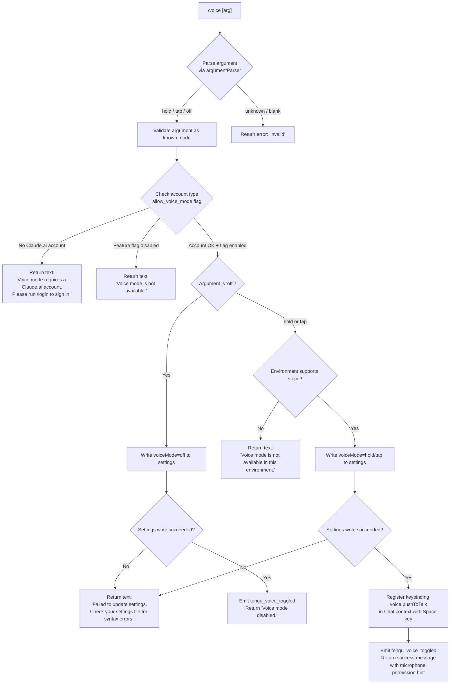

# `/voice`

> Analysis basis: CC v2.1.176 bundle.js (AST extraction + Claude interpretation)
> Minimum version: v2.1.176

---

## Overview

The `/voice` command toggles voice mode for the Claude Code CLI, supporting three sub-modes: `hold` (push-to-talk), `tap` (tap-to-talk), and `off` (disable voice). It validates account eligibility and feature availability before committing any state change, and persists the new mode into user settings on the disk.

---

## Registration

| Field | Value |
|---|---|
| type | `local` |
| name | `voice` |
| description | Toggle voice mode |
| argumentHint | `[hold\|tap\|off]` |
| supportsNonInteractive | `false` |
| isHidden | `null` |
| module_id | `m0K` |
| load_inline | `true` |
| loc_byte | `13327066` |
| loc_byte_end | `13327308` |
| loc_line | `9714` |
| arbor_handler.name | `i95` |
| arbor_handler.fqn | `claude-2.1.176::i95` |
| arbor_handler.kind | `AsyncFunction` |
| arbor_handler.resolution_path | `module_id` |
| arbor_handler.n_hits | `1` |

Analysis basis: CC v2.1.176 bundle.js:+13327066

---

## Input Branching

The handler has 5+ distinct branches based on argument value, account type, feature flag, and environment availability; a Mermaid flowchart is required.



Analysis basis: CC v2.1.176 bundle.js:+13324551 (handler entry `i95`), +13324562 (`sw` call — settings/auth subsystem), +13324592 (account error literal), +13324691 (feature disabled literal), +13325062 (`tengu_voice_toggled`), +13325117 (`Voice mode disabled.`), +13325361 (environment unavailable literal), +13324979 (settings-write failure literal).

---

## Behavioral Spec

### 1. Handler Entry — `voiceCommandHandler` (`i95`)

The handler is an `AsyncFunction` resolved via the `m0K` module's exports.

```
async function voiceCommandHandler(args, context):
    rawArg = normalizeArg(args)            // calls argumentParser (n95 / H.trim)
    mode   = parseVoiceMode(rawArg)        // "hold" | "tap" | "off" | "invalid"

    if mode == "invalid":
        return errorResult("invalid argument")

    settingsCtx = loadSettingsContext(context)   // pL6 → _d8/$9 chain
    authStatus  = getAuthStatus(settingsCtx)      // sw → kO / Fj / LaH

    if not authStatus.hasClaideAiAccount:
        return textResult("Voice mode requires a Claude.ai account. Please run /login to sign in.")

    featureAllowed = checkFeatureFlag("allow_voice_mode", settingsCtx)   // _d8 → $9
    if not featureAllowed:
        return textResult("Voice mode is not available.")

    if mode == "off":
        ok = writeSettingsToDisk({voiceMode: "off"}, settingsCtx)    // zA chain
        if not ok:
            return textResult("Failed to update settings. Check your settings file for syntax errors.")
        emitTelemetry("tengu_voice_toggled", {mode: "off"})
        return textResult("Voice mode disabled.")

    envOk = checkVoiceEnvironment(context)    // iJA / jB6
    if not envOk:
        return textResult("Voice mode is not available in this environment.")

    ok = writeSettingsToDisk({voiceMode: mode}, settingsCtx)
    if not ok:
        return textResult("Failed to update settings. Check your settings file for syntax errors.")

    registerKeybinding({
        action:  "voice:pushToTalk",
        context: "Chat",
        key:     "Space"
    })                                         // X2 → SSH keybinding loader

    emitTelemetry("tengu_voice_toggled", {mode: mode})
    return textResult(successMessage + microphonePermissionHint)
```

Analysis basis: CC v2.1.176 bundle.js:+13324551, +13324729, +13324745, +13324812, +13324881, +13325060, +13325177, +13325207, +13325286, +13325306, +13325417, +13325636, +13325848, +13326327, +13326461

### 2. Argument Normalization — `normalizeArg` (`n95`)

```
function normalizeArg(rawInput):
    trimmed = rawInput.trim()
    if trimmed in ["hold", "tap", "off"]:
        return trimmed
    return "invalid"
```

Valid mode literals: `"hold"` (bundle.js:+13324468), `"tap"` (bundle.js:+13324480), `"off"` (bundle.js:+13324491), `"invalid"` (bundle.js:+13324512).

Analysis basis: CC v2.1.176 bundle.js:+13324421

### 3. Feature-Flag Check — `voiceModeAllowed` (`_d8` → `$9`)

```
function voiceModeAllowed(settingsCtx):
    // Reads "allow_voice_mode" key from settings layer stack
    // Returns boolean; false blocks voice activation entirely
    return readFeatureFlag("allow_voice_mode", settingsCtx)
```

Literal `"allow_voice_mode"` found at bundle.js:+13313792.

Analysis basis: CC v2.1.176 bundle.js:+13313848, +13313789

### 4. Settings Persistence — `writeSettingsChain` (`zA` and sub-calls)

The settings write chain (`zA`) performs:

```
function writeSettingsChain(patch, settingsCtx):
    path    = resolveSettingsPath(settingsCtx)   // Tm → Fy.join, ".claude/settings.json"
    current = readSettingsFile(path)              // Os → _.readFileSync
    merged  = deepMerge(current, patch)
    atomicWrite(path, merged)                     // EY6 → writeFileSync + fsyncSync + renameSync
    invalidateCaches()                            // Kz → Ac6.clear / ra8.clear
    notifyListeners()                             // XlH.emit
    return true on success, false on ENOENT / parse error
```

Settings file locations (from literals): `".claude/settings.json"` (bundle.js:+13327093 area; literal at +1303693), `".claude/settings.local.json"` (+1303755).

Analysis basis: CC v2.1.176 bundle.js:+13324881, +1322820, +1323565, +1323976

### 5. Keybinding Registration — `keybindingLoader` (`X2`)

When voice mode is switched to `hold` or `tap`, a keybinding is registered:

```
function registerVoiceKeybinding():
    action  = "voice:pushToTalk"   // literal at bundle.js:+13326330
    context = "Chat"               // literal at +13326349
    key     = "Space"              // literal at +13326356
    SSH.applyKeybinding({action, context, key})
```

The keybinding subsystem loads from `keybindings.json` and validates structure (literals: `"bindings"` at +3957648, `"keybindings.json"` at +3955578).

Analysis basis: CC v2.1.176 bundle.js:+13326327, +3964500, +3957344

### 6. Auth / Account Check — `authAndSettingsLoader` (`pL6` → `sw` / `kO`)

```
function authAndSettingsLoader(context):
    settings = loadSettingsFromDisk()     // GF → AL_ chain (logs "settings_load_started")
    auth     = resolveAuth(settings)      // kO checks ANTHROPIC_API_KEY and OAuth tokens
    if not auth.cloudAccount:
        return {hasClaideAiAccount: false}
    return {hasClaideAiAccount: true, flags: settings.flags}
```

Auth error literal: `"ANTHROPIC_API_KEY, ANTHROPIC_AUTH_TOKEN, CLAUDE_CODE_OAUTH_TOKEN, or WIF env vars (ANTHROPIC_FEDERATION_RULE_ID + ANTHROPIC_ORGANIZATION_ID) required"` (bundle.js:+3271995).

Analysis basis: CC v2.1.176 bundle.js:+13313834, +3269276, +3271607

---

## State & Side Effects

| Item | Detail |
|---|---|
| Telemetry — primary | `tengu_voice_toggled` (bundle.js:+13325062) — fired on every successful mode change |
| Telemetry — feature lifecycle | `tengu_feature_ok` (+1018758), `tengu_feature_sad` (+1018906), `tengu_feature_bad` (+1018825) — emitted by the generic feature-flag wrapper |
| Telemetry — settings | `tengu_config_parse_error` (+3337357) — emitted if settings JSON is malformed |
| Telemetry — keybinding | `tengu_custom_keybindings_loaded` (+3955484), `tengu_keybinding_fallback_used` (+3964582) — fired by the keybinding loader |
| Settings write | Persists `voiceMode` key into `~/.claude/settings.json` via atomic write (write → fsync → rename) |
| Cache invalidation | Clears internal settings caches (`Ac6`, `ra8`) after write |
| Keybinding side effect | Registers `voice:pushToTalk` / `Chat` / `Space` when enabling hold or tap mode |
| Microphone hint | On success (hold/tap), returns a user-facing hint referencing `"System Settings → Privacy & Security → Microphone"` (bundle.js:+13325868) |
| appState changes | `voiceMode` field updated in persisted settings; in-memory settings context refreshed via `XlH.emit` |
| Sound | None observed in depth-2 traversal |
| Hook registration | `XlH.emit` notifies settings-change listeners (bundle.js:+13323976) |

---

## Version History

| Version | Change |
|---|---|
| v2.1.176 | Initial analysis |

---

## Common Mistakes

1. **Omitting the argument** — `/voice` with no argument returns an `"invalid"` result; the command requires exactly one of `hold`, `tap`, or `off`.
2. **Running without a Claude.ai account** — Users authenticated only via `ANTHROPIC_API_KEY` (non-OAuth) receive the account-required error. The `allow_voice_mode` feature flag is gated on a Claude.ai (OAuth) account.
3. **Running in unsupported environments** — Even with a valid account and flag, some deployment environments (e.g. remote/headless) will return `"Voice mode is not available in this environment."` The environment check (`iJA`/`jB6`) is separate from the feature-flag check.
4. **Missing microphone permission** — After successful activation the CLI surfaces a platform-specific hint (`System Settings → Privacy & Security → Microphone`). Forgetting to grant this permission causes voice input to silently fail.
5. **Corrupted settings file** — A JSON syntax error in `settings.json` causes the write to fail with `"Failed to update settings. Check your settings file for syntax errors."` and the mode is not changed.

---

## Appendix — Identifier Mapping

> For bundle debugging only. Identifiers change across versions.

| Identifier | Role |
|---|---|
| `i95` | Main handler — `voiceCommandHandler` (AsyncFunction, arbor-resolved) |
| `pL6` | Settings + auth context loader |
| `Hd8` | Sub-loader: reads settings layer for voice flag |
| `sw` | Auth/settings orchestrator (loads settings, resolves auth) |
| `XL` | CLI argument parser / bare-mode helper |
| `Fj` | OAuth profile resolver |
| `nf` | First-party auth helper |
| `QP` | Auth-token fetch utility |
| `kO` | API key / auth validation (checks env vars) |
| `L06` | Settings layer combiner |
| `LaH` | Settings accessor helper |
| `ZT` | Feature-flag reader |
| `OB6` | Voice mode pre-check entry |
| `_d8` | Feature flag gate for `allow_voice_mode` |
| `$9` | Feature flag resolver (checks `WZ4`, `GZ4` sets) |
| `Wg1` | Settings flag loader |
| `xb` | Auth check (enterprise/team accounts) |
| `Aq` | Essential-traffic network tag |
| `GLH` | Settings path builder |
| `AJH` | Account type resolver |
| `n95` | Argument normalizer (trim + validate) |
| `H` | Random/timer utility (also used for trim at +13324812) |
| `zA` | Settings write orchestrator |
| `n3` | Settings path + telemetry setup |
| `Q6` | Logging utility |
| `_L_` | Settings merge helper |
| `_W` | Working-directory resolver |
| `Os` | File reader with encoding detection |
| `UL` | Realpath resolver |
| `N` | Platform/OS info helper |
| `xs6` | Encoding-aware file reader |
| `k8` | Error code checker |
| `E8` | ENOENT / filesystem error classifier |
| `z7_` | Timestamp setter (Rt6 map) |
| `ZhH` | Settings path + Tb telemetry emitter |
| `Je6` | Settings file path resolver |
| `EY6` | Atomic file writer (write/fsync/rename) |
| `CH` | JSON stringifier wrapper |
| `Kz` | Cache invalidator (clears Ac6 + ra8) |
| `Nt6` | gitignore / file-tracking checker |
| `x6` | AsyncLocalStorage store getter |
| `bs6` | Store getter (Cs6) |
| `n4_` | File-ignore policy lookup |
| `A` | General array/string utility |
| `vt6` | gitignore rule evaluator |
| `n_` | gitignore file parser |
| `vgf` | Path normalizer (home-dir expansion) |
| `jrA` | gitignore pattern checker |
| `JrA` | git ls-files runner |
| `Tm` | Settings directory path builder |
| `IH` | Feature telemetry emitter (`tengu_feature_ok`) |
| `d` | Telemetry event dispatcher |
| `eH` | Telemetry payload builder |
| `nM6` | Telemetry sink |
| `n6` | Feature-sad telemetry emitter |
| `bH` | Feature-bad telemetry emitter |
| `kH` | Error logger (logError) |
| `JA` | Error string converter |
| `A6` | String coercion utility |
| `JUf` | Log-ring-buffer manager |
| `M` | MCP server manager (applyMcpUpdate) |
| `LbH` | MCP connection orchestrator |
| `LQ` | MCP slot resolver |
| `p66` | MCP server config handler |
| `Kr` | MCP server connector |
| `ip` | SDK MCP server builder |
| `$28` | MCP error display helper |
| `x66` | SSE/HTTP MCP transport handler |
| `EZ` | MCP transport factory |
| `Jw` | Transport wrapper |
| `d8` | Utility: identity/passthrough |
| `uN6` | MCP slot updater |
| `do9` | MCP connection state machine |
| `ud_` | MCP cache key builder |
| `SWH` | MCP command hasher (sha256) |
| `rX8` | MCP result normalizer |
| `oX8` | MCP result wrapper |
| `zP` | MCP hash utility |
| `nX8` | MCP metadata helper |
| `mf` | MCP tool list formatter |
| `z8` | MCP debug logger |
| `k28` | MCP stdio/SSE connection runner |
| `wN7` | OAuth tool descriptor builder |
| `hl` | Heartbeat / ping utility |
| `N9H` | MCP proxy config reader |
| `h9H` | MCP connection timeout handler |
| `m9H` | MCP HTTP/SSE OAuth server |
| `d66` | MCP pending-connection tracker |
| `Y` | Process-exit handler |
| `R28` | MCP cache key builder (IW8/l9) |
| `$r` | MCP reconnect orchestrator |
| `Wm` | Heartbeat sender |
| `w` | MCP supervisor write handler |
| `K7` | MCP error logger |
| `TH` | String coercion (MCP context) |
| `YN7` | MCP race timeout |
| `zN7` | SSH environment detector |
| `S28` | MCP OAuth callback handler |
| `Q66` | MCP pending token getter |
| `c66` | MCP established-token getter |
| `to9` | MCP cache-file reader |
| `l9` | AsyncLocalStorage store getter (zd4) |
| `IW8` | MCP cache path builder |
| `_Q_` | MCP tool-call executor |
| `j` | Process manager (kill) |
| `S` | Subprocess wrapper |
| `wh` | MCP skills telemetry helper |
| `$6` | MCP skills emitter |
| `Bg_` | MCP reconnect gating helper |
| `P8` | Global config saver |
| `I` | Upgrade warning emitter |
| `Is` | Usage-credits warning |
| `ro9` | MCP async iterator wrapper |
| `bg` | MCP async iterator core |
| `J86` | Port parser (parseInt) |
| `kW8` | Port parser variant |
| `Ho8` | MCP update applier |
| `fbH` | MCP hash comparator |
| `wG` | MCP cleanup orchestrator |
| `D86` | MCP slot disposer |
| `$` | MCP state getter |
| `kPK` | Daemon status writer |
| `Cs` | Daemon context reader |
| `dU6` | Daemon status path builder |
| `vZA` | MCP full-sync handler |
| `j28` | MCP server filter (pv7/ig_) |
| `n8` | Reconnect retry scheduler |
| `X2` | Keybinding configuration loader |
| `yz8` | Keybinding file parser entry |
| `SSH` | Keybinding file reader + validator |
| `jS_` | Keybinding block builder |
| `Ng` | MCP skills emitter (keybinding path) |
| `Tf` | Keybinding transport/SK helper |
| `r5H` | Keybinding file path resolver |
| `c6` | JSON parser wrapper |
| `vz8` | Array shape validator |
| `Ez8` | Keybinding block normalizer |
| `LY9` | Keybinding telemetry dispatcher |
| `YS_` | Keybinding duplicate detector |
| `DS_` | Keybinding filter / dedup |
| `Iz8` | Keybinding platform resolver |
| `GS_` | Platform keybinding selector |
| `WS_` | Default keybinding loader |
| `tw9` | Keybinding platform formatter |
| `nt4` | Keybinding entry normalizer |
| `K6` | Telemetry action-not-found emitter |
| `ggH` | Locale/language normalizer |
| `C6` | Settings file watcher |
| `ZN_` | Settings watcher disposer |
| `G5H` | Settings file reader + backup |
| `Jm` | Comment stripper (settings JSON) |
| `gK9` | Backup directory scanner |
| `vN_` | Backup path builder |
| `D` | Daemon session manager |
| `b` | Background session runner |
| `Yd8` | Low-memory telemetry emitter |
| `aSH` | Temp-file cleanup helper |
| `Q` | PTY / socket reconnector |
| `WVA` | Daemon claim sender |
| `vVA` | Daemon session lifecycle manager |
| `F` | Disposable resource holder |
| `ug4` | Settings file watcher registrar |
| `Kg` | Settings watcher callback |
| `u9` | DyA hook registrar |

---

Note: index built via Arbor fallback; some signals (telemetry, literals) may be missing — see arbor-fallback.js.