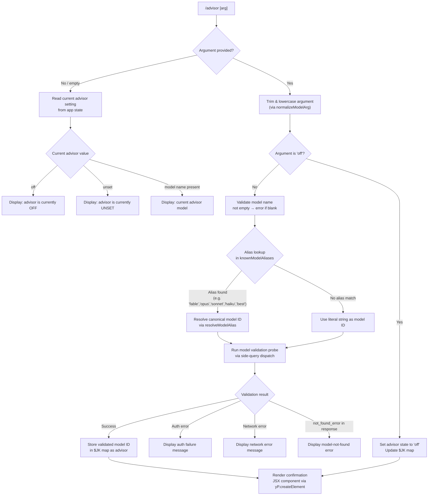

# `/advisor`

> Analysis basis: CC v2.1.177 bundle.js (AST extraction + Claude interpretation)
> Minimum version: v2.1.177

---

## Overview

The `/advisor` command lets the currently running Claude model consult a stronger "advisor" model at key decision points during a session. It accepts an optional model specifier as its argument, validates and normalizes that specifier against a known set of model aliases, and then wires up a side-query dispatch path so that the primary agent can delegate to the advisor model when needed.

---

## Registration

| Field | Value |
|---|---|
| type | `local-jsx` |
| name | `advisor` |
| description | `Let Claude consult a stronger model at key moments` |
| argumentHint | `[ ... ]` |
| isHidden | `null` (not hidden) |
| module_id | `jJK` |
| load_inline | `true` |
| loc_byte | `12984701` |
| loc_byte_end | `12984957` |
| loc_line | `9167` |
| arbor_handler.name | `v65` |
| arbor_handler.fqn | `claude-2.1.177::v65` |
| arbor_handler.kind | `AsyncFunction` |
| arbor_handler.resolution_path | `module_id` |
| arbor_handler.n_hits | `2` |

Analysis basis: CC v2.1.177 bundle.js:+12984701

---

## Input Branching

The command has four or more distinct branches depending on the argument string provided, the detected advisor state, and whether the model passes validation. A Mermaid flowchart is used.



Analysis basis: CC v2.1.177 bundle.js:+12984149, +12984185, +12984225, +12984236, +12975474, +12975588, +12975709, +12975917

---

## Behavioral Spec

### Top-Level Handler: `advisorCommandHandler` (bundle: `v65`)

The handler is an `AsyncFunction` resolved via `module_id` path (`jJK → v65`).

```
async function advisorCommandHandler(input, appState):
    rawArg = input.trim()                        // v65 → A.trim @ +12984149

    if rawArg is empty:
        currentValue = readAdvisorFromState(appState)
        render AdvisorStatusDisplay(currentValue)
        return

    normalizedArg = rawArg.toLowerCase()

    if normalizedArg == "off":
        advisorStateMap.set(sessionKey, "off")   // RU6 → $JK.set @ +12975917
        render AdvisorStatusDisplay("off")
        return

    if normalizedArg is empty:
        throw Error("Model name cannot be empty") // literal @ +12975440

    canonicalModelId = resolveModelName(normalizedArg)
    validationResult = await runModelValidationProbe(canonicalModelId)

    if validationResult indicates auth failure:
        render ErrorDisplay("Authentication failed. Please check your API credentials.")
        return                                    // literal @ +12976176

    if validationResult indicates network failure:
        render ErrorDisplay("Network error. Please check your internet connection.")
        return                                    // literal @ +12976278

    if validationResult.type == "not_found_error":
        render ErrorDisplay("model: " + canonicalModelId + ", " + validationResult.message)
        return                                    // literals @ +12976397, +12976479, +12984482

    advisorStateMap.set(sessionKey, canonicalModelId)   // $JK.set @ +12975917
    render AdvisorConfirmationDisplay(canonicalModelId) // yP.createElement @ +12984185
```

Analysis basis: CC v2.1.177 bundle.js:+12984149, +12984185, +12984303, +12984317, +12975440, +12975474, +12975588

---

### Sub-feature: Model Name Resolution (`resolveModelName`, bundle: `RU6`)

This function normalizes the user-supplied string into a canonical model identifier. It lower-cases the input, checks it against the `$JK` advisor-state map, then delegates to `resolveKnownAliases` (`j1`) for alias expansion.

```
function resolveModelName(arg):
    trimmed = arg.trim()                         // RU6 → H.trim @ +12975403
    lower   = trimmed.toLowerCase()              // RU6 → A.toLowerCase @ +12975588

    // Check known blocked/special values
    if knownBlockedSet.has(lower):               // $JK.has @ +12975709
        return lower

    canonical = resolveKnownAliases(lower)       // j1 @ +12984303
    return canonical
```

Analysis basis: CC v2.1.177 bundle.js:+12975403, +12975474, +12975588, +12975709

---

### Sub-feature: Known Model Alias Resolution (`resolveKnownAliases`, bundle: `j1`)

Maps short alias tokens to full model identifier strings. The following alias-to-model mappings are present in the literals:

| Alias token | Canonical model family |
|---|---|
| `fable` | `claude-fable-5` (literal @ +2264345) |
| `opusplan` | Opus plan tier (literal @ +2279333) |
| `sonnet` | `claude-sonnet-4-*` family (literal @ +2279374) |
| `haiku` | `claude-haiku-4-*` family (literal @ +2279413) |
| `opus` | `claude-opus-4-*` family (literal @ +2279452) |
| `best` | Resolved to highest available model (literal @ +2279486) |

The resolver also handles provider-specific prefix variants (bedrock, foundry, mantle, vertex, anthropicAws, gateway) and strips or rewrites them as needed.

```
function resolveKnownAliases(token):
    // Normalise to lowercase for comparison     // j1 → _.toLowerCase @ +2279204
    lower = token.toLowerCase()

    if lower matches "fable":
        return resolveFableModel()               // GN @ +2279250
    if lower matches "opusplan":
        return resolveOpusPlanModel()            // JT @ +2279351
    if lower matches "sonnet":
        return resolveSonnetModel()              // mjH @ +2279428 (jJ_ → Z5)
    if lower matches "haiku":
        return resolveHaikuModel()               // mjH path
    if lower matches "opus":
        return resolveOpusModel()                // RF @ +2279468
    if lower matches "best":
        return resolveBestModel()                // yD @ +2279471

    // No alias match — pass through as literal
    candidate = applyProviderPrefix(lower)       // bm @ +2279581
    return candidate
```

Model version list found in literals covers `claude-opus-4-0` through `claude-opus-4-8`, `claude-sonnet-4-0` through `claude-sonnet-4-6`, `claude-haiku-4-5`, `claude-3-7-sonnet`, `claude-3-5-sonnet`, `claude-3-5-haiku`, `claude-3-opus`, `claude-3-sonnet`, `claude-3-haiku`, and `claude-mythos-5`.

Analysis basis: CC v2.1.177 bundle.js:+2279193, +2279204, +2279222, +2279250, +2279270, +2279333, +2279374, +2279413, +2279452, +2279486

---

### Sub-feature: Model Validation Probe (`runModelValidationProbe`, bundle: `zU`)

Fires a lightweight side-query API call against the resolved model to confirm it is reachable and the credentials are valid. The call is tagged as `"model_validation"` (literal @ +12975804). The probe uses a minimal payload (a `"Hi"` message, literal @ +12975873) with `"ephemeral"` cache control (literal @ +12975898) to avoid polluting the conversation cache. On success, the call is tracked via `tengu_api_success` telemetry.

```
async function runModelValidationProbe(modelId):
    request = buildMinimalRequest(
        model    = modelId,
        messages = [{role:"user", content:"Hi"}],  // literal @ +12975873
        cache    = "ephemeral"                     // literal @ +12975898
    )

    try:
        response = await dispatchSideQuery(request,
                        tag = "model_validation")  // literal @ +12975804
        emit tengu_api_success                     // @ +13849460

        if response.type == "not_found_error":     // literal @ +12976397
            return {status: "not_found",
                    message: response.message}

        return {status: "ok", model: modelId}

    catch authError:
        return {status: "auth_error"}

    catch networkError:
        return {status: "network_error"}
```

The underlying dispatch (`zU`) uses a hash of the request for deduplication (`X2A` → `yVK.createHash` with `"sha256"` / `"hex"`, literals @ +13788033, +13788060), and applies `Math.min` bounding on context window limits (literal @ +13848689). It also emits `tengu_lone_surrogate_sanitized` when lone Unicode surrogates are detected in the payload (@ +13849209).

Analysis basis: CC v2.1.177 bundle.js:+12975804, +12975873, +12975898, +13847849, +13848033, +13849296, +13849460

---

### Sub-feature: Advisor State Map (`advisorStateMap`, bundle: `$JK`)

A persistent in-memory `Map` keyed by session identifier. Values are one of:
- `"off"` — advisor explicitly disabled (literal @ +12984225)
- `"unset"` — no advisor configured (literal @ +12984236)
- A canonical model ID string — advisor active with named model

The map is checked (`$JK.has` @ +12975709) before attempting validation to short-circuit redundant probes on repeated identical invocations. It is written (`$JK.set` @ +12975917) on successful validation or on an explicit `off` argument.

Analysis basis: CC v2.1.177 bundle.js:+12984225, +12984236, +12975709, +12975917

---

### Sub-feature: Model-Specific Alias Detail (`j65` / `J65`)

`j65` and its inner function `J65` handle the `fable-5` / `fable_5` variant explicitly:

- Checks if the lower-cased token contains `"fable-5"` or `"fable_5"` (literals @ +12976758, +12976781)
- Similarly handles `"opus-4-8"` / `"opus_4_8"`, `"opus-4-7"` / `"opus_4_7"`, `"opus-4-6"` / `"opus_4_6"`, `"opus-4-5"` / `"opus_4_5"`, `"sonnet-4-6"` / `"sonnet_4_6"`, `"sonnet-4-5"` / `"sonnet_4_5"` (literals @ +12976858–+12977235)
- Falls through to `String()` coercion for unrecognized sub-variants (literal @ +12976678)

Analysis basis: CC v2.1.177 bundle.js:+12975958, +12976013, +12976758, +12976781, +12976858, +12977235

---

## State & Side Effects

| Item | Detail |
|---|---|
| Telemetry | `tengu_api_success` (@ +13849460) — fired on successful model validation probe |
| Telemetry | `tengu_lone_surrogate_sanitized` (@ +13849209) — fired when request payload contains lone surrogates that are cleaned |
| Telemetry | `tengu_prompt_cache_1h_config` (@ +13794554) — fired during side-query context construction when 1-hour prompt cache is configured |
| Telemetry (indirect, via background dispatch) | `tengu_bg_retire_pinned_low_mem`, `tengu_bg_prewarm_per_sweep`, `tengu_bg_dispatch_sigkill_escalate`, `tengu_bg_dispatch_low_mem`, `tengu_bg_spare_enable`, `tengu_bg_spare_claim`, `tengu_bg_spare_claim_fail`, `tengu_scheduled_task_missed`, `tengu_daemon_control` — all from background worker management layer reached via `zU` dispatch path |
| Advisor state map (`$JK`) | Written on every successful `/advisor <model>` call and on `/advisor off` |
| Advisor state map (`$JK`) | Read on every `/advisor` (no-arg) call to display current status |
| Side-query dispatch | One ephemeral API call made per unique model ID to validate it; tagged `"model_validation"` |
| JSX render | Handler type is `local-jsx`; confirmation and error outputs are React elements created via `yP.createElement` |
| Sound | <!-- TODO: not found in depth-2 traversal; needs --depth 4 --> |
| appState changes | Advisor value stored in session-scoped `$JK` map; no direct global `appState` mutation observed at depth ≤ 2 |

---

## Version History

| Version | Change |
|---|---|
| v2.1.177 | Initial analysis |

---

## Common Mistakes

1. **Passing an unquoted model ID containing spaces** — the argument is trimmed and lowercased before alias lookup; unexpected spaces will not match any known alias and will fail model validation with a `not_found_error`.
2. **Using `/advisor off` expecting it to clear history** — `"off"` only disables future advisor consultations for the session; it does not revert any advice already incorporated into the conversation.
3. **Expecting instant effect** — the command fires a live validation probe (`"Hi"` message) against the Anthropic API before confirming the advisor; network latency or auth issues will surface at invocation time, not at the moment the advisor is first consulted.
4. **Using the numeric version suffix without a dash** — aliases like `opus48` will not match; the resolver expects dash-separated forms (`opus-4-8`) or the short aliases (`opus`, `sonnet`, `haiku`, `fable`, `best`).
5. **Assuming `unset` and `off` are equivalent** — `"unset"` means the advisor has never been configured (default state), while `"off"` is an explicit user action. Tooling that reads the state map should treat them distinctly.
6. **Re-running `/advisor <same model>` to refresh** — the `$JK.has` check short-circuits the validation probe when the same model ID is already stored, so no new network call is made.

---

## Appendix — Identifier Mapping

> For bundle debugging only. Identifiers change across versions.

| Identifier | Role |
|---|---|
| `v65` | Top-level advisor command handler (`AsyncFunction`) |
| `RU6` | Model name resolution and validation orchestrator |
| `j1` | Known-alias resolver (maps short tokens to canonical model IDs) |
| `j65` | Outer wrapper for fine-grained model sub-variant lookup |
| `J65` | Inner function that resolves `fable-5`, `opus-4-*`, `sonnet-4-*` sub-variants |
| `zU` | Side-query dispatch engine (sends validation probe to API) |
| `_g` | Core API request builder / HTTP client |
| `NK` | Prompt/context assembly for side queries |
| `y0H` | Advisor-specific context wrapper |
| `Di_` | Context preparation helper used inside advisor flow |
| `d_6` | Post-processing / result filter for advisor output |
| `eG8` | Result mapper combining advisor response with conversation state |
| `A` | Trimmed argument string (intermediate variable) |
| `L` | Lowercased argument / model token |
| `q` | Session/abort controller reference |
| `p1` | CLI error exit helper |
| `f` | Promise lifecycle / cleanup manager |
| `H` | General string variable (context-dependent reuse) |
| `_` | General string variable (secondary; context-dependent) |
| `BY` | Model alias table lookup helper |
| `$LH` | Model alias data structure accessor |
| `A6` | String conversion / coercion utility |
| `ff` | Model-string sanitiser / formatter |
| `GN` | Fable-model branch resolver |
| `MLH` | Opusplan / complex alias resolver |
| `YJ_` | Sub-alias resolution coordinator |
| `Z5` | Canonical model ID builder |
| `nl` | Provider-prefix normalizer |
| `sJ6` | Model string replace/sanitize helper |
| `JT` | Opusplan alias path handler |
| `jq8` | Opusplan sub-resolver |
| `fL` | Low-level model-string finalizer |
| `mjH` | Sonnet/haiku alias dispatcher |
| `jJ_` | Sonnet/haiku canonical ID resolver |
| `RF` | Opus alias path handler |
| `yD` | Best-model alias resolver |
| `XyH` | Best-model sub-resolver |
| `l_` | Base model-string utility / prefix handler |
| `KI1` | Full alias resolution entry point |
| `_AH` | Provider-context-aware model resolver |
| `L7` | Provider-type lookup helper |
| `ujH` | Array/list model check utility |
| `LLH` | Model-string inclusion checker |
| `ED6` | Model validation error builder |
| `ZD6` | Model error detail formatter |
| `$` | Session map or state store reference |
| `K` | Column/padding formatter (display) |
| `JyH` | Model include-list checker |
| `Yq8` | Recursive alias/context resolver |
| `AI1` | Object-entries alias iterator |
| `R8` | Model ranking/tier helper |
| `tnH` | Token/entry normalizer |
| `_I1` | Model-index locator |
| `uP4` | Alternate alias path (provider variant) |
| `dJ6` | Model token lowercaser / normalizer |
| `mP4` | Prefix-match alias handler (`claude-` prefix) |
| `PyH` | Model include-list validator |
| `kiH` | Model string coercion step |
| `UP4` | Lower-case alias normalizer |
| `bm` | Provider-prefix resolver entry |
| `_1` | Provider-string decomposer |
| `dz` | Model-string cleaner (includes/replace) |
| `o36` | Inference profile string builder |
| `QL` | Model-string replace utility |
| `Dz` | Provider prefix dispatch router |
| `LJ6` | Provider prefix builder (e.g. `anthropic.`) |
| `_j4` | `startsWith` prefix check helper |
| `fJ6` | Provider Object.values lookup |
| `zM` | AsyncLocalStorage store reader |
| `Gv_` | Request path/segment parser |
| `E9` | Background-type tagger (`bg`) |
| `On` | Error reporting helper |
| `I6` | Azure credential helper |
| `VJ_` | URL encoding helper |
| `N` | Request header/metadata assembler |
| `t$` | OAuth token refresher |
| `YI1` | Boolean coercion helper |
| `sw` | API key / auth credential resolver |
| `Lz` | Streaming state tracker |
| `wF4` | Request queue / rate-limit helper |
| `u_` | User credential accessor |
| `u88` | Proxy auth helper |
| `GF4` | HTTP request executor |
| `zF` | TLS/network config helper |
| `nw` | Response stream reader |
| `WF4` | Request-queue dequeue helper |
| `YF4` | SSE / event-stream parser |
| `djH` | Latency / timing tracker |
| `Zt8` | Timestamp helper |
| `oW6` | Header case-normalizer |
| `sJH` | SDK error logger |
| `xM8` | Request payload assembler |
| `S` | Supervisor / session writer |
| `I` | Warning/notification emitter |
| `k` | Background worker sweep manager |
| `V` | Request concurrency gating helper |
| `m8H` | Model metadata finder |
| `DW` | Worker kill helper |
| `Fj` | Auth profile selector |
| `$JH` | WIF token exchange handler |
| `SrH` | WIF credential resolver |
| `E` | Token expiry manager |
| `X` | Connection timeout setter |
| `M` | Connection pool manager |
| `VkH` | Claude-3 model prefix checker |
| `ry` | Provider prefix utility |
| `G` | Main REPL input/keyboard handler |
| `y` | Input stream helper |
| `Y` | Forced shutdown handler |
| `T` | Key event dispatcher |
| `z` | Daemon stop handler |
| `tc` | Key-binding utility |
| `j` | Process kill helper |
| `ACK` | Vim-mode action dispatcher |
| `pRK` | Vim yank operator |
| `gRK` | Vim visual-op operator |
| `cRK` | Vim visual-case operator |
| `b` | Register/clipboard manager |
| `nRK` | Vim visual-paste operator |
| `bRK` | Vim indent operator |
| `xRK` | Vim visual-indent operator |
| `D` | Background session spawner |
| `P` | IPC buffer reader |
| `r0A` | Vim operator-G sub-dispatcher |
| `dL5` | Message-find helper |
| `X2A` | SHA-256 hash builder |
| `Zq8` | Side-query request builder |
| `PK` | String coercion utility |
| `Tq8` | AsyncLocalStorage store reader (thread-local) |
| `EJ_` | Sub-agent context injector |
| `T38` | Context cleaner helper |
| `lbH` | Side-query dispatch entry (model + context) |
| `ZA` | Render helper (JSX composition) |
| `_e8` | Context filter helper |
| `$6` | Hook registration helper |
| `Ae8` | Result post-filter |
| `NN` | HIPAA / compliance filter |
| `Rv_` | Low-level compliance check |
| `ZkH` | Compliance flag builder |
| `KvK` | Message content transformer |
| `gM8` | Temperature/sampling config injector |
| `XW` | Message map helper |
| `M0H` | Multi-modal content builder |
| `uF` | Random-bytes nonce generator |
| `of` | Render-and-state combiner |
| `CH` | JSON.stringify wrapper |
| `QkA` | Tool-call result processor |
| `dl6` | Tool-call item checker |
| `_S` | Deep-clone helper (structuredClone) |
| `nl6` | Tool-call array normalizer |
| `cl6` | Tool-call string replacer |
| `d` | Lone-surrogate sanitizer |
| `FwH` | Timing / performance helper |
| `O1` | Output formatter |
| `nM6` | Line-prefix formatter |
| `AE6` | Agent-ID resolver |
| `Z29` | Agent-ID string builder |
| `utH` | Signal-group helper |
| `_E6` | Agent-type sub-resolver |
| `Gi` | Agent-type classifier |
| `S97` | Builtin/custom agent discriminator |
| `Cb` | Thread-type checker (`repl_main_thread`) |
| `kH` | API error logger |
| `T36` | Sweep / cycle counter |
| `y0H` | Advisor context builder |
| `Di_` | Conversation context injector for advisor |
| `yiH` | Model-list inclusion checker |
| `Jq8` | Context-layer assembler |

---

Note: index built via Arbor fallback; some signals (telemetry, literals) may be missing — see arbor-fallback.js.