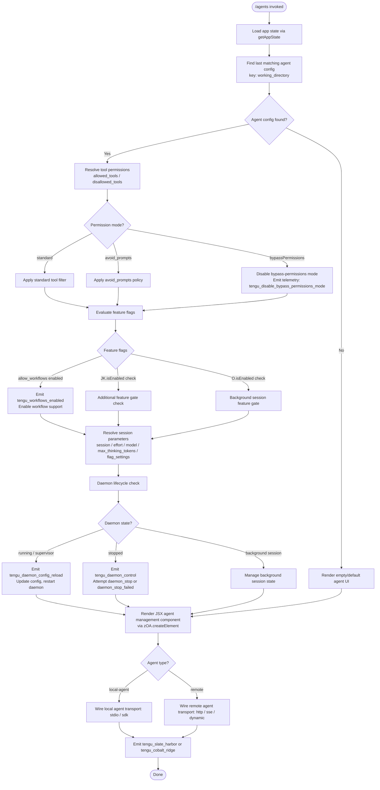

# `/agents`

> Analysis basis: CC v2.1.172 bundle.js (AST extraction + Claude interpretation)
> Minimum version: v2.1.172

---

## Overview

The `/agents` command provides a management interface for agent configurations within Claude Code. It allows users to inspect, configure, and control agent processes — including their tool permissions, working directories, session parameters, and daemon lifecycle. The command renders a JSX-based interactive UI component and coordinates with underlying agent-state and daemon-control subsystems.

---

## Registration

| Field | Value |
|---|---|
| type | `local-jsx` |
| name | `agents` |
| description | `Manage agent configurations` |
| module_id | `G3K` |
| load_inline | `true` |
| loc_byte | `12813067` |
| loc_byte_end | `12813192` |
| loc_line | `9112` |
| arbor_handler.name | `El7` |
| arbor_handler.fqn | `claude-2.1.172::El7` |
| arbor_handler.kind | `AsyncFunction` |
| arbor_handler.resolution_path | `module_id` |
| arbor_handler.n_hits | `0` |

Analysis basis: CC v2.1.172 bundle.js:+12813067

---

## Input Branching

The handler logic involves more than three distinct branching paths — agent-state loading, tool-permission filtering, daemon lifecycle management, session/model configuration, and feature-flag gating. A Mermaid flowchart is used.



Analysis basis: CC v2.1.172 bundle.js:+12812918, +10672069, +10672149, +10672447, +10672478, +12812939

---

## Behavioral Spec

### Handler Entry Point

The primary handler is the async function `El7` (Arbor-resolved via `module_id` path from module `G3K`). It calls two top-level helpers — `agentStateLoader` (`k_`) and `agentUIBuilder` (`$h`) — before invoking `zOA.createElement` to produce the JSX output.

```
async function agentCommandHandler(context):
    agentState = agentStateLoader(context)
    uiProps   = agentUIBuilder(agentState, context)
    return createElement(AgentManagementComponent, uiProps)
```

Analysis basis: CC v2.1.172 bundle.js:+12812918, +12812926, +12812939

---

### Agent State Loading (`k_`)

Retrieves current application state and locates the most-recently-configured agent entry.

```
function agentStateLoader(context):
    appState = getAppState()                          // H.getAppState

    // Find last agent config whose working_directory matches
    agentConfig = appState.findLast(entry =>
        entry["working_directory"] != null
    )

    // Extract permission fields
    allowed    = agentConfig["allowed_tools"]         // literal: "allowed_tools"
    disallowed = agentConfig["disallowed_tools"]      // literal: "disallowed_tools"
    avoidPr    = agentConfig["avoid_prompts"]         // literal: "avoid_prompts"
    permMode   = agentConfig["permission_mode"]       // literal: "permission_mode"
    bypassFlag = agentConfig["bypassPermissions"]     // literal: "bypassPermissions"

    // Disable bypass-permissions if currently active
    if bypassFlag:
        disableBypassPermissions()                    // Nb → Y6
        emitTelemetry("tengu_disable_bypass_permissions_mode")

    return { appState, agentConfig, allowed, disallowed, avoidPr, permMode }
```

Analysis basis: CC v2.1.172 bundle.js:+10672069, +10672149, +10672174, +10672229, +10672284, +10672345, +10672447, +10672478, +4259542

---

### Permission-Mode Resolution (`_b8`, `Ab8`)

Two sibling functions normalize permission-mode tokens, both delegating to a shared utility (`M1`).

```
function resolveAllowedPermissionMode(rawMode):
    return normalizePermissionToken(rawMode)    // _b8 → M1

function resolveDisallowedPermissionMode(rawMode):
    return normalizePermissionToken(rawMode)    // Ab8 → M1

function normalizePermissionToken(token):      // M1
    // Recognizes: "yes"/"on" → enabled; "no"/"off" → disabled
    // Recognizes: "disable" for bypass-permissions context
    ...
```

Constants observed: `"yes"` (+27782), `"on"` (+27788), `"no"` (+27933), `"off"` (+27938), `"disable"` (+4259643).

Analysis basis: CC v2.1.172 bundle.js:+10672247, +10672305, +10665218, +10665366, +27782, +27788, +27933, +27938, +4259643

---

### Bypass-Permissions Disabling (`Nb` → `Y6`)

When `bypassPermissions` is active in the agent config, the handler invokes the permission-disable pipeline.

```
function disableBypassPermissions():
    bypassDisabler(...)          // Nb → Y6
    emitTelemetry("tengu_disable_bypass_permissions_mode")

function bypassDisabler(...):    // Y6
    resolveN26(...)              // N26
    resolveH26(...)              // h26
    initYm(...)                  // Ym → eu
    check rjH.has(...)
    resolveN78(...)              // N78: checks eE_.has, rjH.get, eE_.add, _J_, qZ_
    V26.add(...)
    check zF.has / zF.get
    buildEntry(...)              // b6: uses Date.now, Gx4
```

Analysis basis: CC v2.1.172 bundle.js:+10672500, +4259539, +4259589

---

### UI Builder (`$h`)

Assembles the full set of props and sub-components for the agent management JSX panel.

```
function agentUIBuilder(agentState, context):
    // 1. Build agent connection entries
    connectionList = buildConnectionEntries(agentState)   // XT → wc, OK, f6, Y6

    // 2. Attach supervisor/daemon writer
    daemonWriter = buildDaemonWriter(connectionList)      // w: ZEH, q.write, iDK, DrK, etc.
    connectionList.push(daemonWriter)

    // 3. Build feature-enabled action set
    featureActions = buildFeatureActions(...)             // EAA → VCq, I_

    // 4. Build permission filter
    permFilter = buildPermissionFilter(...)               // QP → Gq8, Ym1, MJ_, fP4

    // 5. Build blocked-tool filter
    blockedFilter = buildBlockedFilter(...)               // FqH → H.filter, aR6
    // "blocked" literal at +10153114

    // 6. Build platform-specific session config
    sessionConfig = buildSessionConfig(...)               // ZAA → Ub, j96, I_
    // Platform check: "windows" (+4890716)

    // 7. Build flag settings
    flagSettings  = buildFlagSettings(...)                // f4 → t6, z4H

    // 8. Append lifecycle hooks
    lifecycleHooks.push(daemonStopHook)                  // z → kH ("daemon_stop"), bH ("daemon_stop_failed")
    lifecycleHooks.push(agentStartHook)                  // z → wS → eu, HJ_
    lifecycleHooks.push(shutdownHook)                    // z → CU → Promise.race, process.exit (500 ms timeout)

    // 9. Resolve agent run config
    agentRunConfig = buildAgentRunConfig(...)             // jQ → f4, z2, uj, Yq6, EAA, Yq, nw7, iw7, ZAA, hbq, yN

    // 10. Feature gate checks
    hasAgent    = A.has(...)
    someEnabled = K.some(...)
    featureXf   = xf(...)
    jkEnabled   = JK.isEnabled(...)
    filteredK   = K.filter(...)
    osHCheck    = osH.has(...)
    mappedK     = K.map(...)
    oEnabled    = O.isEnabled(...)

    // 11. Transport type resolution
    transportZ2 = resolveTransport(...)    // z2 → f6, Ho8
    // Transport literals: "local-agent" (+6904478), "stdio" (+6725318), "sdk" (+6725336),
    //                     "http" (+16600509), "sse" (+16600526), "dynamic" (+16600571)

    // 12. Includes check for remote/CLI context
    includesCheck = $.includes(...)        // TwK → pa, Date.now, d9, km6, CH
    // Literals: "cli" (+4894638), "remote" (+4894649), "daemon.status.json" (+12991976)

    return assembleJSXProps(...)
```

Analysis basis: CC v2.1.172 bundle.js:+10153737, +10153809, +10153824, +10153838, +10153860, +10153875, +10153887, +10153947, +10154045, +10154063, +10154103, +10154114, +10154190, +10154233, +10154244, +10154286, +10154331

---

### Daemon Writer / Supervisor (`w`)

The daemon writer component manages a named `"supervisor"` channel and coordinates config reload.

```
function buildDaemonWriter(context):
    // channel name: "supervisor" (+16774636)
    writer = ZEH(context)         // builds writer with ENOENT handling (+13179823)
    writer.write(queue)           // q.write
    writer.columnFormatter = iDK  // uses Object.keys, Math.max, column padding width 40 (+16786788)
    writer.stop  = T.stop         // uV6, V76
    writer.delete = L.delete
    writer.stop(E)                // E: W → V76, aS, UN, Promise.all, Yi, nb, SH, JA
    writer.updateConfig(E)
    writer.start(E)
    reload = DrK(...)             // → a_H: emits tengu_daemon_config_reload
    writer.set(L)
    writer.start(V)
    return writer
```

Analysis basis: CC v2.1.172 bundle.js:+16774611, +16774628, +16774636, +16774830, +16774884, +16774904, +16775033, +16775051, +16775153, +16775198, +16775209, +16775427, +4259589

---

### Daemon Lifecycle Hooks (`z`)

Three lifecycle hook entries are pushed into the hook array:

**1. Daemon Stop (`kH` — "daemon_stop"):**
```
function daemonStopHook():
    emitTelemetry("tengu_daemon_control")
    // On success: "daemon_stop"  (+16796912)
    attempt c(...)               // general utility
    attempt A6(...)              // → _56
```

**2. Daemon Stop Failed (`bH` — "daemon_stop_failed"):**
```
function daemonStopFailedHook():
    emitTelemetry("tengu_daemon_control")
    // Label: "daemon_stop_failed" (+16796949)
    attempt c(...)
    attempt A6(...)
```

**3. Agent Start (`wS`):**
```
function agentStartHook():
    initEu(...)                   // eu → nC
    Dl.push(...)
    firstPartyCheck = GhH(...)    // → zS; literal "firstParty" (+2506298)
    uuid = tj_.randomUUID()
    NnH(...)
    QB(...)
    H.emit(...)                   // emits tengu_daemon_control context
```

**4. Shutdown / Exit (`CU`):**
```
async function shutdownHook():
    result = await Promise.race([
        Promise.all([...]),
        vLH(...)                  // VLH.shutdown
    ])
    clearTimeout via NLH / ZZ_
    // 500 ms grace period (+16792030)
    d8(...)                       // abort handling: "aborted" (+2468441), "abort" (+2468519)
    process.exit(...)
```

Analysis basis: CC v2.1.172 bundle.js:+16796909, +16796932, +16796984, +16797038, +16792027, +16792069, +2506298, +2505833, +16796912, +16796949

---

### Agent Run Configuration (`jQ`)

Builds the detailed per-run config for an agent invocation.

```
function buildAgentRunConfig(agentState):
    flagSettings = buildFlagSettings(...)        // f4
    transport    = resolveTransport(...)          // z2 → f6, Ho8; "local-agent" (+6904478)

    // Agent-teams CLI flag check
    agentTeamsFlag = Yq(...)                     // → f6, LvL, Y6; literal "--agent-teams" (+6932904)
    emitTelemetry("tengu_amber_flint")           // +6933016

    // Workflow sub-config
    workflowCfg  = nw7(...)                      // → ACq, I_
    instanceCfg  = iw7(...)                      // → $Cq, I_

    // Platform session config
    sessionCfg   = ZAA(...)                      // → Ub → "windows" (+4890716), j96, I_
    // Emits: tengu_cobalt_ridge (+4890810)

    // Feature-availability check
    hbq(...)                                     // feature probe
    modelCfg     = yN(...)                       // → Pb_, N, c_, wL

    return { transport, agentTeamsFlag, workflowCfg, instanceCfg, sessionCfg, modelCfg }
```

Analysis basis: CC v2.1.172 bundle.js:+10152400, +10152416, +10152525, +10152602, +10152673, +10152692, +10152733, +10152739, +10152745, +10152943, +10152984, +10153009, +6932904, +6933016, +4890716, +4890810

---

### Model / Session Configuration (`yN`)

Resolves model-tier, thinking-token budget, and provider backend.

```
function resolveModelConfig(context):
    // Tier resolution
    tierConfig = Pb_(context)
    // Tiers: "standard" (+5013843), "tst" (+5013922, cap 100 +5013935), "tst-auto" (+5013972)

    // Model identity
    modelName = N(context)
    // Levels: "debug" (+210480)
    // Formatting: _.toUpperCase, H.trim, H.includes

    // Provider backend detection
    backend = c_(context)        // → f6; providers: "bedrock" (+2109332), "foundry" (+2109382),
                                 //   "anthropicAws" (+2109438), "mantle" (+2109492), "vertex" (+2109540)

    // Vertex-specific tool-search warning
    if backend == "vertex":
        warn("[ToolSearch:optimistic] disabled: Vertex AI does not accept the tool-search beta header. Set ENABLE_TOOL_SEARCH=true to override.")
        // +5014856

    locale = wL(context)         // → z_8

    return { tierConfig, modelName, backend, locale }
```

Analysis basis: CC v2.1.172 bundle.js:+5014320, +5013843, +5013922, +5013935, +5013972, +210480, +2109292, +2109332, +2109382, +2109438, +2109492, +2109540, +5014856, +2110253

---

### Workflow Feature Gate (`QP`)

Checks whether workflow features are available for the current session/account context.

```
function checkWorkflowPermission(context):
    // Base capability check
    baseCap = Gq8(context)       // → f6, pG

    // Workflow flag: "allow_workflows" (+2517868)
    workflowEnabled = Ym1(context)
    if workflowEnabled:
        emitTelemetry("tengu_workflows_enabled")   // +2518069

    // Per-user policy: "allow_product_feedback" (+2516447)
    userPolicy = p9(context)     // → zm1, qP4.has, oC, KP4.has, Rq, WLH, EhH, q.includes

    // License tier
    licenseCheck = MJ_(context)  // → LP4 → f6, Y6, OK, Mq; "pro" (+2518314)

    // Additional permission probe
    fP4(context)                 // → pG

    return { baseCap, workflowEnabled, userPolicy, licenseCheck }
```

Analysis basis: CC v2.1.172 bundle.js:+2517541, +2517560, +2517604, +2517632, +2517868, +2518069, +2518314, +2516447

---

### Tool Filter Resolution (`FqH` / `aR6`)

Filters the available tool set, marking tools as `"blocked"`, `"deny"`, `"cliArg"`, or `"toolsNarrowing"`.

```
function buildBlockedFilter(toolList):
    filtered = H.filter(toolList, entry => ...)    // FqH
    resolved = aR6(filtered)

    // Source classification
    denyList       = vQ(...)        // → kx8.flatMap, k3; "deny" (+11079434)
    permissionList = PfA(...)       // → Xw6, Pw6, LYH, mK_, $V

    // Origin labels
    // "cliArg"        (+11080174)
    // "toolsNarrowing"(+11080195)
    // "blocked"       (+10153114)

    combinedFilter = Ccq(...)

    return combinedFilter
```

Analysis basis: CC v2.1.172 bundle.js:+10153053, +10153068, +10153114, +11079357, +11079434, +11080174, +11080195

---

### Connection Entry Builder (`XT`)

Builds per-agent connection entries, identifying CLI vs. remote contexts.

```
function buildConnectionEntry(agentDef):
    // Boolean normalization
    boolVal  = OK(agentDef)         // → String; "yes"/"no" normalization
    strVal   = f6(agentDef)         // → String
    // Context tags: "cli" (+4894638), "remote" (+4894649)

    // Permission snapshot for this connection
    permSnap = Y6(agentDef)         // shared bypassPermissions utility

    emitTelemetry("tengu_slate_harbor")   // +4894668

    return { boolVal, strVal, permSnap }
```

Analysis basis: CC v2.1.172 bundle.js:+4894486, +4894503, +4894548, +4894638, +4894649, +4894665, +4894668

---

### Platform Session Config (`ZAA` / `Ub`)

Constructs the platform-specific session object, with special handling for Windows environments.

```
function buildPlatformSessionConfig(context):
    // Platform detection
    if platform == "windows":    // +4890716
        sessionObj = Ub_windows(context)    // Ub → t6, f6, OK, z4H, Y6
    else:
        sessionObj = Ub_default(context)

    j96(...)                       // auxiliary session probe
    I_(...)                        // module init shim

    emitTelemetry("tengu_cobalt_ridge")   // +4890810

    return sessionObj
```

Analysis basis: CC v2.1.172 bundle.js:+10153638, +10153662, +10153668, +4890709, +4890716, +4890807, +4890810

---

### Daemon Status Check (`TwK` / `km6`)

Reads daemon state from disk to determine if a reload or stop is needed.

```
function readDaemonStatus(context):
    // Status file name: "daemon.status.json" (+12991976)
    statusPath = km6.join(GwK, "daemon.status.json")
    extra      = A_()

    timestamp  = Date.now()          // +12992088
    store      = d9()                // ru4.getStore
    statusData = pa(...)             // → OLH
    serialized = CH(statusData)      // → JSON.stringify

    return statusData
```

Analysis basis: CC v2.1.172 bundle.js:+12991962, +12991976, +12992073, +12992088, +12992120, +12992137, +12992143

---

## State & Side Effects

| Item | Detail |
|---|---|
| Telemetry: `tengu_disable_bypass_permissions_mode` | Fired when agent config has `bypassPermissions` active and the handler disables it (bundle.js:+4259542) |
| Telemetry: `tengu_slate_harbor` | Fired during per-connection entry construction for CLI/remote agents (bundle.js:+4894668) |
| Telemetry: `tengu_daemon_config_reload` | Fired when daemon config is updated and reloaded via the supervisor writer (bundle.js:+16775429) |
| Telemetry: `tengu_workflows_enabled` | Fired when workflow feature flag check finds workflows permitted (bundle.js:+2518069) |
| Telemetry: `tengu_cobalt_ridge` | Fired during platform session config construction (bundle.js:+4890810) |
| Telemetry: `tengu_feature_ok` | Fired on successful feature-gate probe (bundle.js:+1016269) |
| Telemetry: `tengu_feature_bad` | Fired on failed feature-gate probe (bundle.js:+1016336) |
| Telemetry: `tengu_daemon_control` | Fired on daemon start/stop lifecycle hook execution (bundle.js:+16796987) |
| Telemetry: `tengu_amber_flint` | Fired during agent-teams flag resolution (bundle.js:+6933016) |
| App state mutation | Reads and updates app state via `getAppState()` + `findLast`; modifies permission mode fields |
| Daemon supervisor channel | Creates/writes a `"supervisor"` named channel; manages start/stop/updateConfig of the daemon process |
| Hook registration | Pushes `daemon_stop`, `daemon_stop_failed`, agent-start, and shutdown hooks into lifecycle hook array |
| JSX render | Calls `zOA.createElement` to return an interactive agent management component (bundle.js:+12812939) |
| Process exit | Shutdown hook calls `process.exit` after a **500 ms** grace period (bundle.js:+16792030) |
| UUID generation | Agent-start hook calls `tj_.randomUUID()` to assign a fresh session UUID (bundle.js:+2505833) |
| Vertex AI tool-search suppressed | When backend is `"vertex"`, tool-search beta header is not sent; warning logged (bundle.js:+5014856) |
| `daemon.status.json` read | Daemon status check reads this file from the data directory (bundle.js:+12991976) |

---

## Version History

| Version | Change |
|---|---|
| v2.1.172 | Initial analysis |

---

## Common Mistakes

1. **Expecting a text/prompt response**: `/agents` is a `local-jsx` command; it renders an interactive UI panel, not a plain text reply. Scripting tools that parse stdout text will not receive structured output from this command.
2. **Assuming `bypassPermissions` persists**: The handler actively detects and disables `bypassPermissions` mode in the loaded agent config on every invocation, so any setting applied externally may be silently reverted.
3. **Overlooking the 500 ms exit grace period**: The shutdown hook races a `Promise.all` against a 500 ms timeout before calling `process.exit`. Long-running cleanup tasks started during shutdown will be hard-killed if they exceed this window.
4. **Ignoring the Vertex AI tool-search restriction**: When running against a Vertex AI backend, the tool-search beta header is suppressed automatically. Setting `ENABLE_TOOL_SEARCH=true` overrides this, but the default behavior is silent suppression with a console warning.
5. **Treating `working_directory` as optional**: The agent-state loader uses `findLast` to locate a config entry keyed by `working_directory`. Configs that omit this field will not be matched and the UI will fall back to an empty/default state.
6. **Misidentifying the handler as a sync function**: `El7` is declared as an `AsyncFunction` (Arbor kind). Callers must `await` its result or handle the returned Promise.

---

## Appendix — Identifier Mapping

> For bundle debugging only. Identifiers change across versions.

| Identifier | Role |
|---|---|
| `El7` | Primary async handler for `/agents` command |
| `k_` | Agent state loader (reads appState, finds last agent config) |
| `H` | App-state / event-emitter utility (getAppState, filter, includes, trim, emit) |
| `A` | Agent list / array utility (findLast, has, toLowerCase, close) |
| `L` | Map/registry utility (get, set, delete, padEnd, close, finally) |
| `q` | Queue / set utility (write, add, delete, includes, close) |
| `f` | Promise-based queue flush handler (q.add, L.finally, q.delete) |
| `_b8` | Allowed-permission-mode resolver (delegates to M1) |
| `M1` | Permission token normalizer ("yes"/"no"/"on"/"off") |
| `Ab8` | Disallowed-permission-mode resolver (delegates to M1) |
| `Nb` | Bypass-permissions disable coordinator |
| `Y6` | Core bypass-permissions disable logic |
| `N26` | Sub-step of bypass-disable pipeline |
| `h26` | Sub-step of bypass-disable pipeline |
| `Ym` | Permission state initializer (→ eu) |
| `N78` | Permission set membership manager (eE_, rjH) |
| `b6` | Permission entry builder (uses Date.now, Gx4) |
| `$h` | Agent UI builder (assembles JSX props) |
| `XT` | Connection entry builder (CLI/remote contexts) |
| `wc` | Connection entry sub-utility |
| `OK` | Boolean-string normalizer (→ String) |
| `f6` | String coercion utility (→ String) |
| `w` | Daemon writer / supervisor channel manager |
| `ZEH` | Daemon writer initializer (ENOENT-aware) |
| `d9` | AsyncLocalStorage store getter (ru4.getStore) |
| `N8` | Daemon writer sub-component |
| `TwA` | Daemon writer sub-component (→ GwA) |
| `EH` | String-code utility (→ String; "code") |
| `K` | Column-map utility (f.map, L.padEnd) |
| `iDK` | Column width formatter (Object.keys, Math.max) |
| `T` | Spinner/progress stop controller (uV6, V76) |
| `uV6` | Spinner stop sub-step |
| `V76` | Spinner/progress finalization |
| `E` | Agent process controller (W; Math.max, Math.min) |
| `W` | Agent process lifecycle (connected/failed states; Promise.all, aS, UN, Yi, nb, SH, JA) |
| `DrK` | Daemon config reload trigger (→ a_H) |
| `a_H` | Config reload emitter (tengu_daemon_config_reload) |
| `V` | Secondary agent process controller |
| `c` | General utility / context accessor |
| `EAA` | Feature-enabled action set builder (→ VCq, I_) |
| `I_` | Module init shim (CZH, Pi8, aF6.call, sF6.bind, qoK, WGA.set) |
| `sF6` | Module bind helper |
| `QP` | Workflow / permission filter builder |
| `Gq8` | Base capability checker (→ f6, pG) |
| `pG` | Permission probe utility |
| `Ym1` | Workflow-enabled flag evaluator |
| `p9` | User policy checker (allow_product_feedback, qP4, KP4) |
| `MJ_` | License-tier checker (→ LP4; "pro") |
| `LP4` | License detail resolver (f6, Y6, OK, Mq) |
| `fP4` | Additional permission probe (→ pG) |
| `FqH` | Blocked-tool filter builder (H.filter, aR6) |
| `aR6` | Tool classification resolver (vQ, PfA, Ccq) |
| `vQ` | Deny-list flattener (kx8.flatMap, k3) |
| `PfA` | Permission-origin classifier (Xw6, Pw6, LYH, mK_, $V) |
| `Ccq` | Combined filter assembler |
| `ZAA` | Platform session config builder (→ Ub, j96, I_) |
| `Ub` | Platform-specific session object constructor |
| `f4` | Flag-settings builder (t6, z4H) |
| `z` | Lifecycle hook array |
| `kH` | Daemon-stop hook ("daemon_stop") |
| `A6` | Hook sub-utility (→ _56) |
| `bH` | Daemon-stop-failed hook ("daemon_stop_failed") |
| `wS` | Agent-start hook (eu, Dl.push, GhH, HJ_) |
| `eu` | Event/init utility (→ nC) |
| `GhH` | First-party check (→ zS) |
| `HJ_` | Agent session initializer (randomUUID, NnH, QB, H.emit) |
| `CU` | Shutdown hook (Promise.race, process.exit, 500 ms timeout) |
| `vLH` | Shutdown initiator (VLH.shutdown) |
| `NLH` | Timeout clearer (clearTimeout, ZZ_) |
| `d8` | Abort handler (Error, setTimeout, clearTimeout, f.unref) |
| `jQ` | Agent run config builder |
| `z2` | Transport type resolver (f6, Ho8; "local-agent") |
| `Ho8` | Transport detail utility |
| `uj` | Agent option normalizer (→ OK) |
| `Yq6` | Run config sub-component |
| `Yq` | Agent-teams flag resolver (f6, LvL, Y6; "--agent-teams") |
| `LvL` | Agent-teams flag detail utility |
| `nw7` | Workflow sub-config builder (ACq, I_) |
| `iw7` | Instance config builder ($Cq, I_) |
| `yN` | Model/session config resolver (Pb_, N, c_, wL) |
| `Pb_` | Model-tier resolver (aIH, Xb_, jfL; "standard"/"tst"/"tst-auto") |
| `N` | Model-name resolver (vVH, g8f, CH; "debug") |
| `c_` | Provider-backend detector (f6; bedrock/foundry/anthropicAws/mantle/vertex) |
| `wL` | Locale resolver (→ z_8) |
| `xf` | Feature-gate probe |
| `O` | Feature-state object (m8; isEnabled) |
| `m8` | Background-session state checker |
| `$` | Session includes checker (→ TwK) |
| `TwK` | Session timestamp/state aggregator (pa, Date.now, d9, km6, CH) |
| `pa` | Session state reader (→ OLH) |
| `km6` | Daemon status path builder (GwK.join, A_) |
| `CH` | JSON serializer (→ JSON.stringify) |

---

Note: index built via Arbor fallback; some signals (telemetry, literals) may be missing — see arbor-fallback.js.