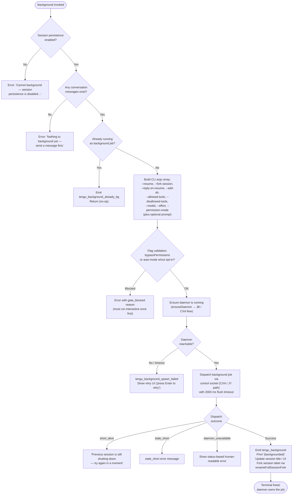

# `/background`

> Analysis basis: CC v2.1.177 bundle.js (AST extraction + Claude interpretation)
> Minimum version: v2.1.177

---

## Overview

The `/background` command (alias `/bg`) sends the current interactive REPL session to the Claude Code background daemon, freeing the terminal for other use. It forks the active conversation into a daemon-managed background job and optionally accepts a follow-up prompt to execute while running headlessly. If no daemon is running, the command triggers the daemon bootstrap flow before dispatching the job.

---

## Registration

| Field | Value |
|---|---|
| type | `local-jsx` |
| name | `background` |
| description | `Send this session to the background and free the terminal` |
| argumentHint | `[prompt]` |
| aliases | `["bg"]` |
| immediate | `null` |
| module_id | `ITK` |
| load_inline | `true` |
| loc_byte | `13434664` |
| loc_byte_end | `13434904` |
| loc_line | `9801` |
| arbor_handler.name | `yK5` |
| arbor_handler.fqn | `claude-2.1.177::yK5` |
| arbor_handler.kind | `AsyncFunction` |
| arbor_handler.resolution_path | `module_id` |
| arbor_handler.n_hits | `0` |

Analysis basis: CC v2.1.177 bundle.js:+13434664

---

## Input Branching

The handler has five or more distinct paths based on session state, persistence mode, and daemon availability — a Mermaid flowchart is used.



Analysis basis: CC v2.1.177 bundle.js:+13429111 (handler entry `kd8`), +13434155 (`yK5` → `Sd8`), +13433938 (`yK5` → `E9`), +13430469 (retry UI string), +13412510 (short_alive string), +13434018 (persistence-disabled string), +13434194 (no-messages string)

---

## Behavioral Spec

### Top-level Handler (`yK5`)

```
async function backgroundCommandHandler(context):
    // Guard: session persistence must be enabled
    if not sessionPersistenceEnabled(context):
        throw "Cannot background — session persistence is disabled, …"

    // Guard: at least one message must exist
    if conversationIsEmpty(context):
        throw "Nothing to background yet — send a message first."

    // Guard: already backgrounded
    if currentJobIsBackground(context):
        emit telemetry "tengu_background_already_bg"
        return

    // Build the resume argument vector
    argv = buildArgv(context)   // see buildArgv() below

    // Render JSX status widget (local-jsx type renders inline React component)
    renderBackgroundStatusComponent(argv, context)
```

Analysis basis: CC v2.1.177 bundle.js:+13433938, +13434004, +13434155, +13434194, +13433950

### Argument Vector Construction (`kd8`)

```
function buildArgv(context):
    args = []

    // Core session continuation flags
    args.push("--resume", sessionId)
    args.push("--fork-session")

    if promptText:
        args.push("--reply-on-resume", promptText)

    // Working directory additions
    for dir in addedDirs:
        args.push("--add-dir", dir)

    // Tool allow/deny lists
    if allowedTools.length > 0:
        args.push("--allowed-tools", allowedTools.join(","))

    if disallowedTools.length > 0:
        args.push("--disallowed-tools", disallowedTools.join(","))

    // Model / effort / permission forwarding
    if model:
        args.push("--model", model)
    if effort:
        args.push("--effort", effort)
    if permissionMode:
        args.push("--permission-mode", permissionMode)

    // Validate dangerous-permission gates
    if bypassPermissionsActive and not disclaimerAccepted:
        throw "--bg with bypassPermissions requires accepting the disclaimer first. …"
    if permissionMode == "auto" and not autoModeOptedIn:
        throw "--bg with auto mode requires opting in first. …"

    return args
```

Analysis basis: CC v2.1.177 bundle.js:+13429462 (`--resume`), +13429475 (`--fork-session`), +13429517 (`--reply-on-resume`), +13429569 (`--add-dir`), +13429604 (`--allowed-tools`), +13429645 (`--disallowed-tools`), +13429676 (`--model`), +13429705 (`--effort`), +13429722 (`--permission-mode`), +13427430 (bypass-permissions gate string), +13427729 (auto-mode gate string)

### Flush Timeout (`E4`)

```
function waitWithFlushTimeout(promise, timeoutMs = 2000):
    // Races the dispatch promise against a 2000 ms timer
    // If timer fires first, logs "flush timeout" and continues
    return Promise.race([
        promise,
        new Promise(resolve => setTimeout(resolve, timeoutMs))
    ])
    // timeout value: 2000 ms (literal at bundle.js:+13429406)
    // label: "flush timeout" (literal at bundle.js:+13429411)
```

Analysis basis: CC v2.1.177 bundle.js:+13429398, +13429406, +13429411

### Daemon Ensure / Bootstrap (`JB` / `CXA`)

```
async function ensureDaemonRunning(context):
    // Checks for a running daemon via control socket
    // On macOS/Linux spawns a service or transient process if absent
    // Prompts user once interactively: "Install as a service now? [y/N/never, or 'once']"
    // Emits: tengu_bg_daemon_cold_start_ask, tengu_bg_daemon_install,
    //        tengu_bg_daemon_spawn_failed, tengu_bg_daemon_service_stale_exec

    if daemonIsRunning():
        return daemonHandle
    if userAnswers "yes" or "once":
        installOrSpawnDaemon()
    elif userAnswers "never":
        persistNeverPreference()
    // Falls through to transient spawn if service install declined
```

Analysis basis: CC v2.1.177 bundle.js:+13363085 (`JB`), +13370732 (install prompt string), +13370863 (`yes`), +13370885 (`once`)

### Background Dispatch (`CXA` / `jTK`)

```
async function dispatchBackgroundJob(argv, daemonHandle):
    // Writes a dispatch file to the daemon's control socket directory
    // Uses randomBytes for job ID uniqueness
    // Connects via Unix socket (JY) with 6000 ms timeout
    // Awaits "ack" from daemon
    // Returns job status: short_alive | stale_short | daemon_unavailable | success

    jobId = randomBytes(…).toString("hex")
    dispatchFile = path.join(dispatchDir, jobId)
    writeDispatchFile(dispatchFile, {argv, sessionId, …})

    result = await connectAndAck(daemonSocket, jobId, timeout=6000)
    emit telemetry "tengu_bg_dispatch"

    if result.code == "EALIVE" (short-lived previous session):
        emit "short_alive" error
    if result.code == "ESTALE":
        emit "stale_short" error
    if not reachable:
        emit "daemon_unavailable"

    return result
```

Analysis basis: CC v2.1.177 bundle.js:+13402476 (`CXA`), +13402822 (`JTK.randomBytes`), +13402984 (6000 timeout), +13403086 (`EALIVE`), +13404597 (`tengu_bg_dispatch`), +13412448 (`short_alive`), +13412510 (short-alive message)

### Post-Dispatch UI (`Sd8`)

```
function renderBackgroundedUI(context):
    // Displays "(backgrounded)" marker in current REPL pane
    // Triggers session rename via renameFullSessionFork (r7K)
    // Updates title bar / window heading
    // Emits tengu_background telemetry
    // On spawn failure: shows "couldn't start in the background — press Enter to retry"
    //   and emits tengu_background_spawn_failed

    emit telemetry "tengu_background"
    print "(backgrounded)"
    renameFullSessionFork(session)
```

Analysis basis: CC v2.1.177 bundle.js:+13431649 (`(backgrounded)` string), +13430914 (`tengu_background`), +13430106 (`tengu_background_spawn_failed`), +13430469 (retry string), +13431170 (`command` literal context)

### Daemon Stop / Shutdown Path (`z` / `hB`)

When the foreground REPL exits after `/background`, the daemon stop sequence runs:

```
function shutdownForegroundRepl():
    // Aborts remaining MCP connections
    // Emits daemon_stop or daemon_stop_failed
    // Calls process.exit(0) or process.exit(1) depending on outcome
    // Races cleanup tasks with 500 ms overall shutdown timeout

    result = await Promise.race([
        Promise.all(cleanupTasks),
        sleep(500)
    ])
    process.exit(result.ok ? 0 : 1)
```

Analysis basis: CC v2.1.177 bundle.js:+17020665 (`daemon_stop`), +17020702 (`daemon_stop_failed`), +17015783 (500 ms timeout), +17015822 (`process.exit`)

---

## State & Side Effects

| Item | Detail |
|---|---|
| Telemetry: `tengu_background` | Fired on successful background dispatch (bundle.js:+13430914) |
| Telemetry: `tengu_background_already_bg` | Fired when the session is already a background job (bundle.js:+13433952) |
| Telemetry: `tengu_background_spawn_failed` | Fired when daemon dispatch fails (bundle.js:+13430106) |
| Telemetry: `tengu_bg_dispatch` | Fired inside the core dispatch routine (bundle.js:+13404597) |
| Telemetry: `tengu_bg_dispatch_fallback` | Fired on dispatch fallback path (bundle.js:+13405127) |
| Telemetry: `tengu_bg_dispatch_rescued` | Fired if a stale dispatch is recovered (bundle.js:+13411570) |
| Telemetry: `tengu_bg_daemon_cold_start_ask` | Fired when daemon is absent and user is prompted (bundle.js:+13364171) |
| Telemetry: `tengu_bg_daemon_install` | Fired when daemon service install is confirmed (bundle.js:+13363606) |
| Telemetry: `tengu_bg_daemon_spawn_failed` | Fired when daemon spawn errors out (bundle.js:+13364690) |
| Telemetry: `tengu_rename_full_session_fork` | Fired during post-background session rename (bundle.js:+12351892) |
| Telemetry: `tengu_daemon_control` | Fired inside the daemon control path (bundle.js:+17020740) |
| Flush timeout | 2000 ms (`E4`, bundle.js:+13429406) |
| Dispatch socket timeout | 6000 ms (`CXA`, bundle.js:+13402984) |
| Shutdown race timeout | 500 ms (`hB`, bundle.js:+17015783) |
| appState changes | Session state transitions to `(backgrounded)`; session title updated via fork rename |
| Hook registration | Registers `XyA.register` hook inside `m9` (bundle.js:+65203) |
| Process lifecycle | Foreground process eventually calls `process.exit` after MCP teardown |
| File I/O | Writes dispatch file to daemon socket directory; uses `randomBytes` for job ID |
| Sound | None observed in depth-2 traversal |

---

## Version History

| Version | Change |
|---|---|
| v2.1.177 | Initial analysis |

---

## Common Mistakes

1. **Running `/background` before sending any message** — the command guards against an empty conversation and will show "Nothing to background yet — send a message first." You must have at least one exchange before backgrounding.
2. **Using `/background` with `--dangerously-skip-permissions` without prior interactive acceptance** — the gate check requires the bypass-permissions disclaimer to have been accepted in an earlier interactive session; passing it only via flags will be blocked.
3. **Using `/background` in auto permission mode without prior opt-in** — similarly, `--permission-mode auto` must be accepted interactively first; the command will refuse with a gate error otherwise.
4. **Expecting instant execution when daemon is cold** — if no daemon is running, the command launches the bootstrap flow (possibly prompting "Install as a service?"), which adds latency before the job is dispatched.
5. **Conflating `/background` with `--cloud`** — the `--bg` flag and `--cloud` target different backends; the bundle explicitly rejects combinations of the two with the message "–-bg and --cloud are different backends…" (bundle.js:+13373132).
6. **Re-invoking after a short-alive collision** — if a previous session is still shutting down, the daemon returns `EALIVE` / `short_alive`; the correct action is to wait a moment and retry.

---

## Appendix — Identifier Mapping

> For bundle debugging only. Identifiers change across versions.

| Identifier | Role |
|---|---|
| `yK5` | Main async handler for `/background` command (arbor-resolved) |
| `kd8` | Argument-vector builder; collects CLI flags to forward to daemon |
| `E4` | Flush-timeout helper (2000 ms race wrapper) |
| `so` | Background-launch orchestrator; manages gate checks and session setup |
| `NK5` | Flag validation / pre-flight checker for background args |
| `PK5` | Session dispatch pipeline; builds job and connects to daemon |
| `CXA` | Core background dispatch function; writes dispatch file, awaits ack |
| `JB` | Daemon ensure-running bootstrap function |
| `jTK` | Dispatch timing / status observer |
| `JY` | Unix socket connector to daemon control socket |
| `Sd8` | Post-dispatch UI renderer; shows `(backgrounded)` marker |
| `hB` | Foreground shutdown / graceful exit with 500 ms race |
| `z` | Daemon stop sequencer (emits `daemon_stop` / `daemon_stop_failed`) |
| `Y` | Forced-shutdown path (emits `forced shutdown`, calls `process.exit`) |
| `p1` | CLI error exit helper (emits `cli_error`, calls `process.exit`) |
| `uOH` | Detach-request sender to daemon worker |
| `Yd` | Environment/context accessor used inside handler |
| `TyH` | Context store reader (async store accessor) |
| `E9` | Daemon-worker type check / initial connection probe |
| `u76` | Agent query / prompt-forwarding path |
| `mT` | Main agent turn runner called when prompt is provided with `/background` |
| `qvK` | Core REPL query engine (deeply shared; reached via background turn path) |
| `tR` | Session rename + fork trigger |
| `r7K` | Full-session fork rename emitter (`tengu_rename_full_session_fork`) |
| `M` | MCP connection manager update loop |
| `LbH` | MCP slot connector (per-server connection logic) |
| `P` | PTY/stdin byte framer (daemon attach protocol) |
| `jI5` | Daemon attach session handler (supervisor ↔ worker pipe) |
| `D` | Background worker lifecycle manager (spawn/retire) |
| `k` | Background worker sweep / grace-clock manager |
| `G` | Terminal input handler (Vim-mode key dispatcher, used in attach UI) |
| `Q` | Background PTY reconnection loop |
| `Sd8` | Argument post-processor for display/UI string construction |
| `x$` | React render helper (local-jsx command output) |
| `yd` | Alternate React render path |
| `I6` | React element factory (`eG` entry point) |
| `A6` | String coercion utility |
| `wM` | Async-context store wrapper |
| `XT` | IJ_ async store reader |
| `N0` | Context state accessor |
| `BjH` | Daemon-worker connection probe helper |
| `beq` | Daemon socket auth helper (`Gu8` / `p8`) |
| `Jd` | Low-level write to daemon channel |
| `eKH` | Event emitter helper used in detach path |
| `kq8` | Daemon message framing helper |

---

Note: index built via Arbor fallback; some signals (telemetry, literals) may be missing — see arbor-fallback.js.