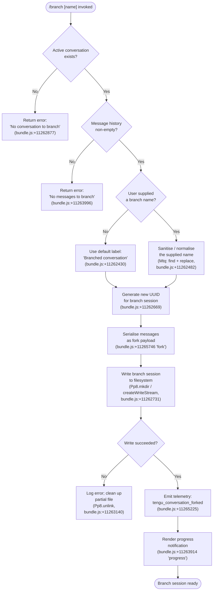

# `/branch`

> Analysis basis: CC v2.1.177 bundle.js (AST extraction + Claude interpretation)
> Minimum version: v2.1.177

---

## Overview

The `/branch` command creates a divergent copy (fork) of the current conversation at the exact point it is invoked, preserving all messages up to that moment in a new session. The user may optionally supply a name for the branch; if omitted, the implementation falls back to a sanitised default label. Internally the command serialises the conversation history to a new session file, optionally replaces content markers, and emits a `tengu_conversation_forked` telemetry event on success.

---

## Registration

| Field | Value |
|---|---|
| type | `local-jsx` |
| name | `branch` |
| description | `Create a branch of the current conversation at this point` |
| argumentHint | `[name]` |
| module_id | `KMA` |
| load_inline | `true` |
| loc_byte | `12829256` |
| loc_byte_end | `12829433` |
| loc_line | `9030` |
| arbor_handler.name | `mRL` |
| arbor_handler.fqn | `claude-2.1.177::mRL` |
| arbor_handler.kind | `AsyncFunction` |
| arbor_handler.resolution_path | `module_id` |
| arbor_handler.n_hits | `0` |

Analysis basis: CC v2.1.177 bundle.js:+12829256

---

## Input Branching

The command handler (`mRL`) has four distinct execution paths based on precondition checks and user-supplied arguments, requiring a flowchart representation.



---

## Behavioral Spec

### 1. Handler Entry Point (`mRL`)

`mRL` is the top-level `AsyncFunction` resolved by Arbor via the `module_id` path for module `KMA`.

```
async function branchCommandHandler(userArgs, appContext):
    result = await orchestrateBranch(userArgs, appContext)
    return result
```

Analysis basis: CC v2.1.177 bundle.js:+11266010

---

### 2. Branch Orchestration (`Otq`)

`Otq` is the core orchestration function called from `mRL`. It coordinates precondition checks, name resolution, session construction, and telemetry.

```
async function orchestrateBranch(userArgs, appContext):

    # Step 1: resolve and normalise the branch name
    rawName    = extractUserSuppliedName(userArgs)   # Mtq
    branchName = rawName != null
                 ? sanitiseBranchName(rawName)        # Mtq.replace
                 : "Branched conversation"            # bundle.js:+11262430

    # Step 2: retrieve active conversation messages
    messages = appContext.find(activeSession)         # $.find, bundle.js:+11265092

    if messages == null:
        return errorResult("No conversation to branch")   # bundle.js:+11262877

    if messages.length == 0:
        return errorResult("No messages to branch")       # bundle.js:+11263996

    # Step 3: build fork payload
    forkMode = "fork"                                     # bundle.js:+11265746
    forkId   = generateUUID()                             # Ktq.randomUUID, bundle.js:+11262669

    # Step 4: write branch session (via $tq)
    success = await writeBranchSession(forkId, branchName, messages, forkMode)

    if not success:
        return errorResult("Unknown error occurred")      # bundle.js:+11265894

    # Step 5: emit telemetry
    emit("tengu_conversation_forked")                     # bundle.js:+11265225

    # Step 6: show progress to user
    notifyUser(progress: "progress")                      # bundle.js:+11263914

    # Step 7: expose fork session with timestamp
    branchTime = new Date().toISOString()                 # bundle.js:+11265315

    return forkSessionDescriptor(forkId, branchTime)
```

Analysis basis: CC v2.1.177 bundle.js:+11265029 through +11265754

---

### 3. Name Sanitisation (`Mtq`)

`Mtq` normalises the user-supplied branch name before it is used as the session title.

```
function sanitiseBranchName(rawInput):
    # Find an existing session whose name matches rawInput (fuzzy)
    existing = sessionList.find(s => matches(s, rawInput))  # _.find, bundle.js:+11262482

    # Replace disallowed characters / normalise whitespace
    cleaned  = rawInput.replace(forbiddenPattern, "")       # A.replace, bundle.js:+11262560

    return cleaned
```

Analysis basis: CC v2.1.177 bundle.js:+11262482

---

### 4. Session File Writer (`$tq`)

`$tq` handles the low-level I/O required to persist the branched conversation.

```
async function writeBranchSession(forkId, branchName, messages, mode):

    # Resolve destination paths
    sessionDir  = resolveSessionDir(forkId)            # I6, zO, T_, bundle.js:+11262688–11262698
    targetPath  = buildSessionPath(sessionDir, nh, dM) # nh/dM, bundle.js:+11262706–11262720

    # Create directory (recursive)
    await fs.mkdir(sessionDir, { recursive: true })    # Pp8.mkdir, bundle.js:+11262731

    # Open read stream of current session (up to 448-byte header area)
    readStream = fs.createReadStream(currentSessionPath, {
        encoding: "utf8",                              # bundle.js:+11262813
        highWaterMark: 448                             # bundle.js:+11262762
    })

    # Register stream open event
    readStream.once("open", ...)                       # qMA.once, bundle.js:+11262828

    # Guard: validate conversation exists
    if not conversationData:
        throw Error("No conversation to branch")       # bundle.js:+11262877

    # Write fork metadata (title, content-replacement marker)
    writeStream = fs.createWriteStream(targetPath)     # bundle.js:+11262926
    writeStream.write(header)                          # O.write, bundle.js:+11263209

    # Parse content-replacement entries
    parsed = parseJSON(rawData)                        # c6, bundle.js:+11263324
    parsed.push(contentReplacementEntry)               # bundle.js:+11263357 "content-replacement"

    # Accumulate fork message objects (~100-entry cap)
    forkMessages = messages.map(buildForkMessage)      # H.map, bundle.js:+11263075
    # cap: 100 messages                                # bundle.js:+11262597

    # Wait for write stream to finish
    await stream.finished(writeStream)                 # Ltq.finished, bundle.js:+11264406

    # Set fork-session tracking entry
    sessionMap.set(forkId, descriptor)                 # D.set, bundle.js:+11263482

    return true

  on error:
    # Remove partial file
    await fs.unlink(targetPath)                        # Pp8.unlink, bundle.js:+11263140
    return false
```

Analysis basis: CC v2.1.177 bundle.js:+11262669 through +11264406

---

### 5. Autocomplete / Hint Resolution (`uRL`)

`uRL` provides tab-completion candidates for the optional `[name]` argument.

```
function resolveNameCompletions(partialInput, sessionList):
    # Escape special regex characters in partial input
    safePattern = partialInput.replace(specialChars, "\\$&")  # ev, bundle.js:+198968

    candidates = Set()
    for session in sessionList:
        token = parseInt(session.id)                   # bundle.js:+11264799
        if not candidates.has(token):                  # bundle.js:+11264846
            candidates.add(token)                      # bundle.js:+11264793
    return Array.from(candidates)
```

Analysis basis: CC v2.1.177 bundle.js:+11264598 through +11264846

---

### 6. Session History Reader (`ho` / `B$H`)

Before branching, the handler reads and filters the existing git-worktree-aware session history to determine which messages to carry into the fork.

```
function loadSessionHistory(sessionDir):
    # Detect git worktree context
    worktreeInfo = git("worktree", "list", "--porcelain")
                                                       # bundle.js:+9325623–9325630
    # Emit worktree detection telemetry
    emit("tengu_worktree_detection")                   # bundle.js:+9325712

    # Filter messages by role relevance
    relevant = allMessages
        .filter(m => roleFilter(m))                    # ho.L.filter, bundle.js:+13569080
        .sort(localeCompare)                           # B$H.$.localeCompare, bundle.js:+9326036
        .slice(0, limit)                               # ho.z.slice, bundle.js:+13569394

    return relevant
```

Analysis basis: CC v2.1.177 bundle.js:+13568995 through +13569394

---

### 7. Session Title / Rename Persistence (`DC` / `VOH`)

After the branch session file is created, the handler persists the session title and optional agent name.

```
function persistBranchMetadata(forkId, branchName, agentName):

    # Write custom-title to session file
    titleEntry = { type: "custom-title", value: branchName }
                                                       # bundle.js:+13562487
    appendToSessionLog(forkId, titleEntry)             # NzH, bundle.js:+13562475
    emit("tengu_session_renamed")                      # bundle.js:+13562579

    if agentName != null:
        agentEntry = { type: "agent-name", value: agentName }
                                                       # bundle.js:+13565510
        appendToSessionLog(forkId, agentEntry)         # VOH, bundle.js:+13565489
        emit("tengu_agent_name_set")                   # bundle.js:+13565608
```

Analysis basis: CC v2.1.177 bundle.js:+13562466 through +13565608

---

## State & Side Effects

| Item | Detail |
|---|---|
| Telemetry — primary | `tengu_conversation_forked` (bundle.js:+11265225) |
| Telemetry — worktree | `tengu_worktree_detection` (bundle.js:+9325712) |
| Telemetry — session rename | `tengu_session_renamed` (bundle.js:+13562579) |
| Telemetry — agent name | `tengu_agent_name_set` (bundle.js:+13565608) |
| Telemetry — background/daemon (indirect) | `tengu_bg_spare_claim`, `tengu_bg_sendclaim_failed`, `tengu_daemon_config_reload`, `tengu_bg_dispatch_sigkill_escalate`, `tengu_bg_low_mem_mb`, `tengu_bg_spare_enable`, `tengu_scheduled_task_fire`, `tengu_scheduled_task_missed`, `tengu_scheduled_task_expired` (reached in depth-2 traversal of daemon sub-graph) |
| Filesystem writes | New branch session directory created via `fs.mkdir` (recursive); session file written via `fs.createWriteStream`; partial file removed via `fs.unlink` on error |
| Filesystem reads | Current session read via `fs.createReadStream` with `highWaterMark: 448` (bundle.js:+11262762) |
| Session registry | `sessionMap.set(forkId, descriptor)` registers the new branch in the in-process session map |
| Message cap | At most 100 messages are carried into the fork payload (bundle.js:+11262597) |
| Content-replacement marker | A `"content-replacement"` entry is injected into the fork message list (bundle.js:+11263357) |
| appState changes | New session entry added; existing session unaffected (original conversation continues on original session ID) |
| Sound | None found in depth-2 traversal |
| Hook registration | `readStream.once("open", ...)` (bundle.js:+11262828); `writeStream.on(...)` (bundle.js:+11262985) |

---

## Version History

| Version | Change |
|---|---|
| v2.1.177 | Initial analysis |

---

## Common Mistakes

1. **Invoking `/branch` before sending any messages** — The command guards against an empty message history and returns `"No messages to branch"`. Users must have at least one exchange in the session before branching.
2. **Invoking `/branch` outside an active conversation** — If no conversation context is found, the command returns `"No conversation to branch"` and exits without creating any file.
3. **Expecting the original conversation to be modified** — `/branch` is non-destructive: the source session is read-only during the operation. The original session continues unchanged.
4. **Supplying a branch name with special characters** — The name sanitisation step (`Mtq`) strips or replaces disallowed characters; the resulting stored name may differ from what was typed.
5. **Assuming all messages are branched** — The fork payload is capped at 100 messages (bundle.js:+11262597). Conversations longer than 100 messages will be truncated in the branch.
6. **Confusing `/branch` with git branching** — Although the implementation detects git worktrees (`tengu_worktree_detection`), `/branch` is a conversation-level fork, not a git branch operation.

---

## Appendix — Identifier Mapping

> For bundle debugging only. Identifiers change across versions.

| Identifier | Role |
|---|---|
| `mRL` | Top-level branch command handler (AsyncFunction, Arbor-resolved) |
| `Otq` | Branch orchestration function (preconditions, UUID, fork payload dispatch) |
| `$tq` | Branch session file writer (mkdir, createReadStream, createWriteStream, finished) |
| `Mtq` | Branch name sanitiser (find existing session, replace forbidden chars) |
| `uRL` | Tab-completion / name hint resolver for `[name]` argument |
| `ho` | Session history loader (filters and sorts messages for fork) |
| `B$H` | Git worktree-aware message history builder (localeCompare sort, slice) |
| `QEK` | File-system completion enumerator (readdir, realpath, filter) |
| `xBH` | Buffer allocation helper used during history serialisation |
| `DC` | Session title persistence writer (custom-title entry, tengu_session_renamed) |
| `VOH` | Agent-name persistence writer (agent-name entry, tengu_agent_name_set) |
| `NzH` | Low-level session log appender (appendFileSync, mkdirSync) |
| `Yd` | Session log entry builder (A6, yEK, iu, TyH) |
| `_n` | Session metadata updater (KX6, Date.now) |
| `KX6` | Session file read/write coordinator (readFile, writeFile, CH, TH) |
| `G9` | String slice utility (indexOf + slice for name parsing) |
| `ev` | Regex-escape helper for completion pattern matching |
| `I6` | Session path component resolver |
| `T_` | Path construction utility |
| `nh` | Session directory name builder (joins path components, I6, Qh, dM) |
| `dM` | Session subdirectory resolver (iC, zO, T_, Q2H.join) |
| `Qh` | Session component helper (used inside nh) |
| `iC` | Inner path component helper (used inside dM) |
| `eG` | Base path getter (used by I6 and T_) |
| `zO` | Path segment utility |
| `C8` | Checksum / hash helper |
| `Z8` | Low-level write helper |
| `kH` | Structured logger / error recorder (jA, A6, qq, hUf, ycH.push, $s.logError) |
| `jA` | Error normaliser (wraps raw Error into structured form) |
| `A6` | String conversion utility |
| `qq` | Log queue helper (ScA) |
| `ScA` | Log serialiser (A6) |
| `hUf` | Log ring-buffer manager (shift/push) |
| `p1` | CLI error exit handler (kBH, kX, process.exit) |
| `D` | Daemon session manager (get, kill, l8, bH, IH, $6, EVA, yVA, kH, Z8) |
| `b` | Background session lifecycle object (bRH, w, N, bs, keH, pZ9, P, z, S, X, l, frK, Y9H) |
| `bRH` | Background session reader (readFile, bMH, M9, kH, Mq, N, CH, uI) |
| `w` | Background session writer / supervisor (nZH, q.write, j0K, L.get/delete/set, E.stop/start/updateConfig, V.start, N6f) |
| `keH` | Background session file creator (bf, yj8.mkdir/writeFile, Ij8.join, bMH, CH) |
| `Y9H` | Session roster updater (b8H, bRH, q.filter, A.has, keH) |
| `pZ9` | Session filter helper (H.filter, IeH) |
| `frK` | Session format renderer (H.map, Hh, Math.max, q.join) |
| `EVA` | Daemon claim handler (ed.claim, k2A, fI5, KI5, K.socketAuth, GL, TH, N, Go8.connect) |
| `k2A` | Daemon session file bootstrapper (t6, nm6, Hc.mkdir/writeFile, JSON.stringify, N, TH) |
| `fI5` | Claim timeout watcher (Date.now, Error, LI5, Z8, l8) |
| `KI5` | Claim frame builder (ed.buildClaimFrame) |
| `yVA` | Background session state machine (Oq, AO, hPH, xL, A76, im6, QOH, hk, Cv, nm6, t6) |
| `Oq` | Session state file reader/writer (nj.join, cJ.lstat/readFile, tt.get/set/delete/clear) |
| `AO` | Active-state handler (FN) |
| `hPH` | Prompt-path parser (startsWith, indexOf, slice, Wp.has, gT6.has) |
| `xL` | Session lock-file handler (IO, nj.join, CH, lJ) |
| `A76` | Async retry helper with jitter (Q_K.then, Rd, Date.now, JUL) |
| `im6` | Session index path builder (B$.join, lm6) |
| `QOH` | Session roster path builder (B$.join, UUH) |
| `hk` | Session heartbeat writer (t6, $$A, B$.join, _76) |
| `Cv` | Conversation completion notifier (U_K) |
| `nm6` | Session base-path builder (B$.join, lm6) |
| `l8` | Timeout-with-abort helper (K, Error, q, setTimeout, O, clearTimeout, f.unref) |
| `K` | Column formatter (f.map, L.padEnd) |
| `bH` | Background process handle (d, tH) |
| `IH` | Idle handle (d, tH) |
| `tH` | Timer handle wrapper (nM6) |
| `Dd8` | macOS memory reporter (t6, $6) |
| `$6` | Memory threshold evaluator (W06, G06, em, KXH.has, H38, X06.add, qg.has/get, R6) |
| `aSH` | Session cache cleaner (cJ.lstat/rm/readFile, c6, M97, C8) |
| `cT6` | Cache path builder (nj.join, zZ) |
| `M97` | Recursive directory file scanner (cJ.readdir/lstat, nj.join, gP9, C8, k3) |
| `c6` | Safe JSON parser (JSON.parse) |
| `Q` | Background PTY connection manager (l.on/once/destroy/connect, C, N, B, lZ, yv, mp8, process.kill) |
| `c` | PTY message dispatcher (z, B.add, G.has/add/delete, X.get/set/delete, jZ6, Sj8, N, d, K, KrK, Y9H) |
| `C` | PTY write helper (clearTimeout, O.write) |
| `lZ` | PTY teardown helper (U_K) |
| `yv` | PTY packet encoder (Buffer.from/allocUnsafe/writeUInt32BE/writeUInt8, _.copy) |
| `mp8` | PTY packet decoder (Buffer.alloc/concat/from, readUInt32BE/readUInt8/subarray, c6) |
| `GL` | Generic log emitter (Z8) |
| `TH` | String coercion helper (String) |
| `N` | Message role classifier (ivH, tff, H.includes, CH, _.toUpperCase, xf, H.trim, vy, kQH, A4f) |
| `bs` | Base-path resolver (zLH) |
| `J` | Session kill coordinator (D) |
| `P` | Stream protocol handler (Buffer.concat, X.indexOf, j.off, mL, jI5, TH) |
| `X` | Stream timeout wrapper (M, q.setTimeout) |
| `S` | Session write dispatcher (I6f, L5, N, kH, bI5, w.write) |
| `l` | Session render helpers (Fm6, N_K) |
| `z` | Daemon stop handler (IH, bH, gS, hB) |
| `Y` | Forced shutdown handler (EX, process.exit, z.abort) |
| `j` | Session kill iterator (A.values, S.kill) |
| `FU` | Fork utility helper |
| `FPK` | Daemon status writer (bs, Date.now, n9, dU6, CH) |
| `n9` | Async-local-storage store getter (Ed4.getStore) |
| `dU6` | Daemon status path resolver (BPK.join, $_) |
| `CH` | JSON serialiser wrapper (JSON.stringify) |
| `W` | SDK connection manager (jM6, SR, Dh, Promise.all, Jr, hx, kH, jA) |
| `jM6` | SDK method key enumerator (MHf) |
| `MHf` | Object key lister (Object.keys) |
| `p8` | Stream chunk processor |
| `H` | Jitter delay helper (Math.random, setTimeout) |
| `O` | Event emitter wrapper (p8) |

---

Note: index built via Arbor fallback; some signals (telemetry, literals) may be missing — see arbor-fallback.js.