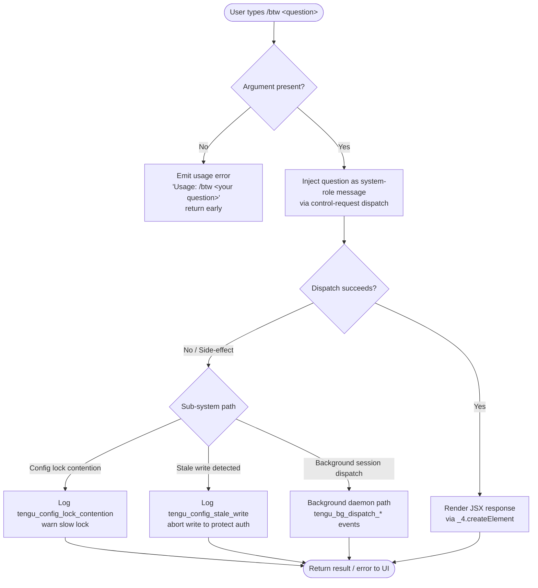

# `/btw`

> Analysis basis: CC v2.1.177 bundle.js (AST extraction + Claude interpretation)
> Minimum version: v2.1.177

---

## Overview

`/btw` ("by the way") lets the user pose a quick side question to the agent without interrupting or derailing the ongoing main conversation thread. It is a `local-jsx` command that dispatches immediately via the `control-request` thin-client path, rendering its own JSX output. The question is delivered to the agent as a `system`-typed injection rather than a regular user turn.

---

## Registration

| Field | Value |
|---|---|
| type | `local-jsx` |
| name | `btw` |
| description | Ask a quick side question without interrupting the main conversation |
| argumentHint | `<question>` |
| immediate | `true` |
| thinClientDispatch | `control-request` |
| module_id | `Ytq` |
| load_inline | `true` |
| loc_byte | 11272263 |
| loc_byte_end | 11272502 |
| loc_line | 7356 |
| arbor_handler.name | `nRL` |
| arbor_handler.fqn | `claude-2.1.177::nRL` |
| arbor_handler.kind | `AsyncFunction` |
| arbor_handler.resolution_path | `module_id` |
| arbor_handler.n_hits | 0 |

Analysis basis: CC v2.1.177 bundle.js:+11272263

---

## Input Branching

Three distinct paths are observable: (1) missing argument, (2) argument present and dispatch succeeds, (3) argument present but dispatch encounters an error/side-effect path through the config-lock or background-session subsystems.



Analysis basis: CC v2.1.177 bundle.js:+11271854 (handler entry), +11271856 (usage string), +11271895 (system role literal)

---

## Behavioral Spec

### 1. Argument Validation

If the user invokes `/btw` with no argument text, the handler immediately returns an error UI containing the literal string `"Usage: /btw <your question>"`.

```
async function handleBtw(userInput):
    question = userInput.trim()
    if question is empty:
        return renderError("Usage: /btw <your question>")
    // proceed to dispatch
```

Analysis basis: CC v2.1.177 bundle.js:+11271854 (callGraph edge `nRL → H`), +11271856 (usage literal)

### 2. System-Role Injection

When a non-empty question is supplied, the handler wraps the text in a message object with role `"system"` and forwards it through the `control-request` thin-client dispatch path. This keeps the side question out of the primary user-turn conversation history.

```
async function dispatchSideQuestion(question):
    message = { role: "system", content: question }
    result = await controlRequestDispatch(message)
    return result
```

Analysis basis: CC v2.1.177 bundle.js:+11271895 (`"system"` literal), +11271918 (callGraph edge `nRL → P8`)

### 3. Random Delay Helper (`H`)

The first call from the main handler (`nRL → H`) leads to a small utility that schedules a `setTimeout` using a randomised factor derived from `Math.random`. This is consistent with a jitter/back-off helper used to avoid thundering-herd conditions when multiple operations compete for the same resource (e.g., the config file lock).

```
function jitteredDelay(baseMs):
    // baseMs is 1 or 2 (literals at +14139986, +14139970)
    jitter = Math.random() * baseMs
    return new Promise(resolve => setTimeout(resolve, jitter * someUnit))
```

Analysis basis: CC v2.1.177 bundle.js:+11271854 (`nRL → H`), +14139972 (`H → Math.random`), +14139009 (`H → setTimeout`), literals at +14139970 (value `2`) and +14139986 (value `1`)

### 4. Config Persistence Path (`P8` / `J38`)

`nRL` calls the config-save helper (`P8`) which in turn delegates to the low-level locked-write function (`J38`). This path:

1. Acquires a filesystem lock (backed by `f.mkdirSync` for atomic lock-dir creation).
2. Reads the existing config with `q.readFileSync` (encoding `"utf-8"`).
3. Merges changes via `Object.assign`.
4. Writes back atomically using a temp file + rename (`EY6` path: `randomBytes` → `writeFileSync` → `fchmodSync` → `fsyncSync` → `renameSync`).
5. Releases the lock via `f.unlinkSync` / backup rotation.

If lock acquisition takes longer than expected the subsystem emits `tengu_config_lock_contention` and logs the warning `"Lock acquisition took longer than expected - another Claude instance may be running"`.

If a re-read of the config is missing authentication data that the in-memory cache holds, the write is aborted and `tengu_config_stale_write` is emitted (GH #3117 guard).

```
async function saveConfig(changes):
    acquired = acquireLockDir()           // f.mkdirSync
    if not acquired within timeout:
        emit("tengu_config_lock_contention")
        warn("Lock acquisition took longer than expected...")
    existing = readConfigFile()           // q.readFileSync utf-8
    merged   = Object.assign(existing, changes)
    if merged is missing auth that cache has:
        emit("tengu_config_stale_write")
        return  // abort
    atomicWrite(merged)                   // EY6: temp + rename
    releaseLock()                         // f.unlinkSync
```

Analysis basis: CC v2.1.177 bundle.js:+11271918 (`nRL → P8`), +3332401 (`P8 → J38`), +3335344 (`J38 → _`), +3335371 (`J38 → f.mkdirSync`), +3335512 (`"error"`), +3335555 (lock-contention warning), +3335644 (`tengu_config_lock_contention`), +3335780 (`tengu_config_stale_write`), +3335971 (auth-loss log)

### 5. Config Read Path (`G5H`)

The config-read helper guards against premature access (`"Config accessed before allowed."` at +3337588), reads the file as UTF-8, parses JSON (`c6 → JSON.parse`), resolves backup files (prefix-stripped via `Jm`), and can scan directories for sidecar config fragments (`sK9`).

```
function readConfig(path):
    if configNotYetAllowed:
        throw Error("Config accessed before allowed.")
    raw = fs.readFileSync(path, "utf-8")
    return JSON.parse(raw)               // c6
```

Analysis basis: CC v2.1.177 bundle.js:+3332582 (`P8 → G5H`), +3337582 (`G5H → Error`), +3337588 (guard literal), +3337644 (`G5H → q.readFileSync`), +3337691 (`G5H → c6`)

### 6. JSX Rendering

After a successful dispatch the handler calls `_4.createElement` to produce the JSX tree that the local-jsx host renders in the terminal UI.

```
function renderResult(response):
    return createElement(SideQuestionResultComponent, { response })
```

Analysis basis: CC v2.1.177 bundle.js:+11271964 (`nRL → _4.createElement`)

### 7. Background Session Dispatch (deep path)

The `control-request` thin-client path ultimately reaches the background daemon manager (`D`, `jI5`) which handles session lifecycle: spawn, attach, kill, resize, and snapshot. Key behaviours observed in the depth-2 call graph include:

- Low-memory guard: checks `IVA.freemem()`, emits `tengu_bg_dispatch_low_mem` when memory is constrained (bundle.js:+16983610, +16983780).
- SIGKILL escalation: if a daemon process does not exit after SIGTERM within 30 s (literal +16983134), it sends SIGKILL and emits `tengu_bg_dispatch_sigkill_escalate` (+16983179).
- Spare session pooling: `tengu_bg_spare_enable` (+16984484), `tengu_bg_spare_claim` (+16984612), `tengu_bg_spare_claim_fail` (+16984878).
- Attach lifecycle: `tengu_bg_attach` (+16974409), stall-respawn (`tengu_bg_attach_stall_respawn` +16975602), stall-gave-up (`tengu_bg_attach_stall_gave_up` +16975332), kick (`tengu_bg_attach_kick` +16976594).

Analysis basis: CC v2.1.177 bundle.js:+11271918, +3332401, +16983179, +16983780, +16984484

---

## State & Side Effects

| Item | Detail |
|---|---|
| Telemetry | `tengu_config_lock_contention` (+3335644), `tengu_config_stale_write` (+3335780), `tengu_config_parse_error` (+3338219), `tengu_config_auth_loss_prevented` (+3336123), `tengu_bg_dispatch_sigkill_escalate` (+16983179), `tengu_bg_dispatch_low_mem` (+16983780), `tengu_bg_spare_enable` (+16984484), `tengu_bg_spare_claim` (+16984612), `tengu_bg_spare_claim_fail` (+16984878), `tengu_bg_proto_mismatch` (+16968964), `tengu_bg_dispatch_stale_drop` (+16970363), `tengu_bg_attach_legacy_autorespawn` (+16973251), `tengu_bg_attach` (+16974409), `tengu_bg_attach_stall_gave_up` (+16975332), `tengu_bg_attach_stall_respawn` (+16975602), `tengu_bg_attach_kick` (+16976594) |
| Hook registration | None observed within depth-2 traversal |
| appState changes | Config file may be written/mutated via the `P8 → J38 → EY6` atomic-write path |
| Filesystem side effects | Lock directory created/removed; config backup rotation under `backups/` subdirectory; atomic temp-file rename for config writes |
| Sound | None observed |
| Dispatch mode | `thinClientDispatch: "control-request"` — bypasses normal user-turn queue |
| Immediate flag | `immediate: true` — handler fires without waiting for any prior streaming response to finish |

---

## Version History

| Version | Change |
|---|---|
| v2.1.177 | Initial analysis |

---

## Common Mistakes

1. **Forgetting the argument**: `/btw` with no text returns the usage hint `"Usage: /btw <your question>"` and does nothing else — the question text is mandatory.
2. **Expecting a user-turn response**: The question is injected with role `"system"`, not as a user message, so it will not appear in the normal conversation transcript in the same way a regular message does.
3. **Assuming it blocks**: Because `immediate: true` is set, the command fires even if the agent is mid-stream on another task. The user should not assume the main task is paused.
4. **Conflating `/btw` with `/ask`**: `/btw` is specifically designed as a non-interrupting side-channel; other question commands may use a different dispatch mechanism.
5. **Multiple concurrent Claude instances and config lock**: If another Claude Code instance is running, the config-lock path underneath `/btw` may log a contention warning. This is not caused by the question itself but by the shared config write subsystem.

---

## Appendix — Identifier Mapping

> For bundle debugging only. Identifiers change across versions.

| Identifier | Role |
|---|---|
| `nRL` | Main async handler for `/btw` (AsyncFunction, Arbor-resolved) |
| `H` | Jitter/delay helper (uses `Math.random` + `setTimeout`) |
| `P8` | Config save entry-point (calls locked-write subsystem) |
| `J38` | Low-level config locked-write function (lock-dir, atomic rename) |
| `_` | Filesystem abstraction / util (used across multiple call sites) |
| `Q6` | Path/file utility helper |
| `f` | Filesystem wrapper (mkdirSync, statSync, copyFileSync, etc.) |
| `q` | Secondary filesystem wrapper (readFileSync, mkdirSync, etc.) |
| `L` | Promise/stream handle (used in file-close and session paths) |
| `nI1` | Config object merge / normalise helper |
| `aJ_` | Config initialisation sub-helper |
| `N` | Message/content construction helper (includes tool-result formatting) |
| `tff` | Content-type dispatch helper |
| `CH` | JSON serialisation wrapper (`JSON.stringify`) |
| `xf` | Content redaction / replacement helper (`[REDACTED]` literal) |
| `kQH` | Content limit/truncation helper |
| `A4f` | File-content reader with byte-length guard (`Buffer.byteLength`) |
| `d` | Logging / debug utility |
| `Z8` | Error handling / throw helper |
| `G5H` | Config file read helper (guards against premature access) |
| `c6` | JSON parse wrapper |
| `Jm` | String prefix-strip helper (`startsWith` / `slice`) |
| `sK9` | Directory scanner for config sidecar fragments |
| `yN_` | Path-join backup utility |
| `D` | Background daemon session manager (spawn/kill/attach) |
| `EaH` | Config entry-point or environment-accessor helper |
| `A` | String normalisation helper (`toLowerCase`) |
| `V` | Versioned-path or string collection (uses `startsWith`) |
| `P` | IPC / pipe protocol handler (Buffer concat, split, subarray) |
| `X` | Socket/stream timeout manager |
| `j` | Process registry (values, kill) |
| `mL` | Stream-end/flush helper |
| `jI5` | Background IPC message dispatcher (full session lifecycle) |
| `TH` | String coercion wrapper |
| `E` | Bounded-slice helper (`Math.max` / `Math.min`) |
| `W` | SDK connection manager (Promise.all, connect, disconnect) |
| `EY6` | Atomic file write helper (randomBytes → temp → rename) |
| `O` | Symbolic-link and stream object (lstat, isSymbolicLink) |
| `C8` | Error code classifier |
| `zXH` | Config path resolver |
| `aK9` | Config entry enumerator (`Object.entries`) |
| `h06` | Timestamp helper (`Date.now`) |
| `j38` | Config file atomic-write coordinator (lower-level than `J38`) |

---

Note: index built via Arbor fallback; some signals (telemetry, literals) may be missing — see arbor-fallback.js.