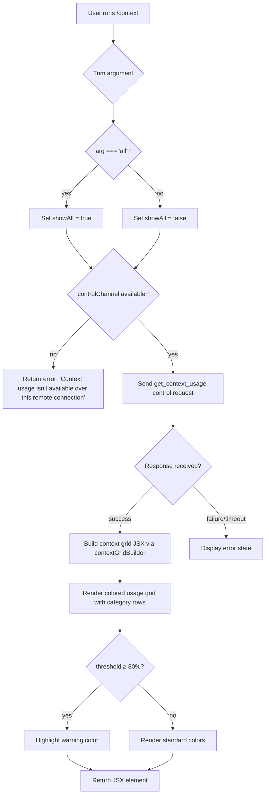

# `/context`

> Analysis basis: CC v2.1.177 bundle.js (AST extraction + Claude interpretation)
> Minimum version: v2.1.177

---

## Overview

`/context` visualizes the current conversation context window usage as a colored grid. It sends a `get_context_usage` control request over the thin-client bridge channel, then renders the returned usage data as a visual breakdown across system prompt, tools, messages, memory files, and other context categories — each labeled and color-coded so the user can immediately see how the context window is being consumed.

---

## Registration

| Field | Value |
|---|---|
| type | `local-jsx` |
| name | `context` |
| description | `Visualize current context usage as a colored grid` |
| argumentHint | `[all]` |
| thinClientDispatch | `control-request` |
| module_id | `x8K` |
| load_inline | `true` |
| loc_byte | `11763486` |
| loc_byte_end | `11763712` |
| loc_line | `7562` |
| arbor_handler.name | `MpL` |
| arbor_handler.fqn | `claude-2.1.177::MpL` |
| arbor_handler.kind | `AsyncFunction` |
| arbor_handler.resolution_path | `module_id` |
| arbor_handler.n_hits | `0` |

Analysis basis: CC v2.1.177 bundle.js:+11763486

---

## Input Branching

The handler has three distinct top-level branches determined by argument value and transport availability:



Analysis basis: CC v2.1.177 bundle.js:+11762086 (argument trim), +11762111 (`all` literal), +11762134 (controlChannel check), +11762164 (remote error string), +11762246 (sendControlRequest), +11762622 (80% threshold literal)

---

## Behavioral Spec

### Main Handler (`MpL`)

```
async function contextCommandHandler(userArg, appContext):
    trimmedArg = userArg.trim()
    showAll = (trimmedArg === "all")      // "all" literal at +11762111

    controlChannel = getControlChannel(appContext)   // xy() at +11762134
    if controlChannel is falsy:
        return errorMessage(
            "Context usage isn't available over this remote connection"
        )                                            // string at +11762164

    response = await controlChannel.sendControlRequest(
        "get_context_usage",                         // event name at +11762276
        {}
    )

    usageData = parseContextUsageResponse(response)  // LpL / Tz at +11762589
    threshold = 80                                   // literal at +11762622

    grid = buildContextGrid(usageData, showAll, threshold)  // xm6 at +11762416
    systemSection = buildSystemSection(usageData)           // TH at +11762500

    return createElement(gridContainer, {
        grid,
        systemSection,
        listenerHandler: setupResponseListener(response)    // l16 at +11762306
    })
```

Analysis basis: CC v2.1.177 bundle.js:+11762080

### Context Grid Builder (`contextGridBuilder` / `xm6`)

```
function buildContextGrid(usageData, showAll, threshold):
    categories = usageData.filter(...)           // A.filter at +11760183
    displayItem = categories.find(...)           // A.find at +11760501

    rows = []
    for each category in DISPLAY_CATEGORIES:
        label = getCategoryLabel(category)       // String() at +11761419
        tokenCount = category.tokens
        percentage = computePercentage(tokenCount, totalTokens)  // Q8H at +11761918
        colorClass = selectColor(percentage, threshold)
        rows.push({ label, tokenCount, percentage, colorClass })

    // Category labels found in literals:
    // "System prompt"     at +10801016
    // "System tools"      at +10801097
    // "MCP tools"         at +10801162
    // "Memory files"      at +10801480
    // "Messages"          at +10802003
    // "Custom agents"     at +10801413
    // "Skills"            at +10801542

    return rows
```

Analysis basis: CC v2.1.177 bundle.js:+11760142 (YK sub-call), +11761838 (HlH formatter)

### Percentage Formatter (`percentageFormatter` / `Q8H`)

```
function formatPercentage(value, total):
    raw = YK(value, total)          // calls zf/f4f formatting chain
    rounded = Math.round(raw)       // Math.round at +217488
    // threshold bands (from literals):
    //   < 20  → label "< 20"   (literal at +217468)
    //   ≥ 20  → numeric display
    return formatLocale(rounded, "en-US", "compact")
                                    // "en-US" at +219441, "compact" at +219459
```

Analysis basis: CC v2.1.177 bundle.js:+217485

### Compact Boundary Marker (`compactBoundary` / `Tz`)

```
function getCompactBoundary(contextData):
    boundaryMarker = extractBoundary(contextData)  // Ap8/AX at +11105810
    // uses literal "compact_boundary" at +11105680
    slice = contextData.slice(boundaryPosition)    // H.slice at +11105833
    return boundaryPosition
```

Analysis basis: CC v2.1.177 bundle.js:+11762042

### Control Request Listener (`responseListener` / `l16`)

```
function setupResponseListener(responseStream):
    responseStream.on("write", handler)            // "write" literal at +3929481
    rawText = responseStream.toString()            // L.toString at +8384384

    parsedData = parseData(rawText)                // Vg at +8384411
    jsxElement = createElement(parsedData)         // sqH.createElement at +8384414
    return jsxElement
```

Analysis basis: CC v2.1.177 bundle.js:+11762306

### Context Usage Response Parser (`usageResponseParser` / `LpL`)

```
function parseUsageResponse(rawResponse):
    boundary = getCompactBoundary(rawResponse)     // Tz at +11762042
    slicedData = rawResponse.slice(boundary)       // H.slice at +11105833
    return slicedData
```

Analysis basis: CC v2.1.177 bundle.js:+11762589

### Fullscreen / Terminal Environment Guard (`terminalEnvironmentCheck` / `I1`)

The handler calls a terminal environment detection chain before deciding rendering mode. This is shared infrastructure also used by other commands.

```
function checkTerminalEnvironment(env):
    isLocalAgent = checkAgentType(env)    // "local-agent" literal at +3527778
    isTmuxCC = detectTmuxControlMode()    // ic4/H.startsWith at +3527028
                                          // "display-message" literal at +3527251
                                          // "#{client_control_mode}" at +3527274
                                          // timeout 2000ms at +3527325

    if isTmuxCC:
        warn("fullscreen disabled: tmux -CC (iTerm2 integration mode) detected...")
        // literal at +3527981

    isWindows = (platform === "windows")  // "windows" literal at +3527535
    if isWindows:
        warn("fullscreen disabled: Windows over SSH...")
        // literal at +3528167

    renderMode = selectRenderMode(env)    // "fullscreen"/"default" at +3528315/3528341
    return renderMode
```

Analysis basis: CC v2.1.177 bundle.js:+11762080 (MpL → I1 call at +11762080)

---

## State & Side Effects

| Item | Detail |
|---|---|
| Telemetry | `tengu_amber_creek` (bundle.js:+3528498), `tengu_pewter_brook` (+3528406), `tengu_marlin_porch` (+3899353), `tengu_native_cursor` (+3899659), `tengu_amber_redwood2` (+10785479), `tengu_silent_harbor` (+13765824), `tengu_slate_harrier` (+13775362), `tengu_orchid_mantis_v2` (+13760514), `tengu_orchid_mantis` (+13761363), `tengu_moth_copse` (+3442878), `tengu_chair_sermon` (+11068771) — emitted from supporting subsystems reached during the call |
| Control request | Sends `get_context_usage` over the `controlChannel` bridge (thinClientDispatch: `control-request`); no-ops if channel is absent |
| JSX rendering | Returns a JSX tree (type `local-jsx`); the grid is rendered directly into the CLI output pane; no persistent state is mutated |
| Hook registration | Response listener attached via `responseStream.on("write", ...)` for streaming updates; cleared after render |
| appState changes | None observed in depth-2 traversal |
| Sound | None |
| Context window warning | Applies a visual highlight when usage ≥ 80% of context limit |

---

## Version History

| Version | Change |
|---|---|
| v2.1.177 | Initial analysis |

---

## Common Mistakes

1. **Running `/context` over a remote/thin-client connection without a `controlChannel`**: The command silently returns the error string "Context usage isn't available over this remote connection" instead of a grid. Ensure the session has an active control channel (local or bridge-connected).
2. **Expecting `/context` to modify session state**: The command is read-only and display-only; it does not trigger compaction, clear messages, or alter any settings.
3. **Misinterpreting the `[all]` argument hint**: Passing `all` shows all context categories including ones that may be zero. Omitting it may hide empty or minimal categories. Any argument other than `all` is treated as falsy/ignored.
4. **Assuming the 80% threshold triggers an action**: The threshold only changes the visual color of the grid; no compaction or alert is sent to the model at this boundary.
5. **Confusing the compact-boundary marker with actual compaction**: The `compact_boundary` literal marks where prior messages were compressed in the display, not a live compaction trigger.

---

## Appendix — Identifier Mapping

> For bundle debugging only. Identifiers change across versions.

| Identifier | Role |
|---|---|
| `MpL` | Main async handler for `/context` command |
| `I1` | Terminal environment / fullscreen detection wrapper |
| `L_H` | Buffer presence check (buf.has) |
| `eh_` | Agent type resolver |
| `A6` | String conversion utility |
| `Zt` | Fullscreen mode selector |
| `rc4` | tmux control mode detector (calls spawnSync) |
| `ic4` | iTerm/tmux prefix check (H.startsWith) |
| `N` | Terminal info assembler |
| `tff` | Display info formatter |
| `WyA` | Output format selector (_qf / Aqf) |
| `CH` | JSON.stringify wrapper |
| `xf` | Path/string manipulation utility |
| `akA` | rff.map iterator helper |
| `kQH` | File write coordinator |
| `BkA` | H.write wrapper |
| `A4f` | Log/file append orchestrator |
| `AQH` | Timeout-batched write scheduler |
| `g4H` | File join/filter helper |
| `r$6` | Z8 wrapper (file op) |
| `HSA` | Path join + I6 helper |
| `cH_` | File stat / rename / unlink helper |
| `_4f` | mkdir + appendFile + rotate helper |
| `m9` | Hook registrar (XyA.register) |
| `th_` | Boolean-gated render selector |
| `n_` | Settings/config loader |
| `GF` | Settings load orchestrator |
| `tG` | Settings initialization step |
| `Lq` | Settings dedup/add (OSA.has / OSA.add) |
| `qL_` | Settings load async pipeline |
| `Tb` | Multi-source settings merger |
| `oc4` | Context state initializer |
| `$6` | Context store accessor |
| `W06` | Context store getter A |
| `G06` | Context store getter B |
| `em` | Fm wrapper (event emitter helper) |
| `H38` | Context cache lookup (zN_.has / KXH.get) |
| `R6` | Context record updater (Date.now + ng4) |
| `f7` | NvH wrapper (feature flag check) |
| `xy` | Feature flag resolver (calls f7) |
| `K` | sendControlRequest host / padEnd formatter |
| `l16` | Response stream listener / JSX builder |
| `Vg` | dk_ + qS_ + gt render chain |
| `qS_` | aw9.createElement wrapper |
| `gt` | eXH + ck_ grid render |
| `eXH` | Zt/ny_/I1/A6/$6 usage cell renderer |
| `ck_` | A6/$6 fallback cell renderer |
| `xm6` | Context grid builder (main visual component) |
| `YK` | Percentage/number formatter (zf/f4f) |
| `zf` | f4f locale formatter wrapper |
| `Q8H` | Math.round + YK percentage display |
| `HlH` | Grid cell label formatter |
| `TH` | String() system section builder |
| `LpL` | Usage response parser (calls Tz) |
| `Tz` | Compact boundary extractor (Ap8 + H.slice) |
| `Ap8` | AX boundary marker reader |
| `lu8` | Full context usage computation engine |
| `nE` | Model/message context assembler |
| `el` | Message list walker (vY/lB/nA/NK) |
| `NK` | Per-message token counter |
| `CJ` | Context block builder ($LH/OLH/l_/ZA/$q) |
| `Sb` | System block builder (fI1/NK) |
| `fI1` | System prompt token analyzer |
| `j1` | Model alias resolver |
| `mZ` | System prompt assembly pipeline |
| `Q75` | Memory / context query orchestrator |
| `i06` | Memory file loader |
| `cU` | System prompt fetcher |
| `RhL` | Tool context analyzer |
| `ghL` | Context usage map builder |
| `UhL` | Usage row builder (CH/gM) |
| `BhL` | Usage detail builder |
| `FhL` | Usage sub-row builder |
| `fG` | Conversation history context builder |
| `IkL` | Message slot accumulator |
| `Hm8` | Tool-use block token counter |
| `dKH` | Max-token constraint enforcer |
| `aMH` | Output token limiter (eJH/X9H) |
| `eJH` | Per-model token cap resolver |
| `X9H` | parseInt/isNaN token validator |
| `Pd` | Auto-compact window calculator (Math.max/Math.min) |
| `cnq` | Compact window config resolver |
| `x7A` | Token size parser (parseFloat/parseInt/Math.round) |
| `VH` | MCP server session finder |
| `m9H` | MCP tool call executor |
| `gH` | Session list resolver |
| `E` | Main loop / session manager |
| `W` | Session startup orchestrator |
| `qH` | MCP server registry |

Note: index built via Arbor fallback; some signals (telemetry, literals) may be missing — see arbor-fallback.js.