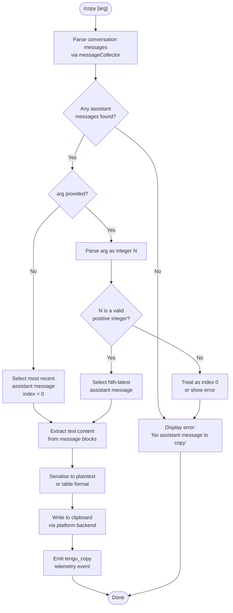

# `/copy`

> Analysis basis: CC v2.1.177 bundle.js (AST extraction + Claude interpretation)
> Minimum version: v2.1.177

---

## Overview

`/copy` copies Claude's most recent assistant response to the system clipboard. An optional integer argument `N` selects the Nth-latest assistant message instead of the most recent one. The command resolves the target message from the current conversation history, serialises its text content, and dispatches it to the platform-appropriate clipboard backend.

---

## Registration

| Field | Value |
|---|---|
| type | `local-jsx` |
| name | `copy` |
| description | `Copy Claude's last response to clipboard (or /copy N for the Nth-latest)` |
| module_id | `Neq` |
| load_inline | `true` |
| loc_byte | `11333634` |
| loc_byte_end | `11333820` |
| loc_line | `7430` |
| arbor_handler.name | `HbL` |
| arbor_handler.fqn | `claude-2.1.177::HbL` |
| arbor_handler.kind | `AsyncFunction` |
| arbor_handler.resolution_path | `module_id` |
| arbor_handler.n_hits | `0` |

Analysis basis: CC v2.1.177 bundle.js:+11333634

---

## Input Branching

The command has four distinct branches based on argument parsing and message availability, so a Mermaid flowchart is used.



Analysis basis: CC v2.1.177 bundle.js:+11332819 (handler entry `HbL`), +11332860 (error literal), +11332929 (integer parse), +11332943 (integer validation)

---

## Behavioral Spec

### 1. Message Collection

The handler begins by calling the message-collector function (identifier `Zeq`) to gather all messages from the current conversation state.

```
function collectAssistantMessages(conversationMessages):
    filtered = []
    for each message in conversationMessages:
        if message.role == "assistant":
            for each content_block in message.content:
                if content_block.type == "text":
                    filtered.push(content_block)
    return filtered
```

`Zeq` uses `Array.isArray` to validate the message list structure and calls a text-block filter function (`Df`) that retains only blocks where `type == "text"`.

Analysis basis: CC v2.1.177 bundle.js:+11328837 (`Zeq`), +11328869 (`Df`), +11077302 (literal `"text"`), +11328767 (literal `"assistant"`)

---

### 2. Argument Parsing and Message Selection

The handler parses the optional argument passed after `/copy`.

```
async function copyCommandHandler(context):
    messages = collectAssistantMessages(context.conversation)

    if messages is empty:
        displayError("No assistant message to copy")
        return

    rawArg = context.args.trim()
    index = 0

    if rawArg is not empty:
        parsed = Number(rawArg)
        if Number.isInteger(parsed) and parsed >= 1:
            index = parsed - 1   // convert 1-based user index to 0-based

    // Reverse the list so index 0 = most recent
    targetMessage = messages[messages.length - 1 - index]

    if targetMessage is undefined:
        displayError("No assistant message to copy")
        return

    copyToClipboard(targetMessage)
```

Analysis basis: CC v2.1.177 bundle.js:+11332858 (literal `H` — message array), +11332929 (`Number` call), +11332943 (`Number.isInteger` guard), +11332860 (error string `"No assistant message to copy"`)

---

### 3. Content Serialisation

The content extraction path (`Eeq`) handles both plain-text and table-formatted assistant messages.

```
function serialiseMessageContent(messageBlocks, format):
    if format == "table":
        rows = parseTableRows(messageBlocks)     // uses lexer K$.lexer
        maxWidths = computeColumnWidths(rows)    // Math.max + q8 (Bun.stringWidth)
        separator = buildSeparator(maxWidths)    // fM: H.repeat + Number.isFinite
        lines = rows.map(r => formatRow(r, maxWidths, " | "))
        return lines.join("\n") + "\n" + separator
    else:
        // plaintext path
        text = messageBlocks
                 .map(block => block.text)
                 .join("")
        text = text.replace("\\|", "|")          // unescape pipe characters
        return text
```

Key literals observed:
- Column separator: `" | "` (bundle.js:+11328119)
- Alignment options: `"center"`, `"right"`, `"left"` (bundle.js:+11328154, +11328192, +11328228)
- Format literals: `"table"` (bundle.js:+11328531), `"plaintext"` (bundle.js:+11328972)
- Escaped pipe replacement: `"\\|"` → `"|"` (bundle.js:+11327960)
- Minimum column width argument to `Math.max`: `3` (bundle.js:+11328019)

Analysis basis: CC v2.1.177 bundle.js:+11328418 (`Eeq` → `K$.lexer`), +11328464 (`H.indexOf`), +11328585 (`Eeq` → `Teq`), +11327917 (`Teq` → `oCL`)

---

### 4. Clipboard Write — Platform Detection and Dispatch

The clipboard write is performed by the clipboard-writer module (identifier `yT`), which detects the current terminal/OS environment and selects the appropriate backend.

```
async function writeToClipboard(text, encoding):
    encoding = encoding or "utf8"   // literals: "utf8", "base64"
    backend = detectClipboardBackend()

    switch backend:
        case "pbcopy":                          // macOS
            spawn("pbcopy", stdin=text)

        case "wl-copy":                         // Wayland Linux
            spawn("wl-copy", stdin=text)

        case "xclip":                           // X11 Linux (primary)
            spawn("xclip", "-selection", "clipboard", stdin=text)
            // or with "--primary" flag for primary selection

        case "xsel":                            // X11 Linux (fallback)
            spawn("xsel", "--clipboard", "--input", stdin=text)

        case "tmux-buffer":                     // tmux environment
            spawn("tmux", "load-buffer", "-w", stdin=text)

        case "osc52":                           // OSC 52 terminal escape
            write OSC 52 escape sequence with base64-encoded text

        case "powershell" / "wsl":              // Windows / WSL
            spawn("powershell.exe", "-NoProfile", "-NonInteractive",
                  "-Command", SET_CLIPBOARD_CMD)

        case "screen":                          // GNU screen
            write DCS pass-through sequence

        case "raw+dcs" / "dcs" / "raw":
            write raw or DCS-wrapped OSC 52 sequence

        case "none":
            no-op or error

    timeout = 2000ms                            // bundle.js:+3518705
```

Backend detection uses environment variables and process state (SSH detection via `oH.isSSH`, tmux/screen detection via `$TERM` / `$TMUX`, Wayland via `$WAYLAND_DISPLAY`, etc.). The kitty terminal is also identified as a distinct environment (bundle.js:+3517166).

Analysis basis: CC v2.1.177 bundle.js:+3518739 (`"pbcopy"`), +3517695 (`"wl-copy"`), +3517764 (`"xclip"`), +3517805 (`"xsel"`), +3517986 (`"tmux"`), +3517586 (`"osc52"`), +3519105 (`"powershell.exe"`), +3519095 (`"wsl"`), +3516697 (`"screen"`), +3518447 (`"raw"`), +3518492 (`"none"`), +3518705 (timeout `2000`)

---

### 5. Telemetry Emission

After the clipboard write attempt (success or failure), the handler emits a `tengu_copy` telemetry event with metadata about the operation.

```
function emitCopyTelemetry(result):
    emit("tengu_copy", {
        message: context.message_type,    // "message" or "messages"
        ...result_metadata
    })
```

Analysis basis: CC v2.1.177 bundle.js:+11333238 (`tengu_copy`), +11333114 (literal `"message"`), +11333124 (literal `"messages"`)

---

## State & Side Effects

| Item | Detail |
|---|---|
| Telemetry | `tengu_copy` (bundle.js:+11333238) — emitted on every invocation |
| Clipboard mutation | Writes text to the OS clipboard via the platform-selected backend (pbcopy / wl-copy / xclip / xsel / tmux / osc52 / powershell / screen) |
| appState changes | None observed within depth-2 traversal |
| Hook registration | None observed within depth-2 traversal |
| Sound | None observed |
| Error display | Renders inline error `"No assistant message to copy"` when no assistant turn exists (bundle.js:+11332860) |

---

## Version History

| Version | Change |
|---|---|
| v2.1.177 | Initial analysis |

---

## Common Mistakes

1. **Running `/copy` before any assistant turn exists** — the command will display `"No assistant message to copy"` and do nothing. Ensure at least one Claude response is present in the current session.
2. **Passing a non-integer or out-of-range `N`** — e.g. `/copy 0` or `/copy abc`. Non-integer values fall back to index 0 (most recent). Values larger than the number of assistant turns silently select nothing (undefined message) and trigger the same error.
3. **Clipboard unavailable in headless/SSH environments without OSC 52** — if no clipboard tool is detected and the terminal does not support OSC 52, the copy will silently no-op (backend `"none"`). Use a terminal with OSC 52 support or install `xclip`/`xsel` on Linux.
4. **Expecting rich markdown in the clipboard** — the serialiser produces plain text or pipe-delimited table text; markdown formatting such as bold or code fences is stripped during content extraction.
5. **Confusing 1-based user indexing with internal 0-based indexing** — `/copy 1` selects the most recent response, `/copy 2` the second-most-recent, and so on.

---

## Appendix — Identifier Mapping

> For bundle debugging only. Identifiers change across versions.

| Identifier | Role |
|---|---|
| `HbL` | Main async handler for `/copy` command (arbor_handler) |
| `Zeq` | Message collector — filters conversation to assistant text blocks |
| `Df` | Text-block filter — retains content blocks where type is `"text"` |
| `Eeq` | Content serialiser — handles table and plaintext formats, delegates to `Teq` |
| `Teq` | Table-format renderer — computes column widths and builds separator rows |
| `oCL` | Column-content mapper used by table renderer |
| `rCL` | Lexer-based row parser — tokenises pipe-separated table input |
| `N0H` | Pipe-escape replacement helper used during lexing |
| `K$` | Lexer module — exposes `K$.lexer` for table tokenisation |
| `q8` | Column width measurer — wraps `Bun.stringWidth` |
| `fM` | Separator-line builder — uses `H.repeat` and `Number.isFinite` |
| `Veq` | Plain-text post-processor — applies `H.replace` for escape sequences |
| `BMA` | Clipboard write orchestrator — calls `yT` and `veq` |
| `yT` | Platform clipboard dispatcher — detects backend and spawns subprocess |
| `KG6` | Terminal environment detector used by `yT` |
| `s79` | Subprocess spawn helper for clipboard commands (timeout 2000 ms) |
| `U8` | Low-level spawn executor used by `s79` |
| `nh_` | Linux clipboard backend selector (wl-copy / xclip / xsel) |
| `Uc4` | macOS pbcopy path handler |
| `lh_` | OSC 52 / screen / tmux path handler |
| `fG6` | Raw/DCS escape sequence writer |
| `i0` | Kitty terminal clipboard path |
| `QY` | tmux load-buffer path |
| `a79` | Screen pass-through path |
| `b4` | String index-of utility used during argument parsing |
| `veq` | Temp-file clipboard write path (mkdir + writeFile via `bp8`) |
| `gJ` | Secure temp directory creator used by `veq` |
| `DJ9` | Directory permission validator for temp directory |
| `Jp` | Temp directory path resolver |
| `d` | Generic display/output utility called after clipboard write |
| `R6` | Config-file watcher / global-config accessor called from handler |
| `G5H` | Global config reader (readFileSync, JSON parse, backup logic) |
| `TH` | String-coercion utility |
| `CH` | JSON serialisation helper |