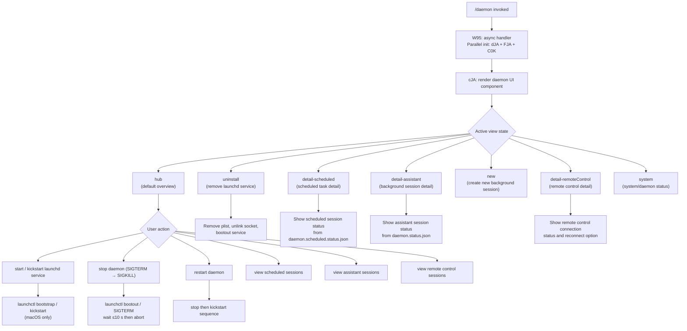

# `/daemon`

> Analysis basis: CC v2.1.177 bundle.js (AST extraction + Claude interpretation)
> Minimum version: v2.1.177

---

## Overview

The `/daemon` command provides an interactive management interface for the Claude Code background daemon process and its associated background services. It allows users to inspect, start, stop, restart, and uninstall the daemon, as well as view the status of background sessions, scheduled tasks, and remote control connections. The command renders a live JSX UI component that reflects real-time daemon state.

---

## Registration

| Field | Value |
|---|---|
| type | `local-jsx` |
| name | `daemon` |
| description | `Manage background services and routines` |
| immediate | `true` |
| module_id | `lJA` |
| load_inline | `true` |
| loc_byte | `13314360` |
| loc_byte_end | `13314528` |
| loc_line | `9703` |
| arbor_handler.name | `W95` |
| arbor_handler.fqn | `claude-2.1.177::W95` |
| arbor_handler.kind | `AsyncFunction` |
| arbor_handler.resolution_path | `module_id` |
| arbor_handler.n_hits | `0` |

Analysis basis: CC v2.1.177 bundle.js:+13314360

---

## Input Branching

The command renders different detail views depending on which sub-panel the user navigates to. Five or more distinct UI states are observed (`detail-scheduled`, `detail-assistant`, `detail-remoteControl`, `new`, `hub`, `system`, `uninstall`), warranting a Mermaid flowchart.



Analysis basis: CC v2.1.177 bundle.js:+13303110, +13303752, +13304039, +13303941, +13304099, +13304220

---

## Behavioral Spec

### Handler Entry Point — `W95` (async initializer)

The Arbor-resolved handler `W95` is an `AsyncFunction` reached via `module_id → lJA`.

```
async function daemonHandlerInit(context):
    await Promise.all([
        loadDaemonState(context),          // dJA
        loadConfigPath(context),           // FJA
        loadModelRegistry(context)         // C0K
    ])
    renderDaemonUI(context)               // cJA React component
```

Analysis basis: CC v2.1.177 bundle.js:+13303110, +13303123, +13303129, +13303221

---

### Daemon State Loader — `dJA`

Collects all runtime state needed to populate the UI. Runs several sub-tasks in parallel, then resolves the full daemon picture.

```
async function loadDaemonState(ctx):
    // 1. Parse scheduled-task roster from disk
    taskList = await parseScheduledRoster()           // h0K → RL6 → rjA
    //    reads roster.json (≤1 048 576 bytes, utf8)
    //    tags entries with kind="scheduled"

    // 2. Resolve daemon config and socket path
    daemonConfig = await resolveDaemonConfig()        // G0K → nZH
    //    stats daemon.json; rejects with ENOENT if missing
    //    resolves socket path via path join + homedir

    // 3. Read daemon.status.json (assistant session)
    assistantStatus = await readStatusFile()          // QPK
    //    path: daemon.status.json
    //    sends SIGTERM / process.kill if stale

    // 4. Read daemon.scheduled.status.json
    scheduledStatus = await readScheduledStatus()     // JWK
    //    path: daemon.scheduled.status.json
    //    sends SIGTERM if process gone

    // 5. Parse roster.json for background sessions
    roster = await parseRoster()                      // Rd
    //    validates file; removes if not regular file (ENOENT)
    //    error codes checked: E2BIG, EFTYPE
    //    rotates via timestamp rename (CU8 → Date.now)

    // 6. Query launchd service status (macOS only)
    launchdStatus = await queryLaunchctl()            // Co → U8
    //    runs: launchctl print <domain>
    //    timeout: 5000 ms (bundle.js:+11806440)
    //    process.getuid() used to build domain label (k_K)

    return { taskList, daemonConfig, assistantStatus,
             scheduledStatus, roster, launchdStatus }
```

Analysis basis: CC v2.1.177 bundle.js:+13302631, +13302661, +13302674, +13302700, +13302706, +13302727, +13302749, +13302771, +13302789, +13302902

---

### Roster File Parser — `rjA`

```
async function parseRosterFile(filePath):
    stat = await fs.stat(filePath)
    if not stat.isFile():
        throw Error("not a regular file")
    if stat.size > 1_048_576:           // bundle.js:+13098054
        throw Error("file too large")
    raw = await fs.readFile(filePath, "utf8")   // bundle.js:+13098173
    trimmed = raw.trim()
    parsed = JSON.parse(trimmed)
    validate(parsed)                    // Jm — schema validation
    if not Array.isArray(parsed):
        throw Error("expected array")
    return parsed
```

Analysis basis: CC v2.1.177 bundle.js:+13097996, +13098019, +13098054, +13098158, +13098173

---

### Scheduled Roster Loader — `RL6`

```
async function loadScheduledRoster(rosterPath):
    entries = await parseRosterFile(rosterPath)   // rjA
    filtered = filterByKind(entries, "scheduled") // EJA + Array.isArray
    //    kind literal: "scheduled" (bundle.js:+13190891)
    augmented = enrichEntries(entries)            // GJA
    accumulator.push(augmented)                   // q.push
    return accumulator
```

Analysis basis: CC v2.1.177 bundle.js:+13190879, +13190923, +13190963, +13190891

---

### Daemon Socket / Config Resolver — `nZH`

```
async function resolveDaemonSocket(configDir):
    try:
        stat = await fs.stat(configDir)
    catch err:
        if err.code === "ENOENT":           // bundle.js:+13285201
            return Promise.reject(err)
    if not stat.isFile():
        throw new Error("not a file")
    storeRef = getAsyncLocalStore()         // n9 → Ed4.getStore
    socketPath = buildSocketPath()          // BJA → UJA
    label = toString(socketPath)            // TH → String
    encode(label)                           // Mq
    keys = Object.keys(config)
    if keys set contains required key:      // K.has
        return resolvedConfig
```

Analysis basis: CC v2.1.177 bundle.js:+13285170, +13285193, +13285201, +13285215, +13285407, +13285472

---

### Background Session Roster — `Rd`

Reads and validates `roster.json`. Handles file integrity errors and rotates corrupt files.

```
async function readRoster(rosterPath):
    try:
        stat = await fs.lstat(rosterPath)   // zfH.lstat
    catch:
        return empty

    if not stat.isFile():
        logWarning("is not a regular file — removing")  // bundle.js:+11813720
        emit telemetry("tengu_bg_roster_parse_failed")  // bundle.js:+11813766
        await fs.rm(rosterPath)
        return empty

    raw = await fs.readFile(rosterPath)
    decoded = decode(raw)                   // C8
    parsed = JSON.parse(decoded)            // c6

    // Validate shape; check DUL set for known error codes
    // Error codes: E2BIG (bundle.js:+11813846), EFTYPE (bundle.js:+11813858)
    if parseError:
        rotatedPath = buildRotatedPath(rosterPath, Date.now())  // CU8
        await fs.rename(rosterPath, rotatedPath)
        return empty

    entries = parsed entries
    for entry in entries:
        validate(entry)                    // g_K — Array.isArray + Object.keys
        enrich(entry)                      // UIA → GL + ba + sG

    return entries
```

Analysis basis: CC v2.1.177 bundle.js:+11813573, +11813720, +11813766, +11813843, +11813846, +11813858, +11814003

---

### macOS Launchd Query — `Co → U8`

```
async function queryLaunchctlStatus(uid):
    uid = process.getuid()              // k_K (bundle.js:+11803189)
    label = buildDaemonLabel(uid)       // K$A: path.join(homedir, "Library", "LaunchAgents")
    //   literals: "Library" (bundle.js:+11803120), "LaunchAgents" (bundle.js:+11803130)
    result = await runSubprocess(       // U8 → d_
        "launchctl",                    // bundle.js:+11806393
        ["print", label]                // bundle.js:+11806406
    )
    // subprocess timeout: 5000 ms     // bundle.js:+11806440
    return parseLaunchctlOutput(result) // NU8
```

Analysis basis: CC v2.1.177 bundle.js:+11806390, +11806393, +11806406, +11806440, +11803189, +11803120, +11803130

---

### Config Path Loader — `FJA`

```
async function loadConfigPath(ctx):
    platform = getPlatform()                // T_
    configBase = buildBasePath()            // ts6 → Q6 + C8
    homedir = os.homedir()                  // J0K.homedir (bundle.js:+13286993)
    fullPath = path.join(homedir, configBase) // XzH.join (bundle.js:+13286984)
    try:
        stat = await fs.stat(fullPath)      // LB6.stat (bundle.js:+13287037)
        decode(stat)                        // C8 (bundle.js:+13287061)
    catch err:
        // N — error notification path; includes "debug" level (bundle.js:+211584)
        logDebug(err)
    label = toString(fullPath)              // TH (bundle.js:+13287124)
    return label
```

Analysis basis: CC v2.1.177 bundle.js:+13286954, +13286962, +13286984, +13286993, +13287037, +13287124

---

### Model Registry Loader — `C0K → NrH → MP6`

```
async function loadModelRegistry(ctx):
    registry = buildModelRegistry()     // NrH → MP6 → aZ4
    // MP6 processes model definitions:
    //   "firstParty" (bundle.js:+2559145), "gateway" (bundle.js:+2559163)
    //   checks "anthropic." prefix (bundle.js:+2559368)
    //   model aliases: "opus", "sonnet", "haiku", "best", "fable"
    //     (bundle.js:+2559826, +2279374, +2279413, +2279486, +2279270)
    //   "[1m]" context suffix (bundle.js:+2279318)
    //   "opusplan" (bundle.js:+2559620), "opus[1m]" (bundle.js:+2559949)
    filtered = registry.filter(...)     // q.filter (bundle.js:+2558702)
    return filtered
```

Analysis basis: CC v2.1.177 bundle.js:+13302993, +2558057, +2558280, +2559145, +2559368

---

### UI Component — `cJA`

The React component that renders the daemon management interface. Uses React hooks and renders a fully interactive terminal UI.

```
function DaemonUIComponent(props):
    [view, setView] = useState("hub")           // _K.useState (bundle.js:+13303321)
    clock = useClock()                          // u1 → kw9.useContext
    startTime = Date.now()                      // (bundle.js:+13303370)
    stateSnapshot = getCurrentState()           // dJA + f
    ref = useRef()                              // _K.useRef (bundle.js:+13303581)
    timerHandle = useTimer()                    // Uf

    // View routing
    switch view:
        case "hub":              renderHub(roster, launchdStatus)
        case "detail-scheduled": renderScheduledDetail(scheduledStatus)
        case "detail-assistant": renderAssistantDetail(assistantStatus)
        case "detail-remoteControl": renderRemoteControlDetail()
        case "new":              renderNewSessionForm()
        case "uninstall":        renderUninstallConfirm()
        case "system":           renderSystemStatus()

    // Key handler G — handles VISUAL/INSERT/NORMAL/escape/return/backspace
    onKeyDown = handleKey(G)

    // MCP server manager M — updates MCP state and renders server list
    mcpManager = M.render(...)

    // Model selector C0K — renders model dropdown
    modelSelector = C0K.render(...)

    // Unmount cleanup
    onUnmount = M.unmount
```

Literal UI labels found in bundle:
- `"Scheduled"` (bundle.js:+13304868)
- `"Remote Control"` (bundle.js:+13305189)
- `"Claude daemon"` (bundle.js:+13305474)
- `"uninstall"` (bundle.js:+13303752)
- `"restart"` (bundle.js:+11805318)
- `"start"` (bundle.js:+11805242)
- `"stop"` (bundle.js:+11805278)

Analysis basis: CC v2.1.177 bundle.js:+13303321, +13303338, +13303370, +13303564, +13303581, +13303605, +13303714

---

### Daemon Process Control — `t46`

Manages launchd service lifecycle on macOS. Platform-gated.

```
async function controlDaemon(action, uid):
    plistPath = buildPlistPath(uid)     // K$A → path.join(homedir, "Library", "LaunchAgents")
    uid = getuid()                      // NU8 → k_K

    switch action:
        case "start" / "kickstart":
            await launchctl("kickstart", plistPath)   // bundle.js:+11805253
        case "stop":
            await launchctl("bootout", plistPath)     // bundle.js:+11804891
            // timeout: 50 poll cycles (bundle.js:+11805546)
            // error: "daemon did not exit within 10s of SIGTERM; restart aborted..."
            //        (bundle.js:+11805575)
        case "restart":
            await stop()
            await kickstart()                         // bundle.js:+11805318
        case "uninstall":
            // note: darwin only
            // "service uninstall not available on darwin" if wrong platform
            //   (bundle.js:+11805022)
            await fs.unlink(plistPath)               // Ro.unlink
            decode(result)                           // C8
            update(label)                            // TH

    if platform !== "darwin":                        // bundle.js:+11805901
        reportUnsupported()
```

Analysis basis: CC v2.1.177 bundle.js:+11804863, +11804875, +11804891, +11804901, +11804931, +11805022, +11805242, +11805253, +11805278, +11805318, +11805546, +11805575, +11805901

---

### Background Session Manager — `D` (supervisor)

The supervisor component manages all background PTY sessions. Called from the daemon UI to display and control sessions.

```
async function supervisorDispatch(ctx):
    sessions = A.get(ctx.jobId)             // background session map
    if memory_low:                          // IVA.freemem
        emit telemetry("tengu_bg_dispatch_sigkill_escalate")  // bundle.js:+16983179
        emit telemetry("tengu_bg_dispatch_low_mem")           // bundle.js:+16983780

    for session in sessions.values():
        session.retireIfSettled()            // Q.retireIfSettled

    // Spare session pool management
    if sparesEnabled:
        emit telemetry("tengu_bg_spare_enable")   // bundle.js:+16984484
        claim = await attemptSpawnClaim()         // EVA → ed.claim
        if claim.ok:
            emit telemetry("tengu_bg_spare_claim")  // bundle.js:+16984612
        else:
            emit telemetry("tengu_bg_spare_claim_fail") // bundle.js:+16984878

    // Session lifecycle constants
    //   Stall timeout thresholds: 30 s, 15 s (bundle.js:+16983134, +16983145)
    //   States: "starting", "resuming", "adopted", "crashed", "closed", "spare"
    //           (bundle.js:+16974896, +16974912, +16974928, +16974943, +16983041, +16983971)
    //   Session is killed via: SIGTERM → SIGKILL escalation
    //   SIGTERM literal: (bundle.js:+16985134)
    //   SIGKILL literal: (bundle.js:+16975537)
```

Analysis basis: CC v2.1.177 bundle.js:+16983061, +16983134, +16983145, +16983179, +16983780, +16984484, +16984612, +16984878

---

### Scheduled Task Engine — `c` (task scheduler)

```
function scheduledTaskLoop(tasks):
    for task in tasks:
        switch task.state:
            case "never":           // bundle.js:+16469298
                // task not yet run
            case "blocked":         // bundle.js:+16989637
                // waiting on dependency
            case "active":          // bundle.js:+4269023
                // running now
            case "working":         // bundle.js:+16989744
                // in progress

        if task fired:
            emit telemetry("tengu_scheduled_task_fire")     // bundle.js:+16469423
        if task missed:
            emit telemetry("tengu_scheduled_task_missed")   // bundle.js:+16468672
        if task expired:
            emit telemetry("tengu_scheduled_task_expired")  // bundle.js:+16469766

    // Recurrence label: " (recurring)" appended for recurring tasks (bundle.js:+16469400)
    // Poll interval: 60 s (bundle.js:+16469653)
```

Analysis basis: CC v2.1.177 bundle.js:+16468672, +16469298, +16469400, +16469423, +16469653, +16469766, +16989637

---

### Daemon Stop / Control Sequence — `z` (stop handler)

```
async function stopDaemonSession(sessionId):
    emit telemetry("tengu_daemon_control")      // bundle.js:+17020740
    try:
        // graceful stop
        IH(sessionId)                           // send stop frame
        bH(sessionId)                           // flush
        // daemon_stop events
        //   "daemon_stop" (bundle.js:+17020665)
        //   "daemon_stop_failed" (bundle.js:+17020702)
        gS(sessionId)                           // supervisor shutdown
        hB(sessionId)                           // background process race
        //   Promise.race timeout: 500 ms (bundle.js:+17015783)
        //   NLH → vLH.shutdown
        //   then process.exit if necessary
    catch err:
        emit "daemon_stop_failed"
```

Analysis basis: CC v2.1.177 bundle.js:+17020665, +17020702, +17020737, +17020740, +17015739, +17015753, +17015783, +17015822

---

### MCP Server Manager — `M` / `LbH` / `yZA`

The `/daemon` UI embeds the full MCP connection manager. It tracks server connections, handles OAuth flows, and reconnects failed servers.

```
async function mcpManagerRender(config):
    entries = Object.entries(config.mcpServers)
    for [name, serverConfig] in entries:
        connectionResult = await connectServer(name, serverConfig)  // LQ → fr
        //  server types: "stdio", "sse", "http", "sse-ide", "ws-ide",
        //                "claudeai-proxy" (bundle.js:+6777011…+6777418)
        //  scopes: "enterprise", "mcp", "user", "project", "local"
        //          (bundle.js:+6518985…+6519256)
        apply(connectionResult)                // _o8
        if connectionResult === "needs-auth":
            startOAuthFlow(serverConfig)       // S28 → m9H
            //  OAuth timeout: 300 000 ms (bundle.js:+6551530)
            emit telemetry("tengu_mcp_oauth_flow_start")    // bundle.js:+6546978
        if connectionResult.ok:
            emit telemetry("tengu_mcp_oauth_flow_success")  // bundle.js:+6551956
        if connectionResult.error:
            emit telemetry("tengu_mcp_oauth_flow_error")    // bundle.js:+6553667
        if reconnect needed:
            emit telemetry("tengu_mcp_reconnect")           // bundle.js:+6775609
    emit telemetry("tengu_mcp_skills")                      // bundle.js:+6654069
```

Analysis basis: CC v2.1.177 bundle.js:+16639187, +16639197, +16640025, +6546978, +6551956, +6553667, +6654069

---

## State & Side Effects

| Item | Detail |
|---|---|
| Telemetry: `tengu_bg_roster_parse_failed` | Emitted when `roster.json` is not a regular file and is removed (bundle.js:+11813766) |
| Telemetry: `tengu_mcp_oauth_flow_start` | Emitted when an MCP OAuth flow begins (bundle.js:+6546978) |
| Telemetry: `tengu_mcp_oauth_flow_success` | Emitted on successful MCP OAuth completion (bundle.js:+6551956) |
| Telemetry: `tengu_mcp_oauth_flow_error` | Emitted on MCP OAuth error (bundle.js:+6553667) |
| Telemetry: `tengu_daemon_config_reload` | Emitted when daemon config is reloaded (bundle.js:+16999057) |
| Telemetry: `tengu_mcp_skills` | Emitted when MCP skill list is refreshed (bundle.js:+6654069) |
| Telemetry: `tengu_config_auth_loss_prevented` | Emitted when a config write would have dropped auth (bundle.js:+3332736) |
| Telemetry: `tengu_feature_ok` / `tengu_feature_bad` | Feature gate checks (bundle.js:+1018758, +1018825) |
| Telemetry: `tengu_daemon_control` | Emitted on daemon stop/control actions (bundle.js:+17020740) |
| Telemetry: `tengu_bg_proto_mismatch` | Protocol version mismatch between client and daemon (bundle.js:+16968964) |
| Telemetry: `tengu_bg_dispatch_stale_drop` | Stale dispatch dropped (bundle.js:+16970363) |
| Telemetry: `tengu_bg_attach_legacy_autorespawn` | Legacy client auto-respawn triggered (bundle.js:+16973251) |
| Telemetry: `tengu_bg_attach` | PTY attach event (bundle.js:+16974409) |
| Telemetry: `tengu_bg_attach_stall_gave_up` | Attach stalled and was abandoned (bundle.js:+16975332) |
| Telemetry: `tengu_bg_attach_stall_respawn` | Attach stalled and worker was respawned (bundle.js:+16975602) |
| Telemetry: `tengu_bg_attach_kick` | Existing attacher kicked (bundle.js:+16976594) |
| Telemetry: `tengu_scheduled_task_missed` | Scheduled task missed its window (bundle.js:+16468672) |
| Telemetry: `tengu_bg_dispatch_sigkill_escalate` | SIGKILL escalation after SIGTERM timeout (bundle.js:+16983179) |
| Telemetry: `tengu_bg_low_mem_mb` | Low memory condition detected (bundle.js:+13373708) |
| Telemetry: `tengu_bg_dispatch_low_mem` | Dispatch rejected due to low memory (bundle.js:+16983780) |
| Telemetry: `tengu_scheduled_task_fire` | Scheduled task executed (bundle.js:+16469423) |
| Telemetry: `tengu_scheduled_task_expired` | Scheduled task expired before running (bundle.js:+16469766) |
| Telemetry: `tengu_bg_spare_enable` | Spare session pool enabled (bundle.js:+16984484) |
| Telemetry: `tengu_bg_sendclaim_failed` | Claim frame send failure (bundle.js:+16961017) |
| Telemetry: `tengu_bg_state_read_transient` | Transient state read on roster (bundle.js:+4262108) |
| Telemetry: `tengu_bg_spare_claim` | Spare session successfully claimed (bundle.js:+16984612) |
| Telemetry: `tengu_bg_spare_claim_fail` | Spare session claim failed (bundle.js:+16984878) |
| Telemetry: `tengu_mcp_reconnect` | MCP server reconnect attempt (bundle.js:+6775609) |
| Telemetry: `tengu_mcp_reconnect_not_connected` | Reconnect attempted but server not connected (bundle.js:+6775625) |
| Telemetry: `tengu_mcp_reconnect_needs_auth_discovery` | Reconnect hit needs-auth discovery (bundle.js:+6775937) |
| Telemetry: `tengu_mcp_reconnect_failed` | MCP reconnect failed (bundle.js:+6776322) |
| Telemetry: `tengu_bg_session_create` | Background session created (bundle.js:+16983495) |
| File read | `roster.json` — background session roster (bundle.js:+11809544) |
| File read | `daemon.json` — daemon config (bundle.js:+11802805) |
| File read | `daemon.status.json` — assistant session status (bundle.js:+13097234) |
| File read | `daemon.scheduled.status.json` — scheduled session status (bundle.js:+13189386) |
| File write | `roster.json` rotated to timestamped name on corruption (bundle.js:+11814825) |
| File write | Plist unlinked on uninstall action (`Ro.unlink`) |
| Process signal | `SIGTERM` sent to stale daemon processes (bundle.js:+16985134) |
| Process signal | `SIGKILL` escalated if SIGTERM times out (bundle.js:+16975537) |
| macOS launchd | `launchctl kickstart`, `bootout`, `print` invoked for macOS service lifecycle |
| appState changes | Daemon config, session roster, MCP server list updated on each poll |
| Hook registration | `m9` → `XyA.register` — registers cleanup/signal hook (bundle.js:+65203) |
| MCP auth cache | `mcp-needs-auth-cache.json` read/written to cache auth failures (bundle.js:+6767449) |
| Sound | <!-- TODO: not found in depth-2 traversal; needs --depth 4 --> |

---

## Version History

| Version | Change |
|---|---|
| v2.1.177 | Initial analysis |

---

## Common Mistakes

1. **Running `/daemon` on non-macOS platforms**: The launchd integration (`launchctl kickstart`, `bootout`, `print`) is macOS-only. On Linux, the start/stop/restart actions that rely on launchd will report "service uninstall not available on darwin" or equivalent unsupported messages (bundle.js:+11805022, +11805901).

2. **Expecting immediate roster updates**: `roster.json` is read at command invocation. If you start a background session from another terminal, the roster may not reflect it until the UI polls again (poll interval 60 s per bundle.js:+16469653). Use the UI refresh action or re-invoke `/daemon`.

3. **Assuming MCP OAuth completes automatically**: The OAuth flow has a 300 000 ms (5 minute) timeout (bundle.js:+6551530). If the user does not complete browser authorization within that window, the flow times out with `tengu_mcp_oauth_flow_error` and the server remains in `needs-auth` state.

4. **Confusing `daemon.status.json` with `daemon.scheduled.status.json`**: These are two separate files tracking different session types — assistant sessions vs. scheduled tasks. Process-kill logic operates independently on each (bundle.js:+13097234, +13189386).

5. **Force-killing the daemon without checking stall**: The supervisor escalates from SIGTERM to SIGKILL only after a delay. Killing the daemon externally before the escalation window completes may leave `roster.json` in a corrupt or stale state that `/daemon` will detect and rotate on next launch (bundle.js:+11813720, +11814825).

---

## Appendix — Identifier Mapping

> For bundle debugging only. Identifiers change across versions.

| Identifier | Role |
|---|---|
| `W95` | Arbor-resolved async handler entry point for `/daemon` command |
| `h95` | Inner UI orchestrator; calls parallel loaders and renders JSX |
| `dJA` | Daemon state loader; coordinates all status file reads |
| `aEH` | Sub-initializer called early in state load |
| `h0K` | Scheduled roster parallel loader |
| `RL6` | Scheduled task list builder (filters by kind="scheduled") |
| `rjA` | Roster file parser (stat + readFile + JSON.parse) |
| `EJA` | Scheduled entry filter (Array.isArray check) |
| `GJA` | Entry enrichment helper |
| `kH` | subprocess runner / process spawn helper |
| `jA` | Error / String wrapper utility |
| `A6` | String conversion helper |
| `qq` | Traffic classifier (literal: "essential-traffic") |
| `hUf` | Queue shift/push helper |
| `xG` | Daemon process killer / PID file reader |
| `Fm6` | PID file reader (lstat → readFile → parse) |
| `H$A` | Log tail reader (readFile → split → slice) |
| `WW` | Process wrapper / spawn helper |
| `G0K` | Daemon config and socket resolver |
| `nZH` | Socket path stat / ENOENT handler |
| `Z8` | Error encoder |
| `n9` | AsyncLocalStorage store accessor |
| `BJA` | Socket path builder (calls UJA) |
| `TH` | String coercion wrapper |
| `K` | Padding / map utility |
| `ju` | Path join wrapper (uses `_$A.join` + `$_`) |
| `QPK` | `daemon.status.json` reader; sends SIGTERM to stale PIDs |
| `dU6` | Status file path builder (`BPK.join` + `$_`) |
| `JWK` | `daemon.scheduled.status.json` reader; sends SIGTERM to stale PIDs |
| `jWK` | Scheduled status file path builder (`YWK.join` + `$_`) |
| `Rd` | `roster.json` reader; validates, rotates corrupt files |
| `v6H` | Roster path builder (calls `gOH`) |
| `gOH` | Base path builder (`B$.join` + `$_`) |
| `K6` | Low-level helper (calls `nM6`) |
| `CU8` | Roster rotation: renames to timestamped path |
| `rm6` | Timestamp builder (Date.now) |
| `c6` | JSON.parse wrapper |
| `C8` | Decode / buffer-to-string helper |
| `GL` | String encoding helper |
| `ba` | Value validator |
| `g_K` | Object shape validator (Array.isArray + Object.keys) |
| `UIA` | Entry enricher (calls GL + ba + sG) |
| `sG` | Enum helper (calls nM6) |
| `O1` | Enum helper (calls nM6) |
| `Co` | launchctl query orchestrator |
| `U8` | launchctl subprocess runner (`d_` + `u6`) |
| `d_` | Subprocess executor (zhH + Y + Kgf + L5 + N + Z8 + kH) |
| `u6` | Subprocess result parser (bs6 + T_) |
| `NU8` | launchctl output parser (calls k_K) |
| `k_K` | UID getter (`process.getuid`) |
| `FJA` | Config file path loader (platform + homedir + stat) |
| `T_` | Platform accessor |
| `eG` | Platform string constant source |
| `ts6` | Config base path builder (Q6 + C8) |
| `Q6` | Path segment resolver |
| `N` | Error notification / logger |
| `tff` | Notification renderer (Vy + FH_ + WyA) |
| `WyA` | Notification formatter (_qf + Aqf) |
| `H` | Random delay / setTimeout wrapper |
| `CH` | JSON.stringify wrapper |
| `xf` | String redaction helper (literal: "[REDACTED]") |
| `akA` | String mapper (rff.map) |
| `kQH` | Write helper (BkA → H.write) |
| `A4f` | Log file writer (AQH + g4H + HSA + cH_ + _4f + m9) |
| `AQH` | Buffered log flush (clearTimeout + setTimeout + setImmediate) |
| `g4H` | Log path builder (RQH + F4H.join + I6) |
| `HSA` | Log header builder (F4H.join + I6) |
| `cH_` | Log rotation handler (AS.rename + AS.unlink) |
| `_4f` | Log append worker (AS.mkdir + AS.appendFile + HSA + cH_) |
| `m9` | Signal/cleanup hook registrar (XyA.register) |
| `M` | MCP server manager top-level (LbH + _o8 + f.get + N + f.values) |
| `LbH` | MCP connection orchestrator (per-server connect loop) |
| `LQ` | MCP connection runner (p66 + fr + IWH + ip + O28 + x66) |
| `p66` | Server connector ($h + y7H) |
| `fr` | Full connect handler (multi-step OAuth + capability discovery) |
| `ip` | Server entry builder (Object.entries + me + A.push) |
| `O28` | Error color formatter (j6.red + j6.yellow) |
| `x66` | MCP slot deduplication logic |
| `EZ` | Connection state machine (Jw + dg_) |
| `Jw` | State transition helper (rAH + R6 + Mq) |
| `d8` | State diff helper |
| `eo9` | MCP server hash/cache builder |
| `Ud_` | Cache key resolver (n9 + kW8 + c6) |
| `SWH` | Config hash builder (CH + Array.isArray + Object.keys + yl9.createHash) |
| `oX8` | Server option extractor (y9H + Object.keys + ZCH) |
| `aX8` | Config serializer (oX8 + zP) |
| `zP` | Hash serializer (CH + HU9.createHash) |
| `iX8` | Cache lookup (pf → eI1) |
| `pf` | Persistent cache accessor |
| `z8` | MCP debug logger (ycH.push + $s.logMCPDebug) |
| `S28` | MCP server connection lifecycle (ZN7 + hl + GN7 + N9H + h9H + m9H + d66 + Or + Wm + w) |
| `hl` | Server transport helper (Wm + Kf) |
| `N9H` | Connection state handler (Yp9 + lW7) |
| `m9H` | Full MCP connection worker (OAuth server, token exchange, capability negotiation) |
| `d66` | Pending connection map manager (Z28.set/get/delete) |
| `Y` | Process exit handler (EX + process.exit + z.abort) |
| `C28` | Context store accessor (n9 + kW8) |
| `Or` | MCP reconnection handler (IS + wG + SR + z8 + D86 + n6 + KQ_) |
| `Wm` | Transport lifecycle (Kf) |
| `w` | Supervisor config updater (nZH + q.write + E.stop/start/updateConfig) |
| `q7` | MCP error logger (ycH.push + $s.logMCPError) |
| `VN7` | Version negotiator |
| `EN7` | SSH detection handler (oH.isSSH + A6 + hq) |
| `R28` | MCP tool registration handler (hl + TN7 + Q66 + c66 + f + TH) |
| `Q66` | Tool state getter (E28.get) |
| `c66` | Pending tool getter (Z28.get) |
| `$a9` | Needs-auth cache manager (NW8.then + Ud_ + n9 + kW8 + CH) |
| `kW8` | Cache file path builder (IW8.join + $_) |
| `KQ_` | Connection capability resolver (zP + pf + z8 + TH) |
| `j` | Session killer (A.values + S.kill) |
| `S` | Worker process (I6f + L5 + N + kH + w.write) |
| `Yh` | MCP skill emitter ($6) |
| `$6` | Skill event sender (W06 + G06 + em + KXH.has + H38 + qg.has) |
| `Qg_` | Permission checker (P8 + A.includes) |
| `P8` | Permission evaluator (J38 + MT + H + zXH + N) |
| `I` | Session registry (ks + A) |
| `ks` | Session store (of) |
| `Ka9` | Request queue (bg) |
| `bg` | Async request handler (TypeError + Number.isSafeInteger + K.addEventListener) |
| `J86` | Port parser (parseInt) |
| `SW8` | Port fallback parser (parseInt) |
| `_o8` | MCP update applier (H.applyMcpUpdate + fbH + z8 + A.cleanup + wG + rY) |
| `fbH` | Config hash helper (SWH) |
| `wG` | MCP cleanup coordinator (D86 + K.cleanup + Yh) |
| `D86` | Server state resetter (SWH) |
| `$` | Daemon session state reference (FPK) |
| `FPK` | Daemon session checker (bs + Date.now + n9 + dU6 + CH) |
| `bs` | Session state reader (zLH) |
| `yZA` | MCP server group refresh (Object.entries + A.filter + _.getClients + J28 + LbH + _o8) |
| `J28` | Server filter (rv7.has + ag_.has) |
| `l8` | Retry timer (K + Error + q + setTimeout + clearTimeout + f.unref) |
| `O` | Background process ref (p8) |
| `C0K` | Model registry loader (NrH) |
| `NrH` | Model registry builder (MP6) |
| `MP6` | Model list processor (aZ4 + _.has/add/filter + _1 + e$ + j1) |
| `aZ4` | Model entry builder (many sub-helpers for alias resolution) |
| `dg1` | Model group builder (Bg1 + BV + Qg1 + cg1) |
| `_1` | Model alias resolver (tnH + dz + H.includes + o36 + QL) |
| `e$` | Model meta builder (j1 + jT) |
| `j1` | Model name normalizer (H.trim + _.toLowerCase + BY + ff + GN + MLH + ...) |
| `cJA` | Daemon UI React component (useState + useRef + useTimer + key handler + render) |
| `u1` | Clock context hook (kw9.useContext) |
| `Uf` | Timer hook (Zg.useRef + Zg.useContext + Zg.useMemo + K.setTimeout) |
| `z` | Daemon control dispatcher (IH + bH + gS + hB) |
| `IH` | Stop frame sender (d + tH) |
| `tH` | Frame type helper (nM6) |
| `bH` | Flush helper (d + tH) |
| `gS` | Supervisor shutdown initiator (Fm + Dn.push + iyH + L2_) |
| `Fm` | Supervisor teardown (Rb) |
| `iyH` | Interrupt helper (BV) |
| `L2_` | Shutdown sequence (Qf8 + K2_.randomUUID + OrH + uF + H.emit) |
| `hB` | Background process shutdown race (Promise.race + NLH + hLH + l8 + process.exit) |
| `NLH` | vLH.shutdown caller |
| `hLH` | Timeout clear on shutdown (clearTimeout + bN_) |
| `G` | Terminal key event handler (Vim-mode: VISUAL/INSERT/NORMAL/escape/return/...) |
| `T` | Input mode manager (uN6 + jM6) |
| `jM6` | Mode transition helper (MHf) |
| `MHf` | Key map lookup (Object.keys) |
| `tc` | Cursor position helper (kY) |
| `ACK` | Vim operator dispatcher (DY5 + jY5 + JY5 + XY5 + PY5) |
| `DY5` | Offset setter (_.setOffset + qCK) |
| `qCK` | Selection updater (c0A + l0A + A.setOffset + fFH + _CK) |
| `fFH` | Range equality check (sw5 + f.equals) |
| `b` | Register manager (bRH + w + N + bs + keH + Date.now + pZ9) |
| `bRH` | Register file reader (Q6 + _.readFile + M9 + kH + Mq + N + CH + uI) |
| `bMH` | Register path builder (Ij8.join + bf) |
| `uI` | Register entry parser (H.trim + $M7 + A.push) |
| `keH` | Register file writer (bf + yj8.mkdir + Ij8.join + yj8.writeFile) |
| `pZ9` | Register pruner (H.filter + IeH) |
| `IeH` | Register expiry checker (uI + heH + q.getTime) |
| `P` | PTY connection handler (Buffer.concat + X.indexOf + j.off + mL + jI5) |
| `X` | PTY socket (M + q.setTimeout) |
| `mL` | Connection close helper (H.end + CH) |
| `jI5` | PTY protocol dispatcher (full message router for attach/exec/kill/reply/etc.) |
| `l` | PTY session list (Fm6 + N_K) |
| `N_K` | PID socket unlinker (rh.unlink + LfH + C8) |
| `frK` | Schedule text formatter (H.map + Hh + Math.max + q.join) |
| `Hh` | Cron expression parser (H.trim + K.match + parseInt + dates) |
| `Y9H` | Session pinboard reader (b8H + bRH + q.filter + A.has + keH) |
| `b8H` | Pin set checker (_.has) |
| `D` | Background session supervisor (full session state machine) |
| `Dd8` | macOS low-memory poller (t6 + $6) |
| `aSH` | Pin file reader (cJ.lstat + cT6 + cJ.readFile + c6 + M97) |
| `cT6` | Pin path builder (nj.join + zZ) |
| `M97` | Directory scanner for pins (cJ.readdir + Promise.all + cJ.lstat) |
| `Q` | PTY background connection (l.on + Z8 + c + l.once + process.kill + lZ + yv + mp8) |
| `c` | Scheduled task loop dispatcher |
| `C` | Timeout write helper (clearTimeout + O.write) |
| `B` | Session state buffer |
| `lZ` | Socket path resolver (U_K) |
| `yv` | Frame encoder (Buffer.from + Buffer.allocUnsafe + writeUInt32BE/writeUInt8) |
| `mp8` | Frame decoder (Buffer.alloc + Buffer.concat + readUInt32BE/readUInt8) |
| `EVA` | Spare session claimer (ed.claim + k2A + fI5 + KI5 + K.socketAuth + Go8.connect) |
| `k2A` | Session init file writer (t6 + nm6 + Hc.mkdir + Hc.writeFile + JSON.stringify) |
| `fI5` | Claim timeout handler (Date.now + Error + LI5 + Z8 + l8) |
| `KI5` | Claim frame builder (ed.buildClaimFrame) |
| `yVA` | Background session lifecycle manager (full state machine for sessions) |
| `Yf` | Session path builder (nj.join + zZ) |
| `Oq` | Session file watcher (cJ.lstat + tt.get/set/delete + cJ.readFile + L97) |
| `AO` | Session activator (FN) |
| `hPH` | Permission diff builder |
| `xL` | Session IO connector (IO + nj.join + CH + lJ) |
| `A76` | Roster change handler (Q_K.then + Rd + Date.now + JUL + _.catch) |
| `im6` | Session socket path builder (B$.join + lm6) |
| `QOH` | Socket cleanup helper (B$.join + UUH) |
| `hk` | Session keepalive manager (t6 + $$A + B$.join + _76) |
| `Cv` | Late-join helper (U_K) |
| `nm6` | Session file path builder (B$.join + lm6) |
| `r0A` | Vim motion dispatcher (many motion handlers) |
| `J` | Session map reference |
| `t46` | launchd plist lifecycle manager (K$A + U8 + NU8 + Ro.unlink + TH) |
| `K$A` | Plist path builder (Qm6.join + A$A.homedir) |
| `cm6` | launchd service control helper (f$A) |
| `f$A` | launchd action sequencer (NU8 + U8 + I_K.setTimeout) |
| `E` | Rendering size clamp helper (W + Math.max + Math.min) |
| `W` | MCP server reconnect worker (jM6 + SR + Dh + Promise.all + Jr + hx + kH) |
| `V` | Pending render queue |

---

Note: index built via Arbor fallback; some signals (telemetry, literals) may be missing — see arbor-fallback.js.