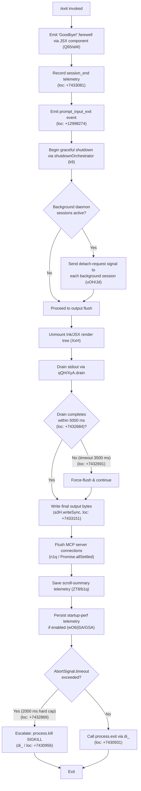

# `/exit`

> Analysis basis: CC v2.1.177 bundle.js (AST extraction + Claude interpretation)
> Minimum version: v2.1.177

---

## Overview

The `/exit` command (aliased as `/quit`) terminates the Claude Code CLI session. It triggers a multi-phase shutdown sequence: displaying a farewell message, flushing pending output, draining background sessions, persisting telemetry, and finally calling `process.exit`. The command is registered as `local-jsx`, meaning it renders a JSX component before initiating teardown.

---

## Registration

| Field | Value |
|---|---|
| type | `local-jsx` |
| name | `exit` |
| aliases | `["quit"]` |
| description | `null` |
| immediate | `true` |
| module_id | `CJK` |
| load_inline | `true` |
| loc_byte | `12998837` |
| loc_byte_end | `12999033` |
| loc_line | `9170` |
| arbor_handler.name | `d65` |
| arbor_handler.fqn | `claude-2.1.177::d65` |
| arbor_handler.kind | `AsyncFunction` |
| arbor_handler.resolution_path | `module_id` |
| arbor_handler.n_hits | `1` |

Analysis basis: CC v2.1.177 bundle.js:+12998837

---

## Input Branching

The `/exit` handler (`d65`) has more than three distinct execution paths depending on whether background sessions exist, whether the output drain succeeds within timeout, and whether a forced kill is needed. A Mermaid flowchart is used.



Analysis basis: CC v2.1.177 bundle.js:+12998086, +12998133, +7432684, +7432691, +7432869

---

## Behavioral Spec

### 1. Handler Entry — `handlerMain` (d65)

```
async function handlerMain(commandContext):
    // Render JSX farewell
    renderFarewellComponent()                    // fjA.createElement + Q65/aW, loc:+12998163
    // Signal the UI layer the user triggered exit
    emitEvent("prompt_input_exit")               // literal loc:+12998274
    // Perform pre-exit tasks
    await detachBackgroundSessions()             // uOH, loc:+12998102
    await scheduleTaskCleanup()                  // xp8, loc:+12998133
    // Pass control to shutdown orchestrator
    await shutdownOrchestrator()                 // k9, loc:+12998269
```

Analysis basis: CC v2.1.177 bundle.js:+12998086

---

### 2. Farewell Display — `farewellRenderer` (Q65 → aW)

```
function farewellRenderer():
    // Renders the string "Goodbye!" to the terminal UI
    // literal "Goodbye!" at loc:+12998050
    display("Goodbye!")
```

The literal string `"Goodbye!"` is shown to the user exactly once when the command fires.

Analysis basis: CC v2.1.177 bundle.js:+12998041, +12998050

---

### 3. Background Session Detach — `backgroundSessionDetacher` (uOH)

```
function backgroundSessionDetacher():
    for each activeBackgroundSession in registry:
        writeDetachRequest(session)              // Jd / L6H.write, loc:+10667000
        // sends literal "detach-request" message (loc:+11340877)
    waitForAcknowledgement()                     // eKH, loc:+11340953
    cleanupWorkerRecords()                       // kq8 + beq, loc:+11340840
```

The string `"detach-request"` is written to each open background worker connection before the main process tears down.

Analysis basis: CC v2.1.177 bundle.js:+11340840, +11340868, +11340877

---

### 4. Scheduled Task Cleanup — `scheduledTaskCleanup` (xp8)

```
function scheduledTaskCleanup():
    // Iterates over pending "scheduled task" entries (literal loc:+11333887)
    for each task in scheduledTasks:
        resolveOrCancelTask(task)                // IE, loc:+11333868
    pushCompletionMarkers()                      // H.push, loc:+11333873
    computeRemainingTime()                       // AbL, loc:+11333914
    formatDurationString()                       // Bq, loc:+11333929
```

Analysis basis: CC v2.1.177 bundle.js:+11333868, +11333887

---

### 5. Shutdown Orchestrator — `shutdownOrchestrator` (k9)

This is the central async function that sequences all teardown steps.

```
async function shutdownOrchestrator():
    // 1. Resolve any pending promise chain
    await Promise.resolve()                      // loc:+7432587

    // 2. Unmount the terminal UI render tree
    unmountInkComponent()                        // XxH / H.unmount, loc:+7430344

    // 3. Write any buffered output synchronously
    flushOutputBuffer()                          // a3H.writeSync, loc:+7430266

    // 4. Drain stdout; race against 5000 ms timeout
    //    max(5000, 3500) guard (locs:+7432684, +7432691)
    drainStdout = qQH()                          // XyA.drain, loc:+65246
    timeoutHandle = setTimeout(fallback, 5000)   // loc:+7432638
    await Promise.race([drainStdout, timeout])   // loc:+7432804

    // 5. clearTimeout on winner
    clearTimeout(timeoutHandle)                  // loc:+7432881

    // 6. Flush MCP server connections
    await flushMCPConnections(n1q)               // Promise.allSettled, loc:+13624226

    // 7. Persist session scroll summary
    persistScrollSummary(ZT8)                    // telemetry "tengu_scroll_summary", loc:+7432100

    // 8. Persist startup perf data if profiling was enabled
    persistStartupPerf(wO6)                      // telemetry "tengu_startup_perf", loc:+222612

    // 9. Emit cache eviction hint
    emitCacheEvictionHint()                      // telemetry "tengu_cache_eviction_hint", loc:+7433043

    // 10. Update session_end marker
    markSessionEnd("session_end")                // literal loc:+7433081

    // 11. Unref the shutdown timer so it does not block event loop
    shutdownTimer.unref()                        // C0H.unref, loc:+7432700

    // 12. Hard-exit via di_
    //     If process.exit does not fire within 2000 ms (loc:+7432869)
    //     escalate to process.kill
    forcedShutdown(di_)
```

Analysis basis: CC v2.1.177 bundle.js:+7432587, +7432655, +7432667, +7432675, +7432700, +7432780, +7432804, +7432858, +7432881, +7432929, +7432952, +7432969, +7433005, +7433018, +7433030, +7433041, +7433078, +7433125, +7433151

---

### 6. Terminal Cleanup — `terminalCleanup` (XxH)

```
function terminalCleanup():
    // Restore terminal state (ANSI escape sequences)
    writeSync("\x1b7")                           // save cursor, literal loc: indirectly via sO8
    writeSync("\x1b8")                           // restore cursor, loc:+3869374
    unmountRenderTree()                          // H.unmount, loc:+7430344
    resetScrollRegion()                          // _R, loc:+7430378
    applyTerminalCompatFixes(sO8)                // handles tmux, ghostty, iTerm2
```

Terminal compatibility handles: `tmux` (literal loc:+3517248), `ghostty` (loc:+3595543 ≥ v1.2.0), `iTerm.app` (loc:+3595612 ≥ v3.6.6), `screen` (loc:+3517321).

Analysis basis: CC v2.1.177 bundle.js:+7430266, +7430344, +7430378, +7430426

---

### 7. Forced Exit — `forcedShutdown` (di_)

```
async function forcedShutdown():
    clearTimeout(pendingTimers)                  // loc:+7430850
    componentMap = x4.get(...)                   // loc:+7430883
    try:
        process.exit(0)                          // loc:+7430931
    catch:
        // If process.exit is blocked (e.g. by a hung listener)
        process.kill(process.pid, "SIGKILL")     // loc:+7430956
        // "unreachable" branch (literal loc:+7431004)
        throw new Error("unreachable")
```

The string `"forced shutdown"` (literal at loc:+17017062) is emitted via `forceProcessExit` (Y → process.exit, loc:+17017081) before the kill escalation.

Analysis basis: CC v2.1.177 bundle.js:+7430850, +7430931, +7430956, +7430998, +7431004

---

### 8. Background Daemon Interaction — `daemonProcessManager` (D, reached from H via callGraph)

The exit path also interacts with daemon worker state management. Relevant constants observed:

- SIGKILL escalation after 30 s idle (literal `30`, loc:+16983134) with a 15 s grace period (literal `15`, loc:+16983145).
- Maximum retry count: 100 (literal loc:+16983254).
- Free-memory check via `IVA.freemem` (loc:+16983610) to guard spare-session creation.
- Daemon telemetry events fired during this path: `tengu_bg_dispatch_sigkill_escalate`, `tengu_bg_dispatch_low_mem`, `tengu_bg_spare_enable`, `tengu_bg_spare_claim`, `tengu_bg_spare_claim_fail`.

Analysis basis: CC v2.1.177 bundle.js:+16983134, +16983145, +16983179, +16983254, +16983610

---

## State & Side Effects

| Item | Detail |
|---|---|
| Telemetry — `tengu_scroll_summary` | Fired during scroll-summary persistence in `ZT8` (loc:+7432100) |
| Telemetry — `tengu_startup_perf` | Fired if startup profiling was active; written to disk by `jSA`/`GSA` (loc:+222612) |
| Telemetry — `tengu_cache_eviction_hint` | Fired just before final exit (loc:+7433043) |
| Telemetry — `tengu_bg_dispatch_sigkill_escalate` | Fired when a background worker must be SIGKILL'd (loc:+16983179) |
| Telemetry — `tengu_bg_dispatch_low_mem` | Fired when free memory is below threshold during daemon teardown (loc:+16983780) |
| Telemetry — `tengu_bg_spare_enable` | Fired when a spare background session slot is enabled (loc:+16984484) |
| Telemetry — `tengu_bg_spare_claim` | Fired when a spare session is claimed (loc:+16984612) |
| Telemetry — `tengu_bg_spare_claim_fail` | Fired when spare-session claim fails (loc:+16984878) |
| Telemetry — `tengu_daemon_config_reload` | Fired during daemon config reload in teardown path `w`/`d` (loc:+16999057) |
| Telemetry — `tengu_amber_creek` | Fired by fullscreen-mode check (`$6`/`oc4`) during terminal reset (loc:+3528498) |
| Telemetry — `tengu_pewter_brook` | Fired by fullscreen-mode check (`I1`/`$6`) (loc:+3528406) |
| JSX render | Farewell component rendered via `fjA.createElement` (loc:+12998163); unmounted by `XxH` |
| stdout drain | `XyA.drain` called; race-conditioned against 5000 ms timeout (loc:+7432684) |
| MCP connections | All MCP server connections flushed via `Promise.allSettled` in `n1q` (loc:+13624226) |
| Startup-perf file write | `fYH` performs `openSync` / `writeFileSync` / `fsyncSync` / `closeSync` (locs:+190288–190393) |
| Terminal ANSI state | Cursor save/restore escape sequences written; tmux/ghostty/iTerm2 detected and handled |
| `session_end` marker | Literal string `"session_end"` recorded in `K6`/`nM6` (loc:+7433081) |
| `prompt_input_exit` event | Emitted at command entry (literal loc:+12998274) |
| process.exit | Called unconditionally by `di_` (loc:+7430931); escalates to `process.kill` if blocked |

---

## Version History

| Version | Change |
|---|---|
| v2.1.177 | Initial analysis |

---

## Common Mistakes

1. **Invoking `/exit` during an active tool call**: Because `immediate: true` is set, the command fires synchronously even if a tool is mid-execution. Active background sessions receive a `"detach-request"` message but may not have completed their current task; data in-flight may be lost.
2. **Expecting instant termination**: The orchestrator races a 5000 ms drain timeout, a 2000 ms `AbortSignal` hard cap, and MCP flush steps — the process may remain alive for up to ~7 seconds after the command is issued before `process.kill` escalation.
3. **Confusing `/quit` with `/exit`**: Both invoke identical behavior; `"quit"` is a registered alias (loc:+12998837). There is no difference in outcome.
4. **Relying on terminal state after `/exit`**: ANSI cursor-save/restore sequences are written unconditionally. On unsupported terminals (non-tmux, non-ghostty, non-iTerm2), the escape sequences may be visible as literal characters if the terminal does not implement them.
5. **Startup-perf data loss**: If the user forces a hard kill before the `jSA` / `fYH` fsync chain completes, the startup profiling report file may be partially written or missing.

---

## Appendix — Identifier Mapping

> For bundle debugging only. Identifiers change across versions.

| Identifier | Role |
|---|---|
| `d65` | Main async handler for `/exit` (handlerMain); AsyncFunction resolved via module_id `CJK` |
| `E9` | Background-process type checker; inspects `"bg"`, `"daemon"`, `"daemon-worker"` literals |
| `BjH` | Background process categorization helper, called from `E9` |
| `H` | Random delay utility; uses `Math.random` + `setTimeout` (loc:+14139972) |
| `uOH` | Background session detacher; sends `"detach-request"` to each worker |
| `kq8` | Worker record cleanup helper, called from `uOH` |
| `beq` | Background session acknowledgement waiter |
| `Gu8` | Acknowledgement state check, called from `beq` |
| `p8` | Session stop helper used by `beq` and indirectly `O` |
| `Jd` | Detach-request writer; calls `L6H.write` |
| `CH` | JSON serialization utility; calls `JSON.stringify` |
| `eKH` | Post-detach cleanup callback in `uOH` |
| `M3` | App-state mutation helper called from `d65` |
| `xp8` | Scheduled task cleanup orchestrator |
| `IE` | Task resolution helper called from `xp8` |
| `eG` | Core event emitter / signal dispatcher |
| `AbL` | Remaining-time computation for scheduled tasks |
| `Hh` | Duration formatter; parses cron-like literals (`"Every minute"`, `"Every hour"`) |
| `K` | Column formatter; uses `f.map` + `L.padEnd` |
| `D` | Daemon process manager; handles SIGKILL escalation, memory checks, spare sessions |
| `f` | Promise-set tracker; `q.add` / `q.delete` / `L.finally` |
| `j` | Process kill iterator; iterates `A.values`, calls `S.kill` |
| `Y` | Forced process exit gateway; calls `process.exit` (loc:+17017081) |
| `$` | Pattern-match helper, calls `FPK` |
| `J` | Date arithmetic helper; uses `getUTCDay`, `setUTCDate`, etc. |
| `uI` | Text trimmer + parser helper |
| `$M7` | Cron expression parser; splits, matches, parses integers |
| `A` | Label normalizer; calls `L.toLowerCase` |
| `heH` | Time-of-day resolver; manipulates `Date` fields |
| `O` | Background session lifecycle object; `p8` for stop |
| `L` | Connection set manager; `A.close`, `q.close` |
| `q` | Data-event emitter; wraps `p1` |
| `p9` | Numeric duration formatter; `Math.floor` + `Math.round` |
| `Bq` | String column truncator; `indexOf` + `substring` |
| `q8` | String width measurer; calls `Bun.stringWidth` |
| `B1` | Rendered-cell width calculator |
| `kY` | Cell padding helper |
| `Q65` | Farewell JSX component wrapper |
| `k9` | Shutdown orchestrator (core teardown sequencer) |
| `XxH` | Terminal UI unmounter and ANSI state restorer |
| `_R` | Scroll-region reset helper |
| `sO8` | Terminal output finalizer; writes ANSI sequences, handles tmux/ghostty/iTerm2 |
| `OSH` | Terminal compatibility detector (ghostty, iTerm2) |
| `_SH` | Terminal post-cleanup step |
| `i0` | tmux escape sequence emitter; `replaceAll` for double-escape |
| `L5` | Leftover output drain helper |
| `N` | Debug/log formatter; `toUpperCase`, `trim`, etc. |
| `Qi_` | Final output writer; escapes `\\` and `\"`, writes dim text via `j6.dim` |
| `N0` | Output stream reference holder |
| `iu` | Stream-state guard |
| `I6` | Event guard / pre-condition checker |
| `Fy6` | File-existence check; `q.statSync` |
| `iC` | Inner event check helper |
| `T_` | Tertiary event check helper |
| `Q6` | Path existence validator |
| `x$` | Secondary file-check dispatcher |
| `P4` | Fallback path resolver |
| `u1q` | Output encoding helper |
| `di_` | Forced process exit executor; `process.exit` → `process.kill` escalation |
| `qQH` | stdout drain trigger; calls `XyA.drain` |
| `w` | Supervisor config manager; stop/update/start lifecycle |
| `nZH` | File stat + content reader (1 MiB limit, literal loc:+13285261) |
| `Z8` | Promise resolution wrapper |
| `n9` | Async-local-storage store accessor |
| `BJA` | File read helper |
| `TH` | String coercion utility |
| `j0K` | Config key formatter; `Object.keys` + `Math.max` |
| `T` | MCP transport lifecycle manager |
| `uN6` | Transport initializer |
| `jM6` | Transport message handler |
| `E` | MCP session manager; `Math.max`, `Math.min` for concurrency |
| `W` | MCP connection orchestrator; `Promise.all`, connection-status tracking |
| `N6f` | Heartbeat configuration helper |
| `cAH` | Heartbeat literal handler (`"heartbeat"`) |
| `V` | Supervisor start helper |
| `d` | Config-reload dispatcher; fires `tengu_daemon_config_reload` |
| `n1q` | MCP flush helper; `Promise.allSettled` over all connections |
| `wO6` | Startup-perf write orchestrator |
| `A6_` | Perf data aggregator; calls `GSA` |
| `GSA` | Perf metric serializer; `Object.entries`, `Math.round`, `Number.parseInt` |
| `jSA` | Startup-perf file writer; `fYH` + `JSON.stringify` |
| `PSA` | Path joiner + writer for perf report |
| `fYH` | Synchronous file-write utility; `openSync`/`writeFileSync`/`fsyncSync`/`closeSync` |
| `zSA` | Perf checkpoint array builder |
| `eu` | `require("perf_hooks")` wrapper |
| `WSA` | Secondary path writer for perf report |
| `ZT8` | Scroll-summary persistence driver |
| `x1q` | Scroll data extractor |
| `b1q` | Scroll-summary stat aggregator; `Date.now`, `Math.max`, `Math.round`, `Object.assign` |
| `R1q` | Scroll-summary finalizer |
| `I1` | Fullscreen-mode resolver; reads `"fullscreen"` / `"default"` settings |
| `L_H` | Buffer presence checker |
| `eh_` | Alternate fullscreen path |
| `Zt` | rc4 cipher / obfuscation step |
| `th_` | Platform detector (`"windows"`) |
| `n_` | GF-based render gate |
| `oc4` | Fullscreen suppression check; fires `tengu_amber_creek` |
| `$6` | Fullscreen render emitter; fires `tengu_pewter_brook` / `tengu_amber_creek` |
| `W36` | Session-end marker writer |
| `K6` | `session_end` literal recorder; calls `nM6` |
| `nM6` | Low-level session-end sink |
| `WxH` | Shutdown promise resolver |
| `TT8` | Post-shutdown cleanup step |

---

*Note: index built via Arbor fallback; some signals (telemetry, literals) may be missing — see arbor-fallback.js.*