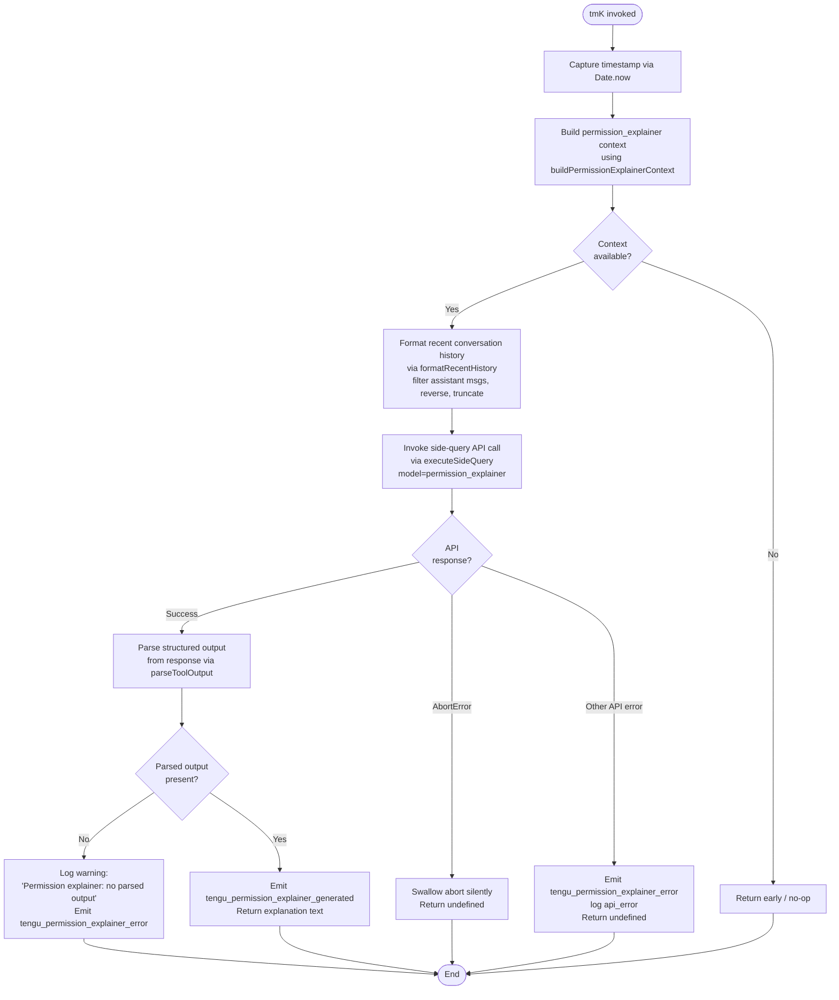

# `/explain_command`

> Analysis basis: CC v2.1.177 bundle.js (AST extraction + Claude interpretation)
> Minimum version: v2.1.177

---

## Overview

`/explain_command` is an internal **tool-type** slash command that generates a natural-language explanation of why Claude Code is requesting a particular permission. It invokes a dedicated side-query API call (`permission_explainer` context) against the model, parses the structured response, and returns explanatory text to be rendered in the UI permission dialog. The command is not intended for direct user invocation; it is triggered programmatically by the permissions subsystem when a tool-use action requires justification.

---

## Registration

| Field | Value |
|---|---|
| type | `tool` |
| name | `explain_command` |
| description | `null` |
| loc_byte | `14669558` |
| loc_byte_end | `14669594` |
| loc_line | `11416` |
| arbor_handler.name | `tmK` |
| arbor_handler.fqn | `claude-2.1.177::tmK` |
| arbor_handler.kind | `AsyncFunction` |
| arbor_handler.resolution_path | `direct` |
| arbor_handler.n_hits | `1` |

Analysis basis: CC v2.1.177 bundle.js:+14669558

---

## Input Branching

The handler has 4+ distinct branches (permission context present vs. absent, API success vs. error, parsed output present vs. absent, abort vs. non-abort error). A Mermaid flowchart is used.



---

## Behavioral Spec

### Main Handler — `permissionExplainerHandler` (bundle: `tmK`)

```
async function permissionExplainerHandler(input):
    startTime = Date.now()                          // bundle.js:+14669277

    context = buildPermissionExplainerContext(input)  // bundle.js:+14669253
    if context is null or undefined:
        return undefined

    historySnippet = formatRecentHistory(            // bundle.js:+14669316
        conversation_messages,
        maxMessages = 3,                             // bundle.js:+14668877
        maxTokenApprox = 1000,                       // bundle.js:+14668822
        roleFilter = "assistant"                     // bundle.js:+14668857
    )
    // History is filtered, reversed, truncated with "..." suffix (bundle.js:+14669053)

    explainerTag = "permission_explainer"            // bundle.js:+14669616
    apiResult = await executeSideQuery(              // bundle.js:+14669476
        context = context,
        history = historySnippet,
        tag = explainerTag,
        type = "tool_use"                            // bundle.js:+14669771
    )

    emit telemetry: tengu_permission_explainer_generated  // bundle.js:+14670041
        with duration = Date.now() - startTime

    parsedOutput = parseToolOutput(apiResult)        // bundle.js:+14669463

    if parsedOutput is null:
        log warning "Permission explainer: no parsed output in response"  // bundle.js:+14670388
        emit telemetry: tengu_permission_explainer_error  // bundle.js:+14670253
        return undefined

    return parsedOutput.explanation_text
```

Analysis basis: CC v2.1.177 bundle.js:+14669253

---

### Context Builder — `buildPermissionExplainerContext` (bundle: `zTA`)

```
function buildPermissionExplainerContext(input):
    // Resolves the tool name, tool arguments, and pending permission
    // request from the current application state.
    // Calls into config access layer (bundle.js:+14669129) → R6
    // Returns a structured context object or null if no pending request.
    toolName    = extractToolName(input)
    toolArgs    = extractToolArgs(input)
    permContext = resolvePermissionRequest()

    if permContext is null:
        return null

    // Classifies the tool as "tool" or "mcp_tool" based on name prefix
    // "mcp__" prefix → mcp_tool   (bundle.js:+2505346, bundle.js:+2505365)
    // otherwise      → "tool"     (bundle.js:+14669564)

    return { toolName, toolArgs, permContext, toolKind }
```

Analysis basis: CC v2.1.177 bundle.js:+14669129

---

### History Formatter — `formatRecentHistory` (bundle: `ZP5`)

```
function formatRecentHistory(messages, maxMessages, maxTokenApprox, roleFilter):
    // 1. Filter messages to those with role == roleFilter ("assistant")
    //    bundle.js:+14668834
    // 2. Reverse the filtered list to get most-recent-first
    //    bundle.js:+14668902
    // 3. Truncate each message body to avoid surrogate pair splits
    //    using charCodeAt boundary check (55296–56319) bundle.js:+199315/199325
    // 4. If the joined result exceeds maxTokenApprox characters,
    //    append "..." truncation marker  (bundle.js:+14669053)
    // 5. Prepend the result via unshift   bundle.js:+14669061
    // 6. Join segments                   bundle.js:+14669094
    return formattedSnippet
```

Analysis basis: CC v2.1.177 bundle.js:+14668834

---

### Side-Query Executor — `executeSideQuery` (bundle: `zU`)

```
async function executeSideQuery(context, history, tag, type):
    // Constructs request headers including:
    //   User-Agent, X-Claude-Code-Session-Id (bundle.js:+3242621)
    //   x-app: "cli-bg" or "cli"             (bundle.js:+3242588)
    //   x-client-app                         (bundle.js:+3242745)
    // Appends "side_query" marker             (bundle.js:+13847881)
    // Uses "sideQuery" telemetry label        (bundle.js:+13849250)
    // Calls globalThis.fetch                  (bundle.js:+13847934)
    // Applies Math.min token limit            (bundle.js:+13848689)
    // Sanitizes lone surrogates in response
    //   → emits tengu_lone_surrogate_sanitized (bundle.js:+13849209)
    // On success emits tengu_api_success       (bundle.js:+13849460)
    response = await fetch(apiEndpoint, requestOptions)
    return response
```

Analysis basis: CC v2.1.177 bundle.js:+13847849

---

### Tool Output Parser — `parseToolOutput` (bundle: `g1`)

```
function parseToolOutput(apiResult):
    // Delegates to schemaValidator (el → NK → Xq8 chain)
    // Validates response shape against expected tool_use schema
    // bundle.js:+2264147
    // Iterates Object.keys / Object.entries of response blocks
    // Trims whitespace, checks startsWith patterns
    // Returns first matching content block of type "tool_use"
    //   (bundle.js:+14669771) or null if none found
    for block in apiResult.content:
        if block.type == "tool_use":
            return block.input
    return null
```

Analysis basis: CC v2.1.177 bundle.js:+14669463

---

### Config & File-System Access Layer (bundle: `R6` → `G5H`)

```
function configAccessLayer():
    // Guards against early access:
    //   throws "Config accessed before allowed." bundle.js:+3337588
    // Reads config file with readFileSync, encoding "utf-8" bundle.js:+3337671
    // Handles ENOENT gracefully               bundle.js:+3337818
    // Writes backups under "backups/" subdir  bundle.js:+3337156
    // Handles EEXIST on mkdir                 bundle.js:+3338433
    // On parse error emits tengu_config_parse_error bundle.js:+3338219
    // Copies file via copyFileSync + Date.now timestamp bundle.js:+3338727
```

Analysis basis: CC v2.1.177 bundle.js:+3334337

---

## State & Side Effects

| Item | Detail |
|---|---|
| Telemetry — `tengu_permission_explainer_generated` | Fired on successful generation; includes duration (bundle.js:+14670041) |
| Telemetry — `tengu_permission_explainer_error` | Fired when API fails or parsed output is absent (bundle.js:+14670253) |
| Telemetry — `tengu_api_success` | Fired by the side-query executor on any successful API response (bundle.js:+13849460) |
| Telemetry — `tengu_lone_surrogate_sanitized` | Fired when the API response contains lone UTF-16 surrogates that are cleaned (bundle.js:+13849209) |
| Telemetry — `tengu_config_parse_error` | Fired if the config file cannot be parsed during context resolution (bundle.js:+3338219) |
| Hook registration | `XyA.register` called via `m9` during file-watcher setup (bundle.js:+65203) |
| appState changes | None directly; reads permission request state, does not mutate conversation state |
| Sound | None detected in depth-2 traversal |
| Error — AbortError | Swallowed silently; handler returns `undefined` (bundle.js:+14670711) |
| Error — API error | Logged as `api_error` and `tengu_permission_explainer_error` emitted (bundle.js:+14670782) |
| File I/O | Config read (`readFileSync`, `utf-8`), backup copies under `"backups/"` directory (bundle.js:+3337156) |
| Timeout | Side-query uses a stream watchdog; byte-idle timeout applies (bundle.js:+3249123) |

---

## Version History

| Version | Change |
|---|---|
| v2.1.177 | Initial analysis |

---

## Common Mistakes

1. **Treating this as a user-facing slash command.** `/explain_command` has `type: "tool"` and `description: null`. It is invoked internally by the permissions subsystem, not typed by users in the chat input.
2. **Expecting a visible output.** The command returns structured explanation text to the UI permission dialog, not a chat message. If no `tool_use` block is present in the API response, the handler returns `undefined` silently.
3. **Assuming it works without a pending permission request.** The context builder (`zTA`/`R6`) returns `null` if there is no active permission request; the handler exits immediately without making any API call.
4. **Ignoring the AbortError path.** If the request is cancelled (e.g., the user dismisses the dialog before the explanation arrives), the handler swallows the `AbortError` gracefully — this is intentional, not a bug.
5. **Confusing the `mcp__` prefix routing.** Tool names beginning with `"mcp__"` are classified as `mcp_tool` kind internally (bundle.js:+2505346); all others resolve to `"tool"`. This classification is part of the context passed to the explainer model.

---

## Appendix — Identifier Mapping

> For bundle debugging only. Identifiers change across versions.

| Identifier | Role |
|---|---|
| `tmK` | Main async handler for `explain_command` (permissionExplainerHandler) |
| `zTA` | Permission explainer context builder |
| `R6` | Config/state access layer (reads project config, guards early access) |
| `Q6` | Config getter utility |
| `NN_` | Config field normalizer |
| `G5H` | File-system config reader (readFileSync, backup, ENOENT handling) |
| `sK9` | Directory-scan helper used during config loading |
| `yN_` | Backup path resolver (joins path + backup subdir) |
| `ng4` | File-watcher registration helper |
| `m9` | Hook/watcher registration (calls XyA.register) |
| `EP5` | Permission context serializer (uses JSON.stringify via CH) |
| `CH` | JSON stringifier wrapper |
| `ZP5` | Recent history formatter (filter/reverse/truncate assistant messages) |
| `su` | Unicode-safe string slicer (charCodeAt surrogate boundary check) |
| `g1` | Tool output parser / schema validator entry point |
| `el` | Schema validation orchestrator |
| `NK` | Schema node validator (dispatches to field-specific validators) |
| `Xq8` | Deep tool-use block extractor / response walker |
| `JJ_` | Tool response shape normalizer |
| `j1` | Model-name / tier resolver |
| `dJ6` | Model name canonicalizer (toLowerCase) |
| `mP4` | Model-name prefix checker ("claude-") |
| `zU` | Side-query API executor (fetch, headers, token limits) |
| `_g` | Core API request builder |
| `Gv_` | URL component splitter/parser |
| `sw` | Auth profile selector |
| `Fj` | Auth token resolver (user_oauth, profile-implicit) |
| `kO` | API key / credential resolver |
| `LaH` | Auth layer composer |
| `wF4` | Request configuration assembler |
| `GF4` | HTTP request manager (UUID, streaming, watchdog) |
| `XF4` | Byte-idle timeout calculator |
| `PF4` | Stream watchdog / byte-stream reader |
| `TF4` | Request header filter (authorization, anthropic-beta, x-anthropic-*) |
| `Dz` | Auth provider classifier (bedrock, vertex, anthropicAws) |
| `fJ6` | Provider name normalizer (toLowerCase) |
| `nw` | Proxy configuration resolver |
| `Ql` | Proxy URL parser (scheme, host, port checks) |
| `jO_` | IP-address-based proxy bypass checker |
| `u88` | Proxy auth helper invoker (trust check, timeout 30000 ms) |
| `wq4` | Proxy auth timeout parser (parseInt, Number.isNaN) |
| `djH` | Gateway JWT refresh handler |
| `F24` | OAuth token refresh HTTP caller |
| `YF4` | Model / environment resolution pipeline |
| `xM8` | Model selector (PW, g1, _1, nNH) |
| `m8H` | Model family matcher (startsWith check) |
| `lbH` | Conversation context builder for side queries |
| `ZA` | System prompt assembler |
| `gM8` | Side-query parameter builder (temperature, _1 flags) |
| `NN` | Cache-control / prompt-cache annotator |
| `Rv_` | Cache-control block builder |
| `ZkH` | Cache-control tag injector |
| `M0H` | Message array packager for API request |
| `uF` | Random bytes / nonce generator for session |
| `P8` | Session record writer (saves to global config) |
| `QkA` | Message content normalizer (pop/push, Object.keys) |
| `nl6` | Message content transformer |
| `dL5` | Message role finder (find on user/assistant arrays) |
| `X2A` | SHA-256 hash generator for conversation ID |
| `Zq8` | Context-store accessor (PK, l_, Tq8, zM) |
| `T38` | Context cleanup helper |
| `Hq` | Tool-name classifier (mcp__ prefix check → mcp_tool) |
| `K6` | nM6 constant emitter |
| `n6` | Feature flag reader (d, tH) |
| `tH` | nM6 constant node |
| `TH` | String coercion utility |
| `IH` | Feature capability checker (positive path) |
| `bH` | Feature capability checker (negative path) |
| `VkH` | Model-restriction validator (_1, Dz, ry) |
| `_1` | Schema type annotation resolver (tnH, dz) |
| `dz` | Schema includes/replace normalizer |
| `QL` | Text replacement / redaction helper |
| `AE6` | Agent ID resolver |
| `Z29` | Built-in agent ID lookup |
| `R97` | Agent registry has-check |
| `Gi` | Custom agent ID resolver |
| `S97` | Agent path parser (startsWith "agent:custom:") |
| `Cb` | Agent prefix validator (startsWith check) |
| `xP_` | Agent string slicer (indexOf/slice) |
| `sJH` | SDK error logger (console.error, "[Anthropic SDK ERROR]") |
| `Zt8` | Timestamp recorder (Date.now) |
| `oW6` | Header key lowercaser (Object.entries, toLowerCase) |
| `O1` | nM6 module emitter |
| `nM6` | Core module constant |
| `$JH` | WIF (Workload Identity Federation) credential handler |
| `SrH` | WIF token exchange HTTP caller (fetch, AbortSignal.timeout) |
| `KV4` | WIF error classifier (includes "invalid_grant") |
| `E` | API client token manager (getToken, Math.max/min) |
| `W` | OAuth token refresh orchestrator |
| `G` | Keyboard / input event dispatcher (UI layer) |
| `Y` | Forced-shutdown handler (process.exit, z.abort) |
| `z` | Shutdown state (IH, bH, gS, hB) |
| `b` | Vim-register / clipboard manager |
| `bRH` | Register file reader (readFile, JSON parse) |
| `keH` | Register file writer (mkdir, writeFile) |
| `Y9H` | Register persistence coordinator |
| `D` | Background session dispatcher |
| `FwH` | API timing recorder |
| `aSH` | Temp-file cleanup helper (lstat, rm, readFile) |
| `kH` | Sentry-style error reporter (logError) |
| `$6` | Background worker scheduler (W06, G06, em, R6) |
| `of` | Worker factory (sw, R6) |
| `PQ1` | Conversation state persister (calls R6) |
| `Zv_` | Config snapshot writer (calls R6) |

---

Note: index built via Arbor fallback; some signals (telemetry, literals) may be missing — see arbor-fallback.js.