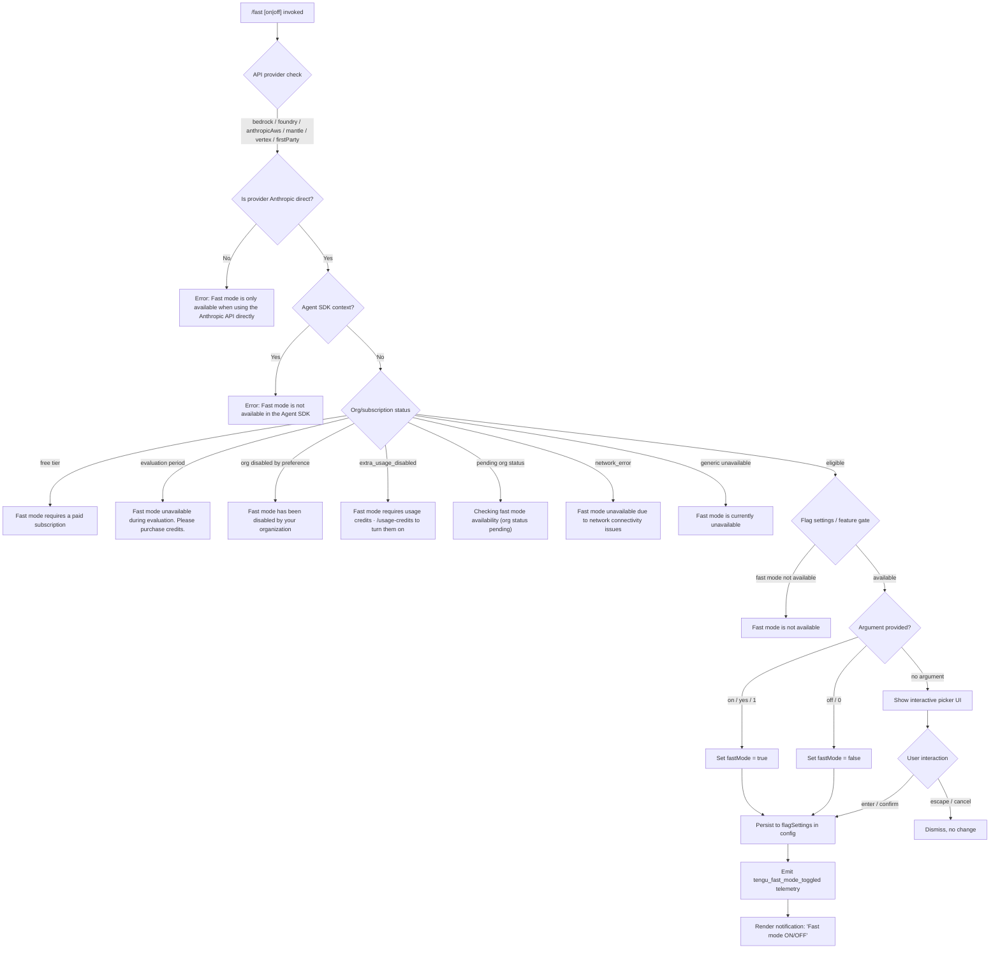

# `/fast`

> Analysis basis: CC v2.1.176 bundle.js (AST extraction + Claude interpretation)
> Minimum version: v2.1.176

---

## Overview

The `/fast` command toggles **Fast mode** (labeled "research preview") on or off for the current Claude Code session. When invoked, it checks multiple eligibility conditions (API provider, subscription tier, org policy, network state, and feature-flag status) before allowing the toggle, and renders an interactive picker UI that reflects the current fast-mode availability status in real time.

---

## Registration

| Field | Value |
|---|---|
| type | `local-jsx` |
| name | `fast` |
| description | `Toggle fast mode ( ... )` |
| argumentHint | `[on\|off]` |
| immediate | `null` |
| thinClientDispatch | `control-request` |
| isHidden | `null` |
| module_id | `AwK` |
| load_inline | `true` |
| loc_byte | `12770873` |
| loc_byte_end | `12771145` |
| loc_line | `8932` |
| arbor_handler.name | `WtL` |
| arbor_handler.fqn | `claude-2.1.176::WtL` |
| arbor_handler.kind | `AsyncFunction` |
| arbor_handler.resolution_path | `module_id` |
| arbor_handler.n_hits | `3` |

Analysis basis: CC v2.1.176 bundle.js:+12770873

---

## Input Branching

The command has more than three distinct eligibility/state branches; a flowchart is used below.



Analysis basis: CC v2.1.176 bundle.js:+2250340, +2250408, +2250762, +2249859, +2249900, +2249991, +2250075, +2250172, +2250251, +12769988, +28091, +28097

---

## Behavioral Spec

### Handler Entry Point (`WtL`)

The main handler is the async function `WtL` (Arbor-resolved, `module_id` path, `n_hits: 3`).

```
async function fastModeHandler(args, context):
    // 1. Pre-flight: fetch or reuse cached fast-mode availability
    prefetchFastModeStatus(context)          // viH — may return in-flight promise

    // 2. Determine current app state
    flagSettings = context.appState.flagSettings
    currentFastMode = flagSettings.fastMode

    // 3. Parse explicit argument
    arg = args.trim().toLowerCase()
    if arg in ["on", "yes", "1"]:
        targetState = true
    else if arg in ["off", "0"]:
        targetState = false
    else:
        targetState = null   // interactive picker

    // 4. Render JSX component (xg8) which internally runs eligibility checks
    return createElement(FastModeComponent, { targetState, context })
```

Analysis basis: CC v2.1.176 bundle.js:+12769873, +12770007, +12770111, +12770172

---

### Availability Prefetch (`viH`)

Called eagerly before the picker is shown; results are cached to avoid redundant network calls.

```
async function prefetchFastModeStatus(context):
    if inFlightPromise exists:
        log("Fast mode prefetch in progress, returning in-flight promise")
        return inFlightPromise

    if fetchedRecently():
        log("Skipping fast mode prefetch, fetched recently")
        return cachedStatus

    auth = getAuth(context)
    if auth is null:
        throw Error("No auth available")

    response = await callFastModeStatusEndpoint(auth)   // RS → FF4 chain
    store result in cache
    emit tengu_org_penguin_mode_fetch_failed on error
    return status
```

Analysis basis: CC v2.1.176 bundle.js:+2254449, +2254538, +2254785, +2254961, +2255957

---

### Eligibility Gate (`l_H`)

Evaluates the multi-condition eligibility check before the toggle is allowed to proceed. Called from the JSX render path.

```
function checkFastModeEligibility(context):
    provider = getAPIProvider(context)    // o_ → A6
    if provider not in ANTHROPIC_DIRECT_PROVIDERS:
        return { ok: false, reason: "Fast mode is only available when using the Anthropic API directly" }

    if isAgentSDKContext(context):        // ogH → p_
        return { ok: false, reason: "Fast mode is not available in the Agent SDK" }

    orgStatus = getOrgStatus(context)     // wq8 → A6
    switch orgStatus:
        case "free":
            return { ok: false, reason: "Fast mode requires a paid subscription" }
        case "evaluation":
            return { ok: false, reason: "Fast mode unavailable during evaluation. Please purchase credits." }
        case "preference" (org disabled):
            return { ok: false, reason: "Fast mode has been disabled by your organization" }
        case "extra_usage_disabled":
            return { ok: false, reason: "Fast mode requires usage credits · /usage-credits to turn them on" }
        case "pending":
            return { ok: false, pending: true, reason: "Checking fast mode availability (org status pending)" }
        case "network_error":
            return { ok: false, reason: "Fast mode unavailable due to network connectivity issues" }

    if featureGateUnavailable():
        return { ok: false, reason: "Fast mode is not available" }

    return { ok: true }
```

Analysis basis: CC v2.1.176 bundle.js:+2250340, +2250408, +2249833, +2249859, +2249900, +2249972, +2249991, +2250046, +2250075, +2250172, +2250251, +2250762, +2250832

---

### Provider Restriction Logic (`o_`)

Checks whether the active API provider is the Anthropic direct API. Only the following provider identifiers pass the gate:

- `"bedrock"` (Analysis basis: CC v2.1.176 bundle.js:+2118121)
- `"foundry"` (Analysis basis: CC v2.1.176 bundle.js:+2118171)
- `"anthropicAws"` (Analysis basis: CC v2.1.176 bundle.js:+2118227)
- `"mantle"` (Analysis basis: CC v2.1.176 bundle.js:+2118281)
- `"vertex"` (Analysis basis: CC v2.1.176 bundle.js:+2118329)
- `"firstParty"` (Analysis basis: CC v2.1.176 bundle.js:+2118338)

If the active provider is not among these, the eligibility gate returns immediately with the restriction message.

---

### Interactive Picker Component (`xg8`)

When no explicit `on`/`off` argument is supplied, a React JSX component is rendered.

```
function FastModePickerComponent(props):
    [pickerVisible, setPickerVisible] = useState(...)
    availability = useAppState(fastModeAvailability)    // D6 → LS_
    mcpState = useMCPConnectionState()                  // M → LbH

    emit telemetry: tengu_fast_mode_picker_shown

    if availability.status == "overloaded":
        display: "Fast mode overloaded and is temporarily unavailable"
    else if availability.limitReached:
        display: "You've hit your fast limit · resets in <countdown>"

    render title: " Fast mode (research preview)"
    render toggle: ON / OFF  (current state)

    on keypress "tab":      toggle selection
    on keypress "enter":    confirm selection → applyToggle()
    on keypress "escape":   cancel → dismiss picker

    // Cooldown handling
    if cooldown state detected:
        log("Fast mode cooldown expired, re-enabling fast mode")
        re-enable after cooldown
```

Analysis basis: CC v2.1.176 bundle.js:+12770113, +12768134, +12768841, +12768910, +12768916, +12769082, +12769136, +12769165, +12768406, +12768457, +12768327, +2252028

---

### Toggle Application and Persistence (`bg8`)

Once the user confirms a toggle (or an explicit argument is supplied), this function writes the new state.

```
function applyFastModeToggle(newState, context):
    currentConfig = readFlagSettings(context)       // Cg8 → RZH
    currentConfig.fastMode = newState

    saveConfig(currentConfig)                       // C6 → j38 (config write with lock)

    emit telemetry: tengu_fast_mode_toggled
    display notification: newState ? "Fast mode ON" : "Fast mode OFF"

    // Deprecation notice for opus-4-6 model
    if currentModel matches opus46:
        emit telemetry: tengu_sunset_penguin_opus46
        apply "opus46-fast-mode-deprecation" flag  // literals: +12765578

    // Apply flag settings to session
    applyFlagSettings(context)                     // literal "apply_flag_settings": +12765823
```

Analysis basis: CC v2.1.176 bundle.js:+12766192, +12766459, +12765578, +12765823, +12766304, +12766181

---

### Org Status Check / Penguin Mode (`$6` / `eM8`)

The system calls into a subsystem (internally referred to as "penguin mode" based on telemetry) that evaluates org-level feature entitlement.

```
function checkOrgPenguinMode(context):
    if MN_.has(sessionId):
        return KXH.get(sessionId)   // return cached result

    MN_.add(sessionId)
    result = fetchOrgStatusFromServer()    // L2_ → Bs.emit

    if result.disabled:
        emit telemetry: tengu_penguins_off
        return DISABLED

    return result
```

Analysis basis: CC v2.1.176 bundle.js:+2250446, +3310652, +3310676, +3310692, +3310703

---

### Opus 4.8 Model Interaction

The command is aware of the `claude-opus-4-8` model identifier (Analysis basis: CC v2.1.176 bundle.js:+12766319). When fast mode is toggled and the active model is in the opus-4-x family, additional deprecation/sunset logic may fire.

Model strings checked in this path include `"opus-4-6"`, `"opus-4-7"`, `"opus-4-8"` (Analysis basis: CC v2.1.176 bundle.js:+2251618, +2251642, +2251666).

---

### Fast Mode Status Display in UI (`xg8` render)

The component renders contextual status text based on current state:

| Internal Status | Displayed String |
|---|---|
| `enabled (cached)` | `"enabled (cached)"` |
| `disabled (network_error)` | `"disabled (network_error)"` |
| `overloaded` | `"Fast mode overloaded and is temporarily unavailable"` |
| limit reached | `"You've hit your fast limit · resets in <T>"` |
| active / on | `"ON "` |
| off | `"OFF"` |
| after explicit off toggle | `"Fast mode OFF"` |
| kept off (no change) | `"Kept Fast mode OFF"` |

Analysis basis: CC v2.1.176 bundle.js:+2255884, +2255903, +12769082, +12769136, +12769165, +12768910, +12768916, +12766459, +12767528

---

## State & Side Effects

| Item | Detail |
|---|---|
| Telemetry | `tengu_fast_mode_toggled` (on every confirmed toggle), `tengu_fast_mode_picker_shown` (when interactive picker is displayed), `tengu_penguins_off` (when org disables fast mode), `tengu_org_penguin_mode_fetch_failed` (network error during status fetch), `tengu_sunset_penguin_opus46` (when opus-4-6 deprecation path fires), `tengu_config_lock_contention` (config write race), `tengu_config_stale_write`, `tengu_config_auth_loss_prevented` |
| Config write | Writes `fastMode` boolean to `flagSettings` key in the user config (`~/.claude.json`); protected by a file lock (via `j38` / `C6` save path) |
| appState changes | `flagSettings.fastMode` is updated in app state; `applyFlagSettings` is called to propagate to active session |
| Flag application | `"apply_flag_settings"` action is dispatched to session after toggle (Analysis basis: CC v2.1.176 bundle.js:+12765823) |
| Cooldown state | A `"cooldown"` expiry watcher re-enables fast mode automatically when the cooldown period expires (Analysis basis: CC v2.1.176 bundle.js:+2251975, +2252028) |
| Sound | <!-- TODO: not found in depth-2 traversal; needs --depth 4 --> |
| Hook registration | The JSX component uses `K.registerHandler` (via `mA`) to register keyboard event handlers for `tab`, `enter`, `escape` key bindings |
| thinClientDispatch | Registered as `"control-request"` — dispatched to the thin client layer when running in remote/thin-client mode |
| Docs link | `"https://code.claude.com/docs/en/fast-mode"` surfaced in the picker UI (Analysis basis: CC v2.1.176 bundle.js:+12769356) |

---

## Version History

| Version | Change |
|---|---|
| v2.1.176 | Initial analysis |

---

## Common Mistakes

1. **Running `/fast` on a non-Anthropic API provider** — If you have configured a Bedrock, Vertex, or other third-party provider endpoint as the primary API, the command will reject with "Fast mode is only available when using the Anthropic API directly." Switch to the direct Anthropic API to use fast mode.
2. **Using `/fast` inside an Agent SDK context** — Fast mode is blocked entirely when Claude Code is being driven programmatically via the Agent SDK (`claude-vscode` or similar). The literal message "Fast mode is not available in the Agent SDK" is returned with no toggle UI rendered.
3. **Expecting free-tier access** — Fast mode requires a paid subscription. Free-tier accounts receive "Fast mode requires a paid subscription" and cannot toggle the feature.
4. **Ignoring the `[on|off]` argument hint** — Passing any argument other than `on`, `off`, `yes`, or the numeric equivalents (`1`/`0`) will fall through to the interactive picker rather than applying the toggle directly.
5. **Confusing "overloaded" with "disabled"** — When the status is `"overloaded"`, fast mode is temporarily unavailable due to capacity, not a permanent account or config issue. No config write occurs in this state.
6. **Opus 4.6 deprecation** — Using fast mode with the `claude-opus-4-6` model triggers a sunset/deprecation warning path. Consider upgrading to a newer model if this fires.

---

## Appendix — Identifier Mapping

> For bundle debugging only. Identifiers change across versions.

| Identifier | Role |
|---|---|
| `WtL` | Main fast-mode command handler (AsyncFunction, Arbor-resolved) |
| `Gf` | App-state getter utility |
| `o_` | API provider resolver |
| `A6` | Low-level string/value coercion utility |
| `l_H` | Fast-mode eligibility and status evaluation function |
| `$6` | Org entitlement / "penguin mode" check dispatcher |
| `W06` | Org status branch handler A |
| `G06` | Org status branch handler B |
| `em` | Org entitlement intermediate |
| `Fm` | Experiment / feature-flag lookup |
| `eM8` | Cached org penguin mode fetcher |
| `L2_` | Org status fetch with GrowthBook experiment emit |
| `wN_` | Org status network request handler |
| `C6` | Config save with lock |
| `Q6` | Config path resolver |
| `ZN_` | Config backup helper |
| `G5H` | Config file read/write with backup rotation |
| `ug4` | Config file watcher |
| `N` | Transcript / message logger |
| `gff` | Terminal output formatter |
| `JyA` | ANSI sequence helpers |
| `CH` | JSON serializer |
| `bf` | Path redaction / sanitizer |
| `ikA` | Redaction map builder |
| `kQH` | stdout writer |
| `mkA` | Raw write-to-handle |
| `lff` | Append-to-transcript / log-file writer |
| `AQH` | Debounced batch log flusher |
| `g4H` | Log rotation helper |
| `r$6` | Log error handler |
| `skA` | Log file path resolver |
| `dH_` | Log file rotate-on-size helper |
| `cff` | Log file append with mkdir |
| `u9` | Hook/event registrar |
| `NK` | Command argument parser / tokenizer |
| `ED6` | Argument filter |
| `maA` | Argument filter sub-function |
| `uaA` | Argument builder |
| `ZD6` | Flag/argument object assembler |
| `bhA` | Flag definition lookup |
| `jDH` | Remote-managed settings reader |
| `Tb` | Settings merge utility |
| `N_H` | Settings normalization |
| `PD6` | Policy settings applier |
| `Kf` | Token replace utility |
| `kPK` | Rate-limit / telemetry state tracker |
| `JyH` | Token inclusion check |
| `WN` | Token exclusion check |
| `Yq8` | Argument parse loop |
| `j1` | Model identifier parser |
| `dJ6` | Model alias resolver |
| `ey1` | Entry-set argument transformer |
| `I8` | Policy settings reader |
| `Pe6` | Policy entry resolver |
| `tnH` | Settings entries iterator |
| `r_` | Global feature-flag reader |
| `ty1` | Token index finder |
| `vP4` | Model/flag cascade resolver |
| `ay1` | Flag index finder |
| `NP4` | Prefix-match flag resolver |
| `sy1` | StartsWith flag check |
| `wyH` | Subscription/plan state reader |
| `CJ` | Auth plan combiner |
| `OLH` | Plan type resolver |
| `NA` | Subscription state constructor |
| `Mq` | Pro/plan status merger |
| `g1` | Conversation context builder |
| `el` | Conversation entry builder |
| `vY` | Conversation value formatter |
| `lB` | Conversation label formatter |
| `yO` | Conversation output wrapper |
| `jT` | Conversation render dispatcher |
| `hj` | UI layout helper |
| `L7` | Column layout renderer |
| `NvH` | Column width calculator |
| `q3` | Message queue processor |
| `Rm` | Reset / clear state |
| `p_` | Agent SDK context detector |
| `ogH` | Agent SDK flag reader |
| `nu` | Notification emitter |
| `wq8` | Org status reader from config |
| `YP4` | Auth type selector |
| `viH` | Fast-mode availability prefetch handler |
| `LJ_` | Prefetch state initializer |
| `Aq` | Auth token assembler |
| `ycA` | Auth token encoder |
| `DW` | Auth dispatch wrapper |
| `kO` | HTTP auth request builder |
| `XL` | HTTP client base |
| `cV` | HTTP client with policy check |
| `K06` | API key injector |
| `QP` | API key helper resolver |
| `DJ6` | File-descriptor API key reader |
| `Fj` | Profile/OAuth auth builder |
| `nf` | No-auth fallback handler |
| `kb` | Token slice utility |
| `wT` | Content-type array check |
| `JP4` | Bearer token getter |
| `F1` | OAuth endpoint resolver |
| `OUA` | OAuth URL base |
| `iTf` | OAuth staging flag |
| `RS` | OAuth 401 recovery dispatcher |
| `FF4` | OAuth 401 retry flow |
| `Ot` | OAuth token store getter |
| `IH` | Feature-ok state recorder |
| `qaH` | OAuth 401 cooldown tracker |
| `bH` | Feature-bad state recorder |
| `yF` | Model-to-API-name mapper |
| `mf` | MCP tool call emitter |
| `Na` | Notification assembler |
| `u36` | Usage/rate display |
| `kH` | Token push to debug log |
| `BF4` | OAuth background refresh scheduler |
| `YK9` | OAuth backoff calculator |
| `t$` | OAuth recovery state machine |
| `zA` | Settings load-from-disk orchestrator |
| `n3` | Settings file path builder |
| `JDH` | Settings file reader |
| `_L_` | Full settings loader |
| `PaA` | Settings key enumerator |
| `WF` | Settings merge writer |
| `JaA` | SDK inline settings merger |
| `_W` | OS-level settings reader |
| `Os` | File-based settings reader |
| `k8` | Error wrapper |
| `E8` | Error type tester |
| `z7_` | Settings timestamp cache setter |
| `ZhH` | Settings watcher initializer |
| `Je6` | Settings file path resolver |
| `EY6` | Atomic file writer |
| `Kz` | Cache clear utility |
| `Nt6` | Gitignore/config file path normalization |
| `x6` | Git submodule root finder |
| `n4_` | Config key normalizer |
| `vt6` | Git check-ignore runner |
| `vgf` | Global gitignore path resolver |
| `jrA` | Gitignore rule builder |
| `JrA` | Gitignore rule appender |
| `Tm` | Settings path joiner |
| `T_` | Terminal escape sequence emitter |
| `eG` | ANSI escape code |
| `n6` | Feature-sad state recorder |
| `eH` | Metric event emitter |
| `GF` | Settings load orchestrator (full) |
| `tG` | Settings load timer |
| `fq` | Memory usage sampler |
| `AL_` | Settings batch load runner |
| `qc6` | Settings load completion marker |
| `P8` | Config save with global fallback |
| `j38` | Config file write with lock and backup |
| `dI1` | Config write payload assembler |
| `EaH` | Config write error handler |
| `vN_` | Config backup path builder |
| `FK9` | Config entry serializer |
| `h06` | Config write timestamp |
| `D38` | Config atomic save helper |
| `bg8` | Fast-mode toggle application (JSX internal) |
| `Cg8` | Flag settings reader/writer |
| `RjH` | Flag-to-config key mapper |
| `RZH` | Flag value type coercer |
| `SZH` | Fast-mode component renderer |
| `Hp` | Theme resolver |
| `AG6` | Terminal color theme applicator |
| `O$8` | Theme name validator |
| `wg` | ANSI prefix stripper |
| `G79` | Theme default fallback |
| `K4` | Session state reader |
| `zN` | Model subscription checker |
| `XL_` | Session settings path resolver |
| `xA` | Foreground color parser |
| `bXH` | ANSI/hex/rgb color to chalk mapper |
| `gn` | Color fallback |
| `CS` | Number formatter (toFixed/isInteger) |
| `ry1` | Integer-aware toFixed helper |
| `YyH` | Fast-mode status text builder |
| `L1` | Model-to-display-name resolver |
| `dz` | Model alias display normalizer |
| `o36` | Opus plan label |
| `QL` | Model name display replacer |
| `tYA` | Fast-mode deprecation notice builder |
| `my1` | Opus-4-6 sunset/deprecation checker |
| `xg8` | Fast-mode interactive picker JSX component |
| `D6` | App state context hook |
| `LS_` | App state context reader |
| `i9` | MCP server list hook |
| `f4` | App state selector (typed) |
| `TA` | App state typed accessor |
| `b1` | Clock context hook |
| `gt4` | MCP server reduce helper |
| `M` | MCP connection manager |
| `LbH` | MCP server launcher/connector |
| `LQ` | MCP server slot builder |
| `EZ` | MCP transport factory |
| `d8` | MCP config entry validator |
| `uN6` | MCP slot updater |
| `do9` | MCP server connect dispatcher |
| `oX8` | MCP server reconnect handler |
| `nX8` | MCP server disconnect handler |
| `z8` | MCP debug logger |
| `k28` | MCP stdio transport builder |
| `S28` | MCP SSE transport builder |
| `to9` | MCP connection result applier |
| `_Q_` | MCP tool loader |
| `j` | Background process tracker |
| `wh` | MCP skills event emitter |
| `Bg_` | MCP permission checker |
| `I` | MCP notification handler |
| `K7` | MCP error logger |
| `TH` | String coercion helper |
| `ro9` | MCP background retry watcher |
| `J86` | MCP port parser A |
| `kW8` | MCP port parser B |
| `Ho8` | MCP apply connection result |
| `fbH` | MCP server worker builder |
| `wG` | MCP connection cleanup |
| `vZA` | MCP state reconciler |
| `j28` | MCP permission set checker |
| `n8` | Abort-aware setTimeout wrapper |
| `D86` | MCP server worker factory |
| `iw9` | MCP fold helper |
| `z` | MCP fold/stop dispatcher |
| `gS` | Session event emitter |
| `iyH` | Feature-state initializer |
| `f2_` | Session UUID emitter |
| `hB` | Graceful shutdown handler |
| `NLH` | MCP shutdown invoker |
| `hLH` | Shutdown timeout clearer |
| `KJ_` | Conversation-start timestamp emitter |
| `K6` | React module reference |
| `nM6` | React internal marker |
| `mA` | Global keyboard handler registrar |
| `BD` | Global context hook |
| `m9` | Time countdown formatter |

---

Note: index built via Arbor fallback; some signals (telemetry, literals) may be missing — see arbor-fallback.js.