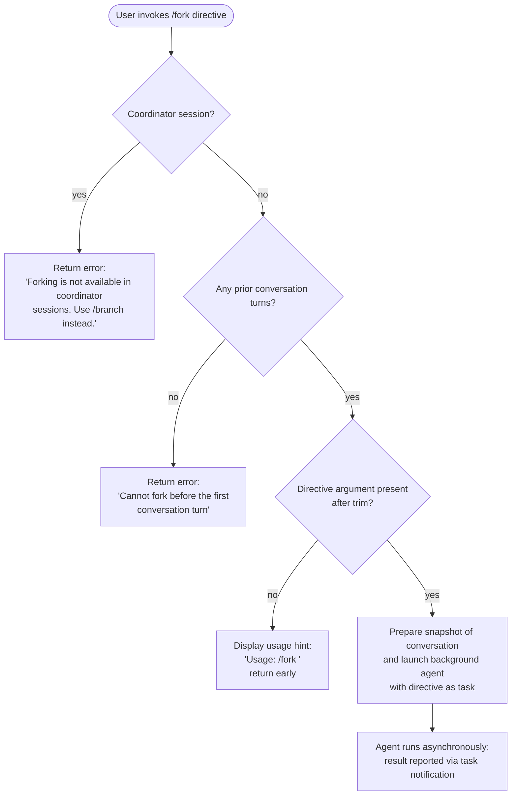

# `/fork`

> Analysis basis: CC v2.1.177 bundle.js (AST extraction + Claude interpretation)
> Minimum version: v2.1.177

---

## Overview

`/fork` spawns a background agent that inherits a snapshot of the current conversation context, allowing parallel or delegated work to proceed independently of the foreground session. The user supplies a directive string that becomes the agent's initial task. The command is blocked in coordinator sessions (where `/branch` should be used instead) and requires at least one completed conversation turn before it may be invoked.

---

## Registration

| Field | Value |
|---|---|
| type | `local-jsx` |
| name | `fork` |
| description | Spawn a background agent that inherits the full conversation |
| argumentHint | `<directive>` |
| module_id | `DYK` |
| load_inline | `true` |
| loc_byte | `12829948` |
| loc_byte_end | `12830151` |
| loc_line | `9030` |
| arbor_handler.name | `KeL` |
| arbor_handler.fqn | `claude-2.1.177::KeL` |
| arbor_handler.kind | `AsyncFunction` |
| arbor_handler.resolution_path | `module_id` |
| arbor_handler.n_hits | `0` |

Analysis basis: CC v2.1.177 bundle.js:+12829948

---

## Input Branching

Four distinct paths exist depending on session context and the presence of a directive argument.



Analysis basis: CC v2.1.177 bundle.js:+12829507 (trim check), +12829531 (usage string), +12829645 (coordinator guard), +12829718 (turn guard)

---

## Behavioral Spec

### Entry point — handler `forkCommandHandler` (bundle: `KeL`)

```
async function forkCommandHandler(args, appState):
    directive = args.trim()                          // +12829507

    if appState.isCoordinatorSession():
        return error("Forking is not available in coordinator sessions. Use /branch instead.")
                                                     // +12829645

    if not hasPriorConversationTurn(appState):
        return error("Cannot fork before the first conversation turn")
                                                     // +12829718

    if directive == "":
        display("Usage: /fork <directive>")          // +12829531
        return

    agentOptions = buildAgentOptions(appState)       // calls buildAgentOptionsFromAppState (+12829599)
    launchBackgroundAgent(directive, agentOptions)   // calls spawnLocalAgent (+12829640)
```

### Coordinator-session guard

The handler reads session metadata to detect whether the current REPL is operating as a coordinator (orchestrator). The literal `"Forking is not available in coordinator sessions. Use /branch instead."` is emitted verbatim when this guard fires.

Analysis basis: CC v2.1.177 bundle.js:+12829645

### Conversation-turn prerequisite

Before launching, the handler verifies at least one assistant turn has completed. The literal `"Cannot fork before the first conversation turn"` is returned when the check fails.

Analysis basis: CC v2.1.177 bundle.js:+12829718

### `buildAgentOptionsFromAppState` (bundle: `_MA`)

```
function buildAgentOptionsFromAppState(appState):
    // Collect conversation snapshot
    snapshot = sliceConversation(appState, 50, 49)   // +11260240, +11260253
    sessionId = generateSessionId(randomBytes(8))     // +11260270 (hex, 8 bytes)
    startTime = Date.now()                            // +11260297

    // Inherit REPL contexts, hooks, memory
    replContexts = appState.getReplContexts()         // +11260095
    memoryPrompt = loadMemoryPrompt(appState)         // calls memoryLoader (+11259861)

    // Build system-prompt assembly from inherited state
    systemPrompt = buildSystemPrompt(appState)        // calls systemPromptBuilder (+11259968)

    // Prepare agent launch record
    record = {
        type:   "subagent",                           // +11260780
        launch: "spawn",                              // +11260845
        mode:   "fork",                               // +11260055
    }

    return {snapshot, sessionId, startTime, replContexts,
            memoryPrompt, systemPrompt, record}
```

Analysis basis: CC v2.1.177 bundle.js:+11259849

### `spawnLocalAgent` (bundle: `rK6`)

```
async function spawnLocalAgent(directive, agentOptions):
    // Prepare filesystem artefacts for the sub-agent session
    sessionDir = prepareSessionDirectory()           // calls directoryPreparer (+13622701)
    symlink   = createTranscriptSymlink(sessionDir)  // +13622754

    // Build agent descriptor and register with agent registry
    agentDescriptor = {
        type:   "local_agent",                       // +10445886
        status: "running",                           // +10445931
        kind:   "general-purpose",                   // +10446069
    }
    agentRegistry.register(agentDescriptor)          // +10446261

    // Launch the main query loop for the sub-agent
    backgroundQueryLoop(directive, agentOptions)     // calls mainQueryRunner (+10445864)
```

Analysis basis: CC v2.1.177 bundle.js:+10445839

### `buildSystemPrompt` (bundle: `xRL` → `mZ`)

The system-prompt assembly function (`mZ`) is a large compositor that reads feature flags and app state to produce the final prompt sent to the forked agent. Key sections observed in literals include:

- **Environment section** (`"env_info_static"` / `"env_info_simple"`) describing the runtime context, git-worktree notice, and available Claude Code surfaces. Analysis basis: +13766066, +13766103
- **Output style** (`"output_style"`) and **language** (`"language"`) fields derived from session config. Analysis basis: +13766141, +13766176
- **Background-session marker** (`"bg-session"`, `"bg"`) to indicate the agent is running headlessly. Analysis basis: +13766206
- **Context management** (`"context_management"`, `"brief"`) for compact-mode awareness. Analysis basis: +13766260, +13766299
- **Scratchpad** (`"scratchpad"`) slot. Analysis basis: +13766233
- **Autonomy / act-don't-rederive** (`"act_dont_rederive"`) and other feature-flag sections. Analysis basis: +13766404
- **Note on absolute paths**: the system prompt explicitly instructs the agent that `cwd` is reset between bash calls and only absolute file paths should be used. Analysis basis: +13771618

### `backgroundQueryLoop` (bundle: `p_6`)

The background query loop is the main agentic runner. Highlights observable from the call graph and literals:

```
async function backgroundQueryLoop(directive, opts):
    // Cap idle polling interval
    watchdogTimeout = setTimeout(stallHandler, 600000)  // 10 min, +7360488

    loop:
        result = await callModel(directive, opts)
        processStreamEvents(result)                // tengu_async_agent_stall_timeout on stall
        if result.done:
            emitTelemetry("subagent_complete")     // +7361616
            break
        if stalled:
            emitTelemetry("subagent_stall_timeout")// +7361636
            break

    clearTimeout(watchdogTimeout)
    notifyParent(result)                           // task notification channel
```

Analysis basis: CC v2.1.177 bundle.js:+7360381

### Error path — missing directive

When the trimmed argument string is empty the handler displays the usage literal `"Usage: /fork <directive>"` and returns without spawning any agent.

Analysis basis: CC v2.1.177 bundle.js:+12829531

---

## State & Side Effects

| Item | Detail |
|---|---|
| Telemetry — fork-specific | `subagent_launch` (+11259864), `subagent_fork_coordinator_mode` (+11259882), `subagent_fork_prompt_missing` (+11260006) |
| Telemetry — lifecycle | `subagent_complete` (+7361616), `subagent_stall_timeout` (+7361636), `subagent_completed` (+7357814), `subagent_end` (+7358114), `subagent_async_errored` (+7364342), `subagent_exit` (+10598576) |
| Telemetry — agent runner | `tengu_async_agent_stall_timeout`, `tengu_forked_agent_default_turns_exceeded`, `tengu_agent_tool_completed`, `tengu_agent_tool_terminated`, `tengu_agent_summary_skipped` |
| Telemetry — spawn tracing | `claude_code.subagent.spawn` (OTel span, +6646987), `subagent.spawn` span type (+6646854) |
| Filesystem side effects | Creates a per-session directory via `r6H.mkdir` (+13620273); creates a symlink (`r6H.symlink`, +13622754); cleans up via `r6H.unlink` on teardown (+13622814) |
| Agent registry | Registers a `local_agent` record with the agent registry (`M.register`, +10446261) |
| Background session marker | Sets `"bg-session"` flag in session metadata so the system prompt and output-style compositor know the agent is headless |
| Coordinator guard | Command is hard-blocked in coordinator sessions; returns an error string, no side effects |
| Turn guard | Command is hard-blocked when no prior assistant turn exists; returns an error string, no side effects |
| Hook registration | Sub-agent session inherits parent hook configuration via `replContexts` |
| appState changes | Parent app state is not mutated directly; the forked agent runs in an isolated `$I1` async-context store (`um → $I1.run`, +11260686) |
| Sound | <!-- TODO: not found in depth-2 traversal; needs --depth 4 --> |

---

## Version History

| Version | Change |
|---|---|
| v2.1.177 | Initial analysis |

---

## Common Mistakes

1. **Running `/fork` in a coordinator session** — The command is intentionally blocked there. Use `/branch` instead, as the error message advises.
2. **Omitting the directive** — `/fork` with no argument (or only whitespace) prints the usage hint and does nothing. The directive is mandatory.
3. **Running `/fork` before any conversation turn** — The command requires at least one completed assistant turn so it has a meaningful context snapshot to inherit. Start a conversation first.
4. **Expecting synchronous output** — The forked agent runs fully in the background. Results arrive via the task-notification channel, not as an immediate reply in the current session.
5. **Assuming the forked agent can use relative paths** — The system prompt explicitly instructs the agent to use only absolute file paths because its `cwd` is reset between bash invocations.

---

## Appendix — Identifier Mapping

> For bundle debugging only. Identifiers change across versions.

| Identifier | Role |
|---|---|
| `KeL` | `forkCommandHandler` — top-level async handler for `/fork` |
| `_MA` | `buildAgentOptionsFromAppState` — assembles snapshot, system prompt, and launch record |
| `xRL` | `buildSystemPromptFromState` — reads app state to feed the system-prompt compositor |
| `mZ` | `systemPromptCompositor` — large function assembling all system-prompt sections |
| `rK6` | `spawnLocalAgent` — prepares filesystem artefacts and registers the agent |
| `p_6` | `backgroundQueryLoop` — main agentic runner for the forked session |
| `VpH` | `prepareSessionDirectory` — creates/symlinks per-session directory |
| `Oc8` | `sessionDirectoryLock` — add/delete lock around session dir operations |
| `mPA` | `makeSessionDir` — `r6H.mkdir` wrapper |
| `b$` | `buildSessionPath` — `xPA.join` path builder |
| `iR` | `runSubagentSession` — inner loop that drives the forked agent's REPL |
| `b_` | `getConversationSnapshot` — retrieves conversation history slice |
| `Pb8` | `buildConversationForFork` — filters and assembles messages for the fork |
| `Atq` | `trimSystemPromptWhitespace` — trims assembled system prompt |
| `XR` | `generateSessionId` — replaces placeholder with random hex bytes |
| `re` | `buildModelRequestParams` — assembles model-call parameters |
| `nE` | `selectModelForRequest` — resolves model name from session config |
| `NK` | `resolveModelAlias` — maps aliases (fable, sonnet, haiku, opus, best) to model ids |
| `j1` | `resolveNamedModel` — lower-level named-model resolver |
| `H` | `addJitterDelay` — `Math.random` + `setTimeout` jitter before first API call |
| `um` | `runInAsyncContext` — wraps subagent in `$I1.run` isolated async store |
| `mm` | `getAsyncContextStore` — reads `IJ_` store |
| `zy6` | `runQueryIteration` — single iteration of the agentic query loop |
| `mT` | `processModelStreamEvents` — handles streaming events from model |
| `B8` | `createAgentTurnRecord` — records a completed agent turn with UUID |
| `uC8` | `initializeSubagentAppState` — sets up isolated app state for the forked agent |
| `pC8` | `buildSkillsAndMcpForSubagent` — assembles tool/skill list for the forked agent |
| `Zu_` | `buildMcpToolList` — reduces MCP server list to tool descriptors |
| `dU` | `handleSubagentCompletion` — teardown and result propagation |
| `rNL` | `mainQueryRunner` — core API-call loop (shared with foreground sessions) |
| `OOH` | `createSubagentStartRecord` — emits `SubagentStart` event |
| `u2` | `runSubagentTurn` — executes one agent turn including hooks |
| `yb6` | `initSubagentSession` — initialises session state, emits `SubagentStart` |
| `V7` | `callModelApi` — thin wrapper around API client |
| `i06` | `loadMemoryFiles` — reads CLAUDE.md and memory files for the prompt |
| `te` | `buildToolList` — assembles the allowed-tools list for the session |
| `rn_` | `filterAllowedTools` — applies `allowed_tools` / `disallowed_tools` policy |
| `HXL` | `buildMcpConfig` — builds MCP server configuration for the subagent |
| `lK6` | `writeAgentMetadata` — writes `.meta.json` for the forked session |
| `RKH` | `buildForkContextRef` — constructs `fork-context-ref` payload |
| `se` | `updateTaskRegistry` — updates task state in the task registry |
| `gG8` | `markTaskRunning` — sets task status to running |
| `u_6` | `markTaskFailed` — sets task status to failed |
| `FG8` | `handleAgentCompletion` — post-run classification and telemetry |
| `My6` | `classifyAgentOutput` — safety/handoff classifier for agent output |
| `pG8` | `finishAgentRun` — emits `subagent_completed` / `subagent_end` telemetry |
| `ri9` | `startOtelSpan` — opens `claude_code.subagent.spawn` OTel span |
| `BWH` | `enterOtelContext` — enters OTel async context |
| `IR` | `getActiveOtelSpan` — reads active span from `G3H` |
| `Fh` | `getTOHTimestamp` — reads `TOH` monotonic timestamp |
| `vL` | `getTaskVersion` — reads task version for optimistic concurrency |
| `TOH` | `monotonicTimestampBase` — base reference for monotonic timestamps |
| `z2A` | `getSystemPromptFeatureFlags` — reads feature-flag overrides for system prompt |
| `SG` | `getSessionGuidance` — retrieves session-specific guidance section |
| `h75` | `buildOutputStyleSection` — assembles `output_style` system-prompt section |
| `y75` | `buildConfirmationSection` — assembles confirmation-behaviour guidance |
| `I75` | `buildTaskContinuitySection` — assembles task-continuity section |
| `Q75` | `buildSystemSection` — assembles `# System` section with version/help info |
| `HL5` | `buildBgSessionSection` — assembles `bg-session` worktree/tmp guidance |
| `_L5` | `buildScratchpadSection` — assembles scratchpad section |
| `qL5` | `buildBriefSection` — assembles `brief` context-management section |
| `LL5` | `buildFlagSettingsSection` — assembles `flagSettings` section |
| `l75` | `buildEnvironmentSection` — assembles `env` + `growthbook` section |
| `C75` | `buildHeronBrookSection` — assembles `heron_brook` autonomy section |
| `b75` | `buildAutonomyAppendSection` — assembles `autonomy_append` section |
| `Ymq` | `computeGrowthbookFlags` — resolves GrowthBook feature-flag values |
| `c75` | `buildActDontRederiveSection` — assembles `act_dont_rederive` section |
| `p75` | `buildPromptInjectionWarning` — assembles prompt-injection warning |
| `U75` | `buildToolUseSection` — assembles `# Using your tools` section |
| `B75` | `buildFableIdentitySection` — assembles `fable_identity` section |
| `F75` | `buildTaskDoingSection` — assembles `# Doing tasks` section |
| `d75` | `buildSessionGuidanceSection` — assembles `# Session-specific guidance` |
| `M49` | `buildMemorySection` — assembles memory prompt section |
| `HXH` | `buildProviderSection` — assembles `firstParty`/`anthropicAws` provider section |
| `o75` | `buildMcpSection` — assembles MCP-related system-prompt entries |
| `nQ` | `buildSdkSection` — assembles `:sdk` section |
| `t75` | `buildEnvInfoSection` — assembles static environment info |
| `s75` | `buildEnvInfoSimpleSection` — assembles simplified environment info |
| `EP L` | `filterAssistantToolResults` — filters assistant messages with tool results |
| `GPL` | `filterToolUseMessages` — filters messages containing tool-use blocks |
| `TPL` | `filterToolResultMessages` — filters messages containing tool-result blocks |
| `WPL` | `filterErrorToolResults` — filters tool results with error status |
| `zuq` | `extractToolResultCode` — extracts `code`/`error`/`ok` from tool result |
| `kH` | `writeDebugLog` — appends to debug log file via `f.appendFileSync` |
| `N` | `resolveLogLevel` — maps level string to log-level constant |
| `R6` | `recordTelemetryEvent` — records a telemetry event with timestamp |
| `IH` | `logError` — logs an error event with `d`/`tH` formatting |
| `bH` | `logInfo` — logs an info event |
| `tH` | `formatLogEntry` — formats a structured log entry |
| `d` | `getLogTimestamp` — returns current timestamp for log entries |
| `nM6` | `logLevelConstants` — defines `debug`/`info`/`warn`/`error` constants |
| `eG` | `logLevelFilter` — filters log entries below configured level |
| `T_` | `logToSubagentsFile` — writes to `subagents` log channel |
| `I6` | `logToMainFile` — writes to main log channel |
| `A6` | `formatString` — `String(…)` coercion helper |
| `CH` | `jsonStringify` — thin `JSON.stringify` wrapper |
| `Z8` | `noopOnEEXIST` — swallows `EEXIST` errors from `symlink` |
| `Kv` | `buildSubagentsLogPath` — joins `Q2H` path segments for subagents log |

Note: index built via Arbor fallback; some signals (telemetry, literals) may be missing — see arbor-fallback.js.