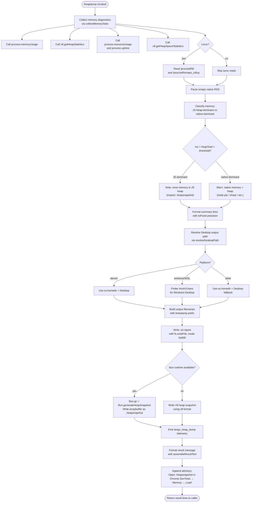

# `/heapdump`

> Analysis basis: CC v2.1.177 bundle.js (AST extraction + Claude interpretation)
> Minimum version: v2.1.177

---

## Overview

`/heapdump` is a hidden diagnostic command that captures a full JavaScript heap snapshot of the running Claude Code process and writes it to the user's Desktop directory, along with a human-readable memory diagnostics report. It gathers V8 heap statistics, process memory usage, OS resource metrics, and Linux `/proc` data (where available), then produces a `.heapsnapshot` file (inspectable in Chrome DevTools) and a companion `.txt` summary. The command is intended for internal debugging of memory leaks and is not surfaced to end users in the normal command list.

---

## Registration

| Field | Value |
|---|---|
| type | `local` |
| name | `heapdump` |
| description | `Dump the JS heap to ~/Desktop` |
| loc_byte | `12931492` |
| loc_byte_end | `12931920` |
| loc_line | `9152` |
| supportsNonInteractive | `true` |
| isHidden | `true` |
| module_id | `wjK` |
| load_inline | `true` |
| arbor_handler.name | `hH5` |
| arbor_handler.fqn | `claude-2.1.177::hH5` |
| arbor_handler.kind | `AsyncFunction` |
| arbor_handler.resolution_path | `module_id` |
| arbor_handler.n_hits | `0` |

Analysis basis: CC v2.1.177 bundle.js:+12931492

The handler `hH5` was resolved via `module_id` → `wjK` → export lookup. Because `arbor_handler` disagrees with any synthetic BFS entry, `hH5` is used as the authoritative handler name throughout this spec.

---

## Input Branching

The command has more than three distinct internal branches (runtime detection, platform path resolution, heap format selection, memory classification, and report assembly), so a Mermaid flowchart is used.



---

## Behavioral Spec

### 1. Top-Level Handler (`heapDumpHandler`)

Analysis basis: CC v2.1.177 bundle.js:+12930361

```
async function heapDumpHandler(context):
    diagnosticData = await collectMemoryStats()       // bDA call at +12930361
    resultLines    = []
    resultLines.push(...)                             // _.push at +12930507
    resultLines = resultLines.join(separator)         // _.join at +12930629
    summaryText = assembleResultText(diagnosticData)  // yH5 call at +12930480
    return { type: "text", content: resultLines }
```

The handler is an `AsyncFunction` (`arbor_handler.kind`). It delegates immediately to `collectMemoryStats` (mapped to `bDA`) and then to `assembleResultText` (mapped to `yH5`) before producing its text output.

Analysis basis: CC v2.1.177 bundle.js:+12930480, +12930507, +12930629

---

### 2. Memory Statistics Collection (`collectMemoryStats`)

Analysis basis: CC v2.1.177 bundle.js:+12929023 – +12929319

```
async function collectMemoryStats():
    stats = {}

    // Node/Bun process memory
    stats.processMemory   = process.memoryUsage()         // +12926524
    stats.heapStats       = v8.getHeapStatistics()        // +12926548
    stats.resourceUsage   = process.resourceUsage()       // +12926574
    stats.uptime          = process.uptime()               // +12926600
    stats.heapSpaces      = v8.getHeapSpaceStatistics()   // +12926625
    stats.activeHandles   = process._getActiveHandles()   // +12926667
    stats.activeRequests  = process._getActiveRequests()  // +12926704

    // Linux /proc supplemental data
    try:
        fdEntries = await fs.readdir("/proc/self/fd")     // +12926755, +12926767
        smapsText = await fs.readFile(
            "/proc/self/smaps_rollup", "utf8")            // +12926817, +12926830, +12926856
        stats.fdCount  = fdEntries.length
        stats.smapsRss = parseSmapsRss(smapsText)
    catch:
        stats.fdCount  = null
        stats.smapsRss = null

    // Load bun:jsc module if available for Bun-specific heap info
    try:
        jsc = require("bun:jsc")                          // +12926915
        stats.jscHeap = jsc.getHeapStatistics()
    catch:
        stats.jscHeap = null

    // Format per-stat lines
    formattedLines = formatStatLines(stats)               // G call at +12926928
    formattedLines.push(classifyMemoryPressure(stats))    // P.push at +12927109

    return { stats, formattedLines }
```

**Key thresholds and constants:**
- Uptime bucket: `3600` seconds (1 hour) — Analysis basis: CC v2.1.177 bundle.js:+12927056
- Memory unit divisor: `1048576` (1 MiB) — Analysis basis: CC v2.1.177 bundle.js:+12927061
- Numeric precision: `.toFixed()` applied to floating-point MB values — Analysis basis: CC v2.1.177 bundle.js:+12927417
- Reporting threshold for native leak indicator: `500` (MB or ratio unit) — Analysis basis: CC v2.1.177 bundle.js:+12927449

---

### 3. Memory Pressure Classification (`classifyMemoryPressure`)

Analysis basis: CC v2.1.177 bundle.js:+12927294, +12928413

```
function classifyMemoryPressure(stats):
    rss        = stats.processMemory.rss / 1048576      // MiB
    heapTotal  = stats.heapStats.total_heap_size / 1048576

    if rss > heapTotal + NATIVE_THRESHOLD:
        return "Native memory > heap - leak may be in native addons " +
               "(node-pty, sharp, etc.)"                // literal at +12927294
    else:
        return "No obvious leak indicators. Check heap snapshot " +
               "for retained objects."                  // literal at +12928413
```

The advisory string `"Native memory > heap - leak may be in native addons (node-pty, sharp, etc.)"` is emitted verbatim when native memory dominates. The alternative message `"No obvious leak indicators. Check heap snapshot for retained objects."` is used otherwise.

Analysis basis: CC v2.1.177 bundle.js:+12927294, +12928413

---

### 4. Desktop Path Resolution (`resolveDesktopPath`)

Analysis basis: CC v2.1.177 bundle.js:+12929319, +1095555 – +1096047

```
async function resolveDesktopPath():
    platform = detectPlatform()          // t6 call at +12928141

    if platform == "darwin":             // literal at +12928567
        home    = os.homedir()           // gf_.homedir at +1095562
        return path.join(home, "Desktop") // MM.join at +1095598, literal at +1095608

    if platform == "windows":            // literal at +1095626
        // Probe WSL Windows mount
        candidates = enumerateWindowsUserDirs("/mnt/c/Users")  // literal at +1095830
        // Filter out system dirs: "Public", "Default", "Default User", "All Users"
        // literals at +1095874, +1095893, +1095913, +1095938
        for candidate in candidates:
            desktopPath = path.join(candidate, "Desktop")
            if directoryExists(desktopPath):
                return desktopPath
        return path.join(os.homedir(), "Desktop")   // fallback

    // Generic POSIX fallback
    home = os.homedir()
    return path.join(home, "Desktop")
```

On macOS, `"darwin"` platform string triggers the simple `homedir + Desktop` join. On Windows (including WSL via `/mnt/c/Users`), the resolver walks candidate user directories while excluding system-owned folders. System folder literals: `"Public"`, `"Default"`, `"Default User"`, `"All Users"` (bundle.js:+1095874 – +1095938).

---

### 5. Heap Snapshot Writing (`writeHeapSnapshot`)

Analysis basis: CC v2.1.177 bundle.js:+12929562, +12929679, +12930041 – +12930118

```
async function writeHeapSnapshot(outputDir, timestamp):
    snapshotPath = path.join(outputDir, timestamp + ".heapsnapshot")

    if isBunRuntime():
        // Bun-native path
        Bun.gc(true)                                      // +12930118  (force GC first)
        snapshot = Bun.generateHeapSnapshot()             // +12930061
        $jsc.writeFileSync(snapshotPath, snapshot,        // +12930041
            { format: "arraybuffer" })                    // literal at +12930091

    else:
        // V8 fallback
        v8.writeHeapSnapshot(snapshotPath,
            { format: "v8" })                            // literal at +12930086
```

File mode for the companion `.txt` report is `0o600` (octal `384`): Analysis basis: CC v2.1.177 bundle.js:+12929506.

The fallback label `"auto-1.5GB"` appears in the literal set and likely corresponds to the automatic heap limit hint passed to V8 (Analysis basis: CC v2.1.177 bundle.js:+12929679).

---

### 6. Report Assembly (`assembleResultText`)

Analysis basis: CC v2.1.177 bundle.js:+12930480, +12930736, +12930804, +12930864, +12931001, +12931048

```
function assembleResultText(diagnosticData):
    lines = []

    // Format header section: uptime, handle/request counts, heap spaces
    // Each numeric column is right-padded; column width derived from Math.max
    maxWidth = Math.max(...columnWidths)                   // +12930736

    // Memory classification line
    if jsHeapDominant:
        lines.append("— most memory is JS heap " +
                      "(inspect the .heapsnapshot)")       // literal +12930804
    else:
        lines.append("— most memory is native " +
                      "(NOT in the .heapsnapshot)")        // literal +12930864

    // Optional "no obvious leak" suffix
    if noLeakIndicators:
        lines.append("  (no obvious leak indicators)")    // literal +12931001

    // XL6 call: format file-size or column helper
    formattedSize = formatColumnHelper(value, width)      // XL6 at +12931048

    // Advisory footer — always appended
    lines.append(
        "Open the .heapsnapshot in Chrome DevTools → " +
        "Memory → Load to inspect retainers."             // literal +12930517
    )

    lines.append(
        "  (no obvious leak indicators)"                  // conditional +12931001
    )

    return lines.join("\n")
```

Column widths use `Math.max` over data to ensure aligned output. Report precision uses integer division with `8` significant columns (Analysis basis: CC v2.1.177 bundle.js:+12931136). The `1073741824`-byte (1 GiB) constant may be used as a display scale for total memory figures (Analysis basis: CC v2.1.177 bundle.js:+12931410).

---

### 7. File Write and Logging

Analysis basis: CC v2.1.177 bundle.js:+12929428, +12929471, +12929487, +12929611

```
async function writeOutputFiles(desktopPath, stats, formattedReport, timestamp):
    // Construct output filename from timestamp
    outputBase = path.join(desktopPath, timestamp)        // CDA.join at +12929428

    // Write human-readable .txt summary
    await fs.writeFile(outputBase + ".txt",               // JL6.writeFile at +12929471
        formattedReport, { mode: 0o600 })                 // 0o600 = 384 at +12929506

    // Serialize stats object to JSON companion (optional)
    jsonPayload = JSON.stringify(stats)                   // CH at +12929487

    // Write heap snapshot binary
    await writeHeapSnapshot(outputBase)

    // Emit telemetry
    telemetry.track("tengu_heap_dump", { ... })           // +12929613

    // Log errors if any step fails
    errorLogger(err)                                      // kH at +12929869
```

The logging subsystem (`kH`) uses a rolling buffer that limits to `3` retained entries (Analysis basis: CC v2.1.177 bundle.js:+12929079). Errors are also passed to `$s.logError` (Analysis basis: CC v2.1.177 bundle.js:+1049676).

---

## State & Side Effects

| Item | Detail |
|---|---|
| Telemetry | `tengu_heap_dump` (bundle.js:+12929613) — emitted on each successful invocation |
| Telemetry (indirect) | `tengu_daemon_control` (+17020740), `tengu_bg_dispatch_sigkill_escalate` (+16983179), `tengu_bg_dispatch_low_mem` (+16983780), `tengu_bg_spare_enable` (+16984484), `tengu_bg_spare_claim` (+16984612), `tengu_bg_spare_claim_fail` (+16984878), `tengu_scheduled_task_missed` (+16468672) — emitted by helper subsystems reachable from call graph depth ≤ 2 |
| File system writes | Two files created on the Desktop: `<timestamp>.heapsnapshot` and `<timestamp>.txt`; both written with mode `0o600` |
| GC side effect | `Bun.gc(true)` is called before snapshot generation when running under Bun; this forces a full garbage-collection cycle |
| Process introspection | Reads `process._getActiveHandles()` and `process._getActiveRequests()` — internal Node.js APIs not guaranteed stable |
| `/proc` reads (Linux only) | Reads `/proc/self/fd` directory listing and `/proc/self/smaps_rollup` for native-memory estimation |
| appState changes | None observed in depth-2 traversal |
| Sound | None |
| Hook registration | `XyA.register` is called via `m9` (Analysis basis: CC v2.1.177 bundle.js:+65203); likely registers a cleanup or atexit hook for log rotation |
| Visibility | `isHidden: true` — command is invisible in `/help` output and autocomplete |

---

## Version History

| Version | Change |
|---|---|
| v2.1.177 | Initial analysis |

---

## Common Mistakes

1. **Running on a non-Desktop OS environment**: The command writes to `~/Desktop`. On headless Linux servers, this directory typically does not exist and the write will fail. Pre-create `~/Desktop` if needed, or run on macOS/Windows where the Desktop directory is guaranteed.

2. **Expecting the snapshot immediately in the shell**: `/heapdump` is async and runs inside the CLI process. The `.heapsnapshot` file appears on disk only after the async handler resolves; do not poll for it before the command returns its result text.

3. **Opening the `.txt` file instead of the `.heapsnapshot` in Chrome DevTools**: The `.txt` file is a human-readable summary only. The Chrome DevTools Memory panel requires the binary `.heapsnapshot` file. The advisory footer in the output explicitly states: `"Open the .heapsnapshot in Chrome DevTools → Memory → Load to inspect retainers."` (bundle.js:+12930517).

4. **Misreading the native-leak warning**: The message `"Native memory > heap - leak may be in native addons (node-pty, sharp, etc.)"` (bundle.js:+12927294) does not confirm a leak; it means RSS is substantially larger than the JS heap, which is consistent with native addon allocations (node-pty for terminal emulation, sharp for image processing). Verify with a dedicated native profiler before concluding a leak exists.

5. **Assuming Bun-specific snapshot format on Node.js**: When Claude Code runs under Node.js (not Bun), the V8 code path is taken and `Bun.generateHeapSnapshot` is not called. The resulting file is still a standard V8 heap snapshot and is fully compatible with Chrome DevTools.

6. **Using this command in production telemetry-sensitive sessions**: `tengu_heap_dump` is emitted unconditionally. If the session operates in `no-telemetry` mode, verify that telemetry filtering applies before invoking this command.

---

## Appendix — Identifier Mapping

> For bundle debugging only. Identifiers change across versions.

| Identifier | Role |
|---|---|
| `hH5` | Top-level heap dump async handler (`heapDumpHandler`) — Arbor arbor_handler |
| `bDA` | Memory statistics collection function (`collectMemoryStats`) |
| `OjK` | Low-level stat gatherer: calls process.memoryUsage, v8 heap APIs, /proc reads (`gatherRawStats`) |
| `NH5` | Bun-specific heap snapshot writer (`writeBunHeapSnapshot`) |
| `yH5` | Report text assembly function (`assembleResultText`) |
| `SlA` | Desktop path resolver (`resolveDesktopPath`) |
| `I6` | Filesystem utility / path helper |
| `eG` | Inner path or string helper called by `I6` |
| `G` | UI key-event dispatcher / top-level editor controller |
| `y` | Editor sub-handler (called from G) |
| `Y` | Process-exit or forced-shutdown helper |
| `T` | Key-event preventDefault dispatcher |
| `z` | Daemon/keydown handler with abort support |
| `tc` | Helper called from editor controller (mapped to `kY` inner) |
| `j` | Process signal sender (iterates A.values, calls S.kill) |
| `ACK` | Action-type dispatcher (find/replace/textObject branches) |
| `pRK` | Yank/visualOp operator handler |
| `gRK` | Visual-replace operator handler |
| `cRK` | Visual-case operator handler |
| `b` | Register accessor (`getRegister`) |
| `nRK` | Register-paste operator handler |
| `bRK` | Text-join operator handler |
| `xRK` | Visual-indent operator handler |
| `f` | Promise lifecycle tracker (add/finally/delete) |
| `D` | Daemon session manager (spawn, retire, memory pressure) |
| `H` | History-search opener with random ID + setTimeout |
| `P` | Binary stream reader with buffer concat and indexOf |
| `r0A` | Operator function registry (operatorFind, operatorTextObj, operatorG, etc.) |
| `S` | Command executor (execute method, writes to supervisor) |
| `X` | Timeout-bearing stat formatter |
| `M` | Module-value cache / registry |
| `q` | Timer-bearing registry (setTimeout variant) |
| `N` | Log-level formatter and writer |
| `tff` | Log entry formatter |
| `WyA` | Log transport switcher |
| `CH` | JSON serialiser wrapper |
| `xf` | String redaction / path trimmer |
| `akA` | Redaction map builder |
| `A` | Case-normaliser (toLower) |
| `kQH` | Log writer dispatcher |
| `BkA` | Raw stream write helper |
| `A4f` | Log file writer (mkdir, appendFile, rename, unlink lifecycle) |
| `AQH` | Buffered log flush with clearTimeout/setTimeout/setImmediate |
| `g4H` | Log-line formatter with join |
| `Q6` | Async file-system wrapper |
| `r$6` | Sync rename/fallback helper |
| `HSA` | Path join + I6 helper |
| `cH_` | File rotation helper (stat, endsWith, rename, unlink) |
| `_4f` | File append-and-rotate inner loop |
| `m9` | Atexit / hook registrar (XyA.register) |
| `K` | Column-pad formatter (padEnd with two-space separator) |
| `L` | Connection/socket closer |
| `SlA` | Desktop path resolver (os.homedir, Desktop literal, Windows probe) |
| `d` | Generic async utility / deferred |
| `jA` | Error stringifier |
| `L5` | Utility: likely result-wrapper or status code helper |
| `kH` | Error logger with rolling buffer (limit 3) |
| `A6` | String coercer |
| `qq` | Formatter calling ScA |
| `ScA` | Inner string formatter |
| `hUf` | Rolling-buffer shift/push manager |
| `XL6` | Column-width / file-size formatter used in report assembly |

---

Note: index built via Arbor fallback; some signals (telemetry, literals) may be missing — see arbor-fallback.js.