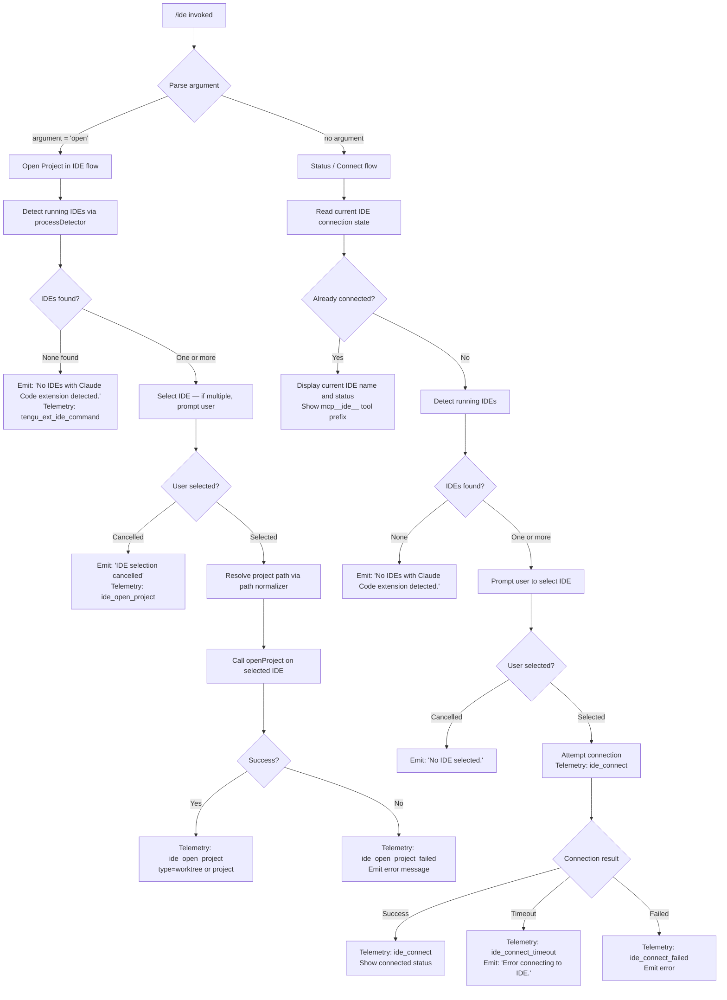

# `/ide`

> Analysis basis: CC v2.1.177 bundle.js (AST extraction + Claude interpretation)
> Minimum version: v2.1.177

---

## Overview

The `/ide` command manages IDE integrations for Claude Code, providing detection, connection, and status reporting for supported IDE extensions (VS Code, Cursor, Windsurf, JetBrains, and others). When invoked with the optional `open` subcommand, it attempts to open the current project in the selected IDE. Without arguments, it shows the current IDE connection status and allows the user to select or reconnect to a detected IDE.

---

## Registration

| Field | Value |
|---|---|
| type | `local-jsx` |
| name | `ide` |
| description | `Manage IDE integrations and show status` |
| argumentHint | `[open]` |
| module_id | `Z1K` |
| load_inline | `true` |
| loc_byte | `11891731` |
| loc_byte_end | `11891887` |
| loc_line | `7620` |
| arbor_handler.name | `gBL` |
| arbor_handler.fqn | `claude-2.1.177::gBL` |
| arbor_handler.kind | `AsyncFunction` |
| arbor_handler.resolution_path | `module_id` |
| arbor_handler.n_hits | `0` |

Analysis basis: CC v2.1.177 bundle.js:+11891731

---

## Input Branching

The command has 4+ distinct branches based on the argument value and IDE detection state:



---

## Behavioral Spec

### Main Handler: ideCommandHandler (gBL)

Analysis basis: CC v2.1.177 bundle.js:+11887847

```
async function ideCommandHandler(args, context):
    emit telemetry: tengu_ext_ide_command

    argument = args[0] ?? null  // e.g. "open" or absent

    // Detect all running IDE processes
    detectedIDEs = await detectRunningIDEs()   // calls processDetector (c28)

    if detectedIDEs is empty:
        display "No IDEs with Claude Code extension detected."
        return

    // Determine which IDE to use
    selectedIDE = await resolveIDESelection(detectedIDEs, context)

    if selectedIDE is null:
        display "No IDE selected."
        return

    if argument == "open":
        await openProjectInIDE(selectedIDE, context)
    else:
        await connectToIDE(selectedIDE, context)
```

---

### IDE Process Detection (c28 / processDetector)

Analysis basis: CC v2.1.177 bundle.js:+11888007

```
async function detectRunningIDEs():
    // 1. Enumerate IDE socket/pipe paths via socketPathEnumerator (d28)
    socketPaths = await enumerateIDESockets()

    // 2. For each socket path, attempt to read IDE metadata
    results = await Promise.all(
        socketPaths.map(path => readIDESocketInfo(path))
    )

    // 3. Filter to those that successfully responded
    validIDEs = results.filter(r => r != null)

    // 4. On Linux, also run ps-based detection (uh7 / psScanner):
    //    ps aux | grep -E "code|cursor|windsurf|devin-desktop|idea|..."
    //    (bundle.js:+6617100)

    // 5. Normalize and deduplicate results
    return validIDEs
```

Supported IDE name strings (literals extracted from bundle):
- `"windsurf"` (+6615200)
- `"devin"` / `"Devin Desktop"` (+6615224, +6615520)
- `"cursor"` (+6615264)
- `"insiders"` (+6615304)
- `"vscode"` / `"vs code"` / `"visual studio code"` (+6615329–+6615374)
- `"vscodium"` / `"code - oss"` / `"codium"` (+6615408–+6615651)
- `"jetbrains"` / `"appcode"` (+6608825, +6617488)

IDE type identifier used internally: `"IDE"` (+6617939)

---

### Socket Path Enumeration (d28 / socketPathEnumerator)

Analysis basis: CC v2.1.177 bundle.js:+6608929

```
async function enumerateIDESockets():
    candidates = []

    // Walk home directory and known IDE socket locations (yh7)
    homedir = os.homedir()
    basePaths = resolveBasePaths(homedir)  // includes WSL path /mnt/c/Users (+6610466)

    for each basePath in basePaths:
        // Skip system accounts: Public, Default, Default User, All Users
        //   (+6610560, +6610579, +6610599, +6610624)
        if basePath matches excluded user names: continue

        // Look for IDE socket files matching pattern
        // Uses lock file extension: ".lock" (+6609039)
        sockets = scanForIDESockets(basePath)
        candidates.push(...sockets)

    return candidates
```

---

### IDE Name Classification (Hi9, l28)

Analysis basis: CC v2.1.177 bundle.js:+11888235, +11888257

```
function classifyIDEByName(rawName):
    lower = rawName.toLowerCase()

    // Hi9: check if name includes known IDE keywords
    if lower includes any of ["windsurf", "devin", "cursor", "insiders",
                               "vscode", "vs code", "visual studio code",
                               "vscodium", "code - oss", "codium"]:
        return matchedIDEType

    // l28: basename + extension-based check (.cmd for Windows, +6615783)
    basename = path.basename(rawName)
    if basename includes known executable names:
        return matchedIDEType

    return "unknown"
```

---

### Open Project in IDE (openProjectInIDE)

Analysis basis: CC v2.1.177 bundle.js:+11888397

```
async function openProjectInIDE(selectedIDE, context):
    emit telemetry: ide_open_project  // +11888400

    // Determine project path
    if context has worktree:
        openType = "worktree"   // +11888434
    else:
        openType = "project"    // +11888445

    projectPath = resolveProjectPath(context)

    try:
        result = await selectedIDE.openProject(projectPath)
        emit telemetry: ide_open_project { type: openType }
        display success message with IDE name (bold: j6.bold, +11888461)
    catch error:
        emit telemetry: ide_open_project_failed  // +11888507
        display error message
        if process exited without opening:
            note: "Exited without opening IDE"  // +11888797
```

---

### IDE Connection Flow (connectToIDE)

Analysis basis: CC v2.1.177 bundle.js:+11889901 – +11890262

```
async function connectToIDE(selectedIDE, context):
    // Update connection state to "pending" (+11889906)
    appState.ideConnectionStatus = "pending"

    emit telemetry: ide_connect  // +11889950

    try:
        // Attempt SSE or WebSocket connection
        // SSE endpoint: "sse-ide" (+11885834)
        // WS endpoint:  "ws-ide"  (+11885854)
        // Display: "Connecting to <name>" (+11890980)

        connectionResult = await attemptIDEConnection(selectedIDE)

        if connectionResult == "ws:" protocol:
            // WebSocket path (+11890760)
            handleWebSocketIDEConnection(selectedIDE)

        emit telemetry: ide_connect (success)
        display connected IDE name and MCP tool prefix: "mcp__ide__" (+11890540)

    catch TimeoutError:
        emit telemetry: ide_connect_timeout  // +11890144
        display "Error connecting to IDE."  // +11890262
        hint: "restart your IDE"  // +11889065

    catch ConnectionError:
        emit telemetry: ide_connect_failed  // +11890037
        display error details

    on disconnect:
        emit telemetry: ide_disconnect  // +11890643
```

---

### IDE Status Display (ideStatusRenderer — E1K)

Analysis basis: CC v2.1.177 bundle.js:+11889733

```
function renderIDEStatus(props):
    // React component (local-jsx type)
    [status, setStatus] = useState(initialStatus)   // ZM.useState +11889733

    appState = useAppState()   // D6 via OS_ context hook +11889753
    stateRef = useRef()        // +11889811
    
    useEffect(() => {
        // Subscribe to IDE connection state changes
        // Uses useSyncExternalStore pattern (ML component, +11890106)
    }, [deps])

    useCallback(onInstallIDEExtension, [])  // +11888974
    // Callback triggers IDE extension install instructions (ZQ_/uh7)

    // Render: list detected IDEs, connection status, tool prefix
    // If j.startsWith("ws:"):   show WebSocket connection info (+11890747)
    // Else:                      show SSE connection info

    return JSX status panel
```

---

### IDE Extension Install Instructions (ZQ_ / uh7)

Analysis basis: CC v2.1.177 bundle.js:+11888930, +6617626

```
function getIDEInstallInstructions(ideName):
    // uh7: enumerate known IDEs and their install commands
    // Uses Object.entries over IDE config (+6616504)
    // Checks q.includes, K.includes for platform/name matching

    // Platform context via zhH (fW) — resolves shell command context
    //   zhH branches: UiA, G4_, T4_, Z4_, nnA, VY6, W4_, etc.

    // Returns IDE-specific extension install command string
    // e.g. for VS Code: `code --install-extension ...`
    // For JetBrains: plugin manager instructions

    // hint string: "restart your IDE" (+11889065)
    return installInstructions
```

---

### Background Daemon Interaction

Analysis basis: CC v2.1.177 bundle.js:+11887993 (u6), +11888603 (Q28)

The `/ide` command also interacts with the Claude Code background daemon for session routing:

```
function checkDaemonIDESession():
    // u6 / bs6 / Cs6.getStore: reads daemon store for existing IDE sessions
    store = daemonStore.getStore()

    // If daemon has an active IDE session, prefer it
    // Q28: additional IDE-specific query against daemon state
    daemonIDEInfo = queryDaemonForIDESession()

    return daemonIDEInfo ?? null
```

---

## State & Side Effects

| Item | Detail |
|---|---|
| Telemetry: `tengu_ext_ide_command` | Fired at entry of handler for every `/ide` invocation (bundle.js:+11887849) |
| Telemetry: `ide_detect` | Fired when IDE detection completes (bundle.js:+6613730) |
| Telemetry: `ide_detect_failed` | Fired when IDE detection fails (bundle.js:+6613794) |
| Telemetry: `ide_open_project` | Fired on successful open-project action; includes `type` (`worktree`/`project`) (bundle.js:+11888400) |
| Telemetry: `ide_open_project_failed` | Fired when open-project fails (bundle.js:+11888507) |
| Telemetry: `ide_connect` | Fired on connection attempt (bundle.js:+11889950) |
| Telemetry: `ide_connect_failed` | Fired on connection failure (bundle.js:+11890037) |
| Telemetry: `ide_connect_timeout` | Fired on connection timeout (bundle.js:+11890144) |
| Telemetry: `ide_disconnect` | Fired when IDE disconnects (bundle.js:+11890643) |
| Telemetry: `tengu_feature_ok` / `tengu_feature_bad` / `tengu_feature_sad` | General feature success/failure events from lower-level feature flag wrappers (bundle.js:+1018758, +1018825, +1018906) |
| Telemetry: `tengu_mcp_skills` | Fired in the MCP skills/capabilities reporting path (bundle.js:+6654069) |
| appState changes | IDE connection status set to `"pending"` during connection attempt; updated to connected/disconnected on result (bundle.js:+11889906) |
| MCP tool registration | On successful connect, MCP tools with prefix `mcp__ide__` become available (bundle.js:+11890540) |
| Hook registration | `onInstallIDEExtension` callback registered via `useCallback` in JSX component (bundle.js:+11888974) |
| Sound | None observed in depth-2 traversal |
| Process scan (Linux) | On Linux, runs `ps aux | grep -E "code|cursor|windsurf|..."` to detect IDE processes (bundle.js:+6617100) |
| File I/O | Reads IDE socket/lock files from user home directory; WSL paths under `/mnt/c/Users` also scanned (bundle.js:+6610466) |
| Unicode normalization | Path strings normalized to NFC form before comparison (bundle.js:+11891330) |

---

## Version History

| Version | Change |
|---|---|
| v2.1.177 | Initial analysis |

---

## Common Mistakes

1. **Invoking `/ide open` when no extension is installed**: The command relies on a running IDE with the Claude Code extension active. If the extension is not installed or the IDE process is not running, detection returns empty and the command exits with "No IDEs with Claude Code extension detected." Install the extension first and ensure the IDE is open.

2. **Expecting immediate MCP tool availability**: After `/ide` connects successfully, MCP tools prefixed `mcp__ide__` are registered. These tools are not available until the connection step completes — invoking them before `/ide` or while status is `"pending"` will fail.

3. **Connection timeouts on slow IDE startup**: The connection attempt has a finite timeout (telemetry event `ide_connect_timeout` is emitted). If the IDE is still initializing its extension host, retry `/ide` after a few seconds or follow the hint to restart the IDE.

4. **WSL path confusion**: On WSL, the IDE socket scanner also checks `/mnt/c/Users` paths. If both a WSL and a Windows VS Code instance are running, the user may be prompted to select among them. Choose the instance whose workspace matches your working directory.

5. **Multiple IDEs detected — selection prompt**: When more than one supported IDE with the extension is running, the command presents a selection prompt. Cancelling without selecting results in "No IDE selected." and no connection is made.

---

## Appendix — Identifier Mapping

> For bundle debugging only. Identifiers change across versions.

| Identifier | Role |
|---|---|
| `gBL` | Main async handler for `/ide` command (arbor_handler) |
| `m$A` | IDE list formatter / display renderer |
| `u6` | Daemon store accessor for IDE session info |
| `bs6` | Daemon store reader (calls `Cs6.getStore`) |
| `c28` | IDE process/socket detector (main detection entry) |
| `d28` | IDE socket path enumerator |
| `yh7` | Per-path IDE socket scanner (home dir traversal) |
| `Hi9` | IDE name keyword classifier |
| `l28` | IDE basename/executable classifier |
| `ZQ_` | IDE extension install instructions dispatcher |
| `uh7` | Per-IDE install instruction generator |
| `fW` | Shell command context resolver (calls `zhH`) |
| `zhH` | Low-level shell environment resolver |
| `E1K` | IDE status JSX component (local-jsx renderer) |
| `D6` | App state hook accessor (`useAppState`) |
| `OS_` | App state context provider check |
| `GA` | Secondary app state accessor |
| `ML` | IDE connection state subscription hook |
| `wG` | MCP skills/capabilities helper |
| `D86` | MCP tool hash/config helper |
| `SWH` | MCP tool configuration serializer |
| `Yh` | MCP skills reporter (calls `$6`) |
| `Be` | IDE-specific branch handler |
| `uBL` | IDE connection finalization helper |
| `Q28` | Daemon IDE session query |
| `M3` | IDE metadata resolver |
| `Nh7` | IDE socket info reader |
| `vJ_` | IDE socket protocol parser |
| `d_` | IDE socket version/capability negotiator |
| `A6` | String coercer utility |
| `rj9` | Path match/regex helper |
| `W` | MCP server connection manager |
| `jM6` | MCP server config key enumerator |
| `MHf` | MCP server config object key scanner |
| `jA` | Error string formatter |
| `an9` | Process kill helper |
| `_i9` | Path replace/normalize helper |
| `zG` | IDE executable name normalizer |
| `G9` | String slice/index helper |
| `n6` | Feature flag sad-path reporter |
| `T_` | Feature flag wrapper (ok/bad paths) |
| `eG` | Feature flag core evaluator |
| `IH` | Async error logger |
| `bH` | Background session logger (bad path) |
| `tH` | Telemetry emit helper |
| `nM6` | Telemetry serializer |
| `U8` | IDE socket auth helper |
| `EVA` | Daemon claim/spawn manager |
| `k2A` | Daemon socket file writer |
| `fI5` | Daemon connection with timeout |
| `LI5` | Raw socket connect helper |
| `KI5` | Daemon claim frame builder |
| `yVA` | Daemon session lifecycle manager |
| `Oq` | Job roster file reader/watcher |
| `Rd` | Roster entry parser/validator |
| `A76` | Roster file atomic writer |
| `JUL` | Roster directory + file initializer |
| `IO` | Atomic file write utility |
| `xL` | Roster entry path resolver |
| `lJ` | Roster entry cache eviction |
| `hPH` | MCP permission scope checker |
| `q97` | MCP tool permission filter |
| `AO` | Session state status helper |
| `FN` | Session active-status emitter |
| `hk` | PTY file path helper |
| `$$A` | PTY watcher initializer |
| `_76` | PTY socket path builder |
| `Cv` | PTY PID roster helper |
| `QOH` | PTY PID file path builder |
| `UUH` | PTY PID directory path builder |
| `im6` | PTY socket cleanup helper |
| `nm6` | Daemon socket path builder |
| `lm6` | Daemon socket base path builder |
| `b8H` | Feature flag set membership checker |
| `frK` | Scheduled-task cron display formatter |
| `Hh` | Cron expression parser |
| `Y9H` | Scheduled-task sync/update manager |
| `pZ9` | Scheduled-task expiry filter |
| `IeH` | Scheduled-task time helper |
| `Dd8` | Low-memory check dispatcher |
| `$6` | Background session dispatch helper |
| `R6` | Background session dispatch core |
| `H38` | Dispatch deduplication tracker |
| `aSH` | MCP config pins file reader |
| `cT6` | Config path resolver |
| `zZ` | Config base path builder |
| `M97` | Config directory recursive scanner |
| `gP9` | Config directory + file writer |
| `C8` | Error code classifier |
| `Z8` | ENOENT/filesystem error classifier |
| `k3` | File extension allow-list checker |
| `GL` | Error logger |
| `D` | Daemon background session manager (main) |
| `b` | IDE MCP server connection object |
| `w` | MCP server supervisor/watchdog |
| `nZH` | File stat/watch helper |
| `j0K` | MCP server column layout formatter |
| `N6f` | Heartbeat/keepalive scheduler |
| `S` | IDE session spawner |
| `I6f` | Realpath + stat resolver |
| `bI5` | Session boot helper |
| `P` | MCP protocol message parser/dispatcher |
| `X` | Socket connection tracker |
| `j` | Process pool manager |
| `mL` | MCP message encoder |
| `jI5` | MCP protocol core dispatcher |
| `TH` | String coercer |
| `l` | File cleanup task manager |
| `Fm6` | Stale file pruner |
| `N_K` | Symlink unlink helper |
| `bs` | MCP server name trimmer |
| `zLH` | Server name sanitizer |
| `keH` | Claude config directory writer |
| `bf` | Config directory path resolver |
| `Q` | Background PTY session manager |
| `c` | Scheduled task execution context |
| `lZ` | PTY socket path helper |
| `U_K` | PTY socket path builder |
| `yv` | Binary protocol frame builder |
| `mp8` | Binary protocol frame parser |
| `EVA` | Daemon claim / spawn controller |
| `Yf` | Job file path resolver |
| `F` | Idle-exit timer manager |
| `C` | Terminal repaint scheduler |
| `O` | Terminal output stream |
| `KrK` | Boolean coercer for loop sentinel |
| `jZ6` | Scheduled task time-window checker |
| `Sj8` | Scheduled task max-delay calculator |
| `Fm` | First-party MCP server factory |
| `iyH` | First-party MCP capabilities initializer |
| `L2_` | First-party MCP registration helper |
| `hB` | Daemon graceful shutdown orchestrator |
| `NLH` | MCP server shutdown caller |
| `hLH` | Shutdown timer canceller |
| `l8` | Shutdown timeout enforcer |