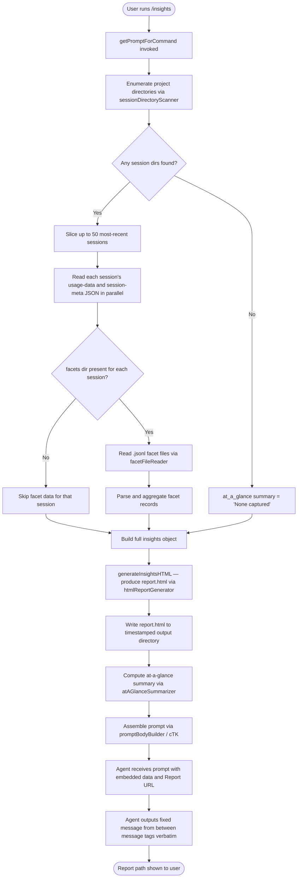

# `/insights`

> Analysis basis: CC v2.1.177 bundle.js (AST extraction + Claude interpretation)
> Minimum version: v2.1.177

---

## Overview

The `/insights` command generates a comprehensive HTML usage-analytics report by scanning the user's Claude Code session history, aggregating facet data across all projects, and then instructing the agent to present a fixed confirmation message along with a path to the shareable report file. It operates as a `prompt`-type command whose handler (`getPromptForCommand`) collects, processes, and embeds the report data directly into the prompt before the agent ever replies.

---

## Registration

| Field | Value |
|---|---|
| type | `prompt` |
| name | `insights` |
| description | `Generate a report analyzing your Claude Code sessions` |
| loc_byte | `13510774` |
| loc_byte_end | `13512078` |
| loc_line | `10699` |
| handler_method | `getPromptForCommand` |
| handler_method_start | `13510948` |
| handler_method_end | `13512077` |
| prompt_body.length | `513` |
| prompt_body.trace | `call→cTK(...) (1 literals)` |
| arbor_handler.name | `getPromptForCommand` |
| arbor_handler.fqn | `claude-2.1.177::getPromptForCommand` |
| arbor_handler.kind | `Method` |
| arbor_handler.resolution_path | `direct` |
| arbor_handler.n_hits | `1` |

Analysis basis: CC v2.1.177 bundle.js:+13510774

---

## Input Branching

The command has 3+ distinct branching paths across session enumeration, facet file scanning, HTML report generation, and the final prompt assembly. A Mermaid flowchart is used.



---

## Behavioral Spec

### 1. Session Directory Enumeration (`sessionDirectoryScanner` / `Jf5`)

```
function sessionDirectoryScanner(baseDir):
    entries = readdir(baseDir)                     // yC.readdir
    dirs = entries.filter(e => e.isDirectory())    // K.isDirectory
    // Batches: 10 dirs per tick, 9 ms delay between batches
    // yielding to event-loop via setImmediate
    for batch in chunks(dirs, batchSize=10):
        for dir in batch:
            path = join(baseDir, dir.name)
            files = facetFileReader(path)
        yield setImmediate()                       // bundle.js:+13497618
    return dirs.sort(...)                          // q.sort bundle.js:+13497642
```

The scanner reads the `projects` sub-directory of the Claude data root (literal `"projects"`, bundle.js:+5126564). It processes directories in batches of 10 (bundle.js:+13497588) with a 9 ms inter-batch delay (bundle.js:+13497593), preventing event-loop starvation.

Analysis basis: CC v2.1.177 bundle.js:+13497319

### 2. Facet File Reading (`facetFileReader` / `aL6`)

```
function facetFileReader(sessionDir):
    entries = readdir(sessionDir)                   // iK.readdir
    files = entries.filter(e => e.isFile() && e.name.endsWith(".jsonl"))
    results = []
    for file in files:
        fullPath = join(sessionDir, file.name)
        stat = stat(fullPath)                       // iK.stat
        record = buildFacetRecord(file, stat)       // _.set
        results.push(record)
    await Promise.all(results.map(r => loadFacetRecord(r)))
    return results
```

Files are identified by the `.jsonl` extension (literal `".jsonl"`, bundle.js:+13588210). The `facets` sub-path (literal `"facets"`, bundle.js:+13436649) under each project directory is where facet data resides.

Analysis basis: CC v2.1.177 bundle.js:+13588104

### 3. Session Data Loading (`sessionDataLoader` / `qf5`)

```
function sessionDataLoader(sessionDir):
    usageDataPath = join(sessionDir, "usage-data")   // literal bundle.js:+13436599
    sessionMetaPath = join(sessionDir, "session-meta") // literal bundle.js:+13436695
    raw = readFile(usageDataPath, "utf-8")            // yC.readFile, bundle.js:+13442706
    parsed = JSON.parse(raw)                          // c6 → JSON.parse
    return parsed
```

Data is stored under two sub-paths: `"usage-data"` (bundle.js:+13436599) and `"session-meta"` (bundle.js:+13436695). Files are read as UTF-8 (literal `"utf-8"`, bundle.js:+13442730).

Analysis basis: CC v2.1.177 bundle.js:+13442663

### 4. Insights Data Aggregation (`insightsDataAggregator` / `dTK`)

```
function insightsDataAggregator(options):
    sessions = sessionDirectoryScanner(dataDir)
    recentSessions = sessions.slice(0, 50)           // A.slice, bundle.js:+13497784
    sessionData = await Promise.all(
        recentSessions.map(s => sessionDataLoader(s)) // bundle.js:+13497807
    )
    // Accumulate tool usage, response time buckets, error counts, etc.
    // Track per-session metrics: type "user"/"assistant", tool calls,
    // command args, timestamps
    facetData = facetStateBuilder(recentSessions)    // xd8, bundle.js:+13498314
    htmlReport = htmlReportGenerator(...)            // Df5, bundle.js:+13499690
    // Write report.html to timestamped directory
    timestamp = formatTimestamp(new Date())           // R.getFullYear/Month/Date/Hours/Minutes/Seconds
    outputDir = join(dataDir, timestamp)
    mkdir(outputDir)                                  // yC.mkdir, bundle.js:+13499709
    writeFile(join(outputDir, "report.html"), htmlReport) // bundle.js:+13499996
    atAGlance = atAGlanceSummarizer(sessionData)
    return { outputDir, atAGlance, htmlReport }
```

Up to **50** sessions are processed (literal `50`, bundle.js:+13497730). The aggregator collects tool-use events, distinguishing standard tools from MCP tools (prefix `"mcp__"`, bundle.js:+13437271), and tracks high-signal tools including `"WebSearch"` (bundle.js:+13437292), `"WebFetch"` (bundle.js:+13437316), `"Edit"` (bundle.js:+13437423), and `"Write"` (bundle.js:+13437435). Session events are classified by message role: `"user"` (bundle.js:+13498034), `"assistant"` (bundle.js:+13527766), and `"system"` (bundle.js:+13527811).

Analysis basis: CC v2.1.177 bundle.js:+13497711

### 5. HTML Report Generation (`htmlReportGenerator` / `Df5`)

```
function htmlReportGenerator(insightsData):
    // Sanitize text values with HTML entity escaping:
    // & → &amp;, < → &lt;, > → &gt;, " → &quot;, ' → &apos;
    sections = []

    // Tool usage section
    toolUsageHtml = renderToolUsageSection(insightsData.toolUsage)
    // If empty: '<p class="empty">No data</p>'  (bundle.js:+13453372)

    // Response time histogram bucketed into bands:
    // "2-10s", "10-30s", "30s-1m", "1-2m", "2-5m", "5-15m", ">15m"
    // (bundle.js:+13453881..13453941)
    // If empty: '<p class="empty">No response time data</p>' (bundle.js:+13453829)

    // Time-of-day breakdown into four periods:
    // "Morning (6-12)"   hours 7,11
    // "Afternoon (12-18)" hours 13,14,16,17
    // "Evening (18-24)"   hours 18,19,21,22,23
    // "Night (0-6)"       hours 0..4
    // (bundle.js:+13454729..13454882)
    // If empty: '<p class="empty">No time data</p>' (bundle.js:+13454679)

    // Tool error section
    // If empty: '<p class="empty">No tool errors</p>' (bundle.js:+13495273)

    // Color palette used:
    // primary: "#2563eb"  (bundle.js:+13491546)
    // cyan:    "#0891b2"  (bundle.js:+13491684)
    // green:   "#10b981"  (bundle.js:+13491856)
    // purple:  "#8b5cf6"  (bundle.js:+13491999)
    // red:     "#dc2626"  (bundle.js:+13495262)
    // lime:    "#16a34a"  (bundle.js:+13495511)
    // yellow:  "#eab308"  (bundle.js:+13496004)

    // Report output filename: "report.html" (bundle.js:+13499968)
    return assembledHtmlString
```

The HTML report is bounded by a maximum section size of **8192** characters per section (literal `8192`, bundle.js:+13453050). The report includes an "Add to CLAUDE.md" suggestion element (literal, bundle.js:+13459225). Markdown bold syntax (`**text**`) is converted to `<strong>$1</strong>` (bundle.js:+13455587), and list markers to `• ` (bundle.js:+13455630).

Analysis basis: CC v2.1.177 bundle.js:+13455515

### 6. Facet State Builder (`facetStateBuilder` / `xd8`)

```
function facetStateBuilder(sessions):
    // Iterates sessions, checks for known facet keys via facetRegistryLookup (ZKH)
    // Known facet types (string keys from literals):
    //   "summary", "last-prompt", "custom-title", "ai-title", "tag"
    //   "agent-name", "agent-color", "agent-setting", "mode"
    //   "permission-mode", "isolation-latch", "worktree-state"
    //   "pr-link", "file-history-snapshot", "attribution-snapshot"
    //   "content-replacement", "fork-context-ref"
    //   "marble-origami-commit", "marble-origami-snapshot", "marble-origami-reset"
    //   "bridge-session"
    // Uses sessionChainSorter (Q$H) to build per-session message chains
    // Uses facetPatternMatcher (pEK) to accumulate per-type facet stats
    return facetMap
```

The facet state builder tracks at least 20 distinct facet key types found as string literals throughout the call graph (bundle.js:+13574928 through +13576579). It applies chain-sorting with cycle detection (telemetry event `tengu_transcript_parent_cycle`, bundle.js:+13577502) and phantom-parent detection (telemetry event `tengu_transcript_phantom_parent`, bundle.js:+13573710).

Analysis basis: CC v2.1.177 bundle.js:+13588854

### 7. Prompt Body Assembly (`promptBodyBuilder` / `cTK` + `__handler_insights`)

```
function getPromptForCommand(context):
    // Run insights data aggregation
    result = await insightsDataAggregator(context)   // dTK, bundle.js:+13511047
    roundedStat = Math.round(result.someMetric)      // bundle.js:+13511335
    // Build prompt string via cTK interpolation
    promptText = promptBodyBuilder(                   // cTK, bundle.js:+13511980
        fullInsightsData,
        reportURL,
        htmlFilePath,
        facetsDirectory,
        atAGlanceSummary
    )
    return promptText
```

The assembled prompt (513 characters, bundle.js:+13510948) embeds:
1. The full serialized insights data (via `CH` → `JSON.stringify`, bundle.js:+13511998).
2. The report URL, HTML file path, and facets directory path (via `bd8` path resolver, bundle.js:+13512044).
3. An at-a-glance summary intended only for the agent's context — the user has not yet seen any output at prompt-injection time.
4. A verbatim `<message>` block the agent is instructed to output in its entirety without omission.

The agent's output is entirely determined by the fixed `<message>` template embedded in the prompt. The user-facing message confirms the report is ready, provides the shareable report path, and invites the user to explore sections or act on suggestions.

Analysis basis: CC v2.1.177 bundle.js:+13510948

### 8. Session Timestamp Formatting

```
function formatTimestamp(date):
    year    = String(date.getFullYear()).padStart(4, "0")
    month   = String(date.getMonth() + 1).padStart(2, "0")
    day     = String(date.getDate()).padStart(2, "0")
    hours   = String(date.getHours()).padStart(2, "0")
    minutes = String(date.getMinutes()).padStart(2, "0")
    seconds = String(date.getSeconds()).padStart(2, "0")
    return join(dataDir, `${year}${month}${day}_${hours}${minutes}${seconds}`)
```

The output directory is named with a full `YYYYMMdd_HHmmss` timestamp derived from date component getters (bundle.js:+13499800 through +13499898), ensuring each report run produces a unique directory.

Analysis basis: CC v2.1.177 bundle.js:+13499769

---

## State & Side Effects

| Item | Detail |
|---|---|
| Telemetry | `tengu_transcript_phantom_parent` (bundle.js:+13573710), `tengu_relink_walk_broken` (bundle.js:+13553418), `tengu_transcript_parent_cycle` (bundle.js:+13577502), `tengu_chain_parent_cycle` (bundle.js:+13555191), `tengu_chain_timestamp_fallback` (bundle.js:+13555340), `tengu_chain_parallel_tr_recovered` (bundle.js:+13557206), `tengu_mcp_skills` (bundle.js:+6654069), `tengu_daemon_config_reload` (bundle.js:+16999057), `tengu_daemon_idle_exit` (bundle.js:+17004310), `tengu_daemon_control` (bundle.js:+17020740), `tengu_daemon_yield` (bundle.js:+17003280), `tengu_bg_dispatch_sigkill_escalate` (bundle.js:+16983179), `tengu_bg_dispatch_low_mem` (bundle.js:+16983780), `tengu_bg_spare_enable` (bundle.js:+16984484), `tengu_bg_spare_claim` (bundle.js:+16984612), `tengu_bg_spare_claim_fail` (bundle.js:+16984878), `tengu_bg_retire_pinned_low_mem` (bundle.js:+16987890), `tengu_bg_prewarm_per_sweep` (bundle.js:+16988011) |
| File writes | Creates `report.html` inside a timestamped subdirectory of the Claude data root (bundle.js:+13499996). Also writes per-session JSON files via `Kf5`/`Af5` (bundle.js:+13443328, +13442578). |
| File reads | Reads `.jsonl` facet files (bundle.js:+13588104), `usage-data` and `session-meta` JSON files (bundle.js:+13442706, +13442334), and session transcripts (bundle.js:+13577030). |
| Directory creation | `yC.mkdir` called for output directory (bundle.js:+13499709) and session sub-directories (bundle.js:+13443247, +13442490). |
| Hook registration | <!-- TODO: not found in depth-2 traversal; needs --depth 4 --> |
| appState changes | <!-- TODO: not found in depth-2 traversal; needs --depth 4 --> |
| Sound | <!-- TODO: not found in depth-2 traversal; needs --depth 4 --> |
| Session batch limit | Maximum **50** sessions processed per invocation (bundle.js:+13497730). |
| Batch processing delay | 10 directories per batch, 9 ms inter-batch delay via `setImmediate` (bundle.js:+13497588, +13497593, +13497618). |
| HTML section size cap | 8192 characters per section (bundle.js:+13453050). |
| Report label when no data | `"_No insights generated_"` displayed if aggregation yields nothing (bundle.js:+13511845). |

---

## Version History

| Version | Change |
|---|---|
| v2.1.177 | Initial analysis |

---

## Common Mistakes

1. **Expecting interactive output before the command completes**: `/insights` performs substantial async I/O (directory scans, file reads, HTML generation) inside `getPromptForCommand` *before* the agent responds. The user will see no output until all processing finishes.
2. **Assuming the agent can vary its response**: The prompt instructs the agent to output the `<message>` block verbatim in its entirety. The agent has no discretion over the confirmation message content.
3. **Looking for the report in the current working directory**: The HTML report is written to a timestamped subdirectory inside the Claude data root (not the project directory). The exact path is injected into the prompt and shown in the agent's response.
4. **Running `/insights` in a project with no session history**: If no `.jsonl` facet files or session directories are found, the at-a-glance summary will be `"None captured"` (bundle.js:+13450242) and the report will contain empty-state placeholders (`<p class="empty">No data</p>`, etc.).
5. **Misinterpreting the at-a-glance summary as user output**: The summary embedded in the prompt is described as "for your context only — the user has not seen any output yet." It is internal agent context, not echoed directly to the user.
6. **Expecting telemetry events specific to `/insights`**: The telemetry events reachable from this command are primarily daemon/background-worker lifecycle events inherited from the deep call graph, not insights-specific events.

---

## Appendix — Identifier Mapping

> For bundle debugging only. Identifiers change across versions.

| Identifier | Role |
|---|---|
| `__handler_insights` | Synthetic BFS entry point for the `/insights` command handler |
| `dTK` | `insightsDataAggregator` — top-level coordinator that enumerates sessions, reads data, builds the HTML report, and returns aggregated results |
| `Jf5` | `sessionDirectoryScanner` — reads and batches project subdirectories |
| `ci` | `projectsPathBuilder` — constructs the `projects` base path |
| `aL6` | `facetFileReader` — reads `.jsonl` facet files from a session directory |
| `BN` | `jsonlExtensionTester` — tests filenames for the `.jsonl` extension |
| `qf5` | `sessionDataLoader` — loads `usage-data` / `session-meta` JSON for one session |
| `cXA` | `sessionMetaPathResolver` — resolves `session-meta` path |
| `mB6` | `usageDataPathResolver` — resolves `usage-data` path |
| `FTK` | `usageDataParser` — parses raw usage-data content |
| `c6` | `safeJsonParse` — wraps `JSON.parse` |
| `xd8` | `facetStateBuilder` — aggregates per-session facet state across all known facet key types |
| `ZKH` | `facetRegistryLookup` — central Map-based facet type registry |
| `Q$H` | `sessionChainSorter` — builds and sorts per-session message chains |
| `af5` | `chainNaNGuard` — guards chain index calculations against NaN |
| `sf5` | `chainTimestampSorter` — sorts chain entries by timestamp with tie-breaking |
| `rf5` | `chainShiftProcessor` — shifts chain entries into sorted order |
| `pEK` | `facetPatternMatcher` — matches and accumulates facet stats per type |
| `tq6` | `facetMapTransformer` — maps facet records to output shape |
| `PPA` | `compactSummaryStripper` — removes compact-summary markers from message content |
| `OU6` | `messageContentExtractor` — extracts text from various message content shapes |
| `GPA` | `attachmentTypeFilter` — filters out image/document attachment types |
| `tf5` | `imageAttachmentTester` — tests for image attachment type |
| `ef5` | `documentAttachmentTester` — tests for document attachment type |
| `rd8` | `chainParentIndexer` — indexes messages by parent UUID |
| `od8` | `chainValueExtractor` — extracts values from chain Map |
| `nXA` | `sessionEventNormalizer` — normalizes raw session events into typed records |
| `BTK` | `rawEventParser` — parses raw event arrays, classifying tool-use, edits, commits, etc. |
| `oK5` | `nanSessionIndexGuard` — guards session-index lookups against NaN |
| `uB6` | `toolNameNormalizer` — normalizes tool names (strips `mcp__` prefix, etc.) |
| `rK5` | `fileExtensionExtractor` — extracts file extension from tool call arguments |
| `m2H` | `diffSizeCalculator` — computes diff size for Edit/Write tool calls |
| `b4` | `toolCategoryLookup` — maps tool names to display categories |
| `z$` | `sessionSummaryFormatter` — formats per-session summary text |
| `lXA` | `sessionSliceHelper` — slices session arrays for bounded processing |
| `Kf5` | `sessionJsonWriter` — writes processed session JSON to disk |
| `Af5` | `sessionDataPersister` — persists aggregated session data |
| `_f5` | `sessionFileLoader` — reads and parses an existing session JSON file |
| `bd8` | `dataSubpathBuilder` — constructs `usage-data` subpath |
| `lTK` | `sessionMigrator` — migrates session data from legacy format |
| `ff5` | `insightsReportOrchestrator` — orchestrates report generation across all sessions |
| `Hf5` | `sessionBatchProcessor` — processes sessions in parallel batches |
| `sK5` | `singleSessionProcessor` — processes one session's messages |
| `Hf6` | `reportSectionBuilder` — builds an individual HTML report section |
| `Qf` | `htmlSectionTemplate` — fills an HTML section template |
| `eu8` | `reportCacheManager` — manages report file caching by content hash |
| `B8` | `reportIdGenerator` — generates a UUID for a report artifact |
| `JBH` | `assistantMessageExtractor` — extracts the first assistant message from a session |
| `hE` | `sectionErrorHandler` — handles per-section generation errors |
| `HT` | `sectionTypeClassifier` — classifies section content type |
| `KZ` | `sectionPostProcessor` — post-processes a completed section |
| `UTK` | `warmupReportGenerator` — generates a minimal warmup report |
| `yD` | `warmupTemplateBuilder` — builds the warmup HTML template |
| `Df` | `messageRoleFilter` — filters messages by role for section rendering |
| `jA` | `errorStringifier` — converts errors to strings |
| `QTK` | `toolUsageAggregator` — aggregates per-tool usage statistics across sessions |
| `oL6` | `toolEntryCounter` — counts tool invocations from Object.entries |
| `G9` | `toolCategoryMapper` — maps tool names to display categories via index/slice |
| `gTK` | `toolStatAccumulator` — accumulates tool stats into sorted Map |
| `Mf5` | `atAGlanceSummarizer` — produces the at-a-glance summary object injected into the prompt |
| `pTK` | `singleSessionSummarizer` — summarizes one session for the at-a-glance block |
| `cK5` | `sessionWarmupDetector` — detects warmup/minimal sessions |
| `Df5` | `htmlReportGenerator` — generates the complete HTML report string |
| `uL` | `htmlEntityEscaper` — escapes `&`, `<`, `>`, `"`, `'` for HTML |
| `VL` | `htmlReplaceAllEscaper` — applies `replaceAll` for each HTML entity |
| `Cd8` | `markdownToHtmlConverter` — converts bold markdown syntax to `<strong>` tags |
| `Yf5` | `jsonStringifyWrapper` — wraps `JSON.stringify` / `CH` for report embedding |
| `VzH` | `toolUsageHtmlRenderer` — renders tool usage section as HTML bars |
| `zf5` | `responseTimeHtmlRenderer` — renders response-time histogram as HTML |
| `wf5` | `timeOfDayHtmlRenderer` — renders time-of-day breakdown as HTML |
| `cTK` | `promptBodyBuilder` — template-literal function that assembles the final 513-char prompt string |
| `CH` | `jsonStringifier` — wraps `JSON.stringify` |
| `kH` | `errorLogger` — logs errors to internal error log |
| `N` | `mimeTypeClassifier` — classifies MIME types for session content |
| `TH` | `errorToString` — converts thrown values to strings via `String()` |
| `M9` | `safeFileCheck` — checks for file accessibility errors (EACCES, EPERM, etc.) |
| `A6` | `booleanStringCoercer` — coerces `"yes"`/`"on"` strings to boolean |
| `Xf5` | `sessionKeyEnumerator` — enumerates keys of a session data object |
| `Mf5` | `atAGlanceSummarizer` — see above |