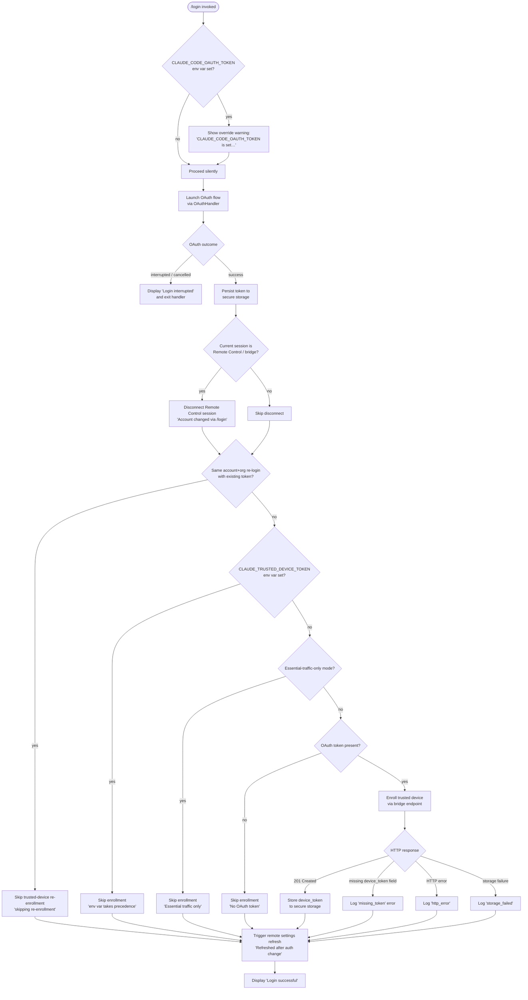

# `/login`

> Analysis basis: CC v2.1.176 bundle.js (AST extraction + Claude interpretation)
> Minimum version: v2.1.176

---

## Overview

`/login` initiates an interactive OAuth sign-in flow that switches the active Anthropic account, persisting the resulting token via secure storage and then refreshing remote settings and policy limits for the newly authenticated identity. It is the primary mechanism for first-time authentication and for switching between Anthropic accounts within an active Claude Code session.

---

## Registration

| Field | Value |
|---|---|
| type | `local-jsx` |
| name | `login` |
| description | `Switch Anthropic accounts \| Sign in with your Anthropic account` |
| module_id | `okq` |
| load_inline | `true` |
| loc_byte | `11926183` |
| loc_byte_end | `11926403` |
| loc_line | `8104` |
| arbor_handler.name | `h1K` |
| arbor_handler.fqn | `claude-2.1.176::h1K` |
| arbor_handler.kind | `Function` |
| arbor_handler.resolution_path | `direct` |
| arbor_handler.n_hits | `2` |

Analysis basis: CC v2.1.176 bundle.js:+11926183

---

## Input Branching

The command exhibits more than three distinct execution branches based on pre-existing credential state, OAuth outcome, and trusted-device enrollment eligibility.



Analysis basis: CC v2.1.176 bundle.js:+9637460, +9637522, +9637612, +9637742, +9637845, +9637857, +9638154, +9638585, +9638604

---

## Behavioral Spec

### Top-level handler (hYL / RTH)

The registered JSX component (`hYL`, rendered via `RTH`) orchestrates the full login sequence.

```
function loginCommandHandler(context):
    appState = context.getAppState()

    // 1. Warn if env-var token will shadow the new credential
    if env.CLAUDE_CODE_OAUTH_TOKEN is set:
        display warning message about override

    // 2. Run OAuth sign-in
    result = await runOAuthSignIn()

    if result is interrupted or cancelled:
        display "Login interrupted"
        return

    // 3. Persist token
    await writeCredentialToSecureStorage(result.token)

    // 4. Bridge / Remote Control disconnect on account change
    if isRemoteControlSession(appState):
        log "[bridge:repl] Account changed via /login — disconnecting Remote Control session"
        disconnectRemoteControl()

    // 5. Trusted-device enrollment gate
    if isSameAccountReloginWithExistingToken(appState, result):
        log "[trusted-device] Same account+org re-login with existing token, skipping re-enrollment"
    else:
        await enrollTrustedDeviceIfEligible(result)

    // 6. Post-login state refresh
    context.setAppState(...)
    triggerRemoteSettingsRefresh()   // logs "Remote settings: Refreshed after auth change"
    triggerPolicyLimitsRefresh()     // logs "Policy limits: Refreshed after auth change"

    display "Login successful"
```

Analysis basis: CC v2.1.176 bundle.js:+9637460, +9637522, +9637612, +9637742, +9638154, +9638585, +9638604

---

### Trusted-device enrollment (Ry6 — enrollTrustedDeviceIfEligible)

```
function enrollTrustedDeviceIfEligible(oauthResult):
    // Guard 1: env-var token takes precedence
    if env.CLAUDE_TRUSTED_DEVICE_TOKEN is set:
        log "[trusted-device] CLAUDE_TRUSTED_DEVICE_TOKEN env var is set, skipping enrollment"
        return

    // Guard 2: essential-traffic-only mode
    if isPolicyAllowed("essential-traffic"):
        log "[trusted-device] Essential traffic only, skipping enrollment"
        return

    // Guard 3: OAuth token must exist
    if oauthResult.token is absent:
        log "[trusted-device] No OAuth token, skipping enrollment"
        return

    // Attempt enrollment
    response = await httpPost(
        url      = buildEnrollmentUrl(Y1q.hostname),
        headers  = { "Content-Type": "application/json" },
        timeout  = 10000,    // ms
        retryMs  = 500       // ms
    )

    telemetry.emit("bridge_trusted_device_enroll", { status: ... })

    if response.status == 201:
        if response.body.device_token is absent:
            log "[trusted-device] Enrollment response missing device_token field"
            telemetry.tag("missing_token")
            return
        await writeDeviceTokenToSecureStorage(response.body.device_token)
    else if response is HTTP error:
        telemetry.tag("http_error")
    else if storage write fails:
        telemetry.tag("storage_failed")
```

Analysis basis: CC v2.1.176 bundle.js:+7423784, +7424098, +7424211, +7424312, +7424505, +7424531, +7424693, +7424812, +7424890, +7424991, +7425152, +7425199

---

### OAuth URL selection (F1 — buildOAuthEndpointUrl)

```
function buildOAuthEndpointUrl(environment):
    if environment == "prod":
        baseUrl = default Anthropic OAuth endpoint
    else if environment == "staging":
        baseUrl = "http://localhost:8205"
    else if environment == "local":
        baseUrl = one of http://localhost:8000 / 4000 / 3000
    
    if env.CLAUDE_CODE_CUSTOM_OAUTH_URL is set:
        if customUrl not in approvedEndpoints:
            throw Error("CLAUDE_CODE_CUSTOM_OAUTH_URL is not an approved endpoint.")
        baseUrl = customUrl
        suffix  = "-custom-oauth"
    
    clientId = "22422756-60c9-4084-8eb7-27705fd5cf9a"   // (bundle.js:+858270)
    return assembleOAuthUrl(baseUrl, clientId, suffix)
```

HTTP endpoint path template: `/v1/toolbox/shttp/mcp/{server_id}` (bundle.js:+858395)

Analysis basis: CC v2.1.176 bundle.js:+857322, +857596, +857683, +857773, +858270, +858327, +858356, +858395, +858476, +858501, +858655, +858661, +859177

---

### Secure storage credential write (aI1 — writeCredentialToSecureStorage)

```
function writeCredentialToSecureStorage(credential):
    try:
        result = await primarySecureStore.write(credential)
        telemetry.tag("secure_storage_credentials_write")

        if result == PRIMARY_TRANSIENT_SKIP_FALLBACK:
            telemetry.tag("primary_transient_skip_fallback")
            return

    catch storageError:
        // fall through to plaintext fallback
        telemetry.tag("plaintext_fallback_used")
        try:
            await fallbackStore.write(credential)
        catch fallbackError:
            telemetry.tag("primary_and_fallback_failed")
            throw
```

Analysis basis: CC v2.1.176 bundle.js:+2317400, +2317498, +2317647, +2317750

---

### Remote settings refresh after login (KA6 / kB7)

```
function triggerRemoteSettingsRefreshAfterAuthChange():
    log "Remote settings: Refreshed after auth change"
    currentSettings = loadRemoteSettingsWithCache()

    if settingsChanged(currentSettings, cachedSettings):
        log "Remote settings: Changed during background poll"
        applyRemoteSettings(currentSettings)
    else:
        // cache still valid — no-op
```

HTTP status codes handled by the remote-settings fetcher:

| Code | Handling |
|---|---|
| 200 | Parse and apply new settings |
| 204 | No content — treat as empty |
| 304 | Use cached settings ("Cache still valid (304 Not Modified)") |
| 401 | Emit `tengu_remote_settings_401_force_refresh_retry`, force token refresh |
| 404 | Save empty sentinel ("Saved empty sentinel (404 response)") |

Analysis basis: CC v2.1.176 bundle.js:+7467990, +7468372, +7464236, +7464245, +7464254, +7464263, +7464296, +7465378, +7465447

---

### Policy limits refresh after login (Ny6 / z1q)

```
function triggerPolicyLimitsRefreshAfterAuthChange():
    log "Policy limits: Refreshed after auth change"
    telemetry.emit("policy_limits_load", { status: ... })

    response = await fetchPolicyLimits(authToken)

    switch response.status:
        case "succeeded":
            applyPolicyRestrictions(response.data)
            log "Policy limits: Applied new restrictions successfully"
        case "stale_cache_used":
            log "Policy limits: Using stale cache after fetch failure"
        case "304":
            log "Policy limits: Cache still valid (304 Not Modified)"
        case "unexpected_error":
            log "Policy limits: Using stale cache after error"
```

Authentication credential types recognised by the policy-limits loader: `wif`, `oauth`, `api_key` (bundle.js:+7415998, +7416037, +7416054)

Analysis basis: CC v2.1.176 bundle.js:+7420388, +7418278, +7418484, +7418496, +7419005, +7419073, +7419170, +7419389, +7419548, +7419581

---

### API key resolution chain (kO — resolveApiKey)

When a direct OAuth flow is not possible and an API key is used instead, the resolver checks the following sources in order:

1. `ANTHROPIC_API_KEY` environment variable (bundle.js:+3271526)
2. `apiKeyHelper` configuration value (bundle.js:+3271620)
3. `CLAUDE_CODE_API_KEY_FILE_DESCRIPTOR` file descriptor (bundle.js:+2140840)
4. Stored credential via `ANTHROPIC_AUTH_TOKEN` (bundle.js:+3270298)
5. `CLAUDE_CODE_OAUTH_TOKEN` environment variable (bundle.js:+3270387)
6. `CLAUDE_CODE_OAUTH_TOKEN_FILE_DESCRIPTOR` (bundle.js:+3270504)
7. `CCR_OAUTH_TOKEN_FILE` (bundle.js:+3270573)

If none of the above resolves, the process raises: `"ANTHROPIC_API_KEY, ANTHROPIC_AUTH_TOKEN, CLAUDE_CODE_OAUTH_TOKEN, or WIF env vars (ANTHROPIC_FEDERATION_RULE_ID + ANTHROPIC_ORGANIZATION_ID) required"` (bundle.js:+3271995)

Provider type strings: `bedrock`, `foundry`, `anthropicAws`, `mantle`, `vertex`, `firstParty` (bundle.js:+2118121–2118338)

Analysis basis: CC v2.1.176 bundle.js:+3271526, +3271620, +3271659, +3271995

---

## State & Side Effects

| Item | Detail |
|---|---|
| Telemetry | `tengu_remote_settings_401_force_refresh_retry` (bundle.js:+7465447) |
| Telemetry | `tengu_feature_bad` / `tengu_feature_ok` / `tengu_feature_sad` (bundle.js:+1018825, +1018758, +1018906) |
| Telemetry | `tengu_managed_settings_security_dialog_shown` / `_accepted` / `_rejected` (bundle.js:+7461059, +7460743, +7460793) |
| Telemetry | `tengu_policy_limits_fetch` (bundle.js:+7418578) |
| Telemetry | `tengu_policy_limits_cache_write_failed` (bundle.js:+7417981) |
| Telemetry | `tengu_disable_bypass_permissions_mode` (bundle.js:+11202372) |
| Telemetry | `tengu_auto_mode_config` (bundle.js:+11200261) |
| Telemetry | `tengu_daemon_config_reload` (bundle.js:+16997877) |
| Telemetry | `tengu_keybinding_fallback_used` (bundle.js:+4222602) |
| Telemetry | `bridge_trusted_device_enroll` (literal, bundle.js:+7424607) |
| Telemetry | `remote_managed_settings_pull` / `_fetch_failed` / `_security_check` / `_unexpected` (bundle.js:+7466478, +7466509, +7460865, +7467432) |
| Telemetry | `policy_limits_load` / `policy_limits_poll` (bundle.js:+7418278, +7420575) |
| Telemetry | `secure_storage_credentials_write` / `primary_transient_skip_fallback` / `plaintext_fallback_used` / `primary_and_fallback_failed` (bundle.js:+2317400, +2317498, +2317647, +2317750) |
| appState changes | API key updated via `H.onChangeAPIKey` (bundle.js:+9637153); app state read with `H.getAppState` and written with `H.setAppState` (bundle.js:+9637460, +9637612) |
| Secure storage | OAuth token and trusted-device token written to secure storage; plaintext fallback used if primary store fails |
| Remote Control disconnect | Remote Control / bridge session disconnected when account changes (bundle.js:+9637522) |
| Remote settings | Full remote-settings and policy-limits refresh triggered post-login |
| Message operation | `H.applyMessageOp` called with `"update"` operation (bundle.js:+9637172, +9637195) |
| React lifecycle | Command rendered as local-JSX; React hooks `useState`, `useEffect`, `useMemo`, `useCallback`, `useRef`, `useSyncExternalStore`, `useReducer` all active in the component tree |
| Sound / notification | None detected in depth-2 traversal |
| Hook registration | `f.registerHandler` called during component mount (bundle.js:+4179175); `DyA.register` called via `u9` (bundle.js:+65203) |
| Process exit guards | `Y` (exit handler) registers `process.exit` and `z.abort` hooks (bundle.js:+17015879, +17015901, +17015922); "Press … again to exit" sentinel active during login UI (bundle.js:+9639103) |

---

## Version History

| Version | Change |
|---|---|
| v2.1.176 | Initial analysis |

---

## Common Mistakes

1. **CLAUDE_CODE_OAUTH_TOKEN env var left set after `/login`** — The runtime will use the env var token instead of the newly written credential. The command itself emits a warning ("Warning: CLAUDE_CODE_OAUTH_TOKEN is set in your environment…"), but the user must manually unset the variable for the new token to take effect (bundle.js:+9638154).
2. **Using `/login` to switch accounts inside a Remote Control session** — Doing so unconditionally disconnects the Remote Control / bridge session ("Account changed via /login — disconnecting Remote Control session"); reconnection must be initiated manually (bundle.js:+9637524).
3. **Expecting re-enrollment of the trusted device on every login** — If the same account and organization are detected with an existing valid token, re-enrollment is silently skipped (bundle.js:+9637750).
4. **Custom OAuth URL not in the approved-endpoint list** — Setting `CLAUDE_CODE_CUSTOM_OAUTH_URL` to an unapproved value throws an error immediately and prevents the login flow from starting (bundle.js:+858661).
5. **Essential-traffic-only mode blocks trusted-device enrollment** — In restricted network environments where `essential-traffic` policy is enforced, the enrollment HTTP call is never made; the feature remains unavailable until the network policy is relaxed (bundle.js:+7424098).

---

## Appendix — Identifier Mapping

> For bundle debugging only. Identifiers change across versions.

| Identifier | Role |
|---|---|
| `h1K` | Arbor-resolved top-level handler for `/login` (registration entry point) |
| `hYL` | JSX component that composes the full login UI and orchestrates the flow |
| `CTH` | Inner login page component; renders OAuth UI, handles done/interrupt callbacks |
| `RTH` | Core login logic function; manages appState transitions, credential write, Remote Control disconnect, trusted-device enrollment trigger |
| `Ry6` | Trusted-device enrollment function |
| `KA6` | Remote-settings-after-auth-change refresh orchestrator |
| `Ny6` | Policy-limits-after-auth-change refresh orchestrator |
| `kB7` | Background remote-settings poll function |
| `Wr_` | Remote-settings pull and apply function |
| `h9q` | Remote-settings HTTP fetch function |
| `z1q` | Policy-limits HTTP fetch and cache function |
| `kO` | API key / credential resolver |
| `Fj` | Profile-implicit credential builder |
| `U0` | OAuth token credential builder |
| `aI1` | Secure storage credential write function |
| `F1` | OAuth endpoint URL builder |
| `vr` | Session / configuration context loader |
| `xb` | Policy-limits data parser / transformer |
| `N` | Request dispatcher / fetch wrapper |
| `CH` | JSON serialiser helper |
| `G9H` | Exponential back-off delay calculator |
| `n8` | Retrying async executor |
| `pT8` | Settings notification / change propagation helper |
| `kH` | Settings write queue manager |
| `QAH` | Session teardown / cleanup function |
| `rf` | Settings persistence writer |
| `sw` | Settings read/write helper |
| `xi_` | Login-state initialisation function |
| `x_` | React app-state hook initialiser |
| `k0H` | Permission-mode manager |
| `$6` | Permission-mode setter |
| `mf` | File-based state reader |
| `Mx` | Session context combiner |
| `_b6` | Daemon/session configuration loader |
| `Ab6` | Full session initialisation function |
| `sf` | Permission-mode-changed event emitter |
| `S46` | Auto-mode configuration gater |
| `Em` | Auto-mode availability resolver |
| `w` | Daemon supervisor / watchdog |
| `nZH` | File stat / read helper |
| `J6H` | Session metadata collector |
| `LJH` | Model allowlist / policy loader |
| `g1` | Model-name parser and normaliser |
| `j1` | Model-string classifier |
| `yO` | Model-tier resolver |
| `AI1` | Available-models enforcer |
| `NK` | Model policy check function |
| `jT` | Model-specification parser |
| `jJ_` | Model alias expander |
| `Xq8` | Full model-selection resolver |
| `Sb` | Model-selection validation wrapper |
| `vh8` | Model UI state hook |
| `FY` | Model display-name formatter |
| `_J` | Main app store subscriber hook |
| `D6` | App-state context accessor |
| `P$H` | App-state reducer hook |
| `bn` | External store subscription helper |
| `ZK9` | State change notification scheduler |
| `rz` | Derived state selector |
| `BR_` | Top-level interrupt/key-binding handler component |
| `tX9` | Key-binding registration component |
| `qx` | Keyboard shortcut hook |
| `af` | Input context ref hook |
| `I3` | Interrupt UI component |
| `C_` | Global handler registration component |
| `BD` | UI context accessor |
| `FD` | Permission-context accessor |
| `Y` | Forced-exit action handler |
| `lgH` | Timestamp generator (wraps `Date.now`) |
| `A6` | String-coercion utility |
| `p18` | Nested-path string builder |
| `Kz` | Cache-clear helper (clears `Ac6` and `ra8`) |
| `AlH` | Settings-cache invalidation wrapper |
| `W7H` | Settings-change broadcaster |
| `dgf` | Deep diff / change detection utility |
| `Q1q` | Settings-hash computation (SHA-256) |
| `ti_` | Recursive structure serialiser |
| `yB7` | Remote-settings fetch orchestrator with retry |
| `NB7` | Remote-settings base-URL builder |
| `DDH` | Diagnostic / warning logger |
| `T9q` | Remote-settings security dialog flow |
| `GB7` | Security dialog request queue manager |
| `Vg` | File-write permission check |
| `Ak` | Settings security approval recorder |
| `E9q` | User-rejection handler for remote settings |
| `Sf` | Settings rejection outcome router |
| `N9q` | Remote-settings cache file writer |
| `pt6` | Settings file path builder |
| `I9q` | Remote-settings request canceller |
| `k9q` | Remote-settings polling scheduler |
| `fT8` | Interval-based poller (setInterval / clearInterval) |
| `vi_` | Policy-limits poller initialiser |
| `yLH` | Policy-limits token-type classifier |
| `OT8` | Policy-limits load dispatcher |
| `wT8` | Policy-limits polling orchestrator |
| `w1q` | Policy-limits poll cycle function |
| `aU7` | Policy-limits poll with refresh-trigger |
| `HP6` | Policy-limits cache file reader |
| `$1q` | Policy-limits cache staleness checker |
| `eX6` | Cache freshness comparator |
| `cU7` | Policy-limits response hasher |
| `lU7` | Policy-limits application function |
| `nU7` | Policy-limits retry scheduler |
| `rU7` | Policy-limits cache file writer |
| `_JH` | Policy file path builder |
| `z1` | Policy-limits module state store |
| `n6` | Policy-limits error logger |
| `bH` | General async error boundary |
| `eH` | Error classification helper |
| `IH` | Async task runner |
| `d` | Promise wrapper / deferred |
| `u9` | Hook / handler registration helper (wraps `DyA.register`) |
| `Rb` | OAuth client builder |
| `Fm` | OAuth flow initiator |
| `em` | OAuth session manager |
| `DN_` | OAuth cleanup / teardown |
| `JaH` | Full session-event listener cleanup |
| `ojH` | Session object reference holder |
| `S1A` | Settings accessor helper |
| `ckq` | Command key binding token |
| `Hb6` | Permission-update handler |
| `RR8` | Permission-update validator |
| `YN_` | bypassPermissions mode guard |
| `Qy6` | Permission operation router |
| `FO` | Permission state mutator |
| `u_` | SDK / subagent configuration extractor |
| `mu8` | Working-directory config reader |
| `pu8` | Allowed-tools config reader |
| `p5A` | Permission-mode policy enforcer |
| `dAH` | Feature-flag loader |
| `H38` | Feature-flag resolver |
| `U5A` | Plan-gated feature check |
| `xOH` | MCP server list mapper |
| `JMH` | Permission-mode event emitter wrapper |
| `sC` | Session-config serialiser |
| `eW6` | Path string sanitiser |
| `Kf` | Model-string normaliser (regex replace) |
| `WN` | Whitespace / separator checker |
| `Yq8` | Model-line parser |
| `L1` | Model inference-profile handler |
| `ikA` | API key redaction helper (produces `"[REDACTED]"`) |
| `bf` | Request logger / redactor |
| `kQH` | Queue head inspector |
| `lff` | File-context attacher |
| `by1` | Token-type base builder |
| `GrH` | Auth-header generator |
| `OUA` | OAuth URL assembler |
| `iTf` | OAuth client-ID formatter |
| `ps6` | Trusted-device request body builder |
| `TH` | String coercion with fallback |
| `S9q` | Settings schema validator |
| `dy6` | Settings type discriminator |
| `erA` | Settings field parser |
| `P7H` | Logger / console output helper |
| `G_H` | Config-layer merger |
| `TvH` | Default-value injector |
| `Lz` | Deep-merge utility |
| `M7` | Nested-key setter |
| `ZT` | Config reader (single key) |
| `O06` | Config writer (single key) |
| `ogH` | VS Code extension environment detector |
| `DJ6` | File-descriptor credential reader |
| `C6` | Settings persistence backend |
| `kb` | API key truncator (20-char slice, bundle.js:+2142508) |
| `hkH` | Settings integrity checker |
| `K06` | Flag-settings resolver |
| `QP` | Config path builder |