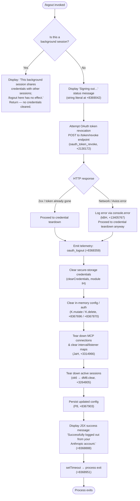

# `/logout`

> Analysis basis: CC v2.1.177 bundle.js (AST extraction + Claude interpretation)
> Minimum version: v2.1.177

---

## Overview

The `/logout` command signs the user out of their Anthropic account by revoking the active OAuth token, clearing all locally cached credentials, tearing down active sessions and MCP connections, and then exiting the CLI process. It is a destructive, one-way operation: after completion the user must re-authenticate before Claude Code can make API calls on their behalf.

---

## Registration

| Field | Value |
|---|---|
| type | `local-jsx` |
| name | `logout` |
| description | Sign out from your Anthropic account |
| loc_byte | `11927387` |
| loc_byte_end | `11927671` |
| loc_line | `8104` |
| module_id | `Ve_` |
| load_inline | `true` |
| arbor_handler.name | `o1L` |
| arbor_handler.fqn | `claude-2.1.177::o1L` |
| arbor_handler.kind | `AsyncFunction` |
| arbor_handler.resolution_path | `module_id` |
| arbor_handler.n_hits | `0` |

Analysis basis: CC v2.1.177 bundle.js:+11927387

---

## Input Branching

The handler contains four or more distinct execution paths depending on session context and the outcome of the token-revocation network call. A Mermaid flowchart is used.



Analysis basis: CC v2.1.177 bundle.js:+8368579 (handler entry `o1L`)

---

## Behavioral Spec

### Top-level handler (`o1L`)

The Arbor-resolved handler is the `AsyncFunction` exported as `o1L` from module `Ve_`. The call graph confirms it drives the entire flow.

```
async function logoutHandler(appContext):
    // Background-session guard
    if appContext.isBackgroundSession:
        render JSX message: "This background session shares credentials ..."
        return   // +8368689

    // Immediate UI feedback
    render "Signing out…"   // +8369042

    // Step 1 — revoke token server-side
    try:
        await revokeOAuthToken()           // HD_, POST with "refresh_token", +2130064
        // telemetry event "oauth_logout"  // +8368359
    catch networkError:
        logErrorToConsole(networkError)    // kBH → console.error, +13405767

    // Step 2 — wipe credentials from secure storage
    clearSecureStorageCredentials()        // IH, +8368356
    // (labels: "secure_storage_credentials_write", "plaintext_fallback_used")

    // Step 3 — clear in-memory auth state
    mutateAppState(removeAuthFields)       // K.mutate, +8367696
    deleteAuthKey()                        // K.delete, +8367870

    // Step 4 — teardown active sessions & connections
    teardownAllSessions()                  // ok6 → dM8.clear, ojH, dAH, +8368436–8368479
    clearProcessListeners()                // JaH → process.off, +3314966
    clearIntervals()                       // XN_ → clearInterval, +3315726
    clearAllRegistryMaps()                 // KXH, tM8, X06, zN_, qg .clear(), +3315092–+3315140

    // Step 5 — persist updated (credential-free) config to disk
    saveGlobalConfig()                     // P8, +8367903

    // Step 6 — final UI and process exit
    render JSX: "Successfully logged out from your Anthropic account."  // +8368888
    setTimeout(() => exitProcess(0), ...)  // +8368951
```

Analysis basis: CC v2.1.177 bundle.js:+8368579

---

### OAuth token revocation sub-routine (`revokeOAuthToken`, `HD_`)

```
async function revokeOAuthToken():
    endpoint = resolveOAuthEndpoint()         // F1, +2130015
    payload  = { grant_type: "refresh_token", token: currentRefreshToken }
    headers  = { "Content-Type": "application/json" }  // +2130119, +2130134
    timeout  = 5000 ms                        // +2130162

    response = await httpClient.post(endpoint, payload, { headers, timeout })

    if httpClient.isAxiosError(response):     // MA.isAxiosError, +2130209
        categoriseNetworkError(response)      // N, +2130254
        // does NOT throw — logout continues regardless
    
    return response                           // caller ignores non-fatal errors
```

Analysis basis: CC v2.1.177 bundle.js:+2130004

---

### Credential storage clear (`clearSecureStorageCredentials`, `IH`)

```
function clearSecureStorageCredentials():
    // Attempts OS keychain removal first
    // Falls back to plaintext config file wipe
    // Emits internal labels:
    //   "secure_storage_credentials_write"  (+2317400)
    //   "primary_transient_skip_fallback"   (+2317498)
    //   "plaintext_fallback_used"           (+2317647)
    //   "primary_and_fallback_failed"       (+2317750)
    writeCredentials(null)   // IH → d / tH path
```

Analysis basis: CC v2.1.177 bundle.js:+8368356

---

### Session teardown (`teardownSessions`, `ok6`)

```
function teardownSessions():
    clearSessionRegistry()           // dM8 → OK9.clear, +3264805
    clearOrphanedConnections()       // ojH, +8368454
    shutdownDaemonComponents()       // dAH, +8368479
        emitShutdownEvent()          // DaH.emit, +3314838
        runVTCleanup()               // VT, +3314853
        flushRemainingLogMessages()  // kH, +3314877
    cleanupTempSocketFiles()         // p9q → qA6.unlink, +7467016
    cleanupLockFiles()               // ki_ → OxH.unlink, +7421342
```

Analysis basis: CC v2.1.177 bundle.js:+8368436

---

### Config persistence (`saveGlobalConfig`, `P8`)

The config is written atomically. A safety guard at `+3332608` prevents wiping `~/.claude.json` if the re-read config is missing auth data that the in-memory cache still holds (referenced in literal: `"saveGlobalConfig fallback: re-read config is missing auth…"`).

```
function saveGlobalConfig():
    acquireConfigLock()         // zXH, +3332457
    currentDisk = readConfig()  // G5H, +3332582
    if diskConfig.hasAuth AND cacheConfig.lacksAuth:
        abort("refusing to write to avoid wiping ~/.claude.json")  // +3332608
    mergeAndWrite(currentDisk, updatedConfig)  // J38, +3332401
    releaseConfigLock()
```

Analysis basis: CC v2.1.177 bundle.js:+8367903

---

### Process exit sequence (`exitSequence`, `Rf` / `k9`)

```
async function exitSequence():
    flushPendingOutput()            // XxH → a3H.writeSync, +7430266
    unmountReactUI()                // XxH → H.unmount, +7430344
    writeExitSummary()              // Qi_, +7430561  (dim text via j6.dim)
    telemetry: "session_end"        // literal +7433081
    drainTelemetryQueue()           // qQH → XyA.drain, +65246
    await Promise.race([
        shutdownAllMcpClients(),    // n1q → Promise.allSettled, +13624226
        AbortSignal.timeout(...)    // +7432969
    ])
    clearTimeout(exitGuard)         // +7432881
    process.exit(0)                 // di_ → process.exit, +7430931
```

Analysis basis: CC v2.1.177 bundle.js:+8368951

---

## State & Side Effects

| Item | Detail |
|---|---|
| Telemetry — `oauth_logout` | Fired immediately after the token-revocation attempt, success or fail (literal `"oauth_logout"`, +8368359) |
| Telemetry — `tengu_feature_ok` | Emitted on successful credential write/clear path (IH → d, +1018758) |
| Telemetry — `tengu_feature_sad` | Emitted on degraded-path credential handling (+1018906) |
| Telemetry — `tengu_feature_bad` | Emitted on credential write failure (+1018825) |
| Telemetry — `tengu_config_lock_contention` | If config lock takes longer than expected (+3335644) |
| Telemetry — `tengu_config_stale_write` | If a stale config write is detected (+3335780) |
| Telemetry — `tengu_config_auth_loss_prevented` | If the safety guard blocks a write that would wipe auth (+3336123) |
| Telemetry — `tengu_config_parse_error` | If config JSON cannot be parsed during the save phase (+3338219) |
| Telemetry — `tengu_cache_eviction_hint` | Emitted at session end (+7433043) |
| Telemetry — `tengu_scroll_summary` | Emitted during exit scroll-position tracking (+7432100) |
| Telemetry — `session_end` | Literal string emitted at process exit (+7433081) |
| Secure storage | OAuth credentials deleted from OS keychain (or plaintext fallback file) |
| `~/.claude.json` | Auth fields removed and file atomically rewritten; protected by lock and safety guard |
| In-memory app state | Auth keys mutated/deleted (`K.mutate`, `K.delete`) |
| Process listeners | All `process.on` / `process.off` handlers removed via `JaH` |
| Interval handles | All registered `setInterval` handles cleared via `XN_` |
| Registry maps | `KXH`, `tM8`, `X06`, `zN_`, `qg` all `.clear()`-ed |
| MCP connections | All MCP client connections shut down before exit |
| Temp / lock files | Unix socket and lock files unlinked (`p9q`, `ki_`) |
| Process lifetime | `process.exit` called after `setTimeout` delay; cannot be cancelled once initiated |
| Background session | **No side effects** — command returns early with an informational message |

---

## Version History

| Version | Change |
|---|---|
| v2.1.177 | Initial analysis |

---

## Common Mistakes

1. **Running `/logout` in a background or sub-agent session** — the command detects background sessions (literal `"This background session shares credentials…"`, +8368689) and exits immediately without touching credentials. You must run `/logout` in the main terminal session.
2. **Expecting the process to remain alive after logout** — the command unconditionally calls `process.exit` after a `setTimeout`. Do not rely on continuing to use the CLI in the same process after issuing `/logout`.
3. **Assuming network failure prevents logout** — the OAuth token-revocation HTTP call (`HD_`, timeout 5000 ms, +2130162) is best-effort. A network error is logged but does not abort the local credential wipe or process exit.
4. **Re-using the same shell session for immediate re-authentication** — because `process.exit` is called, the shell process terminates; a new invocation of Claude Code is required.
5. **Confusing `/logout` with account deletion** — this command only revokes the local OAuth token and clears local credentials; the Anthropic account itself is unaffected.

---

## Appendix — Identifier Mapping

> For bundle debugging only. Identifiers change across versions.

| Identifier | Role |
|---|---|
| `o1L` | Top-level logout handler (`AsyncFunction`, Arbor-resolved) |
| `a1L` | Inner logout helper / JSX render wrapper |
| `d16` | Core logout execution body (credential wipe + session teardown orchestrator) |
| `ok6` | Session teardown coordinator |
| `dAH` | Daemon/component shutdown routine |
| `JaH` | Process-listener and interval cleanup |
| `XN_` | Individual interval clearer |
| `p1` | CLI error handler (calls `kBH` and `process.exit`) |
| `kBH` | Error formatter (console.error + red colour via `j6.red`) |
| `kX` | Config file writer (`U8H.writeFileSync`) |
| `E9` | Context-type resolver (background-session detector) |
| `BjH` | Background-session flag accessor |
| `dM8` | Session registry clear (`OK9.clear`) |
| `ojH` | Orphaned connection cleanup |
| `em` | Shutdown event emitter wrapper |
| `Fm` | Event routing helper |
| `kH` | Log message flusher |
| `jA` | Error construction helper |
| `A6` | String conversion helper |
| `qq` | Traffic-queue drain |
| `hUf` | Queue shift/push helper |
| `p9q` | Temp socket file cleanup |
| `F9q` | Socket path resolver |
| `dy6` | Process count helper |
| `pt6` | Path joiner for socket file |
| `ki_` | Lock file cleanup |
| `yi_` | Lock handle teardown |
| `Si_` | Lock state checker |
| `yLH` | MCP server list filter |
| `_JH` | Lock file path builder |
| `l_` | Provider type resolver (bedrock/vertex/firstParty, +2118081) |
| `pf` | Credential read helper |
| `eI1` | Storage read/write dispatcher |
| `H` | Primary storage backend |
| `_` | Fallback storage backend |
| `hyH` | Async storage read helper |
| `R24` | Storage context resolver (AsyncLocalStorage) |
| `IH` | Secure storage credential writer/clearer |
| `d` | Credential write (success path) |
| `tH` | Credential write (with retry logic, `nM6`) |
| `n6` | Credential write (degraded path) |
| `bH` | Credential write (failure path) |
| `f` | File-based storage backend |
| `L` | Storage record type |
| `A` | Storage record helper |
| `HD_` | OAuth token revocation HTTP caller |
| `F1` | OAuth endpoint URL builder |
| `YUA` | OAuth base URL constant holder |
| `KEf` | OAuth client ID constant |
| `N` | HTTP request helper |
| `tff` | HTTP response status dispatcher |
| `WyA` | Network error category helpers |
| `CH` | JSON stringify wrapper |
| `xf` | URL/header sanitiser (redacts tokens) |
| `akA` | Header map transformer |
| `kQH` | Log-file writer wrapper |
| `BkA` | Raw write helper |
| `A4f` | Log rotation/append manager |
| `AQH` | Log batch flusher |
| `g4H` | Log directory resolver |
| `Q6` | Filesystem existence checker |
| `r$6` | EISDIR error handler |
| `HSA` | Log path joiner |
| `cH_` | Log file rename/unlink helper |
| `_4f` | Log append worker |
| `m9` | Telemetry event registrar (`XyA.register`) |
| `ha` | App-state accessor |
| `_N_` | Config file path + lock manager |
| `EK9` | Config root path resolver |
| `jG1` | Home-directory path builder |
| `oy` | Path normaliser + hash builder |
| `fW` | Config schema validator |
| `WN` | OS user-info reader |
| `TH` | String coercion helper |
| `P8` | Global config save (with lock) |
| `J38` | Config atomic write (with backup rotation) |
| `nI1` | Config merge helper |
| `Z8` | Error code checker |
| `G5H` | Config file read + parse |
| `EaH` | Config serialiser |
| `yN_` | Backup directory path builder |
| `V` | Backup entry sorter |
| `P` | Buffer concat / chunk reader |
| `E` | Slice helper (Math.max/min) |
| `EY6` | Atomic file write (temp + rename) |
| `zXH` | Config lock acquirer |
| `aK9` | Config lock entry enumerator |
| `h06` | Lock timestamp recorder |
| `j38` | Config write worker |
| `rq8` | Config lock releaser |
| `K` | App-state store (mutate/delete) |
| `EvH` | Auth field remover from state |
| `a1L` | Logout JSX component / render wrapper |
| `fRH` | JSX output renderer |
| `ZJ` | Terminal colour helper |
| `tf` | OTEL metrics emitter |
| `KRH` | OTEL attributes builder |
| `uF` | OTEL span creator |
| `I6` | OTEL context helper |
| `kY8` | OTEL attribute validators |
| `KE6` | OTEL attribute value stringifier |
| `L_H` | Attribute allow-list filter |
| `of` | Span writer |
| `S29` | Span ID generators |
| `s36` | Event sequence tracker |
| `ls8` | Metrics batch sender |
| `M` | MCP server manager (emit/update) |
| `LbH` | MCP connection launcher |
| `_o8` | MCP connection result applier |
| `$` | MCP future-connection resolver |
| `yZA` | MCP retry/reconnect supervisor |
| `ns8` | Metrics drain helper |
| `Rf` | Process exit orchestrator |
| `k9` | Full exit sequence runner |
| `XxH` | Terminal output flusher + React unmounter |
| `_R` | Final write helper |
| `sO8` | Terminal write helper (ANSI save/restore cursor) |
| `Qi_` | Exit summary printer |
| `N0` | Summary line formatter |
| `iu` | Summary section builder |
| `Fy6` | Path-existence checker for summary |
| `x$` | Context path printer |
| `u1q` | Token-count formatter |
| `di_` | Hard-exit enforcer (`process.exit` / `process.kill SIGKILL`) |
| `qQH` | Telemetry drain caller (`XyA.drain`) |
| `w` | MCP supervisor stop/start |
| `nZH` | File stat checker (for MCP reconnect) |
| `j0K` | MCP connection slot diff calculator |
| `T` | MCP server lifecycle manager |
| `N6f` | Heartbeat scheduler |
| `n1q` | Parallel MCP shutdown (`Promise.allSettled`) |
| `wO6` | Startup profiling reporter |
| `A6_` | Profiling data writer |
| `jSA` | Profiling JSON serialiser |
| `ZT8` | Scroll-summary telemetry builder |
| `x1q` | Scroll position reader |
| `b1q` | Scroll metric calculator |
| `I1` | Terminal environment detector (fullscreen/tmux/SSH) |
| `W36` | Window-size helper |
| `K6` | Node module loader |
| `nM6` | Native module bootstrap |
| `WxH` | Pending-render flusher |
| `TT8` | Render queue drain helper |