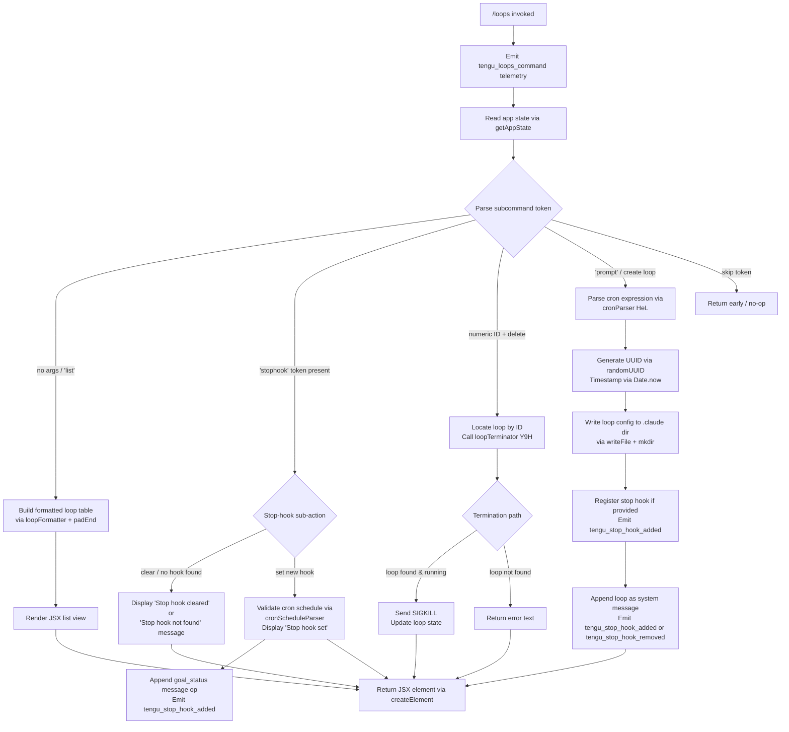

# `/loops`

> Analysis basis: CC v2.1.177 bundle.js (AST extraction + Claude interpretation)
> Minimum version: v2.1.177

---

## Overview

The `/loops` command provides a management interface for background loop sessions — recurring scheduled tasks that Claude Code can execute autonomously. It supports three primary operations: listing all active and scheduled loops, creating a new loop with an optional stop hook (a cron-schedule trigger or prompt that fires when the loop completes), and deleting an existing loop by its numeric ID. The command is rendered as a local JSX component and executes immediately upon invocation.

---

## Registration

| Field | Value |
|---|---|
| type | `local-jsx` |
| name | `loops` |
| description | `List, create, and delete loops` |
| immediate | `true` |
| module_id | `MYK` |
| load_inline | `true` |
| loc_byte | `12829057` |
| loc_byte_end | `12829214` |
| loc_line | `9030` |
| arbor_handler.name | `_eL` |
| arbor_handler.fqn | `claude-2.1.177::_eL` |
| arbor_handler.kind | `AsyncFunction` |
| arbor_handler.resolution_path | `module_id` |
| arbor_handler.n_hits | `0` |

Analysis basis: CC v2.1.177 bundle.js:+12829057

---

## Input Branching

The handler processes several distinct cases based on the subcommand token found in the input argument string. The call graph shows separate paths for list (default/no-arg), stop-hook operations, loop creation, loop deletion, and UI rendering — totalling more than three distinct branches.



---

## Behavioral Spec

### Handler Entry Point — `loopsCommandHandler` (`_eL`)

The Arbor-resolved handler `_eL` is an `AsyncFunction` that acts as the primary dispatch hub for `/loops`. It is reached via `module_id` resolution through module `MYK`.

```
async function loopsCommandHandler(context):
    emit telemetry("tengu_loops_command")          // bundle.js:+12828014
    loadLoopRegistry(context)                      // calls loopRegistryLoader D9H
    buildLoopSummary(context)                      // calls loopSummaryBuilder rf6
    appState = getAppState()                       // bundle.js:+12828064
    renderLoopItems = appState.loops.map(...)      // bundle.js:+12828092

    if input contains "stophook" token:            // bundle.js:+12828196
        result = parseStopHookAction(input)        // calls stopHookParser Hh
        if result.action == "clear":
            display("Stop hook cleared")           // bundle.js:+12828478
        else if result.action == "not_found":
            display("Stop hook not found")         // bundle.js:+12828456
        else:
            display("Stop hook set")               // bundle.js:+12828774

    loopRows = renderLoopItems.map(loopFormatter)  // bundle.js:+12828176
    deleteTarget = parseLoopDelete(input)          // calls loopDeleteParser Y9H  bundle.js:+12828299

    if input indicates "skip":                     // bundle.js:+12828923
        return early

    if input contains "system" marker:             // bundle.js:+12828345
        loopCreationResult = createLoopEntry(...)  // calls loopCreator af6 bundle.js:+12828438

    cronEntry = parseCronInput(input)              // calls cronInputParser HeL bundle.js:+12828564
    newLoopRecord = buildNewLoop(input)            // calls newLoopBuilder SeH bundle.js:+12828662
    deleteOp = deleteLoopEntry(input)              // calls loopDeleter of6 bundle.js:+12828750

    return createElement(JSX, ...)                 // bundle.js:+12828817
```

Analysis basis: CC v2.1.177 bundle.js:+12828012

---

### Sub-feature: Loop Registry Loading — `loopRegistryLoader` (`D9H`)

Reads the on-disk loop registry and normalises it for the handler.

```
function loopRegistryLoader(context):
    rawData = readLoopFile(context)          // calls fileReader bRH  bundle.js:+12828052
    parsedEntries = parseLoopEntries(rawData) // calls entryParser IE   bundle.js:+4888413
    return parsedEntries
```

The inner file reader (`bRH`) reads with encoding `"utf-8"` (bundle.js:+4886416), validates the path via `Q6`, and handles filesystem errors. Error codes checked include `ENOENT`, `EACCES`, `EPERM`, `ENOTDIR`, `ELOOP`, and `EROFS` (bundle.js:+181315–181384).

Analysis basis: CC v2.1.177 bundle.js:+12828052

---

### Sub-feature: Loop Summary Builder — `loopSummaryBuilder` (`rf6`)

Constructs the tabular summary of loops displayed to the user.

```
function loopSummaryBuilder(loops):
    columnWidths = loops.map(computeColumnWidth) // calls columnWidthCalc YTH  bundle.js:+10628041
    columnWidths.set(paddedValues)               // uses padEnd with "  " separator bundle.js:+17008570
    rows = loops.map(formatRow)                  // calls rowMapper hNq  bundle.js:+9306211
    result.push(formattedTable)                  // bundle.js:+10628165
    return result
```

Columns are padded using two-space separators (literal `"  "`, bundle.js:+17008570).

Analysis basis: CC v2.1.177 bundle.js:+10628041

---

### Sub-feature: Stop Hook Parser — `stopHookParser` (`Hh`)

Parses the stop-hook argument embedded in the `/loops stophook` sub-command.

```
function stopHookParser(inputText):
    trimmed = inputText.trim()                    // bundle.js:+4884160
    cronMatch = trimmed.match(cronRegex)          // bundle.js:+4884301
    if cronMatch:
        id = parseInt(cronMatch[1])               // bundle.js:+4884336
        // resolve "Every minute" or "Every hour" human labels
        // bundle.js:+4884280, +4884497
        dayOfWeek = date.getUTCDay() / getDay()  // bundle.js:+4885037, +4885116
        scheduleText = date.toString()            // bundle.js:+4884534
    else if fileMatch:
        matchResult = input.match(filePattern)    // bundle.js:+4884571
    processText = j.toString()                    // bundle.js:+4884705
    return { id, schedule, action }
```

Human-readable schedule aliases: `"Every minute"` (bundle.js:+4884280) and `"Every hour"` (bundle.js:+4884497). Valid day-range string `"1-5"` (bundle.js:+4885204) covers weekdays.

Analysis basis: CC v2.1.177 bundle.js:+4884160

---

### Sub-feature: Cron Input Parser — `cronInputParser` (`HeL`)

Validates and normalises raw cron expressions entered by the user.

```
function cronInputParser(rawInput):
    matched = rawInput.match(cronPattern)         // bundle.js:+12827600
    if not matched:
        return null

    fields = matched.map(parseInt)                // bundle.js:+12827637

    // Clamp and round fields:
    //   seconds: max 59     bundle.js:+12827779
    //   hours:   max 23     bundle.js:+12827850
    //   days:    max 31     bundle.js:+12827903
    normalized = Math.max(0, Math.ceil(...))      // bundle.js:+12827722, +12827733
    rounded    = Math.round(normalized)           // bundle.js:+12827806

    // Delegate interval parsing to intervalParser uI
    interval = parseInterval(rawInput)            // bundle.js:+12827970
    return { cron: normalized, interval }
```

Analysis basis: CC v2.1.177 bundle.js:+12827600

---

### Sub-feature: Interval Parser — `intervalParser` (`uI`)

Parses human-readable interval tokens (e.g. `"every 10 minutes"`) into numeric cron components.

```
function intervalParser(text):
    trimmed = text.trim()                         // bundle.js:+4882989
    parts   = splitScheduleText(text)             // calls scheduleSplitter $M7  bundle.js:+4883075

    // $M7 splits on whitespace, matches numeric tokens,
    // parses with parseInt (radix 10)             bundle.js:+4882474
    // Maximum interval unit: 10                  bundle.js:+4882488
    // Step values use Set to deduplicate          bundle.js:+4882535
    // Day-of-week codes: 3 (Wed), 6 (Sat), 7 (Sun) bundle.js:+4882650,+4882686,+4882692
    // Array.from used for final collection        bundle.js:+4882937
    // Max result entries: 5                       bundle.js:+4883025
    // Padding width: 4 columns                   bundle.js:+4883188

    result.push(parsedInterval)                   // bundle.js:+4883110
    return result
```

Analysis basis: CC v2.1.177 bundle.js:+4882989

---

### Sub-feature: New Loop Builder — `newLoopBuilder` (`SeH`)

Constructs a new loop record and persists it to disk.

```
async function newLoopBuilder(promptText, options):
    id   = randomUUID()                           // bundle.js:+4887716
    ts   = Date.now()                             // bundle.js:+4887778
    meta = buildLoopMeta(options)                 // calls metaBuilder VvH  bundle.js:+4887824
    conf = readLoopConfig()                       // calls configReader bRH  bundle.js:+4887868

    // Write to .claude directory                 bundle.js:+4887557
    mkdir recursive                               // bundle.js:+4887536
    writeFile(path.join(..., id), JSON)           // bundle.js:+4887633

    result.push(newEntry)                         // bundle.js:+4887881
    initialise loop via I6                        // bundle.js:+4887913
    notify via bs                                 // bundle.js:+4887962
    applyConfig via keH                           // bundle.js:+4887975

    return newEntry
```

The new loop directory is created under `".claude"` (bundle.js:+4887557) using `mkdir` with the recursive flag. The ID is a random UUID (bundle.js:+4887716) and creation timestamp uses `Date.now()` (bundle.js:+4887778). Loop metadata is written as JSON. An internal constant `8` (bundle.js:+4887741) is used as a version or schema tag for the stored record.

Analysis basis: CC v2.1.177 bundle.js:+4887716

---

### Sub-feature: Loop Terminator — `loopTerminator` (`Y9H`)

Handles deletion of an existing loop by its numeric identifier.

```
async function loopTerminator(loopId):
    state = readLoopState()                       // calls stateReader b8H  bundle.js:+4888046
    entries = loadRegistry()                      // calls registryLoader bRH  bundle.js:+4888096
    matches = entries.filter(e => e.id == loopId) // bundle.js:+4888105
    seen = matches.filter(e => !seen.has(e.id))   // bundle.js:+4888120

    if match found:
        writeConfig(match)                        // calls configWriter keH  bundle.js:+4888169
        return success
    else:
        return { notFound: true }
```

Analysis basis: CC v2.1.177 bundle.js:+4888046

---

### Sub-feature: Loop Creation via Message Op — `loopCreator` (`af6`)

Appends a new loop entry to the conversation state as a system message.

```
async function loopCreator(context, promptText, options):
    initialise(context)                           // calls initHelper I6  bundle.js:+10628834
    summary = buildSummary(context)               // calls summaryBuilder rf6  bundle.js:+10628841
    currentState = getAppState()                  // bundle.js:+10628845

    newState = { ...currentState, loops: [...currentState.loops, newEntry] }
    setAppState(newState)                         // bundle.js:+10628974

    op = { type: "append", role: "system",        // bundle.js:+10629066, +10629085
           content: promptText }
    applyMessageOp(op)                            // bundle.js:+10629043

    uuid = randomUUID()                           // calls uuidGen mcq  bundle.js:+10629085
    goal = buildGoalEntry(uuid, options)          // calls goalBuilder K6  bundle.js:+10629131
    // goal type literal: "goal"                  bundle.js:+10629134
    // goal_status appended                       bundle.js:+10629263
    // attachment metadata added                  bundle.js:+10629176

    emit telemetry("tengu_stop_hook_added")       // bundle.js:+10628728
    return goal
```

Analysis basis: CC v2.1.177 bundle.js:+10628834

---

### Sub-feature: Loop Deleter — `loopDeleter` (`of6`)

Removes an existing loop entry from app state and message history.

```
async function loopDeleter(context, loopId):
    initialise(context)                           // calls initHelper I6  bundle.js:+10628405
    summary = buildSummary(context)               // calls summaryBuilder rf6  bundle.js:+10628423
    currentState = getAppState()                  // bundle.js:+10628427

    ts = Date.now()                               // bundle.js:+10628591
    tokenStats = computeTokenStats(currentState)  // calls tokenCounter DD  bundle.js:+10628616
    // DD reads outputTokens field                bundle.js:+46396

    newState = { ...currentState,
                 loops: currentState.loops.filter(l => l.id != loopId) }
    setAppState(newState)                         // bundle.js:+10628629

    op = { type: "append", role: "system",
           content: removalNotice }
    applyMessageOp(op)                            // bundle.js:+10628671

    uuid = randomUUID()                           // calls uuidGen mcq  bundle.js:+10628713
    d(context)                                    // bundle.js:+10628726
    goalEntry = buildGoalEntry(uuid, options)     // calls goalBuilder K6  bundle.js:+10628779
    renderNotification(context)                   // calls notificationRenderer IH  bundle.js:+10628792

    emit telemetry("tengu_stop_hook_removed")     // bundle.js:+10629100
    return result
```

Analysis basis: CC v2.1.177 bundle.js:+10628342

---

### Sub-feature: Loop Lifecycle Manager — `loopLifecycleManager` (`D`)

Manages the runtime state machine for a single background loop session (used by both the delete path and the internal daemon).

```
function loopLifecycleManager(loopId):
    entry = loopMap.get(loopId)                   // bundle.js:+16983061
    if entry.state == "closed":                   // bundle.js:+16983041
        return

    // Escalation thresholds:
    //   30 s soft-kill window                    bundle.js:+16983134
    //   15 s hard-kill window                    bundle.js:+16983145
    entry.kill("SIGKILL")                         // bundle.js:+16983227
    emit telemetry("tengu_bg_dispatch_sigkill_escalate")  // bundle.js:+16983179

    memFree = os.freemem()                        // bundle.js:+16983610
    if memFree low:
        emit telemetry("tengu_bg_dispatch_low_mem")  // bundle.js:+16983780

    bh = new BackgroundSession(entry)             // calls backgroundSession bH  bundle.js:+16983492
    ih = new InputHandler(entry)                  // calls inputHandler IH  bundle.js:+16983562

    emit telemetry("tengu_daemon_bg_session_create")  // bundle.js:+16983495
    // dup_retry_exhausted / dropped / dup-live sentinels
    //   bundle.js:+16983522, +16983545, +16983593

    spawnDaemon(entry)                            // bundle.js:+16984941
    emit telemetry("tengu_bg_spare_enable")       // bundle.js:+16984484
    emit telemetry("tengu_bg_spare_claim")        // bundle.js:+16984612
    emit telemetry("tengu_bg_spare_claim_fail")   // bundle.js:+16984878
```

Analysis basis: CC v2.1.177 bundle.js:+16983061

---

### Sub-feature: Scheduled Task Dispatcher — `scheduledTaskDispatcher` (`c`)

Handles firing of recurring loop tasks at their scheduled cron times.

```
function scheduledTaskDispatcher(loopEntry):
    if loopEntry.isLoopDefaultSentinel():         // bundle.js:+16469512
        return

    // Recurring suffix " (recurring)" appended   bundle.js:+16469400
    // "never" sentinel for disabled loops        bundle.js:+16469298
    // 60-second minimum interval enforced        bundle.js:+16469653

    fireTime = Math.floor(Date.now() / 60000)     // bundle.js:+16469621

    emit telemetry("tengu_scheduled_task_fire")   // bundle.js:+16469423
    emit telemetry("tengu_scheduled_task_expired") // bundle.js:+16469766
    emit telemetry("tengu_scheduled_task_missed")  // bundle.js:+16468672

    createNewIteration(loopEntry)                 // calls iterationCreator Y9H  bundle.js:+16469978
    updateLoopState(loopEntry)                    // bundle.js:+16469930, +16469950
```

Analysis basis: CC v2.1.177 bundle.js:+16469423

---

## State & Side Effects

| Item | Detail |
|---|---|
| Telemetry — primary | `tengu_loops_command` (bundle.js:+12828014) — fired on every `/loops` invocation |
| Telemetry — stop hooks | `tengu_stop_hook_added` (+10628728), `tengu_stop_hook_removed` (+10629100) |
| Telemetry — scheduled tasks | `tengu_scheduled_task_fire` (+16469423), `tengu_scheduled_task_expired` (+16469766), `tengu_scheduled_task_missed` (+16468672) |
| Telemetry — daemon lifecycle | `tengu_daemon_bg_session_create` (+16983495), `tengu_daemon_control` (+17020740), `tengu_daemon_config_reload` (+16999057) |
| Telemetry — background dispatch | `tengu_bg_dispatch_sigkill_escalate` (+16983179), `tengu_bg_dispatch_low_mem` (+16983780), `tengu_bg_low_mem_mb` (+13373708) |
| Telemetry — spare session pool | `tengu_bg_spare_enable` (+16984484), `tengu_bg_spare_claim` (+16984612), `tengu_bg_spare_claim_fail` (+16984878), `tengu_bg_sendclaim_failed` (+16961017) |
| Telemetry — background state | `tengu_bg_state_read_transient` (+4262108) |
| Telemetry — feature gating | `tengu_feature_ok` (+1018758), `tengu_feature_bad` (+1018825), `tengu_feature_sad` (+1018906) |
| Telemetry — MCP | `tengu_mcp_skills` (+6654069) |
| appState changes | Loop entries added/removed via `setAppState`; `applyMessageOp` appends system messages of type `"append"` with `"goal"` and `"goal_status"` payloads |
| Filesystem writes | New loop configs written to `.claude/` directory (bundle.js:+4887557) using `mkdir` + `writeFile`; loop state files read with encoding `"utf-8"` |
| Hook registration | Stop hooks registered as cron schedules; `"stophook"` token triggers hook set/clear; hook data persisted in loop config under `.claude/` |
| Process signals | `SIGKILL` sent on forced loop termination (bundle.js:+16983227); `SIGTERM` used for graceful shutdown (bundle.js:+16961255) |
| Sound | <!-- TODO: not found in depth-2 traversal; needs --depth 4 --> |
| MCP side effects | Loop creation path reaches MCP lifecycle manager (`M` / `LbH` / `yZA`) for MCP server state synchronisation |

---

## Version History

| Version | Change |
|---|---|
| v2.1.177 | Initial analysis |

---

## Common Mistakes

1. **Passing a non-numeric loop ID for deletion** — the delete path calls `parseInt` internally; non-numeric strings silently produce `NaN`, which will not match any loop ID and will return a "not found" outcome rather than an error.
2. **Using a cron expression with seconds > 59 or hours > 23** — `cronInputParser` (`HeL`) clamps these values via `Math.max` / `Math.ceil` / `Math.round` rather than rejecting them outright (bundle.js:+12827779, +12827850), so out-of-range values are silently truncated rather than producing a validation error.
3. **Intervals shorter than 60 seconds** — the scheduler enforces a 60-second minimum interval (bundle.js:+16469653); any cron expression resolving to a sub-minute frequency will be ignored at fire time.
4. **Issuing `/loops stophook` without a valid schedule** — the parser checks for a cron regex match; if none is found, the result is treated as a "not found" condition and the hook is not set. Users may confuse this with a successful clear operation.
5. **Assuming immediate loop execution on create** — loops are registered as recurring scheduled tasks and fire on their cron schedule, not immediately. The `"cron"` type literal (bundle.js:+12828110) confirms all loops are schedule-driven.
6. **Expecting loops to survive daemon restart without config** — loop metadata is persisted in `.claude/` (bundle.js:+4887557), but a corrupt or missing config file causes the registry reader (`bRH`) to surface `ENOENT`/`EACCES` errors rather than an empty list.

---

## Appendix — Identifier Mapping

> For bundle debugging only. Identifiers change across versions.

| Identifier | Role |
|---|---|
| `_eL` | Main loops command handler (AsyncFunction, Arbor-resolved) |
| `D9H` | Loop registry loader — reads and normalises on-disk loop entries |
| `bRH` | Low-level file reader for loop config/registry files |
| `bMH` | Path builder — joins loop directory segments |
| `bf` | Filesystem utility helper (used by path builder) |
| `M9` | Generic utility called during file read (delegates to `Z8`) |
| `kH` | Log/error handler — calls `jA`, `A6`, `qq`, `hUf`; logs to `$s` |
| `jA` | Error formatter (wraps Error + String) |
| `A6` | String coercion helper |
| `qq` | Traffic classifier (uses `"essential-traffic"` constant) |
| `hUf` | Ring buffer manager — shift/push on `ys6` |
| `N` | Debug-level message emitter (uses `"debug"` literal) |
| `tff` | Message routing helper — calls `Vy`, `FH_`, `WyA` |
| `CH` | JSON stringifier wrapper |
| `xf` | String redaction utility (uses `"[REDACTED]"` literal) |
| `kQH` | Encoding/key helper (delegates to `BkA`) |
| `A4f` | File write utility with byte-length budget (uses `Buffer.byteLength`) |
| `uI` | Interval text parser — trims and splits schedule text |
| `$M7` | Schedule tokeniser — splits, matches, parseInt, deduplicates via Set |
| `IE` | Loop entry parser (normalises raw registry data) |
| `rf6` | Loop summary / table builder |
| `YTH` | Column-width calculator for loop table |
| `K` | Column map — stores padded column values |
| `hNq` | Row formatter for loop table |
| `I6` | Loop initialiser helper |
| `Hh` | Stop-hook argument parser — cron match, day-of-week, interval |
| `D` | Loop lifecycle manager — SIGKILL escalation, memory checks, session creation |
| `b` | Background loop session factory |
| `w` | Daemon writer / config reloader |
| `bs` | Notification broadcaster (delegates to `zLH`) |
| `keH` | Loop config writer — mkdir + writeFile to `.claude/` |
| `pZ9` | Loop filter helper — filters entries, calls `IeH` |
| `P` | PTY read buffer manager |
| `z` | Daemon stop controller — calls `IH`, `bH`, `gS`, `hB` |
| `S` | Daemon input stream writer |
| `X` | Session timeout manager |
| `l` | Session list mapper — calls `Fm6`, `N_K` |
| `frK` | Loop display formatter — map + Math.max + join |
| `Y9H` | Loop terminator — locates and kills loop by ID |
| `l8` | Promise timeout utility — setTimeout/clearTimeout |
| `O` | OS-level stop helper (delegates to `p8`) |
| `bH` | Background session constructor (uses `d`, `tH`) |
| `tH` | Session type helper (delegates to `nM6`) |
| `IH` | Input handler constructor (uses `d`, `tH`) |
| `Dd8` | macOS memory check helper (uses `t6`, `$6`) |
| `$6` | Platform capability checker — KXH, X06, qg maps |
| `aSH` | Loop state file reader — lstat, rm, readFile, filter |
| `cT6` | Path resolver for loop state (joins + `zZ`) |
| `c6` | JSON parser wrapper |
| `C8` | Checksum/hash helper (delegates to `Z8`) |
| `M97` | Directory scanner — readdir, lstat, filter by isFile/isDirectory |
| `Q` | Loop retire/settle manager — connects/disconnects PTY socket |
| `c` | Scheduled task dispatcher — fires, expires, marks missed tasks |
| `C` | PTY write flusher — clearTimeout + write |
| `B` | Session registry Set |
| `lZ` | IPC framing helper (delegates to `U_K`) |
| `yv` | Binary frame builder — Buffer.allocUnsafe + writeUInt32BE + writeUInt8 |
| `mp8` | Binary frame parser — readUInt32BE + readUInt8 + subarray |
| `EVA` | Session claim + daemon connect handler |
| `k2A` | Daemon workspace initialiser — mkdir + writeFile + JSON.stringify |
| `fI5` | Send-claim timeout handler — 5000 ms timeout (bundle.js:+16961451) |
| `KI5` | Claim frame builder (wraps `ed.buildClaimFrame`) |
| `GL` | Generic log helper (delegates to `Z8`) |
| `TH` | String coercion wrapper |
| `yVA` | Loop deletion orchestrator — rm, kH, Oq, AO, hPH, xL, A76 |
| `Yf` | Path resolver for deletion (joins + `zZ`) |
| `Oq` | Loop state reader — lstat, readFile, JSON parse, cache update |
| `AO` | Active-state setter (uses `"active"` literal) |
| `hPH` | Header/path parser for loop state files |
| `xL` | Loop state serialiser — join + CH + lJ |
| `A76` | Async loop result handler — Date.now + JUL error catch |
| `im6` | IPC socket path builder |
| `QOH` | IPC path helper (joins + `UUH`) |
| `hk` | Daemon socket initialiser — t6 + $$A + join + _76 |
| `Cv` | IPC connector (delegates to `U_K`) |
| `nm6` | Daemon directory path builder (joins + `lm6`) |
| `Y` | Forced-shutdown handler — EX + process.exit + z.abort |
| `j` | Running-session iterator — A.values + S.kill |
| `$` | Loop status reporter (delegates to `FPK`) |
| `FPK` | Status file writer — bs, Date.now, dU6, CH |
| `n9` | AsyncLocalStorage store reader |
| `dU6` | Status file path builder (BPK.join + `$_`) |
| `J` | Date helper for day-of-week computation (delegates to `D`) |
| `af6` | Loop creator via message op — setAppState + applyMessageOp + goal |
| `mcq` | UUID generator (wraps `bcq.randomUUID`) |
| `K6` | Goal entry builder (delegates to `nM6`) |
| `HeL` | Cron expression parser and normaliser |
| `SeH` | New loop record builder — UUID + timestamp + config write |
| `VvH` | Loop metadata builder |
| `M` | MCP server manager — LbH + _o8 + yZA |
| `LbH` | MCP server connection builder |
| `LQ` | MCP transport configuration helper |
| `EZ` | MCP transport resolver |
| `d8` | Generic utility (delegates to `_`) |
| `uN6` | MCP server name normaliser |
| `eo9` | MCP tool executor |
| `aX8` | MCP tool result builder |
| `iX8` | MCP tool input formatter |
| `z8` | MCP debug logger (pushes to `ycH`, calls `$s.logMCPDebug`) |
| `S28` | MCP OAuth flow handler |
| `R28` | MCP OAuth callback handler |
| `$a9` | MCP auth initiator |
| `KQ_` | MCP auth state checker |
| `Yh` | MCP skills tracker (emits `tengu_mcp_skills`) |
| `Qg_` | MCP capability filter |
| `I` | Warning renderer (uses `"warning"`, `"fable-usage-credits"` literals) |
| `q7` | MCP error logger (pushes to `ycH`, calls `$s.logMCPError`) |
| `Ka9` | MCP background connector |
| `J86` | MCP retry-delay parser |
| `SW8` | MCP retry-count parser |
| `_o8` | MCP connection result applier |
| `fbH` | MCP connection state updater |
| `wG` | MCP cleanup orchestrator |
| `yZA` | MCP remote server recovery manager |
| `J28` | MCP server filter (rv7/ag_ Set lookups) |
| `D86` | MCP server state updater |
| `of6` | Loop deleter via message op — setAppState + applyMessageOp |
| `u4A` | Hooks gate and trust gate initialiser |
| `ib` | Policy settings loader (delegates to `R8`) |
| `R8` | Feature flag reader (Pe6 + Tb) |
| `tAH` | Trust gate configurator (R8 + nA) |
| `u_` | Hooks gate helper |
| `dL` | Configuration loader (delegates to `gg4`) |
| `gg4` | Full config builder — A6, tgH, E9, R6, rAH, Pl, u6, xD.resolve |
| `n6` | Notification helper (d + tH) |
| `DD` | Output token counter (FgH + Object.values) |

---

Note: index built via Arbor fallback; some signals (telemetry, literals) may be missing — see arbor-fallback.js.