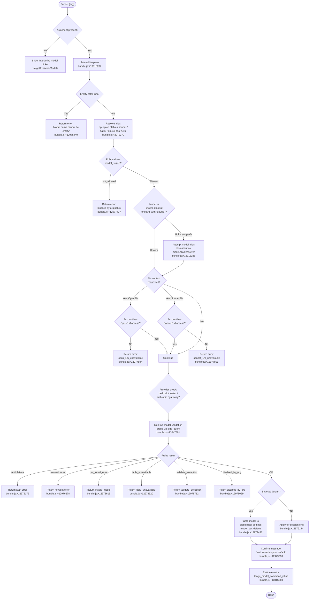

# `/model`

> Analysis basis: CC v2.1.177 bundle.js (AST extraction + Claude interpretation)
> Minimum version: v2.1.177

---

## Overview

The `/model` command lets users change the AI model Claude Code uses for the current session and optionally persist that choice as a new default. When invoked with a model name argument the handler validates the name against a known alias table and the current availability list, probes the API if necessary, then writes the selection into application state and (when the user requests persistence) into the global user settings file.

---

## Registration

| Field | Value |
|---|---|
| type | `local` |
| name | `model` |
| description | `Set the AI model for Claude Code` |
| argumentHint | `<model>` |
| supportsNonInteractive | `true` |
| module_id | `HXK` |
| load_inline | `true` |
| loc_byte | `13047150` |
| loc_byte_end | `13047324` |
| loc_line | `9179` |
| arbor_handler.name | `L85` |
| arbor_handler.fqn | `claude-2.1.177::L85` |
| arbor_handler.kind | `AsyncFunction` |
| arbor_handler.resolution_path | `module_id` |
| arbor_handler.n_hits | `0` |

Analysis basis: CC v2.1.177 bundle.js:+13047150

---

## Input Branching

Five or more distinct runtime paths exist depending on whether the argument is absent, is a recognised short alias, passes live API validation, is blocked by policy, or triggers a 1 M-context upgrade check. A Mermaid flowchart is therefore used.



---

## Behavioral Spec

### 1 — Entry point: `modelCommandHandler` (L85)

The Arbor-resolved handler is `L85` (AsyncFunction, `claude-2.1.177::L85`).

```
async function modelCommandHandler(args, appState):
    rawInput = args.trim()                          // bundle.js:+13016202

    if rawInput is in knownAliasSet:                // bundle.js:+13016218
        emit telemetry "tengu_model_command_inline" // bundle.js:+13016360
        resolvedModel = resolveInlineAlias(rawInput, appState)
        // short-circuit: no live probe for well-known aliases
    else:
        resolvedModel = resolveModelAndValidate(rawInput, appState)
                                                    // bundle.js:+13016285

    if resolvedModel.save:
        persistModelToUserSettings(resolvedModel.name)
    else:
        applyModelForSession(resolvedModel.name, appState)

    return buildConfirmationMessage(resolvedModel)
```

Analysis basis: CC v2.1.177 bundle.js:+13016202

---

### 2 — Alias resolution: `modelAliasResolver` (HQ8)

Maps short human-friendly tokens to canonical model identifiers. Known short aliases found in literals:

| Short alias | Meaning |
|---|---|
| `opusplan` | Opus in plan mode, else Sonnet (bundle.js:+2277727) |
| `fable` | claude-fable-5 family (bundle.js:+2279270) |
| `sonnet` | current Sonnet (bundle.js:+2279374) |
| `haiku` | current Haiku (bundle.js:+2279413) |
| `opus` | current Opus (bundle.js:+2279452) |
| `best` | highest-capability tier (bundle.js:+2279486) |
| `sonnet[1m]` | Sonnet 4.6 with 1 M context (bundle.js:+12979983) |
| `sonnet-4-6[1m]` | Sonnet 4.6 with 1 M context explicit (bundle.js:+12980009) |

The `[1m]` suffix token triggers a separate account-capability check before proceeding (see §5).

```
function modelAliasResolver(token, appState):
    canonical = ALIAS_TABLE[token.toLowerCase()] ?? token
    if canonical.endsWith("[1m]"):
        return { model: stripSuffix(canonical), contextWindow: "1M" }
    return { model: canonical, contextWindow: "default" }
```

Analysis basis: CC v2.1.177 bundle.js:+13016285

---

### 3 — Full model name resolution: `resolveModelFull` (uk → rJ6 / j1)

When the argument is not a short alias the handler delegates to a two-stage pipeline:

```
function resolveModelFull(input):
    // stage 1: strip and lowercase
    normalised = input.trim().toLowerCase()         // bundle.js:+2279193

    // stage 2: walk canonical model list
    //   - exact match
    //   - prefix match against "claude-"           // bundle.js:+2269221
    //   - display-name match (e.g. "Opus 4.8")     // bundle.js:+2278505
    //   - warn on ambiguous match                  // bundle.js:+2269504

    if noMatch:
        return { error: "invalid_model" }           // bundle.js:+12978615
    return { model: canonicalId }
```

The full known canonical model identifier list (from literals):

`claude-fable-5`, `claude-mythos-5`, `claude-opus-4-8`, `claude-opus-4-7`, `claude-opus-4-6`, `claude-opus-4-5`, `claude-opus-4-1`, `claude-opus-4-0`, `claude-sonnet-4-6`, `claude-sonnet-4-5`, `claude-sonnet-4-0`, `claude-haiku-4-5`, `claude-3-7-sonnet`, `claude-3-5-sonnet`, `claude-3-5-haiku`, `claude-3-opus`, `claude-3-sonnet`, `claude-3-haiku`

Analysis basis: CC v2.1.177 bundle.js:+2279193

---

### 4 — Policy gate: `policyModelSwitchCheck` (bH / model_switch)

Before any model change is applied the handler checks the organisation policy key `model_switch`.

```
function policyModelSwitchCheck(appState):
    policy = appState.policySettings["model_switch"]  // bundle.js:+12977422
    if policy == "not_allowed":                       // bundle.js:+12977437
        return { blocked: true }
    return { blocked: false }
```

When blocked the command returns immediately with a human-readable denial. No live API call is made.

Analysis basis: CC v2.1.177 bundle.js:+12977422

---

### 5 — Extended-context (1 M) capability check (eg8 → RU6)

```
function extendedContextCheck(model, contextRequest, appState):
    if contextRequest != "1M":
        return OK

    if model is Opus-variant:
        if not accountHas1MOpusAccess(appState):
            return ERROR "opus_1m_unavailable"        // bundle.js:+12977584
            // message: "Opus with 1M context is not available..."
            //          bundle.js:+12977622

    if model is Sonnet-4-6-variant:
        if not accountHas1MSonnetAccess(appState):
            return ERROR "sonnet_1m_unavailable"      // bundle.js:+12977801
            // message: "Sonnet 4.6 with 1M context is not available..."
            //          bundle.js:+12977841
    return OK
```

Analysis basis: CC v2.1.177 bundle.js:+12977584

---

### 6 — Live model validation probe (RU6 → zU)

For models that are not pre-cached as available the handler sends a lightweight "side query" to the API.

```
async function liveModelValidationProbe(modelId, authContext):
    if modelId is empty:
        return ERROR "Model name cannot be empty"     // bundle.js:+12975440

    payload = {
        role: "user",
        content: "Hi",                               // bundle.js:+12975873
        cacheControl: "ephemeral"                    // bundle.js:+12975898
    }
    queryType = "side_query"                         // bundle.js:+13847881

    response = await apiCall(modelId, payload, timeout=5000) // bundle.js:+8373296

    switch response.errorType:
        case AUTH_FAILURE:
            return ERROR "Authentication failed..."  // bundle.js:+12976176
        case NETWORK_ERROR:
            return ERROR "Network error..."          // bundle.js:+12976278
        case "not_found_error" where message has "model:":
            return ERROR "invalid_model"             // bundle.js:+12978615
        case "fable_unavailable":
            return ERROR "fable_unavailable"         // bundle.js:+12978320
        case "fable_probe_failed":
            return ERROR "fable_probe_failed"        // bundle.js:+12978340
        case "disabled_by_org":
            return ERROR "disabled_by_org"           // bundle.js:+12978069
        case EXCEPTION:
            return ERROR "validate_exception"        // bundle.js:+12978712
        default:
            return OK

    // Result is cached in $JK map to avoid redundant probes  // bundle.js:+12975709
```

The cache map is keyed to avoid re-probing the same model within a session (bundle.js:+12975709 `$JK.has` / bundle.js:+12975917 `$JK.set`).

Analysis basis: CC v2.1.177 bundle.js:+12975403

---

### 7 — Persistence decision: `applyModelSelection` (sDA → CU6 / tDA)

```
function applyModelSelection(modelId, saveAsDefault, appState):
    // Update in-memory application state
    appState.model = modelId                         // bundle.js:+12979503

    if saveAsDefault:
        writeModelToUserSettings(modelId)            // CU6, bundle.js:+12979416
        // emits telemetry "model_set_default"       // bundle.js:+12979456
        confirmSuffix = " and saved as your default for new sessions"
                                                     // bundle.js:+12979098
    else:
        confirmSuffix = " for this session only"     // bundle.js:+12979144

    // Build display line with fast-mode and credits annotations
    if isFastMode(appState):
        append " · Fast mode ON"                     // bundle.js:+12979262
    if drawsFromUsageCredits(modelId):
        append " · Draws from usage credits"         // bundle.js:+12979313
    if not isFastMode(appState):
        append " · Fast mode OFF"                    // bundle.js:+12979359

    // Managed-settings note when org policy controls model
    if managedByOrg(appState):
        display "Managed settings"                   // bundle.js:+12979665

    return confirmationMessage
```

Analysis basis: CC v2.1.177 bundle.js:+12979098

---

### 8 — Available-models list builder (eg8 → NK / Xq8)

When `/model` is invoked without an argument the handler builds an interactive picker by:

1. Fetching the baseline canonical list (bundle.js:+2260534).
2. Applying policy filters (`policySettings` key, bundle.js:+2260941).
3. Resolving per-provider availability: `bedrock` (bundle.js:+2118121), `anthropicAws` (bundle.js:+2118227), `vertex` (bundle.js:+2118329), `gateway` (bundle.js:+2264634).
4. Annotating each entry with status `active` / `inactive` / `refused` (bundle.js:+2268659 / +2268617 / +2268579).
5. Computing a SHA-256 hash (first 12 hex chars, bundle.js:+2529508, +2529550) of the list for cache-invalidation via `UM`.
6. Rendering the picker with padded display names using 1024-character data field width (bundle.js:+16885712) and two-space indent (bundle.js:+17008570).

The `mantle` tier (bundle.js:+2268341) and `firstParty` provider classification (bundle.js:+2277939) influence which entries are shown.

Analysis basis: CC v2.1.177 bundle.js:+2260534

---

## State & Side Effects

| Item | Detail |
|---|---|
| Telemetry | `tengu_model_command_inline` (bundle.js:+13016360) — fired when a short alias is used inline; `tengu_feature_ok` (bundle.js:+1018758) — successful feature path; `tengu_feature_bad` (bundle.js:+1018825) — failed feature path; `tengu_lone_surrogate_sanitized` (bundle.js:+13849209) — string sanitisation during API probe; `tengu_api_success` (bundle.js:+13849460) — live probe returned OK; `tengu_config_auth_loss_prevented` (bundle.js:+3332736) — safety guard prevented writing config that would have lost auth |
| appState changes | `appState.model` updated to the newly selected canonical model identifier (bundle.js:+12979503) |
| Settings write | When user confirms "save as default", the model key is written to the global user settings file (`~/.claude/settings.json`, bundle.js:+1303693) via `writeGlobalConfig` (`$A`); writing is gated by auth-loss prevention (bundle.js:+3332608) |
| Probe cache | Session-scoped map `$JK` caches the live-probe result per model ID to avoid redundant network calls (bundle.js:+12975709) |
| API call | One ephemeral `side_query` HTTP call with `Content-Type: application/json` (bundle.js:+8373195), timeout 5 000 ms (bundle.js:+8373296), sent only for non-cached, non-alias model names |
| Provider routing | `bedrock`, `vertex`, `anthropicAws`, `gateway` paths each follow different auth and endpoint logic (bundle.js:+2118121, +2118227, +2118329, +2264634) |
| Sound | <!-- TODO: not found in depth-2 traversal; needs --depth 4 --> |

---

## Version History

| Version | Change |
|---|---|
| v2.1.177 | Initial analysis |

---

## Common Mistakes

1. **Providing a partial model name without the `claude-` prefix** — the resolver expects either a registered short alias (`opus`, `sonnet`, `haiku`, `fable`, `best`, `opusplan`) or a full canonical identifier that starts with `claude-`. Bare version strings like `opus-4-8` alone are not guaranteed to match without alias expansion.
2. **Expecting 1 M-context models to be universally available** — both `sonnet[1m]` and Opus 1 M variants are gated by per-account capability; the command will return `opus_1m_unavailable` or `sonnet_1m_unavailable` if the account does not have access (bundle.js:+12977584, +12977801).
3. **Assuming the model persists across sessions by default** — without explicitly confirming "save as default" the selection applies for the current session only (bundle.js:+12979144). The default scope message clearly states "for this session only".
4. **Using `/model` in a policy-locked environment** — when the organisation policy sets `model_switch: not_allowed`, the command returns an error immediately and no model change is applied (bundle.js:+12977437).
5. **Specifying a model that has not been released to your account tier** — the live validation probe will return `invalid_model`, `fable_unavailable`, or `disabled_by_org` depending on the specific restriction. Check `https://code.claude.com/docs/en/model-config` for tier eligibility.

---

## Appendix — Identifier Mapping

> For bundle debugging only. Identifiers change across versions.

| Identifier | Role |
|---|---|
| `L85` | Main async handler for `/model` command (`modelCommandHandler`) |
| `H` | Generic string / argument variable; also random-delay helper |
| `_` | AppState accessor / utility namespace |
| `HQ8` | Short-alias resolution dispatcher (`modelAliasResolver`) |
| `uk` | Full model-name resolution entry point |
| `rJ6` | Model name normalisation stage 1 (trim / lowercase) |
| `y3` | Display-name builder helper |
| `j1` | Canonical model ID lookup and matching logic |
| `jT` | Available-models list assembler outer wrapper |
| `JJ_` | Model list entry formatter (status labels) |
| `Xq8` | Per-provider model list filter and deduplication |
| `d` | Configuration / disk I/O utility |
| `UM` | Model-list cache hash generator (SHA-256) |
| `sG` | Crypto hash initialiser helper |
| `nM6` | Node.js `crypto` module reference |
| `zJK` | Post-validation model-apply orchestrator |
| `eg8` | Validation + available-models coordinator |
| `NK` | Canonical model list builder (full pipeline) |
| `ED6` | Base model catalogue loader |
| `ZD6` | Provider-specific model catalogue extender |
| `ff` | String-replace / normalise utility |
| `JyH` | Extended context (xP4) inclusion checker |
| `GN` | Model family / generation classifier |
| `Yq8` | Model alias → canonical expander |
| `AI1` | Object-entries iteration helper for model map |
| `R8` | Settings reader (policySettings path) |
| `tnH` | Object-entries model-metadata iterator |
| `L` | Terminal readline / output stream reference |
| `_I1` | Model index-of helper for picker |
| `uP4` | Model tier / upstream mapper |
| `dJ6` | Display label formatter (lowercase normalise) |
| `mP4` | Model startsWith-based family matcher |
| `bH` | Feature-flag / policy read (model_switch) |
| `tH` | Telemetry emit wrapper |
| `X65` | Provider-specific model filter (first-party check) |
| `cs` | Cloud-provider selector (bedrock / vertex / anthropic) |
| `CJ` | First-party provider classifier |
| `P65` | Secondary provider model filter |
| `kLH` | Alternative cloud-provider selector |
| `xjH` | Model availability status annotator |
| `l_` | Provider context reader (bedrock / anthropicAws / vertex) |
| `L7` | Gateway-provider context reader |
| `dz` | Model string normalisation (includes / replace) |
| `ujH` | Array / model-list membership helper |
| `_1` | Model metadata cross-reference helper |
| `_AH` | Model gateway-availability checker |
| `a_H` | 1 M-context suffix detector and annotator |
| `Jq8` | Model status resolver (active / inactive / refused) |
| `hiH` | Refused-model filter helper |
| `RU6` | Live model validation probe orchestrator |
| `A` | Lower-case string / terminal helper |
| `zU` | API side-query executor (actual HTTP fetch) |
| `j65` | Probe result parser / error classifier |
| `OJK` | Model name pre-screen (lowercase check) |
| `c16` | API bootstrap / model-list fetch from gateway |
| `A9L` | Gateway `/v1/models` bootstrap fetcher |
| `IH` | Feature-telemetry wrapper (ok / bad) |
| `R6` | Global config writer |
| `Zjq` | Config write safety guard |
| `N` | Log / debug message formatter |
| `P8` | Global config save-to-disk handler |
| `pz` | Config persistence helper |
| `kH` | Config write with error logging |
| `TH` | String coercion utility |
| `sDA` | Model-selection result display builder |
| `v4H` | Session model state setter |
| `CU6` | User-settings model persistence writer |
| `$A` | Global settings file writer |
| `Ef` | Output renderer / printer |
| `A6` | String output helper |
| `RjH` | Fast-mode indicator renderer |
| `q3` | Model credits / usage annotation builder |
| `FEH` | Model confirmation message assembler |
| `ZA` | Terminal styled-string constructor |
| `e$` | Model display-name joiner |
| `BY` | Styled bold/colour text helper |
| `tDA` | Managed-settings / org-policy notice renderer |
| `VhH` | Policy settings display formatter |
| `Tm` | Settings path joiner (`.claude/settings.json`) |
| `Hn` | Human-readable model family name renderer |