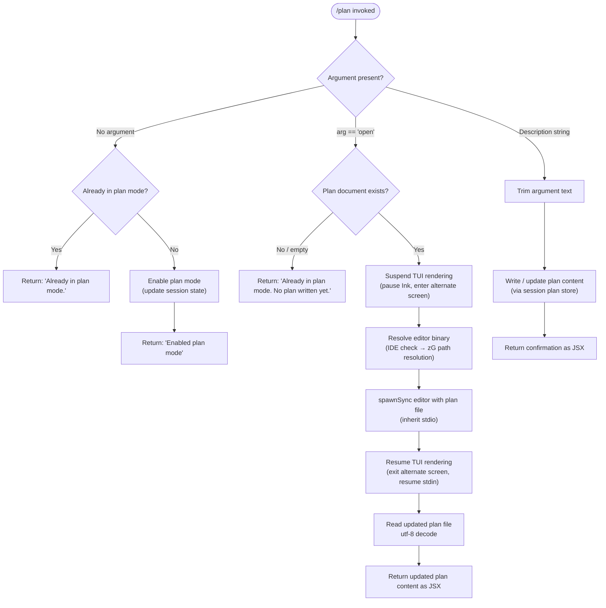

# `/plan`

> Analysis basis: CC v2.1.176 bundle.js (AST extraction + Claude interpretation)
> Minimum version: v2.1.176

---

## Overview

The `/plan` command enables **plan mode** for the current Claude Code session, or opens the existing session plan for viewing/editing in an external editor. When invoked without arguments, it activates plan mode (toggling the session's permission and tool settings accordingly); when invoked with the `open` argument, it launches the current plan document in an external editor; and when invoked with a description string, it sets or updates the session plan text. The command is rendered as a local JSX component and delegates heavily to the session-state, settings, and file-management subsystems.

---

## Registration

| Field | Value |
|---|---|
| type | `local-jsx` |
| name | `plan` |
| description | `Enable plan mode or view the current session plan` |
| argumentHint | `[open\|<description>]` |
| module_id | `ozK` |
| load_inline | `true` |
| loc_byte | `12763878` |
| loc_byte_end | `12764077` |
| loc_line | `8932` |
| arbor_handler.name | `YtL` |
| arbor_handler.fqn | `claude-2.1.176::YtL` |
| arbor_handler.kind | `AsyncFunction` |
| arbor_handler.resolution_path | `module_id` |
| arbor_handler.n_hits | `0` |

Analysis basis: CC v2.1.176 bundle.js:+12763878

---

## Input Branching

The handler has **4+ distinct branches** driven by the argument string and the current session state, so a Mermaid flowchart is used.



Analysis basis: CC v2.1.176 bundle.js:+12763028, +12763258, +12763277, +12763436

---

## Behavioral Spec

### 1. Handler Entry — `planCommandHandler` (`YtL`)

```
async function planCommandHandler(args, context):
    sessionState  = readCurrentSessionState()       // h4H
    permSettings  = resolvePermissionsConfig()      // FO
    toolSettings  = buildToolConfiguration()        // $q6
    inkInstance   = getInkRenderInstance()          // hj / L7

    rawArg = args.trim()                            // A.trim @ +12763258

    if rawArg == "":
        if sessionState.planModeActive:
            return renderText("Already in plan mode.")   // literal @ +12763216
        else:
            enablePlanMode(sessionState, permSettings)
            return renderText("Enabled plan mode")       // literal @ +12763196

    elif rawArg == "open":                               // literal @ +12763277
        planContent = loadPlanFile(context)              // Pv / Xv / iTH
        if planContent is empty:
            return renderText("Already in plan mode. No plan written yet.")  // literal @ +12763436
        editorBinary = resolveEditorPath(context)        // zG @ +12763630
        suspendTUI(inkInstance)                          // bd @ +12763537
        spawnEditorProcess(editorBinary, planFilePath)
        resumeTUI(inkInstance)
        updatedContent = readFileSync(planFilePath, "utf-8")  // literal @ +13596466
        return renderJSX(updatedContent)                 // xv.createElement @ +12763655

    else:  // description string provided
        trimmedDesc = rawArg
        writePlanContent(trimmedDesc, context)           // Pv / LL6 branch
        return renderJSX(confirmation)
```

Analysis basis: CC v2.1.176 bundle.js:+12763040, +12763090, +12763093, +12763180, +12763192, +12763258, +12763340, +12763387, +12763394, +12763537, +12763621, +12763630, +12763651, +12763655

---

### 2. Session State Initialization — `readCurrentSessionState` (`h4H`)

```
function readCurrentSessionState():
    // Reads current plan mode flag and session metadata
    // Invoked at handler entry to determine branching
    return sessionStateSnapshot
```

Analysis basis: CC v2.1.176 bundle.js:+12763040

---

### 3. Permissions Configuration — `resolvePermissionsConfig` (`FO`)

```
function resolvePermissionsConfig(sessionState):
    // Guards bypassPermissions mode:
    //   If mode == "bypassPermissions" and disableBypassPermissionsMode is set,
    //   logs warning and ignores the update.
    //   Literal: "Ignoring permission update: setMode 'bypassPermissions' rejected…"
    //            @ +5149444
    // Manages rule sets: addRules, replaceRules, removeRules
    //                    addDirectories, removeDirectories
    // Rule categories: "allow" / alwaysAllowRules,
    //                  "deny"  / alwaysDenyRules,
    //                  "alwaysAskRules"
    //                  @ +5149905, +5149945, +5149970
    config = buildPermissionsObject(sessionState)
    config.set(...)                                // A.set  @ +5150638
    config.filter(...)                             // K.filter @ +5151035
    config.delete(...)                             // A.delete @ +5151337
    return config
```

Analysis basis: CC v2.1.176 bundle.js:+12763090, +5149356, +5149378, +5149442, +5149444, +5149720, +5149755, +5149877, +5149905, +5149945, +5149970, +5150068, +5150379, +5150725, +5151109

---

### 4. Tool Configuration Builder — `buildToolConfiguration` (`$q6`)

```
function buildToolConfiguration():
    // Reads settings layers in priority order:
    //   policySettings → flagSettings → userSettings → localSettings
    //   @ +1325769, +1325819, +1325867, +1325915
    // Applies "auto" resolution for ambiguous tool names @ +11203691
    // Enumerates tool entries via Object.entries @ +11203780, +11203874
    // Processes --allowed-tools CLI arg @ +11191517
    // Determines disable state via "disable" literal @ +11202470
    // Logs at "info" level @ +11203976
    toolConfig = mergeSettingsLayers(policySettings, flagSettings,
                                     userSettings, localSettings)
    toolConfig = applyCliArgOverrides(toolConfig)    // cliArg @ +11191468
    toolConfig = applySessionOverrides(toolConfig)   // session @ +11193056
    return toolConfig
```

Analysis basis: CC v2.1.176 bundle.js:+12763093, +11203678, +11203769, +11203780, +11203874, +11203902

---

### 5. Plan File Load & Write — `loadOrWritePlanFile` (`Pv` / `Xv` / `iTH`)

```
function loadPlanFile(context):
    // Resolves plan file path via path join (sd.join @ +13596114)
    // Checks file existence via Q6 @ +13596139
    // Reads with utf-8 encoding @ +13596466
    // Handles ENOENT gracefully @ +180874
    // Caches content in Map (q.get / q.set @ +13596018, +13596164)
    // Strips ANSI codes via Bun.stripANSI for display @ +3926857
    planPath = joinPaths(context.workDir, planFileName)
    if not fileExists(planPath):
        return null
    rawContent = readFile(planPath, "utf-8")
    cacheEntry.set(planPath, rawContent)
    return rawContent

function writePlanContent(description, context):
    // Determines write path via LL6 → cwH, S6 @ +13596207, +13596220
    // Calls eG (storage layer) for persistence @ +43433
    // Manages rotation / size limit logic (Buffer.byteLength @ +211304)
    planPath = resolvePlanPath(context)
    writeToStorage(planPath, description)
```

Analysis basis: CC v2.1.176 bundle.js:+12763340, +12763387, +12763394, +13596003, +13596018, +13596040, +13596094, +13596102, +13596114, +13596139, +13596164, +13596207, +13596220, +13596309, +13596313, +13596332, +13596340, +13596419, +13596436, +13596466, +13596488, +13596513

---

### 6. Editor Launch — `suspendAndOpenEditor` (`bd`)

```
async function suspendAndOpenEditor(planFilePath, inkInstance):
    // Validates Ink instance exists; throws if missing:
    //   "Ink instance not found - cannot pause rendering" @ +11864001
    statSync(planFilePath)                          // _.statSync @ +11864094
    inkInstance.enterAlternateScreen()              // @ +11864154
    inkInstance.pause()                             // @ +11864184
    inkInstance.suspendStdin()                      // @ +11864194

    editorArgs = planFilePath.split(...)            // f.split @ +11864233
    editorArgs = editorArgs.slice(...)              // L.slice  @ +11864258

    result = spawnSync(editorBinary, editorArgs,    // xAK.spawnSync @ +11864276
                       { stdio: "inherit" })        // literal @ +11864308

    inkInstance.exitAlternateScreen()               // @ +11864656
    inkInstance.resumeStdin()                       // @ +11864685
    inkInstance.resume()                            // @ +11864701

    return readFileSync(planFilePath, "utf-8")
```

Analysis basis: CC v2.1.176 bundle.js:+12763537, +11863953, +11863960, +11863995, +11864001, +11864058, +11864094, +11864142, +11864154, +11864184, +11864194, +11864233, +11864258, +11864276, +11864308, +11864376, +11864578, +11864656, +11864685, +11864701

---

### 7. Editor Path Resolution — `resolveEditorBinary` (`zG`)

```
function resolveEditorBinary(context):
    // Checks for IDE environment first @ +6617077 ("IDE")
    // Lowercases binary name for comparison @ +6617132
    // Resolves absolute path via pathResolver (P9) @ +6617176
    // Extracts basename for display (Oh.basename) @ +6617190
    // Falls back to nCH (system default editor) @ +6617264
    if context.isIDEEnvironment:
        return resolveIDEEditor()
    editorName = getEditorEnvVar().toLowerCase()
    editorPath  = resolveAbsolutePath(editorName)
    return editorPath
```

Analysis basis: CC v2.1.176 bundle.js:+12763630, +6617077, +6617132, +6617176, +6617190, +6617264

---

### 8. CLI Error Handling — `reportCLIError` (`u1` / `kBH`)

```
function reportCLIError(error):
    // Logs to console.error @ +13404844
    // Renders error in red via X6.red @ +13404858
    // Emits "cli_error" literal @ +13404899
    // Writes error state to file (kX → p8H.writeFileSync) @ +197092
    // Joins path via RH_.join @ +197110
    // Exits with code 1 @ +13404925
    console.error(error)
    renderRedText(error)
    writeErrorFile("cli_error", error)
    process.exit(1)
```

Analysis basis: CC v2.1.176 bundle.js:+13404844, +13404858, +13404889, +13404896, +13404899, +13404912, +13404925

---

### 9. JSX Rendering Pipeline — `renderPlanOutput` (`Vjq` / `l16` / `Vg`)

```
function renderPlanOutput(content):
    // Registers event listener (K.on) for output stream @ +8383421
    // Converts buffer to string (L.toString) @ +8383458
    // Renders via Vg → Fk_ / HS_ (Ink/React createElement) @ +3928638
    // Wraps in Ft component (eXH, gk_) @ +3898664
    // Creates final element via sqH.createElement @ +8383488
    // ANSI stripping via Uf → Bun.stripANSI @ +3926857
    // Pads output columns: padEnd with "  " (2 spaces) @ +17007390
    //   column width constant: 40 @ +17009361
    outputElement = createElement(PlanOutputComponent, { content })
    strippedContent = stripANSI(content)
    return renderInkComponent(outputElement)
```

Analysis basis: CC v2.1.176 bundle.js:+12763651, +12763655, +8383421, +8383458, +8383485, +8383488, +8383635, +8383651, +3926857, +3928638, +3928642, +3928684

---

## State & Side Effects

| Item | Detail |
|---|---|
| Telemetry | None detected in depth-2 traversal |
| Session state mutation | Plan mode flag toggled in session state object (`h4H`) on first activation; cached in Map keyed by plan file path (`iTH` → `q.set` @ +13596164) |
| File I/O — read | Plan file read via `readFileSync` with `utf-8` encoding @ +13596466; `statSync` used for existence check @ +11864094 |
| File I/O — write | Plan content written via storage layer (`eG` @ +43433); rotation logic uses `Buffer.byteLength` @ +211304; append via `_S.appendFile` @ +210909; directory creation via `_S.mkdir` @ +210850 |
| File I/O — rename/unlink | Rotation: `_S.rename` @ +210577, `_S.unlink` @ +210617; `.txt` suffix check @ +210525 |
| Process spawn | `xAK.spawnSync` with `stdio: "inherit"` @ +11864276, +11864308 |
| TUI rendering | Ink instance paused (`pause`, `suspendStdin`, `enterAlternateScreen`) before editor and resumed (`resume`, `resumeStdin`, `exitAlternateScreen`) after @ +11864154–+11864701 |
| Permissions config | `bypassPermissions` mode guard applied; rule sets (allow/deny/ask) read and updated via `FO` @ +5149378–+5151337 |
| Settings layers | Merged in order: `policySettings` → `flagSettings` → `userSettings` → `localSettings` @ +1325769–+1325915 |
| Error exit | `process.exit(1)` on CLI error @ +13404912 |
| Log level | `"info"` emitted for tool configuration @ +11203976; `"debug"` for storage subsystem @ +211584; `"error"` for HTTP client errors @ +1049651 |
| ANSI stripping | `Bun.stripANSI` applied to plan content before display @ +3926857 |
| Sound | None detected |

---

## Version History

| Version | Change |
|---|---|
| v2.1.176 | Initial analysis |

---

## Common Mistakes

1. **Invoking `/plan open` before any plan exists**: The command will return the message `"Already in plan mode. No plan written yet."` (literal @ +12763436) rather than launching an editor. You must first provide a description to create the plan file.
2. **Expecting `/plan` to toggle plan mode off**: The no-argument form only activates plan mode. If already active it returns `"Already in plan mode."` (literal @ +12763216) — there is no toggle-off path through this command.
3. **Assuming the editor is always `$EDITOR`**: The `resolveEditorBinary` function first checks for an IDE environment (`"IDE"` @ +6617077) and prefers the IDE-native editor. The `$EDITOR` environment variable is only consulted as a fallback.
4. **Providing a description argument when expecting the plan file to open**: The `open` keyword (literal @ +12763277) is the exact string required to trigger the editor launch path. Any other non-empty string is treated as new plan content to write.
5. **Assuming telemetry events are emitted**: No `tengu_*` telemetry events were found in the depth-2 traversal for this command. Downstream monitoring that relies on plan-mode telemetry may not receive events.

---

## Appendix — Identifier Mapping

> For bundle debugging only. Identifiers change across versions.

| Identifier | Role |
|---|---|
| `YtL` | Main async handler for `/plan` command (`planCommandHandler`) |
| `q` | Session data / stream utility (depth-1 callee of `YtL`) |
| `u1` | CLI error reporter orchestrator |
| `kBH` | Error renderer (red text + console.error) |
| `kX` | Error file writer (writeFileSync wrapper) |
| `h4H` | Session state reader |
| `K` | Column-map / padEnd renderer |
| `f` | Promise-set tracker (add/delete/finally) |
| `L` | Connection/stream object (close, toLowerCase, finally) |
| `A` | Generic mutable state object (set, delete, trim) |
| `FO` | Permissions configuration resolver |
| `N` | Telemetry/event emitter subsystem |
| `gff` | Sub-emitter within telemetry subsystem |
| `JyA` | Internal telemetry formatter |
| `H` | Generic string/buffer argument variable |
| `CH` | JSON.stringify wrapper |
| `_` | Generic array/path argument variable |
| `bf` | String segment extractor (replace, at, lastIndexOf, slice) |
| `ikA` | Map-based formatter |
| `kQH` | Write-stream wrapper |
| `mkA` | Low-level H.write invoker |
| `lff` | Log file manager / rotation orchestrator |
| `AQH` | Debounced flush scheduler (clearTimeout/setTimeout/setImmediate) |
| `g4H` | Log directory initializer (join, M_, S6) |
| `Q6` | File existence / readFile utility |
| `r$6` | File error classifier (E8 wrapper) |
| `skA` | Log path builder (F4H.join + S6) |
| `dH_` | Log file rotator (stat, endsWith, slice, rename, unlink) |
| `cff` | Log append worker (mkdir, appendFile, rotate, byteLength) |
| `u9` | Hook/signal registrar (DyA.register) |
| `$M` | String escape / replaceAll utility |
| `CQf` | Backslash/paren escaper (H.replaceAll) |
| `$q6` | Tool configuration builder |
| `Q5A` | Settings merger entry point |
| `Em` | Settings layer — policy |
| `sW` | Settings layer resolver |
| `p5A` | Sub-resolver for model/tool compat (rA) |
| `LJH` | Model compatibility checker (claude-* prefix checks) |
| `g1` | UI state getter (el, j1, yO) |
| `ZL_` | Settings priority stack walker |
| `I8` | Layered settings reader (policySettings…localSettings) |
| `sC` | Session config snapshot |
| `xOH` | Tool entry enumerator (Object.entries → FO → K.map) |
| `fB` | Tool configuration processor (entries, l3, b5A, Asq) |
| `l3` | Tool descriptor parser (xQf, BE, uQf, substring, bQf) |
| `xQf` | Tool schema validator |
| `BE` | Object.hasOwn guard |
| `uQf` | Tool option extractor |
| `bQf` | Tool name replaceAll normalizer |
| `b5A` | Allowed-tool list builder (YmH, C5A, q.match) |
| `YmH` | Tool cache (Evq.get/set, oR6, sR6, N_A) |
| `C5A` | Path-relative tool checker (tP.includes, n3, taq.relative, x6) |
| `Asq` | Session-rule applier (cSL, q.get/set, M.push, FO) |
| `cSL` | Rule inclusion checker (Gb.includes) |
| `M` | Rule accumulator / active-rules map (LbH, Ho8, f.get, N, f.values, $, vZA) |
| `hj` | Ink instance accessor |
| `L7` | Ink render wrapper |
| `NvH` | Ink instance internal getter |
| `LL6` | Plan write-path resolver (cwH, S6) |
| `cwH` | Plan directory resolver |
| `S6` | Storage/path utility (eG wrapper) |
| `eG` | Low-level persistence writer |
| `Pv` | Plan file loader + `open`-branch dispatcher |
| `Xv` | Plan content reader (iTH, S6, sd.join, zY) |
| `iTH` | Plan cache manager (S6, cwH, q.get/set, zY, jN_, XaH, A38, Q6) |
| `jN_` | Path separator normalizer (H.replace) |
| `XaH` | Path transformer A (T06) |
| `A38` | Path transformer B (T06) |
| `k8` | File-not-found handler (E8) |
| `E8` | Filesystem error classifier |
| `kH` | HTTP/API client (JA, A6, Aq, JUf, ycH.push, Ms.logError) |
| `JA` | Error constructor wrapper |
| `A6` | String coercion utility |
| `Aq` | Request retry orchestrator (ycA) |
| `ycA` | Retry back-off calculator (A6) |
| `JUf` | Request queue manager (ys6.shift/push) |
| `bd` | External editor launcher (TUI suspend/resume + spawnSync) |
| `MB` | Editor config reader (NY, ABL) |
| `NY` | Default editor config provider |
| `KBL` | Editor binary validator (v$A) |
| `v$A` | Editor path extractor (cU8.basename, P9, tUL.find, _.includes) |
| `P9` | String index/slice path extractor |
| `zG` | Editor binary resolver (toLowerCase, P9, Oh.basename, nCH, IDE check) |
| `Vjq` | JSX output renderer orchestrator |
| `l16` | Output stream listener (K.on, L.toString, Vg, sqH.createElement) |
| `Vg` | Ink component factory (Fk_, HS_, Ft) |
| `HS_` | React/Ink createElement wrapper |
| `Ft` | Plan display component (eXH, gk_) |
| `Uf` | ANSI-strip wrapper (Bun.stripANSI) |

---

Note: index built via Arbor fallback; some signals (telemetry, literals) may be missing — see arbor-fallback.js.