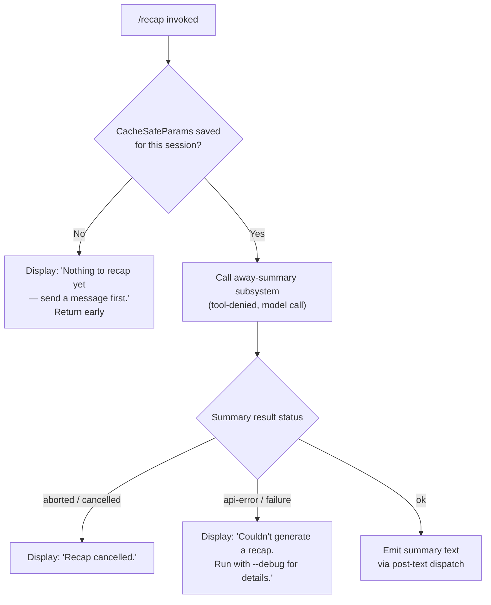

# `/recap`

> Analysis basis: CC v2.1.177 bundle.js (AST extraction + Claude interpretation)
> Minimum version: v2.1.177

---

## Overview

`/recap` triggers an immediate, on-demand generation of a one-line session summary without waiting for the normal automatic post-turn recap cycle. It works by invoking the away-summary subsystem (the same path used for background session summarisation), which calls the model under a restricted tool-denial policy and writes the resulting single-line summary back to the current session state. If no conversation turns have occurred yet, or if the underlying summary call is cancelled or fails, the command surfaces a short user-facing error message instead.

---

## Registration

| Field | Value |
|---|---|
| type | `local` |
| name | `recap` |
| description | `Generate a one-line session recap now` |
| loc_byte | `13328704` |
| loc_byte_end | `13328920` |
| loc_line | `9714` |
| supportsNonInteractive | `false` |
| thinClientDispatch | `post-text` |
| load_inline | `true` |
| load_ident | `Mq5` |
| arbor_handler.name | `Mq5` |
| arbor_handler.fqn | `claude-2.1.177::Mq5` |
| arbor_handler.kind | `AsyncFunction` |
| arbor_handler.resolution_path | `load_ident` |
| arbor_handler.n_hits | `0` |

Analysis basis: CC v2.1.177 bundle.js:+13328704

The handler was inlined into a `load: () => Promise.resolve({ call: Mq5 })` shape. Arbor resolved it via the `load_ident` path. The handler identifier `Mq5` is used throughout this spec's pseudocode as `recapHandler`.

---

## Input Branching

The command presents three distinct outcome branches based on session state and the result of the away-summary call, so a Mermaid flowchart is used.



Analysis basis: CC v2.1.177 bundle.js:+13328312 (handler entry), +13328454 (no-turns message), +13328546 (cancelled message), +13328604 (error message), +6982407 (away-summary guard log), +6982925 (aborted branch), +6983014 (api-error branch), +6983075 (ok branch)

---

## Behavioral Spec

### Top-Level Handler

```
async function recapHandler(context):
    result = await awaySummaryDispatch(context)
    // result carries status and optional text
    return result
```

Analysis basis: CC v2.1.177 bundle.js:+13328312

### Away-Summary Guard (No-Turns Check)

```
function awaySummaryDispatch(context):
    params = getCacheSafeParams(context)
    if params is null or undefined:
        log("[awaySummary] no CacheSafeParams saved, skipping")
        displayMessage("Nothing to recap yet — send a message first.")
        return { status: "no-turn" }

    abortController = new AbortController()
    context.on("abort", () => abortController.abort())

    return runAwaySummaryCall(params, abortController.signal, context)
```

Analysis basis: CC v2.1.177 bundle.js:+6982386 (params check), +6982407 (log literal), +6982465 (`"no-turn"` literal), +6982502 (event listener), +6982521 (`"abort"` literal)

### Tool-Denial Policy

```
function buildAwaySummaryPermissions():
    return {
        mode: "deny",
        reason: "Away summary cannot use tools"
    }
```

The away-summary model call runs under a hard `"deny"` tool policy — no tools are available to the summarisation sub-call. This prevents the recap from triggering side-effecting actions.

Analysis basis: CC v2.1.177 bundle.js:+6982698 (`"deny"` literal), +6982713 (`"Away summary cannot use tools"` literal)

### Model Call and Result Handling

```
async function runAwaySummaryCall(params, signal, context):
    // Invokes the query pipeline (mainQueryRunner) with:
    //   - thread label:  "away_summary"
    //   - tool policy:   deny-all
    //   - abort signal:  propagated from caller

    queryResult = await mainQueryRunner(params, {
        threadLabel: "away_summary",
        toolPolicy: buildAwaySummaryPermissions(),
        signal: signal
    })

    status = queryResult.status   // "ok" | "aborted" | "api-error"

    if status == "aborted":
        displayMessage("Recap cancelled.")
        return

    if status == "api-error":
        displayMessage("Couldn't generate a recap. Run with --debug for details.")
        return

    // status == "ok": surface the one-line recap text
    summaryText = extractLastAssistantText(queryResult)
    emitPostText(summaryText)
    return summaryText
```

Analysis basis: CC v2.1.177 bundle.js:+6982781 (`"away_summary"` literal), +6982925 (`"aborted"` literal), +6983014 (`"api-error"` literal), +6983031 (result-dispatch call), +6983075 (`"ok"` literal), +13328546 (cancelled message), +13328604 (error message)

### Query Pipeline Entry (awaySummaryDispatch → mainQueryRunner)

The query pipeline entered via the away-summary path is the same large query runner used by normal turns (`rNL` in the bundle). Relevant sub-behaviours at depth 2 include:

```
function mainQueryRunner(params, options):
    // Phase 1: setup
    logPhase("query_setup_start")
    buildMessageHistory(params)
    applyToolPolicy(options.toolPolicy)  // → deny-all for recap
    logPhase("query_setup_end")

    // Phase 2: API loop
    logPhase("query_api_loop_start")
    for each streaming chunk:
        logPhase("query_api_streaming_start")
        processStreamChunk(chunk)
        logPhase("query_api_streaming_end")

    // Phase 3: completion
    updateAppState(queryResult)
    return queryResult
```

This pseudocode is a simplified representation; the actual pipeline handles autocompaction, model fallback, refusal fallback, tool execution, and stop-hook logic — all of which are bypassed or short-circuited for the tool-denied away-summary path.

Analysis basis: CC v2.1.177 bundle.js:+10705398 (`"query_setup_start"`), +10705661 (`"query_setup_end"`), +10706569 (`"query_api_loop_start"`), +10707552 (`"query_api_streaming_start"`), +10720331 (`"query_api_streaming_end"`)

### Session-Log Writer

```
function sessionLogWriter(content, filePath):
    // Ensures directory exists
    ensureDirectory(dirname(filePath))
    // Appends encoded content to the log file
    appendToFile(filePath, encode(content))
    // Rotates file if byte limit exceeded
    if byteLength(filePath) > rotationThreshold:
        rotateLogFile(filePath)
```

The session log write path (`A4f` / `_4f` in the bundle) is reached from the query pipeline. It uses `Buffer.byteLength` to check size before rotation; rotation involves `AS.rename` and `AS.unlink`. The `.txt` extension is used for rotated files.

Analysis basis: CC v2.1.177 bundle.js:+211096 (log writer entry), +211304 (`Buffer.byteLength`), +210525 (`.txt` literal), +210577 (`AS.rename`), +210617 (`AS.unlink`)

### Recap Result Extraction

```
function extractLastAssistantText(queryResult):
    messages = queryResult.messages
    // Walks backward through messages to find last assistant text block
    lastAssistant = messages.findLast(m => m.role == "assistant")
    textBlock = lastAssistant.content.find(block => block.type == "text")
    return textBlock.text.trim().toUpperCase()[0] + textBlock.text.slice(1)
    // normalises capitalisation for display
```

Analysis basis: CC v2.1.177 bundle.js:+211710 (`_.toUpperCase`), +211730 (`xf` text-extraction helper), +211733 (`H.trim`)

---

## State & Side Effects

| Item | Detail |
|---|---|
| Telemetry | See telemetry table below; no `/recap`-specific `tengu_*` event was found in the depth-2 traversal — events fired are those of the shared query pipeline (e.g. `tengu_query_error`, `tengu_auto_compact_succeeded`, etc.) |
| appState changes | `setAppState` is called by the query pipeline to update session state after the summary completes (`uC8` path, bundle.js:+10756161) |
| Session log | Summary text is appended to the session log file via the log-writer path (`A4f` / `_4f`); file rotation may occur |
| AbortController | A new `AbortController` is created per invocation and wired to the context `"abort"` event; the signal is propagated into the query pipeline |
| Hook registration | `XyA.register` is called via `m9` (bundle.js:+65203); this registers a stop-hook listener used by the query pipeline, not specific to `/recap` |
| Sound / UI | None specific to this command; output is dispatched via `thinClientDispatch: "post-text"` |
| `avoid_prompts` flag | The `"avoid_prompts"` app-state key is read during the query setup phase (bundle.js:+10755227), potentially influencing model selection |

### Telemetry Events (fired by underlying query pipeline)

| Event | loc_byte |
|---|---|
| `tengu_auto_compact_rapid_refill_breaker` | +10703448 |
| `tengu_auto_compact_succeeded` | +10703913 |
| `tengu_ptl_surfaced_to_user` | +10705989 |
| `tengu_refusal_fallback_suppressed` | +10707259 |
| `tengu_rotunda_pennant_applied` | +10709341 |
| `tengu_rotunda_pennant_tools` | +10710403 |
| `tengu_refusal_fallback_dialog_suppressed` | +10713543 |
| `tengu_refusal_fallback_prompt_shown` | +10713800 |
| `tengu_refusal_fallback_prompt_choice` | +10714135 |
| `tengu_fallback_credit_forfeited` | +10714250 |
| `tengu_convolute_arcades_retry` | +10715646 |
| `tengu_refusal_fallback_triggered` | +10716072 |
| `tengu_orphaned_messages_tombstoned` | +10717484 |
| `tengu_refusal_fallback_supersedes` | +10718935 |
| `tengu_convolute_arcades_retry_outcome` | +10720414 |
| `tengu_model_fallback_triggered` | +10722483 |
| `tengu_query_error` | +10723170 |
| `tengu_model_response_keyword_detected` | +10723989 |
| `tengu_malformed_tool_use_retry_outcome` | +10728212 |
| `tengu_malformed_tool_use_response` | +10728503 |
| `tengu_stop_hook_block_count` | +10729689 |
| `tengu_loop_dynamic_wakeup_ends_turn` | +10733067 |
| `tengu_post_autocompact_turn` | +10733239 |
| `tengu_query_before_attachments` | +10733355 |
| `tengu_query_after_attachments` | +10735670 |
| `tengu_mcp_tools_refreshed_mid_turn` | +10735973 |
| `tengu_feature_ok` | +1018758 |
| `tengu_feature_bad` | +1018825 |
| `tengu_forked_agent_default_turns_exceeded` | +10759481 |
| `tengu_fork_agent_query` | +10759924 |

---

## Version History

| Version | Change |
|---|---|
| v2.1.177 | Initial analysis |

---

## Common Mistakes

1. **Running `/recap` before any conversation turns** — The command checks for saved `CacheSafeParams` and will immediately return "Nothing to recap yet — send a message first." if none exist. At least one user message must have been processed.
2. **Expecting tool use in the recap** — The away-summary call runs under a hard deny-all tool policy. Any expectation that the recap will read files, run commands, or call MCP tools is incorrect.
3. **Confusing `/recap` with `/compact`** — `/recap` produces only a one-line summary and does not truncate or replace the conversation history. `/compact` performs context-window compaction. These are separate commands with different effects on session state.
4. **Expecting non-interactive use** — `supportsNonInteractive: false` means `/recap` cannot be scripted via `--print` / `-p` mode. Invoking it in a non-interactive pipeline will not produce the expected output.
5. **Interpreting a blank or error output as a bug** — If the model call fails for any reason (API error, timeout, etc.), the command surfaces "Couldn't generate a recap. Run with --debug for details." rather than propagating a stack trace. Use `--debug` to inspect the underlying failure.

---

## Appendix — Identifier Mapping

> For bundle debugging only. Identifiers change across versions.

| Identifier | Role |
|---|---|
| `Mq5` | Top-level async recap handler (`recapHandler`) — entry point resolved via `load_ident` |
| `Dh6` | Away-summary dispatch function — guards on `CacheSafeParams`, creates `AbortController`, calls query pipeline |
| `e9H` | Likely `getCacheSafeParams` — retrieves cached prompt parameters for the session |
| `N` | Session-log text normaliser / writer coordinator |
| `tff` | Log-file path builder |
| `WyA` | Path utility (joins log directory components) |
| `CH` | `JSON.stringify` wrapper used for serialising session state |
| `xf` | Assistant-text extractor — finds last text block in message history |
| `akA` | Message-array mapper used inside text extraction |
| `kQH` | Session-log byte-length check and write dispatcher |
| `BkA` | Raw file-write helper (`H.write`) |
| `A4f` | Session log writer — main entry; handles directory creation, append, and rotation |
| `AQH` | Async write-queue coordinator (uses `setTimeout`, `setImmediate`, `clearTimeout`) |
| `g4H` | Log-file rotation helper |
| `r$6` | EISDIR-safe stat helper |
| `HSA` | Log-file path joiner using `path.join` and an `I6` config |
| `cH_` | File rotation executor — renames `.txt` and calls `AS.unlink` |
| `_4f` | Log-append sub-routine — calls `AS.mkdir`, `AS.appendFile`, rotation helpers |
| `m9` | Stop-hook registrar — calls `XyA.register` |
| `mT` | Main query-turn orchestrator; coordinates `uC8`, `rNL`, `dU`, result dispatch |
| `uC8` | Query pipeline setup — reads/sets `appState`, generates request ID via `Gnq.randomUUID` |
| `UI` | Model-selector utility |
| `dMH` | Session dump/load helper |
| `b2H` | Pre-query state initialiser |
| `al9` | Likely streaming-start hook |
| `M` | Tool-registry lookup |
| `mu8` | Likely message-history builder |
| `XR` | Request-ID generator using `MY8.randomBytes` and hex encoding |
| `mC8` | Likely turn-context builder |
| `RKH` | Post-turn result router |
| `P4` | Stop-hook invocation helper |
| `fUH` | Tool-filter for `ant`-namespace tools |
| `dU` | Turn-result dispatcher — calls `rNL` (main query runner) and `Qx8` |
| `rNL` | Core query-loop function — streaming, tool execution, autocompaction, fallback logic |
| `Qx8` | Subagent-exit cleanup — deletes from `eU`, `Y4A`, `mx6` maps |
| `IH` | Feature flag check — fires `tengu_feature_ok` |
| `bH` | Feature flag check — fires `tengu_feature_bad` |
| `hE` | Likely a hook-event emitter |
| `zu6` | `zhL.has` check — tests whether a tool-use summary key is present |
| `M6H` | Likely notification dispatcher |
| `Bu8` | Likely post-turn summary writer |
| `Xnq` | Notification-set helper (calls `zu6`) |
| `Y` | Session-exit handler — calls `process.exit`, `z.abort` |
| `EX` | Forced-shutdown log helper |
| `z` | Daemon-stop coordinator |
| `p3H` | Tool-result collector / in-progress filter |
| `AX` | Likely tool-result accumulator |
| `Hp7` | Tool finder by ID |
| `f` | Promise-set manager (add/delete with `.finally`) |
| `d` | Base logger / diagnostic emitter |
| `whL` | Forked-agent query wrapper — fires `tengu_fork_agent_query` |
| `tH` | Low-level telemetry emitter (calls `nM6`) |
| `B8` | Background-session manager — uses `Vk.randomUUID` and `X` |
| `P` | IPC message framer — handles `Buffer.concat`, `ETOOLARGE`, `utf8` decoding |
| `X` | IPC connection with `setTimeout` |
| `j` | Process manager — sends `SIGTERM`, iterates `A.values` |
| `mL` | Stream-end helper |
| `jI5` | Full IPC protocol handler — manages PTY sessions, attach/detach, resize, snapshots |
| `TH` | String coercion wrapper |
| `Fe9` | Result-flattening helper using `H.flatMap` |

---

Note: index built via Arbor fallback; some signals (telemetry, literals) may be missing — see arbor-fallback.js.