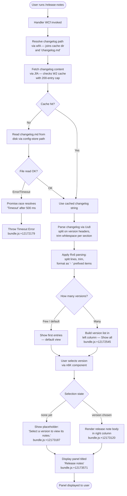

# `/release-notes`

> Analysis basis: CC v2.1.170 bundle.js (AST extraction + Claude interpretation)
> Minimum version: v2.1.170

---

## Overview

The `/release-notes` command opens an interactive, JSX-rendered panel that fetches and displays the Claude Code changelog. It resolves a local cache file (`changelog.md`) via the data directory, parses per-version sections, and presents a navigable column UI where the user selects a version from the left panel to read its notes on the right. Network-independent: content is served from a bundled or cached copy, not a live HTTP endpoint.

---

## Registration

| Field | Value |
|---|---|
| type | `local-jsx` |
| name | `release-notes` |
| description | `View release notes` |
| loc_byte | `12173899` |
| loc_byte_end | `12174040` |
| loc_line | `8364` |
| module_id | `i6K` |
| load_inline | `true` |
| arbor_handler.name | `WCf` |
| arbor_handler.fqn | `claude-2.1.170::WCf` |
| arbor_handler.kind | `AsyncFunction` |
| arbor_handler.resolution_path | `module_id` |
| arbor_handler.n_hits | `0` |

Analysis basis: CC v2.1.170 bundle.js:+12173899

---

## Input Branching

The command involves 4+ distinct branches across data-fetching, timeout racing, changelog parsing, and UI state transitions; a Mermaid flowchart is used.



---

## Behavioral Spec

### 1. Handler Entry — `handlerMain` (WCf)

Analysis basis: CC v2.1.170 bundle.js:+12172155

```
async function handlerMain():
    schedule setTimeout callback  // bundle.js:+12172155
    startAbortController(f)       // opens abort handles; bundle.js:+12172171

    result = await Promise.race([
        fetchChangelogContent(),   // JfA path
        timeoutPromise(500)        // resolves "Timeout" after 500 ms
    ])                             // bundle.js:+12172205

    if result == "Timeout":
        throw new Error("Timeout") // bundle.js:+12172179, +12172173

    sections = parseChangelog(result)  // Uu8; bundle.js:+12172256
    render releaseNotesComponent(sections, wJ)  // bundle.js:+12172287
```

Timeout constant: **500 ms** (bundle.js:+12172191).

---

### 2. Changelog Path Resolution — `resolveChangelogPath` (wfA)

Analysis basis: CC v2.1.170 bundle.js:+12168780

```
function resolveChangelogPath():
    parts = hx6.join([cacheDir, "changelog.md"])
    // "cache" segment: bundle.js:+12168794
    // "changelog.md" filename: bundle.js:+12168802
    return H_(parts)   // normalizes path
```

The file is located within the cache subdirectory. The filename is the literal string `changelog.md`.

---

### 3. Changelog Fetch with Cache — `fetchChangelogContent` (JfA)

Analysis basis: CC v2.1.170 bundle.js:+12169040

```
function fetchChangelogContent():
    configStore = m9()             // JCL.getStore; bundle.js:+12169163
    cacheMap    = W2.get(key)      // in-memory map; cap 200 entries
                                   // bundle.js:+12169085, literal 200 at +12169109
    if cacheMap has entry:
        return cachedString

    rawPath = resolveChangelogPath()    // wfA
    parentDir = hx6.dirname(rawPath)    // bundle.js:+12169174
    timestamp = Date.now()              // bundle.js:+12169224

    persistedData = persistConfigStore(configStore, rawPath, timestamp)
                    // W8; triggers config-store machinery
    return persistedData
```

Cache cap: **200** entries (bundle.js:+12169109).

---

### 4. Changelog Parsing — `parseChangelog` (Uu8)

Analysis basis: CC v2.1.170 bundle.js:+12170118

```
function parseChangelog(rawText):
    initial = pu8(rawText)              // pre-process / sanitize
    keys    = Object.keys(initial)      // bundle.js:+12170149
    wJ(keys)                            // version list normalizer
    filtered = keys.filter(predicate)   // bundle.js:+12170249
    sections = {}
    for each version in filtered:
        sections[version] = parseSingleVersion(rawText, version)
                            // hH; bundle.js:+12170347
    return sections
```

---

### 5. Single Version Section Parser — `parseSingleVersion` (Rx6)

Analysis basis: CC v2.1.170 bundle.js:+12169479

```
function parseSingleVersion(text, version):
    lines = text.split(delimiter)      // bundle.js:+12169479
    trimmed = lines via q.trim()       // bundle.js:+12169528

    formatted = []
    for each line in trimmed:
        if line contains " - " separator:   // literal " - " at +12169610
            parts = f9(line)               // index-of + slice; +12169605
            formatted.push(parts)
        else:
            item = "- " + line.trim()      // prefix "- " at +12169688
            formatted.push(item)

    result = K.slice(formatted, ...)       // trim leading/trailing empties
    return $.trim(result)                  // final whitespace normalization
```

Line separator literal: `" - "` (bundle.js:+12169610). Bullet prefix literal: `"- "` (bundle.js:+12169688).

---

### 6. Release Notes UI Component — `releaseNotesComponent` (n6K)

Analysis basis: CC v2.1.170 bundle.js:+12172466

```
function releaseNotesComponent(sections):
    use React memo cache (sentinel "react.memo_cache_sentinel")
    // bundle.js:+12173046

    layout = column layout            // "column" literal +12173120

    leftPanel:
        versionList = A.map(sections, renderVersionEntry)  // +12172643
        include "Show all" toggle when entries > threshold // +12172545

    rightPanel:
        selected = A.find(sections, matchSelected)         // +12172788
        if selected == "skip":                             // +12172850
            show placeholder "Select a version to view its notes."
            // bundle.js:+12173187
        else:
            render section body using jfA renderer         // +12172868

    topBar:
        title = "Release notes"                            // +12173571

    return composed JSX panel
```

React memo sentinel: `"react.memo_cache_sentinel"` (bundle.js:+12173046).
Panel title: `"Release notes"` (bundle.js:+12173571).
Placeholder text: `"Select a version to view its notes."` (bundle.js:+12173187).
"Show all" label: `"Show all"` (bundle.js:+12172545).

---

### 7. Animated Loader — `animatedLoader` (l6K)

Analysis basis: CC v2.1.170 bundle.js:+12172030

```
function animatedLoader(frameList):
    frame = H.slice(frameList, ...)      // pick current frame; +12172030
    wJ(frame)                            // render frame; +12172056
    jfA(frame)                           // map/transform frame; +12172083
```

Called during async fetch to show loading animation. Frame timing uses `Math.random` (+13939352) and `setTimeout` (+13939389) with constants `2` and `1` (+13939350, +13939366).

---

### 8. Config-Store Persistence Layer — `persistConfigStore` (W8 / k78)

Analysis basis: CC v2.1.170 bundle.js:+3302778

This sub-system manages reading and writing the changelog cache from the filesystem with safety guarantees:

```
function saveConfigWithLock(configPath, data):
    acquire lock (backoff loop, up to 60000 ms)   // +3306703
    if lock_contention detected:
        emit telemetry "tengu_config_lock_contention"   // +3306022
    re-read config from disk
    if re-read config missing auth that cache has:
        emit telemetry "tengu_config_auth_loss_prevented"  // +3306501
        abort write with guard message                     // +3306349
        return
    if stale write detected:
        emit telemetry "tengu_config_stale_write"  // +3306158
    backup existing file → "backups" dir           // "backups" +3307534
    keep last 5 backups                            // literal 5 +3306952
    write new content atomically via xO6           // safe-write with rename
    permissions mode: 0o600 (384 decimal)          // +3307234
```

Lock contention warning: `"Lock acquisition took longer than expected - another Claude instance may be running"` (bundle.js:+3305933). Lock contention threshold: **100** iterations (bundle.js:+3305927). Lock max wait: **60 000 ms** (bundle.js:+3306703).

---

### 9. Safe Atomic File Writer — `atomicFileWrite` (xO6)

Analysis basis: CC v2.1.170 bundle.js:+1060683

```
function atomicFileWrite(targetPath, content):
    if not n6(targetPath):           // existence check
        if lstat is symlink:         // +1061185
            handle ELOOP / ENOTDIR  // +1061056, +1061069
    randomBytes = BA_.randomBytes(6).toString("hex")  // +1061399, +1061427
    tempPath = targetPath + "." + randomBytes
    write content to tempPath        // W3.writeFileSync +1061835
    fchmod(tempPath, originalMode)   // preserve permissions; +1061893
    fsync(tempPath)                  // flush to disk; +1061959
    rename(tempPath, targetPath)     // atomic replace; +1062087
    on error: unlink tempPath        // cleanup; +1062244
```

Temp filename uses **6 random bytes** encoded as hex (bundle.js:+1061415, +1061427).

---

## State & Side Effects

| Item | Detail |
|---|---|
| Telemetry | `tengu_config_lock_contention` (+3306022), `tengu_config_stale_write` (+3306158), `tengu_config_parse_error` (+3308597), `tengu_config_auth_loss_prevented` (+3306501) |
| Cache map | In-memory W2 map; capped at **200** entries (+12169109); keyed by changelog path |
| Filesystem reads | `changelog.md` read via config-store path; `statSync`, `readdirStringSync`, `readFileSync` used during cache validation |
| Filesystem writes | Config/cache file updated atomically (rename-over); backups written to `backups/` subdirectory (max **5** retained) |
| File permissions | Written with mode **0o600** (384 decimal) (+3307234) |
| React memo cache | Component uses sentinel `"react.memo_cache_sentinel"` for memoization (+12173046) |
| Abort/close | `A.close` and `q.close` called on handler exit (+16541762, +16541772) |
| Error output | `console.error` + `w6.red` (red-colored stderr) on fatal path (+13231063, +13231077); `process.exit` on unrecoverable error (+13231131) |
| CLI error file | `aj` writes `"cli_error"` via `$FH.writeFileSync` to `ro8.join` path (+194949, +194967) |
| Sound | <!-- TODO: not found in depth-2 traversal; needs --depth 4 --> |
| appState changes | <!-- TODO: not found in depth-2 traversal; needs --depth 4 --> |

---

## Version History

| Version | Change |
|---|---|
| v2.1.170 | Initial analysis |

---

## Common Mistakes

1. **Assuming live network fetch**: `/release-notes` reads `changelog.md` from the local cache directory — it does not make HTTP requests. If the cache file is missing or stale, the command may show outdated or no release notes.
2. **Ignoring the 500 ms timeout**: The handler races content fetching against a 500 ms deadline. On slow filesystems or lock-contended config stores, the command will throw a `Timeout` error rather than hang.
3. **Expecting plain-text output**: The command renders a JSX interactive panel (type `local-jsx`), not a static markdown dump. It requires a terminal environment that supports the CC UI rendering layer.
4. **Overlooking the "Show all" toggle**: By default, the version list may be truncated. Users must activate "Show all" to see older entries beyond the default view.
5. **Config lock conflicts**: If another Claude Code instance is concurrently writing config, changelog cache writes may be delayed or skipped with a warning logged to stderr. This is expected behavior guarded by `tengu_config_lock_contention`.
6. **Auth-loss guard**: The config-store layer will refuse to write the cache if it detects that a re-read of the config is missing authentication data that the in-memory cache holds. This prevents silent credential loss (GH #3117).

---

## Appendix — Identifier Mapping

> For bundle debugging only. Identifiers change across versions.

| Identifier | Role |
|---|---|
| `WCf` | Main async handler for `/release-notes` (arbor_handler; AsyncFunction) |
| `JfA` | Changelog content fetcher with in-memory cache (W2 map) |
| `wfA` | Changelog file path resolver (joins cache dir + `changelog.md`) |
| `Uu8` | Changelog text parser — splits into per-version sections |
| `Rx6` | Single-version section line parser (split, trim, format) |
| `n6K` | Release notes JSX UI component (column layout, version list, content panel) |
| `l6K` | Animated loader / frame renderer used during async fetch |
| `jfA` | Version entry mapper / renderer helper |
| `W8` | Config-store persistence entry point (save with lock) |
| `k78` | Core config-store save-with-lock implementation |
| `B7H` | Config file reader with backup/copy logic |
| `xO6` | Atomic file writer (temp + rename pattern) |
| `I78` | Config-store incremental write helper |
| `K69` | Config entries iterator (Object.entries) |
| `QP6` | Timestamp/date helper for config operations |
| `CT_` | Backup path builder (`backups/` subdirectory join) |
| `N` | Config normalization / field formatting helper |
| `CH` | JSON serializer wrapper (JSON.stringify) |
| `hH` | Token/symbol cache lookup with LRU eviction |
| `lN4` | LRU queue manager (shift/push on fixed-size deque) |
| `jA` | Error/string conversion utility |
| `f9` | String index-of + slice helper |
| `hq` | Telemetry opt-in/mode resolver |
| `ImA` | Telemetry mode evaluator |
| `_6` | String coercion helper |
| `m9` | AsyncLocalStorage config-store accessor (JCL.getStore) |
| `H_` | Path normalizer |
| `wJ` | Version list normalizer / renderer helper |
| `f$K` | Timestamp-keyed session logger |
| `Sx6` | Secondary changelog path/store accessor |
| `pu8` | Raw changelog pre-processor / sanitizer |
| `Y1` | Fatal error handler (writes error file + process.exit) |
| `JpH` | Stderr red-color error printer |
| `aj` | CLI error file writer |
| `V8` | File stat existence/type checker |
| `liH` | Config lock helper |
| `ZJH` | Config initialization helper |
| `d` | Config data accessor / default-value helper |
| `F_` | Cache key generator for changelog fetch |
| `W2` | In-memory LRU/Map cache store (cap 200) |
| `L` | Async task set manager (add/delete/finally) |
| `P` | Stream/buffer protocol handler |
| `E` | Slice/clamp math helper |
| `K` | Column/table map + pad formatter |
| `$` | Session context / trim helper |
| `n6` | File existence check utility |
| `HX` | Config serialization helper |

---

Note: index built via Arbor fallback; some signals (telemetry, literals) may be missing — see arbor-fallback.js.