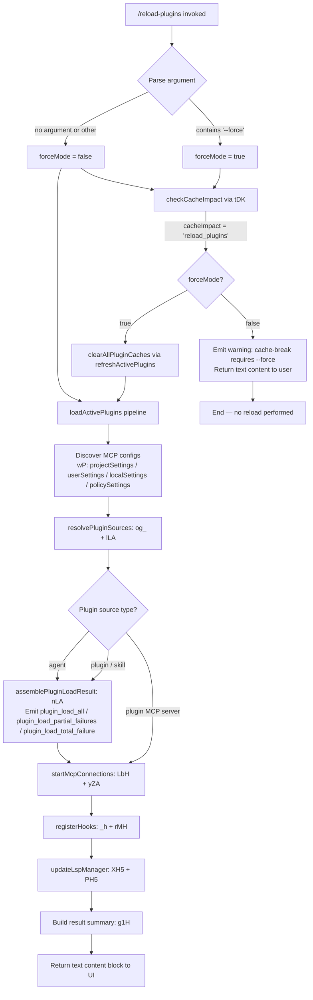

# `/reload-plugins`

> Analysis basis: CC v2.1.177 bundle.js (AST extraction + Claude interpretation)
> Minimum version: v2.1.177

---

## Overview

`/reload-plugins` triggers a full re-scan and re-load of all active plugins (MCP servers, skills, agents, hooks, and LSP servers) within the current Claude Code session. It reads the optional `--force` flag to decide whether to discard all plugin caches (including prompt-cache-breaking state) before reconnecting each plugin. The command is dispatched to the host process via the `control-request` thin-client pathway and is not available in non-interactive sessions.

---

## Registration

| Field | Value |
|---|---|
| type | `local` |
| name | `reload-plugins` |
| description | `Activate pending plugin changes in the current session` |
| argumentHint | `[--force]` |
| supportsNonInteractive | `false` |
| thinClientDispatch | `control-request` |
| module_id | `eDK` |
| load_inline | `true` |
| loc_byte | `12924966` |
| loc_byte_end | `12925210` |
| loc_line | `9145` |
| arbor_handler.name | `WH5` |
| arbor_handler.fqn | `claude-2.1.177::WH5` |
| arbor_handler.kind | `AsyncFunction` |
| arbor_handler.resolution_path | `module_id` |
| arbor_handler.n_hits | `0` |

Analysis basis: CC v2.1.177 bundle.js:+12924966

---

## Input Branching

The handler has four distinct branches based on the `--force` flag and the resulting cache-impact classification, plus separate paths for MCP, skill/agent, hook, and LSP sub-systems. A Mermaid flowchart is used.



Analysis basis: CC v2.1.177 bundle.js:+12924050 (argument trim), +12924086 (`--force` literal), +12924118 (`sDK` cache-impact check), +12924270 (`tDK`), +12924324 (`GH5`), +12924396 (`$zH` / `refreshActivePlugins`), +12924428 (`lOH`), +12924471 (`g1H`)

---

## Behavioral Spec

### 1. Entry Point and Argument Parsing

```
async function reloadPluginsHandler(args, context):
    trimmedArg = args.trim()                        // +12924050
    forceMode  = trimmedArg.includes("--force")     // +12924086 / +12924101
    pluginType = determinePluginType(context)        // "plugin" | "skill" | "agent"
                                                    // literals at +12923780, +12923811, +12923839
    return await dispatchReload(forceMode, pluginType, context)
```

Analysis basis: CC v2.1.177 bundle.js:+12923664

### 2. Cache-Impact Check (`sDK`)

Before performing any reload, the handler calls the cache-impact checker (`sDK`) which inspects whether current conversation state contains prompt-cache entries that would be invalidated by a plugin change.

```
function checkCacheImpact(context):
    hasCachedMessages = inspectConversationCache()   // A.has / _.has at +12922732, +12922771
    if hasCachedMessages:
        classify using _h (hipaa/standard variant resolver)
        classify using De (lowercase normaliser + BM7)
        classify using DD (outputTokens inspector)
        return "reload_plugins"
    return null

// Called at +12924118
```

If `checkCacheImpact` returns `"reload_plugins"` and `forceMode` is `false`, the handler emits a warning message to the user explaining that re-running with `--force` will re-send the whole conversation instead of using the cache (literal fragment: `"the whole conversation instead of using the cache. Run /reload-plugins --force to apply."` at +12923549) and exits without reloading.

Telemetry fired: `tengu_reload_plugins_cache_impact` (bundle.js:+12922958).

### 3. Cache Clearing (`$zH` / `refreshActivePlugins`)

When `forceMode` is `true` (or no cache impact was detected), the handler invokes the active-plugin refresh function (`$zH`) which performs a full cache flush.

```
async function refreshActivePlugins(forceMode, context):
    if forceMode:
        logDebug("refreshActivePlugins: clearing all plugin caches")  // +12920636
        clearAllInstalledPluginsCaches()        // m$ → xp → Tu6.clear  (+12920694, +10887102)
        logDebug("Cleared installed plugins cache")                    // +10953597
        clearSkillIndexCache()                  // qv → YU → H.clearSkillIndexCache (+13515927)
        clearMarketplaceMetadataCache()         // m$ sub-calls: yOH, Nu_ (+10917504, +10917510)

    // Enumerate plugin slots
    pluginSlots = collectAllSlots(context)      // ue, uW8, $bH  (+12920940, +12921229, +12921101)
    mcpResults  = await connectAllMcpSlots()   // M (LbH + _o8 + yZA) (+12921237)
    emit vR event                              // vR.emit at +12921742

    return buildReloadSummary(pluginSlots, mcpResults)
```

Analysis basis: CC v2.1.177 bundle.js:+12920634

### 4. MCP Configuration Discovery (`fr` / `wP`)

The plugin-load pipeline re-reads all MCP configuration layers in priority order:

| Layer | Literal key | Source |
|---|---|---|
| Project | `"projectSettings"` (+6517146) | `.mcp.json` in project dirs (+6517406) |
| User | `"userSettings"` (+6517169) | User-level config |
| Local | `"localSettings"` (+6517190) | Local overrides |
| Policy | `"policySettings"` (+3363672) | Enterprise policy |

Transport types recognised: `"stdio"` (+6777011), `"sse"` (+6777045), `"sse-ide"` (+6777110), `"ws-ide"` (+6777146), `"claudeai-proxy"` (+6777418).

Connection states tracked: `"connected"` (+6778050), `"failed"` (+6777842), `"needs-auth"` (+6777670), `"disabled"` (+6776909).

Analysis basis: CC v2.1.177 bundle.js:+6518872 (`Zf`), +6518982 (`wP`), +6519002 (`$h`)

### 5. Plugin Source Resolution (`og_` → `nLA` + `lLA`)

```
async function resolveAndLoadPlugins(pluginSlots):
    // lLA: load from marketplace / local source
    for each pluginEntry in pluginSlots:
        if source.type == "marketplace":
            result = await loadFromMarketplace()
            // Failure codes: "marketplace-blocked-by-policy" (+11009460),
            //                "marketplace-not-found" (+11010014),
            //                "marketplace-load-failed" (+11010206),
            //                "cache-miss" (+11010262),
            //                "plugin-not-found" (+11010300)
        else if source.type == "local" | "git" | "npm":
            result = await loadLocalOrGitPlugin()

    // nLA: assemble final load result
    promiseResults = await Promise.all(pluginLoadPromises)
    emit telemetry:
        "plugin_load_all"              (+11029292)
        "plugin_load_total_failure"    (+11029310)
        "plugin_load_partial_failures" (+11029379)

    if originalCwd changed mid-scan:
        logWarning("assemblePluginLoadResult: originalCwd changed mid-scan; "
                   "skipping side-effects (stale early-kick)")  // +11029445
        return earlyReturn

    return aggregatedPluginSet
```

Analysis basis: CC v2.1.177 bundle.js:+11028131 (`nLA`), +11008914 (`lLA`)

### 6. Hook Registration (`_h`)

```
function registerHooks(pluginSet):
    if safeMode:
        logDebug("Safe mode: skipping plugin hook registration")  // +5121219
        return

    for each plugin in pluginSet:
        hookConfig = parseHookConfig(plugin)     // Fu_ → ZkH / Bu_ / pM7 / A6 / PK
        validateHookSpec(hookConfig)             // rMH → RK, N, Xh9
        registerHookHandlers(hookConfig)         // bp_ → ru, aL, H.map, Object.entries
```

Analysis basis: CC v2.1.177 bundle.js:+4921587 (`Fu_`), +5121211 (`rMH`)

### 7. LSP Manager Update (`XH5` / `PH5`)

After MCP and hook registration, the LSP manager slots are diffed against the new plugin set:

```
function updateLspManager(oldSlots, newSlots):
    added   = newSlots.filter(s => !oldSlots.has(s))    // XH5: H.filter, _.map, A.filter, q.has (+12922132)
    removed = oldSlots.filter(s => !newSlots.has(s))    // PH5: H.filter, _.map, A.filter, q.has (+12922407)

    for each added slot:
        startLspServer(slot)    // aDK  (+12922257)
    for each removed slot:
        stopLspServer(slot)

    // Conflict detection
    if lspExtensionConflict detected:
        record "lsp-extension-conflict" (+6827153)
```

Analysis basis: CC v2.1.177 bundle.js:+12921312 (`XH5`), +12921345 (`PH5`)

### 8. Result Summary (`g1H` / `lOH`)

```
function buildResultSummary(pluginResults, hookResults, lspResults):
    lines = pluginResults.map(r =>
        formatPluginLine(r)          // g1H: H.map, M1, q.join, q.slice, p8
                                     // +4327742
    )
    // Separator: " · " (+12923898)
    // Status labels: "error" (+12923953), "text" (+12924028)
    // Plugin-type labels: "plugin MCP server" (+12923871),
    //                     "hook" (+12924645),
    //                     "plugin LSP server" (+12924704)
    return { type: "text", content: lines.join(" · ") }
```

Analysis basis: CC v2.1.177 bundle.js:+12924471 (`g1H`), +12924428 (`lOH`)

---

## State & Side Effects

| Item | Detail |
|---|---|
| Telemetry | `tengu_reload_plugins_cache_impact` (+12922958): fired when a force reload would break prompt cache |
| Telemetry | `tengu_mcp_list_changed` (+16750664): fired when MCP tool list changes after reload |
| Telemetry | `tengu_plugin_state_file_error` (+10953776): fired on plugin state file I/O error |
| Telemetry | `tengu_mcp_oauth_flow_start` / `_success` / `_error` (+6546978, +6551956, +6553667): fired if any reloaded MCP server initiates OAuth |
| appState changes | Plugin slot map updated in-memory; `YH` session state updated via `lOH` (_.get / _.set / $.add) |
| Cache cleared | `Tu6.clear` (installed-plugins cache) when `--force`; `H.clearSkillIndexCache` (skill index) |
| MCP connections | Existing connections that match new config are reused; orphaned connections disposed (`A.cleanup` at +16639780); new connections spawned |
| Hook registration | Existing hooks replaced with newly discovered hooks for all active plugins |
| LSP servers | Added/removed LSP servers started/stopped via `XH5` / `PH5` diff |
| Sound | <!-- TODO: not found in depth-2 traversal; needs --depth 4 --> |
| thinClientDispatch | `"control-request"` — command is forwarded to the host daemon rather than executed in the thin client |

---

## Version History

| Version | Change |
|---|---|
| v2.1.177 | Initial analysis |

---

## Common Mistakes

1. **Omitting `--force` when plugins appear stale after a cache-warm conversation.** If the session has active prompt-cache entries, the handler will refuse to reload and display a warning. You must pass `--force` to proceed, accepting that the next request will re-send the full conversation.
2. **Running in non-interactive mode.** `supportsNonInteractive: false` means this command is silently unavailable in headless/pipe invocations; the registration will not be surfaced.
3. **Expecting instant MCP reconnection for remote SSE/WS servers.** Connection errors are cached for 15 minutes (literal: `"Skipping connection (recent failure cached; retries automatically in 15 min, or edit the plugin config to retry now)"` at +6777866). Editing the plugin config clears the failure cache and allows an immediate retry.
4. **Using `--force` unnecessarily in performance-sensitive sessions.** Force mode clears the prompt cache, causing the next API call to re-send the entire conversation history and incur full token costs.
5. **Confusing `/reload-plugins` with a full daemon restart.** This command only refreshes plugin state within the current session; it does not restart the background daemon or affect other running sessions.

---

## Appendix — Identifier Mapping

> For bundle debugging only. Identifiers change across versions.

| Identifier | Role |
|---|---|
| `WH5` | Main async handler for `/reload-plugins` (arbor_handler) |
| `hj` | Pre-reload validation / early-exit helper |
| `f7` | Utility: result-wrapping / error normalisation |
| `NvH` | Inner helper called by f7 |
| `go` | Plugin-type classifier entry |
| `p8` | Plugin metadata formatter |
| `sDK` | Cache-impact checker (inspects conversation cache state) |
| `ig_` | Plugin slot aggregator (calls og_ + fr) |
| `UwH` | Unknown utility called by ig_ |
| `og_` | Plugin source resolver dispatcher (calls nLA + lLA) |
| `nLA` | Assemble-plugin-load-result: aggregates Promise.all results, emits load telemetry |
| `lLA` | Load-from-marketplace / local source pipeline |
| `fr` | Full MCP configuration loader (calls wP, $h, me, uD, K28, vl9, EZ, D, Y) |
| `wP` | MCP config file reader (project/user/local/policy layers, .mcp.json) |
| `me` | MCP auto-discovery scanner |
| `uD` | Policy-settings reader |
| `HY` | Unknown helper in fr |
| `N` | General-purpose text/message formatter |
| `K28` | MCP server entry builder |
| `mtH` | Unknown utility (called by ue, fr) |
| `D` | Daemon/background-session manager |
| `Y` | Forced-shutdown / process.exit wrapper |
| `EZ` | Plugin connection result emitter (calls Jw, dg_) |
| `vl9` | Plugin slot cache (A.has / A.set / A.get) |
| `w` | Supervisor / MCP server lifecycle manager (stop/updateConfig/start) |
| `I` | Session/context slice helper |
| `q` | Background-PTY / daemon connection manager |
| `p1` | CLI error exit helper |
| `_h` | Hook registration orchestrator |
| `Fu_` | Hook config parser (ZkH, Bu_, pM7, A6, PK) |
| `ZkH` | Hook variant resolver (hipaa/standard) |
| `Bu_` | Auto-value numeric range parser |
| `pM7` | Hook "auto" prefix detector |
| `A6` | String-to-bool converter ("yes"/"on") |
| `PK` | String-to-bool converter ("no"/"off") |
| `l_` | Bedrock/Vertex/provider classifier |
| `L7` | Provider-path helper |
| `p18` | Provider-path sub-helper |
| `De` | Hook name lowercaser + BM7 dispatcher |
| `BM7` | Hook dispatch table lookup ($6) |
| `$6` | Core hook event dispatcher |
| `DD` | outputTokens object inspector |
| `tDK` | Cache-impact dispatcher (calls d) |
| `d` | Low-level async task executor |
| `GH5` | Argument split helper (A.split) |
| `$zH` | refreshActivePlugins: full plugin reload orchestrator |
| `Brq` | Unknown sub-helper of $zH |
| `m$` | Plugin cache multi-clearer (SIL, qv, yOH, Nu_, xp) |
| `SIL` | Installed-plugins-cache clearer |
| `BW` | Plugin state broadcaster |
| `qv` | Skill-index cache clearer (YU, Nm8, jrq, mpH) |
| `YU` | Skill-index clear entry (H.clearSkillIndexCache) |
| `yOH` | Marketplace metadata cache clearer |
| `Nu_` | Unknown cache sub-clearer |
| `xp` | tu6.clear caller (plugin cache map) |
| `ue` | Plugin slot enumerator (reads .mcpb/.dxt, calls ug_, Ml9) |
| `KQ` | File-extension checker (endsWith .mcpb / .dxt) |
| `ug_` | MCPB archive reader + manifest extractor |
| `Q6` | Path join / directory utility |
| `C8` | Error-code classifier |
| `c6` | JSON.parse wrapper |
| `Ml9` | Plugin metadata loader (uv6, TH, _.startsWith) |
| `uv6` | Full plugin installation pipeline (manifest.json reader, hash checker, installer) |
| `TH` | String() converter |
| `$bH` | LSP config reader (.lsp.json) |
| `Ik7` | LSP config entry validator/normaliser |
| `yk7` | Path safety checker (cWH.resolve / .relative / K.startsWith) |
| `$` | Session/FPK event wrapper |
| `FPK` | Telemetry event recorder (Date.now, n9, dU6, CH) |
| `bs` | zLH log sink |
| `n9` | AsyncLocalStorage store getter |
| `dU6` | daemon.status.json path builder |
| `CH` | JSON.stringify wrapper |
| `O` | Background-session state object |
| `uW8` | LSP extension conflict detector (M.toLowerCase) |
| `M` | MCP connection lifecycle manager (LbH, _o8, yZA) |
| `LbH` | MCP slot connector (connects / disconnects individual slots) |
| `_o8` | MCP connection result applier (applyMcpUpdate, cleanup) |
| `yZA` | MCP retry/recovery orchestrator (_.getClients, LbH, _o8) |
| `XH5` | LSP-manager added-slots differ |
| `aDK` | LSP server starter |
| `PH5` | LSP-manager removed-slots differ |
| `rMH` | Hook spec validator (RK, N, Xh9) |
| `RK` | String formatter (A6, dc6) |
| `lOH` | Plugin context builder (_.get/set/$.add, Nv, $RH, tV, M1, DP, AB, NZ, oFL, gu6) |
| `Nv` | Plugin manifest reader (TM) |
| `TM` | known_marketplaces.json reader |
| `Cm8` | Marketplace path builder |
| `$RH` | Plugin entry validator (R8, Array.isArray) |
| `R8` | Plugin record constructor (Pe6, Tb) |
| `Pe6` | Plugin record field builder |
| `Tb` | Plugin record type dispatcher |
| `tV` | Error thrower (Error) |
| `M1` | Plugin ID parser (H.includes / H.split) |
| `DP` | Plugin dependency resolver (jt9, aN6, i9H, Wt9) |
| `jt9` | Git URL parser (H.indexOf / H.slice / A.search) |
| `aN6` | Source-type classifier (q08, Jt9, Xt9, ES7) |
| `q08` | R8-based record builder for source |
| `Jt9` | Host-pattern matcher |
| `Xt9` | Path-pattern matcher |
| `ES7` | Error string builder |
| `i9H` | R8-based source record builder |
| `Wt9` | Dependency resolver combiner (Jt9, Xt9, Dt9) |
| `Dt9` | ZD-based dependency resolver |
| `AB` | Marketplace metadata loader (Q6, Cm8, _.readFile, c6, Su6) |
| `Su6` | Marketplace sub-loader (s7.join, SLA, Nl, Z8) |
| `SLA` | Marketplace JSON schema validator |
| `NZ` | Plugin scope resolver (CLA, M1, TM, dh) |
| `CLA` | Cached plugin loader (M1, Q6, Cm8, q.readFile, c6, AB) |
| `oFL` | Plugin feature-flag checker (q.has) |
| `gu6` | Main plugin-load worker (large function — resolves all plugin entries) |
| `YG` | Plugin record builder (R8) |
| `Qm8` | Plugin metadata validator (M1, DP) |
| `fD6` | Local-source path prefix checker (H.startsWith "./") |
| `z` | MCP server process manager (IH, bH, gS, hB) |
| `IH` | Log info emitter |
| `bH` | Log error emitter |
| `gS` | General server status updater |
| `hB` | Promise race / shutdown helper |
| `u6` | AsyncLocalStorage context getter |
| `bs6` | Store getter (Cs6.getStore) |
| `vv` | Plugin state file reader (bLA, MD6, LD6, xLA, TH, N, xu6) |
| `bLA` | Plugin state JSON reader (Q6, bu6, H.readFileSync, C8, c6) |
| `xLA` | Plugin state entry iterator |
| `xu6` | Plugin state cache writer (GL, d) |
| `J` | MCP job tracker (D) |
| `G` | Key/mouse input dispatcher (large UI handler) |
| `T` | UI component (uN6, jM6) |
| `tc` | kY keyboard helper |
| `j` | Process kill helper (A.values, S.kill) |
| `ACK` | Vim-mode action dispatcher |
| `pRK` | Yank operator |
| `gRK` | Visual-replace operator |
| `cRK` | Visual-case operator |
| `b` | Register/clipboard manager |
| `nRK` | Paste operator |
| `bRK` | Indent operator |
| `xRK` | Visual-indent operator |
| `P` | Terminal input buffer processor |
| `r0A` | Motion/text-object dispatcher |
| `S` | Command executor (I6f, L5, N, kH, bI5, w.write) |
| `lN` | Plugin scope validator (M1, ST) |
| `ST` | Scope string normaliser |
| `uY8` | Semver validator (Vi.valid / Vi.coerce / Vi.satisfies) |
| `Q29` | Plugin dependency graph node (cycle/conflict checker) |
| `wN` | Flags-settings merger |
| `m36` | Flag merge helper |
| `irq` | Dependency resolution queue manager |
| `C` | Terminal output writer (clearTimeout, O.write) |
| `x` | Stream end/emit helper (clearTimeout, C, O.end) |
| `$A` | File write orchestrator (n3, Q6, I_H.dirname, AL_, Tb, _W, C8, Mq, N, Error, Os, w7_, ZhH, EY6, Kz, Nt6, Tm, T_, IH, n6, bH, GF, kH, XlH.emit) |
| `n3` | File content builder (JDH, Tb) |
| `AL_` | Atomic file writer (TaA, JDH, WF, WaA, Os) |
| `_W` | zs-based write helper |
| `w7_` | Write-timestamp recorder (Rt6.set, Date.now) |
| `ZhH` | File finaliser (Je6, Tb) |
| `EY6` | Atomic rename/symlink writer |
| `Kz` | Cache-clear pair (Ac6.clear, oa8.clear) |
| `Nt6` | Append/write file helper (u6, i4_, qDH.*) |
| `Tm` | gy.join path helper |
| `n6` | Log-normal emitter (d, tH) |
| `GF` | Settings-write helper (tG, Lq, qL_, Tb, qc6) |
| `Bu6` | Path safety validator (qB.resolve, A.startsWith, Error) |
| `c` | Agent-loop / scheduled-task runner (large function) |
| `B` | Unknown task object |
| `X` | Scheduled-task entry (M, q.setTimeout) |
| `jZ6` | Task overlap checker (IeH, wM7.test, Math.min, mZ9) |
| `Sj8` | Task backoff calculator (IeH, mZ9, Math.max) |
| `KrK` | Boolean coercer |
| `F` | Render-loop / frame timer (B, clearTimeout, setTimeout, w.write, Math.round, d, p.unref) |
| `b8H` | Flag presence checker (_.has) |
| `Y9H` | Scheduled-task filter (b8H, bRH, q.filter, A.has, keH) |
| `zH` | Process-exit guard (process.exit) |
| `YH` | Session runner / main event loop (large function) |
| `sF8` | Session feature checker (T_, A.some, z$, nq, owA) |
| `yT` | Terminal capability detector (KG6, s79, Uc4, lh_, N, fG6, i0, QY) |
| `n` | Keypress default-prevention wrapper |
| `z$` | Unknown flag/state accessor |
| `g$H` | Live-session lister (Promise.resolve, oq6, A.listAllLiveSessions) |
| `TKH` | Session-resume handler (large function) |
| `K6` | nM6 error code wrapper |
| `C_` | Module initialiser (_vH, Ta8, Xd6.call, Pd6.bind, j8f, tVA.set) |
| `mH` | Tombstone/history pruner (NH.findLastIndex, NH.splice, d, tH, cB6) |
| `gH` | UI tool-call renderer (fo, rY, jBH, Ey, uH.find, te, J6.filter, af, kc6, meH) |
| `X4` | UUID generator (Vk.randomUUID) |
| `TJ` | Theme/style selector (KyA, qyA) |
| `VY` | Unknown session flag |
| `Pg6` | Project file rename helper (Iu.join, $_, Qw, T_, I6, Iu.basename, an8.rename, N) |
| `yo` | P4-based helper |
| `AI8` | Unknown async helper (nHA, N36) |
| `qUH` | P4-based helper |
| `gzH` | Session config builder (gc, vVH, N, vY, j1, FY, NK, jD) |
| `Eg6` | Unknown session helper |
| `XFH` | Session state machine (K, vY, fL, SuK, q, d, tH, O1, jLH, QL) |
| `PFH` | Session fork/restore handler (qX5, jD, tn8, d, tH, KX5, QL, QwH, lB, DvH) |
| `uH` | Context window manager (YBH, K, q) |
| `QH` | Message history slicer (gB6, Math.max, Promise.resolve, NH.slice) |
| `Tg6` | Unknown session helper |
| `_n` | Timestamp helper (KX6, Date.now) |
| `UfH` | P4-based helper |
| `Zg6` | Working-directory changer (M3, iU, u6, process.chdir, az, WV, uT, nTH, Gl, $J, Ic8) |
| `pfH` | Session metadata re-appender (P4, dM, iK.utimes, H.reAppendSessionMetadata) |
| `tH` | nM6-based logger |
| `jA` | Error/String coercer |
| `xH` | Async event harvester (WGA, GGA, ZGA, TGA, d) |
| `WGA` | Event worker (bb, F1, ID) |
| `GGA` | Event error handler (ubK, bH, IH) |
| `ZGA` | Event truncation worker (B56, wg6, d, tH, K6) |
| `TGA` | Event worker variant (ubK) |
| `JH` | MCP request dispatcher (N, T, oY, n, a, MH) |
| `oY` | MCP request context builder (C_, q, UU_) |
| `a` | MCP update applier (W, _o8, t.applyMcpUpdate, fbH, n.push, o.push) |
| `MH` | Unknown MCP response handler |
| `$E6` | Semver range validator (bC_, Vi.validRange, Vi.minVersion, K.join) |
| `bC_` | Semver range normaliser |
| `Bm8` | Plugin installer entry (ULA) |
| `ULA` | Plugin installation pipeline (QPH) |
| `pu6` | Plugin update-check entry (ULA) |
| `gm8` | Git-source package resolver (HkL, N, U8, pg, Promise.reject, Error, Um8.clean/maxSatisfying) |
| `HkL` | Unknown helper |
| `U8` | Process spawner helper (d_, u6) |
| `pg` | Integer/string type validator |
| `Fm8` | Plugin source formatter (pu6, _.replace) |
| `Fu6` | Plugin fetch/install worker (v46, xm8, arq, iKH, Zk, Q6, V46.rm/rename, Date.now, pm8, N, Td, yEH, ym8, uLA) |
| `v46` | Plugin archive extractor (TEH, Q6, Joq, V1.join, N, CH, MkL, woq, fkL, Doq, joq, Error, K7, v7.rm, N46) |
| `xm8` | RY6-based helper |
| `arq` | Unknown async helper |
| `iKH` | SHA256 hash computer (N, f.substring, crq.createHash, BLA, L.substring) |
| `Zk` | Plugin path resolver (nm8, uW) |
| `pm8` | Plugin directory scanner (drq.readdir, M9, A.has, N, d_, package.json) |
| `Td` | A6-based path builder |
| `yEH` | Zk-based cache helper |
| `ym8` | Plugin cleanup helper (hIL, hm8, gZ.rm) |
| `uLA` | Plugin update state applier (vv, f.findIndex, f.push, uu6, N) |
| `Q` | Background PTY socket manager (l.on/once/destroy/connect, Z8, c, C, process.kill, N, B, lZ, p, yv, mp8) |
| `l` | PTY socket (Fm6, N_K) |
| `lZ` | U_K-based socket helper |
| `yv` | Binary frame encoder (Buffer.from, CH, Buffer.allocUnsafe, A.writeUInt32BE, A.writeUInt8, _.copy) |
| `mp8` | Binary frame decoder (Buffer.alloc/concat, A.readUInt32BE/UInt8/subarray, H, Buffer.from, c6) |
| `i` | MCP stdio writer (o.write, PI5, P.write) |
| `o` | zl8-based stream |
| `PI5` | MCP message sanitiser (H.includes, H.replace) |
| `XH` | Voice-recording / MCP elicitation UI handler (large function) |
| `Kd8` | WebSocket voice-stream client (large function) |
| `fH` | MCP elicitation form renderer (JH.has, z8, CH, d, tH, wN6, deK, H.handleElicitation, YN6, Yr, $P, JH.add) |
| `y25` | Unknown UI helper |
| `wH` | MCP tool-list updater (Object.keys, zH.map, Array.from, k8.has, L8.cleanup, H.sendMcpMessage) |
| `t` | Timer/ref helper (W.current, c.setTimeout, N, o) |
| `vi8` | Voice metrics recorder (CVH.push, Date.now) |
| `NH` | Timeout manager (clearTimeout) |
| `DH` | MCP list-changed handler (XH.has/add, z8, Dh, d, K6, OA.then, P9, Wm, $, TZ) |
| `z8` | MCP debug logger (ycH.push, $s.logMCPDebug) |
| `OA` | Promise-queue entry (t.push, dH) |
| `P9` | Retry-queue entry (d, K6) |
| `Wm` | Kf-based helper |
| `VH` | Session data-race guard (m9H, RH, d66, Promise.race, uH.then, gH.then) |
| `m9H` | MCP OAuth flow server (large function) |
| `RH` | H-based response wrapper |
| `d66` | Promise deduplication wrapper (Z28.set/get/delete, _.finally) |
| `_kL` | Plugin dependency-resolution entry (lN, M1, N, YG, Qm8, NZ, _.push) |
| `e` | MCP update aggregator (Promise.all, bg, P.filter, J86, T, SW8, kH, t.applyMcpUpdate, qH.has, fbH, TH, l, yZA) |
| `bg` | Promise-based iterator utility |
| `J86` | parseInt wrapper (source version parser) |
| `SW8` | parseInt wrapper (target version parser) |
| `qH` | MCP client-set accessor (e, AH, E, y) |
| `fbH` | MCP connection state formatter (SWH) |
| `cN` | Platform/OS name lowercaser |
| `V$` | A6-based path helper |
| `tf` | OTEL metrics emitter (KRH, s36, K.split, Object.entries, ls8, M.emit, ns8, N) |
| `KRH` | OTEL resource attribute builder |
| `s36` | Unknown OTEL sub-helper |
| `ls8` | OTEL event emitter |
| `ns8` | Unknown OTEL helper |
| `LH` | System message renderer (i.trim, D, M, B, F) |
| `g1H` | Result-line formatter (H.map, M1, q.join, q.slice, p8) |