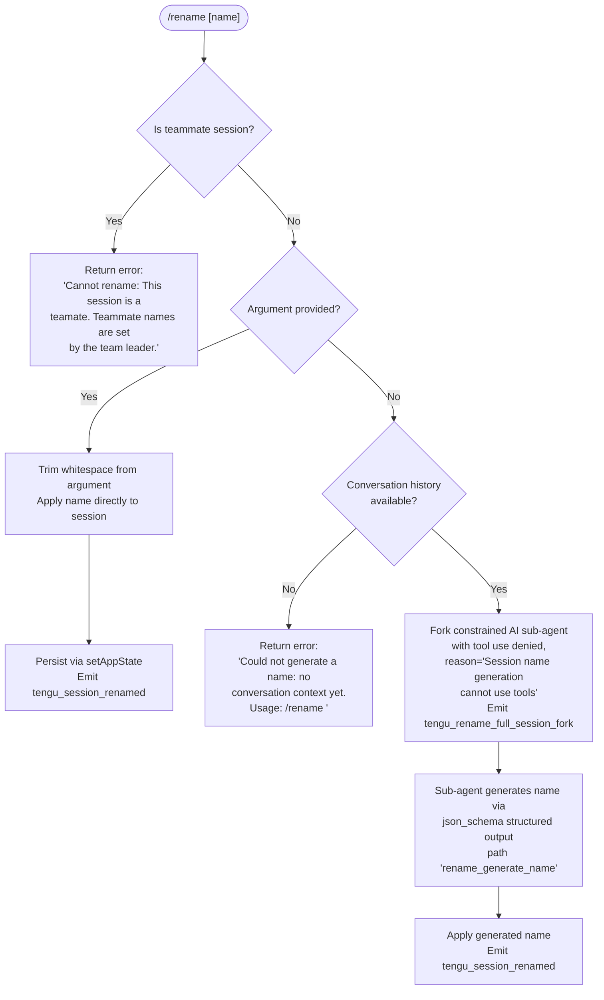

# `/rename`

> Analysis basis: CC v2.1.177 bundle.js (AST extraction + Claude interpretation)
> Minimum version: v2.1.177

---

## Overview

The `/rename` command (also aliased as `/name`) renames the current conversation session. When an explicit name argument is provided it applies it directly; when no argument is given it launches a constrained AI sub-agent that generates a suggested name from the conversation history and then applies it. The command is unavailable in teammate sessions (sessions controlled by a team leader) and emits telemetry on both paths.

---

## Registration

| Field | Value |
|---|---|
| type | `local-jsx` |
| name | `rename` |
| description | `Rename the current conversation` |
| argumentHint | `[name]` |
| immediate | `true` |
| aliases | `["name"]` |
| module_id | `o7K` |
| load_inline | `true` |
| loc_byte | `12354053` |
| loc_byte_end | `12354252` |
| loc_line | `8431` |
| arbor_handler.name | `hlL` |
| arbor_handler.fqn | `claude-2.1.177::hlL` |
| arbor_handler.kind | `AsyncFunction` |
| arbor_handler.resolution_path | `module_id` |
| arbor_handler.n_hits | `0` |

Analysis basis: CC v2.1.177 bundle.js:+12354053

---

## Input Branching

Four distinct control paths exist depending on session type and whether a name argument was supplied.



Analysis basis: CC v2.1.177 bundle.js:+12353065 (handler entry `hlL`→`wF8`→`zF8`)

---

## Behavioral Spec

### Top-Level Handler (`hlL`)

The Arbor-resolved handler `hlL` is an `AsyncFunction` that acts as the command entry point. It reads the current app state and argument string, then dispatches to one of the sub-functions described below.

Analysis basis: CC v2.1.177 bundle.js:+12353749 (`hlL`→`wF8`)

---

### Teammate Guard (`wF8` — apply-name path)

```
async function applyOrGenerateName(appState, rawArg):
    if isTeammateSession(appState):
        return renderError(
            "Cannot rename: This session is a teammate. ..."
        )  // bundle.js:+12353217

    trimmedArg = rawArg.trim()  // bundle.js:+12353316

    if trimmedArg is non-empty:
        applyNameDirectly(appState, trimmedArg)
        return

    // No argument — attempt AI generation
    launchNameGenerationAgent(appState)
```

Analysis basis: CC v2.1.177 bundle.js:+12353197 (`wF8`→`wM` for session-type check), +12353316 (trim), +12353217 (error literal)

---

### Session Type Check (`wM` / `XT`)

```
function isTeammateSession(appState):
    store = IJ_.getStore()   // bundle.js:+2286645
    return store index 0 indicates teammate role
```

Analysis basis: CC v2.1.177 bundle.js:+12353197 (`wF8`→`wM`→`XT`→`IJ_.getStore`)

---

### Direct-Name Application (`wF8`→`setAppState`)

When the trimmed argument is non-empty, the handler calls `_.setAppState` to persist the new title into app state, then calls the file-persistence helper (`kPH`) to write the updated session record to disk.

```
function applyNameDirectly(appState, name):
    _.setAppState({ ...appState, sessionTitle: name })  // bundle.js:+12353556
    persistSessionFile(name)   // kPH — bundle.js:+12353598
    updateConversationTitleTag("custom-title")  // log tag bundle.js:+13562487
    emitTelemetry("tengu_session_renamed")      // bundle.js:+13562579
```

Analysis basis: CC v2.1.177 bundle.js:+12353556, +12353575 (`Sp8`), +12353598 (`kPH`)

---

### Name-Generation Sub-Agent Fork (`u76` / `NlL`)

When no argument is present but conversation history exists, a constrained forked agent is spawned:

```
async function launchNameGenerationAgent(appState):
    emitTelemetry("tengu_rename_full_session_fork")  // bundle.js:+12351892

    sessionSnapshot = buildSessionSnapshot(appState)  // h7A — bundle.js:+12351930

    abortController = new AbortController()
    abortController.signal.addEventListener("abort", ...)  // bundle.js:+12351138

    agentConfig = {
        toolPermissions: "deny",
        toolDenyReason: "Session name generation cannot use tools",  // bundle.js:+12351349
        origin: "rename",        // bundle.js:+12351428
        path: "rename_generate_name",  // bundle.js:+12351452
        outputSchema: "json_schema",   // bundle.js:+12352264
        maxTurns: derived from session history,
    }

    result = await runForkedAgent(agentConfig, sessionSnapshot)
            // NlL → mT — bundle.js:+12351216

    extractedName = extractNameFromAgentResult(result)  // r7K → Wb.trim() — bundle.js:+12351739
    applyNameDirectly(appState, extractedName)
```

Analysis basis: CC v2.1.177 bundle.js:+12351892, +12351349, +12351428, +12351452, +12352264, +12351739

---

### No-Context Guard (`zF8`)

Before the fork is attempted, a separate guard checks whether the conversation has any messages:

```
function checkContextAvailable(appState):
    messages = buildMessageList(appState)   // _p8 — bundle.js:+12353065
    enrichedMessages = f0(messages)         // f0 — bundle.js:+12353079

    if enrichedMessages is empty:
        return renderError(
            "Could not generate a name: no conversation context yet. Usage: /rename <name>"
        )  // bundle.js:+12353428
    return enrichedMessages
```

Analysis basis: CC v2.1.177 bundle.js:+12353065 (`zF8`→`_p8`), +12353079 (`zF8`→`f0`), +12353428

---

### HTML Entity Escaping (`_p8`)

The message-list builder escapes HTML entities in message text before passing content to the sub-agent, replacing `&`, `<`, `>`, `&#13;`, and `&#10;` via `replaceAll`.

```
function escapeMessageText(rawText):
    text = rawText
        .replaceAll("&",  "&amp;")   // bundle.js:+11081534
        .replaceAll("<",  "&lt;")    // bundle.js:+11081558
        .replaceAll(">",  "&gt;")    // bundle.js:+11081581
        .replaceAll("\r", "&#13;")   // bundle.js:+11081605
        .replaceAll("\n", "&#10;")   // bundle.js:+11081629
    return text
```

Analysis basis: CC v2.1.177 bundle.js:+11081517 (`_p8`→`H.replaceAll`)

---

### Forked-Agent Message Construction (`$F8`)

The argument list for the sub-agent is assembled from conversation history entries:

```
function buildAgentPromptArgs(messages):
    parts = []
    for msg in messages:
        if Array.isArray(msg.content):
            parts.push(msg.content.join(...))  // bundle.js:+12348556
        else:
            parts.push(msg.content)
    return parts.slice(relevantWindow)  // bundle.js:+12348588
```

Analysis basis: CC v2.1.177 bundle.js:+12348440 (`$F8`→`_.push`), +12348458, +12348556, +12348588

---

### Result Name Extraction (`r7K` / `Wb`)

After the sub-agent completes, the returned text content is trimmed and used as the new name:

```
function extractNameFromAgentResult(agentResult):
    rawName = getFirstTextContent(agentResult)  // Mq — bundle.js:+12350957
    return rawName.trim()   // Wb.trim() — bundle.js:+1179130
```

Analysis basis: CC v2.1.177 bundle.js:+12351739 (`NlL`→`r7K`), +12350957 (`r7K`→`Mq`), +12350960 (`r7K`→`Wb`)

---

### Session File Persistence (`kPH`)

After the name is determined (either directly supplied or AI-generated), `kPH` writes it to persistent storage:

```
async function persistSessionFile(name):
    sessionPath = buildSessionFilePath()  // Yf/zZ — bundle.js:+4264094
    titleEntry = buildTitleRecord(name)   // Oq — bundle.js:+4264108
    await writeAtomically(sessionPath, titleEntry)  // xL/IO — bundle.js:+4264229
    updateTitleCache()   // lJ — bundle.js:+4264152
    return validate(titleEntry)  // k3 — bundle.js:+4264325
```

Analysis basis: CC v2.1.177 bundle.js:+12353598 (`wF8`→`kPH`), +4264094, +4264108, +4264229

---

### Conversation Log Tag Update (`spH` / `DC` / `VOH`)

Two different log-tag values are written depending on whether the title was user-supplied or AI-generated:

| Source | Tag written | Telemetry |
|---|---|---|
| User-supplied argument | `custom-title` (bundle.js:+13562487) | `tengu_session_renamed` |
| AI-generated | `ai-title` (bundle.js:+13562652) | `tengu_agent_name_set` |

Analysis basis: CC v2.1.177 bundle.js:+13562466 (`DC`→`nh`), +13562566 (`DC`→`nB6.emit`), +13565595 (`VOH`→`ZPA.emit`), +13565608 (`tengu_agent_name_set`)

---

## State & Side Effects

| Item | Detail |
|---|---|
| Telemetry — rename fork | `tengu_rename_full_session_fork` (bundle.js:+12351892) — fired whenever the AI generation path is taken |
| Telemetry — session renamed | `tengu_session_renamed` (bundle.js:+13562579) — fired on every successful rename |
| Telemetry — agent name set | `tengu_agent_name_set` (bundle.js:+13565608) — fired when the AI sub-agent path completes |
| Telemetry — config parse error | `tengu_config_parse_error` (bundle.js:+3338219) — may fire during file persistence if config is malformed |
| appState changes | `_.setAppState` updates `sessionTitle` field (bundle.js:+12353556) |
| Disk side effect | Session file rewritten atomically via `kPH`/`IO` with new title record (bundle.js:+12353598) |
| Log tag | Appended to conversation log file: `custom-title` or `ai-title` via `NzH`/`appendFileSync` (bundle.js:+13561519) |
| Tool permission | Sub-agent is spawned with tool use set to `"deny"` and deny reason `"Session name generation cannot use tools"` (bundle.js:+12351349) |
| AbortController | An `AbortController` is registered for the sub-agent lifecycle; signal fires on `"abort"` event (bundle.js:+12351138, +12351157) |
| Immediate execution | `immediate: true` — command executes without waiting for current agent turn to complete |

---

## Version History

| Version | Change |
|---|---|
| v2.1.177 | Initial analysis |

---

## Common Mistakes

1. **Calling `/rename` with no argument before the conversation has any messages** — the command returns `"Could not generate a name: no conversation context yet. Usage: /rename <name>"` and exits without attempting AI generation (bundle.js:+12353428). Send at least one message first.
2. **Attempting to rename a teammate session** — teammate session names are controlled by the team leader; the command immediately returns an error and makes no changes (bundle.js:+12353217).
3. **Expecting the sub-agent to use tools for name generation** — tool use is explicitly denied in the forked agent configuration (`"deny"`, bundle.js:+12351349). The agent works from context only.
4. **Expecting the alias `/name` to behave differently** — `/name` is a registered alias for `/rename` and follows identical code paths.
5. **Assuming the rename is only in-memory** — the command also writes the title to the session file on disk via `kPH`/`IO`; the change survives process restart.

---

## Appendix — Identifier Mapping

> For bundle debugging only. Identifiers change across versions.

| Identifier | Role |
|---|---|
| `hlL` | Top-level async handler for `/rename` (Arbor-resolved entry point) |
| `wF8` | Teammate guard + argument dispatch function |
| `zF8` | Context availability guard; builds and validates message list |
| `_p8` | HTML-entity escaper for message text |
| `f0` | Message list enrichment helper |
| `wM` | Session-type reader (delegates to `XT`) |
| `XT` | App-store accessor (`IJ_.getStore`) |
| `u76` | AI name-generation orchestrator |
| `NlL` | Forked sub-agent launcher with abort-controller setup |
| `mT` | Core agent query runner used by the sub-agent |
| `h7A` | Session snapshot builder (timestamps conversation context) |
| `r7K` | Name extractor from agent result |
| `Wb` | Whitespace trimmer applied to raw agent output |
| `$F8` | Prompt argument assembler for sub-agent |
| `tR` | Agent turn runner / response collector |
| `spH` | Logging and side-effect dispatcher (writes log tags, emits events) |
| `DC` | Log-tag writer for user-supplied renames (`custom-title`) |
| `VOH` | Log-tag writer for AI-generated renames (`ai-title`) |
| `NzH` | File-system log appender (`appendFileSync`) |
| `kPH` | Session file persistence orchestrator |
| `Yf` | Session file path builder |
| `zZ` | Session directory path helper |
| `Oq` | Title record builder and cache updater |
| `xL` | Atomic file writer (delegates to `IO`) |
| `IO` | Low-level atomic write implementation |
| `lJ` | Title cache invalidation helper |
| `k3` | Title record validator |
| `Sp8` | App-state key enumerator |
| `nJ` | Session file base-name helper |
| `G36` | Snapshot timestamp utility |
| `e9H` | Sub-agent context extractor |
| `eu8` | Message serialization / hashing utility |
| `fG` | Full agent query state machine |
| `qvK` | API streaming engine |
| `JBH` | Turn result assembler |
| `n7A` | Fallback request builder |
| `uC8` | App-state fetch/set helper within agent turns |
| `XR` | Request-ID generator (random bytes) |
| `RKH` | API credential resolver |
| `dU` | Sub-agent exit reason classifier |
| `p3H` | Hook manager for agent turns |
| `whL` | Turn result post-processor |
| `Df` | Message filter utility |
| `Qf` | Structured output schema helper |
| `CH` | JSON serializer wrapper |
| `c6` | JSON parser wrapper |
| `TH` | String coercion utility |
| `eG` | React/JSX element factory |
| `PW` | Auth provider resolver |
| `HT` | Render helper |
| `KZ` | Cleanup callback registrar |
| `B8` | Stream reader/buffer manager |
| `P` | Low-level stream consumer |
| `X` | Socket timeout wrapper |
| `q` | Process/stream abstraction |
| `p1` | CLI error exit handler |

Note: index built via Arbor fallback; some signals (telemetry, literals) may be missing — see arbor-fallback.js.