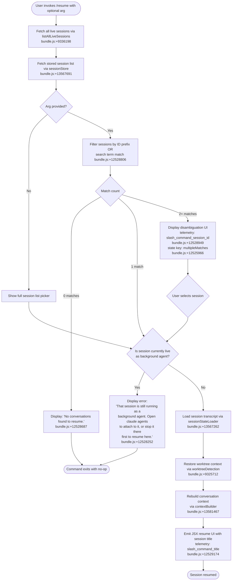

# `/resume`

> Analysis basis: CC v2.1.177 bundle.js (AST extraction + Claude interpretation)
> Minimum version: v2.1.177

---

## Overview

`/resume` (aliased as `/continue`) lets the user resume a previous Claude Code conversation by searching for it by session ID or a free-text search term. The command lists live and stored sessions, applies filtering and matching logic, and then reloads the matched conversation's state (transcript, worktree, context) into the current UI session.

---

## Registration

| Field | Value |
|---|---|
| type | `local-jsx` |
| name | `resume` |
| description | `Resume a previous conversation` |
| aliases | `["continue"]` |
| argumentHint | `[conversation id or search term]` |
| module_id | `Z3K` |
| load_inline | `true` |
| loc_byte | `12529652` |
| loc_byte_end | `12529849` |
| loc_line | `8611` |
| arbor_handler.name | `NoL` |
| arbor_handler.fqn | `claude-2.1.177::NoL` |
| arbor_handler.kind | `AsyncFunction` |
| arbor_handler.resolution_path | `module_id` |
| arbor_handler.n_hits | `0` |

Analysis basis: CC v2.1.177 bundle.js:+12529652

---

## Input Branching

The command has 5+ distinct control-flow branches (live session conflict, no sessions found, single exact match, multiple matches requiring disambiguation, and successful resume), requiring a Mermaid flowchart.



---

## Behavioral Spec

### 1. Entry Point — Main Handler (`NoL`)

```
async function resumeCommandHandler(userArg, appState):
    liveSessions = await fetchLiveSessionList()          // g$H → A.listAllLiveSessions
    storedSessions = await loadStoredSessions()          // d$H → ZKH session store
    allSessions = merge(liveSessions, storedSessions)

    if userArg is empty:
        candidates = allSessions
    else:
        candidates = filterSessionsByArg(allSessions, userArg)   // NoL → L.filter

    if candidates.length == 0:
        return renderText("No conversations found to resume.")   // bundle.js:+12528687

    if candidates.length > 1:
        return renderDisambiguationPicker(candidates,
            telemetryKey="slash_command_session_id")             // bundle.js:+12528949

    session = candidates[0]

    if isLiveBackgroundSession(session):                         // NoL → BN, bundle.js:+12528788
        return renderError(
            "That session is still running as a background agent…") // bundle.js:+12528252

    return await doResume(session, appState)
```

Analysis basis: CC v2.1.177 bundle.js:+12528242

---

### 2. Live Session Detection (`liveSessionFetcher` / `g$H`)

```
async function fetchLiveSessionList():
    await Promise.resolve()                    // g$H → Promise.resolve, bundle.js:+9336146
    sessions = await A.listAllLiveSessions()   // bundle.js:+9336198
    // sessions flagged "interactive" are eligible for resume
    // sessions flagged "interactive" literal: bundle.js:+9336289
    return sessions.filter(s => s.mode == "interactive")
```

Analysis basis: CC v2.1.177 bundle.js:+9336146

---

### 3. Session Filter Logic (`filterSessionsByArg`)

```
function filterSessionsByArg(sessions, arg):
    normalizedArg = arg.toLowerCase()          // A.toLowerCase, bundle.js:+17010467

    // Attempt exact UUID prefix match first
    uuidMatches = sessions.filter(s => s.id.startsWith(normalizedArg))
    if uuidMatches.length > 0:
        return uuidMatches

    // Fall back to full-text search on title / last-prompt
    return sessions.filter(s =>
        sessionMatchesSearchTerm(s, normalizedArg))
```

Analysis basis: CC v2.1.177 bundle.js:+12528806

---

### 4. Background Agent Guard (`backgroundSessionGuard` / `BN`)

```
function isLiveBackgroundSession(session):
    // Uses regex test to detect sessions still attached to a background agent
    return e17Regex.test(session.agentState)     // BN → e17.test, bundle.js:+4249649
```

If this returns `true`, the command short-circuits with the literal error message `"That session is still running as a background agent. Open \`claude agents\` to attach to it, or stop it there first to resume here."` (bundle.js:+12528252).

Analysis basis: CC v2.1.177 bundle.js:+12528788

---

### 5. Session State Loader (`sessionStateLoader` / `d$H`)

```
async function loadSessionState(sessionId):
    rawRecords = await readSessionStore(sessionId)   // d$H → ZKH, bundle.js:+13567691
    // ZKH is the main session-store manager; it holds maps keyed by:
    //   "summary", "last-prompt", "custom-title", "ai-title", "tag",
    //   "agent-name", "mode", "permission-mode", etc.
    parsed = parseSessionChain(rawRecords)           // d$H → Q$H, bundle.js:+13567824
    sorted = sortByTimestamp(parsed)                 // d$H → id8, bundle.js:+13567727
    return buildSessionSnapshot(sorted)              // d$H → MPA, bundle.js:+13560260
```

Analysis basis: CC v2.1.177 bundle.js:+13567262

---

### 6. Worktree Context Restoration (`worktreeDetector` / `B$H`)

```
async function restoreWorktreeContext(session):
    // Detect git worktree from session's stored path
    result = await runGit(["worktree", "list", "--porcelain"])
    // Literals: "worktree", "list", "--porcelain" — bundle.js:+9325623, +9325630
    lines = result.split("\n")
    // Parse "worktree " prefix (bundle.js:+9325831) with 9-char slice (bundle.js:+9325865)
    worktrees = parseWorktreeLines(lines)
    match = worktrees.find(wt => wt.path.startsWith(session.cwd))
    if match:
        return normalizeWorktreePath(match)          // B$H → Mz, bundle.js:+9325854
    return null
```

Telemetry: `tengu_worktree_detection` emitted at bundle.js:+9325712.

Analysis basis: CC v2.1.177 bundle.js:+9325568

---

### 7. Context Builder (`contextBuilder` / `rB6` → `QEK`)

```
async function buildResumptionContext(session, worktree):
    // Computes the file list and transcript snapshot to inject as context
    files = await collectProjectFiles(worktree.path)    // QEK → OPA, iK.readdir
    transcript = await loadTranscript(session.id)       // rB6 → xBH
    // Merges file-history-snapshot, attribution-snapshot, content-replacement,
    // fork-context-ref records from session store (bundle.js:+13576087 ff.)
    contextItems = mergeContextRecords(files, transcript)
    return contextItems
```

Analysis basis: CC v2.1.177 bundle.js:+13581467

---

### 8. JSX Resume UI Render (`resumeUIRenderer` / `G3K`)

```
function renderResumeUI(session, contextResult):
    // Uses bold styling (G3K → j6.bold, bundle.js:+12525930)
    // Emits session title via telemetry key slash_command_title (bundle.js:+12529174)
    // Renders OJ.createElement tree (bundle.js:+12528538) with:
    //   - session title / summary
    //   - last-prompt preview
    //   - timestamp via Date.now (bundle.js:+12528564)
    return <ResumeCard session={session} context={contextResult} />
```

Analysis basis: CC v2.1.177 bundle.js:+12529224

---

### 9. Error States

| Condition | Output | loc_byte |
|---|---|---|
| No sessions match arg | `"No conversations found to resume."` | +12528687 |
| Session is live background agent | Long warning directing user to `claude agents` | +12528252 |
| Multiple matches (disambiguation) | Picker rendered; state key `multipleMatches` | +12525966 |
| Session not found (state key) | state key `sessionNotFound` | +12525895 |

---

## State & Side Effects

| Item | Detail |
|---|---|
| Telemetry | `tengu_daemon_control` (bundle.js:+17020740), `tengu_worktree_detection` (bundle.js:+9325712), `tengu_daemon_config_reload` (bundle.js:+16999057), `tengu_bg_proto_mismatch` (bundle.js:+16968964), `tengu_bg_dispatch_stale_drop` (bundle.js:+16970363), `tengu_bg_attach_legacy_autorespawn` (bundle.js:+16973251), `tengu_bg_attach` (bundle.js:+16974409), `tengu_bg_attach_stall_gave_up` (bundle.js:+16975332), `tengu_bg_attach_stall_respawn` (bundle.js:+16975602), `tengu_bg_attach_kick` (bundle.js:+16976594), `tengu_bg_dispatch_sigkill_escalate` (bundle.js:+16983179), `tengu_transcript_phantom_parent` (bundle.js:+13573710), `tengu_relink_walk_broken` (bundle.js:+13554701), `tengu_transcript_parent_cycle` (bundle.js:+13577502), `tengu_chain_parent_cycle` (bundle.js:+13555191), `tengu_chain_timestamp_fallback` (bundle.js:+13555340), `tengu_chain_parallel_tr_recovered` (bundle.js:+13557206), `tengu_bg_low_mem_mb` (bundle.js:+13373708), `tengu_bg_spare_enable` (bundle.js:+16984484), `tengu_bg_spare_claim` (bundle.js:+16984612), `tengu_bg_spare_claim_fail` (bundle.js:+16984878), `tengu_bg_retire_grace_bridged_min` (bundle.js:+13373826), `tengu_bg_retire_pinned_low_mem` (bundle.js:+16987890), `tengu_bg_attach_upgrade` (bundle.js:+13373898), `tengu_bg_prewarm_per_sweep` (bundle.js:+16988011) |
| Hook registration | `slash_command_session_id` custom metric emitted on session selection (bundle.js:+12528949); `slash_command_title` emitted on successful resume display (bundle.js:+12529174) |
| appState changes | Active session ID updated to resumed session; transcript, worktree context, and file-history-snapshot injected into current session state; session store maps (`summary`, `last-prompt`, `custom-title`, `ai-title`, `tag`, `mode`, `permission-mode`) loaded from `ZKH` |
| Sound | <!-- TODO: not found in depth-2 traversal; needs --depth 4 --> |
| Daemon interaction | Queries daemon for live session list via `A.listAllLiveSessions` (bundle.js:+9336198); background-attached sessions blocked from resume with explicit error |

---

## Version History

| Version | Change |
|---|---|
| v2.1.177 | Initial analysis |

---

## Common Mistakes

1. **Attempting to resume a background agent session directly** — if the session is still attached to a background agent, `/resume` refuses with an explicit error message. Use `/agents` to attach to or stop it first.
2. **Ambiguous search terms** — if the search term matches multiple sessions, a disambiguation picker is shown rather than resuming automatically; supply enough of the session UUID (prefix) to uniquely identify the target.
3. **Using `/resume` with a stale conversation ID** — if the session ID no longer exists in the session store, the command returns `"No conversations found to resume."` without error; verify the ID with the picker (run `/resume` with no argument).
4. **Confusing `/resume` with re-attaching to a running daemon job** — `/resume` restores a stored conversation history; to attach to a live running session, use `claude agents` instead.
5. **Worktree mismatch** — if the original session was created in a different git worktree, the worktree detector may fail silently; the conversation history will still load but file-context suggestions may reflect the wrong working directory.

---

## Appendix — Identifier Mapping

> For bundle debugging only. Identifiers change across versions.

| Identifier | Role |
|---|---|
| `NoL` | Main handler for `/resume` command (AsyncFunction, Arbor-resolved) |
| `E3K` | Session list pre-filter / candidate builder |
| `g$H` | Live session fetcher (calls `A.listAllLiveSessions`) |
| `B$H` | Worktree context detector (runs `git worktree list --porcelain`) |
| `d_` | Process/session lifecycle orchestrator |
| `zhH` | Subprocess/worker spawn manager |
| `kH` | Error logger / error handler utility |
| `jA` | Error construction helper |
| `A6` | String coercion utility |
| `qq` | Telemetry / analytics dispatcher |
| `ScA` | Analytics string builder |
| `hUf` | Circular buffer manager (shift/push) |
| `TH` | String type assertion helper |
| `d$H` | Session state loader (reads session store, parses chain) |
| `ZKH` | Session store manager (holds all session metadata maps) |
| `id8` | Session record timestamp extractor |
| `Q$H` | Session chain builder / deduplicator |
| `af5` | Session chain NaN-guard validator |
| `sf5` | Session chain sort/merge resolver |
| `rf5` | Session chain shift-and-sort helper |
| `pEK` | Session chain partial-entry mapper |
| `tq6` | Session record transformer (maps raw records) |
| `PPA` | Session prompt text normalizer |
| `OU6` | Session prompt content extractor |
| `yK` | Text trim/regex matcher for session search |
| `GPA` | Session filter predicate builder |
| `tf5` | Array/string presence validator |
| `ef5` | Array element predicate evaluator |
| `rd8` | Session record get/set helper |
| `od8` | Session record multi-value extractor |
| `MPA` | Session snapshot assembler (calls PPA, tq6, GPA) |
| `eq6` | Session context accessor (bulk map getter) |
| `gEK` | Session context initializer (calls ZKH, Object.assign) |
| `z45` | Session directory resolver (joins paths, calls iK.stat) |
| `iC` | Path existence checker |
| `b0` | Directory reader / recursive file lister |
| `ho` | Session resume context builder (calls B$H, QEK, xBH) |
| `rB6` | Transcript-to-context bridge (calls N, T_, QEK, xBH) |
| `QEK` | Project file collector / context file list builder |
| `xBH` | Transcript binary reader / session snapshot reader |
| `W45` | Session record binary parser |
| `eZH` | File-content chunk accumulator |
| `OPA` | Directory recursive scanner (iK.readdir based) |
| `FB6` | Context map get/set/merge helper |
| `Qw` | String slice/replace utility |
| `tF8` | Context file list builder entry point |
| `BN` | Background agent state detector (regex test via e17) |
| `uHH` | Session UI state renderer (initial load) |
| `HzH` | Session history search UI component |
| `G3K` | Resume UI card renderer (uses j6.bold) |
| `T_` | Working-directory resolver |
| `Mz` | Path normalizer (NFC normalization) |
| `ci` | Projects-directory path joiner |
| `z$` | Session ID formatter / shortener |
| `FPK` | Daemon status file reader (`daemon.status.json`) |
| `n9` | AsyncLocalStorage store accessor |
| `dU6` | Daemon status path builder |
| `CH` | JSON stringifier wrapper |
| `LbH` | MCP connection slot builder / reconnector |
| `_o8` | MCP connection result applier |
| `yZA` | MCP server state updater |
| `M` | MCP hub state manager |
| `jI5` | PTY/IPC session message dispatcher |
| `P` | PTY/IPC stream handler |
| `mL` | PTY stream end/close helper |
| `D` | Worker/session lifecycle manager |
| `EVA` | Worker claim/connect handler |
| `yVA` | Worker session cleanup / file remover |
| `k` | Supervisor sweep / grace-clock manager |
| `c` | Scheduled-task grace-clock tracker |
| `R` | Supervisor write/drain handler |
| `ZB6` | Memory-check helper (calls Dd8, FGK.freemem) |
| `gGK` | Low-memory session shedder |
| `jd8` | Scheduled-task fire helper |
| `d8` | Generic identity/passthrough helper |
| `l` | Worker retire-if-settled helper |
| `S` | Daemon socket write helper |
| `Q` | IPC socket connection manager |
| `$6` | Session spawn/claim dispatcher |
| `aSH` | Session file lstat/rm/readFile helper |
| `Dd8` | macOS memory diagnostics helper |
| `l8` | Abort-controller / timeout wrapper |
| `bH` | Feature-flag bad-path telemetry emitter |
| `IH` | Feature-flag ok-path telemetry emitter |
| `b` | Background session roster entry |
| `I` | Worker instance tracker |
| `n` | Key-event preventDefault handler |
| `$45` | Session binary file reader (openSync/readSync) |
| `M45` | Binary transcript record parser |
| `L45` | Buffer comparison helper |
| `FEK` | Buffer `.at()` accessor helper |
| `AH` | Buffer comparison/subarray set |
| `c6` | JSON.parse wrapper |
| `KYH` | JSON.parse wrapper (alternative path) |
| `JEK` | Transcript index builder / walk helper |
| `if5` | Transcript relink walker |
| `O1` | Scheduler / nM6 timer caller |
| `WhH` | JSONL chunk reader (cgf/lgf/igf/ngf) |
| `lgf` | JSONL line finder (indexOf based) |
| `igf` | JSONL partial-record assembler |
| `ngf` | JSONL boundary-record parser |
| `cgf` | JSONL stream initializer |
| `M9` | Z8 state accessor |
| `x` | IPC socket close/emit helper |
| `C` | PTY write/clearTimeout helper |
| `O45` | Session binary header reader (openSync/readSync/closeSync) |
| `fbH` | MCP update signal broadcaster |
| `a` | MCP client state reducer |
| `e` | MCP server update applier |
| `bs` | zLH-based logger/tracer |
| `LH` | Input line parser (trim/D/M/B/F) |
| `o` | zl8-based stream |
| `t` | Timeout-ref component |
| `p` | PTY session ref |
| `y` | UI state atom |
| `V` | Context list accumulator |
| `j` | Process values/kill map |
| `X` | Timeout map (setTimeout based) |
| `G` | Keyboard input handler (full vi-mode dispatcher) |
| `J` | Flat-map list holder |
| `W` | MCP SDK connection manager |
| `E` | Math.max/min bounded value helper |
| `w` | Supervisor config/start/stop manager |
| `T` | replaceAll string helper |
| `K` | padEnd column formatter |
| `f1` | File list helper |
| `N` | Conversation context builder (main) |
| `tff` | Vy/FH_/WyA context formatter |
| `xf` | Path redactor / segment replacer |
| `kQH` | BkA-based token counter |
| `A4f` | File content reader / Buffer.byteLength counter |
| `Kgf` | String coercion / format helper |
| `L5` | <!-- TODO: not found in depth-2 traversal; needs --depth 4 --> |
| `Z8` | State store ref |
| `EX` | Forced-shutdown message emitter |
| `Y` | Process.exit / abort orchestrator |
| `z` | Daemon IH/bH/gS/hB abort manager |
| `UiA` | _gf/mnA/_.unshift process builder |
| `G4_` | IiA-based process option builder |
| `T4_` | IiA/aFf process option builder |
| `Z4_` | eFf process option builder |
| `nnA` | Number.isFinite / TypeError validator |
| `VY6` | JFf/Error/Boolean promise runner |
| `W4_` | Reflect.apply/defineProperty wrapper |
| `ZiA` | H.on event-emitter wrapper |
| `lnA` | setTimeout/Promise.race timeout runner |
| `inA` | ws/H.kill process kill helper |
| `dnA` | H/TFf data-event handler |
| `cnA` | H.kill signal sender |
| `TiA` | P4_/Promise.all/X4_ parallel runner |
| `yY6` | tf_ yield helper |
| `WiA` | lFf/ft6/A.pipe stream pipe helper |
| `GiA` | JiA.default/A.add signal handler |
| `snA` | $4_.bind stream binder |
| `HzH` | Session history search component (UI) |
| `G3K` | Resume card UI renderer |

---

Note: index built via Arbor fallback; some signals (telemetry, literals) may be missing — see arbor-fallback.js.