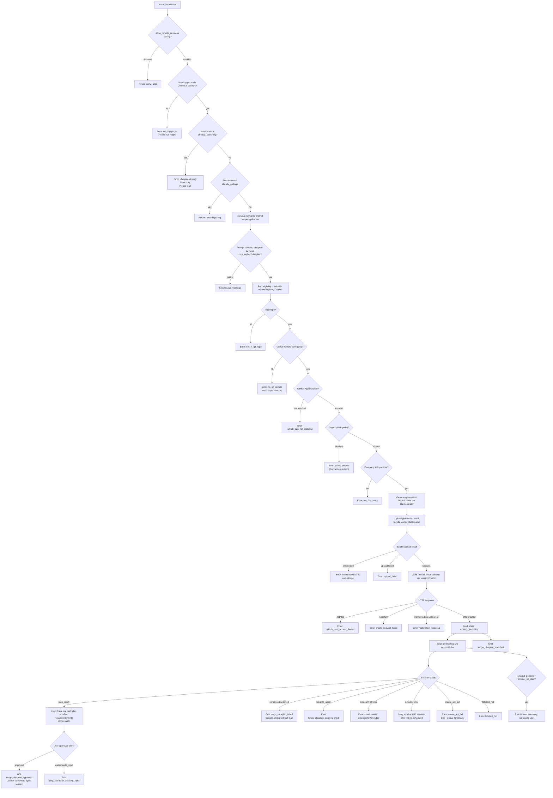

# `/ultraplan`

> Analysis basis: CC v2.1.177 bundle.js (AST extraction + Claude interpretation)
> Minimum version: v2.1.177

---

## Overview

`/ultraplan` drafts an editable plan in Claude Code on the web by launching a cloud ("teleport") session against a remote environment. The command bundles the current git repository, uploads it to a cloud agent, polls for a plan result, and then injects the draft plan back into the local Claude Code conversation for the user to review and refine. It requires an active Claude.ai login, a git repository with at least one commit, and a configured GitHub remote.

---

## Registration

| Field | Value |
|---|---|
| type | `local-jsx` |
| name | `ultraplan` |
| description | `Draft an editable plan in Claude Code on the web ( ... ) · See ...` |
| argumentHint | `<prompt>` |
| load_inline | `true` |
| load_ident | `ooL` |
| loc_byte | `12561930` |
| loc_byte_end | `12562162` |
| loc_line | `8702` |
| arbor_handler.name | `ooL` |
| arbor_handler.fqn | `claude-2.1.177::ooL` |
| arbor_handler.kind | `AsyncFunction` |
| arbor_handler.resolution_path | `load_ident` |
| arbor_handler.n_hits | `1` |

Analysis basis: CC v2.1.177 bundle.js:+12561930

The handler was inlined into a `load:()=>Promise.resolve({call: ooL})` shape (no `module_id`). The call graph entry point is `ooL` (resolved via `load_ident` by the Arbor symbol graph).

---

## Input Branching

The command has more than three distinct branches across precondition checks, launch state guards, and session polling outcomes. A Mermaid flowchart is used below.



Analysis basis: CC v2.1.177 bundle.js:+12560064 (handler entry `ooL`), +12557511 (state guards), +9441013 (eligibility checks), +12553125 (plan injection literal)

---

## Behavioral Spec

### 1. Handler Entry — `ultraplanHandler` (`ooL`)

```
async function ultraplanHandler(context):
    if appState.allow_remote_sessions != true:
        return early  // skip silently

    promptText = parseAndNormalizePrompt(context.args)
    // "allow_remote_sessions" check at entry
    // Analysis basis: bundle.js:+12560082, +12560085

    sessionState = getAppState().ultraplanSessionState
    if sessionState == "already_launching":
        emit message: "ultraplan: already launching. Please wait..."
        return

    if sessionState == "already_polling":
        return

    result = await launchUltraplanFlow(context, promptText)
    setAppState with result
```

Analysis basis: CC v2.1.177 bundle.js:+12560064

---

### 2. Prompt Parsing — `promptParser` (`jm8` → `Dm8` → `MLA`)

```
function promptParser(rawInput):
    // Scan rawInput for the literal string "ultraplan" (case-insensitive, gi flag)
    // Analysis basis: bundle.js:+10857282 (literal "gi"), +10857634 (literal "ultraplan")

    matches = rawInput.matchAll(/ultraplan/gi)
    if no matches found and command was not explicit /ultraplan:
        return USAGE_ERROR:
            "Usage: /ultraplan <prompt>, or include 'ultraplan' anywhere in your prompt"

    // Strip the keyword occurrences and clean up surrounding whitespace
    // Replacement pattern "$1$2" collapses adjacent segments
    // Analysis basis: bundle.js:+10857959 (literal "$1$2")
    cleanedPrompt = rawInput.replace(matchedRegion, "$1$2")

    // Truncate or pad to fit pipeline (limit: 5 tokens context window adjustment)
    // Analysis basis: bundle.js:+10857982 (literal 5)
    return cleanedPrompt.slice(0, MAX_PROMPT_TOKENS)
```

Analysis basis: CC v2.1.177 bundle.js:+10857834

---

### 3. Remote Eligibility Check — `remoteEligibilityChecker` (`Jyq`)

```
async function remoteEligibilityChecker(context):
    emit telemetry: "bg_remote_eligibility_check"

    // 1. Login check
    if not loggedIn:
        return error("not_logged_in",
            "Please run /login and sign in with your Claude.ai account (not Console).")
    // Analysis basis: bundle.js:+9441138, +9441160

    // 2. Git repo check
    if not inGitRepo:
        return error("not_in_git_repo")
    // Analysis basis: bundle.js:+9441239

    // 3. GitHub remote check
    if not hasGitHubRemote:
        return error("no_git_remote",
            "Cloud agents require a GitHub remote. Add one with `git remote add origin REPO_URL`.")
    // Analysis basis: bundle.js:+9441373, +9441395

    // 4. GitHub App installation check
    if not githubAppInstalled:
        return error("github_app_not_installed")
    // Analysis basis: bundle.js:+9441486

    // 5. Organization policy check
    if policyBlocked:
        return error("policy_blocked",
            "Cloud sessions are disabled by your organization's policy. Contact your organization admin.")
    // Analysis basis: bundle.js:+9441640, +9441663

    // 6. First-party API provider check
    if not firstPartyProvider:
        return error("not_first_party",
            "Cloud sessions are only available on the first-party Anthropic API provider.")
    // Analysis basis: bundle.js:+9364361, +9364440

    return eligible
```

Analysis basis: CC v2.1.177 bundle.js:+9439210

---

### 4. Session Creator — `cloudSessionCreator` (`Ko`)

```
async function cloudSessionCreator(context, prompt, bundleInfo):
    // Validate access token
    if no accessToken:
        return error("no_access_token",
            "No access token found for cloud session creation")
    // Analysis basis: bundle.js:+9364504, +9364777

    // Validate org UUID
    if no orgUUID:
        return error("no_org_uuid",
            "Unable to get organization UUID for cloud session creation")
    // Analysis basis: bundle.js:+9364831, +9365073

    // Set request headers
    headers = {
        "anthropic-beta": "ccr-byoc-2025-07-29",
        "x-organization-uuid": orgUUID,
        "Content-Type": "application/json",
        "anthropic-version": "2023-06-01"
    }
    // Analysis basis: bundle.js:+9365233, +9365250, +9365272

    // Environment selection: list environments
    environments = await listTeleportEnvironments()
    // Timeout for environment list: 15000 ms
    // Analysis basis: bundle.js:+9311489 (literal 15000)

    if no environments:
        // Attempt to auto-create default environment
        autoCreatedEnv = await createDefaultEnvironment()
        if autoCreatedEnv fails:
            warn: "Could not create a cloud environment. Set one up at https://claude.ai/code/onboarding?magic=env-setup"
            return error("env_create")
        // Analysis basis: bundle.js:+9367472

    // Generate title and branch name
    titleAndBranch = await generateTitleAndBranch(prompt)
    // Branch name prefix: "claude/task/" + slug (max 75 chars)
    // Analysis basis: bundle.js:+9352041, +9352047

    // Determine bundle source
    bundleSource = selectBundleSource(gitInfo)
    emit telemetry: "tengu_teleport_source_decision"
    emit telemetry: "tengu_teleport_bundle_mode"

    // POST session creation request
    response = await HTTP.post(sessionEndpoint, payload, headers)

    switch response.status:
        case 201:
            if response.body has no sessionId:
                return error("malformed_response",
                    "Server returned a malformed session response (no session id)")
            // Analysis basis: bundle.js:+9366995, +9367058
            return sessionId
        case 401, 403:
            return error("github_repo_access_denied")
            // Analysis basis: bundle.js:+9366617, +9366621, +9366668
        case 429:
            return error("create_request_failed")
            // Analysis basis: bundle.js:+9366625
        case 500:
            return error("create_request_failed")
            // Analysis basis: bundle.js:+9366513, +9366844
        case 409:
            // Conflict — duplicate session
            // Analysis basis: bundle.js:+9374697
            return error("conflict")
        default:
            return error("create_request_failed")
```

Analysis basis: CC v2.1.177 bundle.js:+9364184

---

### 5. Git Bundle Upload — `gitBundleUploader` (`YAA`)

```
async function gitBundleUploader(repoPath):
    emit telemetry: "tengu_ccr_bundle_upload"

    // Verify HEAD exists
    headExists = await git("rev-parse", "--verify", "HEAD")
    // Analysis basis: bundle.js:+9349504, +9349516, +9349527

    if headExists fails:
        return error("empty_repo", "Repository has no commits yet")
    // Analysis basis: bundle.js:+9348692, +9349074

    // Create stash bundle
    stashResult = await git("stash", "create")
    if stashResult fails:
        return error("stash_failed")
    // Analysis basis: bundle.js:+9349152, +9349160, +9349601

    // Write bundle files: "ccr-seed.bundle", "_source_seed.bundle"
    // Analysis basis: bundle.js:+9349959, +9349970, +9350266

    // Upload bundle; track result type: head | fallback_head | squashed | fallback_squashed
    // Analysis basis: bundle.js:+9350636, +9350675, +9350710, +9350753

    if upload fails:
        return error("upload_failed")
    // Analysis basis: bundle.js:+9350415

    return bundleUploadResult
```

Analysis basis: CC v2.1.177 bundle.js:+9348634

---

### 6. Session Poller — `ultraplanSessionPoller` (`coL` + `d3K`)

```
async function ultraplanSessionPoller(sessionId, timeoutMs):
    // Default timeout: 5400 seconds (90 minutes window, 30-minute hard cap enforced elsewhere)
    // Analysis basis: bundle.js:+12552818 (literal 5400)
    // Per-poll interval: 1000 ms; max session age: 1800000 ms (30 min)
    // Analysis basis: bundle.js:+9447780 (1000), +9447787 (1800000)

    emit telemetry: "tengu_ultraplan_timeout_seconds"

    startTime = Date.now()

    loop:
        status = await fetchSessionStatus(sessionId)

        switch status:
            case "plan_ready":
                emit telemetry: "tengu_ultraplan_plan_ready"
                planContent = extractPlanFromSession(sessionId)
                return { type: "plan_ready", plan: planContent }

            case "needs_input":
            case "requires_action":
                emit telemetry: "tengu_ultraplan_awaiting_input"
                return { type: "awaiting_input" }

            case "approved":
                emit telemetry: "tengu_ultraplan_approved"
                return { type: "approved" }

            case "completed":
            case "archived":
            case "terminated":
                emit telemetry: "tengu_ultraplan_failed"
                return { type: "failed" }

            case "running":
            case "pending":
            case "starting":
                // Continue polling
                wait(1000)

            case "error":
                return { type: "error" }

        elapsed = Date.now() - startTime
        if elapsed > 30 * 60 * 1000:
            return error: "cloud session exceeded 30 minutes"
            // Analysis basis: bundle.js:+9450428

        if pollerStoppedByCaller:
            throw Error("poll stopped by caller")
            // Analysis basis: bundle.js:+12543791

        // Network error: retry with backoff; after exhaustion emit "network_or_unknown"
        // Analysis basis: bundle.js:+12544070

        // Timeout states
        if status == "timeout_pending" or "timeout_no_plan":
            emit appropriate timeout message
            // Analysis basis: bundle.js:+12545187, +12545205

    // Minute-boundary timeout reporting uses "minute"/"minutes" labels
    // Analysis basis: bundle.js:+12544979, +12544988 (literals "minute", "minutes")
```

Analysis basis: CC v2.1.177 bundle.js:+12552781, +12543646

---

### 7. Plan Injection — `planInjector` (`doL`)

```
function planInjector(planContent):
    // Prefix the plan with the fixed preamble string
    preamble = "Here is a draft plan to refine:"
    // Analysis basis: bundle.js:+12553125

    output = [preamble, planContent].join("\n")
    return output
    // Injected into the active conversation as a system-role message
    // Analysis basis: bundle.js:+12560157 (literal "system")
```

Analysis basis: CC v2.1.177 bundle.js:+12553118

---

### 8. Post-Plan Flow — `ultraplanMainOrchestrator` (`roL`)

```
async function ultraplanMainOrchestrator(context, prompt):
    // Phase: precondition
    // Analysis basis: bundle.js:+12558104 (literal "precondition")

    setAppState("already_launching")

    // 1. Run eligibility check
    eligibility = await remoteEligibilityChecker(context)
    if eligibility.error:
        return eligibility.error

    // 2. Upload bundle
    bundleResult = await gitBundleUploader(context.repoPath)
    if bundleResult.error:
        return bundleResult.error

    // 3. Create cloud session
    session = await cloudSessionCreator(context, prompt, bundleResult)
    if session.error:
        // On create failure:
        emit telemetry: "tengu_ultraplan_create_failed" (if early error)
        // Analysis basis: bundle.js:+12557289
        return session.error

    emit telemetry: "tengu_ultraplan_launched"
    // Analysis basis: bundle.js:+12558996

    // Phase: task-notification
    // Analysis basis: bundle.js:+12558280 (literal "task-notification")

    // 4. Poll for plan
    pollResult = await ultraplanSessionPoller(session.id)

    switch pollResult.type:
        case "plan_ready":
            injectedPlan = planInjector(pollResult.plan)
            injectIntoConversation(injectedPlan, role="system")
            // User is now shown: "Refine local plan"
            // Analysis basis: bundle.js:+12558436 (literal "Refine local plan")

        case "failed":
            // Inject failure notice to agent:
            // "Cloud ultraplan session failed. Wait for the user's next instructions."
            // Analysis basis: bundle.js:+12555229
            emit telemetry: "tengu_ultraplan_failed"

        case "error" / "create_api_fail":
            // "create_api_fail" / "teleport_null" error codes
            // "See --debug for details."
            // Analysis basis: bundle.js:+12558672, +12558690, +12558772

        case "unexpected":
            // "Ultraplan hit an unexpected error during launch. Wait for the user's next instructions."
            // Analysis basis: bundle.js:+12559588
            // Error code: "unexpected_error"
            // Analysis basis: bundle.js:+12559416

    // Cleanup: archive any orphaned sessions
    // If archive fails: log "ultraplan: failed to archive orphaned session"
    // Analysis basis: bundle.js:+12559749

    // Final appState update
    setAppState({ ultraplanSessionState: null })
    // Analysis basis: bundle.js:+12560621
```

Analysis basis: CC v2.1.177 bundle.js:+12558021

---

### 9. GitHub App Install Check — `githubAppChecker` (`GmH`)

```
async function githubAppChecker(accessToken, orgUUID):
    if not accessToken:
        log: "checkGithubAppInstalled: No access token found, assuming app not installed"
        // Analysis basis: bundle.js:+9313225
        return false

    if not orgUUID:
        log: "checkGithubAppInstalled: No org UUID found, assuming app not installed"
        // Analysis basis: bundle.js:+9313338
        return false

    response = await HTTP.get(githubAppStatusEndpoint, headers)

    if response.status == 400:
        // Analysis basis: bundle.js:+9313996
        return false

    if isAxiosError(response):
        return false

    return response indicates app is installed
    // Logs "is" or "is not" accordingly
    // Analysis basis: bundle.js:+9313736, +9313741
```

Analysis basis: CC v2.1.177 bundle.js:+9313192

---

### 10. Remote Branch Detection — `remoteBranchDetector` (`uy`)

```
function remoteBranchDetector():
    // Query: git symbolic-ref --short refs/remotes/origin/HEAD
    // Analysis basis: bundle.js:+1155611, +1155626, +1155636
    result = git("symbolic-ref", "--short", "refs/remotes/origin/HEAD")

    if result succeeds:
        return extractBranchName(result)

    // Fallback: check for "main" then "master"
    // Analysis basis: bundle.js:+1155749, +1155756
    for branch in ["main", "master"]:
        if git("show-ref", "--quiet", branch) succeeds:
            return branch
    // Analysis basis: bundle.js:+1155818, +1155840

    return null
```

Analysis basis: CC v2.1.177 bundle.js:+1155569

---

## State & Side Effects

| Item | Detail |
|---|---|
| Telemetry — `tengu_ultraplan_create_failed` | Fired when the cloud session creation fails early (bundle.js:+12557289) |
| Telemetry — `tengu_ultraplan_prompt_identifier` | Fired when the prompt identifier is resolved (bundle.js:+12552951) |
| Telemetry — `tengu_ultraplan_launched` | Fired after successful session creation before polling begins (bundle.js:+12558996) |
| Telemetry — `tengu_ultraplan_timeout_seconds` | Fired at start of polling with the configured timeout value (bundle.js:+12552784) |
| Telemetry — `tengu_ultraplan_awaiting_input` | Fired when the session returns `needs_input` / `requires_action` (bundle.js:+12553428) |
| Telemetry — `tengu_ultraplan_plan_ready` | Fired when the cloud agent returns a ready plan (bundle.js:+12553496) |
| Telemetry — `tengu_ultraplan_approved` | Fired when the user approves the injected plan (bundle.js:+12553916) |
| Telemetry — `tengu_ultraplan_failed` | Fired when the cloud session ends without producing a plan (bundle.js:+12554805) |
| Telemetry — `tengu_ccr_bundle_seed_enabled` | Fired during bundle upload eligibility check (bundle.js:+9439683) |
| Telemetry — `tengu_ccr_bundle_upload` | Fired during git bundle upload phase (bundle.js:+9348956) |
| Telemetry — `tengu_teleport_bundle_mode` | Fired to record which bundle mode was selected (bundle.js:+9365594) |
| Telemetry — `tengu_ccr_session_link` | Fired when the session link is established (bundle.js:+9358939) |
| Telemetry — `tengu_teleport_source_decision` | Fired to record the source repository decision (bundle.js:+9371057) |
| Telemetry — `tengu_config_parse_error` | Fired if configuration parsing fails (bundle.js:+3338219) |
| Telemetry — `tengu_bg_dispatch_sigkill_escalate` | Fired if background session requires SIGKILL escalation (bundle.js:+16983179) |
| Telemetry — `tengu_bg_low_mem_mb` / `tengu_bg_dispatch_low_mem` | Fired if daemon detects low memory (bundle.js:+13373708, +16983780) |
| Telemetry — `tengu_bg_spare_enable` / `tengu_bg_spare_claim` / `tengu_bg_spare_claim_fail` | Background spare session lifecycle (bundle.js:+16984484, +16984612, +16984878) |
| Telemetry — `tengu_bg_sendclaim_failed` | Fired when a background session claim fails (bundle.js:+16961017) |
| Telemetry — `tengu_feature_ok` / `tengu_feature_bad` | General feature health reporting (bundle.js:+1018758, +1018825) |
| Telemetry — `tengu_scheduled_task_missed` | Fired if a scheduled task is missed (bundle.js:+16468672) |
| appState changes | `allow_remote_sessions` read at entry; `ultraplanSessionState` set to `"already_launching"` then `"already_polling"` during session lifecycle; cleared to `null` on completion |
| appState read | `_.getAppState()` called at bundle.js:+12560399 |
| appState write | `_.setAppState()` called at bundle.js:+12560621 |
| File system | Git bundle files written to temp path (`ccr-seed.bundle`, `_source_seed.bundle`); cleaned up via `_K6.unlink` after upload |
| File watching | `w38.watchFile` / `w38.unwatchFile` used for config file watching during session lifecycle (bundle.js:+3333840, +3334173) |
| Hook registration | `m9` → `XyA.register` called during session orchestration (bundle.js:+65203); `SmH` registers a `remote_agent` hook with random bytes session identifier (bundle.js:+9446099) |
| Sound/notification | `task-notification` phase literal at bundle.js:+12558280 indicates OS-level notification on session events |
| Conversation injection | Plan content prepended with `"Here is a draft plan to refine:"` and injected as a `system`-role message into the active conversation |
| Session timeout | Hard cap: 30 minutes (1,800,000 ms) per polling loop; configurable timeout reported as 5400 s upper bound (bundle.js:+12552818, +9447787) |
| Retry/backoff | Network errors trigger retry with exponential backoff; after exhaustion the error code `"network_or_unknown"` is used (bundle.js:+12544070) |

---

## Version History

| Version | Change |
|---|---|
| v2.1.177 | Initial analysis |

---

## Common Mistakes

1. **Running `/ultraplan` without a Claude.ai login** — The command requires OAuth-based Claude.ai authentication (not an API key). Users will see `"Please run /login and sign in with your Claude.ai account (not Console)."` (bundle.js:+9441160). API key authentication is explicitly rejected.
2. **No GitHub remote configured** — The cloud agent requires a `git remote add origin <REPO_URL>` GitHub remote. SSH or non-GitHub remotes may not satisfy the check at bundle.js:+9439879 (`"github.com"` host check).
3. **Invoking before the previous session finishes** — If a session is in the `"already_launching"` or `"already_polling"` state, the command returns immediately with a message rather than spawning a second session (bundle.js:+12557511, +12557529).
4. **Using `/ultraplan` in an organization with cloud session policy disabled** — The `"policy_blocked"` guard (bundle.js:+9441640) will reject the invocation; the error message instructs contacting the org admin.
5. **Running in a repository with no commits** — The git bundle upload will fail with `"empty_repo"` / `"Repository has no commits yet"` (bundle.js:+9348692). Running `git add . && git commit -m "initial"` first is required.
6. **Expecting instant results** — The poller waits up to 30 minutes for the cloud agent to return a plan. If the plan is not ready within that window the session is reported as exceeding its time limit (bundle.js:+9450428).
7. **Confusing the plan-injection phase with final execution** — `/ultraplan` only drafts and injects a plan for user review (`"Refine local plan"`, bundle.js:+12558436). A separate approval step triggers the full remote agent run.

---

## Appendix — Identifier Mapping

> For bundle debugging only. Identifiers change across versions.

| Identifier | Role |
|---|---|
| `ooL` | Main `ultraplan` async handler (entry point) |
| `jm8` | Prompt pre-processor / keyword scanner |
| `Dm8` | Prompt normalization helper |
| `MLA` | Prompt keyword matcher (regex `matchAll`, `"ultraplan"` literal) |
| `$9` | Remote session eligibility gate / feature-flag resolver |
| `Eg1` | Feature-flag loader |
| `AJH` | Account type resolver (firstParty / enterprise / team) |
| `xb` | Subscription tier checker |
| `HP6` | Config file reader (`readFileSync`, utf-8) |
| `yLH` | Policy / telemetry-opt-in checker (`allow_product_feedback`) |
| `qq` | Telemetry consent resolver |
| `ScA` | Traffic classification helper (`"essential-traffic"`, `"no-telemetry"`) |
| `A6` | String conversion / coercion utility |
| `GLH` | App-state getter wrapper |
| `n$H` | Remote-session allow-flag reader |
| `YU6` | Session launch orchestrator (outer shell) |
| `d` | Logger / debug emitter |
| `K6` | Key-value app-state accessor |
| `nM6` | App-state store primitive |
| `f` | Async task tracker (add / delete / finally) |
| `s3K` | Session state setter |
| `qg8` | Session identifier builder |
| `Ag8` | Session record initializer |
| `$6` | Session registry / cache accessor |
| `FoL` | Session cleanup helper |
| `roL` | Core ultraplan orchestrator (precondition → bundle → POST → poll) |
| `ETH` | Eligibility check dispatcher |
| `Jyq` | Remote eligibility checker (login, git, GitHub, policy) |
| `c9` | Error formatter |
| `eG` | Platform error helper |
| `W5` | Warning emitter |
| `doL` | Plan content assembler (joins preamble + plan body) |
| `QoL` | Plan content extractor |
| `BoL` | Plan body parser |
| `Ko` | Cloud session creator (POST, env-select, branch-detect, bundle-upload phases) |
| `u6` | Auth token accessor |
| `rf` | Token refresh handler |
| `t$` | OAuth token state machine (`"refreshed"` literal) |
| `mS8` | HTTP header builder for Anthropic API |
| `kH` | HTTP error classifier / logger |
| `Ib` | API response validator |
| `F1` | OAuth endpoint resolver (local / staging / prod) |
| `ID` | JSON content-type header injector |
| `YAA` | Git bundle uploader (stash, create, upload) |
| `I6` | Platform helper (error codes) |
| `N` | Logger with level routing (debug / warn / error) |
| `tH` | Timestamp utility (`nM6` wrapper) |
| `Pb` | Git remote URL resolver (`git config --get remote.origin.url`) |
| `mhq` | Remote task record builder (UUID, event, control_request) |
| `zC6` | Object-key sanitizer for POST payload |
| `CH` | JSON serializer wrapper |
| `uhq` | Session-link telemetry emitter |
| `TS8` | Request cancellation check |
| `xHH` | Teleport environment lister (`teleport_environments_list`) |
| `iq6` | Default environment creator (`teleport_default_environment_create`) |
| `TH` | String coercion utility |
| `O` | Background session process descriptor |
| `mOL` | Branch / title generator (`teleport_generate_title`, `claude/task/` prefix) |
| `rS` | Session registry writer |
| `GmH` | GitHub App install checker |
| `uy` | Default branch detector (`symbolic-ref`, `show-ref`) |
| `g1` | UI element renderer |
| `W_H` | Git remote URL normalizer / parser |
| `i` | Stream output writer |
| `jA` | Error constructor wrapper |
| `Oz` | Cancellation error detector |
| `pz` | Abort-signal propagator |
| `oY` | Claude.ai base URL resolver (localhost / staging / prod) |
| `C_` | Module initializer / ESM interop |
| `UU_` | URL environment selector |
| `noL` | Boolean coercion helper for session flags |
| `SmH` | Remote-agent session runner / poller entry |
| `eI` | Random-bytes session-token generator |
| `pq6` | Temp file opener for session artifact |
| `H0` | Session pending-state writer |
| `TzL` | Session status formatter |
| `Gyq` | Session event loop / streaming poller |
| `Vv` | Background task state manager |
| `n0L` | Task-started event emitter |
| `c0L` | Task-updated event emitter |
| `pKA` | Task persistence writer |
| `i0L` | Local-workflow task initializer |
| `r0L` | Task status updater |
| `mKH` | Task state machine (active / aborted / user_typed) |
| `coL` | Ultraplan session poller (status loop, timeout logic) |
| `d3K` | Inner poll loop with retry / backoff |
| `UoL` | Session registry lookup |
| `ioL` | Session progress extractor |
| `CC6` | Session artifact cleanup (`iK.unlink`) |
| `K` | Column formatter (padEnd) |
| `BU` | Session result poster / HTTP response handler |
| `m9` | Hook registrar (`XyA.register`) |
| `loL` | Session launch completion handler |
| `R6` | Configuration reader (global + local config merge) |
| `Q6` | Config file path resolver |
| `NN_` | Config schema validator |
| `G5H` | Config loader with backup / migration |
| `c6` | JSON parser wrapper |
| `Jm` | Config key normalizer (startsWith / slice) |
| `Z8` | Config serializer |
| `sK9` | Local config directory scanner |
| `yN_` | Config backup path builder |
| `$` | Filesystem path helper |
| `D` | Background session daemon manager |
| `b` | Background session process wrapper |
| `l8` | Async timeout wrapper (setTimeout / clearTimeout) |
| `bH` | Feature-bad reporter |
| `IH` | Feature-ok reporter |
| `Dd8` | macOS memory pressure checker |
| `aSH` | Session artifact file reader / cleaner |
| `Q` | IPC socket manager (connect / drain / pong / auth) |
| `EVA` | Background session claim sender |
| `yVA` | Background session lifecycle manager (spawn → done / killed / crashed) |
| `Y` | Forced-shutdown handler (process.exit + z.abort) |
| `B` | Session disposable wrapper |
| `ng4` | Config file watcher (watchFile / unwatchFile) |
| `Kg` | Config watch debouncer |
| `s76` | Remote session precondition bundle (Pb + rS + GmH + y4 + u6 + A6 + GmH) |