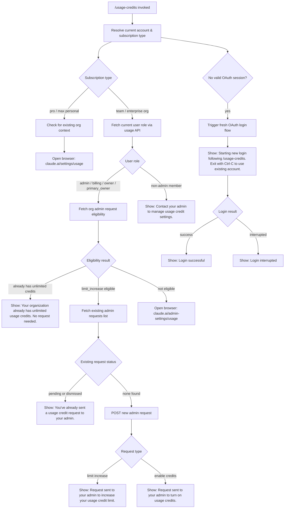

# `/usage-credits`

> Analysis basis: CC v2.1.176 bundle.js (AST extraction + Claude interpretation)
> Minimum version: v2.1.176

---

## Overview

`/usage-credits` is a local JSX command that helps users configure usage credits when they hit a usage limit. It inspects the current account's subscription and organizational role, then either notifies the user they already have unlimited credits, guides them through requesting a credit limit increase from their organization admin, or opens the appropriate browser URL for self-service management. The command initiates a fresh OAuth login flow if the current session is insufficient for the operation.

---

## Registration

| Field | Value |
|---|---|
| type | `local-jsx` |
| name | `usage-credits` |
| description | `Configure usage credits to keep working when you hit a limit` |
| module_id | `p1A` |
| load_inline | `true` |
| loc_byte | `9689675` |
| loc_byte_end | `9689885` |
| loc_line | `4163` |
| arbor_handler.name | `Mb6` |
| arbor_handler.fqn | `claude-2.1.176::Mb6` |
| arbor_handler.kind | `AsyncFunction` |
| arbor_handler.resolution_path | `module_id` |
| arbor_handler.n_hits | `0` |

Analysis basis: CC v2.1.176 bundle.js:+9689675

---

## Input Branching

The command exhibits five or more distinct decision paths based on account type, organizational role, subscription status, and existing request state. A Mermaid flowchart is used below.



---

## Behavioral Spec

### Top-Level Handler (`Mb6`)

The async handler `Mb6` is the entry point resolved via `module_id` → `p1A`.

```
async function usageCreditsHandler(context):
    account = resolveCurrentAccount(context)         // via Mq
    subscriptionType = getSubscriptionType(account)  // "pro" | "max" | "team" | "enterprise"

    if not account.hasValidOAuthToken():
        displayMessage("Starting new login following /usage-credits. Exit with Ctrl-C...")
        loginResult = await performOAuthLogin()      // via CV, RTH
        if loginResult.success:
            displayMessage("Login successful")
        else:
            displayMessage("Login interrupted")
        return

    await runCreditFlow(account, subscriptionType)   // via CR8
```

Analysis basis: CC v2.1.176 bundle.js:+9687739

---

### Account & Subscription Resolution (`Mq`)

```
function resolveAccountInfo(context):
    authProvider = detectAuthProvider()    // aY_, oY_
    settings = loadFlagSettings()          // sw → cV("flagSettings")
    oauthProfile = resolveOAuthProfile()   // sw → Fj → "profile-implicit", "user_oauth"
    return { authProvider, settings, oauthProfile }
```

Supported provider strings detected at this layer:

- `"bedrock"` (bundle.js:+2118121)
- `"foundry"` (bundle.js:+2118171)
- `"anthropicAws"` (bundle.js:+2118227)
- `"mantle"` (bundle.js:+2118281)
- `"vertex"` (bundle.js:+2118329)
- `"firstParty"` (bundle.js:+2118338)

Subscription types recognized: `"pro"` (bundle.js:+9687750), `"max"` (bundle.js:+9687761).

Analysis basis: CC v2.1.176 bundle.js:+3291257

---

### OAuth Login Initiation (`RTH`)

When no valid token exists, `RTH` orchestrates a new login. It calls `H.onChangeAPIKey` and `H.applyMessageOp` to update the account state, then triggers the full OAuth flow via `KA6` (remote settings) and `Ny6` (policy limits). It also stores the new credentials via `mf` / `aI1` (credential storage layer) and re-enrolls a trusted device via `Ry6`.

```
async function handleAuthChange(context):
    H.onChangeAPIKey(...)
    H.applyMessageOp(...)
    if sameAccountRe-login():
        log("[trusted-device] Same account+org re-login with existing token, skipping re-enrollment")
        return
    await loadRemoteSettings(KA6)
    await loadPolicyLimits(Ny6)
    await enrollTrustedDevice(Ry6)
    persistCredentials(mf)
```

Analysis basis: CC v2.1.176 bundle.js:+9637153

---

### Usage API Fetch (`bTH`)

`bTH` fetches current OAuth usage data from the Anthropic API.

```
async function fetchUsageData(orgUUID, authToken):
    endpoint = "/api/oauth/usage"                  // bundle.js:+9641146
    response = await HTTP.get(endpoint, {
        timeout: 5000,                             // bundle.js:+9641174
        headers: {
            "Content-Type": "application/json"    // bundle.js:+9641188, +9641203
        },
        authMode: "no-auth"                        // bundle.js:+9641288
    })

    if response.status == 401:
        refreshTokenAndRetry()
        log(" (401→refresh→retry succeeded)")     // bundle.js:+9641389
    return response.data
```

API path: `/api/oauth/usage` (bundle.js:+9641146)
Timeout: 5000 ms (bundle.js:+9641174)
Auth-refresh annotation: `" (401→refresh→retry succeeded)"` (bundle.js:+9641389)

Analysis basis: CC v2.1.176 bundle.js:+9641014

---

### Admin Request Eligibility Check (`tkq`)

```
async function checkAdminRequestEligibility(orgUUID, authToken):
    action = "api_admin_request_eligibility"    // bundle.js:+9640649
    response = await HTTP.get(action, orgUUID)

    if response contains "teleport-org":        // bundle.js:+9640797
        handleSpecialOrgCase()

    return eligibilityResult                    // e.g. "limit_increase"
```

Analysis basis: CC v2.1.176 bundle.js:+9640646

---

### Admin Request List Fetch (`skq`)

```
async function listAdminRequests(orgUUID, authToken):
    action = "api_admin_request_list"           // bundle.js:+9640298
    response = await HTTP.get(action, { statuses: "..." })  // bundle.js:+9640401
    return response.requests
```

If any existing request has status `"pending"` or `"dismissed"` (bundle.js:+9642507, +9642517), the handler surfaces the message: `"You've already sent a usage credit request to your admin."` (bundle.js:+9642576).

Analysis basis: CC v2.1.176 bundle.js:+9640295

---

### Admin Request Creation (`akq`)

```
async function createAdminRequest(orgUUID, authToken, requestType):
    action = "api_admin_request_create"         // bundle.js:+9640033
    endpoint = "/api/oauth/organizations/:orgUUID/admin_requests"  // bundle.js:+9640090
    response = await HTTP.post(endpoint, { type: requestType })

    if requestType == "limit_increase":
        showMessage("Request sent to your admin to increase your usage credit limit.")
        // bundle.js:+9642815
    else:
        showMessage("Request sent to your admin to turn on usage credits.")
        // bundle.js:+9642881
```

Analysis basis: CC v2.1.176 bundle.js:+9640030

---

### HTTP Error Classification (`HSq` / `qZ`)

```
function classifyHttpError(error):
    if OA.isAxiosError(error):
        if error.status == 401:
            triggerTokenRefresh()
        elif error.status == 403:
            // permission denied
        elif error.status == 500:
            // server error — bundle.js:+9641592
        if error.message contains "OAuth token has been revoked":
            // bundle.js:+3308866
            invalidateSession()
    return classifiedError
```

HTTP status codes handled: 401 (bundle.js:+3308772), 403 (bundle.js:+3308800), 429 (bundle.js:+181570), 500 (bundle.js:+9641592).

Analysis basis: CC v2.1.176 bundle.js:+9641509

---

### Role Gate Logic (`hS`)

```
function checkRolePermission(userRole):
    adminRoles = ["admin", "billing", "owner", "primary_owner"]
    // bundle.js:+2123818, +2123826, +2123836, +2123844
    if userRole in adminRoles:
        return true   // may call admin endpoints
    else:
        showMessage("Contact your admin to manage usage credit settings.")
        // bundle.js:+9642341
        return false
```

Analysis basis: CC v2.1.176 bundle.js:+9641963

---

### Org Type Gate (`CR8` preamble)

```
function checkOrgType(subscription):
    orgTypes = ["team", "enterprise"]     // bundle.js:+9641934, +9641946
    if subscription.orgType not in orgTypes:
        // personal plan — open self-service URL
        openBrowser("https://claude.ai/settings/usage")  // bundle.js:+9643223
        return
    // continue with admin-request flow
```

Analysis basis: CC v2.1.176 bundle.js:+9641923

---

### Browser Launch (`rK`)

```
function openURL(url):
    if platform == "darwin":
        spawn("open", url)          // bundle.js:+9643182, +6294585
    elif platform == "win32":
        spawn("rundll32", "url,OpenURL", url)   // bundle.js:+6294511, +6294523
    else:
        spawn("xdg-open", url)      // bundle.js:+6294592
    log("browser-opened")           // bundle.js:+9643290
```

Admin URL: `"https://claude.ai/admin-settings/usage"` (bundle.js:+9643182)
User URL: `"https://claude.ai/settings/usage"` (bundle.js:+9643223)

Analysis basis: CC v2.1.176 bundle.js:+6294339

---

### Unlimited Credits Short-Circuit (`CR8`)

When the API response indicates the organization already has unlimited credits, the handler immediately returns:

- Message: `"Your organization already has unlimited usage credits. No request needed."` (bundle.js:+9642182)
- Response field checked: `"message"` (bundle.js:+9642166)

Analysis basis: CC v2.1.176 bundle.js:+9642020

---

### Remote Settings & Policy Limits (`KA6` / `Ny6`)

`KA6` manages remote managed settings with SHA-256-based cache validation, ETag-style 304 handling, and a security dialog for new settings. `Ny6` manages policy limits with similar caching. Both are triggered when the authentication state changes.

Key log strings:
- `"Remote settings: Cache still valid (304 Not Modified)"` (bundle.js:+7466729)
- `"Remote settings: Using stale cache after fetch failure"` (bundle.js:+7466560)
- `"Policy limits: Applied new restrictions successfully"` (bundle.js:+7419389)
- `"Policy limits: Using stale cache after fetch failure"` (bundle.js:+7419005)

Telemetry events fired here: `tengu_policy_limits_fetch` (bundle.js:+7418578), `tengu_managed_settings_security_dialog_shown` (bundle.js:+7461059).

Analysis basis: CC v2.1.176 bundle.js:+7467871

---

### Subscription Type Detection (`qXH` / `NA`)

```
function detectSubscriptionType(account):
    // Stripe paths
    if account.subscriptionType == "stripe_subscription":           // bundle.js:+3291010
        return mapStripeType(account)
    elif account.subscriptionType == "stripe_subscription_contracted":  // bundle.js:+3291037
        return "enterprise"
    elif account.subscriptionType == "apple_subscription":          // bundle.js:+3291075
        return "pro"
    elif account.subscriptionType == "google_play_subscription":    // bundle.js:+3291101
        return "pro"
```

Analysis basis: CC v2.1.176 bundle.js:+3290963

---

## State & Side Effects

| Item | Detail |
|---|---|
| Telemetry: `tengu_ember_latch` | Fired at handler entry via `$6` (bundle.js:+9687786) |
| Telemetry: `tengu_feature_ok` | Fired on successful feature gate pass (bundle.js:+1018758) |
| Telemetry: `tengu_feature_bad` | Fired on failed feature gate check (bundle.js:+1018825) |
| Telemetry: `tengu_managed_settings_security_dialog_shown` | Fired when remote settings security dialog is shown (bundle.js:+7461059) |
| Telemetry: `tengu_managed_settings_security_dialog_accepted` | Fired when user accepts new managed settings (bundle.js:+7461440) |
| Telemetry: `tengu_managed_settings_security_dialog_rejected` | Fired when user rejects new managed settings (bundle.js:+7461599) |
| Telemetry: `tengu_policy_limits_fetch` | Fired on each policy limits fetch attempt (bundle.js:+7418578) |
| Telemetry: `tengu_disable_bypass_permissions_mode` | Fired when bypass permissions mode is disabled (bundle.js:+11202372) |
| Telemetry: `tengu_auto_mode_config` | Fired on auto-mode config evaluation (bundle.js:+11200261) |
| Telemetry: `tengu_daemon_config_reload` | Fired on daemon config reload (bundle.js:+16997877) |
| HTTP POST | Admin request creation to `/api/oauth/organizations/:orgUUID/admin_requests` (bundle.js:+9640090) |
| HTTP GET | Usage data from `/api/oauth/usage` (bundle.js:+9641146) |
| Browser launch | `open` / `rundll32` / `xdg-open` depending on platform (bundle.js:+6294585, +6294511, +6294592) |
| appState changes | `H.setAppState` called during auth change flow (bundle.js:+9637612); `H.getAppState` read during session checks (bundle.js:+9637460) |
| Credential storage | New OAuth credentials persisted via `aI1` (secure storage with plaintext fallback) (bundle.js:+2316850) |
| Remote settings cache | Remote managed settings re-fetched and cached on auth change (bundle.js:+7467990) |
| Policy limits cache | Policy limits re-fetched and cached on auth change (bundle.js:+7420388) |
| Trusted device enrollment | `Ry6` attempts trusted-device enrollment after new login (bundle.js:+7424607) |
| setInterval / clearInterval | Background polling for remote settings via `fT8` (bundle.js:+7414380, +7414448) |
| process event listeners | `process.off` / `process.removeListener` on cleanup via `JaH` / `DN_` (bundle.js:+3314103, +3314898) |
| GrowthBook experiment event | `"GrowthbookExperimentEvent"` emitted via `Bs.emit` during experiment tracking (bundle.js:+2526955) |

---

## Version History

| Version | Change |
|---|---|
| v2.1.176 | Initial analysis |

---

## Common Mistakes

1. **Running without OAuth**: The command requires a valid OAuth token. API key-only setups (`ANTHROPIC_API_KEY`) will hit the login flow. Ensure OAuth credentials are configured before invoking `/usage-credits` in automated environments.

2. **Expecting admin actions on personal plans**: On `pro` and `max` plans, the command redirects to the self-service browser URL (`https://claude.ai/settings/usage`) and does not offer admin-request functionality. The admin request flow is only available for `team` and `enterprise` org types.

3. **Non-admin role in an org**: Only roles `admin`, `billing`, `owner`, and `primary_owner` can trigger admin requests. Members without those roles see a contact-admin message and no further action is taken.

4. **Duplicate request submission**: If a `pending` or `dismissed` admin request already exists, the command will not create a new one and will instead display `"You've already sent a usage credit request to your admin."` Dismissing the old request first may be required.

5. **Network timeout**: The usage API call uses a 5000 ms timeout (bundle.js:+9641174). On slow or restricted networks the call may fail silently with a stale-cache fallback.

6. **Interrupting login with Ctrl-C**: If a new login flow is triggered and interrupted, the command shows `"Login interrupted"` and exits without completing the credit configuration flow. Re-run `/usage-credits` after a successful login.

---

## Appendix — Identifier Mapping

> For bundle debugging only. Identifiers change across versions.

| Identifier | Role |
|---|---|
| `Mb6` | Main async handler for `/usage-credits` (Arbor-resolved entry point) |
| `Mq` | Account and auth-context resolver |
| `aY_` | Auth provider detector (sub-function of Mq) |
| `oY_` | Secondary auth config reader (sub-function of Mq) |
| `sw` | Settings and flag loader |
| `XL` | CLI argument parser / flag extractor |
| `A6` | String coercion / environment variable reader |
| `dc6` | Bare-flag handler (`--bare`) |
| `Fj` | OAuth profile resolver |
| `l18` | OAuth token file descriptor reader |
| `LaH` | API key helper resolver |
| `yF` | OAuth token env var reader (`CLAUDE_CODE_OAUTH_TOKEN_FILE_DESCRIPTOR`) |
| `cV` | Flag settings loader (`flagSettings`) |
| `yb` | Array-includes membership checker |
| `nf` | Auth provider type normalizer |
| `o_` | Provider string classifier (bedrock / foundry / etc.) |
| `QP` | Queue/pending state manager |
| `kO` | Auth state orchestrator (ANTHROPIC_API_KEY / apiKeyHelper / none) |
| `K06` | API key source selector |
| `ogH` | VSCode client identifier (`claude-vscode`) |
| `DJ6` | API key file descriptor reader (`CLAUDE_CODE_API_KEY_FILE_DESCRIPTOR`) |
| `C6` | Token/session record constructor |
| `kb` | Credential slice utility (H.slice, max 20 entries) |
| `L06` | API key loader helper |
| `CV` | Auth context validator used before login flow |
| `$6` | Ember latch / telemetry gate (`tengu_ember_latch`) |
| `W06` | Session map getter |
| `G06` | Active session selector |
| `em` | Session emission / broadcast |
| `Fm` | GrowthBook feature flag evaluator |
| `Rb` | Feature flag core resolver |
| `eM8` | Session deduplication cache manager (MN_, KXH) |
| `L2_` | GrowthBook experiment event emitter |
| `iyH` | Feature state serializer |
| `uF` | Random-bytes token generator (32-byte hex) |
| `CH` | JSON.stringify wrapper |
| `LZ4` | Latch/lock state setter |
| `wN_` | Session watcher / change notifier |
| `DF1` | OrH credential reader sub-call |
| `r_` | GF gateway connector |
| `yK9` | Session key normalizer |
| `f_H` | Zuf set membership checker |
| `qXH` | Subscription type dispatcher |
| `rf` | Subscription type → flow router (stripe / apple / google) |
| `NA` | Subscription record accessor |
| `Aq` | Account profile fetcher |
| `ycA` | Profile field extractor |
| `CR8` | Main credit-flow orchestrator (org type → role → eligibility → request) |
| `hS` | Role permission gate (admin/billing/owner/primary_owner) |
| `bTH` | Usage API HTTP fetcher (`/api/oauth/usage`) |
| `tq` | HTTP request builder |
| `_` | Underscore utility / identity |
| `IH` | HTTP response success handler |
| `bH` | HTTP response error handler |
| `wT` | Array-includes membership check for HTTP flow |
| `H` | Core state/config object (also random-delay utility at 14138791) |
| `qZ` | Axios error classifier (401 / 403 / revoked token) |
| `RS` | Token-refresh cache manager (xv_ map) |
| `N` | API request dispatcher / logger |
| `gff` | Log formatter (Zy, BH_, JyA) |
| `bf` | Path/string redactor (`[REDACTED]`) |
| `kQH` | mkA metric key builder |
| `lff` | File-based log writer (Buffer.byteLength, 1000 ms flush) |
| `tkq` | Admin request eligibility checker (`api_admin_request_eligibility`) |
| `skq` | Admin request list fetcher (`api_admin_request_list`) |
| `A` | FormData / file append utility |
| `L` | Connection/stream manager |
| `akq` | Admin request creator (`api_admin_request_create`) |
| `HSq` | HTTP error classifier for credit API (isAxiosError, status 500) |
| `pz` | Error message extractor (`detail` field) |
| `TH` | String coercion wrapper |
| `kH` | Credential storage writer (ycH push, logError) |
| `JA` | Error/string normalizer |
| `JUf` | Credential queue manager (ys6 shift/push) |
| `rK` | Cross-platform browser launcher |
| `V07` | URL scheme validator (http: / https:) |
| `NY` | URL opener sub-dispatcher |
| `p8` | Process spawn wrapper for browser open |
| `n_` | Child process executor (N, kH, E8) |
| `x6` | Spawn result handler (bs6, T_) |
| `RTH` | Post-login auth-change handler (onChangeAPIKey, applyMessageOp, setAppState) |
| `lgH` | Timestamp generator (Date.now) |
| `KA6` | Remote managed settings manager |
| `S9q` | Remote settings initializer |
| `dy6` | Remote settings sub-loader (erA) |
| `erA` | Settings deserialization helper |
| `vr` | Remote settings HTTP fetcher |
| `P7H` | Settings cache path resolver |
| `G_H` | Settings ETag reader |
| `TvH` | Settings response validator |
| `Lz` | Settings schema validator |
| `M7` | Settings merge helper (p18) |
| `ZT` | Settings equality checker (e1) |
| `O06` | Settings diff applier (e1) |
| `pT8` | Settings change notifier (tN.notifyChange, kH) |
| `HoA` | Notification payload builder |
| `Xr_` | Remote settings load-promise timeout manager |
| `G9q` | Timeout canceller for settings |
| `Wr_` | Remote settings full fetch-and-apply flow |
| `W7H` | Settings hash calculator (P7H, dgf, Kz) |
| `Q1q` | SHA-256 hash builder (g1q.createHash) |
| `yB7` | Settings security dialog presenter |
| `AlH` | Settings approval gate (Kz) |
| `v9q` | Remote managed settings log helper (DDH) |
| `T9q` | Settings security check orchestrator |
| `E9q` | Settings approval result handler (Sf) |
| `N9q` | Settings file writer (writeFile, datasync, 384-byte buffer, utf-8) |
| `I9q` | Settings CQ connector |
| `k9q` | Settings background-poll scheduler |
| `fT8` | Polling interval manager (setInterval / clearInterval) |
| `kB7` | Settings background-poll handler (Wr_, pT8) |
| `u9` | DyA hook registrar |
| `Ny6` | Policy limits manager |
| `vi_` | Policy limits load-promise timeout manager (yi_) |
| `yi_` | Policy limits inner timeout helper |
| `yLH` | Policy limits change detector (by1, GrH) |
| `OT8` | Policy limits timeout handler (YqH) |
| `xb` | Policy limits HTTP fetcher (o_, M7, kO, Fj) |
| `_JH` | Policy limits cache path builder (Pg1.join, M_) |
| `wT8` | Policy limits fetch-and-apply orchestrator |
| `z1q` | Policy limits full fetch flow (HP6, cU7, lU7, rU7, OxH.utimes) |
| `w1q` | Policy limits background-poll handler (fT8, aU7, u9) |
| `ojH` | Session teardown signal handler |
| `QAH` | Session cleanup coordinator (em, DaH.emit, kH, JA) |
| `JaH` | Session cleanup executor (process.off, KXH.clear, MN_.clear, X06.clear, qg.clear) |
| `DN_` | Interval/listener teardown (clearInterval, process.removeListener) |
| `xi_` | Trusted-device enrollment entry (XA, x_, nf, k0H, mf) |
| `x_` | Module ESM shape initializer (_vH, Ga8, oVA.set) |
| `Pd6` | Bound callback builder |
| `k0H` | Ember session starter ($6) |
| `mf` | Credential read/write coordinator (aI1) |
| `aI1` | Credential storage abstraction (read/readAsync/update/delete, secure + plaintext fallback) |
| `Ry6` | Trusted-device enrollment flow (policy check, OA.post, 10000 ms timeout) |
| `rS` | Session connector with dedup (W06, G06, em, eM8, IK9) |
| `IK9` | Feature-value-gated session initializer (f.getFeatureValue) |
| `tU7` | Trusted-device token storage helper (pR, x_) |
| `ki_` | Trusted-device cleanup helper (o4, x_) |
| `K` | Policy enforcement checker (isPolicyAllowed, isPolicyEnforced) |
| `f` | Promise queue manager (q.add, q.delete) |
| `q` | Process exit dispatcher (u1) |
| `u1` | Fatal exit handler (kBH, kX, process.exit) |
| `F1` | OAuth URL builder/validator (OUA, iTf, Za6.includes) |
| `OUA` | OAuth base URL resolver |
| `iTf` | OAuth endpoint path builder |
| `ps6` | OAuth redirect URI builder |
| `ckq` | Cookie/session cleanup helper |
| `Hb6` | Auto-mode gate / notification injector (RR8, Qy6) |
| `RR8` | Auto-mode availability checker (YN_) |
| `YN_` | Auto-mode session initializer (W06, G06, em, C6) |
| `Qy6` | Auto-mode gate notification renderer (FO) |
| `FO` | Notification record manager (A.set, A.delete, K.filter) |
| `u_` | Session app-state reader (working_directory, allowed_tools, disallowed_tools, avoid_prompts, permission_mode, effort, model, max_thinking_tokens, flag_settings) |
| `mu8` | App-state field extractor (f1) |
| `f1` | App-state low-level reader |
| `pu8` | App-state secondary field extractor (f1) |
| `Mx` | Session app-state updater ($6, rA) |
| `S1A` | Supervisor mode initializer |
| `_b6` | Main session orchestrator (Ab6, K, q) |
| `Ab6` | Full session setup (dAH, g1, LJH, S46, N, w, eW6, o_, J6H, sC, JMH, FO, xOH) |
| `dAH` | H38 daemon config applicator |
| `U5A` | Session environment validator |
| `p5A` | Session permission mode setter (rA) |
| `g1` | Session UI initializer (el, j1, yO) |
| `LJH` | Model version gate (L1, eW6, _.includes, claude-3-* / claude-opus-4-* / claude-sonnet-4-* / claude-haiku-4-*) |
| `S46` | Session startup hook (Em) |
| `w` | Daemon renderer/writer (nZH, q.write, E.stop/updateConfig/start, V.start) |
| `eW6` | Model string normalizer (A6) |
| `J6H` | Session journal/log initializer |
| `sC` | Session state cache cleaner |
| `JMH` | Permission mode change telemetry (sf → `permission_mode_changed`) |
| `xOH` | Session permission map builder (Object.entries, FO, K.map) |

---

Note: index built via Arbor fallback; some signals (telemetry, literals) may be missing — see arbor-fallback.js.