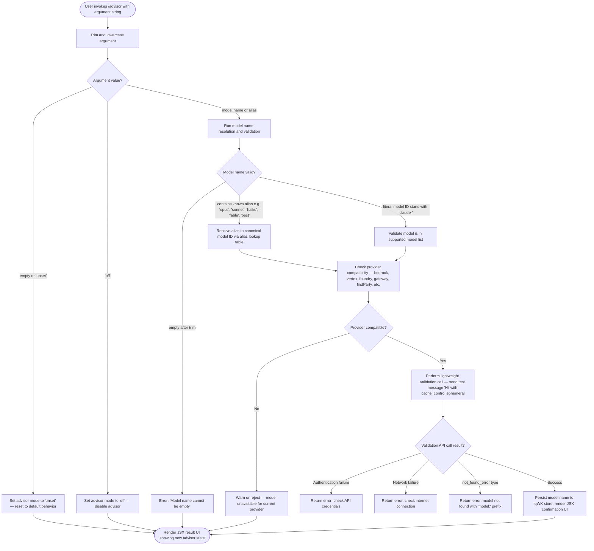

# `/advisor`

> Analysis basis: CC v2.1.178 bundle.js (AST extraction + Claude interpretation)
> Minimum version: v2.1.178

---

## Overview

The `/advisor` command enables Claude Code to consult a stronger or more capable model at key decision points during a session. It works by configuring a "side query" mechanism that routes selected requests to an advisory model, returning that model's perspective to inform the primary agent's response. The command operates as a local JSX-rendered UI that lets the user toggle the advisor on, off, or reset it to the unset state.

---

## Registration

| Field | Value |
|---|---|
| type | `local-jsx` |
| name | `advisor` |
| description | `Let Claude consult a stronger model at key moments` |
| argumentHint | `[ ... ]` |
| isHidden | `null` (not hidden) |
| module_id | `OWK` |
| load_inline | `true` |
| loc_byte | `13042032` |
| loc_byte_end | `13042288` |
| loc_line | `9019` |
| arbor_handler.name | `N95` |
| arbor_handler.fqn | `claude-2.1.178::N95` |
| arbor_handler.kind | `AsyncFunction` |
| arbor_handler.resolution_path | `module_id` |
| arbor_handler.n_hits | `2` |

Analysis basis: CC v2.1.178 bundle.js:+13042032

---

## Input Branching

The command processes the user's argument string through multiple distinct branches: it trims and lowercases the input, then dispatches to one of three mode values (`off`, `unset`, or a model name/alias), and additionally runs a model validation sub-flow. This results in 4+ distinct branches and is best represented as a flowchart.



---

## Behavioral Spec

### Handler Entry — `advisorCommandHandler` (N95)

The primary async handler (Arbor identifier: `N95`) is invoked when the user runs `/advisor`. It:

1. Trims the raw argument string.
2. Calls `gP.createElement` to construct the JSX result element that will be rendered back to the terminal.
3. Delegates argument parsing and model resolution to `modelNameResolver` (`Y1`) and `advisorConfigApplier` (`_F6`).
4. Returns the rendered JSX component containing the outcome.

Analysis basis: CC v2.1.178 bundle.js:+13041480

```
async function advisorCommandHandler(args, context):
    trimmedArg = args.trim()
    uiElement = createElement(AdvisorResultComponent, ...)
    result = await advisorConfigApplier(trimmedArg, context)
    return renderJSX(uiElement, result)
```

---

### Argument Parsing and Config Application — `advisorConfigApplier` (`_F6`)

This function handles the main logic of interpreting the argument and applying the advisor setting.

Analysis basis: CC v2.1.178 bundle.js:+13032734

```
async function advisorConfigApplier(arg, context):
    trimmed = arg.trim()

    if trimmed is empty:
        set advisor mode to 'unset'
        return { status: 'unset' }

    lower = trimmed.toLowerCase()

    if qkH includes lower:        // check known off/disable tokens
        if lower is 'off':
            set advisor mode to 'off'
            return { status: 'off' }

    if qWK.has(lower):            // check if already registered
        return cached result

    // Run model validation
    resolved = await modelValidationFlow(trimmed, lower, context)

    if resolved.success:
        qWK.set(lower, resolved.modelId)
        return { status: 'on', model: resolved.modelId }
    else:
        return { status: 'error', message: resolved.errorMessage }
```

**Key literal constants** found in this flow:
- Mode value `"off"` (bundle.js:+13041556) — disables the advisor.
- Mode value `"unset"` (bundle.js:+13041567) — resets to default (no advisor).
- Error string `"Model name cannot be empty"` (bundle.js:+13032771) — returned when the model argument trims to empty.

---

### Model Name Resolution — `modelNameResolver` (`Y1`)

`Y1` is the central model-name normalization function, called both from the advisor config applier and from other sub-flows. It performs alias expansion and canonical ID construction.

Analysis basis: CC v2.1.178 bundle.js:+2284693

```
function modelNameResolver(rawName):
    trimmed = rawName.trim()
    lower = trimmed.toLowerCase()

    // Alias table lookup
    alias = lookupAlias(lower)   // jY → QLH → L6
    if alias found:
        return alias.canonicalId

    // Short-name expansion
    expanded = expandShortName(lower)   // q4 path
    if expanded:
        return expanded

    // Prefix check
    if lower.startsWith('claude-'):
        return lower   // gGf path

    // Provider-specific rewriting
    if providerCheck(lower):   // uN path
        return rewriteForProvider(lower)   // dw path

    return lower
```

**Alias mappings** (from literals at the named locations):

| Alias keyword | Resolved canonical family |
|---|---|
| `fable` | `claude-fable-5` (bundle.js:+2284770) |
| `opusplan` | opus-plan family (bundle.js:+2284832) |
| `sonnet` | `claude-sonnet-4-x` family (bundle.js:+2284873) |
| `haiku` | `claude-haiku-4-x` family (bundle.js:+2284912) |
| `opus` | `claude-opus-4-x` family (bundle.js:+2284951) |
| `best` | highest-ranked available model (bundle.js:+2284985) |

**Supported model ID prefixes** detected in the literals (model list used for validation):

- `claude-mythos-5` (bundle.js:+2281501)
- `claude-opus-4-8` through `claude-opus-4-0` (bundle.js:+2281558–2281875)
- `claude-sonnet-4-6`, `claude-sonnet-4-5`, `claude-sonnet-4-0` (bundle.js:+2281907–2282063)
- `claude-haiku-4-5` (bundle.js:+2282097)
- `claude-3-7-sonnet`, `claude-3-5-sonnet`, `claude-3-5-haiku` (bundle.js:+2282156–2282278)
- `claude-3-opus`, `claude-3-sonnet`, `claude-3-haiku` (bundle.js:+2282337–2282447)
- `claude-fable-5` (implied from alias; bundle.js:+2269716)

---

### Provider Compatibility Check — (`uN`, `zL`, `S_`, `fkH`)

Before issuing the validation call, the advisor checks whether the resolved model is compatible with the currently active provider backend.

Analysis basis: CC v2.1.178 bundle.js:+2264599

```
function isModelSupportedForProvider(modelId, providerContext):
    provider = providerContext.type   // e.g. 'bedrock', 'vertex', 'foundry', 'gateway', 'firstParty', 'anthropicAws', 'mantle'

    supportedList = lookupSupportedModels(provider)   // qkH.includes
    if modelId in supportedList:
        return true

    // Special handling for application-inference-profile suffix
    if modelId.includes('application-inference-profile'):
        return handleInferenceProfile(modelId)

    return false
```

**Provider type literals** found (bundle.js:+2120705–2120953):
- `"bedrock"`, `"foundry"`, `"mantle"`, `"vertex"`, `"anthropicAws"`, `"gateway"`, `"firstParty"`

---

### Model Validation API Call — (`J95`, `X95`)

When a new model name is submitted, a lightweight validation round-trip is performed before the advisor is activated.

Analysis basis: CC v2.1.178 bundle.js:+13033289

```
async function validateModelViaApi(resolvedModelId, context):
    // Confirm model ID non-empty
    if resolvedModelId.trim() is empty:
        return { success: false, message: "Model name cannot be empty" }

    // Normalize for known sub-families
    normalized = normalizeSubfamilyId(resolvedModelId)   // X95 path

    try:
        response = await apiCall({
            model: normalized,
            messages: [{ role: 'user', content: 'Hi' }],   // literal "Hi" at bundle.js:+13033204
            max_tokens: short,
            cache_control: 'ephemeral'   // literal "ephemeral" at bundle.js:+13033229
        })
        return { success: true, modelId: normalized }
    catch AuthError:
        return { success: false, message: "Authentication failed. Please check your API credentials." }   // bundle.js:+13033507
    catch NetworkError:
        return { success: false, message: "Network error. Please check your internet connection." }   // bundle.js:+13033609
    catch APIError where error.type == 'not_found_error':
        return { success: false, message: "model:" + normalized }   // bundle.js:+13033810
```

**Sub-family alias normalization table** (X95, bundle.js:+13034041):

| Input token | Canonical suffix |
|---|---|
| `fable-5` / `fable_5` | fable-5 family |
| `opus-4-8` / `opus_4_8` | opus-4-8 |
| `opus-4-7` / `opus_4_7` | opus-4-7 |
| `opus-4-6` / `opus_4_6` | opus-4-6 |
| `opus-4-5` / `opus_4_5` | opus-4-5 |
| `sonnet-4-6` / `sonnet_4_6` | sonnet-4-6 |
| `sonnet-4-5` / `sonnet_4_5` | sonnet-4-5 |

Analysis basis: CC v2.1.178 bundle.js:+13034041–13034566

---

### Side-Query Dispatch — (`eU`, `Cg`)

Once the advisor model is configured, the agent runtime uses the `sideQuery` mechanism to route selected queries to it.

Analysis basis: CC v2.1.178 bundle.js:+13917837

```
async function dispatchSideQuery(primaryContext, queryPayload):
    // Uses "side_query" telemetry marker and "structured_outputs" feature flag
    advisorModel = getAdvisorModel(primaryContext)   // from qWK store
    if not advisorModel or advisorMode == 'off':
        return null

    response = await callApi({
        model: advisorModel,
        payload: queryPayload,
        featureFlags: ['structured_outputs'],   // bundle.js:+13917957
        headers: buildApiHeaders(primaryContext)   // Cg path
    })
    return response
```

The broader API call infrastructure (`Cg`) handles:
- Header construction: `x-app`, `User-Agent`, `X-Claude-Code-Session-Id`, `x-client-app`, `x-claude-code-agent-id`, `x-claude-code-parent-agent-id` (bundle.js:+3253675–3253958)
- OAuth token refresh (bundle.js:+3254274–3254328)
- Timeout: 600 000 ms (10 minutes) max (bundle.js:+3254646)
- Retry count: 10 (bundle.js:+3254654)
- Session expiry error: `"Cloud gateway session expired — run /login to reconnect."` (bundle.js:+3254855)

---

### Prompt-Cache Configuration — (`ZmH`)

The advisor flow participates in the `tengu_prompt_cache_1h_config` telemetry path, meaning cache headers (`cache_control`, `1h`) are applied to advisory model calls where applicable.

Analysis basis: CC v2.1.178 bundle.js:+13863759

```
function applyPromptCacheConfig(requestPayload, cacheMode):
    if cacheMode == '1h':
        attach cache_control header with 1-hour TTL
    elif cacheMode == 'ephemeral':
        attach ephemeral cache_control
    return requestPayload
```

Relevant literals: `"cache_control"` (bundle.js:+13919993), `"1h"` (bundle.js:+13918716), `"ephemeral"` (bundle.js:+13033229).

---

## State & Side Effects

| Item | Detail |
|---|---|
| Telemetry — `tengu_api_success` | Fired on successful advisory model API call (bundle.js:+13919498) |
| Telemetry — `tengu_prompt_cache_1h_config` | Fired when prompt cache with 1-hour TTL is configured for advisor calls (bundle.js:+13863759) |
| Telemetry — `tengu_lone_surrogate_sanitized` | Fired if lone surrogate characters are sanitized from the response (bundle.js:+13919194) |
| Telemetry — `tengu_bg_dispatch_low_mem` | Fired if background worker is under memory pressure while processing advisory query (bundle.js:+17066648) |
| Telemetry — `tengu_bg_spare_claim` | Fired when a spare background worker is claimed for the advisor call (bundle.js:+17067480) |
| Telemetry — `tengu_bg_spare_claim_fail` | Fired if spare worker claim fails (bundle.js:+17067746) |
| Telemetry — `tengu_bg_spare_enable` | Fired when spare worker pool is enabled (bundle.js:+17067352) |
| Telemetry — `tengu_bg_retire_pinned_low_mem` | Fired when pinned workers are retired due to low memory (bundle.js:+17070758) |
| Telemetry — `tengu_bg_prewarm_per_sweep` | Fired during background worker prewarming sweeps (bundle.js:+17070879) |
| Telemetry — `tengu_bg_dispatch_sigkill_escalate` | Fired if a background process requires SIGKILL escalation (bundle.js:+17066047) |
| Telemetry — `tengu_daemon_control` | Fired on daemon start/stop control events (bundle.js:+17104063) |
| Telemetry — `tengu_scheduled_task_missed` | Fired when a scheduled background task is missed (bundle.js:+16547141) |
| Persistent store write | Validated model ID written to `qWK` Map store keyed by normalized lowercase model name (bundle.js:+13033248) |
| appState changes | Advisor mode (`"off"`, `"unset"`, or resolved model ID) updated in session state; reflected in `side_query` routing logic |
| JSX render | Command returns a `local-jsx` element; rendered inline in the CLI terminal |
| API validation call | One lightweight API call (`"Hi"` message with ephemeral cache) is fired on first activation of a new advisor model |
| Sound | None detected |
| Hook registration | None detected |

---

## Version History

| Version | Change |
|---|---|
| v2.1.178 | Initial analysis |

---

## Common Mistakes

1. **Passing a bare model short-name without knowing the alias table** — short names like `opus`, `sonnet`, `haiku`, `fable`, and `best` are the supported aliases. Arbitrary partial names that do not match the alias table or start with `claude-` will be sent directly to the API for validation and will fail with a `not_found_error`.

2. **Expecting `/advisor off` to unset the setting** — `off` disables advisor usage entirely (the agent will not consult a secondary model), while `unset` removes the configuration and returns to default behavior. These are distinct states.

3. **Using a model ID that is unsupported by the current provider** — if you are running CC against a Bedrock, Vertex, or Azure Foundry endpoint, only models supported on that provider backend will pass the compatibility check. Providing a direct-API-only model ID will be rejected before the validation API call is even made.

4. **Omitting the argument entirely** — invoking `/advisor` with no argument is treated as `unset`, not as a status query. There is no read-only status display mode; the argument always writes a new state.

5. **Assuming the validation call is free** — every time a new (previously unseen) model name is submitted, a real API call is made (the `"Hi"` validation message). This counts against your quota and may fail if you are rate-limited.

---

## Appendix — Identifier Mapping

> For bundle debugging only. Identifiers change across versions.

| Identifier | Role |
|---|---|
| `N95` | Main async handler for `/advisor` command (`advisorCommandHandler`) |
| `_F6` | Advisor config applier — parses argument, applies mode, triggers validation |
| `Y1` | Model name resolver — alias expansion and canonical ID construction |
| `J95` | Model validation orchestrator — calls API with test message |
| `X95` | Sub-family alias normalizer — maps dash/underscore variant tokens to canonical IDs |
| `eU` | Side-query dispatch coordinator |
| `Cg` | API call infrastructure — header construction, auth, retry, timeout |
| `ZmH` | Prompt cache configuration applicator |
| `mq6` | Message list filter for advisory context |
| `YTH` | Conversation context assembler for advisor |
| `y_A` | Context builder helper — assembles fields for advisory call |
| `eI8` | Single-message builder for advisor query |
| `uN` | Provider compatibility checker |
| `zL` | Provider-specific model list lookup |
| `S_` | Low-level model support predicate |
| `fkH` | Model-provider intersection resolver |
| `jY` | Alias table entry point |
| `QLH` | Alias table lookup function |
| `L6` | String coercion / canonical ID formatter |
| `q4` | Short-name expansion helper |
| `MG` | Model group resolver (opusplan etc.) |
| `q48` | Model group entry evaluator |
| `dGf` | Lowercase normalization helper |
| `sm` | Message formatter for advisory output |
| `f1` | Message type classifier |
| `nz` | Message content normalizer |
| `sL` | Message replacement helper |
| `Xz` | Model output parser |
| `OX6` | Output structure builder |
| `L2f` | Prefix detector for model responses |
| `$X6` | Case-insensitive model type matcher |
| `$R1` | Request assembler for advisory API call |
| `mAH` | Request payload builder |
| `JK` | Context serializer |
| `KkH` | BGf list membership checker |
| `_48` | Recursive context builder |
| `LR1` | Entry iterator for context serialization |
| `b8` | Policy settings injector |
| `iiH` | Environment entry serializer |
| `fR1` | Index finder in serialized context |
| `FGf` | Forward context extractor |
| `iX6` | Token lowercaser |
| `gGf` | `claude-` prefix validator |
| `LkH` | Allowlist membership checker |
| `ZrH` | Canonical ID builder |
| `fg` | Replacement patcher |
| `dw` | Provider-specific model rewriter |
| `En` | Model entry resolver |
| `FP_` | Model resolution pipeline entry |
| `h5` | Model descriptor builder |
| `$t` | Model config assembler |
| `_P6` | Model ID replace helper |
| `PJH` | Array-type inspector |
| `IAH` | Model ID inclusion checker |
| `TrH` | Token inclusion tester |
| `K48` | Token-to-model-descriptor mapper |
| `qWK` | Persistent Map store for validated advisor model IDs |
| `gP_` | Model group entry builder |
| `FLH` | Fable model group handler |
| `ZA8` | Proxy auth helper executor |
| `Ucf` | Request UUID and streaming manager |
| `rY` | OAuth token refresher |
| `pcf` | Pre-call setup function |
| `Rcf` | Response stream reader |
| `vJH` | Response timing tracker |
| `oH_` | Timestamp helper |
| `HG6` | Header entry lowercaser |
| `SXH` | SDK error logger |
| `S$8` | Stream body assembler |
| `Hw` | Auth header builder |
| `Scf` | tP/iaH call pair |
| `ZoH` | WIF credential fetch / Anthropic API caller |
| `gJH` | Provider-specific API caller |
| `V$` | OAuth token checker |
| `XR1` | Boolean coercer for auth result |
| `XM` | Async store getter |
| `_y_` | String splitter/trimmer |
| `v9` | Background-context key fetcher |
| `un` | Error reporter |
| `R6` | TT wrapper |
| `aP_` | URL encoder |
| `N` | Debug log helper |
| `XGA` | SHA-256 hash builder |
| `Y48` | Session header builder |
| `DK` | String coercer (DK) |
| `O48` | Store getter (JR1) |
| `rP_` | Remote session ID helper |
| `PO8` | Permission object builder |
| `ZmH` | Prompt cache config applicator |
| `ZA` | Context header assembler |
| `k6_` | Cache key generator |
| `O6` | Output queue dispatcher |
| `I6_` | Inactive thread checker |
| `FN` | HIPAA flag injector |
| `Dy_` | Compliance flag builder |
| `jSH` | Compliance type builder |
| `eyK` | Event key mapper |
| `p$8` | Temperature/dt injector |
| `SW` | Message mapper |
| `d0H` | Message dispatcher |
| `Yg` | Random ID generator |
| `Z4` | Message wrapper |
| `xH` | JSON stringifier wrapper |
| `dCA` | Message array pop helper |
| `yi6` | Message array type inspector |
| `PS` | Structured clone wrapper |
| `Si6` | Message array push helper |
| `ki6` | QCA/replace helper |
| `d` | Generic helper |
| `H6` | c36 wrapper |
| `WG_` | Glob-pattern matcher |
| `gl1` | Regex-based line parser |
| `PG_` | Permission gate checker |
| `TwH` | Timing/wait helper |
| `$1` | c36 wrapper (variant) |
| `OZ6` | gG9/SeH/$Z6 orchestrator |
| `gG9` | tf7/RH wrapper |
| `SeH` | Ej wrapper |
| `$Z6` | SeH/MZ6 wrapper |
| `ni` | Agent name resolver |
| `sf7` | Builtin agent name parser |
| `rb` | Agent name prefix checker |
| `RH` | Request history logger |
| `W$6` | Post-call cleanup |
| `JSH` | Side-query feature detector |
| `Mk` | Model capability checker |
| `tAH` | k\$6/XG\_ token applicator |
| `XG_` | Foundry resource ID rewriter |
| `G` | Interactive UI / vim-mode editor component |
| `auK` | Operator action dispatcher |
| `RuK` | Yank operator |
| `uuK` | Visual-replace operator |
| `UuK` | Visual-case operator |
| `FuK` | Visual-paste operator |
| `yuK` | Indent operator |
| `kuK` | Visual-indent operator |
| `D` | Background worker daemon manager |
| `P` | PTY/pipe buffer reader |
| `oEA` | Multi-operator dispatcher |
| `dO5` | Message role finder |
| `b` | Register / clipboard manager |
| `I` | Background worker sweep scheduler |
| `k` | Focus/blur idle tracker |
| `V` | Scroll handler |
| `E` | Token range calculator |
| `X` | Session pool manager |
| `M` | Worker map manager |

---

Note: index built via Arbor fallback; some signals (telemetry, literals) may be missing — see arbor-fallback.js.