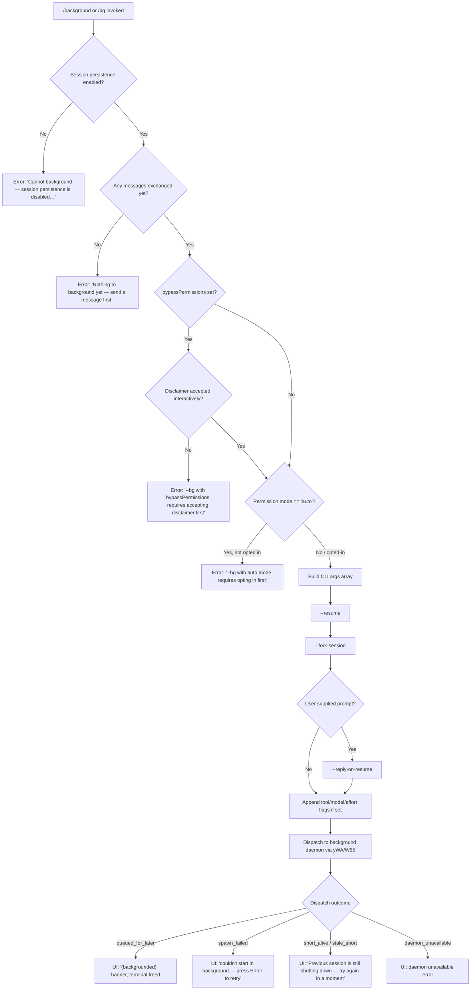

# `/background`

> Analysis basis: CC v2.1.178 bundle.js (AST extraction + Claude interpretation)
> Minimum version: v2.1.178

---

## Overview

The `/background` command (alias `/bg`) sends the current interactive Claude Code session to the background daemon, freeing the terminal for other use. It forks the session via the background-dispatch subsystem, constructing a CLI invocation with `--resume`, `--fork-session`, and optional `--reply-on-resume` flags, then hands control to the daemon worker. If the session has never exchanged a message, or if session persistence is disabled, the command exits early with an informational error.

---

## Registration

| Field | Value |
|---|---|
| type | `local-jsx` |
| name | `background` |
| description | `Send this session to the background and free the terminal` |
| aliases | `["bg"]` |
| argumentHint | `[prompt]` |
| immediate | `null` |
| module_id | `ZvK` |
| load_inline | `true` |
| loc_byte | `13498313` |
| loc_byte_end | `13498553` |
| loc_line | `9654` |
| arbor_handler.name | `k55` |
| arbor_handler.fqn | `claude-2.1.178::k55` |
| arbor_handler.kind | `AsyncFunction` |
| arbor_handler.resolution_path | `module_id` |
| arbor_handler.n_hits | `0` |

Analysis basis: CC v2.1.178 bundle.js:+13498313

---

## Input Branching

The command has four or more distinct branches based on guard checks, session state, and dispatch outcome:



Analysis basis: CC v2.1.178 bundle.js:+13497587 (handler entry), +13492760 (session check), +13497667 (persistence guard), +13497843 (no-messages guard), +13491216 (bypassPermissions guard), +13491378 (auto-mode guard), +13493111 (`--resume` flag), +13493124 (`--fork-session` flag), +13493166 (`--reply-on-resume` flag)

---

## Behavioral Spec

### 1. Handler Entry — `backgroundCommandHandler` (`k55`)

The main async handler is resolved via module `ZvK` as `k55`.

```
async function backgroundCommandHandler(commandInput, appState):
    sessionId   = appState.currentSessionId
    persistence = appState.sessionPersistenceEnabled

    if not persistence:
        displayError("Cannot background — session persistence is disabled…")
        return

    messageCount = countExchangedMessages(appState)
    if messageCount == 0:
        displayError("Nothing to background yet — send a message first.")
        return

    checkPermissionGuards(appState)   // see §2

    args = buildCLIArgs(commandInput, appState)  // see §3
    result = await dispatchToBackground(args)    // see §4

    renderOutcome(result)             // see §5
```

Analysis basis: CC v2.1.178 bundle.js:+13497587 (k55 entry), +13497667 (persistence literal), +13497843 (no-messages literal)

---

### 2. Permission Gate — `permissionGuard`

```
function checkPermissionGuards(appState):
    if appState.bypassPermissions:
        if not disclaimerAccepted():
            exitWithError("--bg with bypassPermissions requires accepting the disclaimer first…")
        // else continue

    if appState.permissionMode == "auto":
        if not autoModeOptedIn():
            exitWithError("--bg with auto mode requires opting in first…")
```

Analysis basis: CC v2.1.178 bundle.js:+13491047 (`bypassPermissions` key), +13491216 (bypass guard message), +13491378 (auto-mode guard message)

---

### 3. CLI Argument Construction — `buildBackgroundArgs` (derived from `sl8` → `W55`)

The handler assembles a child-process argument list forwarded to the daemon worker. The following flags are always included when relevant:

| Flag | Condition |
|---|---|
| `--resume <id>` | Always — carries the current session ID |
| `--fork-session` | Always |
| `--reply-on-resume <prompt>` | Only when the user supplied an argument to `/background` |
| `--allowed-tools <list>` | When tool allow-list is set |
| `--disallowed-tools <list>` | When tool deny-list is set |
| `--add-dir <path>` | When extra directories are configured |
| `--model <model>` | When a non-default model is active |
| `--effort <level>` | When effort is configured |
| `--permission-mode <mode>` | When permission mode is non-default |

```
function buildBackgroundArgs(prompt, appState):
    args = ["--resume", appState.sessionId,
            "--fork-session"]

    if prompt != null and prompt.trim() != "":
        args += ["--reply-on-resume", prompt]

    if appState.allowedTools:
        args += ["--allowed-tools", join(appState.allowedTools)]

    if appState.disallowedTools:
        args += ["--disallowed-tools", join(appState.disallowedTools)]

    if appState.addedDirs:
        for dir in appState.addedDirs:
            args += ["--add-dir", dir]

    if appState.model != DEFAULT_MODEL:
        args += ["--model", appState.model]

    if appState.effort:
        args += ["--effort", appState.effort]

    if appState.permissionMode != "default":
        args += ["--permission-mode", appState.permissionMode]

    return args
```

Analysis basis: CC v2.1.178 bundle.js:+13493111 (`--resume`), +13493124 (`--fork-session`), +13493166 (`--reply-on-resume`), +13493218 (`--add-dir`), +13493253 (`--allowed-tools`), +13493294 (`--disallowed-tools`), +13493325 (`--model`), +13493354 (`--effort`), +13493371 (`--permission-mode`)

---

### 4. Background Dispatch — `dispatchToBackground` (derived from `yWA` / `W55` / `FB`)

```
async function dispatchToBackground(args):
    // Ensure daemon is running (spawning transiently if needed)
    daemonHandle = await ensureDaemonRunning()

    if daemonHandle == null:
        return { status: "daemon_unavailable" }

    // Write dispatch file + connect via Unix socket
    dispatchId   = randomUUID()
    dispatchFile = buildDispatchFilePath(dispatchId)
    writeDispatchFile(dispatchFile, { args, dispatchId })

    // Race: ack within timeout vs timeout sentinel
    ackResult = await raceAckOrTimeout(DISPATCH_ACK_TIMEOUT)

    if ackResult == "timeout":
        return { status: "ack-timeout" }

    return { status: "queued_for_later", jobId: ackResult.jobId }
```

Flush timeout for pending output before forking: 2000 ms.
Analysis basis: CC v2.1.178 bundle.js:+13493055 (flush timeout: `2000`), +13493060 (`"flush timeout"` literal), +13493047 (timeout utility `a4`)

---

### 5. Outcome Rendering — `renderBackgroundOutcome` (derived from `tl8`)

```
function renderOutcome(result, appState):
    match result.status:
        "queued_for_later":
            // display "(backgrounded)" banner in the REPL
            showBanner("(backgrounded)")
            // release terminal / send UI to background state
            freeTerm()

        "spawn_failed":
            showRetryPrompt("couldn't start in the background — press Enter to retry")

        "short_alive" | "stale_short":
            showError("Previous session is still shutting down — try again in a moment")

        "daemon_unavailable":
            showError("No background daemon is running. Run 'claude daemon install'…")

        default:
            showError(result.errorMessage)
```

Analysis basis: CC v2.1.178 bundle.js:+13494438 (`"queued_for_later"`), +13494489 (`"spawn_failed"`), +13476204 (`short_alive` message), +13476282 (`"stale_short"`), +13495298 (`"(backgrounded)"`)

---

### 6. Daemon Lifecycle (background path)

When `ensureDaemonRunning()` is invoked it follows the `FB` / `rF6` / `yWA` chain:

1. Check whether a service daemon is already reachable on the Unix socket.
2. If not reachable and the platform is `macos` or `linux`, optionally prompt "Install as a service now? [y/N/never, or 'once' just for now]" — but only on a cold-start (this prompt is not shown when `/background` is run mid-session because the daemon should already be running; if it is not, a transient spawn is attempted).
3. On transient spawn failure, telemetry `tengu_bg_daemon_spawn_failed` is emitted and the call returns `null`.

Analysis basis: CC v2.1.178 bundle.js:+13434016 (install-prompt literal), +13427429 (no-daemon message), +13426919 (`"macos"`), +13426949 (`"linux"`)

---

### 7. Already-Backgrounded Guard

If the session is already running in the daemon as a background worker, the command exits immediately:

```
if alreadyInBackground(appState):
    // telemetry: tengu_background_already_bg
    return  // no-op
```

Analysis basis: CC v2.1.178 bundle.js:+13497601 (`tengu_background_already_bg` event)

---

## State & Side Effects

| Item | Detail |
|---|---|
| Telemetry — `tengu_background` | Emitted on every successful dispatch attempt (Analysis basis: bundle.js:+13494563) |
| Telemetry — `tengu_background_already_bg` | Emitted when `/background` is invoked on a session that is already a background worker (bundle.js:+13497601) |
| Telemetry — `tengu_background_spawn_failed` | Emitted when the daemon dispatch fails (bundle.js:+13493755) |
| Telemetry — `tengu_bg_dispatch` | Emitted by the underlying dispatch subsystem on each dispatch attempt (bundle.js:+13468201) |
| Telemetry — `tengu_bg_dispatch_fallback` | Emitted when the daemon is unreachable and a fallback path is taken (bundle.js:+13468731) |
| Telemetry — `tengu_bg_daemon_spawn_failed` | Emitted when the transient daemon spawn fails (bundle.js:+13427935) |
| Telemetry — `tengu_bg_daemon_cold_start_ask` | Emitted when the user is asked whether to install the daemon as a service (bundle.js:+13427364) |
| Telemetry — `tengu_bg_daemon_cold_start_ask_answer` | Emitted with the user's answer (bundle.js:+13434091) |
| Telemetry — `tengu_bg_dispatch_rescued` | Emitted when a stale dispatch is rescued (bundle.js:+13475264) |
| Session state | REPL transitions to backgrounded; terminal is freed |
| Dispatch file | A transient dispatch file is written to the daemon jobs directory; cleaned up after ack |
| Hook registration | The daemon socket is attached via `XSA.register` (bundle.js:+66308) |
| Sound | None detected |
| appState changes | Session marked as backgrounded; UI banner `"(backgrounded)"` displayed |

---

## Version History

| Version | Change |
|---|---|
| v2.1.178 | Initial analysis |

---

## Common Mistakes

1. **Running `/background` before sending any message.** The command requires at least one message exchange in the session. It will reject with `"Nothing to background yet — send a message first."` if invoked on a fresh session.
2. **Using `--dangerously-skip-permissions` without prior interactive acceptance.** If `bypassPermissions` is active but the disclaimer was never accepted in an interactive session, `/background` will block with an explicit error. Run `claude --dangerously-skip-permissions` once interactively first.
3. **Using `--permission-mode auto` without prior opt-in.** The auto permission mode requires an interactive opt-in run (`claude --permission-mode auto`) before `/background` will accept it.
4. **No background daemon installed.** On systems where `claude daemon install` has not been run and no transient daemon is live, the command will fail and print "No background daemon is running. Run 'claude daemon install' to set it up as a persistent service."
5. **Mixing `--bg` and `--cloud`.** These are different backends. Starting a cloud session via `/background` is not supported; use `claude --cloud '<task>'` directly.
6. **Retrying immediately after a `stale_short` error.** A `"stale_short"` outcome means the previous session is still shutting down. Waiting a moment before retrying is required.
7. **Expecting a live terminal after `/background` succeeds.** Once the command completes successfully, the terminal is freed and the process is no longer interactive. Attach to the session via `claude --resume <id>` to regain control.

---

## Appendix — Identifier Mapping

> For bundle debugging only. Identifiers change across versions.

| Identifier | Role |
|---|---|
| `k55` | Main `background` command async handler (`backgroundCommandHandler`) |
| `sl8` | Background session launch orchestrator (session checks, arg building, dispatch entry) |
| `tl8` | Outcome renderer — maps dispatch result codes to UI messages |
| `yWA` | Background dispatch runner (top-level async dispatch loop) |
| `W55` | Background session bootstrap (PTY init, socket setup, job registration) |
| `FB` | Daemon ensure-running / cold-start logic |
| `rF6` | Daemon connect and job-dispatch sub-routine |
| `Va` | Session fork preparation (mkdir, random UUID for job dir, gate checks) |
| `h55` | CLI argument validator / permission-gate checker |
| `n56` | Session argument scanner / flag normaliser |
| `Vc` | Flag-set membership checker |
| `il8` | `--resume` argument parser |
| `XvK` | `--resume=<id>` inline-value extractor |
| `rl8` | `--session-id` argument parser |
| `WvK` | `--session-id=<id>` inline-value extractor |
| `f2H` | `--allowed-tools` parser |
| `Vf7` | Tool-list entry parser (used by `f2H`) |
| `RVH` | Flag-token push helper |
| `I8H` | `--` separator detector |
| `a4` | Promise-race timeout utility (flush timeout, 2000 ms) |
| `KV` | Flush-and-wait helper |
| `pWA` | Signal handler registration wrapper |
| `Wf` | Signal registration delegate |
| `F9` | Signal registration (via `XSA.register`) |
| `$Y` | Active-session map lookup (index 0) |
| `K` | Session map / value-iterator |
| `F1` | CLI error reporter + `process.exit` wrapper |
| `w` | Forced-shutdown / abort controller |
| `bX` | Forced-shutdown initiator |
| `z` | AbortController for background dispatch |
| `SH` | `tengu_feature_ok` telemetry emitter |
| `bH` | `tengu_feature_bad` telemetry emitter |
| `d6` | `tengu_feature_sad` telemetry emitter |
| `AR` | Abort-record registrar |
| `qp` | Abort-chain entry constructor |
| `m0_` | Random-UUID abort-record builder |
| `aB` | Graceful shutdown sequencer |
| `f5H` | MCP-server shutdown wrapper |
| `L5H` | Cleanup timer canceller |
| `o8` | Timeout-race utility (used across dispatch and retry) |
| `X` | MCP server manager |
| `M` | MCP orchestrator / apply-update runner |
| `ebH` | MCP connection loop body |
| `INA` | MCP server-set reconciler |
| `hs8` | MCP update applier |
| `P` | IPC stream handler (daemon ↔ attacher) |
| `Gb5` | PTY/IPC session manager |
| `Y14` | Attacher lifecycle manager |
| `RH` | Error logger |
| `Q6H` | Timing-safe key comparison |
| `G` | Input event router (keyboard / editor) |
| `D` | Worker-pool / job lifecycle manager |
| `I` | Background-sweep timer callback |
| `c` | Grace-clock / scheduled-task runner |
| `S6` | Config file loader / watcher |
| `_MH` | Config file reader + backup handler |
| `WL9` | Config directory scanner |
| `zk_` | Config path builder |
| `wnf` | Config file watcher registrar |
| `O6` | Telemetry event emitter |
| `Mq` | Job-file state reader |
| `w4` | Job-directory path builder |
| `IZ` | Inner job-path builder |
| `i_H` | Project-file scanner (resumable session search) |
| `HG` | Recursive directory reader |
| `Xd4` | File-content scanner (session-message detector) |
| `dRH` | Stale-file pruner |
| `SL` | Atomic file writer (yO + eJ) |
| `yO` | Low-level atomic write (rename + chmod) |
| `eJ` | Cache-entry invalidator |
| `xL6` | Main-loop entry / subagent query router |
| `EaL` | Abort-signal wired query executor |
| `AE` | Agent loop body |
| `GR8` | App-state getter/setter |
| `tyK` | Core agent turn processor (very large) |
| `XC` | Turn result / context normaliser |
| `jU8` | Context-block builder |
| `NG` | Message-list normaliser |
| `wFH` | Response wrapper / fallback handler |
| `pMA` | Fallback-path message builder |
| `GzH` | Daemon-worker PTY writer |
| `G_K` | PTY write sub-helper |
| `vB` | Raw byte writer |
| `v9` | Worker-role detector (`"daemon-worker"`) |
| `zkH` | Worker-role constant getter |
| `Qd` | Environment / runtime initialiser |
| `L6` | String coercer |
| `$kH` | Config-aware initialiser |
| `k5` | AsyncLocalStorage config getter |
| `J2` | Config-store getStore wrapper |
| `fTf` | Tmux environment probe |
| `LTf` | Tmux `show-environment` spawner |
| `TH` | Error → string converter |
| `xH` | JSON stringifier |
| `i6` | JSON parser |
| `Rm` | String slice helper |
| `Z8` | Noop / void utility |
| `hL` | File-write helper |
| `x8` | File-stat helper |
| `d` | Generic async utility / deferred |
| `dH` | Deferred resolve helper |
| `N` | Message formatter |
| `AM4` | Message builder |
| `d4` | Content-block redactor |
| `VdH` | Content formatter |
| `LM4` | Full message serialiser |
| `xGK` | Session-timestamp recorder |
| `ml8` | Low-memory telemetry emitter helper |
| `O` | C8 / write-stream wrapper |
| `lL` | Line-end writer |
| `Zb5` | Escape-sequence filter |
| `_c6` | Socket write / destroy helper |
| `Wb5` | Attach-phase cleanup orchestrator |
| `Pb5` | Attach repaint helper |
| `C` | Write-flush cycle |
| `Q` | Idle-timer / write scheduler |
| `R` | Yield / transient supervisor writer |
| `F` | PTY socket reconnect loop |
| `MV` | NqK-based error formatter |
| `Fv` | Binary frame packer |
| `sB8` | Binary frame unpacker |
| `Tb5` | <!-- TODO: not found in depth-2 traversal; needs --depth 4 --> |
| `NhA` | <!-- TODO: not found in depth-2 traversal; needs --depth 4 --> |
| `C4H` | <!-- TODO: not found in depth-2 traversal; needs --depth 4 --> |
| `oF6` | Memory-pressure checker |
| `uVK` | Low-mem telemetry dispatcher |
| `GvK` | <!-- TODO: not found in depth-2 traversal; needs --depth 4 --> |
| `TD` | <!-- TODO: not found in depth-2 traversal; needs --depth 4 --> |
| `T55` | <!-- TODO: not found in depth-2 traversal; needs --depth 4 --> |
| `y1H` | `e5H` / `Rk` wrapper |
| `e5H` | `UXH` / `O6` caller |
| `Os` | <!-- TODO: not found in depth-2 traversal; needs --depth 4 --> |
| `Yb` | <!-- TODO: not found in depth-2 traversal; needs --depth 4 --> |
| `DA6` | <!-- TODO: not found in depth-2 traversal; needs --depth 4 --> |
| `qGH` | <!-- TODO: not found in depth-2 traversal; needs --depth 4 --> |
| `Ez` | Compact-boundary scanner (`WB8` / `GX`) |
| `$2H` | Job-directory initialiser |
| `b3` | Config-hash checker |
| `N76` | Tool-name `some` predicate |
| `Qh` | `vo` / `U4` dispatch router |
| `vo` | Array-aware `U4` caller |
| `E4H` | `H.startsWith` guard |
| `Y$` | `R6` / `Wf` composite |
| `Ac` | Alternate `R6` / `Wf` composite |
| `Um` | <!-- TODO: not found in depth-2 traversal; needs --depth 4 --> |
| `OWA` | <!-- TODO: not found in depth-2 traversal; needs --depth 4 --> |
| `Pe6` | AsyncLocalStorage store accessor |
| `W_` | `TT` wrapper |
| `li` | Operator-tool argument parser |
| `WeH` | `vf7` / `sP` composite |
| `Mj8` | `H.startsWith` guard (operator tools) |
| `sP` | `JNH` / `u6_` composite |
| `JNH` | `DSA` / `u6_` / `s5` / `ED` composite |
| `DSA` | `H.includes` guard |
| `u6_` | Path prefix stripper |
| `P9H` | `d4` wrapper |
| `LvK` | `H.map` list builder |
| `P55` | `ve6` / `a6` composite |
| `ve6` | `a6` / `l7H` / `N` composite |
| `PvK` | Arg push / startsWith filter |
| `NWA` | Dispatch-fallback message builder |
| `iF8` | Unix-socket connect with timeout |
| `bBH` | `g$.join` / `NzH` path builder |
| `Gw` | Raw socket writer / framer |
| `F4H` | Dispatch-file lstat + read |
| `$vK` | Dispatch-result parser |
| `Laq` | `km6` wrapper |
| `km6` | `rSL.has` gate |
| `HOH` | `GX` / `BLL` filter |
| `oSL` | `d` / `dH` deferred |
| `F8` | `P` / `QI.randomUUID` / `X` composite |
| `U3K` | `zq` / `ub` composite |
| `ub` | `H.trim` wrapper |
| `NQ8` | `_.push` / `Array.isArray` / join |
| `g4` | <!-- TODO: not found in depth-2 traversal; needs --depth 4 --> |
| `DU8` | <!-- TODO: not found in depth-2 traversal; needs --depth 4 --> |
| `uRL` | `H.map` / `A.map` / `wU8` / `mRL` |
| `Faq` | `pRL` wrapper |
| `ET` | `TT` wrapper |
| `TT` | Root telemetry emitter |
| `D2` | `S_` / `Y7` / `iP_` / `d1` / `FLH` composite |
| `S_` | `L6` wrapper |
| `Y7` | `vq8` wrapper |
| `iP_` | Auth-prefix slicer (`"sk-ant-"` / `"/login managed key"`) |
| `d1` | `In` / `Y1` / `kO` composite |
| `FLH` | `gP_` wrapper |
| `ZZ` | <!-- TODO: not found in depth-2 traversal; needs --depth 4 --> |
| `U4` | `H.filter` tool-filter |
| `WB8` | `GX` compact-boundary |
| `GX` | <!-- TODO: not found in depth-2 traversal; needs --depth 4 --> |
| `SQ` | `Array.isArray` guard |
| `v9` | Worker-role detector |
| `zkH` | Worker-role constant |
| `GzH` | PTY writer composite |
| `G48` | <!-- TODO: not found in depth-2 traversal; needs --depth 4 --> |
| `G_K` | PTY write helper |
| `bp8` | <!-- TODO: not found in depth-2 traversal; needs --depth 4 --> |
| `C8` | <!-- TODO: not found in depth-2 traversal; needs --depth 4 --> |
| `vB` | `d6H.write` / `xH` writer |
| `Qd` | Runtime / env initialiser |
| `ZNK` | <!-- TODO: not found in depth-2 traversal; needs --depth 4 --> |
| `Om` | <!-- TODO: not found in depth-2 traversal; needs --depth 4 --> |
| `$kH` | Config-aware init |
| `l0` | <!-- TODO: not found in depth-2 traversal; needs --depth 4 --> |
| `k5` | Config-store getter |
| `J2` | `_2_.getStore` wrapper |
| `fTf` | Tmux-probe dispatcher |
| `LTf` | `WR1.spawnSync` runner |

---

Note: index built via Arbor fallback; some signals (telemetry, literals) may be missing — see arbor-fallback.js.