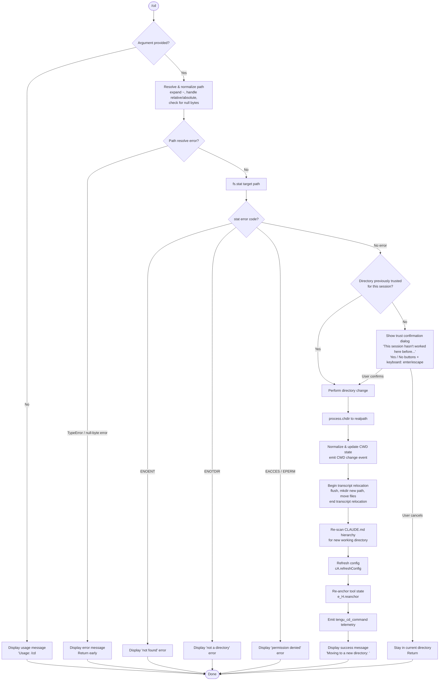

# `/cd`

> Analysis basis: CC v2.1.178 bundle.js (AST extraction + Claude interpretation)
> Minimum version: v2.1.178

---

## Overview

The `/cd` command moves the active Claude Code session to a new working directory specified by the user. It resolves and validates the target path, optionally prompts for trust confirmation when visiting an unrecognized directory, then performs a full working-directory transition — including `process.chdir`, transcript relocation, config refresh, and CLAUDE.md re-scanning.

---

## Registration

| Field | Value |
|---|---|
| type | `local-jsx` |
| name | `cd` |
| description | Move this session to a new working directory |
| argumentHint | `<path>` |
| module_id | `S8K` |
| load_inline | `true` |
| loc_byte | 11355633 |
| loc_byte_end | 11355793 |
| loc_line | 7267 |
| arbor_handler.name | `zpL` |
| arbor_handler.fqn | `claude-2.1.178::zpL` |
| arbor_handler.kind | `AsyncFunction` |
| arbor_handler.resolution_path | `module_id` |
| arbor_handler.n_hits | 0 |

Analysis basis: CC v2.1.178 bundle.js:+11355633

---

## Input Branching

The handler has more than three distinct branches (no argument, invalid path, stat errors, unrecognized directory requiring trust, and successful change), so a Mermaid flowchart is used.



---

## Behavioral Spec

### 1. Entry Point — Main Handler (`zpL`)

The Arbor-resolved handler `zpL` is an `AsyncFunction` reached via `module_id` → `S8K`.

```
async function cdCommandHandler(input, appContext):
    rawArg = input.trim()

    if rawArg is empty:
        display("Usage: /cd <path>")
        return

    resolvedPath = resolvePath(rawArg)   // calls pathResolver (v1)
    if resolvedPath is error:
        display(resolvedPath.message)
        return

    statResult = await fs.stat(resolvedPath)
    if statResult is error:
        errorCode = statResult.code
        if errorCode in ["ENOENT", "ENOTDIR", "EACCES", "EPERM"]:
            display(friendlyErrorMessage(errorCode, resolvedPath))
            return

    realpathResult = await fs.realpath(resolvedPath)

    if not directoryTrustedForSession(realpathResult, appContext):
        confirmed = await showTrustDialog(realpathResult)
        if not confirmed:
            return

    await performDirectoryChange(realpathResult, appContext)
    display("Moving to a new directory: " + bold(realpathResult))
    emit("tengu_cd_command")
```

Analysis basis: CC v2.1.178 bundle.js:+11354110

---

### 2. Path Resolution (`v1`)

```
function resolvePath(rawInput):
    if rawInput contains null bytes:
        throw Error("Path contains null bytes")

    normalized = normalizeUnicode(rawInput)  // NFC normalization via zz

    if normalized starts with "~/":
        normalized = os.homedir() + normalized.slice(2)

    if platform is "windows" and path matches Windows drive pattern:
        normalized = handleWindowsPath(normalized)

    if path.isAbsolute(normalized):
        return path.resolve(normalized)
    else:
        return path.resolve(currentWorkingDirectory, normalized)
```

- Null-byte check raises an error with message `"Path contains null bytes"` (bundle.js:+1089018)
- Unicode normalization form: `"NFC"` (bundle.js:+65158)
- Home directory expansion triggered by `"~/"` prefix (bundle.js:+1089146)
- Windows platform detection via `"windows"` check (bundle.js:+1089215)

Analysis basis: CC v2.1.178 bundle.js:+1088765

---

### 3. Filesystem Validation (`zpL` → `BB8.stat`, error codes)

```
async function validateTargetDirectory(resolvedPath):
    try:
        stat = await fs.stat(resolvedPath)
    catch err:
        switch err.code:
            case "ENOENT":  return { ok: false, reason: "not found" }
            case "ENOTDIR": return { ok: false, reason: "not a directory" }
            case "EACCES":  return { ok: false, reason: "permission denied" }
            case "EPERM":   return { ok: false, reason: "operation not permitted" }
    return { ok: true }
```

Error codes checked: `"ENOENT"` (bundle.js:+11354374), `"ENOTDIR"` (bundle.js:+11354388), `"EACCES"` (bundle.js:+11354403), `"EPERM"` (bundle.js:+11354417).

Analysis basis: CC v2.1.178 bundle.js:+11354162

---

### 4. Trust / Session-History Check (`b_`)

Before changing directories, the handler checks whether the destination directory has been visited in the current session or is recognized as trusted.

```
function checkDirectoryTrust(realpathTarget, appContext):
    appState = appContext.getAppState()
    // Search session history for a prior working_directory matching realpathTarget
    priorEntry = appState.findLast(
        entry => entry.working_directory == realpathTarget
    )
    if priorEntry exists:
        return TRUSTED
    return UNKNOWN
```

When the result is `UNKNOWN`, the JSX confirmation dialog is rendered:

- Title fragment: `"This session hasn"` + `"t worked here before. Is this a directory you created or one you trust?"` (bundle.js:+11351168, +11351192)
- Application name displayed: `"Claude Code"` (bundle.js:+11351301)
- Confirmation button label: `"Yes, move here"` (bundle.js:+11351691)
- Cancellation button label: `"No, stay put"` (bundle.js:+11351720)
- Keyboard bindings: `"enter"` / `"confirm"` to accept (bundle.js:+11351960, +11351975); `"escape"` / `"cancel"` to reject (bundle.js:+11352022, +11352038)
- Security guide link: `"https://code.claude.com/docs/en/security"` (bundle.js:+11351537), labeled `"Security guide"` (bundle.js:+11351581)

Analysis basis: CC v2.1.178 bundle.js:+10800596

---

### 5. Directory Change Execution (`$pL`)

```
async function performDirectoryChange(realpathTarget, appContext):
    // 1. Validate CWD state consistency (u6, W_)
    validateCwdState()

    // 2. Call Node.js built-in to change process working directory
    process.chdir(realpathTarget)

    // 3. Normalize path and emit CWD-changed event (CV -> O$6 -> ve8.emit)
    normalizedNewCwd = normalizePath(realpathTarget)
    emitCwdChange(normalizedNewCwd)

    // 4. Relocate transcript storage (GOA)
    transcriptStore.beginTranscriptRelocation(newCwdPath)
    transcriptStore.flush()
    fs.mkdir(newTranscriptDir)
    moveOrCopyTranscriptFiles(oldDir, newTranscriptDir)  // $NK, kNK
    transcriptStore.endTranscriptRelocation()

    // 5. Re-anchor tool state (rl -> e_H.reanchor)
    toolStateManager.reanchor(realpathTarget)

    // 6. Refresh configuration (cA.refreshConfig)
    configManager.refreshConfig()

    // 7. Re-scan CLAUDE.md memory hierarchy for new directory (MpL -> sV6, aV6)
    rescanClaudeMdHierarchy(realpathTarget)

    // 8. Update prompt text context (PB8, T0 — HTML-escape path for display)
    updateDisplayedPath(realpathTarget)
```

- `process.chdir` is the actual working-directory transition (bundle.js:+11352641)
- CWD-change event emitted via `ve8.emit` after normalization (bundle.js:+45454)
- Transcript relocation uses `"cd"` as the operation tag (bundle.js:+13613058)
- Transcript directory created with mode `448` (`0o700`) (bundle.js:+13613219)
- Config refresh is `cA.refreshConfig` (bundle.js:+11352962)
- Tool re-anchor is `e_H.reanchor` (bundle.js:+1144666)

Analysis basis: CC v2.1.178 bundle.js:+11352629

---

### 6. CLAUDE.md Hierarchy Re-scan (`MpL`, `sV6`, `KWH`, `rp`)

When the CWD changes, the in-memory CLAUDE.md instruction set must be rebuilt for the new directory tree.

```
function rescanClaudeMdHierarchy(newCwd):
    segments = []
    cursor = newCwd
    // Walk from newCwd up to filesystem root, collecting path components
    while cursor != path.dirname(cursor):
        segments.push(cursor)
        cursor = path.dirname(cursor)
    segments.reverse()

    for each segment in segments:
        candidateFile = path.join(segment, "CLAUDE.md")
        if fs.existsSync(candidateFile):
            loadClaudeMdFile(candidateFile, tag="Project")

        localCandidate = path.join(segment, ".claude", "CLAUDE.local.md")
        if fs.existsSync(localCandidate):
            loadClaudeMdFile(localCandidate, tag="Local")

    // Also gather any .md files under .claude/rules
    scanRulesDirectory(path.join(newCwd, ".claude", "rules"))
```

- `"CLAUDE.md"` scanned at each ancestor directory (bundle.js:+5055112)
- `"CLAUDE.local.md"` scanned for local (non-checked-in) instructions (bundle.js:+5055280)
- `".claude"` sub-directory is the standard config folder (bundle.js:+5055179)
- `"rules"` sub-directory holds additional rule files (bundle.js:+5055361)
- Files with extension `".md"` are loaded (bundle.js:+5054140)

Analysis basis: CC v2.1.178 bundle.js:+11352434

---

### 7. Permission-Pattern Enforcement During Path Resolution (`fpL`, `y8K`, `XzH`)

Before completing path resolution, the new target is checked against the session's allow-list patterns (the same system used for tool permissions).

```
function checkAllowedPatterns(resolvedPath, sessionAllowList):
    for each pattern in sessionAllowList:
        if matchesGlobPattern(resolvedPath, pattern):
            return { status: "allowed" }
    return { status: "outsideAllowedPatterns" }
```

- Result status strings: `"allowed"` (bundle.js:+11349622), `"outsideAllowedPatterns"` (bundle.js:+11349749), `"blockedByRule"` (bundle.js:+11349515), `"deny"` (bundle.js:+11221384)
- Pattern matching uses glob-to-regex conversion with escape of `"\\^$.|?+()[]{}"`  (bundle.js:+11350313), wildcard `".*"` (bundle.js:+11350280), segment `"[^/]+"` (bundle.js:+11350297)
- Parent-traversal detection: `".."` and `"../"` patterns handled explicitly (bundle.js:+11349934, +11349953)

Analysis basis: CC v2.1.178 bundle.js:+11349369

---

### 8. Stale-Context System Message (`OpL`)

After the directory change, a system message is injected into the conversation to inform the model that any context referencing the previous directory is stale.

```
function buildStaleContextSystemMessage(oldDir, newDir):
    // Message contains fragment indicating prior context is outdated:
    // "...previous directory — that information is stale. All tool calls and ..."
    // followed by bold-formatted new path
    return systemMessage(
        text: staleContextPreamble(oldDir),
        boldPath: J6.bold(newDir)
    )
```

- Fragment present in literals: `"previous directory — that information is stale. All tool calls and "` (bundle.js:+11353177)
- Role injected as `"system"` (bundle.js:+11354961)
- Bold formatting via `J6.bold` (bundle.js:+11354199, +11353478)

Analysis basis: CC v2.1.178 bundle.js:+11353372

---

## State & Side Effects

| Item | Detail |
|---|---|
| Telemetry: `tengu_cd_command` | Fired on every successful directory change (bundle.js:+11352983) |
| Telemetry: `tengu_shell_set_cwd` | Fired when the shell CWD state is updated (bundle.js:+6989874) |
| Telemetry: `tengu_disable_bypass_permissions_mode` | Fired if bypass-permissions mode is disabled as a side effect of changing directories (bundle.js:+4309015) |
| Telemetry: `tengu_claude_rules_md_permission_error` | Fired when a CLAUDE.md file cannot be read due to permissions during re-scan (bundle.js:+5054290) |
| Telemetry: `tengu_paper_halyard` | Fired during CLAUDE.md context construction (bundle.js:+5057028) |
| Telemetry: `tengu_config_lock_contention` | Fired when config file lock takes longer than expected (bundle.js:+3348912) |
| Telemetry: `tengu_config_stale_write` | Fired on stale config write detection (bundle.js:+3349048) |
| Telemetry: `tengu_config_parse_error` | Fired on config JSON parse failure (bundle.js:+3351487) |
| Telemetry: `tengu_config_auth_loss_prevented` | Fired when a write is aborted to prevent wiping auth credentials (bundle.js:+3349391) |
| Telemetry: `tengu_config_fallback_write` | Fired on fallback config write path (bundle.js:+3348528) |
| `process.chdir` | Node.js built-in CWD change is called directly (bundle.js:+11352641) |
| CWD change event | `ve8.emit` fires a CWD-changed event for internal subscribers (bundle.js:+45454) |
| Transcript relocation | Session transcript files are moved to a sub-directory under the new CWD; mkdir with mode `448` (`0o700`) (bundle.js:+13613219) |
| Config refresh | `cA.refreshConfig` re-reads project and user config for the new directory (bundle.js:+11352962) |
| Tool re-anchor | `e_H.reanchor` updates tool state to reflect the new working directory (bundle.js:+1144666) |
| CLAUDE.md reload | Full hierarchy re-scan for `CLAUDE.md`, `CLAUDE.local.md`, and `.claude/rules/*.md` |
| System message injected | A `"system"` role message is appended to the conversation noting stale prior-directory context |
| Trust dialog (JSX) | Shown for unrecognized directories; renders in-terminal with keyboard and button controls |
| Bypass-permissions guard | Moving to a new directory may disable `bypassPermissions` mode (bundle.js:+10801005) |

---

## Version History

| Version | Change |
|---|---|
| v2.1.178 | Initial analysis |

---

## Common Mistakes

1. **Providing a file path instead of a directory path** — the command validates with `fs.stat` and will return a friendly error for `ENOTDIR`; always supply a directory.
2. **Using `~` without a trailing slash on some platforms** — the tilde expansion is triggered specifically by the `"~/"` prefix (bundle.js:+1089146); bare `~` alone may not expand correctly.
3. **Dismissing the trust dialog on first visit** — choosing "No, stay put" leaves the session in the original directory; the model context does *not* change and no system message is injected.
4. **Expecting immediate CLAUDE.md reload in the same turn** — the re-scan happens synchronously during the command, but the stale-context system message is what tells the model to discard old context; tool calls in the same turn after `/cd` already use the new directory.
5. **Using a relative path that escapes the allow-list** — paths like `../../outside` are checked against session allow-list patterns; navigation outside allowed patterns will be blocked (`"outsideAllowedPatterns"` / `"blockedByRule"` status).
6. **Null bytes in path** — any path containing null bytes is rejected with the error `"Path contains null bytes"` (bundle.js:+1089018) before any filesystem access.

---

## Appendix — Identifier Mapping

> For bundle debugging only. Identifiers change across versions.

| Identifier | Role |
|---|---|
| `zpL` | Main handler (`AsyncFunction`) for `/cd` command; Arbor-resolved entry point |
| `v1` | Path resolution and normalization function |
| `u6` | CWD state accessor / consistency validator |
| `Pe6` | CWD store getter (calls `Xe6.getStore`) |
| `Yl` | CWD store value extractor |
| `W_` | Working-directory state helper |
| `TT` | Low-level CWD primitive |
| `n6` | Async/await runtime helper (likely promise wrapper) |
| `zz` | Unicode NFC normalizer |
| `Z8` | Error / exception helper |
| `y8K` | Allow-list pattern checking orchestrator |
| `K1` | Shared utility (used in trust-check and config paths) |
| `YN` | Symlink-aware directory trust traversal |
| `s5` | Filesystem stat helper |
| `ED` | Directory entry helper |
| `M` | MCP server state manager |
| `ebH` | MCP connection builder |
| `hs8` | MCP connection result applier |
| `N` | Settings / config normalizer |
| `INA` | MCP server reconciliation function |
| `X7H` | Symlink chain resolver |
| `w` | Process exit / abort controller |
| `rL` | Realpath sync wrapper |
| `Ep6` | Path prefix normalizer (tilde on Windows `~\`) |
| `fpL` | Allow-list pattern filter for paths |
| `Tp6` | Glob/path pattern matcher |
| `K` | Column formatter / padEnd helper |
| `x35` | Config-source resolver |
| `zBH` | Blocked-path rule checker |
| `LpL` | <!-- TODO: not found in depth-2 traversal; needs --depth 4 --> |
| `sd` | Deny-rule scanner |
| `k3` | Rule string processor |
| `an4` | Rule entry constructor |
| `AZ` | `Object.hasOwn` wrapper |
| `sn4` | Rule normalizer |
| `on4` | Rule string replace utility |
| `XzH` | Permission-mode evaluator for shell commands |
| `iHK` | Shell permission cache initializer |
| `bpH` | Shell command permission lookup (with cache) |
| `ub6` | Shell command cache miss handler |
| `pb6` | Shell command string parser |
| `mqA` | Shell permission cache entry builder |
| `b_` | App-state working-directory history inspector |
| `tp8` | Session state builder |
| `ep8` | Session state updater |
| `Nx` | Bypass-permissions mode disabler |
| `O6` | Permission-mode transition handler |
| `Xp` | Permission prompt queue helper |
| `o$8` | Permission cache lookup/add |
| `S6` | Permission event emitter |
| `OpL` | Stale-context system message builder |
| `e5` | HTML entity escaper for path display |
| `rn4` | `replaceAll` wrapper for HTML escaping |
| `wZH` | System message formatter |
| `usA` | System message emitter |
| `$pL` | Directory-change execution function |
| `sz` | Shell CWD setter with telemetry |
| `x8` | Error code extractor |
| `fL_` | CWD store updater |
| `w_H` | CWD path normalizer and store writer |
| `d` | General async utility / deferred |
| `CV` | Normalized-path emitter (fires `ve8.emit`) |
| `O$6` | Path normalizer used before emit |
| `GOA` | Transcript relocation orchestrator |
| `R6` | Transcript path builder |
| `Wf` | Hook registration helper |
| `F9` | Hook registrar (`XSA.register`) |
| `Qd` | Environment/mode checker (`production`/`test`) |
| `L6` | String coercion utility |
| `ZNK` | Transcript flush helper |
| `Om` | Transcript directory resolver |
| `$kH` | Transcript lock helper |
| `IJ` | Event emitter wrapper |
| `KSA` | Event system initializer |
| `qSA` | Event broadcaster (`gl6.emit`) |
| `$NK` | Transcript file mover (rename/copy/rm) |
| `kNK` | Recursive directory copier |
| `RH` | Config write orchestrator |
| `jA` | Error string formatter |
| `qq` | Config queue manager |
| `RQ4` | Config queue shift/push |
| `rl` | Tool re-anchor invoker (`e_H.reanchor`) |
| `DJ` | <!-- TODO: not found in depth-2 traversal; needs --depth 4 --> |
| `MpL` | CLAUDE.md hierarchy scanner (new CWD) |
| `aX` | Path normalizer for CLAUDE.md scanning |
| `sV6` | CLAUDE.md file loader and classifier |
| `Jz` | CLAUDE.md content parser |
| `rp` | Single CLAUDE.md file processor |
| `KWH` | Directory walker for CLAUDE.md discovery |
| `iV6` | CLAUDE.md relative-path resolver |
| `aV6` | CLAUDE.md context block builder |
| `PB8` | Display path HTML-entity escaper |
| `T0` | Display updater for new path |
| `QXH` | Permission-mode context updater after CWD change |
| `nl` | Path normalize wrapper |
| `RG6` | Config writer for new CWD state |
| `W8` | Global config save function |
| `wO8` | Config file write-with-backup function |
| `tR1` | Config object serializer |
| `_MH` | Config file reader with lock |
| `JsH` | Config JSON writer |
| `xH` | JSON stringify wrapper |
| `zk_` | Config backup path builder |
| `V` | UI scroll/viewport helper |
| `P` | Stream/buffer reader |
| `E` | UI range calculator |
| `ED6` | Atomic file write utility |
| `gXH` | Config save guard |
| `PL9` | Config entry iterator |
| `CG6` | Config timestamp recorder |
| `YO8` | Per-key config writer |
| `dH` | Low-level file descriptor helper |
| `I8K` | JSX memo/sentinel for trust dialog component |