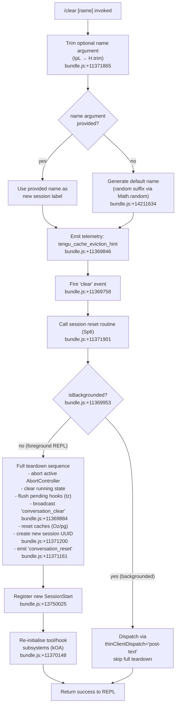

# `/clear`

> Analysis basis: CC v2.1.178 bundle.js (AST extraction + Claude interpretation)
> Minimum version: v2.1.178

---

## Overview

`/clear` starts a fresh conversation session with an empty context window while preserving the previous session on disk for later resumption via `/resume`. It is also available under the aliases `/reset` and `/new`. The command optionally accepts a session name argument, tears down active tool and hook state from the current session, then initialises a new session (including a new UUID and reset conversation log).

---

## Registration

| Field | Value |
|---|---|
| type | `local` |
| name | `clear` |
| description | Start a new session with empty context; previous session stays on disk (resumable with /resume) |
| argumentHint | `[name]` |
| aliases | `reset`, `new` |
| supportsNonInteractive | `true` |
| thinClientDispatch | `post-text` |
| module_id | `i8K` |
| load_inline | `true` |
| loc_byte | 11372039 |
| loc_byte_end | 11372330 |
| loc_line | 7269 |
| arbor_handler.name | `IpL` |
| arbor_handler.kind | `AsyncFunction` |
| arbor_handler.fqn | `claude-2.1.178::IpL` |
| arbor_handler.resolution_path | `module_id` |
| arbor_handler.n_hits | 0 |

Analysis basis: CC v2.1.178 bundle.js:+11372039

---

## Input Branching

The handler has four distinct paths depending on optional argument presence, backgrounded state, and the outcome of the session-reset sub-routine, so a Mermaid flowchart is used.



---

## Behavioral Spec

### Handler Entry Point (`IpL`)

The Arbor-resolved handler is `IpL` (AsyncFunction, `claude-2.1.178::IpL`).

```
async function clearCommandHandler(args, context):
    rawName = args.trim()                      // bundle.js:+11371865
    sessionName = rawName if rawName else generateRandomName()
    emitTelemetry("tengu_cache_eviction_hint") // bundle.js:+11369846
    await sessionResetRoutine(sessionName, context)
    return
```

Analysis basis: CC v2.1.178 bundle.js:+11371865, +11371901

---

### Random Name Generation (`H`)

When no name argument is supplied the handler produces a short random suffix.

```
function generateRandomName():
    roll = Math.floor(Math.random() * 2) + 1   // literals: 2, 1 at bundle.js:+14211632, +14211648
    delay = setTimeout(callback, roll)          // bundle.js:+14211671
    return constructedName
```

Analysis basis: CC v2.1.178 bundle.js:+14211634

---

### Session Reset Routine (`Sp6`)

`Sp6` orchestrates the full clear sequence. It is the primary side-effect boundary.

```
async function sessionResetRoutine(sessionName, context):
    // 1. Parse optional context depth hint
    depthHint = parseContextDepth(context)     // Cp6 → parseInt, Number.isFinite
                                               // bundle.js:+13730638, +13730660

    // 2. Signal active background dispatch to abort
    AbortSignal.timeout(...)                   // bundle.js:+11369802

    // 3. Emit cache eviction hint telemetry (already fired by IpL)

    // 4. Broadcast "conversation_clear" to all listeners
    broadcastEvent("conversation_clear")       // literal at bundle.js:+11369884

    // 5. Check backgrounded flag
    if context.isBackgrounded:                 // literal "isBackgrounded" bundle.js:+11369953
        return earlyDispatch()

    // 6. Kill/clean active processes via subprocessManager (D)
    subprocessManager.killActiveProcesses()    // bundle.js:+11370045

    // 7. Clear internal state collections
    clearStateCollections()                    // _.clear() bundle.js:+11370166

    // 8. Flush pending hook queue (tz → Cn8/Sn8)
    flushHookQueue()                           // bundle.js:+11370567

    // 9. Reset tool/hook subsystems (kOA)
    await resetAllSubsystems()                 // bundle.js:+11370148

    // 10. Set working directory to resolved path (sz)
    resolveAndSetCwd()                         // bundle.js:+11370157

    // 11. Generate new session UUID
    newUUID = crypto.randomUUID()              // c8K.randomUUID bundle.js:+11371200

    // 12. Emit "conversation_reset" with new UUID
    emitEvent("conversation_reset", newUUID)   // literal bundle.js:+11371161

    // 13. Start new session log (Ze8, VB)
    initNewSessionLog(sessionName, newUUID)    // bundle.js:+11371218, +11371344

    // 14. Re-register signal handlers (x_)
    reinstallSignalHandlers()                  // bundle.js:+11371502

    // 15. Broadcast new SessionEnd/SessionStart lifecycle events (DBH → zT)
    dispatchSessionLifecycle("SessionEnd")     // literal bundle.js:+13721188
    dispatchSessionLifecycle("SessionStart")   // literal bundle.js:+13750025
```

Analysis basis: CC v2.1.178 bundle.js:+11369802 through +11371640

---

### Context-Depth Parser (`Cp6`)

Used to interpret an optional numeric context-depth hint embedded in the argument string.

```
function parseContextDepth(rawArg):
    parsed = parseInt(rawArg, 10)              // bundle.js:+13730638, literal 10 at +13730649
    if not Number.isFinite(parsed):
        return defaultDepth                    // bundle.js:+13730660
    clamped = Math.max(0, Math.min(parsed, 1000)) // literals 0 (+11371880), 1000 (+13730825)
    return clamped
```

Analysis basis: CC v2.1.178 bundle.js:+13730638

---

### Subsystem Reset Coordinator (`kOA`)

`kOA` is called as part of step 9 above and fans out to a large number of cache-clearing and re-initialisation helpers.

```
async function resetAllSubsystems():
    clearSkillIndexCache()          // yU → H.clearSkillIndexCache bundle.js:+13581414
    clearMcpConnectionCaches()      // qp8 → ZB.delete, q5A.delete, ou6.delete, K5A.delete
    resetCompactState()             // rV6 → _E  bundle.js:+5054628
    clearHookSessionCache()         // yI9 → kQ.clear bundle.js:+5128250
    resetReplState()                // F6H bundle.js:+10634244
    clearPluginMetrics()            // sm8 → iiq.clear bundle.js:+10612475
    clearSkillCaches()              // ma9 → Yh6.clear, Ml_.clear bundle.js:+6644451
    resetAutonomousLoopDelivered()  // QkL.resetAutonomousLoopDelivered bundle.js:+10634387
    clearOutputTokenState()         // WD → xQH, Object.values bundle.js:+46935
    clearScheduledTaskCaches()      // Nmq → HUH.clear, f4A.clear bundle.js:+9846430
    clearMcpWatchCaches()           // iWq → Wq6.clear, yR6.clear bundle.js:+8518749
    clearHookFlowCache()            // j5_ → FlH.clear bundle.js:+1146005
    clearKiCaches()                 // LGq → kI8.clear bundle.js:+8578815
    clearBlacklistCache()           // K5_ → BlH.clear bundle.js:+1138341
    clearTHHCache()                 // le9 → THH.clear, V0H.clear bundle.js:+6840102
    await Promise.resolve()         // flush microtask queue bundle.js:+11369065
    // additional reinit: IqA, q, sX8, qz, l2H
```

Analysis basis: CC v2.1.178 bundle.js:+11368701 through +11369349

---

### Session Lifecycle Dispatch (`DBH` → `zT`)

After internal state is reset, `DBH` fires the full session lifecycle pipeline that handles hook execution, session log writing, and observer notification.

```
async function dispatchSessionLifecycle(event):
    // Dispatch "SessionEnd" to registered hooks
    runHooks(event)            // zT bundle.js:+13721219
    // Collect and store hook results (RH, bH, IhH)
    // Emit new "SessionStart" with fresh UUID
    // zT also handles: n0A (hook type routing), g0A (MCP tool hooks),
    //   rn8 (shell/process hooks), F0A (HTTP hooks), ahK (HTTP exec)
    // Telemetry emitted: tengu_run_hook bundle.js:+13770587
```

Analysis basis: CC v2.1.178 bundle.js:+13721161 through +13721416

---

### Cache / State Clearing (`pg`, `Oz`, `kk_`)

Two internal Map/Set stores are flushed during the clear sequence.

```
function clearCacheStores():
    refreshSessionPolicySettings()    // yk_ → rL9.get / rL9.set
                                      // literal "policySettings" bundle.js:+3377781
    cacheStoreA.clear()               // Ul6.clear bundle.js:+27695
    cacheStoreB.clear()               // We8.clear bundle.js:+27707
    rebuildHookRegistrations()        // kk_ → UD, rA
                                      // literal "hooks" bundle.js:+3377619
```

Analysis basis: CC v2.1.178 bundle.js:+3378099, +27695

---

## State & Side Effects

| Item | Detail |
|---|---|
| Telemetry | `tengu_cache_eviction_hint` (bundle.js:+11369846), `tengu_run_hook` (bundle.js:+13770587), `tengu_feature_ok` (bundle.js:+1020153), `tengu_feature_bad` (bundle.js:+1020220), `tengu_repl_hook_finished` (bundle.js:+13754355), `tengu_hook_plugin_metrics` (bundle.js:+13748882), `tengu_hook_plugin_injected` (bundle.js:+13768949), `tengu_session_renamed` (bundle.js:+13628925) |
| Conversation event | Emits `"conversation_clear"` string event (bundle.js:+11369884) |
| Session UUID | A new UUID is generated via `crypto.randomUUID()` (bundle.js:+11371200) |
| Session reset event | Emits `"conversation_reset"` with new UUID (bundle.js:+11371161) |
| Subprocess cleanup | Active subprocesses are killed via `SIGKILL` (bundle.js:+17066095) |
| AbortController | Active abort controller is signalled before reset (bundle.js:+11370502) |
| Hook flush | Pending hook queue flushed via `tz` → `Cn8`/`Sn8.delete` (bundle.js:+11370567) |
| Cache stores cleared | `Ul6`, `We8`, `kQ`, `iiq`, `Yh6`, `Ml_`, `HUH`, `f4A`, `Wq6`, `yR6`, `FlH`, `kI8`, `BlH`, `THH`, `V0H` |
| Session lifecycle hooks | `SessionEnd` then `SessionStart` lifecycle hooks are fired (bundle.js:+13721188, +13750025) |
| Previous session | Kept on disk; resumable with `/resume` (per registration description) |
| Signal handlers | Reinstalled after reset (bundle.js:+11371502) |
| Working directory | Re-resolved via `sz` after reset (bundle.js:+11370157) |
| Sound | <!-- TODO: not found in depth-2 traversal; needs --depth 4 --> |
| appState changes | Session state transitions through `SessionEnd` → `SessionStart` lifecycle; `isBackgrounded` flag consulted (bundle.js:+11369953) |

---

## Version History

| Version | Change |
|---|---|
| v2.1.178 | Initial analysis |

---

## Common Mistakes

1. **Expecting context loss to be immediate in non-interactive mode**: When `supportsNonInteractive: true` is set and the client is backgrounded (`isBackgrounded`), the handler short-circuits to a thin-client dispatch (`post-text`) rather than running the full teardown sequence. Side effects such as hook execution and subprocess cleanup are skipped in that path.

2. **Confusing `/clear` with a destructive delete**: The previous session is intentionally preserved on disk. `/clear` creates a *new* session, leaving the old one intact and resumable with `/resume`. No history is permanently lost.

3. **Using the alias `/reset` or `/new` and expecting different behavior**: All three names (`clear`, `reset`, `new`) are registered aliases (bundle.js:+11372039) and resolve to the identical handler `IpL`. There is no behavioral difference between them.

4. **Passing a numeric argument as a context-depth hint without understanding clamping**: The optional numeric argument is parsed by `Cp6` and clamped to the range `[0, 1000]` (literals at bundle.js:+11371880 and +13730825). Values outside this range are silently clamped rather than causing an error.

5. **Assuming plugin/hook state persists across `/clear`**: `kOA` flushes a large number of plugin, MCP, hook, and skill caches. Plugin hook registrations and MCP connection caches are not preserved — they are rebuilt from scratch as part of the new `SessionStart` lifecycle.

---

## Appendix — Identifier Mapping

> For bundle debugging only. Identifiers change across versions.

| Identifier | Role |
|---|---|
| `IpL` | Main async handler for `/clear` (arbor_handler) |
| `Sp6` | Session reset orchestrator; coordinates full clear sequence |
| `Cp6` | Context-depth argument parser (parseInt + clamp) |
| `nj` | State collection accessor used during reset |
| `CK` | Core state reader/writer |
| `x1H` | Policy-settings state updater |
| `WF` | Terminal/TTY state helper |
| `pg` | Cache store flush coordinator |
| `yk_` | Session policy-settings refresh helper |
| `Oz` | Dual-store clear helper (Ul6 + We8) |
| `kk_` | Hook registration rebuilder |
| `DBH` | Session lifecycle dispatcher (fires SessionEnd / SessionStart) |
| `v7` | Inner session pipeline runner |
| `R6` | REPL state accessor |
| `xy` | Terminal cursor/state helper |
| `W2` | Model-capability resolver |
| `BN` | Effort-level configurator |
| `qy` | Conversation log writer |
| `u6` | Output formatter |
| `zT` | Hook execution engine (runs hooks for lifecycle events) |
| `zx` | State snapshot helper |
| `N` | Hook-type classifier and normaliser |
| `DYH` | Hook dispatch pre-processor |
| `n0A` | Hook-type router (PreToolUse, PostToolUse, etc.) |
| `shK` | Third-party hook filter |
| `l0A` | Hook list builder |
| `HyK` | Hook priority sorter |
| `xH` | JSON serialiser wrapper |
| `RH` | Hook result recorder |
| `bH` | Feature-flag state writer |
| `IhH` | Hook injection recorder |
| `Bh` | Abort/timeout manager |
| `uKH` | Utility: unknown-hook handler |
| `Uh` | Hook utility helper |
| `cn8` | Hook context builder |
| `g0A` | MCP tool hook executor |
| `in8` | Hook output parser (JSON vs plain text) |
| `v4H` | Hook tool-input mutator |
| `F0A` | HTTP hook executor |
| `ahK` | HTTP hook response handler |
| `dzH` | Hook dispatch serialiser |
| `rn8` | Shell/process hook runner |
| `LxH` | Hook late-completion tracker |
| `SH` | Feature-ok state writer |
| `YQ` | Telemetry emitter (wraps A77.emit) |
| `qpH` | Background-session prompt handler |
| `X$6` | AbortSignal timeout helper |
| `H6` | C36 constants accessor |
| `c36` | Core constants object |
| `f` | Active-task set manager (q.add / q.delete) |
| `q` | Active-task set |
| `F1` | Forced-exit handler |
| `L` | Main event-loop / session object |
| `A` | Connection/transport object |
| `D` | Subprocess / daemon manager |
| `b` | Background-session object |
| `yCH` | Settings file reader |
| `Y` | Supervisor write/lifecycle handler |
| `zt` | CLH state helper |
| `NH6` | Claude config directory writer |
| `Ah9` | Session file filter |
| `P` | IPC buffer reader |
| `z` | Daemon-control event dispatcher |
| `S` | Subprocess stdout writer |
| `X` | Socket timeout manager |
| `MtK` | Session summary formatter |
| `i9H` | Settings load coordinator |
| `o8` | Timed-operation helper |
| `K` | Column-padding formatter |
| `ul8` | macOS memory-check helper |
| `O6` | Memory / telemetry event dispatcher |
| `dRH` | Pins.json reader/writer |
| `aE6` | Path join helper for pins |
| `i6` | JSON.parse wrapper |
| `x8` | ENOENT error classifier |
| `yf7` | Directory recursive reader |
| `F` | PTY / socket session runner |
| `Z8` | Safe async wrapper |
| `c` | Background-session event loop |
| `C` | PTY write helper |
| `B` | Session disposer |
| `MV` | NqK message dispatcher |
| `Fv` | Binary frame encoder |
| `sB8` | Binary frame decoder |
| `ZhA` | Daemon socket claim handler |
| `SGA` | Daemon config writer |
| `$b5` | Claim timeout/retry helper |
| `Mb5` | Claim-frame builder |
| `hL` | Z8 safe-async helper |
| `TH` | String coercer |
| `khA` | Background-session process launcher |
| `w4` | IZ path resolver |
| `Mq` | File watch / cache manager |
| `HO` | Active-session status checker |
| `f2H` | Command-line argument builder |
| `SL` | Symlink creator |
| `HL6` | Session completion watcher |
| `XU6` | Session directory path helper |
| `hzH` | Session state path helper |
| `lI` | Session lifecycle emitter |
| `lv` | NqK late-message dispatcher |
| `JU6` | Session directory initialiser |
| `w` | Forced-shutdown handler |
| `bX` | Shutdown signal sender |
| `dH` | C36 constants writer |
| `V7` | Session state validator |
| `SP` | REPL session post-processor |
| `kOA` | Subsystem reset coordinator (clears all plugin/MCP/hook caches) |
| `VOA` | kOA pre-flight helper |
| `Xv` | Skill-index reset driver |
| `yU` | Skill-index cache clearer |
| `gU8` | Skill-index async helper |
| `ftq` | Skill-index finaliser |
| `RUH` | Plugin-state reset helper |
| `yI9` | Hook session cache clearer (kQ.clear) |
| `rCH` | Hook index rebuilder |
| `r$6` | Plugin resolve helper |
| `F6H` | Repl-state full reset |
| `xkH` | Main-process rb helper |
| `qp8` | MCP connection cache clearer |
| `rV6` | Session-start event emitter |
| `i$6` | Internal state flush |
| `a$6` | TT / z_H state helper |
| `sm8` | iiq cache clearer |
| `ma9` | Skill/Yh6 cache clearer |
| `Ivq` | H-state reset helper |
| `GTH` | H/_ state reset helper |
| `WD` | Output-token state clearer |
| `w5A` | Additional state helper |
| `tp` | Um6 cache clearer |
| `Nmq` | Scheduled-task cache clearer (HUH + f4A) |
| `iWq` | MCP watch cache clearer (Wq6 + yR6) |
| `j5_` | Hook flow cache clearer (FlH) |
| `CHK` | Config-hash cache helper |
| `LGq` | kI8 cache clearer |
| `V6_` | H.has feature-flag checker |
| `K5_` | BlH blacklist cache clearer |
| `Zlq` | pu6 async reset helper |
| `pu6` | Vm8 plugin cache accessor |
| `le9` | THH/V0H cache clearer |
| `sz` | CWD resolver and setter |
| `n6` | Process.cwd helper |
| `fL_` | AsyncLocalStorage CWD store reader |
| `zz` | Path normaliser |
| `w_H` | O$6 path helper |
| `W_` | TT terminal writer |
| `FCH` | Fork/child-process coordinator |
| `$E` | State entry helper |
| `tz` | Hook queue flusher |
| `Cn8` | HhK hook-set manager |
| `Q_6` | C_q queue drain helper |
| `C_q` | Hook drain queue |
| `RG` | $_6 / Nh cleanup runner |
| `$_6` | z0H hash helper |
| `z0H` | SHA-256 content hasher |
| `Nh` | O6 MCP skills telemetry emitter |
| `n8K` | NwH notification writer |
| `Y$` | R6/Wf session writer |
| `Wf` | Session log writer |
| `F9` | XSA.register signal handler |
| `eh` | Session event helper |
| `nM` | Conversation path builder |
| `zb` | TT state writer |
| `Rp6` | Wf session post-writer |
| `Ze8` | New-session initialiser (randomUUID + KSA/qSA) |
| `KSA` | Session creation helper |
| `qSA` | gl6.emit session event emitter |
| `_a` | Wf alternate session writer |
| `VB` | REPL session broadcaster |
| `YYH` | Log-file appender |
| `Qd` | Log path builder |
| `WUH` | Worktree symlink manager |
| `x0A` | Worktree mkdir helper |
| `u_6` | C0A path join helper |
| `z$` | Worktree path linker |
| `K46` | Worktree open helper |
| `Pv` | Subagent path builder |
| `a5` | Additional session state helper |
| `x_` | Signal-handler reinstaller |
| `ec6` | Signal-handler binder |
| `W` | SDK/SSE connection manager |
| `j36` | OA4 connection router |
| `OA4` | Object.keys connection lister |
| `jA` | Error string coercer |
| `T` | ch6/j36 tool runner |
| `ch6` | Tool dispatch helper |
| `z3` | Misc state helper |
| `JB` | Worktree-state broadcaster |
| `S4H` | Isolation-latch writer |
| `xNK` | Log-file append helper (iK) |
| `IQ` | Plugin hook loader |
| `v4` | CK/vL state loader |
| `vL` | L6/kn6 bare-mode checker |
| `lt` | Hook entry set builder |
| `b8` | K68/pb hook store accessors |
| `UlH` | Hook timing logger |
| `u8` | File append/mkdir logger |
| `k3H` | Safe-mode hook guard |
| `Tv6` | v7/Y$/yw session launcher |
| `yw` | Session async helper |
| `l2` | Full agent turn executor |
| `M` | MCP manager |
| `ebH` | MCP server connector |
| `hs8` | MCP update applier |
| `$` | xGK global state accessor |
| `INA` | MCP connection initialiser |
| `D9` | f3A UUID / now generator |