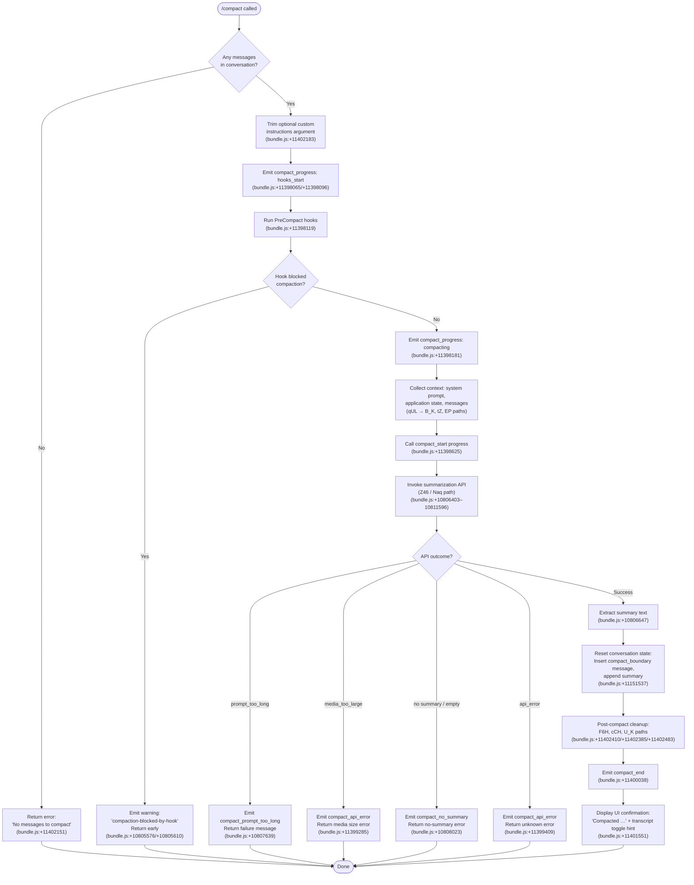

# `/compact`

> Analysis basis: CC v2.1.178 bundle.js (AST extraction + Claude interpretation)
> Minimum version: v2.1.178

---

## Overview

`/compact` frees up context window space by requesting an AI-generated summary of the current conversation and then replacing the conversation history with a compact boundary marker followed by that summary. It accepts an optional argument for custom summarization instructions and can be triggered both manually by the user and automatically by the runtime when approaching context limits.

---

## Registration

| Field | Value |
|---|---|
| type | `local` |
| name | `compact` |
| description | `Free up context by summarizing the conversation so far` |
| argumentHint | `<optional custom summarization instructions>` |
| supportsNonInteractive | `true` |
| thinClientDispatch | `post-text` |
| module_id | `F_K` |
| load_inline | `true` |
| loc_byte | `11403090` |
| loc_byte_end | `11403390` |
| loc_line | `7355` |
| arbor_handler.name | `AUL` |
| arbor_handler.fqn | `claude-2.1.178::AUL` |
| arbor_handler.kind | `AsyncFunction` |
| arbor_handler.resolution_path | `module_id` |
| arbor_handler.n_hits | `0` |

Analysis basis: CC v2.1.178 bundle.js:+11403090

---

## Input Branching

There are more than 3 distinct branches in the handler's logic (no messages guard, PreCompact hook gate, hook-blocked path, summarization API call path, error paths for `prompt_too_long` / `media_too_large` / unknown error, and final state-reset path). A Mermaid flowchart is used.



---

## Behavioral Spec

### 1. Handler Entry — Guard and Argument Processing (`AUL`)

```
async function compactHandler(args, context):
    messages = getConversationMessages(context)
    if messages is empty:
        throw Error("No messages to compact")   // bundle.js:+11402151

    customInstructions = args.trim()            // bundle.js:+11402183
    triggerMode = determineTriggerMode()        // "manual" | "compact_auto" | "compact_manual"
                                                // bundle.js:+11398278/+10806363/+10806378
```

Analysis basis: CC v2.1.178 bundle.js:+11402120–11402255

---

### 2. PreCompact Hook Execution (`qUL` → hook runner `no` / `O6`)

```
function runPreCompactHooks(context):
    emitProgress("hooks_start")                 // bundle.js:+11398096
    emitProgress("pre_compact")                 // bundle.js:+11398119

    hookResult = runHooks("PreCompact", context)
        // hooks can return { decision: "block" } to abort compaction
        // bundle.js:+13750108 (hook type string "PostCompact")
        // bundle.js:+13716347 (hook type string "PreCompact")

    if hookResult.blocked:
        emitWarning("compaction-blocked-by-hook",
                    "compaction blocked by PreCompact hook")
                    // bundle.js:+10805576/+10805610
        return BLOCKED

    emitProgress("compacting")                  // bundle.js:+11398181
    return PROCEED
```

Analysis basis: CC v2.1.178 bundle.js:+11398200–11398266

---

### 3. Context Collection (`B_K` + `tZ`)

```
function collectCompactionContext(context):
    appState      = getAppState(context)            // bundle.js:+11401607
    messages      = findRelevantMessages(appState)  // b_ path, bundle.js:+11401685
    systemPrompt  = getSystemPrompt(context)        // bundle.js:+9911350
    sdkStatus     = collectSdkStatus(context)       // "sdk_status" literal, bundle.js:+11398161
    streamMode    = "requesting"                    // bundle.js:+11398500

    return { appState, messages, systemPrompt, sdkStatus, streamMode }
```

The context collector also inspects `isBriefEnabled` (`$GA.isBriefEnabled`, bundle.js:+13834603), retrieves memory from `eG6` (memory-load path, bundle.js:+3456098), and assembles the final system prompt via `tZ` (bundle.js:+13834387).

Analysis basis: CC v2.1.178 bundle.js:+11401607–11401935

---

### 4. Summarization API Call (`Z46`)

```
async function callSummarizationAPI(messages, systemPrompt, customInstructions):
    // Compaction agent system prompt fragment:
    // "You are a helpful AI assistant tasked with summarizing conversations."
    //   bundle.js:+10820035
    // Tool use is explicitly denied during compaction:
    // "Tool use is not allowed during compaction"  bundle.js:+10817299

    traceSpan = startSpan("claude_code.compaction")   // bundle.js:+10806427
    triggerLabel = isTriggerAuto ? "compact_auto"
                                 : "compact_manual"   // bundle.js:+10806363/+10806378

    response = await apiCall({
        model: selectCompactionModel(),               // model selection via Naq path
        system: buildSummarizationSystem(systemPrompt, customInstructions),
        messages: stripToSummarizableSlice(messages), // Zaq + K66 path
        maxOutputTokens: resolveMaxOutputTokens(),    // S3H / RXH path
    })

    if response has no text content:
        emit("compact_no_summary")                    // bundle.js:+10808023
        return Failure("Failed to generate conversation summary …")
                                                      // bundle.js:+10808052
    return response.text
```

The summarization window slicing logic (`Zaq`, bundle.js:+10805100) clips the message array and reserves 20 % headroom (literal `0.2`, bundle.js:+10805270).

Analysis basis: CC v2.1.178 bundle.js:+10806403–10811596

---

### 5. Conversation Replacement and Boundary Insertion (`Ez` / `WB8`)

```
function replaceConversationWithSummary(summary):
    // Inserts a sentinel message of type "system" with subtype "compact_boundary"
    //   bundle.js:+11151515/+11151537
    // position index: 1 (after any persisted system message)
    //   bundle.js:+11151591/+11151596

    compactBoundaryMessage = {
        role: "system",
        type: "compact_boundary",
        content: summary,
    }

    newHistory = [compactBoundaryMessage]
    setConversationMessages(newHistory)

    // Confirm in UI:
    // "Conversation compacted"   bundle.js:+11151093
```

Analysis basis: CC v2.1.178 bundle.js:+11402120 (AUL → Ez call), +11151515–11151596

---

### 6. Post-Compact Cleanup (`F6H`, `cCH`, `U_K`)

```
function postCompactCleanup(context):
    // F6H: clear internal caches (qp8 → ZB, q5A, ou6, K5A)
    //   bundle.js:+10634260 (literal "post_compact_cleanup")
    clearCaches()                                      // bundle.js:+11402410

    // cCH: update UI state machine
    updateUIState()                                    // bundle.js:+11402385

    // U_K: register Ctrl+O keybinding for transcript toggle,
    //   display "Compacted …" confirmation with message count
    //   bundle.js:+11401551, +11401544 (J6.dim)
    //   bundle.js:+11401412 (app:toggleTranscript action)
    registerTranscriptToggle()                         // bundle.js:+11402483

    emit("compact_end")                                // bundle.js:+11400038
```

Analysis basis: CC v2.1.178 bundle.js:+11402385–11402483

---

### 7. Reactive (Automatic) Compaction (`J5A` / `VP8`)

When the runtime detects context pressure it calls the reactive compaction path independently of user invocation.

```
async function reactiveCompact(context):
    groups = splitIntoSummarizableGroups(messages)
    if groups.length < 2:
        // "Reactive compact: fewer than 2 groups, nothing to compact"
        //   bundle.js:+5161359
        emit("too_few_groups")
        return

    if no assistant messages in summarize set:
        // bundle.js:+5161923
        return

    // Attempts summarization; on media_too_large retries with media stripped
    // "Reactive compact: summarize hit media-size error, retrying stripped"
    //   bundle.js:+5163050
    result = await summarizeWithRetry(groups)

    if result.ok:
        emit("tengu_reactive_compact_succeeded")
    else:
        emit("tengu_reactive_compact_failed")
        emit("compact_reactive_aborted")              // bundle.js:+10638818
```

Analysis basis: CC v2.1.178 bundle.js:+10638789, +5161325–5163297

---

## State & Side Effects

| Item | Detail |
|---|---|
| Telemetry — primary | `tengu_compact` (bundle.js:+10809617) |
| Telemetry — failures | `tengu_compact_failed` (+10821344), `tengu_compact_ptl_retry` (+10807679), `tengu_compact_api_error` (via literal `compact_api_error` +10808319) |
| Telemetry — reactive | `tengu_reactive_compact_attempt` (+5162168), `tengu_reactive_compact_succeeded` (+10640785), `tengu_reactive_compact_failed` (+10638309) |
| Telemetry — hooks | `tengu_run_hook` (+13770587), `tengu_hook_plugin_metrics` (+13748882) |
| Telemetry — cache | `tengu_compact_cache_prefix` (+10807203), `tengu_compact_cache_sharing_success` (+10818243), `tengu_compact_cache_sharing_fallback` (+10818873) |
| Telemetry — post-compact | `tengu_post_compact_file_restore_success` (+10822475), `tengu_post_compact_file_restore_error` (+10822517) |
| Telemetry — pre-computed compacts | `tengu_precomputed_compact_consumed` (+10632939), `tengu_precomputed_compact_discarded` (+10633578) |
| Progress events emitted | `compact_progress` (sub-stages: `hooks_start`, `pre_compact`, `sdk_status`, `compacting`, `stream_mode`, `response_length`, `reset`, `compact_start`, `notification`), `compact_end` |
| Conversation state | Clears the message history; inserts a `compact_boundary` sentinel message containing the generated summary |
| Cache state | Clears internal turn caches (`ZB`, `q5A`, `ou6`, `K5A`), resets autonomous-loop delivery counter (`QkL.resetAutonomousLoopDelivered`, bundle.js:+10634387) |
| UI state | Calls `wv6.setState` (bundle.js:+5108562) to reset the UI; registers `app:toggleTranscript` keybinding (Ctrl+O, Global) |
| OTEL span | Opens `claude_code.compaction` span (bundle.js:+10806427) with `span.type` attribute |
| Hook lifecycle | Fires `PreCompact` hook before summarization; `PostCompact` hook data is referenced at bundle.js:+13750108 |
| Sound | <!-- TODO: not found in depth-2 traversal; needs --depth 4 --> |

---

## Version History

| Version | Change |
|---|---|
| v2.1.178 | Initial analysis |

---

## Common Mistakes

1. **Running `/compact` on an empty conversation** — the handler immediately returns the error `"No messages to compact"` (bundle.js:+11402151). Ensure at least one exchange has occurred before invoking the command.
2. **Expecting tool calls during summarization** — the compaction agent explicitly blocks all tool use during its summarization pass (`"Tool use is not allowed during compaction"`, bundle.js:+10817299). Any hook that relies on tool execution will not fire inside the compact window.
3. **Assuming custom instructions always take effect** — if a `PreCompact` hook returns a block decision, the command exits before passing custom instructions to the model (bundle.js:+10805576). Check hook configurations when instructions appear to be ignored.
4. **Interrupting a reactive compact** — reactive compaction (`J5A`/`VP8`) runs on a separate code path from the manual command. Canceling a manual operation does not stop an in-progress reactive compact, which may produce the `compact_reactive_aborted` event (bundle.js:+10638818).
5. **Relying on conversation history after `/compact`** — all prior messages except the compact boundary are removed from the in-memory store. References to specific earlier message IDs will be invalid after compaction completes.

---

## Appendix — Identifier Mapping

> For bundle debugging only. Identifiers change across versions.

| Identifier | Role |
|---|---|
| `AUL` | Main `/compact` command handler (AsyncFunction) |
| `Ez` | Conversation message slicer called by AUL to obtain current messages |
| `WB8` | Message list accessor called by Ez |
| `GX` | Message getter utility |
| `no` | Config/state resolver used after argument processing |
| `O6` | App-state configuration accessor |
| `qUL` | Compact orchestrator — sequences hooks, API call, and cleanup |
| `EP` | API request executor used by qUL and other callers |
| `gRL` | Request builder for the summarization API call |
| `JU8` | System-prompt assembler / message normalizer |
| `io` | Context gatherer (collects hooks context, message structures) |
| `v7` | Hook context builder |
| `zT` | Hook execution runner (dispatches PreCompact / PostCompact etc.) |
| `n0A` | Hook-type classifier |
| `B_K` | Application state snapshot collector |
| `tZ` | Full system-prompt assembler (memory, env, flags) |
| `eG6` | Memory-load prompt builder |
| `k$5` | Core behavioral instruction injector |
| `Z46` | Summarization API caller / compact state machine |
| `Naq` | Compaction turn loop (drives the model until summary produced) |
| `qp8` | Post-compact cache cleanup |
| `F6H` | Post-compact state reset coordinator |
| `cCH` | UI state updater after compact |
| `U_K` | Keybinding registrar and compact confirmation display |
| `KUL` | Compact miss/hit detector (tracks pre-computed compacts) |
| `J5A` | Reactive-compact entry point |
| `VP8` | Reactive-compact summarization loop |
| `ZJ7` | Reactive-compact single-group summarizer |
| `Zaq` | Message slice calculator for reactive compact window |
| `ckL` | Agent-state collector used inside the compact turn |
| `D9` | Turn UUID / timestamp factory |
| `IQ` | Hook loader (loads plugin hooks at session/compact start) |
| `tyK` | Core API streaming turn loop |
| `Lp8` | Turn executor (wraps streaming loop with retries) |
| `mmH` | Model-selector helper |
| `eML` | Model display-name resolver |
| `S3H` | Max-output-token resolver |
| `RXH` | Per-model token cap table |
| `s9H` | Token-cap parser and validator |
| `Ph6` | Compaction OTEL span initializer |
| `nR` | OTEL active-span accessor |
| `yMA` | Post-compact UI label builder |
| `TH` | String coercion utility (frequent) |
| `dH` | Dim-text renderer |
| `H6` | Bold-text renderer |
| `SH` | Success-styled renderer |
| `bH` | Error-styled renderer |
| `xH` | JSON-stringify wrapper |
| `RH` | Error-log emitter |
| `N` | Log-level message formatter |
| `d` | General diagnostic emitter |
| `wB` | Turn state builder (assembles full turn context) |
| `p$` | AppState reader for the compact path |
| `b_` | Last-message finder (scans for most-recent assistant turn) |
| `Nx` | Permission-mode resolver |
| `Mr` | Model-name classifier |
| `CR` | Randomized ID generator |
| `AE` | Turn event processor |
| `GR8` | Streaming response state updater |
| `Rm6` | Tool-use classifier during compaction |
| `CEH` | Tool-type checker |
| `CRL` | Content-result logger |
| `ZF_` | Message flattener for API payload |
| `ARL` | Attachment-reference rewriter |
| `WMA` | Recursive attachment walker |
| `Taq` | Surrogate-pair-safe string slicer |
| `cw` | Model-label formatter |
| `f1` | Model-family identifier |
| `q4` | Model-slug replacer |
| `gLH` | System-prompt context block assembler |
| `JK` | Memory-file parser |
| `oS` | Memory-file loader |
| `pJH` | Permission-context builder |
| `r0_` | Permission-mode resolver |
| `vaq` | Error-summary renderer for failed compact |
| `lbH` | Status-bar updater during compact |
| `SP` | Path sanitizer used in telemetry |
| `DZ` | Dual-context (W2 + BN) combiner |
| `W2` | Model-effort context injector |
| `BN` | Model extended-thinking injector |
| `qy` | REPL context collector |
| `u6` | Session-info provider |
| `ebH` | MCP server connector |
| `hs8` | MCP update applier |
| `INA` | MCP server inventory rebuilder |
| `M` | MCP server map accessor |
| `Bh` | Abort-controller manager for hook timeouts |
| `cn8` | Hook async-execution wrapper |
| `g0A` | MCP-tool hook executor |
| `in8` | Hook JSON-output parser |
| `ahK` | Hook HTTP-output parser |
| `rn8` | Hook subprocess spawner |
| `F0A` | HTTP hook caller |
| `v4H` | Hook response object normalizer |
| `VOH` | Visibility/ownership hook filter |
| `gEH` | Deferred-tool set manager |
| `BUH` | Hook batch updater |
| `QEH` | Hook context builder (v7 + zT wrapper) |
| `eUH` | Tool-use message filter |
| `X5A` | Message-array mapper for hook context |
| `mU8` | Object-values iterator for MCP state |
| `raH` | Pewter-owl tool permission checker |
| `wL9` | Config-queue processor |
| `Cd` | Conversation-depth tracker |
| `c$5` | Scheduled-routine context builder |
| `e$5` | Environment-info static block builder |
| `t$5` | Environment-info simple block builder |
| `_O5` | Background-session context block builder |
| `VR8` | Scratchpad context block builder |
| `qO5` | Brief-mode context block builder |
| `LO5` | Focus-flag context block builder |
| `i$5` | SDK context block builder |
| `x$5` | Tool-param JSON context block builder |
| `u$5` | Autonomy-append context block builder |
| `HFq` | Growthbook experiment context loader |
| `B$5` | Compact-reminder context block builder |
| `F$5` | Verified-vs-assumed context block builder |
| `g$5` | jGA-based context block builder |
| `Q$5` | Heron-brook context block builder |
| `l$5` | Session-memory context block builder |
| `k59` | Memory directory prompt assembler |
| `CXH` | AWS Bedrock credential checker |
| `JyK` | Session-start hook executor |
| `YQ` | Metrics emitter (A77 events) |
| `au6` | Random UUID generator shortcut |
| `Qo` | Deferred-tool registry |
| `NG` | Streaming-message normalizer (large) |
| `tX8` | Turn usage-metrics accumulator |
| `gD7` | Per-tool usage tracker |
| `eX8` | Token usage rounder |
| `DK` | String converter (locale-safe) |
| `Ul` | Remote/local context discriminator |
| `eT` | Remote context switcher |
| `IV6` | REPL context list accessor |
| `Vv6` | Summary tag stripper (`<summary>` wrapper) |
| `EJ7` | Summary text cleaner |
| `Dr` | Tool-node type checker |
| `t9H` | Supported-tool-type registry |
| `nM` | Model context-window formatter |
| `zb` | Terminal-width accessor (TT) |
| `W_` | Terminal-width accessor (TT, alternate) |
| `wZ` | Non-conforming-style renderer |
| `Ej` | C36-based style primitive |
| `Tk` | Alternate C36 renderer |
| `SQ` | Array-type discriminator |
| `AI` | Tool-name prefix checker (`<summary>` start) |
| `EP8` | Last-turn text extractor |
| `TP8` | findLast-based turn text scanner |
| `i8` | Underscore-escape utility |
| `Gv` | findLast conversation walker |
| `ET` | TT-based style emitter |
| `y` | Deferred promise factory |
| `K66` | Array push accumulator |
| `f66` | Content-block validator |
| `I3H` | Array-type checker with `.some` |
| `BR6` | Context-window-parse token counter |
| `U` | Stream-lifecycle event emitter |
| `C` | Stream writer with clearTimeout |
| `E` | Array math utilities (max/min) |
| `W` | Connection-event dispatcher |
| `q` | Base read-stream with 1024-byte buffer |
| `D` | Background-session process manager |
| `j` | Process-kill helper |