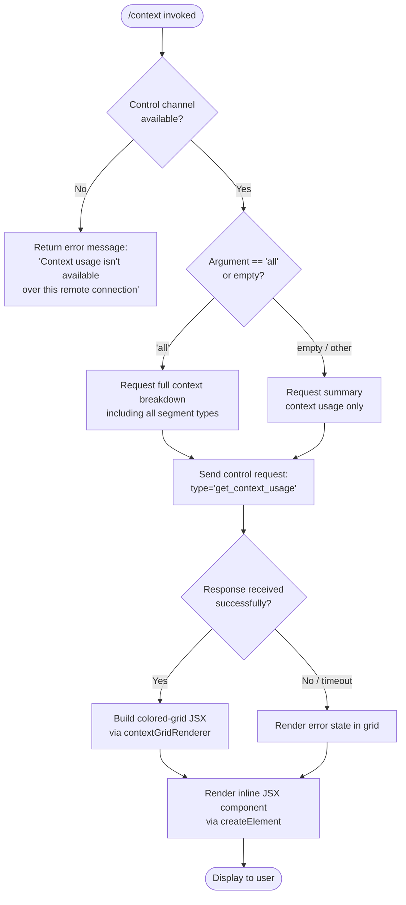

# `/context`

> Analysis basis: CC v2.1.178 bundle.js (AST extraction + Claude interpretation)
> Minimum version: v2.1.178

---

## Overview

The `/context` command visualizes the current conversation's context-window usage as a colored grid rendered inline in the terminal. It dispatches a `get_context_usage` control request over the active control channel, collects the token-usage response, then builds and displays a JSX grid element that color-codes consumed vs. available context space. If the session is operating over an unsupported remote connection the command exits early with an informational message.

---

## Registration

| Field | Value |
|---|---|
| type | `local-jsx` |
| name | `context` |
| description | `Visualize current context usage as a colored grid` |
| argumentHint | `[all]` |
| thinClientDispatch | `control-request` |
| module_id | `T9K` |
| load_inline | `true` |
| loc_byte | 11810497 |
| loc_byte_end | 11810723 |
| loc_line | 7409 |
| arbor_handler.name | `agL` |
| arbor_handler.fqn | `claude-2.1.178::agL` |
| arbor_handler.kind | `AsyncFunction` |
| arbor_handler.resolution_path | `module_id` |
| arbor_handler.n_hits | 0 |

Analysis basis: CC v2.1.178 bundle.js:+11810497

---

## Input Branching

Four distinct paths exist (remote-check, argument mode, control-request success, fallback error), so a flowchart is used.



Analysis basis: CC v2.1.178 bundle.js:+11809091 (handler entry), +11809175 (remote-unavailable literal), +11809122 (`'all'` literal), +11809257 (sendControlRequest call), +11809317 (response-listener setup)

---

## Behavioral Spec

### 1. Handler entry — `contextCommandHandler` (agL)

```
async function contextCommandHandler(args, appState):
    trimmedArgs = args.trim()                        // +11809097

    // Check whether a control channel is available
    hasControlChannel = checkControlChannelAvailable(appState)  // z7 / ny +11809130,+11809145
    if not hasControlChannel:
        return errorResponse(
            "Context usage isn't available over this remote connection"
        )                                             // +11809175

    // Determine display mode from argument
    mode = (trimmedArgs == "all") ? "all" : "summary"  // +11809122

    // Send control request to host process
    response = await appState.sendControlRequest({    // +11809257
        type: "get_context_usage",                    // +11809287
        mode: mode
    })

    // Set up response listener / subscriber
    responseListener = setupResponseListener(response, appState)  // z96 +11809317

    // Build the grid JSX element
    gridElement = createElement(                      // qU6.createElement +11809321
        contextGridComponent,                         // AU6 +11809427
        { response, mode, appState }
    )

    // Apply 80-column width constraint
    wrappedElement = wrapWithWidth(gridElement, 80)   // L literal +11809633,+11809638

    // Build context usage detail string
    detailString = buildDetailString(response)        // ogL +11809600

    return renderInlineJSX(wrappedElement, detailString)
```

Analysis basis: CC v2.1.178 bundle.js:+11809091

---

### 2. Control-channel availability check — `checkControlChannel` (z7 / ny)

```
function checkControlChannelAvailable(appState):
    // z7 checks whether the "controlChannel" key exists in appState
    result = lookupAppStateKey(appState, "controlChannel")  // YNH +1133649
    return Boolean(result)                                   // ny +11809145
```

Analysis basis: CC v2.1.178 bundle.js:+11809130, +1133649

---

### 3. Context grid renderer — `contextGridComponent` (AU6)

```
function contextGridComponent(props):
    { response, mode, appState } = props

    // Filter segments to display based on mode
    segments = response.segments
        .filter(seg => mode == "all" OR seg.visible)  // A.filter +11807194

    // Find the autocompact boundary segment if present
    autocompactSegment = segments.find(              // A.find +11807512
        seg => seg.type == "Autocompact buffer"      // literal +11807252
    )

    // Find the free-space segment
    freeSpaceSegment = segments.find(
        seg => seg.type == "Free space"              // literal +11807229
    )

    // Build per-segment label strings
    labelledSegments = segments.map(seg => ({
        ...seg,
        label: formatSegmentLabel(seg)               // String() +11808430
    }))

    // Compute percentage display via formatPercent
    percentageDisplay = formatPercent(               // N_H +11808929
        usedTokens,
        totalTokens
    )

    // Build the colored grid cells (one cell per token bucket)
    gridCells = buildGridCells(labelledSegments, rlH)  // rlH +11808849

    return renderGrid(gridCells, percentageDisplay, autocompactSegment)
```

Labels used for segment types (literals from the bundle):

| Segment type key | Display label |
|---|---|
| `"Free space"` | Free space |
| `"Autocompact buffer"` | Autocompact buffer |
| `"projectSettings"` | Project |
| `"userSettings"` | User |
| `"localSettings"` | Local |
| `"flagSettings"` (implicit) | Flag |
| `"policySettings"` (implicit) | Policy |
| `"plugin"` | Plugin |
| `"built-in"` | Built-in |
| `"mcp"` | MCP |
| `"system"` | (system prompt category) |

Analysis basis: CC v2.1.178 bundle.js:+11807194 through +11808430

---

### 4. Percentage formatter — `formatPercent` (N_H)

```
function formatPercent(used, total):
    ratio = used / total
    rounded = Math.round(ratio * 100)                // Math.round +218593
    formatted = formatNumber(rounded, "en-US", "compact")  // zK +218520, literals +220546,+220564
    // Append ".0" suffix when needed                // ".0" literal +218534
    if rounded < 20:
        label = "< 20"                               // literal +218573
    else if rounded < 10:
        label = "< 10"                               // literal +218606 (threshold=10)
    return formatted + "%"
```

Analysis basis: CC v2.1.178 bundle.js:+218520

---

### 5. Compact-boundary detection — `getCompactBoundary` (Ez)

```
function getCompactBoundary(contextData):
    boundary = contextData.find(                     // WB8 +11151667
        item => item.type == "compact_boundary"      // literal +11151537
    )
    if boundary:
        return boundary.offset
    return sliceFallback(contextData)                // H.slice +11151690
```

Analysis basis: CC v2.1.178 bundle.js:+11809053, +11151537

---

### 6. Response listener setup — `responseListenerSetup` (z96)

```
function responseListenerSetup(responseStream, appState):
    // Subscribe to the control-response event emitter
    appState.on("controlResponse", handler)           // K.on +8128715

    // Convert raw buffer to string for parsing
    rawString = responseBuffer.toString()             // L.toString +8128752

    // Hand off to JSX renderer
    jsxOutput = buildContextResponseJSX(rawString, appState)  // HQ +8128779

    return jsxOutput
```

Analysis basis: CC v2.1.178 bundle.js:+11809317

---

### 7. Full context-data loader — `fullContextDataLoader` (LU8)

`LU8` is the large context-payload assembly function invoked when the host responds to `get_context_usage`. It collects and merges many data sources in parallel:

```
async function fullContextDataLoader(appState):
    // Load conversation message history
    messageHistory = await loadMessageHistory(zZ)              // +10841090

    // Load active tool definitions
    toolDefs = await loadActiveTools(AV)                       // +10841116,+10841146

    // Load system-prompt data
    systemPromptData = await loadSystemPrompt(nd)              // +10841180

    // Load token-count data for all segments
    tokenData = await Promise.all([
        loadBuiltinTokens(tZ),                                 // +10841196
        loadMcpTokens(wB),                                     // +10841240
        loadClaudemdTokens(cH6),                               // +10841434
    ])

    // Assemble document segments with token counts
    allSegments = await assembleDocumentSegments(              // XRL +10841955
        messageHistory, toolDefs, systemPromptData, tokenData
    )

    // Filter/process tool-result messages
    processedSegments = await processToolResults(PRL)          // +10842004
    filteredMessages  = await filterMessages(WRL)              // +10842010
    expandedSegments  = await expandSegments(ERL)              // +10842025
    compressedSegments = await compressSegments(ZRL)           // +10842040
    groupedSegments    = await groupSegments(GRL)              // +10842047
    hashedSegments     = await hashSegments(hRL)               // +10842058
    trackedSegments    = await trackSegments(TRL)              // +10842085
    sizedSegments      = await computeSizes(Z4H)               // +10842192

    // Accumulate segment list
    resultSegments = buildFinalSegmentList(AH)                 // +10842225

    // Compute Math.max / Math.min bounds for display
    maxTokens = Math.max(...)                                  // +10843037
    minTokens = Math.min(...)                                  // +10843048

    // Apply rounding for display values
    displayTotal   = Math.round(rawTotal)                      // +10843645
    displayFloor   = Math.floor(rawFloor)                      // +10843807

    // Build labeled display rows
    rows = [
        { label: "System prompt",          color: "promptBorder"          }, // +10842239,+10842270
        { label: "System tools",           color: "default"               }, // +10842320
        { label: "MCP tools",              color: "cyan_FOR_SUBAGENTS_ONLY" }, // +10842385,+10842412
        { label: "MCP tools (deferred)",   color: ...                     }, // +10842461
        { label: "System tools (deferred)",color: ...                     }, // +10842547
        { label: "Custom agents",          color: ...                     }, // +10842636
        { label: "Memory files",           color: ...                     }, // +10842703
        { label: "Skills",                 color: "warning"               }, // +10842765
        { label: "Messages",               color: "purple_FOR_SUBAGENTS_ONLY" }, // +10843226,+10843252
    ]

    return { rows, maxTokens, minTokens, displayTotal, displayFloor }
```

Analysis basis: CC v2.1.178 bundle.js:+10841090 through +10844900

---

## State & Side Effects

| Item | Detail |
|---|---|
| Telemetry | `tengu_amber_creek` (+3540562), `tengu_pewter_brook` (+3540470), `tengu_marlin_porch` (+3911402), `tengu_native_cursor` (+3911708), `tengu_amber_redwood2` (+10826562), `tengu_silent_harbor` (+13834862), `tengu_slate_harrier` (+13844560), `tengu_orchid_mantis_v2` (+13829545), `tengu_orchid_mantis` (+13830394), `tengu_moth_copse` (+3456292), `tengu_sparrow_ledger` (+13834255), `tengu_heron_brook` (+13815018), `tengu_amber_sextant` (+13815110), `tengu_verified_vs_assumed` (+13822637), `tengu_chair_sermon` (+11114016) |
| Control request | Dispatches `get_context_usage` over the control channel (`thinClientDispatch: "control-request"`). Analysis basis: CC v2.1.178 bundle.js:+11809257, +11809287 |
| Hook registration | Registers a `controlResponse` event listener (`K.on`) for the duration of the command. Cleaned up after JSX render. Analysis basis: CC v2.1.178 bundle.js:+8128715 |
| appState changes | Read-only access. Does not mutate `appState`. |
| Display width | Grid is constrained to **80 columns**. Analysis basis: CC v2.1.178 bundle.js:+11809633 |
| Remote guard | Returns static error string when no control channel is available. Analysis basis: CC v2.1.178 bundle.js:+11809175 |
| Sound | None observed in depth-2 traversal. |

---

## Version History

| Version | Change |
|---|---|
| v2.1.178 | Initial analysis |

---

## Common Mistakes

1. **Running over a remote connection without a control channel.** The command requires an active control channel (`thinClientDispatch: "control-request"`). When invoked over a plain SSH session or thin-client without the channel, it immediately returns the message `"Context usage isn't available over this remote connection"` and shows nothing.

2. **Expecting token counts from all segment types without the `all` argument.** By default the grid shows a summary view. Pass `/context all` to include every segment type (MCP tools, deferred tools, custom agents, etc.) in the breakdown.

3. **Interpreting percentages below 20% as zero.** The formatter clips display labels to `"< 20"` or `"< 10"` when the ratio is below those thresholds; this is a display artifact, not a data error.

4. **Assuming the grid reflects real-time streaming counts.** The grid is computed from a snapshot taken at command invocation time. Token counts may change between invocation and render if a background operation is in flight.

5. **Confusing the "Autocompact buffer" segment with free space.** The autocompact buffer is a reserved slice of the window managed by the auto-compaction subsystem and is distinct from the "Free space" segment shown in the grid.

---

## Appendix — Identifier Mapping

> For bundle debugging only. Identifiers change across versions.

| Identifier | Role |
|---|---|
| `agL` | Main async handler for `/context` command |
| `C1` | Fullscreen / terminal-environment capability checker |
| `Ql` | UB4 set membership checker (terminal feature detection) |
| `uI_` | Background mode detection helper |
| `L6` | Low-level string coercion / output utility |
| `qe` | Terminal environment query |
| `Dof` | OS/terminal environment detector (checks iTerm, tmux, Windows) |
| `wof` | Terminal name prefix check (H.startsWith) |
| `N` | Logger / debug-output helper |
| `AM4` | Settings aggregator (loads multiple setting tiers) |
| `WSA` | Settings write utility |
| `xH` | JSON.stringify wrapper |
| `d4` | Path-manipulation utility |
| `sCA` | Token-map builder |
| `VdH` | Stream write wrapper |
| `FCA` | Low-level H.write caller |
| `LM4` | Log-file / appended-file manager |
| `sQH` | Debounced / batched flush scheduler |
| `G7H` | Directory join + file metadata helper |
| `INH` | Z8 file-system initializer |
| `_bA` | Path join + R6 resolver |
| `P__` | File stat / rename / unlink manager |
| `fM4` | Mkdir + appendFile + rotate helper |
| `F9` | XSA hook registrar |
| `xI_` | Windows-platform boolean check |
| `d_` | Tool-permission / capability gate |
| `dF` | Settings-load dispatcher |
| `Oq` | Memory-usage sampler + dedup set |
| `kM_` | Settings-load orchestrator (emits telemetry) |
| `pb` | Settings-source resolver (project/user/local/flag/policy) |
| `jof` | Fullscreen mode initialiser (dispatches tengu_amber_creek) |
| `O6` | App-state observable accessor |
| `S6` | Date.now-stamped state update |
| `z7` | Control-channel existence check (lookups YNH) |
| `ny` | Boolean coercion of control-channel result |
| `K` | sendControlRequest + padEnd display helper |
| `z96` | Control-response event listener setup |
| `HQ` | JSX render dispatch for context response |
| `BC_` | JJ9.createElement wrapper |
| `Ze` | Context-display container component |
| `IPH` | Inner context panel component |
| `hC_` | Compact panel sub-component |
| `AU6` | Context grid builder component |
| `zK` | Number formatter (Intl, en-US compact) |
| `O4` | OM4 locale formatter |
| `N_H` | Percentage display formatter (Math.round) |
| `TH` | String converter |
| `ogL` | Detail-string builder for context response |
| `Ez` | Compact-boundary locator |
| `WB8` | GX compact-boundary finder |
| `LU8` | Full context-data loader (main assembly function) |
| `zZ` | Message-history loader |
| `In` | Message entry processor |
| `JK` | Individual message token analyser |
| `gJ` | Message-group renderer |
| `QLH` | L6-based display label renderer |
| `dLH` | Yq-based tool-result renderer |
| `S_` | L6 output helper |
| `ZA` | Content-block renderer |
| `Yq` | Tool-result block renderer |
| `fg` | H.replace text normaliser |
| `dw` | fkH-based content decomposer |
| `fkH` | Content flattener |
| `oS` | OR1-based tool-result segment builder |
| `OR1` | Tool-result token counter |
| `q4` | H.replace cleanup helper |
| `uN` | qkH include-check helper |
| `_48` | Combined q4/Y1/iX6/uN dispatcher |
| `Y1` | Full segment-type analyser |
| `jY` | QLH-based label printer |
| `$t` | FP_/En/_P6 helper trio |
| `En` | S_/Y7 output helper |
| `MG` | q48 segment merger |
| `FLH` | gP_ formatting helper |
| `$R1` | mAH/$t/JK/dw dispatcher |
| `zL` | S_ text helper |
| `LkH` | aGf include-check |
| `ZrH` | L6-based range helper |
| `dGf` | H.toLowerCase normaliser |
| `sm` | QLH/f1/Xz/Y7 display helper |
| `AV` | Tool-definition loader |
| `Mf` | Tool-include checker |
| `hN` | Set-based tool dedup helper |
| `QM_` | a3/OAH resolver |
| `b8` | K68/pb settings combiner |
| `nd` | System-prompt segment loader |
| `f1` | iiH/nz/H.includes/o$6/sL content parser |
| `iiH` | d_/Object.entries tool-permission enumerator |
| `nz` | H.toLowerCase/.includes/.replace normaliser |
| `o$6` | <!-- TODO: not found in depth-2 traversal; needs --depth 4 --> |
| `sL` | H.replace content sanitiser |
| `GD` | TT debug gate |
| `TT` | Low-level terminal/TTY writer |
| `QJ` | O79/$y_/z79 token-count parser |
| `O79` | parseInt/isNaN safe-parse helper |
| `$y_` | UQH/O79/z79 context-size resolver |
| `z79` | jY/Mg/sm/b$8 display-label router |
| `s9H` | parseInt/isNaN/N token validator (valid/invalid/capped) |
| `xaq` | AV/R_/O6/NMA segment assembler |
| `R_` | <!-- TODO: not found in depth-2 traversal; needs --depth 4 --> |
| `NMA` | Token string parser (auto/env/settings modes) |
| `tZ` | Main context-data aggregator (calls all sub-loaders) |
| `zGA` | <!-- TODO: not found in depth-2 traversal; needs --depth 4 --> |
| `u6` | Pe6/W_ async-local-storage getter |
| `Pe6` | Xe6.getStore / Yl store accessor |
| `W_` | TT writer wrapper |
| `mU8` | MCP-server token counter |
| `raH` | Oy_-based tool-result token roller |
| `Oy_` | R_/ccf/f1/d1/O6/S6 content roller |
| `k$5` | System-prompt section builder |
| `wt` | f1-based text walker |
| `h$5` | <!-- TODO: not found in depth-2 traversal; needs --depth 4 --> |
| `y$5` | wt/$GA.isBriefEnabled/raH brief-mode dispatcher |
| `I$5` | v$/OGA confirm-action section builder |
| `S$5` | vC1/OGA code-style section builder |
| `vC1` | <!-- TODO: not found in depth-2 traversal; needs --depth 4 --> |
| `B48` | f1-based background-task block builder |
| `Lg` | q4-based label builder |
| `wL9` | qO8 schema-validation wrapper |
| `qO8` | Array.isArray/Object.freeze/Number.isInteger schema guard |
| `jGA` | f1/L6/DK/v$/O6 tool-definition formatter |
| `DK` | String coercion util |
| `MO5` | jGA wrapper (MCP tool section) |
| `Cd` | d_ tool-capability gate |
| `c$5` | Context-file loader (Xl/F2/d$5/R_/Z7/Jd/cd/O6) |
| `Xl` | <!-- TODO: not found in depth-2 traversal; needs --depth 4 --> |
| `F2` | L6/xH_ file formatter |
| `d$5` | np-based file loader |
| `g$A` | <!-- TODO: not found in depth-2 traversal; needs --depth 4 --> |
| `np` | ch9 file reader |
| `Z7` | <!-- TODO: not found in depth-2 traversal; needs --depth 4 --> |
| `Jd` | xq6/hxH context-injection helper |
| `cd` | H.flatMap/Array.isArray/_.map content flattener |
| `eG6` | Memory-file / CLAUDE.md section builder |
| `Ef` | Yb/CK/L6/DK/HO8/d_ memory formatter |
| `p1H` | n6/_.mkdir/Z8/N/String directory initialiser |
| `Ug` | n6/L.isFile/L.isDirectory/d stat helper |
| `H6` | c36 low-level helper |
| `SH` | d/dH stream handler |
| `A59` | nXH/N/TH/_.filter/Promise.allSettled/A.map/Tif memory-file loader |
| `pif` | nXH path-filter helper |
| `D` | Background process / session manager |
| `M` | MCP client manager |
| `tG6` | Memory-path parser (trim/split/slice/lastIndexOf) |
| `lj` | O6-based memory label builder |
| `P59` | uk_.join/$.push/$.join memory-path assembler |
| `X59` | iXH memory index loader |
| `J59` | iXH memory index loader (alternate) |
| `j` | Background agent process map |
| `J` | D-wrapping background process list |
| `dk_` | iXH memory-content loader |
| `d` | <!-- TODO: not found in depth-2 traversal; needs --depth 4 --> |
| `e$5` | DY/YGA/cd env-info section builder |
| `DY` | S_/H.toLowerCase/f1 environment string builder |
| `YGA` | f1-based dynamic env builder |
| `t$5` | Promise.all/zY/DGA/DY/YGA/u6/z3/wGA/cd static env builder |
| `DGA` | uFH.version/.release/.type OS info collector |
| `wGA` | H.includes/jf/ek shell-type detector |
| `m$5` | <!-- TODO: not found in depth-2 traversal; needs --depth 4 --> |
| `p$5` | <!-- TODO: not found in depth-2 traversal; needs --depth 4 --> |
| `_O5` | N1A/jyK.join scratchpad path resolver |
| `N1A` | d_ worktree-path helper |
| `VR8` | va/wYH remote-session descriptor |
| `va` | O6/Z3H/x_/H remote-info getter |
| `wYH` | S35/R6 remote-path formatter |
| `qO5` | $GA.isBriefEnabled brief-mode check |
| `LO5` | R_/b8/WsH/v$ focus-mode section builder |
| `WsH` | d_/S6 focus-state helper |
| `i$5` | L6/O6/N context-size item builder |
| `x$5` | S6/H.trim/O6/_.trim autonomy-mode builder |
| `u$5` | O6/wt autonomy-append builder |
| `HFq` | n$6/Promise.all/H.map/_.has/_.get/A.compute/h6_ tool-cache manager |
| `n$6` | <!-- TODO: not found in depth-2 traversal; needs --depth 4 --> |
| `h6_` | <!-- TODO: not found in depth-2 traversal; needs --depth 4 --> |
| `n$5` | OGA agent-identity section |
| `U$5` | <!-- TODO: not found in depth-2 traversal; needs --depth 4 --> |
| `B$5` | b$5/cd background-session content builder |
| `b$5` | <!-- TODO: not found in depth-2 traversal; needs --depth 4 --> |
| `F$5` | O6/cd tool-filter section |
| `g$5` | jGA tool-group section |
| `Q$5` | H.has/eT/cd/F2 quota section builder |
| `eT` | Ul/DK/L6/O6 tool-entry formatter |
| `l$5` | cd leftover-content loader |
| `k59` | y59/dk_ memory-index session builder |
| `y59` | Ef/lj/bSH.isTeamMemoryEnabled/v$ memory session checker |
| `CXH` | FN/Y7/S_ context-header builder |
| `FN` | Dy_/jSH mode-flag resolver |
| `Y7` | vq8 output helper |
| `JyK` | SU8/QJ/GD/RU8 context-window size resolver |
| `RU8` | Math.max infinite-window guard |
| `wB` | g4/tW/Xh/x_/M/Az/H.getSystemPrompt/d/dH/H6/Array.isArray system-prompt assembler |
| `g4` | <!-- TODO: not found in depth-2 traversal; needs --depth 4 --> |
| `tW` | L6/l0/Jq system-prompt token binder |
| `x_` | FvH/dt8/tc6.call/ec6.bind/W94/thA.set module loader |
| `Az` | <!-- TODO: not found in depth-2 traversal; needs --depth 4 --> |
| `dH` | c36 low-level stream helper |
| `c36` | Low-level TTY write |
| `cH6` | t9H CLAUDE.md file token counter |
| `t9H` | lH6.has assistant-message filter |
| `XRL` | tj/H.filter/JRL/Object.entries/$U8/Object.values/$76/Promise.all/K.map/L.reduce full segment assembler |
| `JRL` | H.match/H.split/q.trim/A.slice raw-text segment parser |
| `$U8` | Promise.all/HO5/I59/LGA/VR8 segment-source merger |
| `HO5` | Promise.all/zY/DGA/u6/z3/wGA/cd host-env segment |
| `I59` | y59/eG6/TM/p1H/Ug/H6/A.trim/q.push/q.join memory section assembler |
| `LGA` | H.indexOf/H.slice/A.startsWith/Error/A.slice heading parser |
| `$76` | wbH/N/TH/RH/maq token-counting pipeline |
| `wbH` | Full built-in token counter (gMA/UMA/d1/Pg/Qaq/Xz/QRL/sL/Cg/K.filter/kP_.has/SW/N/String) |
| `RH` | jA/L6/qq/RQ4/ElH.push/Us.logError error-report handler |
| `maq` | MCP tool token counter (gMA/UMA/Qaq/L6/G_H/D2/MG/Cg/FRL/Pg/kP_.has/sL/SW/d0H/EmH) |
| `PRL` | b1H/oV6/TP/Promise.all/H.map/$76/_.push tool-result token roller |
| `b1H` | Boolean/v4/lE CLAUDE.md presence check |
| `v4` | CK/vL CLAUDE.md content reader |
| `lE` | <!-- TODO: not found in depth-2 traversal; needs --depth 4 --> |
| `oV6` | O6/H.filter assistant-message filter |
| `WRL` | H.filter/Promise.resolve/jr/EQ/L/f.filter/M/iEH/z.map/G.has/X.add/Promise.all/z.entries/Math.max/X.has/D.push message-filter pipeline |
| `iEH` | Promise.all/H.map/OU8/$76/N/L.slice tool-result item expander |
| `OU8` | S_/OO5/v$/JO5/E79/$.get/O6/rEH/Rq/wO5/DO5/JSH/DK/Y7/L6/$.set/jSH/Object.keys/Y.has/jO5 full tool-result formatter |
| `z` | SH/bH/AR/aB background-process session wrapper |
| `bH` | d/dH process pipe helper |
| `AR` | qp/Bn.push/pkH/m0_ tool-approval recorder |
| `aB` | Promise.race/Promise.all/f5H/L5H/o8/process.exit abort-on-exit handler |
| `G` | Main interactive input handler (key events, editor, vim-mode) |
| `y` | <!-- TODO: not found in depth-2 traversal; needs --depth 4 --> |
| `w` | bX/process.exit/z.abort forced-shutdown handler |
| `T` | ch6/j36 key-event descriptor |
| `hl` | Cw cursor helper |
| `auK` | zP5/YP5/wP5/DP5/jP5 vim find/replace/textObject handlers |
| `RuK` | mr8/ur8/SuK/A.recordChange yank operator |
| `uuK` | mr8/ur8/xuK/A.recordChange visual-replace operator |
| `UuK` | mr8/ur8/puK/A.recordChange visual-case operator |
| `b` | yCH/Y/N/zt/NH6/Date.now/Ah9/P.has/z/S/P.add/X.set/d/l.map/f/_/MtK/i9H register / vim-state store |
| `FuK` | _.getRegister/mr8/ur8/QuK/_.recordChange visual-paste operator |
| `yuK` | Math.min/max/uf/K.slice/K.split/O.endsWith/M.slice/_.setText/Y.join/_.setOffset/KgH/_.recordChange join operator |
| `kuK` | Math.min/max/uf/L.slice/L.split/dEA/O.join/q.setText/q.setOffset/KgH/q.recordChange indent operator |
| `P` | Buffer.concat/X.indexOf/j.off/lL/j.setTimeout/X.subarray/Gb5/TH PTY read handler |
| `oEA` | eX5/HP5/_P5/AP5/qP5/KP5/fP5/LP5/MP5/$P5/OP5 operator-G sub-handlers |
| `S` | x14/D5/N/RH/Ub5/Y.write vim-command executor |
| `X` | M/q.setTimeout input debounce/coalesce |
| `ERL` | H.filter/iEH/Math.max/Promise.all/f.map/cM/xH/G.prompt/O.reduce/O.map/Math.round/Promise.resolve/jr/EQ/w/G.has/J.add/f.entries/L.push/J.has/D full context-expansion pipeline |
| `cM` | Math.round token-count rounder |
| `O` | C8 output coalescer |
| `ZRL` | Promise.all/_.map/$76/_.entries/A.push compressed-segment builder |
| `GRL` | MU_/u6/uaq/iEH grouped-segment builder |
| `MU_` | qX/n9H/Xl segment-classifier |
| `n9H` | H.filter/_.some/fNK MCP-server segment filter |
| `uaq` | mK config-merge helper |
| `mK` | Object.hasOwn/mK/xL9.get/K.get/uL9.has/Rnf/xL9.set/f.get/uL9.add/H.find/m4 recursive settings resolver |
| `hRL` | q.set/VRL/vRL/NRL/$76/NG segment-hash builder |
| `VRL` | xH/cM fast-path hash |
| `vRL` | cM/xH/A.get full-path hash |
| `NRL` | xH/cM name hash |
| `NG` | Full message-normalisation and tool-content pipeline (very large; owns most of the call graph) |
| `JxL` | vm6/K.push/Array.isArray/q.push/q.reverse tool-use block builder |
| `g3A` | <!-- TODO: not found in depth-2 traversal; needs --depth 4 --> |
| `oeq` | DHK content-block type checker |
| `TxL` | e3A/H$A/_$A/EB8/A$A/h76 attachment-type handlers |
| `F` | l.on/Z8/c/l.once/C/process.kill/N/B/Rg6.unlink/MV/u/Fv/S.splice/sB8/l.destroy/l.connect background-PTY manager |
| `vxL` | JU8/Array.isArray/_.has/A.add tool-use dedup helper |
| `Q3A` | Array.isArray/A.some/_.has tool-content presence check |
| `ExL` | Array.isArray/_.some tool-result presence check |
| `ZxL` | Array.isArray/_.get/K.startsWith/A.add MCP prefix handler |
| `a` | OU6/wqK app-state accessor |
| `N76` | _.some tool-availability check |
| `$` | xGK global state accessor |
| `B` | <!-- TODO: not found in depth-2 traversal; needs --depth 4 --> |
| `Q` | B/clearTimeout/setTimeout/Y.write/Math.round/d/u.unref debounced terminal writer |
| `UxL` | QI.randomUUID UUID generator |
| `F8` | P/QI.randomUUID/X tool-use ID generator |
| `T0` | <!-- TODO: not found in depth-2 traversal; needs --depth 4 --> |
| `rAA` | <!-- TODO: not found in depth-2 traversal; needs --depth 4 --> |
| `jB8` | JB8/eeq/kxL message-block factory |
| `jh` | yV6/N/S_/Y7 standard-output tool-result writer |
| `r3A` | Array.isArray/_.some/_.map/l6H assistant-message filter |
| `XxL` | Array.isArray/A.some/l6H/_.has/AZ/A.map/N tool-search reference replacer |
| `veq` | Array.isArray/A.flatMap/_.has media-rejection filter |
| `PxL` | H.some/Array.isArray tool-result presence validator |
| `pxL` | Array.isArray/_.get/Z9/M.slice/uxL.has/$.toLowerCase/l3A/mxL.has/A.slice MCP-tool prefix normaliser |
| `JHK` | <!-- TODO: not found in depth-2 traversal; needs --depth 4 --> |
| `hxL` | N/A.filter/q.some/seq thinking-block filter |
| `seq` | Vk_/_/d/H.filter content-block sequencer |
| `JU8` | Full message-assembly pipeline (Rq/F8/OxL/Ieq/cL/Op6/$p6/_J/A.join/uU8/Array.isArray/TmH/String/WU.formatDiagnosticsBlock/FxL/q.push/Y8/T0/K.push/K.join/q.join/A.push/YU8/K.slice/jm/Error) |
| `BxL` | _.push/l3A/_.join/A.trim breadcrumb builder |
| `NxL` | JB8/eeq/IxL message normaliser |
| `yx6` | Array.isArray/K.some/_.add/f.every/_.has/d/H.slice orphaned-thinking filter |
| `rxL` | H.at/A.at/Sm6/d/A.slice trailing-thinking filter |
| `hx6` | Array.isArray/Seq/L.some/A.add/H.filter/A.has/d/K.at/jB8/K.push whitespace-assistant filter |
| `oxL` | Array.isArray/d/H.slice empty-assistant fixer |
| `yxL` | _.at/H.slice/_.push/F8/T0/teq tool-use splitter |
| `req` | H.map/Array.isArray/A.some/K.push/f.push/f.findLastIndex/d3A/f.slice tool-use reorder helper |
| `teq` | A.at/jB8/A.push tool-use tail handler |
| `GxL` | Array.isArray/$.every/$.filter/O.join/K.slice/H.slice content-block group validator |
| `TRL` | GH6/u6/uaq/iEH/j2/K.map/Z7/bu6/qX/RH/jA tracked-segment builder |
| `GH6` | n9H/qX/Xl segment-group header |
| `j2` | Y1/q4/f1/oGf.has token-type classifier |
| `bu6` | cM/t7A token-bucket accumulator |
| `t7A` | <!-- TODO: not found in depth-2 traversal; needs --depth 4 --> |
| `jA` | Error/String error-message formatter |
| `Z4H` | Math.min/S3H/AV/nd sized-segment computer |
| `S3H` | RXH/s9H context-size resolver |
| `RXH` | f1/M79/Math.min output-token cap enforcer |
| `AH` | e/_H/E background-connection manager |
| `e` | Promise.all/zQ/P.filter/z_6/T/IG8/RH/t.applyMcpUpdate/AH.has/tbH/TH/l/INA MCP-update dispatcher |
| `zQ` | Full async-iterator / stream combiner |
| `z_6` | parseInt safety-wrapper |
| `IG8` | parseInt safety-wrapper (alt) |
| `t` | W.current/c.setTimeout/N/a voice/recording state manager |
| `tbH` | z0H background-state updater |
| `INA` | Object.entries/A.filter/_.getClients/j08/q/o8/N/$_6/ebH/hs8/Object.fromEntries/K.map MCP client enumerator |
| `_H` | J background-job registry |
| `E` | W/Math.max/Math.min main app-state store |
| `W` | j36/rR/hh/Promise.all/gr/dx/RH/jA SDK connection manager |
| `no` | R_/O6 fallback-context helper |
| `jk9` | Dk9/H.slice/EP/NG context-patch runner |
| `Dk9` | t9H/wk9 context-delta applier |
| `wk9` | <!-- TODO: not found in depth-2 traversal; needs --depth 4 --> |
| `EP` | gRL display-refresh trigger |
| `gRL` | r2H/JU8 grid-refresh assembler |
| `C6` | Jw/$8/G8.createComment/M6._appendChild JSX container element |
| `Jw` | <!-- TODO: not found in depth-2 traversal; needs --depth 4 --> |
| `$8` | A8 render-lifecycle manager |
| `A8` | Full render-cycle manager (C6.cancelAll/clearTimeout/PH.drop/UH/OH.write/uWK/_PA/Promise.race/OH.flush/o8/OH.close/N/u8/d/dH/HA/Date.now/K/tg6/f/Math.max/TH) |
| `G8` | EA/F6/J_/v6/XA/y_/c7 virtual-DOM node factory |
| `EA` | <!-- TODO: not found in depth-2 traversal; needs --depth 4 --> |
| `F6` | O.set/n/R DOM-state updater |
| `J_` | JD/YH DOM-node linker |
| `v6` | zH/q6/t.push virtual child-node pusher |
| `XA` | t.push/mH virtual-node appender |
| `y_` | OH.map/Object.keys/Object.entries/Cc_/zA4/Object.fromEntries/f8.has/Object.assign/f8.map/w8.get/tbH/e_.add/ew/O8.filter/C6.then/K1/$/O8.some/um props-diffing reconciler |
| `c7` | M6.replace/x9/AH._appendChild/AH.createComment/lH/c3 DOM patch helper |
| `M6` | D8/da/hy/Lq DOM element class |
| `D8` | d/YA/A7H/KH/MH/tm/GZH/gJ DOM-node data bag |
| `da` | jH DOM child manager |
| `hy` | PH/Error/q/y8 DOM node inserter |
| `Lq` | LH/f8/U8/e_/hy/n/c7 DOM-node updater |
| `EH` | Ac/R6/Boolean/r.has MCP-server entry filter |
| `Ac` | R6/Wf MCP-entry resolver |
| `R6` | TT raw writer |
| `Wf` | F9 hook registrar |
| `r` | W/hs8/t.applyMcpUpdate/tbH/n.push/a.push MCP-connection state machine |
| `hs8` | H.applyMcpUpdate/tbH/Y8/A.cleanup/RG/ew MCP-state updater |
| `n` | i.preventDefault/F key-event consumer |
| `XH` | Y$/R6/EH MCP-server header builder |
| `Y$` | R6/Wf MCP-entry header |
| `vH` | clearTimeout MCP-reconnect timer |
| `BH` | uo/ew/YFH/xy/UH.find/H6H/D6.filter/m4/wn6/CH6 main tool/MCP panel builder |
| `uo` | ah/J4H/K.concat/K.sort/ew tool-list assembler |
| `ah` | eT/Y.push/f7A/P2/J4H/L7A/jf/z.push/Fd/A.has/K.some/m4/GK.isEnabled/K.filter/xH6.has/K.map/O.isEnabled/F2/$.includes tool-entry builder |
| `J4H` | H.filter/Xu6 blocked-tool filter |
| `YFH` | XhH/ew/K.sort/q.sort/MXA.isCoordinatorMode/JXK tool-panel sorter |
| `JXK` | f.trim/H.some/IG/wXK/SH/H.filter/QU_.has/jXK/Bb8/MA5.has/q.has coordinator-role tool filter |
| `xy` | TT terminal output helper |
| `UH` | PqH/sH/U86/Promise.race/A6.then/tH.then MCP OAuth/connection manager |
| `PqH` | Full MCP OAuth server ($qH/Error/d/H6/dH/FQ/BI7/tK/NP/f.readAsync/mc_/Number/Y8/N08.randomUUID/Q28/LN6/h08/TH/G08.get/G08.set/Boolean/E.markStepUpPending/v08/E.setMetadata/Z08/E.state/I.removeAllListeners/I.on/I.close/clearTimeout/G08.delete/T08.get/T08.delete/U/B/b/c/R/F/T08.set/Gr/V08/l/Mo9.createServer/Oo9.parse/a.writeHead/a.end/uc_.default/String/a6/I.listen/I.unref/setTimeout/n/a/k.unref/E.tokens/SH/W.includes/mI7/bH) |
| `sH` | process.emit/kH.toggleQr/d/dH/kH.logStatus/kH.setSpawnModeDisplay/kH.refreshDisplay/U daemon-display updater |
| `U86` | E08.set/_.finally/E08.get/E08.delete MCP-connect promise tracker |
| `A6` | O6 MCP-result resolver |
| `tH` | Math.min/U.slice/k6.writeMessages MCP message batcher |
| `H6H` | D_A/j_A/$.filter/Y/w_A/J.set/_.map/eT/O.has/J.get/k3/R.split/U.trim/J.has/G.push/RT/$yH/V.has/E.push/V.add/xH6.has/z.has/w/X.has/T.push/W.push/F2/E.some/m4/k.push/W.splice tool-permission panel builder |
| `D_A` | H.filter/IG/m4/_WH.has/gU_.has/bV6.has/XM/Rq/mT/Uh9.has tool-filter |
| `j_A` | k3/_.add/A.add/RT/q.add/q.has/$yH/_.has/f permission-set builder |
| `Y` | hVH/q.write/$ZK/L.get/T.stop/L.delete/E.stop/E.updateConfig/E.start/R14/L.set/V.start/d MCP-watcher lifecycle |
| `w_A` | H.includes/k3/_.push/K.split/f.trim permission-line parser |
| `k3` | an4/AZ/sn4/H.substring/on4 permission-string normaliser |
| `R` | Y.write/d terminal write helper |
| `U` | clearTimeout/C/O.end/L.emit/M.emit MCP-connection cleanup |
| `RT` | H.split/K.join permission-path joiner |
| `$yH` | _n permission serialiser |
| `V` | Math.max/Math.floor/S.preventDefault/E scroll controller |
| `m4` | <!-- TODO: not found in depth-2 traversal; needs --depth 4 --> |
| `k` | Xi/Date.now/Math.min/I/y/QoK focus/blur timer |
| `D6` | k8.includes MCP-server capability filter |
| `k8` | cH/RH server-health checker |
| `wn6` | <!-- TODO: not found in depth-2 traversal; needs --depth 4 --> |
| `CH6` | kh9.get/jY7/kh9.set schema-validation cache |
| `jY7` | _.validateSchema/_.errorsText/_.compile/q/String AJV schema validator |

---

Note: index built via Arbor fallback; some signals (telemetry, literals) may be missing — see arbor-fallback.js.