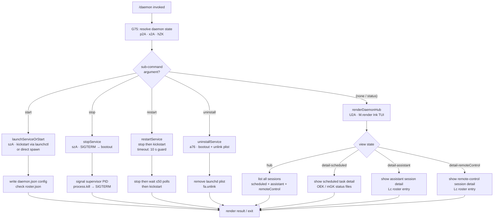

# `/daemon`

> Analysis basis: CC v2.1.178 bundle.js (AST extraction + Claude interpretation)
> Minimum version: v2.1.178

---

## Overview

`/daemon` manages the Claude Code background daemon process and its associated background services. It provides sub-commands to start, stop, restart, and inspect the status of the persistent supervisor process that orchestrates background sessions, scheduled tasks, and MCP (Model Context Protocol) server connections. The command renders a React/Ink TUI panel for interactive daemon management.

---

## Registration

| Field | Value |
|---|---|
| type | `local-jsx` |
| name | `daemon` |
| description | `Manage background services and routines` |
| loc_byte | `13377553` |
| loc_byte_end | `13377721` |
| loc_line | `9556` |
| immediate | `true` |
| module_id | `B2A` |
| load_inline | `true` |
| arbor_handler.name | `G75` |
| arbor_handler.fqn | `claude-2.1.178::G75` |
| arbor_handler.kind | `AsyncFunction` |
| arbor_handler.resolution_path | `module_id` |
| arbor_handler.n_hits | `0` |

Analysis basis: CC v2.1.178 bundle.js:+13377553

---

## Input Branching

The command supports at least five distinct sub-command paths (`start`, `stop`, `restart`, `uninstall`, and a default status/list view), plus a hub rendering path and sub-views (`detail-scheduled`, `detail-assistant`, `detail-remoteControl`). This exceeds the 3-branch threshold and warrants a Mermaid flowchart.



Analysis basis: CC v2.1.178 bundle.js:+13366303 (handler entry `G75`), +13376509 (inner render function `y75`), +13366945 (`"uninstall"` literal), +11852513 (`"start"`), +11852549 (`"stop"`), +11852589 (`"restart"`), +13367134 (view literals `"detail-scheduled"`, `"detail-assistant"`, `"detail-remoteControl"`).

---

## Behavioral Spec

### 1. Main Handler — daemon command entry point

**Handler:** `G75` (AsyncFunction, resolved via `module_id → B2A`).

```
async function daemonCommandHandler(args):
    [daemonStatus, homeDir, hubState] = await Promise.all([
        gatherDaemonProcessStatus(),   // p2A
        resolveHomeDirectory(),         // x2A
        buildHubState()                 // hZK
    ])
    renderDaemonTUI(daemonStatus, homeDir, hubState)
```

Analysis basis: CC v2.1.178 bundle.js:+13366303

---

### 2. Gather Daemon Process Status (`p2A`)

Aggregates the state of all background components in parallel, resolving file-based status records and live process presence.

```
async function gatherDaemonProcessStatus():
    [configInfo, supervisorStatus, scheduledStatus,
     rosterInfo, launchctlStatus] = await Promise.all([
        readDaemonConfig(),             // TZK → reads daemon.json
        readDaemonStatusFile(),         // DZK → daemon.status.json
        readScheduledStatusFile(),      // OEK → daemon.scheduled.status.json
        readRosterFile(),               // Lc  → roster.json
        queryLaunchctlStatus()          // La  → launchctl print, timeout 5000 ms
    ])
    return merged status object
```

Key file paths (all relative to a computed config directory):

- Main config: `daemon.json` (bundle.js:+11850076)
- Active daemon status: `daemon.status.json` (bundle.js:+13159612)
- Scheduled daemon status: `daemon.scheduled.status.json` (bundle.js:+13252038)
- Roster file: `roster.json` (bundle.js:+11856815)

Analysis basis: CC v2.1.178 bundle.js:+13365824 (`p2A` body start)

---

### 3. Read Daemon Config (`TZK → S56 → QPA`)

Reads and parses `daemon.json`, enforcing file integrity.

```
async function readDaemonConfig(configDir):
    stat = await fs.stat(configPath)
    if not stat.isFile():
        throw Error
    raw = await fs.readFile(configPath, "utf8")   // max 1 048 576 bytes
    text = raw.trim()
    parsed = JSON.parse(text)
    if not Array.isArray(parsed):
        return []
    tasks = parsed.filter(isScheduledEntry)       // kind === "scheduled"
    return tasks
```

- File size guard: **1 048 576 bytes** (bundle.js:+13160432)
- Encoding: `"utf8"` (bundle.js:+13160551)
- Scheduled task marker: string `"scheduled"` (bundle.js:+13253543)

Analysis basis: CC v2.1.178 bundle.js:+13160374

---

### 4. Read Daemon Status File (`DZK → hVH`)

Reads `daemon.status.json`; handles `ENOENT` gracefully (daemon not running).

```
async function readDaemonStatusFile(configDir):
    try:
        stat = await fs.stat(statusPath)
    except error if error.code === "ENOENT":
        return Promise.reject("ENOENT")   // no daemon running
    if not stat.isFile():
        return Promise.reject(...)
    content = await readAndDecodeFile(statusPath)   // f9 → async store
    processedStatus = parseStatusContent(content)   // b2A, C2A
    // enumerates keys via Object.keys
    return processedStatus
```

- Error code sentinel: `"ENOENT"` (bundle.js:+13348394)
- Alignment helper pads fields to width `"  "` (two spaces) (bundle.js:+17091893)

Analysis basis: CC v2.1.178 bundle.js:+13348363

---

### 5. Kill / Stop Daemon Process (`qT → OU6 / process.kill`)

Used during stop, restart, and cleanup flows.

```
async function stopDaemonProcess(configDir):
    pidFilePath = computePidPath(configDir)     // Cu → izA.join + M_
    stat = await fs.lstat(pidFilePath)
    if not stat.isFile():
        await fs.rm(pidFilePath, { force: true })   // 65 536 flag
        return
    raw = await fs.readFile(pidFilePath)
    pidStr = decodeUtf8(raw)                    // x8
    pid = parseAndValidatePid(pidStr)           // zq

    process.kill(pid, signal)

    // fallback: read "claude daemon" process name lines
    lines = await readProcLines()               // nzA → readFile, split, slice
    // line containing "claude daemon" at index 4 (bundle.js:+11849541)
```

- PID file flag (file-open mode): `65536` (bundle.js:+11848577)
- Process name match string: `"claude daemon"` (bundle.js:+11849502)
- Column index for PID in process line: `4` (bundle.js:+11849529)

Analysis basis: CC v2.1.178 bundle.js:+11849583 (`OU6`), +11849611 (`process.kill`)

---

### 6. Query launchctl Status (`La → g8 → Q_`)

Runs `launchctl print` with a 5 000 ms timeout; used on macOS to confirm daemon registration.

```
async function queryLaunchctlStatus():
    result = await spawnProcess("launchctl", ["print", serviceDomain])
    // timeout: 5000 ms (bundle.js:+11853711)
    // communicates via IPC in batches of 10 (bundle.js:+1131181)
    // microsecond precision: 1 000 000 divisor (bundle.js:+1131703)
    return parseOutput(result)
```

- Command: `"launchctl"` (bundle.js:+11853664)
- Argument: `"print"` (bundle.js:+11853677)
- Timeout: **5 000 ms** (bundle.js:+11853711)
- Platform guard: `"darwin"` (bundle.js:+11853172)

Analysis basis: CC v2.1.178 bundle.js:+11853661

---

### 7. Resolve Home Directory and Helper Path (`x2A`)

Determines the assistant home directory path used to locate config and socket files.

```
async function resolveHomePath():
    home = os.homedir()                          // OZK.homedir
    joined = path.join(home, assistantSubdir)    // AYH.join
    stat = await fs.stat(joined)                 // bF6.stat
    if error:
        return null                              // x8 / N branch
    role = "assistant"                           // bundle.js:+13350207
    formatted = formatPath(joined)               // TH → String
    return { home, joined, role }
```

- Role constant: `"assistant"` (bundle.js:+13350207)

Analysis basis: CC v2.1.178 bundle.js:+13350147

---

### 8. Build Hub State (`hZK → PoH → Y26`)

Constructs the top-level hub view state, including model selection resolution and session list.

```
async function buildHubState(context):
    sessions = await resolveActiveSessions()    // Y26
    filteredSessions = sessions.filter(...)     // q.filter
    modelConfig = resolveModelConfig()          // Y1 → model name normalisation
    // model names normalised to lowercase, trimmed
    // known tags: "opus", "sonnet", "haiku", "best", "fable",
    //             "opusplan", "opus[1m]", "[1m]"
    return { sessions: filteredSessions, model: modelConfig }
```

Analysis basis: CC v2.1.178 bundle.js:+13366186 (`hZK`), +2565783 (`Y26`)

---

### 9. Render TUI — Inner Render Function (`y75`)

Mounts the Ink TUI panel; called from the main handler after all async state is resolved.

```
function renderDaemonTUI(daemonStatus, homeDir, hubState):
    instance = renderInkComponent(
        DaemonHubComponent,              // U2A
        { daemonStatus, homeDir, hubState }
    )
    // sets up keyboard handler G
    // mounts view selector K / H / _
    instance.waitForUnmount()            // M.unmount on exit
```

Sub-views rendered based on current view state literal:

| View key | Description |
|---|---|
| `"hub"` | Top-level session list (bundle.js:+13366641) |
| `"new"` | New session creation (bundle.js:+13367232) |
| `"detail-scheduled"` | Scheduled task detail (bundle.js:+13367134) |
| `"detail-assistant"` | Assistant session detail (bundle.js:+13367292) |
| `"detail-remoteControl"` | Remote-control session detail (bundle.js:+13367413) |

Labels rendered in UI:

- `"Scheduled"` (bundle.js:+13368061)
- `"Remote Control"` (bundle.js:+13368382)
- `"Claude daemon"` (bundle.js:+13368667)
- `"permission"` (bundle.js:+13368765)

Analysis basis: CC v2.1.178 bundle.js:+13376509

---

### 10. Service Lifecycle Sub-commands

#### Start (`szA → kickstart`)

```
async function startService():
    gF8()           // check launchctl uid via process.getuid
    g8()            // query current launchctl status
    await spawn("launchctl", ["kickstart", ...])
    // polls up to 50 times (bundle.js:+11852817)
    // inter-poll delay via JqK.setTimeout
```

#### Stop (`szA → stop`)

```
async function stopService():
    gF8()
    g8()
    await spawn("launchctl", ["stop", ...])
    // or "bootout" on removal path
```

#### Restart (`szA → stop + kickstart`)

```
async function restartService():
    await stopService()
    // waits for daemon to exit; aborts if not exited within 10 s
    // "daemon did not exit within 10s of SIGTERM; restart aborted before kickstart"
    //    (bundle.js:+11852846)
    await startService()
```

#### Uninstall (`a76 → bootout + fa.unlink`)

```
async function uninstallService():
    if platform === "darwin":
        // plist location: ~/Library/LaunchAgents/<plist>
        await spawn("launchctl", ["bootout", ...])
        await fs.unlink(plistPath)
    else:
        throw Error("service uninstall not available on darwin")
        // note: message says darwin, but guard is non-darwin
```

- Plist base directory: `"Library"` / `"LaunchAgents"` (bundle.js:+11850391, +11850401)
- `"kickstart"` literal (bundle.js:+11852524)
- `"bootout"` literal (bundle.js:+11852162)
- `"uninstall"` sub-command literal (bundle.js:+13366945)
- Poll limit: **50** iterations (bundle.js:+11852817)
- 10 s exit guard message (bundle.js:+11852846)

Analysis basis: CC v2.1.178 bundle.js:+11852134 (`azA`), +11852407 (`szA`)

---

### 11. Roster File Management (`Lc`)

`roster.json` tracks all live background sessions. The reader validates integrity and handles corruption.

```
async function readRosterFile(rosterPath):
    stat = await fs.lstat(rosterPath)
    if not stat.isFile():
        logError("is not a regular file — removing")   // bundle.js:+11860991
        // rename as backup with Date.now() suffix (rF8)
        await fs.rm(rosterPath)
        return []

    raw = await fs.readFile(rosterPath)
    text = decodeUtf8(raw)          // x8
    parsed = parseJSON(text)        // i6 → JSON.parse
    if not valid:
        // error codes: "E2BIG", "EFTYPE"  (bundle.js:+11861117, +11861129)
        emit telemetry: tengu_bg_roster_parse_failed
        return []

    entries = normaliseEntries(parsed)  // kqK — Array.isArray / Object.keys
    return entries
```

- Telemetry on parse failure: `tengu_bg_roster_parse_failed` (bundle.js:+11861037)
- Error codes surfaced: `"E2BIG"` (bundle.js:+11861117), `"EFTYPE"` (bundle.js:+11861129)

Analysis basis: CC v2.1.178 bundle.js:+11860844

---

### 12. Supervisor / Background Session Management (`D`, `khA`, `Gb5`)

The supervisor loop manages background worker sessions: spawning, claiming spare workers, handling low-memory conditions, and broadcasting state.

```
async function supervisorLoop():
    while running:
        sweep()          // I → retireIfSettled, respawnIfIdleStale, shiftGraceClocksForward
        // low-memory path:
        if freemem < threshold:
            emit telemetry: tengu_bg_low_mem_mb
            if lowMemPersists:
                emit telemetry: tengu_bg_retire_pinned_low_mem
                retirePinnedSettledWorkers()
        // prewarm:
        if shouldPrewarm:
            emit telemetry: tengu_bg_prewarm_per_sweep
```

Spare-worker claim flow (`ZhA → yc.claim → SGA`):

```
async function claimSpareWorker(sessionConfig):
    emit telemetry: tengu_bg_spare_claim
    socket = await ls8.connect(socketPath)
    claimFrame = buildClaimFrame(sessionConfig)   // Mb5
    socket.write(claimFrame)
    // write config JSON: 448 bytes default, 384 bytes compact  (bundle.js:+13953570, +13953621)
    if timeout:
        emit telemetry: tengu_bg_sendclaim_failed
    if ECONNREFUSED:
        emit telemetry: tengu_bg_spare_claim_fail
```

Analysis basis: CC v2.1.178 bundle.js:+17067459 (`khA`), +17042396 (`ZhA`), +17067352 (`tengu_bg_spare_enable`)

---

### 13. Daemon Stop Control (`z → aB`)

Invoked when the TUI sends a stop control action.

```
async function daemonStopControl():
    emit telemetry: tengu_daemon_control   // bundle.js:+17104063
    try:
        await Promise.race([
            shutdownAllComponents(),       // f5H → K5H.shutdown
            Promise.all([
                cleanupTimers(),           // L5H → clearTimeout
                teardownConnections()      // o8
            ])
        ])
        // delay: 500 ms (bundle.js:+17099106)
        process.exit(0)
    except:
        emit telemetry: tengu_daemon_control (failure variant)
```

- Stop telemetry string: `"daemon_stop"` (bundle.js:+17103988)
- Failure telemetry string: `"daemon_stop_failed"` (bundle.js:+17104025)

Analysis basis: CC v2.1.178 bundle.js:+17099062

---

### 14. MCP Server Connection Management (background, reached via `ebH → I08`)

Depth-2 traversal exposes a significant MCP server lifecycle within the daemon. Key behaviors:

- **OAuth flow**: `tengu_mcp_oauth_flow_start` → user redirected to browser → callback on `http://localhost:<port>/callback` → `tengu_mcp_oauth_flow_success` or `tengu_mcp_oauth_flow_error`. Auth timeout: **300 000 ms** (5 minutes) (bundle.js:+6568318).
- **Reconnect**: `tengu_mcp_reconnect` / `tengu_mcp_reconnect_failed` / `tengu_mcp_reconnect_needs_auth_discovery`.
- **Needs-auth cache**: stored in `mcp-needs-auth-cache.json` (bundle.js:+6784313); cached failure suppresses retry for **15 minutes** (shown in message at bundle.js:+6794731).
- **Server types** enumerated: `"stdio"`, `"sse"`, `"http"`, `"sse-ide"`, `"ws-ide"`, `"claudeai-proxy"` (bundle.js:+6793876 ff.).
- **Config scopes**: `"enterprise"`, `"user"`, `"project"`, `"local"`, `"mcp"` (bundle.js:+6535874 ff.).
- **Skill telemetry**: `tengu_mcp_skills` (bundle.js:+6670836).

Analysis basis: CC v2.1.178 bundle.js:+6793676 (`ebH`), +6591723 (`I08`), +6563620 (`PqH`)

---

## State & Side Effects

| Item | Detail |
|---|---|
| Telemetry — roster | `tengu_bg_roster_parse_failed` (bundle.js:+11861037) |
| Telemetry — MCP OAuth | `tengu_mcp_oauth_flow_start`, `tengu_mcp_oauth_flow_success`, `tengu_mcp_oauth_flow_error` (bundle.js:+6563766, +6568744, +6570455) |
| Telemetry — config | `tengu_daemon_config_reload` (bundle.js:+17081946), `tengu_config_auth_loss_prevented` (bundle.js:+3345928) |
| Telemetry — daemon control | `tengu_daemon_control` (bundle.js:+17104063) |
| Telemetry — background sessions | `tengu_bg_retire_pinned_low_mem`, `tengu_bg_prewarm_per_sweep`, `tengu_bg_proto_mismatch`, `tengu_bg_dispatch_stale_drop`, `tengu_bg_attach_legacy_autorespawn`, `tengu_bg_attach`, `tengu_bg_attach_stall_gave_up`, `tengu_bg_attach_stall_respawn`, `tengu_bg_attach_kick`, `tengu_bg_dispatch_sigkill_escalate`, `tengu_bg_low_mem_mb`, `tengu_bg_dispatch_low_mem`, `tengu_bg_spare_enable`, `tengu_bg_spare_claim`, `tengu_bg_spare_claim_fail`, `tengu_bg_sendclaim_failed`, `tengu_bg_state_read_transient` |
| Telemetry — scheduled tasks | `tengu_scheduled_task_fire`, `tengu_scheduled_task_missed`, `tengu_scheduled_task_expired` (bundle.js:+16547892, +16547141, +16548235) |
| Telemetry — bg session create | `tengu_daemon_bg_session_create` (bundle.js:+17066363) |
| Telemetry — MCP reconnect | `tengu_mcp_reconnect`, `tengu_mcp_reconnect_not_connected`, `tengu_mcp_reconnect_needs_auth_discovery`, `tengu_mcp_reconnect_failed` |
| Telemetry — feature flags | `tengu_feature_ok`, `tengu_feature_bad` (bundle.js:+1020153, +1020220) |
| Telemetry — MCP skills | `tengu_mcp_skills` (bundle.js:+6670836) |
| Files written | `daemon.json`, `daemon.status.json`, `daemon.scheduled.status.json`, `roster.json`, `mcp-needs-auth-cache.json`, `pins.json` (bundle.js:+4275979) |
| Files unlinked | launchd plist on uninstall (`fa.unlink`); stale PID file (`fs.rm`) |
| Process signals sent | `SIGTERM` (bundle.js:+17068002), `SIGKILL` (bundle.js:+17058405) via `process.kill` |
| OS subprocess spawned | `launchctl` (`print`, `kickstart`, `stop`, `bootout`) on macOS |
| Ink TUI mounted | `M.render` → `U2A` component; unmounted on exit via `M.unmount` |
| `appState` changes | Supervisor state machine transitions: `"starting"`, `"resuming"`, `"adopted"`, `"crashed"`, `"closed"`, `"settled"`, `"in-progress"`, `"stopped"`, `"killed"`, `"done"` |
| Background session claim | Unix-socket connection to supervisor (`ls8.connect`); writes binary claim frame |
| Hook registration | `F9 → XSA.register` (bundle.js:+66308) — registers a cleanup/shutdown hook |
| Log output | `Us.logError`, `Us.logMCPDebug`, `Us.logMCPError` throughout |
| Sound | <!-- TODO: not found in depth-2 traversal; needs --depth 4 --> |

---

## Version History

| Version | Change |
|---|---|
| v2.1.178 | Initial analysis |

---

## Common Mistakes

1. **Running `/daemon start` outside macOS**: The launchctl-based service management path is guarded by `"darwin"` (bundle.js:+11853172); on other platforms the sub-commands may partially fail or report unsupported.
2. **Expecting immediate status after `start`**: The command polls up to **50** times waiting for the daemon to become ready (bundle.js:+11852817); a slow system may still show the daemon as not running immediately.
3. **Stale PID file after crash**: If the daemon crashes without cleaning up, the PID file may point to a dead process. The stop path handles this by calling `fs.rm` when `lstat` reports a non-regular file, but manual cleanup of `daemon.status.json` may still be required.
4. **MCP auth cache blocking reconnects**: After an MCP server auth failure the `mcp-needs-auth-cache.json` suppresses reconnects for 15 minutes (bundle.js:+6794731). Editing or deleting that file forces an immediate retry.
5. **`/daemon uninstall` on non-macOS**: The error message references `"darwin"` but the guard logic means it will throw on any non-macOS host; use process signals or system service tooling directly instead.

---

## Appendix — Identifier Mapping

> For bundle debugging only. Identifiers change across versions.

| Identifier | Role |
|---|---|
| `G75` | Main daemon command async handler (`arbor_handler`) |
| `y75` | Inner TUI render function (Ink mount) |
| `U2A` | Daemon hub React/Ink component |
| `p2A` | Gather daemon process status (parallel resolver) |
| `x2A` | Resolve home/assistant directory path |
| `hZK` | Build hub view state |
| `TZK` | Read daemon config file pipeline |
| `S56` | Parse scheduled task list from config |
| `QPA` | Low-level config file reader (stat + readFile + JSON.parse) |
| `J2A` | Scheduled entry validator (Array.isArray) |
| `D2A` | <!-- TODO: not found in depth-2 traversal; needs --depth 4 --> |
| `DZK` | Read daemon status file pipeline |
| `hVH` | Daemon status file stat + decode |
| `b2A` | Status content processor |
| `C2A` | Status field formatter |
| `mGK` | Read/kill assistant daemon (daemon.status.json path) |
| `XF6` | Compute `daemon.status.json` path |
| `OEK` | Read/kill scheduled daemon (daemon.scheduled.status.json path) |
| `$EK` | Compute `daemon.scheduled.status.json` path |
| `qT` | Kill daemon process by PID file |
| `OU6` | PID file stat + read + rm helper |
| `nzA` | Read process list lines to find daemon PID |
| `CW` | Post-kill cleanup wrapper |
| `Cu` | Compute `daemon.json` path (izA.join + M_) |
| `Lc` | Read and validate `roster.json` |
| `L8H` | Compute `roster.json` path |
| `NzH` | Compute roster directory path (g$.join + M_) |
| `rF8` | Backup-rename corrupt roster file (adds Date.now suffix) |
| `PU6` | Timestamp helper (Date.now) |
| `kqK` | Normalise roster entries (Array.isArray / Object.keys) |
| `URA` | Roster entry normaliser |
| `La` | Query launchctl status |
| `g8` | Spawn launchctl subprocess |
| `Q_` | Process spawn core (IPC batches of 10, 1 000 000 µs divisor) |
| `u6` | Spawn helper (Pe6, W_) |
| `gF8` | Get launchctl UID (process.getuid) |
| `XqK` | UID resolver |
| `a76` | Uninstall service (bootout + unlink plist) |
| `azA` | Compute LaunchAgents plist path (~/Library/LaunchAgents) |
| `DU6` | Start/stop/restart service dispatcher |
| `szA` | Service lifecycle executor (kickstart / stop / bootout, 50-poll loop) |
| `D` | Supervisor session manager (spawn, claim, low-mem) |
| `khA` | Background session lifecycle handler |
| `ZhA` | Claim spare worker via Unix socket |
| `SGA` | Write session config JSON to socket (448/384 byte payloads) |
| `Mb5` | Build claim frame |
| `$b5` | Claim timeout / ECONNREFUSED handler |
| `Gb5` | IPC frame dispatcher (ping, nudge, dispatch, attach, kill, resize, etc.) |
| `I` | Background sweep loop (retireIfSettled, respawnIfIdleStale, shiftGraceClocksForward) |
| `k` | Worker pool ticker (blurred/focused, 3 600 000 ms window, 0.8 factor) |
| `QoK` | Pool "system" / "away_summary" queue head accessor |
| `M` | MCP manager (render + update) |
| `ebH` | MCP connection batch processor (Object.entries over server map) |
| `INA` | MCP server list reconciler |
| `hs8` | Apply MCP connection result |
| `RG` | MCP cleanup runner |
| `I08` | MCP server connection executor |
| `PqH` | MCP SSE/HTTP server runner (OAuth callback HTTP server) |
| `nI7` | SSH/URL connection type selector |
| `S08` | Complete-authentication tool handler |
| `ur` | MCP reconnect coordinator |
| `U86` | MCP pending-connection tracker (E08 map) |
| `R08` | MCP cache read helper |
| `Ie9` | MCP needs-auth cache checker |
| `kG8` | Compute `mcp-needs-auth-cache.json` path (yG8.join + M_) |
| `pc_` | MCP skills telemetry emitter |
| `Nh` | MCP skill set builder |
| `O6` | MCP tool registration (vG6, NG6, Xp, xg) |
| `Ec_` | MCP server config normaliser (W8) |
| `W8` | Config auth-loss prevention wrapper |
| `Ne9` | Multiplex stream manager (zQ) |
| `z_6` | parseInt wrapper for port parsing |
| `IG8` | parseInt wrapper for config numeric fields |
| `Y8` | MCP debug log emitter (ElH.push + Us.logMCPDebug) |
| `$7` | MCP error log emitter (ElH.push + Us.logMCPError) |
| `Te9` | MCP connection state hash / timestamp tracker |
| `Pn_` | MCP auth cache reader (f9 + kG8 + i6) |
| `z0H` | Content hash helper (xH + Array.isArray + Object.keys + or9.createHash sha256) |
| `r28` | MCP slot key builder ($qH + Object.keys + mWH) |
| `o28` | MCP slot outer wrapper (r28 + NP) |
| `n28` | MCP slot name normaliser (tK) |
| `Y` | Supervisor config reload handler (hVH, $ZK, E.stop/start/updateConfig) |
| `F` | PTY/socket connection to background worker (l.on/once/connect/destroy) |
| `MV` | Worker mtime-change detector (NqK) |
| `Fv` | Binary frame builder (Buffer.allocUnsafe, writeUInt32BE, writeUInt8) |
| `sB8` | Binary frame parser (Buffer.alloc/concat, readUInt32BE, readUInt8) |
| `G` | TUI keyboard input handler (Ink component) |
| `b` | Background session register / schedule store |
| `yCH` | Read schedule register file (utf-8, readFile) |
| `NH6` | Write schedule register file (mkdir + writeFile) |
| `Ah9` | Filter scheduled entries by time window |
| `vH6` | Schedule entry validity checker |
| `MtK` | Schedule cron description builder |
| `Dh` | Cron expression parser (match, parseInt, getUTCDay, setUTCDate) |
| `c` | Scheduled task firing loop |
| `P` | IPC socket connection to supervisor (Buffer.concat, indexOf, readAsync) |
| `X` | Supervisor socket multiplexer (M + q.setTimeout) |
| `lL` | Socket end/write helper |
| `dRH` | Daemon pins.json reader (tJ.lstat/rm/readFile, Array.isArray) |
| `yf7` | Recursive directory walker for pins (tJ.readdir/lstat) |
| `ul8` | Low-memory OS query on macOS (a6 + O6) |
| `dH` | Feature flag "bad" reporter |
| `SH` | Feature flag "ok" reporter |
| `z` | Main session/worker state machine |
| `aB` | Shutdown race (Promise.race, process.exit, 500 ms delay) |
| `AR` | Session event dispatcher (qp, Bn.push, pkH, m0_) |
| `m0_` | Session event emitter (randomUUID, AoH, H.emit) |
| `PoH` | Hub state resolver (Y26) |
| `Y26` | Session list builder with model config |
| `$yf` | Model/session entry builder |
| `Y1` | Model name normaliser (trim, toLowerCase, alias map) |
| `kO` | Model alias resolver |
| `f1` | Feature flag checker |
| `sc1` | Session capability set |
| `RH` | Error ring buffer appender (Ye6.shift/push, ElH.push, Us.logError) |
| `RQ4` | Ring buffer rotation (shift + push) |
| `qq` | Essential-traffic network filter |
| `jA` | Error constructor wrapper |
| `L6` | String coercion helper |
| `TH` | String formatter |
| `x8` | UTF-8 / binary decoder |
| `hL` | Error code classifier |
| `Os` | Error suppressor (ENOENT etc.) |
| `xH` | JSON.stringify helper |
| `i6` | JSON.parse helper |
| `zq` | PID / numeric string validator |
| `N` | HTTP-level network helper (xNH, AM4, WSA, H.includes, xH, d4, VdH, LM4) |
| `LM4` | Log-file writer (sQH, G7H, dirname, mkdir, appendFile, Buffer.byteLength) |
| `sQH` | Debounced log flush (clearTimeout, setTimeout, setImmediate) |
| `G7H` | Log file path builder (NdH, W7H.join, M_, R6) |
| `F9` | Shutdown hook registrar (XSA.register) |
| `f9` | Async local storage reader (P2f.getStore) |
| `M_` | Path resolver helper |
| `zt` | Clock helper (cLH) |
| `xGK` | Daemon status JSON writer (zt + Date.now + f9 + XF6 + xH) |
| `HO` | Roster active-entry checker (rT) |
| `HL6` | Roster polling loop (IqK.then + Lc + Date.now + KdL) |
| `XU6` | Compute socket path (g$.join + jU6) |
| `hzH` | Compute alternate socket path (g$.join + xBH) |
| `JU6` | Compute primary socket path (g$.join + jU6) |
| `lI` | Socket setup helper (a6 + HYA + g$.join + e76) |
| `lv` | Worker name getter (NqK) |
| `Mq` | Pins/session file watcher (tJ.lstat/readFile + Ce Map) |
| `w4` | Compute pins path (oj.join + IZ) |
| `f2H` | Dispatch arg parser (K.startsWith/indexOf/slice, up/iE6/gRH sets) |
| `SL` | Session log path builder (yO + oj.join + xH + eJ) |
| `b1` | Clock context consumer (ij9.useContext) |
| `l4` | Ink useMemo/useRef/useContext/useSyncExternalStore hook bundle |
| `V` | Scroll / pagination component (Math.max/floor, S.preventDefault, E) |
| `E` | Viewport bounds calculator (W, Math.max/min) |
| `W` | Connection retry renderer (j36, rR, hh, Promise.all, gr, dx, RH, jA) |
| `J` | Session detail view selector (D) |
| `a76` | Service uninstall entry point |
| `DU6` | Service action dispatcher |

Note: index built via Arbor fallback; some signals (telemetry, literals) may be missing — see arbor-fallback.js.