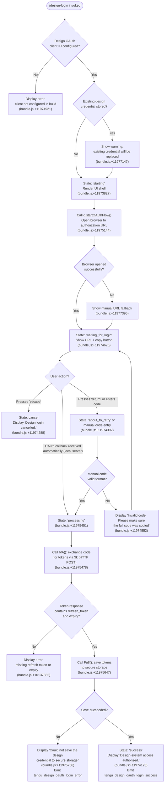

# `/design-login`

> Analysis basis: CC v2.1.178 bundle.js (AST extraction + Claude interpretation)
> Minimum version: v2.1.178

---

## Overview

`/design-login` launches an OAuth authorization flow that grants Claude Code access to the user's claude.ai design-system account. Upon completion, it stores a persistent design credential (refresh token + expiry) in secure storage, enabling the companion `/design-sync` command to read and write design-system projects. The command renders an interactive terminal UI (React/Ink JSX component) that guides the user through browser-based login or a manual code-entry fallback.

---

## Registration

| Field | Value |
|---|---|
| type | `local-jsx` |
| name | `design-login` |
| description | `Authorize design-system access for /design-sync with your claude.ai account` |
| module_id | `V4K` |
| load_inline | `true` |
| loc_byte | `11980142` |
| loc_byte_end | `11980341` |
| arbor_handler.name | `N4K` |
| arbor_handler.fqn | `claude-2.1.178::N4K` |
| arbor_handler.kind | `Function` |
| arbor_handler.resolution_path | `direct` |
| arbor_handler.n_hits | `1` |

Analysis basis: CC v2.1.178 bundle.js:+11980142 – +11980341

---

## Input Branching

The command presents 5+ distinct states across its lifecycle (OAuth launch, waiting-for-login, about-to-retry, processing, success/cancel/error), so a Mermaid flowchart is used.



---

## Behavioral Spec

### 1. Command Entry and OAuth Client Guard

```
function designLoginEntry(appContext):
    clientId = resolveOAuthClientId()   // reads CLAUDE_CODE_DESIGN_OAUTH_CLIENT_ID env var
                                         // or built-in registered value
    if clientId is absent or sentinel:
        displayError("The Claude Design OAuth client is not configured in this build…")
        return

    existingCredential = loadStoredDesignCredential()
    if existingCredential exists:
        showWarning("A design credential is already stored — completing this flow replaces it.")

    renderDesignLoginComponent(clientId, appContext)
```

Analysis basis: CC v2.1.178 bundle.js:+11974921, +11977147

---

### 2. React/Ink UI Component Lifecycle (handler: `Z4K`)

The primary UI component (`Z4K`) is the JSX component rendered by the command. It manages an internal state machine with values: `"starting"`, `"waiting_for_login"`, `"about_to_retry"`, `"processing"`, `"success"`.

```
component DesignLoginUI(props):
    [uiState, setUiState] = useState("starting")   // bundle.js:+11973827
    [progressWidth, setProgressWidth] = useState(0)  // bundle.js:+11973908
    clockContext = useClock()                         // bundle.js:+11973957
    terminalSize = useTerminalSize()                  // bundle.js:+11973964
    maxWidth = Math.max(terminalSize.columns, 50)    // bundle.js:+11974028, +11974037

    on mount:
        startOAuthFlow()

    on keypress "escape":
        setUiState("cancel")
        displayMessage("Design login cancelled.")   // bundle.js:+11974288

    on keypress "return":
        if uiState == "waiting_for_login":
            handleManualAuthCodeInput()             // bundle.js:+11974749

    render():
        if uiState == "success":
            return SuccessBanner("Design-system access authorized.")  // bundle.js:+11974123
        if uiState == "waiting_for_login":
            return WaitingUI(authUrl, copyState)
        if uiState == "processing":
            return ProgressBar(progressWidth)
        ...
```

Analysis basis: CC v2.1.178 bundle.js:+11973808, +11973964, +11974021, +11974102, +11974121

---

### 3. OAuth Flow Initiation (`q.startOAuthFlow`)

```
function startOAuthFlow(clientId):
    authUrl = buildAuthorizationUrl(clientId, redirectUri="http://localhost:<port>/callback")
    startLocalCallbackServer(port)          // binds 127.0.0.1, timeout 300000ms (5 min)
                                             // bundle.js:+6568318
    openBrowser(authUrl)
    setUiState("waiting_for_login")
    setTimeout(cancelIfNoResponse, 3000)    // bundle.js:+11975246

    on callback received at /callback:
        code = extractCodeFromQuery()
        state = extractStateFromQuery()
        verifyStateParam(state)             // CSRF check, bundle.js:+6566039
        setUiState("processing")
        resolveAuthFlow(code)
```

Analysis basis: CC v2.1.178 bundle.js:+11975144, +11975223, +6568210, +6568318, +6566039

---

### 4. Manual Code Entry Fallback

When the browser cannot open or the OAuth callback is not received (e.g., remote/SSH sessions), the user may paste a full redirect URL:

```
function handleManualAuthCodeInput(rawInput):
    // Telemetry: tengu_design_oauth_manual_entry (bundle.js:+11974711)
    codeAndState = parseCallbackUrl(rawInput)

    if codeAndState is missing authorization code:
        displayError("Invalid code. Please make sure the full code was copied")
                                         // bundle.js:+11974552
        return

    if codeAndState.state does not match pendingState:
        displayError("Invalid callback URL: missing authorization code…")
                                         // bundle.js:+6596109
        return

    setUiState("processing")
    resolveAuthFlow(codeAndState.code)
```

Analysis basis: CC v2.1.178 bundle.js:+11974749, +11974552, +6596109, +11974711

---

### 5. Token Exchange (`bfA` → `$k`)

```
function exchangeCodeForTokens(code, redirectUri, clientId):
    // bfA orchestrates; $k performs the HTTP call
    // bundle.js:+11975478, +10137027

    filteredScopes = filterRequestedScopes()           // bundle.js:+10136949
    response = httpPost(tokenEndpoint, {
        grant_type: "authorization_code",
        code: code,
        redirect_uri: redirectUri,
        client_id: clientId,
    }, {
        headers: { "Content-Type": "application/json" },
        timeout: 5000                                  // bundle.js:+2132857
    })

    if response is AxiosError:
        categorizeError(response)    // maps to: network, oauth_error, etc.
        return Failure

    if response.refresh_token is absent OR response.expiry is absent:
        return Failure("The token response was missing a refresh token or expiry…")
                                     // bundle.js:+10137332

    if response contains some invalid token fields:
        log warning                  // bundle.js:+10137563

    return TokenSet(accessToken, refreshToken, expiry)
```

Analysis basis: CC v2.1.178 bundle.js:+10136949, +10137027, +10137139, +10137332, +10137563, +2132699, +2132857

---

### 6. Credential Persistence (`Fu8`)

```
function saveDesignCredential(tokenSet):
    // Fu8, bundle.js:+11975647

    result = secureStorage.store("design_oauth", tokenSet)   // tK → KC1 path

    onSuccess:
        emit telemetry: tengu_design_oauth_login_success     // bundle.js:+11975852
        setUiState("success")
        displayMessage("Design-system access authorized.")   // bundle.js:+11974123

    onFailure:
        emit telemetry: tengu_design_oauth_login_error       // bundle.js:+11976005
        displayError("Could not save the design credential to secure storage.")
                                                             // bundle.js:+11975756
        after 1500ms delay, return to waiting state          // bundle.js:+11975981
```

Analysis basis: CC v2.1.178 bundle.js:+11975647, +11975756, +11975852, +11976005, +11975981

---

### 7. Token Revocation (`$k` — revoke path)

If the user triggers a replacement flow while an existing credential is stored, the old token is revoked before the new flow proceeds:

```
function revokeExistingToken(refreshToken):
    httpPost(revokeEndpoint, {
        token: refreshToken,
        token_type_hint: "refresh_token"              // bundle.js:+2132759
    }, {
        headers: { "Content-Type": "application/json" },
        timeout: 5000
    })
    emit telemetry: oauth_token_revoke                // bundle.js:+2132867
```

Analysis basis: CC v2.1.178 bundle.js:+2132699, +2132759, +2132867

---

### 8. URL Copy Button

The UI includes a copy button next to the authorization URL. When clicked, it copies the URL to the system clipboard using the platform-appropriate mechanism (`pbcopy` on macOS, `wl-copy`/`xclip`/`xsel` on Linux, `powershell.exe` on Windows):

```
function copyUrlToClipboard(url):
    platform = detectPlatform()
    copyToClipboard(url, platform)    // QW → clipboard subsystem
    setButtonLabel("(Copied!)")       // bundle.js:+11977491
    // After a short delay, revert label to "copy" (bundle.js:+11977575)
```

Analysis basis: CC v2.1.178 bundle.js:+11977395, +11977491, +11977575

---

### 9. Local OAuth Callback Server (`PqH`)

A short-lived HTTP server is spun up on `127.0.0.1` to receive the browser redirect:

```
function startCallbackServer(preferredPort):
    server = http.createServer(handleRequest)

    handleRequest(req, res):
        parsedUrl = url.parse(req.url)
        if parsedUrl.pathname == "/callback":
            params = parsedUrl.query
            if params.state != pendingState:
                res.writeHead(400, {"Content-Type": "text/html"})
                res.end("<h1>Authentication Error</h1>…")   // bundle.js:+6566995
                return
            if params.error:
                handleOAuthError(params.error, params.error_description)
                return
            code = params.code
            res.writeHead(200, {"Content-Type": "text/html"})
            res.end("<h1>Authentication Successful</h1>…")  // bundle.js:+6567478
            resolveAuthFlow(code)
        else:
            res.writeHead(404)
            res.end()

    server.listen(port, "127.0.0.1")
    server.unref()                       // does not block process exit
    setTimeout(rejectWithTimeout, 300000, "Authentication timeout")
                                         // bundle.js:+6568290, +6568318
    return server
```

Analysis basis: CC v2.1.178 bundle.js:+6566748, +6566779, +6566955, +6566995, +6567135, +6567478, +6568221, +6568247, +6568259, +6568290, +6568318

---

### 10. Progress Indicator Animation (`H`)

A spinner/progress animation is driven by `Math.random()` + `setTimeout`:

```
function animationTick():
    newValue = Math.random() * 2 - 1    // range [-1, 1], bundle.js:+14211632, +14211634
    delay = 1 (normalized unit)          // bundle.js:+14211648
    setTimeout(animationTick, delay)
```

Analysis basis: CC v2.1.178 bundle.js:+14211632, +14211648, +14211671

---

## State & Side Effects

| Item | Detail |
|---|---|
| Telemetry: `tengu_design_oauth_manual_entry` | Fired when user submits a manual callback URL instead of using the automatic browser redirect (bundle.js:+11974711) |
| Telemetry: `tengu_design_oauth_login_success` | Fired on successful credential storage (bundle.js:+11975852) |
| Telemetry: `tengu_design_oauth_login_error` | Fired when credential storage fails (bundle.js:+11976005) |
| Telemetry: `tengu_mcp_oauth_flow_start` | Fired at start of underlying MCP OAuth flow (bundle.js:+6563766) |
| Telemetry: `tengu_mcp_oauth_flow_success` | Fired on successful MCP OAuth token receipt (bundle.js:+6568744) |
| Telemetry: `tengu_mcp_oauth_flow_error` | Fired on MCP OAuth flow failure (bundle.js:+6570455) |
| Telemetry: `tengu_feature_ok` / `tengu_feature_sad` / `tengu_feature_bad` | Generic feature health events emitted by `SH`/`bH`/`d6` (bundle.js:+1020153, +1020220, +1020301) |
| Telemetry: `tengu_config_auth_loss_prevented` | Fired when config save would have dropped auth credentials (bundle.js:+3345928) |
| Secure storage write | Design OAuth tokens (access token, refresh token, expiry) are persisted to secure storage via `Fu8` → `tK` → `KC1` (bundle.js:+11975647) |
| Local HTTP server | A transient HTTP server is bound on `127.0.0.1` during the OAuth flow, port auto-selected; server is unreferenced so it does not block process exit (bundle.js:+6568221, +6568247) |
| Clipboard write | Authorization URL optionally copied to system clipboard via platform clipboard tool (bundle.js:+11977491) |
| Token revocation POST | If an existing credential is present, a revocation HTTP request is made to the OAuth provider before the new flow begins (bundle.js:+2132867) |
| appState changes | Upon success, the stored design credential becomes available to `/design-sync`; no other appState fields are written by this command directly |
| Sound | None observed in traversal |
| OAuth callback timeout | 300,000 ms (5 minutes) — after which the flow is rejected with "Authentication timeout" (bundle.js:+6568318) |

---

## Common Mistakes

1. **Missing OAuth client ID**: If the environment variable `CLAUDE_CODE_DESIGN_OAUTH_CLIENT_ID` is not set and the build does not include a registered client ID, the command immediately shows an error and exits without starting the OAuth flow (bundle.js:+11974921). Ensure you are using an official build or the variable is configured.

2. **Pasting partial callback URLs**: When using the manual code entry fallback (common in SSH/remote sessions), the user must paste the *entire* redirect URL including the `?code=...&state=...` query string — not just the authorization code alone. Submitting only the code will produce an "Invalid code" error (bundle.js:+11974552).

3. **Blocking process exit during the flow**: The local callback HTTP server is explicitly unreferenced (`server.unref()`). However, if the user force-quits Claude Code mid-flow, any in-progress token exchange will be aborted without storing credentials. Re-running `/design-login` is required.

4. **Assuming credential persists across OAuth providers**: The stored design credential is specific to the claude.ai design-system OAuth endpoint. It does not affect or replace the main Claude Code session authentication.

5. **Expecting instant browser open**: There is a 3,000 ms timeout (bundle.js:+11975246) before the UI transitions from the initial state to `waiting_for_login`. If the browser does not open within this window, use the displayed URL or the manual entry fallback.

6. **Not handling the replacement warning**: If a design credential already exists, the command replaces it after showing a warning. Users who cancel at this point (pressing Escape) will retain their existing credential.

---

## Version History

| Version | Change |
|---|---|
| v2.1.178 | Initial analysis — `local-jsx` command; full OAuth flow with browser launch, local callback server, manual fallback, secure token storage, and clipboard copy |

---

## Appendix — Identifier Mapping

> For bundle debugging only. Identifiers change across versions.

| Identifier | Role |
|---|---|
| `ncL` | Top-level command handler / JSX render entry point (handler_name) |
| `N4K` | Arbor-resolved handler function (arbor_handler.name) |
| `Z4K` | Primary React/Ink UI component for the design-login flow |
| `H` | Progress animation tick function (Math.random + setTimeout loop) |
| `b1` | `useClock` hook — reads clock context, throws if outside ClockProvider |
| `G_` | `useTerminalSize` hook — reads terminal size context |
| `V` | Event/state dispatcher; delegates to `E` (stop/start/updateConfig) |
| `S` | File-write orchestrator; calls path resolution, queue, and write helpers |
| `x14` | Filesystem realpath + stat resolver |
| `x8` | Filesystem helper delegating to `Z8` |
| `N` | Command/path normalization utility |
| `AM4` | Sub-path manipulation helper |
| `xH` | JSON.stringify wrapper |
| `d4` | Path segment extractor (lastIndexOf/slice/replace) |
| `VdH` | Calls `FCA` — likely a formatting/validation helper |
| `LM4` | Buffer-aware file write with byte-length tracking |
| `RH` | Queued log/error emitter (push to `ElH`, logError via `Us`) |
| `jA` | Error-to-string coercion helper |
| `L6` | String coercion utility |
| `qq` | Essential-traffic queue manager |
| `RQ4` | Rotating queue helper (shift/push on `Ye6`) |
| `Ub5` | Calls `Cx8` — version/path resolver |
| `Cx8` | Resolves `claude`/`versions` path segments via `epH.join` |
| `Y` | Supervisor/watcher manager (start/stop/write/delete) |
| `hVH` | File stat + read helper (1 MiB limit at bundle.js:+13348454) |
| `q` | Data write stream (`data` channel, 1024 buffer at bundle.js:+16966954) |
| `$ZK` | Object-keys max-width calculator for display |
| `L` | Watcher instance manager (close/delete/get/set) |
| `T` | Heartbeat timer (ch6 + j36) |
| `E` | Rate-limited state machine (stop/start/updateConfig/Math.max/min) |
| `R14` | Calls `h1H` — likely heartbeat registration |
| `d` | Generic async cleanup/teardown helper |
| `f` | Promise lifecycle tracker (add/delete via Set, finally handler) |
| `M` | MCP connection orchestrator (ebH + hs8) |
| `ebH` | MCP server connection batch processor |
| `UQ` | MCP server unit connection runner |
| `C86` | Calls `Eh` + `LLH` — connection sub-handlers |
| `Rr` | Full MCP server reconnect/sync logic |
| `YU` | MCP tool/resource schema mapper |
| `$08` | MCP status colorizer (red/yellow via J6) |
| `I86` | MCP connection state cache manager |
| `BZ` | Calls `PY` + `Zc_` — batch state helpers |
| `PY` | Calls `S1H`, `S6`, `zq` — likely prompt/session helpers |
| `K` | Column formatter (padEnd) |
| `i8` | Calls `_` — generic utility |
| `ch6` | Timer/interval stop primitive |
| `Te9` | MCP needs-auth cache reader (`Pn_`, `z0H`, `r28`) |
| `Pn_` | Cache file path builder (`f9`, `kG8`, `i6`) |
| `z0H` | Object hash helper (sha256 via `or9.createHash`) |
| `r28` | Cache record serializer (`$qH`, `mWH`) |
| `o28` | Cache record reader (`r28`, `NP`) |
| `NP` | Hash+stringify utility (`xH`, `Vg9.createHash`) |
| `n28` | Cache key builder (`tK`) |
| `tK` | Calls `KC1` — secure storage accessor |
| `Y8` | MCP debug logger (`ElH.push`, `Us.logMCPDebug`) |
| `I08` | MCP OAuth flow controller (full lifecycle) |
| `iI7` | OAuth flow pre-flight check |
| `_n` | Calls `um` + `A4` — token/session lookup |
| `LqH` | Calls `bF9` + `JZ7` — connector/link helpers |
| `MqH` | OAuth state initializer |
| `PqH` | Local OAuth callback HTTP server manager |
| `U86` | In-flight OAuth request deduplicator (E08 Map) |
| `w` | Process exit / abort controller |
| `R08` | Calls `f9` + `kG8` — cache read helpers |
| `ur` | MCP reconnect orchestrator |
| `um` | Calls `A4` — token accessor |
| `$7` | MCP error logger (`ElH.push`, `Us.logMCPError`) |
| `TH` | String coercion wrapper |
| `rI7` | OAuth redirect URI builder |
| `nI7` | SSH/remote session detector (`nH.isSSH`) |
| `S08` | OAuth manual callback URL handler (`lI7`, `p86`, `B86`) |
| `p86` | Pending OAuth request lookup (T08.get) |
| `B86` | In-flight OAuth request lookup (E08.get) |
| `Ie9` | MCP connection attempt runner |
| `f9` | Async-local storage reader (`P2f.getStore`) |
| `kG8` | MCP cache file path builder (`yG8.join`, `M_`) |
| `pc_` | MCP token/auth serializer (`NP`, `tK`, `Y8`, `TH`) |
| `j` | Active session map iterator (values/kill) |
| `A` | Name normalizer (toLowerCase) |
| `Nh` | MCP skills event emitter → `O6` |
| `O6` | Skills telemetry dispatcher |
| `Ec_` | MCP config applicator (`W8`, `A.includes`) |
| `W8` | Global config writer with auth-loss guard |
| `k` | Worker pool slot manager (Xi, Date.now, Math.min) |
| `Xi` | Worker slot initializer |
| `I` | Worker pool sweep function |
| `y` | Worker pool idle handler |
| `QoK` | Away-summary slot picker (H.at) |
| `Ne9` | MCP notification queue (`zQ`) |
| `zQ` | Async iterator/notification dispatcher |
| `z_6` | Integer parser (radix 10) |
| `IG8` | Integer parser (radix 20) |
| `hs8` | MCP connection result applier |
| `tbH` | Calls `z0H` — hash helper for connection results |
| `RG` | MCP server cleanup orchestrator |
| `$_6` | Calls `z0H` — hash-based diff helper |
| `$` | Calls `xGK` — daemon status reader |
| `xGK` | Daemon status JSON reader (`zt`, `Date.now`, `f9`, `XF6`) |
| `zt` | Calls `cLH` — config loader |
| `XF6` | Daemon status file path builder |
| `INA` | Full MCP server lifecycle manager |
| `j08` | Capability flag checker (GI7/Ic_ has) |
| `o8` | Timeout-wrapped async operation helper |
| `O` | Calls `C8` — background session reference |
| `qu6` | Calls `gu8` — OAuth client config resolver |
| `gu8` | Calls `k1` — OAuth URL/client builder |
| `k1` | OAuth client configurator (JgA, ON4, env-check) |
| `JgA` | OAuth base URL resolver |
| `ON4` | OAuth client ID resolver |
| `$k` | OAuth HTTP client (POST to token/revoke endpoint via `zA`) |
| `SH` | Success telemetry emitter (`tengu_feature_ok`) |
| `dH` | Calls `c36` — config read helper |
| `c36` | Low-level config accessor |
| `d6` | Error telemetry emitter (`tengu_feature_sad`) |
| `bfA` | Design OAuth token exchange orchestrator |
| `Fu8` | Design credential persistence handler |
| `b7` | Theme/terminal context provider hook |
| `z` | App lifecycle manager (SH, bH, AR, aB) |
| `bH` | Bad-state telemetry emitter (`tengu_feature_bad`) |
| `AR` | Calls `qp`, `pkH`, `m0_` — session event emitters |
| `qp` | Calls `ib` — session query helper |
| `pkH` | Calls `tV` — session data accessor |
| `m0_` | Session event emitter (randomUUID, H.emit) |
| `aB` | Graceful shutdown orchestrator (Promise.race/all, process.exit) |
| `f5H` | Calls `K5H.shutdown` — shutdown signal sender |
| `L5H` | Shutdown timer cleaner (clearTimeout, `Xk_`) |
| `QW` | Clipboard write dispatcher |
| `zT6` | Calls `Iw` — clipboard strategy resolver |
| `Iw` | Clipboard strategy selector (platform detection) |
| `J39` | macOS clipboard writer (`pbcopy` via `g8`) |
| `g8` | Subprocess clipboard executor |
| `Q_` | Generic subprocess runner |
| `u6` | Calls `Pe6` + `W_` — subprocess output helpers |
| `kI_` | Linux clipboard writer (`wl-copy`/`xclip`/`xsel`) |
| `N3` | Calls `WgA` — xsel/xclip argument builder |
| `qof` | Calls `g8`, `N` — subprocess+normalize helper |
| `yI_` | Calls `Iw` — clipboard strategy re-entry |
| `YT6` | Calls `zT6`, `a6` — tmux clipboard helper |
| `DG` | Calls `yI_`, `H.replaceAll` — OSC52 escape builder |
| `iw` | Calls `j39`, `H.join` — raw DCS clipboard builder |
| `j39` | Calls `Iw` — clipboard strategy inner resolver |
| `Au6` | Design login UI helper (`tK`, `N`, `TH`) |

---

Note: index built via Arbor fallback; some signals (telemetry, literals) may be missing — see arbor-fallback.js.