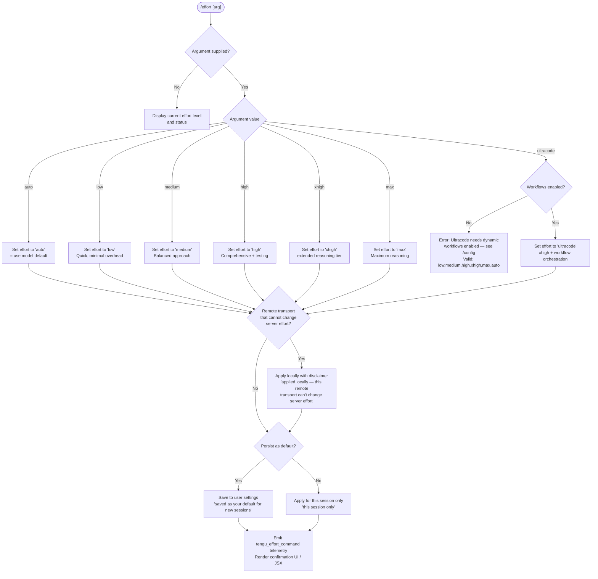

# `/effort`

> Analysis basis: CC v2.1.178 bundle.js (AST extraction + Claude interpretation)
> Minimum version: v2.1.178

---

## Overview

The `/effort` command sets the inference effort level for the current Claude Code session, controlling how deeply the model reasons and how extensively it tests and documents its work. It accepts one of several named tiers (`low`, `medium`, `high`, `xhigh`, `max`, `ultracode`, or `auto`) and can apply the setting either for the current session only or persistently as the user's default. The special `ultracode` tier combines `xhigh` effort with dynamic workflow orchestration and requires that workflows be enabled in `/config`.

---

## Registration

| Field | Value |
|---|---|
| type | `local-jsx` |
| name | `effort` |
| description | Set effort level for model usage |
| argumentHint | `[low\|medium\|high\|xhigh\|max\|ultracode\|auto] \| [low\|medium\|high\|xhigh\|max\|auto]` |
| immediate | `null` |
| thinClientDispatch | `control-request` |
| module_id | `t0K` |
| load_inline | `true` |
| loc_byte | `13141965` |
| loc_byte_end | `13142296` |
| loc_line | `9043` |
| arbor_handler.name | `YK5` |
| arbor_handler.fqn | `claude-2.1.178::YK5` |
| arbor_handler.kind | `AsyncFunction` |
| arbor_handler.resolution_path | `module_id` |
| arbor_handler.n_hits | `2` |

Analysis basis: CC v2.1.178 bundle.js:+13141965

---

## Input Branching

The command has six or more distinct branches depending on the argument supplied, the current transport, workflow availability, and whether persistence is requested. A Mermaid flowchart is used.



Analysis basis: CC v2.1.178 bundle.js:+13129026, +13129152, +13129891, +13128834, +13128878, +13127888

---

## Behavioral Spec

### Handler Entry Point

The Arbor-resolved handler is `YK5` (AsyncFunction, resolved via `module_id` → `t0K`).  
Analysis basis: CC v2.1.178 bundle.js:+13140152

```
async function handleEffortCommand(args, context):
    // Determine if an argument was passed
    validTiers = ["low", "medium", "high", "xhigh", "max", "ultracode", "auto"]
    arg = args[0]?.trim().toLowerCase()

    if arg is absent or arg == "current" or arg == "status":
        return renderCurrentEffortStatus(context)

    if arg not in validTiers:
        return renderUsageError(validTiers)

    if arg == "ultracode":
        if not workflowsEnabled(context):
            return renderError(
                "Ultracode needs dynamic workflows enabled (see /config). " +
                "Valid options are: low, medium, high, xhigh, max, auto"
            )

    isRemoteTransportOnly = checkRemoteTransport(context)

    effectiveArg = arg
    persistFlag  = determinePersistence(context)   // CLI flag or interactive prompt

    applyEffortLevel(effectiveArg, context, persist=persistFlag)

    emitTelemetry("tengu_effort_command", { level: effectiveArg, persisted: persistFlag })

    disclaimer = isRemoteTransportOnly
        ? " (applied locally — this remote transport can't change server effort)"
        : ""
    suffix = persistFlag
        ? " (saved as your default for new sessions)"
        : " (this session only)"

    return renderConfirmationJSX(effectiveArg, disclaimer + suffix)
```

Analysis basis: CC v2.1.178 bundle.js:+13140152, +13140171, +13140223, +13129051, +13128834, +13128878

---

### Effort Tier Definitions

```
function getEffortTierDescriptions():
    return {
        "low":       "Quick, straightforward implementation with minimal overhead",
        "medium":    "Balanced approach with standard implementation and testing",
        "high":      "Comprehensive implementation with extensive testing and documentation",
        "xhigh":     // extended reasoning; internal tier label "xhigh_effort"
        "max":       // maximum reasoning; internal flag "max_effort"
        "ultracode": "xhigh + dynamic workflow orchestration; this session only",
        "auto":      "Use the default effort level for your model"
    }
```

Analysis basis: CC v2.1.178 bundle.js:+2548775, +2548787, +2548853, +2548868, +2548946, +13129051, +2547169, +13127604

---

### Workflow Guard (ultracode)

```
function workflowsEnabled(context):
    // Checks the "allow_workflows" feature flag in current session settings
    // Emits tengu_workflows_enabled telemetry on positive path
    featureFlag = readFeatureFlag("allow_workflows", context)
    return featureFlag == true
```

Analysis basis: CC v2.1.178 bundle.js:+2544353, +2544554

---

### Effort Application and Persistence

```
function applyEffortLevel(tier, context, persist):
    // Maps named tier to internal effort representation
    internalKey = mapTierToInternalKey(tier)
    // "max"    → "max_effort"      (bundle.js:+2545343)
    // "xhigh"  → "xhigh_effort"    (bundle.js:+2545765)
    // "ultracode" → "ultracode"    (bundle.js:+13132573)
    // others   → tier name directly

    if persist:
        writeToUserSettings("effort", internalKey)
        // Writes to ~/.claude/settings.json  (bundle.js:+1306200, +1306210)
        emitTelemetry("tengu_slate_finch", { key: "effort", value: internalKey })
    else:
        setSessionEffort(internalKey, context)
```

Analysis basis: CC v2.1.178 bundle.js:+2545343, +2545765, +13132573, +2544887, +1306200, +1306210, +2549241

---

### Status / No-Argument Display

```
function renderCurrentEffortStatus(context):
    // When invoked as "/effort" with no argument, renders a JSX component
    // showing the current effort tier and a brief description.
    // Special case: ultracode surfaces the extended description string
    //   "Current effort level: ultracode (xhigh + dynamic workflow orchestration; this session only)"
    currentTier = getSessionEffort(context)
    description = getEffortTierDescriptions()[currentTier]
    return createElement(EffortStatusComponent, { tier: currentTier, description })
```

Analysis basis: CC v2.1.178 bundle.js:+13129051, +13140207, +13140192

---

### Ultracode Animation / Visual Component

The call graph reveals math-heavy helper functions (`s0K`, `a0K`, `r0K`, `Tc`) that use `Math.cos`, `Math.sqrt`, `Math.round`, `Math.min`, `Math.floor`, `Math.random`, and `setTimeout`. These are invoked when rendering the `ultracode` JSX confirmation component — they produce an animated "violet-ripple" visual effect.

```
function renderUltracodeAnimation(frameData):
    // Generates ripple animation frames
    // Uses parameters: radius=3, segments=17, amplitude=8.5, frameCount=18
    // Animation label: "violet-ripple"
    // Visual particle counts use slots at indices 5, 7, 9
    for each frame in animationFrames:
        angle = computeAngle(frame, segments=17)
        radius = Math.cos(angle) scaled by amplitude=8.5
        radius = Math.min(radius, maxRadius)
        pixel  = Math.round(radius)
        yield pixel
```

Animation label: `"violet-ripple"` (bundle.js:+13132609)  
Effort label in display: `"xhigh + workflows"` (bundle.js:+13132861)  
Analysis basis: CC v2.1.178 bundle.js:+13132532, +13132549, +13132553, +13132573, +13132609, +13132631, +13132728, +13132824, +13134265, +13134301, +13134323, +13134164

---

### Argument Validation (effort level string check)

```
function validateEffortArg(rawArg, allowUltracode):
    // allowUltracode is false on transport paths that block workflow control
    normalized = rawArg.trim().toLowerCase()
    baseSet    = ["low", "medium", "high", "xhigh", "max", "auto"]
    fullSet    = baseSet + ["ultracode"]
    validSet   = allowUltracode ? fullSet : baseSet
    return normalized in validSet
```

The `argumentHint` field confirms both sets: the first pipe-separated group includes `ultracode`, the second omits it. Analysis basis: CC v2.1.178 bundle.js:+13141965 (registration), +13127208 (`|ultracode` literal)

---

### Numeric Budget Parsing (extended effort levels)

Some effort levels encode a numeric token budget. The helper `qR` (numeric-budget parser) runs `parseInt` and `isNaN` on the argument, applying radix `10`.

```
function parseNumericBudget(rawValue):
    s = String(rawValue)
    n = parseInt(s, 10)       // radix = 10  (bundle.js:+2546797)
    if isNaN(n):
        return null
    return n
```

Analysis basis: CC v2.1.178 bundle.js:+2546736, +2546797, +2546808, +2546816

---

### Settings Persistence Layer

```
function writeToUserSettings(key, value):
    // Reads ~/.claude/settings.json (bundle.js:+1306200, +1306210)
    // Writes atomically via temp-file + rename pattern (ED6)
    // Emits tengu_feature_ok on success
    // Emits tengu_feature_bad on write error
    // Emits tengu_feature_sad on non-fatal issue
    // Guard: if re-read config is missing auth that cache has → refuse write
    //   emits tengu_config_auth_loss_prevented (bundle.js:+3345928)
    tmpPath = generateTempPath(randomBytes(6, "hex"))
    writeFileSync(tmpPath, serialize({ [key]: value }))
    fchmodSync(tmpPath, originalPermissions)
    fsyncSync(tmpPath)
    renameSync(tmpPath, settingsPath)
```

Analysis basis: CC v2.1.178 bundle.js:+1306200, +1306210, +1093841, +1094277, +1094335, +1094401, +1094529, +3345800, +3345928, +3346046, +1020151, +1020218, +1020299

---

## State & Side Effects

| Item | Detail |
|---|---|
| Telemetry | `tengu_effort_command` (emitted on every invocation with an argument, bundle.js:+13129482) |
| Telemetry | `tengu_workflows_enabled` (emitted when workflow guard passes, bundle.js:+2544554) |
| Telemetry | `tengu_slate_finch` (emitted on persistent save path, bundle.js:+2549241) |
| Telemetry | `tengu_feature_ok` (settings write success, bundle.js:+1020153) |
| Telemetry | `tengu_feature_bad` (settings write hard error, bundle.js:+1020220) |
| Telemetry | `tengu_feature_sad` (settings write soft/non-fatal issue, bundle.js:+1020301) |
| Telemetry | `tengu_config_auth_loss_prevented` (refused write to avoid losing auth token, bundle.js:+3345928) |
| appState changes | Session effort level updated in-memory immediately |
| Persistence | When saving as default: writes `effort` key to `~/.claude/settings.json` via atomic temp-file rename |
| JSX rendering | Returns a React element (via `yA.createElement`) for the CLI UI to render |
| Animation | `ultracode` confirmation renders an animated "violet-ripple" component using `Math.cos`/`Math.sqrt`/`Math.random` + `setTimeout` |
| Hook registration | `apply_flag_settings` called to re-apply policy mapping after tier change (bundle.js:+13128011) |
| thinClientDispatch | `control-request` — on thin-client transports the command is dispatched as a control request rather than a normal message |

---

## Version History

| Version | Change |
|---|---|
| v2.1.178 | Initial analysis — `ultracode` tier present with `violet-ripple` animation; numeric budget parser present; seven telemetry events identified |

---

## Common Mistakes

1. **Using `ultracode` without enabling workflows** — The command will return an error message directing the user to `/config` to enable dynamic workflows before `ultracode` can be selected. Valid alternatives in that state are: `low`, `medium`, `high`, `xhigh`, `max`, `auto`.
2. **Expecting server-side effect on remote transports** — On certain remote transports the effort setting is applied locally only; a disclaimer suffix is appended to the confirmation message.
3. **Assuming `ultracode` persists** — The status display string explicitly notes "(xhigh + dynamic workflow orchestration; this session only)", suggesting `ultracode` is inherently session-scoped regardless of the persist flag.
4. **Omitting the argument to change effort** — `/effort` with no argument displays the current status; it does not toggle or cycle through levels.
5. **Confusing `max` and `xhigh`** — Internally these map to distinct keys (`max_effort` vs. `xhigh_effort`); they are not aliases and may map to different token budgets or model behaviors.

---

## Appendix — Identifier Mapping

> For bundle debugging only. Identifiers change across versions.

| Identifier | Role |
|---|---|
| `YK5` | Main handler (AsyncFunction) — Arbor-resolved entry point for `/effort` |
| `Fc8` | Primary JSX render component for effort command UI |
| `Bc8` | Sub-render component (calls `Kp` and `d1`; renders model/effort info) |
| `gc8` | Conditional render component (handles status vs. argument branches) |
| `Zt` | Effort command orchestrator — dispatches to `P2` and `Et` |
| `P2` | Core effort resolution — reads current tier, checks feature flags |
| `B78` | Tier stringification helper |
| `kc1` | Feature-flag gate for `allow_workflows` |
| `M9` | Workflow feature check (uses `Uhf` and `Bhf` sets) |
| `d0_` | Effort description formatter |
| `ghf` | Tier-to-description mapping function |
| `Fhf` | Secondary tier helper |
| `Et` | Effort-application dispatcher — fans out to `W2`, `QkH`, `c78`, `gkH`, `BkH`, `uJH` |
| `W2` | Model-list filter (checks model names against known Claude model strings) |
| `f1` | Application-inference-profile classifier |
| `Mk` | Model provider resolver (returns `firstParty`/`anthropicAws`/`foundry`/`mantle`) |
| `Xz` | Provider-specific effort setter |
| `QkH` | Opus-4-7/Opus-4-8/Fable-5 model effort handler |
| `S6` | Effort-state persister (uses `Date.now`, `wnf`) |
| `Lg` | Telemetry emitter wrapper |
| `c78` | "High" effort path handler |
| `gkH` | Numeric budget getter |
| `qR` | Numeric budget parser (`parseInt` / `isNaN`) |
| `BkH` | Max-effort path handler |
| `uJH` | Xhigh-effort path handler |
| `z7` | Transport capability checker |
| `YNH` | Remote-transport flag reader |
| `BN` | Effort UI component (combines `Et` and `O5H`) |
| `O5H` | Effort-level option list renderer |
| `FkH` | Valid-tier membership checker (`eV.includes`) |
| `aAH` | Argument-to-string coercion helper |
| `n0_` | Persistence write path — calls settings store and telemetry |
| `Qhf` | Persistence pre-check |
| `dLH` | Settings write dispatcher (calls `Yq`) |
| `Yq` | Settings file writer |
| `O6` | Global config / session-state updater |
| `Xp` | Session store accessor |
| `qp` | Base session state getter |
| `o$8` | Idempotent state-update guard (uses `ny_` set) |
| `p0_` | Session-state commit (emits `Wt.emit`, assigns UUID) |
| `ay_` | State change propagator |
| `s0K` | Animation frame cosine calculator |
| `a0K` | Animation frame sqrt calculator |
| `r0K` | Ultracode animation orchestrator (calls `Kp`, `c0K`) |
| `Kp` | Effort display component — current level readout |
| `c0K` | Animation frame builder |
| `H` | Timer/random utility (uses `Math.random`, `setTimeout`) |
| `Tc` | Animated ripple JSX component |
| `d1` | Model-info renderer |
| `In` | Model metadata formatter |
| `JK` | Model-string parser / normalizer |
| `vj6` | Model family detector |
| `Nj6` | Model metadata builder |
| `q4` | String replacement utility |
| `KkH` | BGf-set inclusion checker |
| `uN` | qkH-set inclusion checker |
| `_48` | Recursive model-string parser |
| `LR1` | Entry-map formatter |
| `b8` | Policy-settings extractor |
| `iiH` | Object-entries iterator helper |
| `fR1` | Model-index finder |
| `FGf` | Model alias resolver |
| `Y1` | Full model-string normalizer |
| `iX6` | Model-alias lowercase normalizer |
| `gGf` | Model-shortname resolver |
| `kO` | Model-info component wrapper |
| `RW` | Policy/settings renderer |
| `QP_` | Policy display builder |
| `f48` | Settings file parser |
| `dq5` | Effort status display builder |
| `IPA` | Effort status header component |
| `Ij` | Transport-info component |
| `$26` | Effort confirmation card builder |
| `bJH` | Confirmation header |
| `YA` | Settings loader (reads all settings layers) |
| `a3` | Settings cache reader |
| `yM_` | Settings file locator |
| `pb` | Settings aggregator (merges user/project/local) |
| `XW` | File-system settings loader |
| `x8` | ENOENT-safe reader |
| `N` | Log/debug writer |
| `m5_` | Timestamp cache updater |
| `YyH` | Settings merge helper |
| `ED6` | Atomic file writer (temp+rename) |
| `xH` | JSON serializer |
| `Oz` | Cache-clear utility |
| `zH8` | Settings file write-with-backup |
| `pm` | Settings path builder (`.claude/settings.json`) |
| `W_` | Settings validator |
| `SH` | Feature-ok telemetry emitter |
| `d6` | Feature-sad telemetry emitter |
| `bH` | Feature-bad telemetry emitter |
| `dF` | Settings disk loader (emits `loadSettingsFromDisk_start/end`) |
| `RH` | Settings error handler |
| `sb` | Global config saver |
| `W8` | Global config writer (guards auth-loss) |
| `d` | Base telemetry event emitter |
| `H6` | React child renderer |
| `c36` | React base component |
| `cq5` | Effort-mode-change component (persist path) |
| `woH` | Argument trimmer and tier validator |
| `Qq5` | Effort-set confirmation component (full flow) |
| `O` | Background session state holder |
| `C8` | Background session stopped checker |

---

Note: index built via Arbor fallback; some signals (telemetry, literals) may be missing — see arbor-fallback.js.