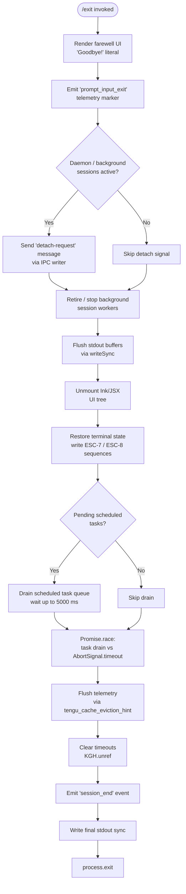

# `/exit`

> Analysis basis: CC v2.1.178 bundle.js (AST extraction + Claude interpretation)
> Minimum version: v2.1.178

---

## Overview

`/exit` (aliased as `/quit`) terminates the Claude Code CLI session gracefully. When invoked, the handler renders a farewell UI element, tears down active background processes and I/O streams, flushes pending telemetry and I/O buffers, then calls `process.exit` to end the Node/Bun process. The command executes immediately (`immediate: true`) without waiting for further user input.

---

## Registration

| Field | Value |
|---|---|
| type | `local-jsx` |
| name | `exit` |
| description | `null` |
| aliases | `["quit"]` |
| immediate | `true` |
| module_id | `hWK` |
| load_inline | `true` |
| loc_byte | `13056187` |
| loc_byte_end | `13056383` |
| loc_line | `9022` |
| arbor_handler.name | `c95` |
| arbor_handler.fqn | `claude-2.1.178::c95` |
| arbor_handler.kind | `AsyncFunction` |
| arbor_handler.resolution_path | `module_id` |
| arbor_handler.n_hits | `1` |

Analysis basis: CC v2.1.178 bundle.js:+13056187

---

## Input Branching

The command has 5+ distinct branches spanning UI rendering, background-task teardown, daemon detach signalling, process shutdown sequencing, and timeout/race handling. A Mermaid flowchart is used.



Analysis basis: CC v2.1.178 bundle.js:+13055436 through +13055619

---

## Behavioral Spec

### 1. Handler Entry — `exitCommandHandler` (bundle: `c95`)

The primary handler is the `AsyncFunction` `c95`, resolved via `module_id` → `hWK`.

```
async function exitCommandHandler(context):
    // 1. Render farewell UI
    render JSX element containing "Goodbye!" string

    // 2. Emit prompt-input-exit marker
    emitTelemetryLiteral("prompt_input_exit")

    // 3. Notify background daemon
    sendDetachRequest()           // → detachRequestSender (GzH)

    // 4. Read app state / flags
    flags = readAppState()        // → appStateReader (z3)

    // 5. Trigger async shutdown
    await shutdownSession()       // → sessionShutdown (S9)

    // 6. Return JSX element for final render
    return createElement(...)
```

Analysis basis: CC v2.1.178 bundle.js:+13055436

---

### 2. Background Process Check — `processTypeChecker` (bundle: `v9`)

Before the detach signal is sent, the handler invokes a helper that inspects the current process role.

```
function processTypeChecker(processEnv):
    // Checks process title / env against known role strings:
    //   "bg", "daemon", "daemon-worker"
    // Returns the matched role string or null
    if processEnv matches "bg":      return "bg"
    if processEnv matches "daemon":  return "daemon"
    if processEnv matches "daemon-worker": return "daemon-worker"
    return null
```

Analysis basis: CC v2.1.178 bundle.js:+13055436, literals at +2295499, +2295509, +2295523

---

### 3. Randomised Exit Animation — `exitAnimator` (bundle: `H`)

A short randomised delay is applied before the final process exit to allow the UI to flush.

```
function exitAnimator():
    delay = Math.random() * 2 + 1   // range roughly 1–3 (unitless factor)
    setTimeout(finalExit, delay)
```

Analysis basis: CC v2.1.178 bundle.js:+14211634, +14211671; literals at +14211632 (2), +14211648 (1)

---

### 4. Detach-Request Sender — `detachRequestSender` (bundle: `GzH`)

Signals any attached daemon workers to release their session before the process exits.

```
function detachRequestSender(ipcContext):
    // Build detach payload object
    payload = buildDetachPayload()           // → G48

    // Determine active worker set
    workers = getActiveWorkers()             // → G_K → bp8, C8

    // Write "detach-request" message over IPC channel
    ipcWriter.write("detach-request", payload)   // → vB → d6H.write

    // Serialise via JSON
    serialise(payload)                       // → xH → JSON.stringify

    // Notify UI layer
    notifyUILayer()                          // → C4H
```

Literal `"detach-request"` found at bundle.js:+11387763.

Analysis basis: CC v2.1.178 bundle.js:+13055452

---

### 5. Scheduled-Task Queue Drain — `scheduledTaskDrain` (bundle: `oB8`)

Ensures any pending background scheduled tasks are flushed before the process exits.

```
function scheduledTaskDrain(taskQueue):
    // Validate task queue context
    validate()                  // → cE → TT

    // Push current task list snapshot
    taskQueue.push(snapshot)

    // Parse cron-like schedule strings in the queue
    parsedSchedule = parseScheduleString(entry)   // → lpL

    // Truncate task display label to terminal width
    label = truncateLabel(entry.label, terminalWidth)  // → gq

    // "scheduled task" literal used for display
    display("scheduled task")
```

Literal `"scheduled task"` at bundle.js:+11380769.

Analysis basis: CC v2.1.178 bundle.js:+13055483

---

### 6. Schedule-String Parser — `scheduleStringParser` (bundle: `lpL` → `Dh`, `sk`, `ZH6`)

Parses cron / human-readable schedule strings when draining the task queue.

```
function scheduleStringParser(input):
    raw = trimInput(input)               // H.trim

    // Parse cron minute/hour fields
    cronParts = parseCronFields(raw)     // → Dh
        // Uses parseInt, "Every minute" / "Every hour" display strings
        // Applies 5-field / 10-field cron logic

    // Parse day-of-week sets
    dowSet = parseDayOfWeek(raw)         // → sk → Sz7
        // Builds Set of weekday numbers (0–6)
        // Uses Array.from, K.add, parseInt

    // Compute next-fire timestamp
    nextFire = computeNextFire(cronParts, dowSet)  // → ZH6
        // Manipulates Date fields: setSeconds, setMinutes, setHours,
        // setDate, setMonth; checks .has() on day sets
        // Returns epoch timestamp offset by up to 527040 minutes

    return max(0, nextFire - Date.now())
```

Constants: `5` at +4899764, `10` at +4899918, `527040` at +4899017, `"Every minute"` at +4899848, `"Every hour"` at +4900065.

Analysis basis: CC v2.1.178 bundle.js:+11380750

---

### 7. Session Shutdown Orchestrator — `sessionShutdown` (bundle: `S9`)

The central async function that sequences all cleanup steps.

```
async function sessionShutdown(appState):
    // Resolve initial Promise to allow microtask queue to flush
    await Promise.resolve()

    // Retrieve session key from map
    sessionKey = mf.get(sessionId)           // → bxH

    // Unmount JSX/Ink UI
    H.unmount()                              // → bxH

    // Write terminal restore sequences (ESC-7, ESC-8)
    writeTerminalRestore()                   // → rY8

    // Detect multiplexer (tmux / screen) and adjust escape sequences
    adjustForMultiplexer()                   // → DG, qRH

    // Format "other" exit category for log
    category = formatCategory("other")       // literal at +7177805

    // Compute startup-perf data
    startupPerfData = computeStartupPerf()   // → uE8 → b1q

    // Emit session_end event
    emitEvent("session_end")                 // literal at +7178428

    // Emit cache-eviction telemetry hint
    emitTelemetry("tengu_cache_eviction_hint")

    // Drain output streams with timeout
    drainTimeout = Math.max(5000, 3500)      // literals at +7178031, +7178038
    timerHandle = setTimeout(forceExit, drainTimeout)
    timerHandle.unref()                      // KGH.unref → prevent hang

    // Race: drain vs AbortSignal.timeout(2000)
    await Promise.race([
        drainOutput(),                       // → tQH → XSA.drain
        AbortSignal.timeout(2000)            // literal at +7178216
    ])

    // Clean up pending allSettled tasks
    await allSettledCleanup()               // → n1q → Promise.allSettled

    // Final writeSync to stdout
    T$H.writeSync(finalBytes)

    // Clear drain timeout
    clearTimeout(timerHandle)

    // Invoke hard exit path
    hardExit()                              // → Yo_
```

Analysis basis: CC v2.1.178 bundle.js:+13055619

---

### 8. Hard Exit Path — `hardExitRunner` (bundle: `Yo_`)

```
function hardExitRunner(code):
    clearTimeout(pendingTimer)
    session = mf.get(sessionId)
    if session exists:
        process.kill(session.pid, signal)
    else:
        process.exit(code)
    // If neither path taken, throw Error("unreachable")
    // literal "unreachable" at +7176351
```

Analysis basis: CC v2.1.178 bundle.js:+7176197

---

### 9. Startup-Performance Reporter — `startupPerfReporter` (bundle: `uE8` → `C1`, `Yz6`)

On exit, any accumulated startup-performance marks are serialised and emitted as telemetry.

```
function startupPerfReporter(perfStore):
    scrollData = retrieveScrollSummary()     // → x1q
    agent = readAgentConfig()                // → C1

    // Read performance mark store
    marks = perfStore.getStore()

    // If profiling not enabled → skip
    // If no checkpoints → skip
    // Otherwise build 80-char wide report header "STARTUP PROFILING REPORT"
    // Serialise via JSON.stringify, write to file with fsync
    // Emit tengu_startup_perf event

    writeCheckpoints(marks)                  // → Yz6 → JbA → TbA
    emitTelemetry("tengu_startup_perf")
```

Literals: `"Startup profiling not enabled"` at +221537, `"No profiling checkpoints recorded"` at +221627, `80` at +221690, `"STARTUP PROFILING REPORT"` at +221702.

Analysis basis: CC v2.1.178 bundle.js:+7178365

---

### 10. Terminal-State Restoration — `terminalRestorer` (bundle: `rY8`)

```
function terminalRestorer(termEnv):
    // Write raw bytes to stderr: ESC-7 (save cursor) / ESC-8 (restore cursor)
    Ee.writeSync(ESC7)   // "\x1b7" literal at +3881413
    Ee.writeSync(ESC8)   // "\x1b8" literal at +3881424

    // Detect multiplexer via qRH:
    //   - "ghostty" ≥ 1.2.0      → apply ghostty escape path
    //   - "iTerm.app" ≥ 3.6.6    → apply iTerm2 escape path
    adjustEscapeForTerminal()    // → qRH → hZ

    // If tmux detected → replaceAll double-escapes
    //   "\x1b\x1b" sequence at +3529359
    if isTmux: DG.replaceAll(rawSeq, tmuxEscaped)

    // If screen detected → similar adjustment
    if isScreen: applyScreenEscape()
```

Analysis basis: CC v2.1.178 bundle.js:+3881259

---

## State & Side Effects

| Item | Detail |
|---|---|
| Telemetry — `tengu_cache_eviction_hint` | Fired during session shutdown to hint the telemetry cache to flush; bundle.js:+7178390 |
| Telemetry — `tengu_startup_perf` | Fired if startup-perf marks are present at exit; bundle.js:+223717 |
| Telemetry — `tengu_scroll_summary` | Fired during shutdown scroll-summary collection; bundle.js:+7177447 |
| Telemetry — `tengu_amber_creek` | UI/fullscreen-mode detection event at exit; bundle.js:+3540562 |
| Telemetry — `tengu_pewter_brook` | Companion UI detection event; bundle.js:+3540470 |
| Telemetry — `tengu_bg_dispatch_sigkill_escalate` | Fired if a background worker requires SIGKILL escalation; bundle.js:+17066047 |
| Telemetry — `tengu_bg_dispatch_low_mem` | Fired if low-memory condition is detected while dispatching background session; bundle.js:+17066648 |
| Telemetry — `tengu_bg_spare_enable` | Fired when a spare background session slot is enabled; bundle.js:+17067352 |
| Telemetry — `tengu_bg_spare_claim` | Fired on successful spare-slot claim; bundle.js:+17067480 |
| Telemetry — `tengu_bg_spare_claim_fail` | Fired on spare-slot claim failure; bundle.js:+17067746 |
| Telemetry — `tengu_daemon_config_reload` | Fired if daemon config is reloaded during teardown; bundle.js:+17081946 |
| IPC side effect | Writes `"detach-request"` message to daemon IPC channel before exiting; bundle.js:+11387763 |
| Terminal state | Saves and restores cursor position via ESC-7 / ESC-8; adjusts for tmux/screen/ghostty/iTerm2 |
| Ink UI | Calls `H.unmount()` to cleanly detach the JSX render tree |
| Output drain | Calls `XSA.drain` with `AbortSignal.timeout(2000)` race; hard timeout of up to 5000 ms |
| `process.exit` | Invoked via `hardExitRunner` (`Yo_`) after all cleanup steps; bundle.js:+7176278 |
| `process.kill` | Used as alternative to `process.exit` when a daemon PID is tracked; bundle.js:+7176303 |
| Startup perf file | If profiling is active, a UTF-8 report is written with `fsyncSync` before exit; bundle.js:+191459 |
| `session_end` literal | Emitted as an app-level event string; bundle.js:+7178428 |
| `prompt_input_exit` literal | Emitted as a marker on command invocation; bundle.js:+13055624 |

---

## Version History

| Version | Change |
|---|---|
| v2.1.178 | Initial analysis |

---

## Common Mistakes

1. **Expecting synchronous termination**: `/exit` is handled by an `AsyncFunction`. The process does not exit on the same tick — output drain, telemetry flush, and UI unmount all run first.
2. **Using `/exit` to abort an in-flight agent turn**: The command is registered with `immediate: true`, meaning it fires outside the normal prompt queue, but background-session teardown still takes up to 5 seconds before `process.exit` is called.
3. **Expecting `/quit` to behave differently**: `/quit` is a registered alias and follows exactly the same code path as `/exit`.
4. **Assuming no network I/O on exit**: Telemetry events (`tengu_cache_eviction_hint`, `tengu_startup_perf`, `tengu_scroll_summary`) may trigger brief I/O during the drain window.
5. **Killing the process externally before the drain completes**: Sending `SIGKILL` immediately after `/exit` may lose the final telemetry flush and corrupt the startup-perf report file (which requires `fsyncSync`).

---

## Appendix — Identifier Mapping

> For bundle debugging only. Identifiers change across versions.

| Identifier | Role |
|---|---|
| `c95` | Main exit-command handler (`exitCommandHandler`), AsyncFunction; Arbor FQN `claude-2.1.178::c95` |
| `v9` | Process-type checker (`processTypeChecker`); inspects "bg"/"daemon"/"daemon-worker" roles |
| `zkH` | Internal helper called by process-type checker |
| `H` | Exit animator; uses `Math.random` + `setTimeout` for brief delay |
| `GzH` | Detach-request sender (`detachRequestSender`); writes IPC "detach-request" message |
| `G48` | Detach payload builder |
| `G_K` | Active-worker set resolver |
| `bp8` | Worker list helper (called by `G_K`) |
| `C8` | Worker context accessor (called by `G_K`) |
| `vB` | IPC channel writer |
| `xH` | JSON serialiser wrapper (`JSON.stringify`) |
| `C4H` | UI notification helper (called by detach sender) |
| `z3` | App-state / flags reader |
| `oB8` | Scheduled-task queue drain (`scheduledTaskDrain`) |
| `cE` | Task-queue validator |
| `TT` | Base validation / assertion utility |
| `lpL` | Schedule-string parser dispatcher |
| `Dh` | Cron-field parser (minute/hour/weekday logic) |
| `K` | Cron column formatter (uses `f.map`, `L.padEnd`) |
| `D` | Background-session lifecycle manager (spawn, kill, retire, SIGKILL escalation) |
| `f` | Pending-task set manager (`q.add` / `q.delete` / `L.finally`) |
| `j` | Kill-all-workers helper (`A.values`, `S.kill`) |
| `w` | Forced-shutdown executor (`process.exit`, `z.abort`, `bX`); literal "forced shutdown" |
| `$` | Cron special-character matcher |
| `J` | Weekday/UTC-date manipulator |
| `sk` | Day-of-week set builder |
| `Sz7` | Cron token set parser (splits, matches, builds Set) |
| `A` | String normaliser (`L.toLowerCase`) |
| `ZH6` | Next-fire timestamp calculator (manipulates Date fields) |
| `O` | Date instance wrapper (setSeconds, setMinutes, setHours, setDate, setMonth) |
| `L` | Stream / connection closer (`A.close`, `q.close`) |
| `q` | Data-event emitter wrapper |
| `g9` | Duration formatter (`Math.floor`, `Math.round`) |
| `gq` | Label truncator (terminal-width aware; uses `Bun.stringWidth`) |
| `_8` | String-width measurer (`Bun.stringWidth`) |
| `Q1` | Display-width calculator (`_8`, `Cw`) |
| `Cw` | Grapheme-cluster helper |
| `d95` | Farewell-text element builder (renders "Goodbye!") |
| `S9` | Session shutdown orchestrator (`sessionShutdown`), central async cleanup |
| `bxH` | Ink-UI teardown helper (`H.unmount`, `mf.get`) |
| `PR` | Post-unmount cleanup step |
| `rY8` | Terminal state restorer (`terminalRestorer`; ESC-7/8 sequences) |
| `qRH` | Terminal emulator version detector (ghostty, iTerm2) |
| `oSH` | Additional terminal-state helper |
| `DG` | Multiplexer escape adjuster (tmux / screen) |
| `D5` | Display/dimension utility |
| `N` | Log/debug formatter (includes, toUpperCase, trim) |
| `zo_` | CWD / project-root writer (writes dim-styled path to stdout) |
| `l0` | Working-directory resolver |
| `Om` | Output-mode selector |
| `R6` | Config / settings reader |
| `fk6` | File-stat and join helper (uses `q.statSync`) |
| `zb` | Path utility wrapper |
| `W_` | Path normaliser |
| `n6` | Directory-existence checker |
| `Y$` | Project-config loader |
| `Wf` | Config-file finder |
| `u1q` | Additional stdout writer |
| `Yo_` | Hard-exit runner (`hardExitRunner`; `process.exit` / `process.kill`) |
| `tQH` | Output drain helper (`XSA.drain`) |
| `Y` | Supervisor / background-session file watcher and config updater |
| `hVH` | Session-file stat checker (`MZK.stat`, `L.isFile`; 1 MiB limit at +13348454) |
| `Z8` | Async I/O utility |
| `f9` | AsyncLocalStorage store accessor (`P2f.getStore`) |
| `b2A` | Session-context builder |
| `TH` | String coercion wrapper |
| `$ZK` | Config key formatter (`Object.keys`, `Math.max`, `hD`) |
| `T` | MCP connection stopper (`ch6`, `j36`) |
| `ch6` | MCP channel closer |
| `j36` | Connection-pool stopper (`OA4`) |
| `E` | Agent runner stopper (`W`, `Math.max`, `Math.min`) |
| `W` | Agent-session teardown (`Promise.all`, retire, dispose) |
| `R14` | Heartbeat timer resetter |
| `h1H` | Heartbeat helper |
| `V` | Scroll/viewport updater (`Math.max`, `Math.floor`) |
| `S` | Key/input event handler wrapper |
| `d` | Generic disposable/cleanup resource |
| `n1q` | Pending-tasks allSettled drain (`Promise.allSettled`, `Array.from`) |
| `Yz6` | Startup-perf flush coordinator (`I__`, `JbA`) |
| `I__` | Performance-mark aggregator (`TbA`, `d`) |
| `TbA` | Perf-checkpoint serialiser (`Jm`, `q.set/get`, `Object.entries`, `Math.round`) |
| `JbA` | Perf-report file writer (`$z6.join`, `FwH`, `JSON.stringify`, `TbA`) |
| `WbA` | Report path builder |
| `FwH` | Sync file-write helper (`J7H.openSync`, `writeFileSync`, `fsyncSync`, `closeSync`) |
| `YbA` | Checkpoint list builder (`Jm`, `A.push`, `_.entries`, `gi6`) |
| `Jm` | `perf_hooks` require wrapper |
| `GbA` | Alternative report path builder |
| `uE8` | Startup-perf reporter dispatcher (`x1q`, `b1q`, `C1`) |
| `x1q` | Scroll-summary retriever |
| `b1q` | Session-duration calculator (`Date.now`, `Math.max`, `Math.round`, `Object.assign`) |
| `R1q` | Duration post-processor |
| `C1` | Agent-config / fullscreen-mode resolver (`Ql`, `uI_`, `qe`, `xI_`, `d_`, `jof`, `O6`) |
| `Ql` | Feature-flag checker (`UB4.has`) |
| `uI_` | Config-reader wrapper (`L6`) |
| `qe` | Fullscreen-mode decision helper (`Dof`) |
| `xI_` | Platform checker (`a6`, `Boolean`; "windows" literal) |
| `d_` | Display-format helper (`dF`) |
| `jof` | Fullscreen-option resolver (`O6`) |
| `O6` | UI-mode dispatcher (`vG6`, `NG6`, `Xp`, `S6`) |
| `X$6` | Cache-eviction hint emitter |
| `H6` | Event-loop utility (`c36`) |
| `c36` | Low-level event helper |
| `uxH` | Async-wrapper / promise resolver (`bE8`) |
| `bE8` | Cleanup finaliser |

---

Note: index built via Arbor fallback; some signals (telemetry, literals) may be missing — see arbor-fallback.js.