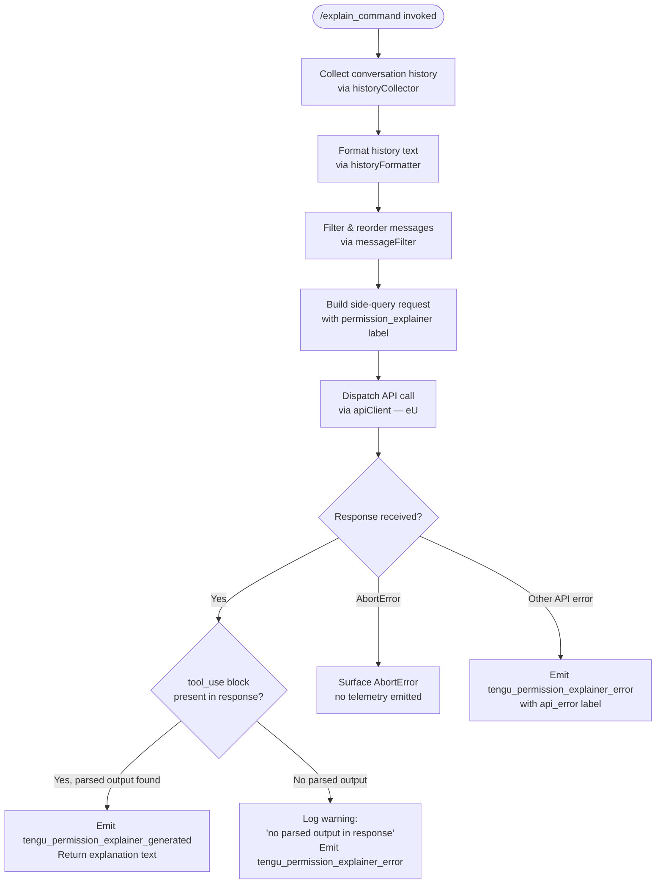

# `/explain_command`

> Analysis basis: CC v2.1.178 bundle.js (AST extraction + Claude interpretation)
> Minimum version: v2.1.178

---

## Overview

`/explain_command` is an internal tool-type command that generates human-readable explanations for why Claude Code is requesting a particular permission or tool use. It invokes a dedicated "permission explainer" side-query against the Claude API and returns structured text describing the rationale behind the pending tool call. The command is not intended to be invoked directly by the user; it is triggered programmatically by the permission-review subsystem.

---

## Registration

| Field | Value |
|---|---|
| type | `tool` |
| name | `explain_command` |
| description | `null` |
| loc_byte | `14746644` |
| loc_byte_end | `14746680` |
| loc_line | `11269` |
| arbor_handler.name | `oFK` |
| arbor_handler.fqn | `claude-2.1.178::oFK` |
| arbor_handler.kind | `AsyncFunction` |
| arbor_handler.resolution_path | `direct` |
| arbor_handler.n_hits | `1` |

Analysis basis: CC v2.1.178 bundle.js:+14746644

---

## Input Branching

The handler contains four or more distinct execution paths based on the API response and error conditions, so a flowchart is used.



---

## Behavioral Spec

### Handler Entry — `explainCommandHandler` (bundle identifier: `oFK`)

Analysis basis: CC v2.1.178 bundle.js:+14746339

```
async function explainCommandHandler(toolUseBlock, context):
    startTime = Date.now()

    # 1. Collect recent conversation history
    historyText  = buildHistoryText(toolUseBlock, context)       # TT5
    filteredMsgs = filterAndReverseHistory(historyText, context)  # ET5

    # 2. Build the explainer side-query payload
    payload = buildPermissionExplainerPayload(
        tool_use_block = toolUseBlock,
        history        = filteredMsgs,
        label          = "permission_explainer"   # literal @+14746702
    )

    # 3. Dispatch to the API as a side query
    response = await apiClient(payload,           # eU @+14746562
                               label="side_query")

    # 4. Parse response
    if response contains tool_use block with parsed output:
        emit telemetry("tengu_permission_explainer_generated")  # @+14747127
        return extractedExplanationText

    elif response has no parsed output:
        log("Permission explainer: no parsed output in response")  # @+14747474
        emit telemetry("tengu_permission_explainer_error")          # @+14747339
        return null

    on AbortError:                                  # literal @+14747797
        rethrow AbortError

    on other error:
        emit telemetry("tengu_permission_explainer_error",
                       reason="api_error")          # literals @+14747868
        return null
```

### History Text Builder — `buildHistoryText` (bundle identifier: `TT5`)

Analysis basis: CC v2.1.178 bundle.js:+14745854

```
function buildHistoryText(toolUseBlock, context):
    # Serialise the tool-use block as JSON, then coerce to String
    serialized = JSON.stringify(toolUseBlock)      # xH @+190848
    return String(serialized)                      # literal coercion @+14745880
```

Limits observed in literals:
- Maximum serialized block length truncated at **1000** characters (bundle.js:+14745908)
- The string `"2"` indicates a truncation depth constant of **2** (bundle.js:+14745864)

### Message Filter & Reversal — `filterAndReverseHistory` (bundle identifier: `ET5`)

Analysis basis: CC v2.1.178 bundle.js:+14745920

```
function filterAndReverseHistory(messages, context):
    # Keep only assistant-role messages
    assistantMsgs = messages.filter(m => m.role == "assistant")  # literal @+14745943
    # Take the last 3 messages
    recent = assistantMsgs.slice(-3)                              # literal @+14745963
    # Reverse for recency-first ordering
    recent.reverse()
    # Extract text content blocks only
    textBlocks = recent.filter(m => contentType(m) == "text")    # literal @+14746046
    # Truncate each block with ellipsis if needed
    truncated  = textBlocks.map(b => maybeEllipsize(b))          # literal "..." @+14746139
    result     = truncated.unshift(...).join(separator)           # @+14746147, @+14746180
    return result
```

### API Side-Query — `apiClient` (bundle identifier: `eU`)

Analysis basis: CC v2.1.178 bundle.js:+13917805

```
async function apiClient(payload, label):
    # Attach structured_outputs flag and side_query label
    # (literals @+13917957, @+13917837)
    requestOptions = {
        structured_outputs: true,
        label: "side_query"
    }
    # Build full request via Cg (core API request builder)
    request = buildApiRequest(payload, requestOptions)   # Cg @+13917805

    # Set timeout; apply fetch with globalThis.fetch
    response = await globalThis.fetch(request)            # @+13917890

    # Validate and unwrap response
    if Boolean(response.ok):                              # @+13917931
        return parseStructuredResponse(response)
    else:
        throw APIError
```

The `apiClient` (`eU`) function reaches a large number of sub-systems: OAuth token refresh (`ZA8`), proxy configuration (`rY`), request signing (`Ucf`), streaming pipeline (`mcf`), and response parsing (`d1`/`In`). These are shared infrastructure, not specific to `explain_command`.

### Permission Label Dispatch — `permissionExplainerGenerate` (label: `permission_explainer_generate`)

Analysis basis: CC v2.1.178 bundle.js:+14747229

The literal `"permission_explainer_generate"` (bundle.js:+14747229) appears as an internal label attached to the API request. This distinguishes the side-query from normal conversation requests and is used in telemetry correlation.

### Tool-Use Block Identification — `toolUseClassifier` (bundle identifier: `Kq`)

Analysis basis: CC v2.1.178 bundle.js:+14747177

```
function toolUseClassifier(block):
    if Object.hasOwn(block, expectedKey):          # @+2510680
        if block.name.startsWith("mcp__"):         # literal @+2510749
            return "mcp_tool"                      # literal @+2510768
        return "tool_use"                          # literal @+14746857
```

This classifier determines whether the tool invocation being explained is an MCP-proxied tool (prefix `mcp__`) or a native built-in tool.

---

## State & Side Effects

| Item | Detail |
|---|---|
| Telemetry: `tengu_permission_explainer_generated` | Emitted on successful generation of an explanation (bundle.js:+14747127) |
| Telemetry: `tengu_permission_explainer_error` | Emitted when the API returns no parsed output or an API-level error occurs (bundle.js:+14747339) |
| Telemetry: `tengu_api_success` | Emitted by the shared API client on successful HTTP response (bundle.js:+13919498) |
| Telemetry: `tengu_lone_surrogate_sanitized` | Emitted by the shared API client when lone Unicode surrogates are found in the response (bundle.js:+13919194) |
| Hook registration | None observed within depth-2 traversal of `oFK` |
| appState changes | None directly; explanation text is returned to the caller, not persisted |
| Sound | None observed |
| Side-query label | Request tagged `"side_query"` (bundle.js:+13917837) and `"permission_explainer"` (bundle.js:+14746702) |
| Abort handling | `AbortError` (bundle.js:+14747797) is re-thrown to the caller without telemetry |

---

## Version History

| Version | Change |
|---|---|
| v2.1.178 | Initial analysis |

---

## Common Mistakes

1. **Treating this as a user-facing slash command.** `explain_command` is registered as a `tool` type (not a `prompt` type), and its `description` is `null`. It is invoked by the permission-review subsystem internally, not via user-typed `/explain_command` input.
2. **Expecting a streaming response.** The command dispatches a bounded side-query; the response is consumed as a structured block, not a text stream. Callers should await the complete result.
3. **Ignoring the `AbortError` re-throw.** Unlike other errors which are caught and surfaced as `tengu_permission_explainer_error` telemetry, `AbortError` propagates to the caller. Integrators must handle it explicitly.
4. **Assuming the explanation is always non-null.** When the API response contains no `tool_use` block with parsed output, the handler returns `null` and emits an error telemetry event rather than raising an exception.
5. **Confusing the `mcp__` prefix check.** The tool-use classifier (`Kq`) only checks whether `block.name` starts with `"mcp__"` to choose between `"mcp_tool"` and `"tool_use"` labels; it does not validate that the MCP server is reachable or authorized.

---

## Appendix — Identifier Mapping

> For bundle debugging only. Identifiers change across versions.

| Identifier | Role |
|---|---|
| `oFK` | Main handler for `explain_command` (AsyncFunction, Arbor-resolved direct) |
| `DVA` | Orchestration helper called first by `oFK`; coordinates history collection |
| `S6` | Configuration/file reader used during setup; reads and watches config |
| `n6` | Low-level path/config utility |
| `$k_` | Config key accessor |
| `_MH` | Config file loader — reads JSON config from disk with backup/migration logic |
| `i6` | JSON parser wrapper |
| `Rm` | String prefix stripper (startsWith / slice utility) |
| `Z8` | Unknown utility reached from config loader |
| `WL9` | Directory walker / backup directory resolver |
| `zk_` | Backup path join helper |
| `D` | Background session / daemon process manager |
| `wnf` | File-watcher registration for config |
| `ug` | Utility called during file watch setup |
| `F9` | Hook/signal registration utility |
| `TT5` | History-text serializer (JSON.stringify + String coerce) |
| `xH` | JSON-stringify wrapper |
| `ET5` | Message filter, reversal, and join pipeline |
| `Dm` | Surrogate-pair / Unicode slice helper |
| `d1` | Response-parsing entry point; delegates to `In` |
| `In` | Structured response unwrapper |
| `JK` | Core message/turn parser |
| `vj6` | Sub-parser utility A |
| `Nj6` | Sub-parser utility B (schema/key iteration) |
| `q4` | String replacement helper |
| `KkH` | Keyword inclusion checker |
| `uN` | Inclusion list checker |
| `_48` | Nested parser dispatcher |
| `LR1` | Object-entries iteration parser |
| `b8` | Secondary block parser |
| `iiH` | Entry-level message parser |
| `fR1` | Index-of based parser |
| `FGf` | Composite parser (uN + iX6 + Y1) |
| `Y1` | Canonical token/model-name resolver |
| `iX6` | Case-normalizing token resolver |
| `gGf` | Prefix-aware token classifier |
| `kO` | Outer response handler wrapping `Y1` and `RW` |
| `RW` | Response wrapper delegating to `QP_` and `f48` |
| `QP_` | Turn assembler |
| `f48` | Full structured response builder (largest sub-function) |
| `eU` | API client / side-query dispatcher |
| `Cg` | Core HTTP request builder |
| `XM` | AsyncLocalStorage store reader (request context) |
| `_y_` | Header-string parser (split / trim / slice) |
| `v9` | Context mode resolver |
| `zkH` | Context tag lookup |
| `un` | Secondary context store accessor |
| `O48` | JR1 store reader |
| `R6` | Rate-limit / retry logic |
| `TT` | Retry timer |
| `aP_` | URL encoder for request path |
| `L6` | Low-level string builder |
| `V$` | OAuth token accessor |
| `c$8` | Token refresh helper |
| `XR1` | Boolean coercion for feature flags |
| `Hw` | Auth provider dispatcher |
| `vL` | Provider config loader |
| `Qj` | Profile-based auth picker |
| `E4` | Auth strategy selector |
| `tP` | Token provider base |
| `SO` | Full auth orchestrator (API key, OAuth, WIF) |
| `wG6` | Supplementary auth helper |
| `eaH` | Auth provider factory |
| `Fz` | Timeout / abort-signal utility |
| `Scf` | Request timing recorder |
| `iaH` | Timing measurement helper |
| `R_` | Request retry state |
| `ZA8` | Proxy-auth helper config loader |
| `CyH` | Config string builder |
| `mz1` | Config key normalizer |
| `X7f` | Integer parser with NaN guard |
| `dS` | DNS/proxy config |
| `GW` | SHA-hash helper |
| `Ucf` | HTTP request constructor (headers, auth, streaming) |
| `S_` | Low-level string type selector |
| `H79` | Header builder |
| `M` | MCP server registry |
| `EwH` | Header extension utility |
| `Nl1` | Config snapshot for request |
| `Ky_` | Config-aware request wrapper |
| `Bcf` | Authorization header sanitizer |
| `_79` | Header value formatter |
| `ef9` | CF-ray / amzn-requestid header extractor |
| `ucf` | Timeout and backoff calculator |
| `mcf` | Byte-stream / streaming pipeline manager |
| `Xz` | Provider type classifier (bedrock / vertex / anthropic) |
| `OX6` | Provider string resolver |
| `L2f` | Host-prefix matcher |
| `$X6` | Case-insensitive provider lookup |
| `uF` | Region config helper |
| `bhH` | Boolean feature-flag reader |
| `rY` | Proxy configuration resolver |
| `DK` | String coercion helper |
| `Pn` | URL/proxy host parser |
| `JnH` | Proxy credentials builder |
| `pz1` | Proxy port normalizer |
| `BY_` | Proxy bypass checker |
| `QY_` | Proxy URL assembler |
| `pcf` | Request-option merger |
| `sf9` | Supplementary option merger |
| `Rcf` | Final request assembler |
| `S$8` | Request parts combiner |
| `HdH` | Header deduplicator |
| `G_H` | Gateway endpoint resolver |
| `JG_` | Custom OAuth URL validator |
| `k1` | OAuth endpoint builder |
| `vJH` | Gateway JWT refresh orchestrator |
| `aH_` | JWT expiry checker |
| `rTf` | Gateway token refresh HTTP caller |
| `Ln6` | JWT payload parser |
| `oH_` | Timestamp utility |
| `HG6` | Response header case-normalizer |
| `SXH` | SDK log emitter (error/warn/info/debug) |
| `S` | File-system supervisor / output writer |
| `x14` | Real-path resolver |
| `D5` | Output stream helper |
| `RH` | Error logger with push |
| `Ub5` | Output buffer helper |
| `Y` | Terminal output controller |
| `k` | Background session sweep scheduler |
| `Xi` | Session sweep trigger |
| `I` | Background worker pool manager |
| `y` | Worker lifecycle helper |
| `QoK` | System/away-summary queue reader |
| `V` | Scroll/layout math helper |
| `E` | Min/max clamp utility |
| `hW` | Auth-provider hot-reload watcher |
| `gJH` | WIF credential resolver |
| `ZoH` | WIF token exchange HTTP caller |
| `SH` | Token feature-flag checker (tengu_feature_ok) |
| `bH` | Token feature-flag checker (tengu_feature_bad / tengu_feature_sad) |
| `Gyf` | WIF error classifier |
| `X` | HTTP timeout setter |
| `JSH` | Structured-output / model capability checker |
| `f1` | Output formatter |
| `nz` | Model-name normalizer |
| `o$6` | Output slot helper |
| `sL` | String replacement pipeline |
| `Mk` | Provider-string matcher |
| `tAH` | Header map builder |
| `k$6` | Header key normalizer |
| `XG_` | Foundry resource ID replacer |
| `G` | Main REPL key-handler / input controller |
| `w` | Force-shutdown helper |
| `bX` | Shutdown signal sender |
| `z` | Daemon stop orchestrator |
| `T` | Key event dispatcher |
| `ch6` | Key event type A |
| `j36` | Key event type B |
| `hl` | Grapheme cluster helper |
| `Cw` | Grapheme utility |
| `j` | Worker kill-all helper |
| `auK` | Vim-mode action dispatcher |
| `zP5` | Vim find-action handler |
| `YP5` | Vim count-action handler |
| `wP5` | Vim set-register action |
| `DP5` | Vim set-offset + AgH action |
| `jP5` | Vim iEA-checked action |
| `RuK` | Vim operator + recordChange |
| `mr8` | Vim motion math (min/max) |
| `ur8` | Vim motion end-check |
| `SuK` | Vim change/yank operator |
| `uuK` | Vim undo/redo operator |
| `xuK` | Vim text-set helper |
| `UuK` | Vim case-change operator |
| `puK` | Vim upper/lower case helper |
| `b` | Clipboard / register store |
| `yCH` | Clipboard read helper |
| `zt` | Clipboard clear helper |
| `NH6` | Clipboard write helper |
| `Ah9` | Clipboard filter helper |
| `P` | Byte-stream buffer |
| `MtK` | Multi-column table formatter |
| `i9H` | Clipboard sync helper |
| `FuK` | Vim paste operator |
| `QuK` | Vim paste helper |
| `yuK` | Vim join-lines operator |
| `uf` | indexOf helper |
| `O` | C8 wrapper |
| `KgH` | Slice-range helper |
| `kuK` | Vim indent operator |
| `dEA` | Line-start detector |
| `oEA` | Vim search/motion dispatcher |
| `eX5` | Search set-offset helper |
| `HP5` | Search count helper |
| `_P5` | Search FEA/ruK helper |
| `AP5` | Search AP5 count helper |
| `qP5` | Search kr8 helper |
| `KP5` | Search iEA-checked helper |
| `fP5` | Search set-lastFind helper |
| `LP5` | Search AgH + set-offset helper |
| `MP5` | Search qgH + cuK helper |
| `$P5` | Search Rr8 helper |
| `OP5` | Search xr8 helper |
| `dO5` | History-search find helper |
| `XGA` | SHA-256 hash builder |
| `Y48` | Sub-agent context builder |
| `rP_` | Sub-agent request builder |
| `PO8` | Output permission checker |
| `ZmH` | System prompt builder (1-hour cache config) |
| `ZA` | System prompt assembler (Hw + cb + Y9) |
| `cb` | Array-includes checker |
| `k6_` | Prompt key builder |
| `O6` | Tool-registration store |
| `vG6` | Tool registry lookup A |
| `NG6` | Tool registry lookup B |
| `Xp` | Tool record fetcher |
| `o$8` | Tool cache (ny_ set + uXH map) |
| `I6_` | Prompt inclusion filter |
| `FN` | Feature-flag / HIPAA filter |
| `Dy_` | HIPAA string selector |
| `jSH` | HIPAA label builder |
| `dX6` | IP-include checker |
| `eyK` | Unknown utility in eU pipeline |
| `p$8` | Temperature / output config builder |
| `SW` | Message map helper |
| `d0H` | Conversation-turn serializer |
| `Yg` | Session-ID generator |
| `W8` | Session config initializer |
| `Z4` | Session context assembler |
| `dCA` | Message pop/push normalizer |
| `yi6` | Content-block classifier |
| `PS` | structuredClone wrapper |
| `Si6` | Message normalizer variant |
| `ki6` | Content-block replacer |
| `H6` | c36-based low-level helper |
| `c36` | Primitive constructor / base utility |
| `WG_` | Permission-string builder |
| `gl1` | Permission-string validator (regex test) |
| `PG_` | Permission cache manager |
| `TwH` | Timing / watermark helper |
| `$1` | c36-based secondary helper |
| `OZ6` | Tool-hash registry |
| `gG9` | Hash-based tool lookup |
| `tf7` | Tool-hash validator |
| `SeH` | Hash record builder |
| `Ej` | c36 initializer |
| `$Z6` | Hash store wrapper |
| `MZ6` | MD5/SHA hash creator |
| `ni` | Agent-ID parser |
| `sf7` | Agent-ID prefix handler |
| `Pj8` | Agent custom-prefix handler |
| `M0_` | Agent-ID slice helper |
| `rb` | Agent-ID startsWith helper |
| `W$6` | Unknown terminal utility |
| `Kq` | Tool-use block classifier (mcp__ prefix check) |
| `d6` | Token feature-flag d+dH wrapper |
| `dH` | c36-based token helper |
| `TH` | String coercion wrapper |

---

Note: index built via Arbor fallback; some signals (telemetry, literals) may be missing — see arbor-fallback.js.