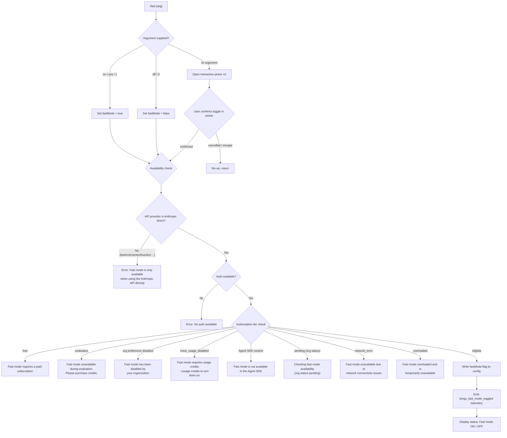

# `/fast`

> Analysis basis: CC v2.1.178 bundle.js (AST extraction + Claude interpretation)
> Minimum version: v2.1.178

---

## Overview

`/fast` toggles Fast mode — a research-preview inference feature that uses a higher-priority, lower-latency serving path. The command accepts an optional `on` or `off` argument; when omitted it opens an interactive picker. Availability is gated by API provider, subscription tier, organizational policy, and real-time network status, all evaluated before any state change is applied.

---

## Registration

| Field | Value |
|---|---|
| type | `local-jsx` |
| name | `fast` |
| description | `Toggle fast mode ( ... )` |
| argumentHint | `[on\|off]` |
| thinClientDispatch | `control-request` |
| immediate | `null` |
| isHidden | `null` |
| module_id | `$JK` |
| load_inline | `true` |
| loc_byte | `12828999` |
| loc_byte_end | `12829271` |
| loc_line | `8784` |
| arbor_handler.name | `S_5` |
| arbor_handler.fqn | `claude-2.1.178::S_5` |
| arbor_handler.kind | `AsyncFunction` |
| arbor_handler.resolution_path | `module_id` |
| arbor_handler.n_hits | `3` |

Analysis basis: CC v2.1.178 bundle.js:+12828999

---

## Input Branching

The command has more than three distinct paths — implicit toggle (no argument), explicit `on`/`off`, and multiple availability-gate rejections — so a Mermaid flowchart is used.



Analysis basis: CC v2.1.178 bundle.js:+12828999, +2255677, +2255745, +2256099, +2256169, +2255196, +2255237, +2255328, +2255412, +2255509, +2255588, +12827208

---

## Behavioral Spec

### Handler Entry — `fastModeCommandHandler` (`S_5`)

`S_5` is an `AsyncFunction` resolved via `module_id` (`$JK`). It is the primary handler for `/fast`.

```
async function fastModeCommandHandler(context):
    telemetry.emit("tengu_fast_mode_picker_shown")   // deferred until picker opens

    rawArg = context.argument?.trim().toLowerCase()

    if rawArg is "on" or "yes" or "1":
        targetState = true
    else if rawArg is "off" or "0":
        targetState = false
    else:
        targetState = await openFastModePickerUI()   // interactivePickerComponent
        if targetState is null:
            return   // user cancelled

    availabilityResult = await checkFastModeAvailability(context)
    if availabilityResult.blocked:
        displayError(availabilityResult.message)
        return

    await writeFastModeFlag(targetState)
    telemetry.emit("tengu_fast_mode_toggled")
    displayStatus(targetState ? "Fast mode ON" : "Fast mode OFF")
```

Analysis basis: CC v2.1.178 bundle.js:+12828011, +12828013, +12828061, +12828133, +12828237, +12828298

---

### Availability Gate — `fastModeAvailabilityCheck` (`hAH`)

`hAH` evaluates all blocking conditions before any config write occurs.

```
function fastModeAvailabilityCheck(appState):
    provider = getCurrentProvider()   // S_ / L6

    // Provider gate
    if provider in ["bedrock", "vertex", "foundry", "anthropicAws", "mantle", "firstParty"]:
        if provider is not direct Anthropic API:
            return blocked("Fast mode is only available when using the Anthropic API directly")

    // SDK context gate
    if runningInAgentSDK():
        return blocked("Fast mode is not available in the Agent SDK")

    // Auth gate
    auth = resolveAuth()
    if auth is null:
        return blocked("No auth available")

    // Org / subscription status (from prefetched org state)
    orgStatus = getOrgFastModeStatus()   // O6 / iS result

    switch orgStatus:
        case "free":
            return blocked("Fast mode requires a paid subscription")
        case "evaluation":
            return blocked("Fast mode unavailable during evaluation. Please purchase credits.")
        case "preference":   // org-disabled
            return blocked("Fast mode has been disabled by your organization")
        case "extra_usage_disabled":
            return blocked("Fast mode requires usage credits · /usage-credits to turn them on")
        case "pending":
            return blocked("Checking fast mode availability (org status pending)")
        case "network_error":
            return blocked("Fast mode unavailable due to network connectivity issues")
        case "overloaded":
            return blocked("Fast mode overloaded and is temporarily unavailable")
        default:
            return allowed()
```

Analysis basis: CC v2.1.178 bundle.js:+2255170, +2255237, +2255309, +2255383, +2255509, +2255588, +2255677, +2255745, +2256099, +2256230, +2256261, +2256424

---

### Org Status Prefetch — `orgFastModePrefetch` (`XrH`)

The availability check relies on a prefetched org status. `XrH` manages the in-flight promise and a recency guard.

```
async function orgFastModePrefetch(context):
    // Return cached in-flight promise if already running
    if prefetchInFlight:
        log("Fast mode prefetch in progress, returning in-flight promise")
        return inFlightPromise

    // Skip if fetched recently
    if Date.now() - lastFetchTime < RECENCY_THRESHOLD:
        log("Skipping fast mode prefetch, fetched recently")
        return cachedResult

    // Resolve auth headers
    authHeaders = resolveAuthHeaders()   // RGf / k1
    if authHeaders is null:
        return {status: "network_error", reason: "No auth available"}

    try:
        response = await fetchOrgStatus(authHeaders)   // iS / Xlf path

        // Handle 401 / 403
        if response.status == 401 or response.status == 403:
            handleOAuthRecovery()
            return {status: "network_error"}

        return parseOrgStatus(response)
    catch error:
        telemetry.emit("tengu_org_penguin_mode_fetch_failed")
        return {status: "network_error"}
```

Analysis basis: CC v2.1.178 bundle.js:+2259786, +2259875, +2260095, +2260122, +2260298, +2260326, +2260391, +2261294

---

### Interactive Picker UI — `fastModePickerComponent` (`Ac8`)

When no argument is supplied, `Ac8` renders a React JSX component that displays the current Fast mode state and lets the user toggle it interactively.

```
function fastModePickerComponent(props):
    [confirmed, setConfirmed] = useState(false)

    // Display current state
    currentLabel = props.fastMode ? "ON " : "OFF"

    // Keyboard handlers
    on "tab":      cycleMode()
    on "toggle":   toggle()
    on "enter":    confirm()
    on "escape" or "cancel": cancel()

    // Sections rendered
    render:
        header: " Fast mode (research preview)"
        body:   currentLabel + statusDetail
        footer: keyboardHints

    // Status detail variants
    if status == "overloaded":
        show "Fast mode overloaded and is temporarily unavailable"
    else if rateLimitHit:
        show "You've hit your fast limit · resets in " + countdown
    else:
        show link "https://code.claude.com/docs/en/fast-mode"

    on confirm:
        if !targetState:
            emit "Kept Fast mode OFF"
        return targetState
```

Analysis basis: CC v2.1.178 bundle.js:+12824738, +12824839, +12824871, +12825654, +12826097, +12826260, +12826967, +12827036, +12827042, +12827208, +12827262, +12827291, +12827482, +12828239

---

### Config Write — `writeFastModeFlag` (`_c8` → `Hc8`)

```
async function writeFastModeFlag(targetState):
    // Apply flag settings via flagSettings key
    flagKey = "flagSettings"
    flagValue = { fastMode: targetState }

    // Write to settings store (Hc8 → YVH)
    await applyFlagSettings(flagKey, flagValue)

    // Notify appState listeners
    emitStateChange("fastMode", targetState)

    telemetry.emit("tengu_fast_mode_toggled")
```

The `"fastMode"` key is written at `loc_byte` 12823386. The enclosing `"flagSettings"` key is at `loc_byte` 2256030.

Analysis basis: CC v2.1.178 bundle.js:+12824232, +12824307, +12824318, +12823386, +2256030

---

### Opus 4.6 Sunset Handling — `sunsetOpus46FastMode` (`cS1`)

A sunset/deprecation path (`"opus46-fast-mode-deprecation"`) is active in this version. If the model is one of the opus-4-6 variants (`opus-4-6`, `opus-4-7`, `opus-4-8`) and Fast mode is being enabled, a deprecation event fires.

```
function sunsetOpus46FastMode(model, fastModeTarget):
    SUNSET_MODELS = ["opus-4-6", "opus-4-7", "opus-4-8"]

    if model in SUNSET_MODELS and fastModeTarget == true:
        telemetry.emit("tengu_sunset_penguin_opus46")
        showDeprecationNotice("Opus 4.8")

    // Cooldown logic
    if cooldownActive:
        log("Fast mode cooldown expired, re-enabling fast mode")
        re-enable after cooldown
```

Analysis basis: CC v2.1.178 bundle.js:+12823704, +2256955, +2256979, +2257003, +2256669, +2257083, +2257312, +2257365

---

### Shortcut Dispatch — `fastModeShortcut`

A `"shortcut"` dispatch path is registered (literal at +12828174), allowing the `/fast` toggle to be triggered from keyboard shortcuts in the TUI without going through the full slash-command parse path. The `thinClientDispatch` field value `"control-request"` means thin clients relay this command as a control message rather than executing it locally.

Analysis basis: CC v2.1.178 bundle.js:+12828174, registration field `thinClientDispatch`

---

## State & Side Effects

| Item | Detail |
|---|---|
| Telemetry: `tengu_fast_mode_toggled` | Fired on every successful state change (loc_byte: 12824318) |
| Telemetry: `tengu_fast_mode_picker_shown` | Fired when the interactive picker UI is rendered (loc_byte: 12828239) |
| Telemetry: `tengu_org_penguin_mode_fetch_failed` | Fired when the org-status prefetch network request fails (loc_byte: 2261294) |
| Telemetry: `tengu_penguins_off` | Fired when Fast mode is explicitly turned off (loc_byte: 2255783) |
| Telemetry: `tengu_sunset_penguin_opus46` | Fired when Fast mode toggle touches a sunset Opus 4.6/4.7/4.8 model (loc_byte: 2257083) |
| Telemetry: `tengu_config_parse_error` | Fired if the config file cannot be parsed during prefetch or write (loc_byte: 3351487) |
| Telemetry: `tengu_config_lock_contention` | Fired if config write lock is contested (loc_byte: 3348912) |
| Telemetry: `tengu_config_stale_write` | Fired if a stale-auth write is attempted (loc_byte: 3349048) |
| Telemetry: `tengu_config_auth_loss_prevented` | Fired when a write that would erase auth credentials is blocked (loc_byte: 3349391) |
| Telemetry: `tengu_config_fallback_write` | Fired when falling back to an alternative write path (loc_byte: 3348528) |
| Telemetry: `tengu_feature_ok` / `tengu_feature_bad` / `tengu_feature_sad` | Feature-flag outcome events (loc_bytes: 1020153, 1020220, 1020301) |
| appState changes | `fastMode` boolean key in `flagSettings` written to `~/.claude/settings.json` or local settings |
| Config keys written | `"flagSettings"` → `{ "fastMode": true/false }` (also `"cacheBreakerPhrase"`, `"briefTranscript"`, `"model"`, `"autoCompactWindow"` are in the same settings shape) |
| Prefetch side effect | `XrH` fires a network request to the Anthropic API to retrieve org Fast mode status; result cached with recency guard |
| Cooldown tracking | A `"cooldown"` state key is set when Fast mode is temporarily suspended; expiry re-enables it automatically |
| Hook registration | `bA` registers keyboard handlers via `K.registerHandler` on mount of the picker component |
| Deprecation notice | Shown when toggling Fast mode on for sunset Opus 4.x models |
| Sound | None observed in depth-2 traversal |

---

## Version History

| Version | Change |
|---|---|
| v2.1.178 | Initial analysis. Fast mode available as research preview; Opus 4.6/4.7/4.8 deprecation path active; interactive picker UI; `thinClientDispatch: "control-request"`. |

---

## Common Mistakes

1. **Passing an unrecognised argument** — Only `on`, `off`, `yes`, `1`, `0` are parsed; any other string opens the picker rather than producing an explicit on/off action.
2. **Expecting Fast mode on non-Anthropic API providers** — Fast mode is hard-blocked for Bedrock, Vertex, Foundry, and other third-party providers; the error message "Fast mode is only available when using the Anthropic API directly" is returned immediately (bundle.js:+2255677).
3. **Using Fast mode in the Agent SDK** — A distinct block path returns "Fast mode is not available in the Agent SDK" (bundle.js:+2256099, +2256169); this is separate from the provider check.
4. **Assuming immediate availability on a free account** — The `"free"` subscription tier is explicitly blocked with "Fast mode requires a paid subscription" (bundle.js:+2255196).
5. **Ignoring the `pending` state** — If the org status API has not yet resolved, the command returns "Checking fast mode availability (org status pending)" rather than proceeding; callers should retry.
6. **Writing `fastMode` directly to config** — The correct key hierarchy is `flagSettings.fastMode`; writing `fastMode` at the top level of settings will be ignored.
7. **Expecting Fast mode on Opus 4.6/4.7/4.8** — These models have an active sunset path (`"opus46-fast-mode-deprecation"`) that fires a deprecation notice and the `tengu_sunset_penguin_opus46` telemetry event.

---

## Appendix — Identifier Mapping

> For bundle debugging only. Identifiers change across versions.

| Identifier | Role |
|---|---|
| `S_5` | Main handler async function for `/fast` (arbor_handler) |
| `V4` | App-state getter utility |
| `S_` | Provider/model resolution helper |
| `L6` | String-formatting / display utility |
| `hAH` | Fast mode availability gate evaluator |
| `O6` | Org status fetcher / subscription-tier resolver |
| `vG6` | Org status field extractor A |
| `NG6` | Org status field extractor B |
| `Xp` | Subscription tier checker |
| `qp` | Experiment / feature-flag evaluator |
| `o$8` | Org status cache lookup |
| `p0_` | GrowthBook experiment event emitter |
| `ay_` | Async org-state updater |
| `S6` | Config persistence layer (read/write settings file) |
| `n6` | Logger utility |
| `_MH` | Low-level config file reader (readFileSync path) |
| `wnf` | Config file watcher registration |
| `N` | Logging / debug output helper |
| `AM4` | Auth method resolver |
| `WSA` | OAuth token provider |
| `xH` | JSON serialiser wrapper |
| `d4` | Model-name normaliser / redactor |
| `sCA` | Model alias map builder |
| `LM4` | Transcript / conversation log writer |
| `sQH` | Debounced log flusher |
| `G7H` | Log file path builder |
| `INH` | Log size guard |
| `_bA` | Log path join helper |
| `P__` | Log rotation helper |
| `fM4` | Async log append helper |
| `F9` | Signal / event bus registration |
| `JK` | Slash-command context / argument parser |
| `vj6` | Command argument validator |
| `geA` | Argument filter |
| `FeA` | Argument builder |
| `Nj6` | Command alias resolver |
| `oDH` | Remote-settings lookup |
| `pb` | Policy / permission builder |
| `MAH` | Model access helper |
| `Ej6` | Command permission evaluator |
| `q4` | Model name re-writer |
| `xGK` | CLI argument expander |
| `KkH` | Model block-list checker |
| `uN` | Model allow-list checker |
| `_48` | Argument dispatch router |
| `Y1` | Model alias resolver (string → canonical model ID) |
| `iX6` | Inline model-override parser |
| `LR1` | Entry-point argument mapper |
| `b8` | Policy settings extractor |
| `K68` | Policy settings parser |
| `iiH` | Environment variable extractor |
| `d_` | Settings field extractor |
| `fR1` | Fast-mode flag reader |
| `FGf` | Full argument parse pipeline |
| `qR1` | Argument indexOf helper |
| `gGf` | Argument prefix matcher |
| `KR1` | startsWith argument checker |
| `HkH` | Model picker initialiser |
| `gJ` | Model picker UI component |
| `QLH` | Model list formatter |
| `dLH` | Model tier display helper |
| `ZA` | Picker selection renderer |
| `Yq` | Picker keyboard handler |
| `d1` | Conversation state initialiser |
| `In` | Session context builder |
| `kO` | Keybinding registration for picker |
| `RW` | Keybinding lookup |
| `Ij` | Platform / environment detector |
| `z7` | Environment variable reader |
| `YNH` | Env-var name constant map |
| `L3` | Fast mode state reader from appState |
| `om` | Output message formatter |
| `R_` | Client type checker (claude-vscode etc.) |
| `cQH` | Client context resolver |
| `eK8` | Fast mode eligibility pre-check |
| `IGf` | Info display renderer |
| `XrH` | Org status prefetch async function |
| `uP_` | Prefetch prerequisite checker |
| `qq` | HTTP request builder |
| `biA` | Request URL builder |
| `hW` | Auth header assembler |
| `SO` | Anthropic API HTTP client |
| `vL` | Base URL resolver |
| `fv` | Request body serialiser |
| `OG6` | API endpoint path builder |
| `tP` | Request timeout manager |
| `XX6` | API key file-descriptor reader |
| `Qj` | Auth strategy selector |
| `E4` | Auth error classifier |
| `nb` | Response body slicer |
| `bT` | Response content-type checker |
| `RGf` | Auth header builder for fast-mode API call |
| `k1` | OAuth base-URL resolver |
| `iS` | In-flight prefetch promise manager |
| `Xlf` | Org status HTTP response parser |
| `x79` | Retry backoff calculator |
| `V$` | Token refresh scheduler |
| `YA` | Settings load/save coordinator |
| `a3` | Settings file path builder |
| `aDH` | Settings directory path helper |
| `yM_` | Settings merge utility |
| `ZeA` | Settings schema validator |
| `QF` | Settings field merger |
| `TeA` | SDK inline settings applier |
| `XW` | Gitignore integration for settings files |
| `Fs` | Settings file reader with gitignore check |
| `x8` | Atomic file writer |
| `Z8` | JSON parse with error handling |
| `m5_` | Settings timestamp updater |
| `YyH` | Settings path resolver |
| `A68` | Settings file path constants |
| `ED6` | Atomic write with permissions preservation |
| `Oz` | Settings cache invalidator |
| `zH8` | Gitignore checker |
| `u6` | Gitignore rule loader |
| `G5_` | Git executable finder |
| `OH8` | Gitignore rule evaluator A |
| `Fl4` | Gitignore rule evaluator B (home-dir tilde expansion) |
| `TsA` | Gitignore rule evaluator C |
| `EsA` | Gitignore append helper |
| `pm` | Settings `.claude` path joiner |
| `W_` | Async file write with retry |
| `d6` | Settings read-back verifier |
| `dH` | Low-level config object accessor |
| `dF` | Settings persistence dispatcher |
| `GT` | Settings dirty-flag tracker |
| `Oq` | Memory-usage telemetry emitter |
| `kM_` | Full settings load pipeline |
| `Bl6` | Settings write debouncer |
| `W8` | Global config save function |
| `wO8` | Config save with lock |
| `tR1` | Config object assignment helper |
| `JsH` | Config post-write hook |
| `zk_` | Backup directory path builder |
| `gXH` | Config diff logger |
| `PL9` | Config entry serialiser |
| `CG6` | Config write timestamp recorder |
| `YO8` | Config write with auth-loss guard |
| `_c8` | Fast mode flag write dispatcher |
| `Hc8` | Flag settings applier |
| `DJH` | Deprecation notice display |
| `YVH` | Flag value type coercer (String/Number/Boolean) |
| `zVH` | TUI component renderer for fast mode result |
| `Pp` | Theme resolver |
| `Mz8` | Theme list checker |
| `Qg` | Theme name parser |
| `iM9` | Theme colour resolver |
| `Mf` | Legacy global config migrator |
| `hN` | MCP server set tracker |
| `QM_` | Settings path resolver for migration |
| `mA` | ANSI colour theme applicator |
| `OPH` | ANSI colour code mapper |
| `Ji` | Colour palette helper |
| `rS` | Token count formatter |
| `AR1` | Integer / decimal formatter |
| `_kH` | Model display name formatter |
| `f1` | Model string normaliser |
| `nz` | Model name sanitiser |
| `sL` | Model string replacer |
| `iJA` | Deprecation / sunset notice component |
| `cS1` | Opus-4.6 sunset fast mode handler |
| `Ac8` | Fast mode interactive picker JSX component |
| `z6` | App state context hook |
| `lC_` | AppStateProvider context accessor |
| `Q9` | MCP connection manager React component |
| `n4` | MCP state selector A |
| `TA` | MCP state selector B |
| `b1` | Clock context accessor |
| `P_7` | MCP permission reducer |
| `M` | MCP manager top-level component |
| `ebH` | MCP server connection runner |
| `UQ` | MCP server slot initialiser |
| `BZ` | MCP connection result handler |
| `i8` | MCP tool registry helper |
| `ch6` | MCP channel builder |
| `Te9` | MCP server ping/health checker |
| `o28` | MCP request dispatcher |
| `n28` | MCP request timeout setter |
| `Y8` | MCP debug logger |
| `I08` | MCP OAuth flow handler |
| `S08` | MCP OAuth callback handler |
| `Ie9` | MCP server reconnect scheduler |
| `pc_` | MCP connection state updater |
| `j` | MCP subprocess manager |
| `Nh` | MCP skills telemetry emitter |
| `Ec_` | MCP config watcher |
| `k` | MCP focus/blur tracker |
| `$7` | MCP error logger |
| `TH` | String coercion utility |
| `Ne9` | MCP zod schema validator |
| `z_6` | MCP port parseInt helper A |
| `IG8` | MCP port parseInt helper B |
| `hs8` | MCP connection result applier |
| `tbH` | MCP z0H state updater |
| `RG` | MCP server cleanup dispatcher |
| `INA` | MCP server manager reconciler |
| `j08` | MCP server auth-state checker |
| `o8` | Async timeout/abort utility |
| `$_6` | MCP server z0H state resetter |
| `ZJ9` | Picker scroll state |
| `z` | Session shutdown orchestrator |
| `AR` | Conversation message appender |
| `pkH` | Experiment bucket evaluator |
| `m0_` | New conversation message builder |
| `aB` | Process exit orchestrator |
| `f5H` | Subprocess shutdown caller |
| `L5H` | Shutdown timeout clearer |
| `DE6` | useEffect cleanup for picker |
| `CP_` | Fast mode cooldown expiry handler |
| `H6` | Config constant accessor |
| `c36` | Low-level config constant map |
| `bA` | Global keyboard handler registrar |
| `QD` | Settings context accessor |
| `g9` | Time countdown formatter (for rate-limit reset display) |

---

Note: index built via Arbor fallback; some signals (telemetry, literals) may be missing — see arbor-fallback.js.